# LAIF Template — Baseline di Riferimento

> **Versione template**: `5.7.0` (da `version.laif-template.txt`)
> **Versione values.yaml**: `1.1.0`
> **Branch analizzato**: `develop`
> **Data analisi**: 2026-03-21
> **Python**: `>=3.12, <3.13`
> **PostgreSQL**: 17.6 (con pgvector)

Questo documento elenca **tutto** cio che il template fornisce out-of-the-box. Ogni progetto derivato va confrontato contro questa baseline per capire cosa e custom e cosa viene dal template.

---

## 1. Struttura generale del repository

```
laif-template/
├── backend/
│   ├── src/template/           ← codice template (package Python)
│   ├── pyproject.toml          ← dipendenze backend
│   ├── envs/                   ← file .env (dev, common, test, e2e)
│   └── Dockerfile
├── frontend/
│   ├── src/                    ← sorgenti frontend
│   └── package.json
├── db/
│   ├── Dockerfile              ← PostgreSQL 17.6 + pgvector
│   └── init-enums-e2e.sql
├── tooling/                    ← Justfile modules
├── docker-compose.yaml         ← dev standard (db + backend)
├── docker-compose.template.yaml← template con placeholder ${{ }}
├── docker-compose.wolico.yaml  ← con rete condivisa Wolico
├── docker-compose.e2e.yaml     ← ambiente E2E test
├── docker-compose.debug.yaml
├── docker-compose.test.yaml
├── values.yaml                 ← configurazione progetto
├── Justfile                    ← entry point comandi
├── version.txt                 ← 5.7.0
└── version.laif-template.txt   ← 5.7.0
```

---

## 2. Schemi database

Il template usa **3 schemi PostgreSQL**:

| Schema | Scopo |
|--------|-------|
| `template` | Tabelle core: user management, ticketing, notifiche, task, file handling, API tracing |
| `demo` | Tabelle chat/AI: conversations, threads, collections, documents, feedbacks, system instructions |
| `prs` | Schema default per le tabelle applicative custom (definito in `LaifBase.__table_args__`) |

---

## 3. TUTTE le tabelle del template

### 3.1 Schema `template` — User Management

#### `template.users`
| Colonna | Tipo | Note |
|---------|------|------|
| id | int PK | auto-increment |
| email | str | unique, index |
| password | str? | nullable |
| api_key | str? | nullable |
| last_api_key_values | str? | nullable |
| name | str | |
| surname | str | |
| dat_connection | date | server_default=now() |
| flg_valid | bool? | server_default=false |
| id_business | int FK | -> template.business.id |
| created_at | datetime(tz) | VersionedMixin |
| updated_at | datetime(tz) | VersionedMixin |
| deleted_at | datetime(tz)? | VersionedMixin |
| flg_deleted | bool | VersionedMixin, default=false |

**Hybrid properties**: `full_name`, `has_api_key`
**Column properties**: `roles_ids` (array int[]), `flg_ever_logged` (bool, da logins)
**Relationships**: user_roles, user_permissions, user_groups, user_registrations, business

#### `template.business`
| Colonna | Tipo | Note |
|---------|------|------|
| id | int PK | |
| name | str | |
| address | str? | |
| description | str? | |

**Hybrid property**: `users_count`

#### `template.roles`
| Colonna | Tipo | Note |
|---------|------|------|
| id | int PK | |
| name | str | unique, index |
| description | str? | |

**Column property**: `ids_permission` (array da role_permission)
**Hybrid property**: `users_count`

#### `template.permissions`
| Colonna | Tipo | Note |
|---------|------|------|
| id | int PK | |
| name | str | |
| scope | str | unique |

**Hybrid properties**: `users_count`, `roles_count`, `groups_count`

#### `template.groups`
| Colonna | Tipo | Note |
|---------|------|------|
| id | int PK | |
| name | str | |

#### Tabelle di join (schema `template`)

| Tabella | Colonne FK | Unique constraint |
|---------|-----------|-------------------|
| `role_permission` | id_role -> roles, id_permission -> permissions | (id_role, id_permission) |
| `user_permission` | id_user -> users, id_permission -> permissions | (id_permission, id_user) |
| `user_role` | id_user -> users, id_role -> roles | (id_role, id_user) |
| `user_group` | id_user -> users, id_group -> groups | (id_group, id_user) |
| `group_permission` | id_group -> groups, id_permission -> permissions | (id_group, id_permission) |

#### `template.user_registrations`
| Colonna | Tipo | Note |
|---------|------|------|
| id | int PK | |
| id_user | int FK | -> users |
| token | str | |
| tms_expiration | datetime | |

### 3.2 Schema `template` — Ticketing

#### `template.tickets`
| Colonna | Tipo | Note |
|---------|------|------|
| id | int PK | |
| des_title | str | |
| id_user | int FK | -> users |
| cod_category | TicketCategory enum | data_not_updated, incorrect_data, incorrect_behavior, visibility_issue |
| cod_status | TicketStatus enum | open, work_in_progress, feature, waiting_customer, solved, closed |
| cod_gravity | TicketGravity enum | low, medium, high |
| dat_creation | datetime | server_default=now() |
| dat_update | datetime | server_default=now(), onupdate=now() |
| flg_upload_wolico | bool | default=false |

**Column properties**: `id_business` (da user), `des_filter` (aggregato da messaggi)
**Hybrid property**: `messages_count`

#### `template.ticket_messages`
| Colonna | Tipo | Note |
|---------|------|------|
| id | int PK | |
| id_ticket | int FK | -> tickets, CASCADE |
| user_name | str | |
| user_surname | str | |
| user_email | str | |
| user_business | str | |
| des_message | str | |
| dat_creation | datetime | server_default=now() |
| flg_upload_wolico | bool | default=false |

#### `template.ticket_attachments`
| Colonna | Tipo | Note |
|---------|------|------|
| id | int PK | |
| id_message | int FK | -> ticket_messages, CASCADE |
| des_name | str | |
| des_url | str? | nullable |
| dat_creation | datetime | server_default=now() |
| flg_upload_wolico | bool | default=false |

#### `template.ticket_updates`
| Colonna | Tipo | Note |
|---------|------|------|
| id | int PK | |
| id_ticket | int FK | -> tickets, CASCADE |
| user_name | str | |
| user_surname | str | |
| user_email | str | |
| user_business | str | |
| cod_status | TicketStatus enum | |
| cod_gravity | TicketGravity enum | default=low |
| dat_update | datetime | server_default=now() |
| flg_upload_wolico | bool | default=false |

#### `template.faq_sections`
| Colonna | Tipo | Note |
|---------|------|------|
| id | int PK | |
| name | str | |
| cod_order | int | |

#### `template.faq`
| Colonna | Tipo | Note |
|---------|------|------|
| id | int PK | |
| id_section | int FK | -> faq_sections, CASCADE |
| question | str | |
| answer | str | |
| cod_order | int | |

### 3.3 Schema `template` — Notifiche

#### `template.notifications`
| Colonna | Tipo | Note |
|---------|------|------|
| id | int PK | |
| id_user | int FK | -> users, CASCADE |
| des_title | str | |
| des_description | str? | nullable |
| des_action_url | str? | nullable |
| flg_is_read | bool | default=false |
| tms_created | datetime | server_default=now() |

### 3.4 Schema `template` — Task

#### `template.runtasks`
| Colonna | Tipo | Note |
|---------|------|------|
| uid | int PK | unique, index |
| kind | str | |
| title | str | |
| status | str | |
| description | str | |
| dict_params | JSON | |
| tms_start | datetime | |
| tms_end | datetime | |

Nota: `RunTask` estende `Base` (non `LaifBase`), non ha soft delete.

### 3.5 Schema `template` — API Call Tracing

#### `template.api_call_traces`
| Colonna | Tipo | Note |
|---------|------|------|
| id | int PK | |
| id_user | int? FK | -> users, SET NULL |
| des_endpoint | str | |
| des_method | str | |
| des_body | JSON? | nullable |
| cod_status | int? | nullable |
| dat_request | datetime | server_default=now() |

### 3.6 Schema `template` — File Handling (nuovo sistema)

#### `template.logical_files`
| Colonna | Tipo | Note |
|---------|------|------|
| id | int PK | |
| name | str(255) | index |
| description | text? | |
| id_current_version | int? FK | -> immutable_file_versions |
| dat_created | datetime | server_default=now() |
| dat_updated | datetime | server_default=now(), onupdate |
| id_user_created | int? FK | -> users |
| id_user_updated | int? FK | -> users |
| flg_deleted | bool | default=false |
| dat_deleted | datetime? | |
| id_user_deleted | int? FK | -> users |

#### `template.blobs`
| Colonna | Tipo | Note |
|---------|------|------|
| content_hash | str(64) PK | SHA-256, deduplication |
| hash_algorithm | str(50) | default=sha256 |
| s3_bucket | str(255) | |
| s3_key | str(1024) | index |
| content_type | str(255) | |
| file_size | int | bytes |
| reference_count | int | default=1 |
| dat_created | datetime | server_default=now() |
| dat_updated | datetime | server_default=now(), onupdate |
| flg_deleted | bool | default=false |
| dat_deleted | datetime? | |

#### `template.immutable_file_versions`
| Colonna | Tipo | Note |
|---------|------|------|
| id | int PK | |
| id_logical_file | int FK | -> logical_files, CASCADE |
| id_blob | str(64) FK | -> blobs.content_hash, RESTRICT |
| version_number | int | |
| original_filename | str(255) | |
| description | text? | |
| dat_created | datetime | server_default=now() |
| id_user_created | int? FK | -> users |
| flg_deleted | bool | default=false |
| dat_deleted | datetime? | |
| id_user_deleted | int? FK | -> users |

### 3.7 Schema `demo` — Chat AI / RAG

#### `demo.conversations`
| Colonna | Tipo | Note |
|---------|------|------|
| id | int PK | |
| des_name | str | |
| dat_creation | datetime | server_default=now() |
| flg_favourite | bool | default=false |
| id_user | int FK | -> template.users |
| flg_disabled | bool | default=false |
| id_symboolic | str? | nullable |
| id_collection | int? FK | -> demo.collections, CASCADE |

#### `demo.threads`
| Colonna | Tipo | Note |
|---------|------|------|
| id | int PK | |
| des_sender | SenderType enum | user, bot |
| des_message | str | |
| dat_sent | datetime | server_default=now() |
| id_conversation | int FK | -> demo.conversations, CASCADE |
| id_response | str? | nullable, unique |
| id_user | int FK | -> template.users |
| citations | JSON? | list[dict], nullable |

#### `demo.collections`
| Colonna | Tipo | Note |
|---------|------|------|
| id | int PK | |
| des_name | str | |
| dat_creation | date | server_default=now() |
| id_business | int FK | -> template.business |
| id_symboolic | str? | nullable |
| id_vectorstore_openai | str? | nullable |

#### `demo.documents`
| Colonna | Tipo | Note |
|---------|------|------|
| id | int PK | |
| des_name | str | |
| des_url | str? | nullable |
| des_url_pdf | str? | nullable |
| dat_creation | datetime | server_default=now() |
| id_collection | int FK | -> demo.collections, CASCADE |
| id_user | int FK | -> template.users |
| id_openai | str? | nullable |
| id_feedback | int? FK | -> demo.feedbacks, CASCADE |
| id_section | int FK | -> demo.document_sections |
| des_status | DocumentStatus enum | loading, error, success |
| cod_order | int | |
| flg_chat | bool | default=false |

#### `demo.document_pages`
| Colonna | Tipo | Note |
|---------|------|------|
| id | int PK | |
| id_document | int FK | -> demo.documents, CASCADE |
| des_text | str | |
| page_number | int | |

#### `demo.document_sections`
| Colonna | Tipo | Note |
|---------|------|------|
| id | int PK | |
| name | str | |
| cod_order | int | |

**Column property**: `document_names_filter`

#### `demo.feedbacks`
| Colonna | Tipo | Note |
|---------|------|------|
| id | int PK | |
| id_thread | int FK | -> demo.threads, CASCADE |
| id_user | int FK | -> template.users |
| flg_positive | bool | |
| des_status | StatusType enum | open, closed |
| des_question | str | |
| des_answer | str | |
| des_solution | str? | nullable |
| issue_resolved | bool? | nullable |
| response_accuracy | int? | nullable |

#### `demo.system_instructions` (con HistorizedMixin)
| Colonna | Tipo | Note |
|---------|------|------|
| id | int PK | |
| des_title | str | |
| des_instruction | str | **versionata** |
| dat_creation | datetime | server_default=now() |
| id_collection | int FK | -> demo.collections, CASCADE |
| entity_id | int? | HistorizedMixin |
| valid_from | datetime(tz) | HistorizedMixin |
| valid_to | datetime(tz)? | HistorizedMixin |
| is_current | bool | HistorizedMixin, default=true |

#### `demo.logins`
| Colonna | Tipo | Note |
|---------|------|------|
| id | int PK | |
| id_user | int FK | -> template.users, CASCADE |
| dat_login | datetime | server_default=now() |

---

## 4. Diagramma ER (Mermaid)

```mermaid
erDiagram
    %% === SCHEMA TEMPLATE - USER MANAGEMENT ===
    BUSINESS {
        int id PK
        str name
        str address
        str description
    }
    USERS {
        int id PK
        str email UK
        str password
        str api_key
        str last_api_key_values
        str name
        str surname
        date dat_connection
        bool flg_valid
        int id_business FK
        datetime created_at
        datetime updated_at
        datetime deleted_at
        bool flg_deleted
    }
    ROLES {
        int id PK
        str name UK
        str description
    }
    PERMISSIONS {
        int id PK
        str name
        str scope UK
    }
    GROUPS {
        int id PK
        str name
    }
    USER_ROLE {
        int id PK
        int id_user FK
        int id_role FK
    }
    USER_PERMISSION {
        int id PK
        int id_user FK
        int id_permission FK
    }
    USER_GROUP {
        int id PK
        int id_user FK
        int id_group FK
    }
    ROLE_PERMISSION {
        int id PK
        int id_role FK
        int id_permission FK
    }
    GROUP_PERMISSION {
        int id PK
        int id_group FK
        int id_permission FK
    }
    USER_REGISTRATIONS {
        int id PK
        int id_user FK
        str token
        datetime tms_expiration
    }

    BUSINESS ||--o{ USERS : "ha"
    USERS ||--o{ USER_ROLE : ""
    ROLES ||--o{ USER_ROLE : ""
    USERS ||--o{ USER_PERMISSION : ""
    PERMISSIONS ||--o{ USER_PERMISSION : ""
    USERS ||--o{ USER_GROUP : ""
    GROUPS ||--o{ USER_GROUP : ""
    ROLES ||--o{ ROLE_PERMISSION : ""
    PERMISSIONS ||--o{ ROLE_PERMISSION : ""
    GROUPS ||--o{ GROUP_PERMISSION : ""
    PERMISSIONS ||--o{ GROUP_PERMISSION : ""
    USERS ||--o{ USER_REGISTRATIONS : ""

    %% === SCHEMA TEMPLATE - TICKETING ===
    TICKETS {
        int id PK
        str des_title
        int id_user FK
        enum cod_category
        enum cod_status
        enum cod_gravity
        datetime dat_creation
        datetime dat_update
        bool flg_upload_wolico
    }
    TICKET_MESSAGES {
        int id PK
        int id_ticket FK
        str user_name
        str user_surname
        str user_email
        str user_business
        str des_message
        datetime dat_creation
        bool flg_upload_wolico
    }
    TICKET_ATTACHMENTS {
        int id PK
        int id_message FK
        str des_name
        str des_url
        datetime dat_creation
        bool flg_upload_wolico
    }
    TICKET_UPDATES {
        int id PK
        int id_ticket FK
        str user_name
        str user_surname
        str user_email
        str user_business
        enum cod_status
        enum cod_gravity
        datetime dat_update
        bool flg_upload_wolico
    }
    FAQ_SECTIONS {
        int id PK
        str name
        int cod_order
    }
    FAQ {
        int id PK
        int id_section FK
        str question
        str answer
        int cod_order
    }

    USERS ||--o{ TICKETS : "crea"
    TICKETS ||--o{ TICKET_MESSAGES : ""
    TICKET_MESSAGES ||--o{ TICKET_ATTACHMENTS : ""
    TICKETS ||--o{ TICKET_UPDATES : ""
    FAQ_SECTIONS ||--o{ FAQ : ""

    %% === SCHEMA TEMPLATE - NOTIFICHE ===
    NOTIFICATIONS {
        int id PK
        int id_user FK
        str des_title
        str des_description
        str des_action_url
        bool flg_is_read
        datetime tms_created
    }
    USERS ||--o{ NOTIFICATIONS : ""

    %% === SCHEMA TEMPLATE - TASK ===
    RUNTASKS {
        int uid PK
        str kind
        str title
        str status
        str description
        json dict_params
        datetime tms_start
        datetime tms_end
    }

    %% === SCHEMA TEMPLATE - API TRACING ===
    API_CALL_TRACES {
        int id PK
        int id_user FK
        str des_endpoint
        str des_method
        json des_body
        int cod_status
        datetime dat_request
    }
    USERS ||--o{ API_CALL_TRACES : ""

    %% === SCHEMA TEMPLATE - FILE HANDLING ===
    LOGICAL_FILES {
        int id PK
        str name
        text description
        int id_current_version FK
        datetime dat_created
        datetime dat_updated
        int id_user_created FK
        int id_user_updated FK
        bool flg_deleted
    }
    BLOBS {
        str content_hash PK
        str hash_algorithm
        str s3_bucket
        str s3_key
        str content_type
        int file_size
        int reference_count
        bool flg_deleted
    }
    IMMUTABLE_FILE_VERSIONS {
        int id PK
        int id_logical_file FK
        str id_blob FK
        int version_number
        str original_filename
        text description
        datetime dat_created
        int id_user_created FK
        bool flg_deleted
    }

    LOGICAL_FILES ||--o{ IMMUTABLE_FILE_VERSIONS : "versioni"
    BLOBS ||--o{ IMMUTABLE_FILE_VERSIONS : "contenuto"
    LOGICAL_FILES ||--o| IMMUTABLE_FILE_VERSIONS : "current_version"

    %% === SCHEMA DEMO - CHAT AI ===
    COLLECTIONS {
        int id PK
        str des_name
        date dat_creation
        int id_business FK
        str id_symboolic
        str id_vectorstore_openai
    }
    CONVERSATIONS {
        int id PK
        str des_name
        datetime dat_creation
        bool flg_favourite
        int id_user FK
        bool flg_disabled
        str id_symboolic
        int id_collection FK
    }
    THREADS {
        int id PK
        enum des_sender
        str des_message
        datetime dat_sent
        int id_conversation FK
        str id_response
        int id_user FK
        json citations
    }
    DOCUMENTS {
        int id PK
        str des_name
        str des_url
        str des_url_pdf
        datetime dat_creation
        int id_collection FK
        int id_user FK
        str id_openai
        int id_feedback FK
        int id_section FK
        enum des_status
        int cod_order
        bool flg_chat
    }
    DOCUMENT_PAGES {
        int id PK
        int id_document FK
        str des_text
        int page_number
    }
    DOCUMENT_SECTIONS {
        int id PK
        str name
        int cod_order
    }
    FEEDBACKS {
        int id PK
        int id_thread FK
        int id_user FK
        bool flg_positive
        enum des_status
        str des_question
        str des_answer
        str des_solution
        bool issue_resolved
        int response_accuracy
    }
    SYSTEM_INSTRUCTIONS {
        int id PK
        str des_title
        str des_instruction
        datetime dat_creation
        int id_collection FK
        int entity_id
        datetime valid_from
        datetime valid_to
        bool is_current
    }
    LOGINS {
        int id PK
        int id_user FK
        datetime dat_login
    }

    BUSINESS ||--o{ COLLECTIONS : ""
    COLLECTIONS ||--o{ CONVERSATIONS : ""
    COLLECTIONS ||--o{ DOCUMENTS : ""
    COLLECTIONS ||--o{ SYSTEM_INSTRUCTIONS : ""
    CONVERSATIONS ||--o{ THREADS : ""
    THREADS ||--o{ FEEDBACKS : ""
    DOCUMENTS ||--o{ DOCUMENT_PAGES : ""
    DOCUMENT_SECTIONS ||--o{ DOCUMENTS : ""
    USERS ||--o{ CONVERSATIONS : ""
    USERS ||--o{ THREADS : ""
    USERS ||--o{ DOCUMENTS : ""
    USERS ||--o{ FEEDBACKS : ""
    USERS ||--o{ LOGINS : ""
```



---

## 5. TUTTE le API routes del template

### 5.1 Auth (`/auth`)
| Metodo | Path | Descrizione |
|--------|------|-------------|
| POST | `/auth/login` | Login con email/password, ritorna JWT |
| POST | `/auth/refresh-token` | Refresh del token JWT |
| POST | `/auth/verify` | Verifica validita token |

### 5.2 OAuth2 (`/oauth2`)
| Metodo | Path | Descrizione |
|--------|------|-------------|
| GET | `/oauth2/login` | Redirect a OAuth provider |
| GET | `/oauth2/callback` | Callback OAuth, ritorna token |

### 5.3 Users (`/users`)
| Metodo | Path | Descrizione |
|--------|------|-------------|
| GET | `/users/{item_id}` | Get by ID (RouterBuilder) |
| POST | `/users/search` | Search con paginazione (RouterBuilder) |
| PUT | `/users/{item_id}` | Update (RouterBuilder) |
| DELETE | `/users/{item_id}` | Delete (RouterBuilder) |
| POST | `/users/export` | Export XLSX/CSV (RouterBuilder) |
| POST | `/users/export-s3` | Export su S3 con presigned URL (RouterBuilder) |
| GET | `/users/myself/{id_user}` | Get dati utente corrente |
| POST | `/users/` | Create user (custom) |
| POST | `/users/api-key/{id_user}` | Crea API key per utente |
| DELETE | `/users/api-key/{id_user}` | Elimina API key utente |
| GET | `/users/registration/{id_user}` | Invia email registrazione |
| POST | `/users/validate` | Valida token registrazione |
| POST | `/users/validate-signup` | Signup con token validato |
| POST | `/users/password/forgot` | Richiesta reset password |
| POST | `/users/password/reset` | Reset password |

### 5.4 Roles (`/roles`)
| Metodo | Path | Descrizione |
|--------|------|-------------|
| GET | `/roles/{item_id}` | Get by ID |
| POST | `/roles/search` | Search |
| PUT | `/roles/{item_id}` | Update |
| POST | `/roles/` | Create |
| DELETE | `/roles/{item_id}` | Delete |

### 5.5 Permissions (`/permissions`)
| Metodo | Path | Descrizione |
|--------|------|-------------|
| GET | `/permissions/{item_id}` | Get by ID |
| POST | `/permissions/search` | Search |
| PUT | `/permissions/{item_id}` | Update |
| POST | `/permissions/` | Create |
| DELETE | `/permissions/{item_id}` | Delete |

### 5.6 Groups (`/groups`)
| Metodo | Path | Descrizione |
|--------|------|-------------|
| GET | `/groups/{item_id}` | Get by ID |
| POST | `/groups/search` | Search |
| PUT | `/groups/{item_id}` | Update |
| POST | `/groups/` | Create |
| DELETE | `/groups/{item_id}` | Delete |

### 5.7 Business (`/business`)
| Metodo | Path | Descrizione |
|--------|------|-------------|
| GET | `/business/{item_id}` | Get by ID |
| POST | `/business/search` | Search |
| PUT | `/business/{item_id}` | Update |
| POST | `/business/` | Create |
| DELETE | `/business/{item_id}` | Delete |

### 5.8 Associazioni User Management
| Prefix | Endpoints |
|--------|-----------|
| `/role_permission` | CRUD via RouterBuilder |
| `/user_permission` | CRUD via RouterBuilder |
| `/user_role` | CRUD via RouterBuilder |
| `/user_group` | CRUD via RouterBuilder |
| `/group_permission` | CRUD via RouterBuilder |

### 5.9 Ticketing (`/ticket`)
| Metodo | Path | Descrizione |
|--------|------|-------------|
| POST | `/ticket/search` | Search |
| GET | `/ticket/{item_id}` | Get by ID |
| DELETE | `/ticket/{item_id}` | Delete |
| POST | `/ticket/` | Create ticket (custom) |
| PUT | `/ticket/{item_id}` | Update ticket (custom) |
| POST | `/ticket/lost` | Lost ticket |
| GET | `/ticket/senders` | Distinct senders |

### 5.10 Ticket Messages (`/ticket_message`)
| Metodo | Path | Descrizione |
|--------|------|-------------|
| POST | `/ticket_message/search` | Search |
| GET | `/ticket_message/{item_id}` | Get by ID |
| DELETE | `/ticket_message/{item_id}` | Delete |
| POST | `/ticket_message/` | Create (custom) |
| PUT | `/ticket_message/{item_id}` | Update (custom) |

### 5.11 Ticket Attachments (`/ticket_attachment`)
| Metodo | Path | Descrizione |
|--------|------|-------------|
| POST | `/ticket_attachment/search` | Search |
| GET | `/ticket_attachment/{item_id}` | Get by ID |
| GET | `/ticket_attachment/download/{item_id}` | Download da S3 |
| POST | `/ticket_attachment/` | Create (custom) |
| POST | `/ticket_attachment/upload/{item_id}` | Upload su S3 |

### 5.12 Ticket Updates (`/ticket_update`)
| Metodo | Path | Descrizione |
|--------|------|-------------|
| POST | `/ticket_update/search` | Search |

### 5.13 Ticket Data (`/ticket_data`)
| Metodo | Path | Descrizione |
|--------|------|-------------|
| GET | `/ticket_data/gravity` | Lista gravity enum |
| GET | `/ticket_data/category` | Lista category enum |
| GET | `/ticket_data/status` | Lista status enum |

### 5.14 FAQ (`/faq`)
| Metodo | Path | Descrizione |
|--------|------|-------------|
| PUT | `/faq/{item_id}` | Update |
| POST | `/faq/` | Create |
| DELETE | `/faq/{item_id}` | Delete |
| PUT | `/faq/reorder` | Riordina FAQ |

### 5.15 FAQ Sections (`/faq-sections`)
| Metodo | Path | Descrizione |
|--------|------|-------------|
| POST | `/faq-sections/search` | Search |
| PUT | `/faq-sections/{item_id}` | Update |
| POST | `/faq-sections/` | Create |
| DELETE | `/faq-sections/{item_id}` | Delete |

### 5.16 Conversations (`/conversations`)
| Metodo | Path | Descrizione |
|--------|------|-------------|
| GET | `/conversations/{item_id}` | Get by ID |
| POST | `/conversations/search` | Search |
| PUT | `/conversations/{item_id}` | Update |
| POST | `/conversations/` | Create |
| DELETE | `/conversations/{item_id}` | Delete |
| POST | `/conversations/ask` | Ask (chat AI, streaming) |

### 5.17 Collections (`/collections`)
| Metodo | Path | Descrizione |
|--------|------|-------------|
| GET | `/collections/{item_id}` | Get by ID |
| POST | `/collections/search` | Search |
| PUT | `/collections/{item_id}` | Update |
| POST | `/collections/` | Create |
| DELETE | `/collections/{item_id}` | Delete |

### 5.18 Documents (`/documents`)
| Metodo | Path | Descrizione |
|--------|------|-------------|
| GET | `/documents/{item_id}` | Get by ID |
| PUT | `/documents/{item_id}` | Update |
| POST | `/documents/` | Create |
| DELETE | `/documents/{item_id}` | Delete |
| GET | `/documents/download/{item_id}` | Download |
| POST | `/documents/upload/{item_id}` | Upload |
| PUT | `/documents/reorder` | Riordina |

### 5.19 Document Sections (`/document-sections`)
| Metodo | Path | Descrizione |
|--------|------|-------------|
| GET | `/document-sections/{item_id}` | Get by ID |
| POST | `/document-sections/search` | Search |
| PUT | `/document-sections/{item_id}` | Update |
| POST | `/document-sections/` | Create |
| DELETE | `/document-sections/{item_id}` | Delete |

### 5.20 Feedbacks (`/feedbacks`)
| Metodo | Path | Descrizione |
|--------|------|-------------|
| GET | `/feedbacks/{item_id}` | Get by ID |
| POST | `/feedbacks/search` | Search |
| PUT | `/feedbacks/{item_id}` | Update |
| POST | `/feedbacks/` | Create |
| DELETE | `/feedbacks/{item_id}` | Delete |

### 5.21 Logins / Analytics (`/logins`)
| Metodo | Path | Descrizione |
|--------|------|-------------|
| GET | `/logins/{item_id}` | Get by ID |
| POST | `/logins/search` | Search |
| POST | `/logins/` | Create login record |
| DELETE | `/logins/{item_id}` | Delete |

### 5.22 Notifications (`/notifications`)
| Metodo | Path | Descrizione |
|--------|------|-------------|
| POST | `/notifications/search` | Search |
| PUT | `/notifications/{item_id}` | Update (mark as read) |
| DELETE | `/notifications/{item_id}` | Delete |
| POST | `/notifications/mark_all_read` | Segna tutte come lette |

### 5.23 Audit / Errors (`/audit/errors`)
| Metodo | Path | Descrizione |
|--------|------|-------------|
| POST | `/audit/errors/frontend` | Registra errore frontend |
| POST | `/audit/errors/backend` | Registra errore backend + invio a Wolico |

### 5.24 Summary (`/summary`)
| Metodo | Path | Descrizione |
|--------|------|-------------|
| GET | `/summary/` | Get summary generale dell'app |

### 5.25 Health (`/health`)
| Metodo | Path | Descrizione |
|--------|------|-------------|
| GET | `/health/database` | Health check database |
| GET | `/health/etl` | Health check ETL |
| GET | `/health/data-quality` | Health check data quality |
| GET | `/health/custom` | Health check custom |

### 5.26 Task (`/task`)
| Metodo | Path | Descrizione |
|--------|------|-------------|
| POST | `/task/` | Crea run task |
| POST | `/task/test` | Crea run task (test) |

### 5.27 Files (`/files`) — Nuovo sistema file handling
| Metodo | Path | Descrizione |
|--------|------|-------------|
| POST | `/files/upload` | Upload file (con hash deduplication) |
| POST | `/files/confirm` | Conferma upload file |
| POST | `/files/search` | Search file con filtri |
| GET | `/files/usages` | Lista usage di un file |
| GET | `/files/{file_id}` | Get file per ID |
| GET | `/files/{file_id}/versions` | Lista versioni file |
| GET | `/files/slot/{slot_key}/{item_id}` | Get file da slot legacy |
| PUT | `/files/{file_id}` | Update metadata file |
| DELETE | `/files/{file_id}` | Delete file (soft) |
| GET | `/files/{file_id}/download` | Download file da S3 |

---

## 6. Pattern architetturali del template

### 6.1 `LaifBase` (classe base per tutti i modelli)
- Estende `Base` (SQLAlchemy declarative)
- `id: Mapped[int]` come primary key
- Schema default: `prs`

### 6.2 `VersionedMixin` (soft delete + audit timestamps)
- `created_at`, `updated_at` (datetime con timezone)
- `deleted_at` (nullable)
- `flg_deleted` (bool, default false)
- Auto-filtro nelle query: record con `flg_deleted=True` vengono esclusi automaticamente
- Delete convertito in soft delete (event listener `before_flush`)

### 6.3 `HistorizedMixin` (storicizzazione same-table)
- `entity_id` — ID logico condiviso tra versioni
- `valid_from`, `valid_to` — range temporale
- `is_current` — flag versione corrente
- `__versioned_columns__` — tuple di colonne che triggerano versioning
- Quando una colonna versionata cambia: nuova riga, vecchia chiusa
- Auto-filtro nelle query: solo `is_current=True`
- Combinabile con VersionedMixin

### 6.4 `RouterBuilder` (generatore CRUD routes)
Pattern fluent builder per creare endpoints standardizzati:
```python
RouterBuilder(prefix="entity", tags=["Tag"], get_session_func=get_db, service=MyService())
    .get_by_id(response=Schema)
    .search(response=Schema)
    .create(response=Schema, payload=CreateSchema)
    .update(payload=UpdateSchema)
    .delete()
    .download()
    .upload()
    .export(schema=ExportSchema)
    .export_s3(schema=ExportSchema)
    .batch_create(payload=BatchSchema)
    .batch_update(payload=BatchSchema)
    .batch_delete()
    .batch_upload()
    .custom(path, function, method)
    .build()
```

Ogni route puo avere:
- `security: SecurityScope` — permessi richiesti
- `is_public: bool` — se true, nessuna auth
- `trace_calls: bool` — log in api_call_traces

### 6.5 `CRUDService` (service base)
Fornisce implementazione standard di:
- `create_item`, `read_item`, `read_items`, `update_item`, `delete_item`
- `batch_create`, `batch_update`, `batch_delete`
- `upload_file`, `download_file`, `delete_file` (deprecati, usare /files)
- `export` (XLSX/CSV, con opzione upload S3)
- Filtri automatici via `build_filter_expression`
- Sorting via `apply_sorting`

### 6.6 `SecurityScope` — Sistema permessi
- Basato su JWT con scopes (permessi)
- Permessi aggregati da: user_permission + group_permission + role_permission
- Token contiene: email, permissions[], role, id_user, id_business, groups[]
- Supporto API key (header `X-API-Key`)
- Ruoli predefiniti: `admin-laif`, `admin`, `user`, `application`

### 6.7 Legacy File Slots (`LegacyFileSlot`)
Sistema per registrare colonne file legacy (des_url) e mapparle al nuovo sistema file handling.

---

## 7. Permessi predefiniti

### Ruolo `admin-laif` (tutti i permessi)
| Scope | Descrizione |
|-------|-------------|
| `user:read` | Lettura utenti |
| `user:create` | Creazione utenti |
| `user:update` | Modifica utenti |
| `user:delete` | Eliminazione utenti |
| `group:read` | Lettura gruppi |
| `group:create` | Creazione gruppi |
| `group:update` | Modifica gruppi |
| `group:delete` | Eliminazione gruppi |
| `role:read` | Lettura ruoli |
| `role:create` | Creazione ruoli |
| `role:update` | Modifica ruoli |
| `role:delete` | Eliminazione ruoli |
| `business:read` | Lettura business |
| `business:create` | Creazione business |
| `business:update` | Modifica business |
| `business:delete` | Eliminazione business |
| `permission:read` | Lettura permessi |
| `permission:create` | Creazione permessi |
| `permission:update` | Modifica permessi |
| `permission:delete` | Eliminazione permessi |
| `ticket:all` | Tutti i ticket dell'app |
| `ticket:all-business` | Tutti i ticket del business |
| `documents:read` | Knowledge base |
| `collections:all` | Tutte le collections |
| `conversation:read` | Modulo chat |
| `analytics:read` | Modulo analytics |
| `feedback:read` | Modulo feedback |
| `faq:create` | Gestione FAQ |
| `files:read` | Lettura file |
| `changelog-technical:read` | Changelog tecnico |
| `changelog-customer:read` | Changelog cliente |

### Ruolo `admin` (subset)
Tutti i permessi di user/group/role/business/permission in lettura + CRUD utenti/gruppi + faq + files + changelog-customer.

### Ruolo `user`
Nessun permesso predefinito (vuoto).

### Ruolo `application`
Nessun permesso predefinito (usato per utenti di servizio come Wolico).

---

## 8. Feature del template

### 8.1 User Management completo
- CRUD utenti con soft delete (VersionedMixin)
- RBAC: Roles, Permissions, Groups con tabelle di join
- Registrazione utente con token + email di validazione
- Reset password con token
- API key management (generazione, eliminazione)
- OAuth2 (Microsoft/generic) con redirect flow
- JWT access token + refresh token
- Password policy configurabile (none/low/high)
- Export utenti XLSX/CSV

### 8.2 Ticketing / Supporto
- CRUD ticket con messaggi, allegati, aggiornamenti di stato
- Categorie, gravita, stati configurabili via enum
- Upload allegati su S3
- Integrazione Wolico (sync ticket verso sistema esterno)
- FAQ con sezioni ordinabili

### 8.3 Chat AI / RAG
- Conversazioni multi-thread
- Integrazione OpenAI (GPT, Embeddings, Vector Stores)
- Streaming responses (SSE)
- Knowledge base con Collections di documenti
- Upload documenti su S3 + indicizzazione OpenAI
- Document sections ordinabili
- Feedback su risposte AI (positivo/negativo + status)
- System instructions per collection (con storicizzazione)
- Document pages (testo estratto per pagina)
- Citations inline nelle risposte

### 8.4 File Management (nuovo sistema v5.7)
- LogicalFile -> ImmutableFileVersion -> Blob (deduplication SHA-256)
- Upload su S3 con content-based deduplication
- Versioning dei file
- Soft delete
- Presigned URL per download
- Legacy file slot registry per retrocompatibilita
- Audit (user created/updated/deleted)

### 8.5 Notifiche
- CRUD notifiche per utente
- Mark as read (singola e bulk)
- Action URL per deep linking

### 8.6 Analytics
- Tracking login (tabella logins)
- API call tracing (tabella api_call_traces, attivabile per route con `trace_calls=True`)

### 8.7 Audit / Error Reporting
- Registrazione errori frontend (POST)
- Registrazione errori backend con invio a Wolico
- Health checks (database, ETL, data quality, custom)

### 8.8 Task Management
- RunTask per operazioni asincrone (background tasks)

### 8.9 Changelog
- Feature frontend: visualizzazione changelog (tecnico + customer)
- Parsing Markdown
- Componenti dedicati (ChangelogSelector, CustomerChangelogCard, ecc.)

### 8.10 Email
- Supporto invio email (modulo `common/email`)
- Template Jinja2 per email

### 8.11 Export dati
- Export XLSX e CSV via CRUDService
- Upload export su S3 con presigned URL (`export_s3`)

---

## 9. Struttura frontend

### 9.1 Framework e librerie principali
- **Next.js 16** (App Router)
- **React 19**
- **laif-ds 0.2.76** (Design System LAIF)
- **TailwindCSS 4**
- **Redux Toolkit + React Redux** (state management)
- **TanStack React Query** (data fetching)
- **react-hook-form** (form management)
- **react-intl** (internazionalizzazione)
- **Framer Motion** (animazioni)
- **Lucide React** (icone)
- **amcharts5** (grafici)
- **Draft.js** (rich text editor)
- **react-markdown + remark-gfm + remark-math + rehype-katex** (rendering markdown con LaTeX)
- **react-syntax-highlighter** (syntax highlighting)
- **@hello-pangea/dnd** (drag and drop)
- **@microsoft/fetch-event-source** (SSE per streaming chat)
- **Playwright** (E2E testing)
- **@hey-api/openapi-ts** (generazione client da OpenAPI)

### 9.2 Struttura src/
```
frontend/src/
├── components/
│   ├── Ahime.tsx              ← componente custom
│   ├── HeaderSrcComponentMap.tsx ← mapping header components
│   └── Logos.tsx              ← loghi app
├── config/
│   ├── applicationNavigation.tsx  ← route applicative (vuoto nel template)
│   ├── navigation.tsx         ← configurazione route template
│   ├── date.ts               ← config date/locale
│   └── site.ts               ← config sito (titolo, ecc.)
├── constants/
│   └── applicationPermissions.ts ← enum permessi applicativi (vuoto)
├── features/
│   └── changelog/             ← feature changelog completa
│       ├── ChangelogCustomerMain.tsx
│       ├── ChangelogTechnicalMain.tsx
│       ├── components/        ← 10 componenti
│       ├── services/          ← changelog.services.ts
│       ├── types/             ← tipi changelog
│       └── utils/             ← markdownParser.ts
├── store/
│   ├── index.ts              ← Redux store setup
│   └── exampleSlice.ts       ← slice di esempio
├── styles/                    ← stili globali
└── types/
    └── index.ts              ← tipi globali
```

### 9.3 Route template disponibili (da navigation.tsx)
| Route ID | Sezione |
|----------|---------|
| `conversation` | Chat, analytics, knowledge, feedback |
| `files` | Gestione file |
| `user-management` | Utenti, ruoli, permessi, business, gruppi |
| `help` | Ticket, FAQ |
| `profile` | Profilo utente |
| `changelog-technical` | Changelog tecnico |
| `changelog-customer` | Changelog customer |
| `logout` | Logout |
| `fallback` | Pagina 404 |

Le route sono **configurabili** via `configureTemplateRoutes()`: si possono disabilitare, nascondere dalla sidebar, o sovrascrivere i permessi.

---

## 10. Dipendenze backend (pyproject.toml)

### Core
| Pacchetto | Versione |
|-----------|----------|
| fastapi | ~0.131.0 |
| uvicorn | ~0.41.0 |
| starlette | ~0.52.1 |
| pydantic | ~2.12.5 |
| pydantic-settings | ~2.13.1 |
| sqlalchemy | ~2.0.46 |
| alembic | ~1.18.4 |
| psycopg2-binary | ~2.9.11 |
| asyncpg | ~0.31.0 |
| python-jose | ~3.5.0 |
| passlib[bcrypt] | ~1.7.4 |
| bcrypt | ~4.0.1 |
| boto3 | ~1.42.54 |
| httpx | ~0.28.1 |
| requests | ~2.32.5 |
| typer | ~0.24.1 |
| jinja2 | ~3.1.6 |
| python-multipart | ~0.0.22 |
| pyyaml | ~6.0.3 |
| aiohttp | ~3.13.3 |

### Gruppi opzionali (default attivi)
| Gruppo | Pacchetti |
|--------|-----------|
| pdf | pymupdf ~1.27.1 |
| llm | openai ~2.21.0, pgvector ~0.4.2 |
| docx | python-docx ~1.2.0 |
| xlsx | xlsxwriter ~3.2.9, pandas ~3.0.1 |

### Dev
ruff, pytest, pytest-mock, pre-commit, pytest-asyncio, boto3-stubs, rich, pytest-cov

---

## 11. Docker Compose

### `docker-compose.yaml` (standard dev)
| Servizio | Immagine | Porta | Note |
|----------|----------|-------|------|
| db | postgres:17.6 + pgvector | 5432 | Volume persistente |
| backend | laif-app (Python) | 8000 | Hot reload, auto-migrate |

### Varianti disponibili
| File | Scopo |
|------|-------|
| `docker-compose.template.yaml` | Template con placeholder `${{ }}` |
| `docker-compose.wolico.yaml` | Aggiunge rete condivisa Wolico + frontend + proxy |
| `docker-compose.e2e.yaml` | Ambiente E2E test (porta 5433 DB, 8001 backend) |
| `docker-compose.debug.yaml` | Debug mode |
| `docker-compose.test.yaml` | Test mode |
| `docker-compose.debug-pycharm.yaml` | Debug PyCharm |

---

## 12. Configurazione (`values.yaml`)

```yaml
version: 1.1.0
app_name: template              # Nome app (da rinominare)
app_description: laif template  # Descrizione
cod_application: "2024000"      # Codice applicazione
repo_name: laif-template        # Nome repo GitHub
infra_repo_name: laif-infra     # Nome repo infra

dev:
  aws_account_id: "975050242655"
  aws_profile_name: development
  aws_region: eu-west-1

prod:
  aws_account_id: "654654481895"
  aws_profile_name: production
  aws_region: eu-west-1
```

---

## 13. Enums del database

| Enum | Valori | Usato in |
|------|--------|----------|
| `SenderType` | user, bot | threads.des_sender |
| `DocumentStatus` | loading, error, success | documents.des_status |
| `StatusType` | open, closed | feedbacks.des_status |
| `TicketCategory` | data_not_updated, incorrect_data, incorrect_behavior, visibility_issue | tickets.cod_category |
| `TicketGravity` | low, medium, high | tickets.cod_gravity |
| `TicketStatus` | open, work_in_progress, feature, waiting_customer, solved, closed | tickets.cod_status |
| `AuthHeaderTypes` | APP_LCP_API_KEY, APP_ETL_API_KEY | solo in codice |

---

## 14. Dati iniziali (seed)

Al primo avvio il template crea automaticamente:

1. **Business** "LAIF" (address: Bologna)
2. **Permessi** (26 scope predefiniti — vedi sezione 7)
3. **Ruoli**: admin-laif, admin, user, application (con permessi associati)
4. **Utente admin**: `admin@laifgroup.local` con password generata random (12 digit)
5. **Utente wolico**: `wolico` con password da `WOLICO_API_KEY`
6. **Collection** demo con `id_vectorstore_openai` da settings

---

## 15. Checklist per confronto progetti

Quando analizzi un progetto derivato, verifica:

- [ ] **Versione template**: `version.laif-template.txt` vs `5.7.0`
- [ ] **Tabelle custom**: tutto cio che non e nelle 27 tabelle listate sopra
- [ ] **Modelli con mixin non-standard**: HistorizedMixin/VersionedMixin su tabelle custom
- [ ] **Route API custom**: tutto cio che non e nei ~70 endpoint sopra
- [ ] **Controller custom**: file in `src/` fuori da `template/`
- [ ] **Enums custom**: enums aggiunti oltre i 7 del template
- [ ] **Permessi custom**: scope oltre i 26 predefiniti
- [ ] **Ruoli custom**: ruoli oltre admin-laif, admin, user, application
- [ ] **Dipendenze aggiunte**: pacchetti in pyproject.toml / package.json non nel template
- [ ] **Servizi Docker aggiunti**: servizi in docker-compose oltre db + backend
- [ ] **Feature frontend custom**: directory in `features/` oltre changelog
- [ ] **Route frontend custom**: route in `applicationNavigation.tsx`
- [ ] **Route template disabilitate**: chiamate `configureTemplateRoutes()` con `enabled: false`
- [ ] **Integrazioni esterne**: sistemi oltre OpenAI e Wolico
- [ ] **Schema DB custom**: schemi oltre template, demo, prs

---

## Conteggio totale tabelle template

| Schema | Tabelle | Totale |
|--------|---------|--------|
| `template` | users, business, roles, permissions, groups, role_permission, user_permission, user_role, user_group, group_permission, user_registrations, tickets, ticket_messages, ticket_attachments, ticket_updates, faq_sections, faq, notifications, runtasks, api_call_traces, logical_files, blobs, immutable_file_versions | **23** |
| `demo` | logins, conversations, threads, collections, documents, document_pages, document_sections, feedbacks, system_instructions | **9** |
| **Totale** | | **32** |
