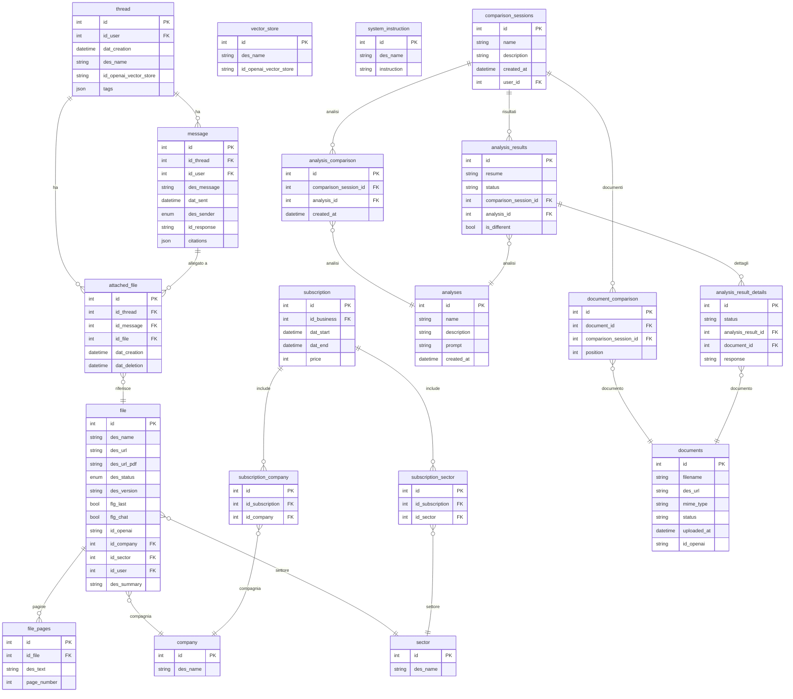

# Advaisor — Analisi Completa Repository

## 1. Overview

**Advaisor** e' una piattaforma AI per il settore assicurativo. Consente a broker e consulenti assicurativi di interrogare in linguaggio naturale polizze assicurative caricate nel sistema, con funzionalita' di:

- **Chat AI con RAG**: conversazioni con contesto documentale su polizze assicurative, con citazioni puntuali (pagina/sezione)
- **Comparazione documenti**: confronto strutturato tra polizze di diverse compagnie tramite analisi AI configurabili
- **Gestione knowledge base assicurativa**: upload e organizzazione di polizze per compagnia e settore

| Campo | Valore |
|---|---|
| **Cliente** | Non specificato (prodotto SaaS B2B) |
| **Industria** | Insurance / Insurtech |
| **Codice applicazione** | 2024024 |
| **Stato** | In produzione (v2.0.7) |

## 2. Versioni

| Componente | Versione |
|---|---|
| App version | **2.0.7** |
| laif-template | **4.4.6** |
| Python | 3.12 |
| FastAPI | 0.105 (bloccato, bug file upload in >=0.106) |
| Next.js | 15.3.3 |
| React | 19.1.0 |
| laif-ds | ^0.1.90 |
| OpenAI SDK | 1.97.0 |

## 3. Team

| Contributore | Commit |
|---|---|
| Pinnuz (Marco Pinelli) | 320 + 99 |
| mlife (Marco Vita) | 155 + 19 |
| bitbucket-pipelines / github-actions | 105 + 94 |
| Simone Brigante | 93 + 21 |
| Carlo A. Venditti | 74 + 45 + 11 |
| sadamicis | 49 |
| neghilowio | 48 |
| Tancredi Bosi | 47 + 9 |
| Daniele DN / Dalle Nogare | 28 + 11 + 5 + 4 + 2 |
| Matteo Scalabrini | 28 |
| Lorenzo T | 19 + 9 |
| Angelo Longano | 18 + 5 |
| cri-p / kri-p | 8 + 3 |
| Altri | ~10 |

**Team principale**: Marco Pinelli (lead), Marco Vita, Simone Brigante, Carlo Venditti.

## 4. Data Model CUSTOM

Tutte le tabelle custom sono nello schema `prs`.

### Dominio Chat / Knowledge Base

| Tabella | Descrizione |
|---|---|
| `thread` | Conversazione utente, con tags JSON (settore/compagnie) e vector store OpenAI opzionale |
| `message` | Messaggio in thread (user/bot), con citazioni JSON e id_response OpenAI |
| `attached_file` | File allegati a thread/messaggi |
| `file` | Polizza/documento caricato, con metadati OpenAI, versioning, stato, summary |
| `file_pages` | Testo estratto per pagina da PDF (per matching citazioni) |
| `vector_store` | Mapping vector store OpenAI (es. "global") |
| `system_instruction` | Prompt di sistema configurabili da DB (tag_detection, no_tags_defined, etc.) |
| `company` | Compagnia assicurativa (es. Generali, Allianz...) |
| `sector` | Settore assicurativo (es. RC Auto, Vita...) |

### Dominio Subscription

| Tabella | Descrizione |
|---|---|
| `subscription` | Abbonamento per business, con date e prezzo |
| `subscription_company` | N:N subscription-company |
| `subscription_sector` | N:N subscription-sector |

### Dominio Document Comparison

| Tabella | Descrizione |
|---|---|
| `documents` | Documento per comparazione (filename, url, mime_type, stato, id OpenAI) |
| `analyses` | Template di analisi con prompt configurabile |
| `comparison_sessions` | Sessione di confronto tra documenti |
| `document_comparison` | N:N documenti-sessione con posizione |
| `analysis_comparison` | Analisi associata a sessione |
| `analysis_results` | Risultato aggregato analisi (resume, is_different, stato) |
| `analysis_result_details` | Risultato per singolo documento nell'analisi |

### Diagramma ER (tabelle custom)

## 5. API Routes CUSTOM

### Controller CRUD (via `generate_crud_routes`)

| Controller | Prefix | Operazioni CRUD |
|---|---|---|
| `thread` | `/thread` | GET_BY_ID, SEARCH, UPDATE, CREATE, DELETE (private, per-user) |
| `file` | `/file` | SEARCH, UPDATE, CREATE, DELETE, DOWNLOAD, UPLOAD |
| `sector` | `/sector` | CRUD standard |
| `company` | `/company` | CRUD standard |
| `subscription` | `/subscription` | CRUD con RoleBasedCRUDService |
| `fileAttachment` | `/fileAttachment` | CRUD standard |
| `document` | `/document` | CRUD + UPLOAD |
| `comparison_session` | `/comparison_session` | CRUD standard |
| `analysis` | `/analysis` | CRUD standard |
| `analysis_comparison` | `/analysis_comparison` | CRUD standard |
| `analysis_result` | `/analysis_result` | CREATE con background task |
| `analysis_result_detail` | `/analysis_result_detail` | CRUD standard |
| `document_comparison` | `/document_comparison` | CRUD standard |

### Endpoint custom (non CRUD)

| Metodo | Path | Descrizione |
|---|---|---|
| POST | `/thread/{id_thread}/stream` | Chat streaming con RAG, tag detection, citazioni |
| POST | `/file/attach/{id_thread}/{id_file}` | Allega file a vector store del thread |
| POST | `/file/detach/{id_thread}/{id_file}` | Rimuovi file da vector store del thread |

## 6. Business Logic CUSTOM

### Chat AI con RAG (cuore dell'applicazione)

- **`CustomOpenAIProvider`**: estende il provider OpenAI del template con logica personalizzata
  - Usa **GPT-4.1** per le risposte in streaming (Responses API, non Assistants)
  - Supporta **file_search** su vector store OpenAI con filtri per settore/compagnia
  - Supporta **web_search_preview** (opzionale, attualmente disabilitato)
  - Estrae **citazioni inline** con matching pagina (exact + fuzzy al 70%)
  - Sistema di **previous_response_id** per continuita' conversazionale

- **Tag Detection automatico**: ad ogni domanda, GPT-4.1-nano analizza il testo per identificare settore e compagnie menzionate, aggiornando i tag del thread. I filtri vengono poi applicati al vector store.

- **System Instructions dinamiche**: i prompt sono salvati in DB (`system_instruction`) e selezionati in base allo stato della conversazione:
  - `no_tags_defined`: prompt generico con placeholder compagnie/settori
  - `tags_defined`: prompt con contesto specifico
  - `single_attachment` / `multiple_attachments`: prompt per file allegati
  - `tag_detection`: prompt per rilevamento automatico settore/compagnie

### Pipeline Document Comparison

- **Background task** per analisi documenti: `analysis_genai_pipeline`
  - Per ogni documento nella sessione, invoca GPT-4.1-mini con il prompt dell'analisi
  - Genera un **summary comparativo** con indicazione `is_different`
  - Usa prompt configurabili da DB (`analysis_resume`)
  - Parsing strutturato del risultato con tag `[SUMMARY]` e `[IS_DIFFERENT]`

### Upload e processing file

- Upload su S3 + upload parallelo su OpenAI
- Conversione DOCX/PPTX in PDF via **PDFRest** (servizio esterno)
- Estrazione testo per pagina con **PyMuPDF** (fitz) per matching citazioni
- Tagging automatico con attributi `sector`/`company` nel vector store OpenAI

## 7. Integrazioni Esterne

| Servizio | Uso | Dettagli |
|---|---|---|
| **OpenAI Responses API** | Chat RAG streaming | GPT-4.1 per chat, GPT-4.1-mini per analisi documenti, GPT-4.1-nano per tag detection |
| **OpenAI Vector Store** | File search | Vector store "global" con filtri per settore/compagnia |
| **OpenAI File API** | Upload documenti | Upload, attach/detach da vector store |
| **PDFRest** | Conversione file | DOCX/PPTX -> PDF (servizio esterno via `PDFRestProvider` del template) |
| **AWS S3** | Storage file | Upload/download polizze e PDF convertiti |

## 8. Frontend Pages CUSTOM

### Pagine custom (non template)

| Path | Descrizione |
|---|---|
| `/conversation/chat` | Chat AI principale con RAG e citazioni |
| `/conversation/knowledge` | Gestione knowledge base (polizze per settore/compagnia) |
| `/conversation/analytics` | Analytics conversazioni |
| `/conversation/feedback` | Feedback sulle risposte AI |
| `/file` | Gestione file/polizze (upload, preview, versioning) |
| `/document-comparison` | Lista sessioni di comparazione |
| `/document-comparison/wizard` | Wizard creazione sessione comparazione |
| `/document-comparison/detail` | Dettaglio risultati comparazione |

### Pagine template (standard)

| Path | Tipo |
|---|---|
| `/thread` | Template (chat standard) |
| `/help/faq`, `/help/ticket` | Template (Wolico) |
| `/user-management/*` | Template (RBAC) |
| `/profile` | Template |

### Feature frontend custom

| Feature | File principali |
|---|---|
| **Chat** | `chat.tsx` (640 righe), `messages.tsx`, `previewModal.tsx`, `conversationSettings.tsx`, `markdownComponents.tsx`, `messageAttachments.tsx`, `drawer.tsx` |
| **Document Comparison** | `DocumentComparisonMain.tsx`, wizard con store Redux, detail view, `ComparisonTable.tsx` |
| **File Management** | `fileCard.tsx`, `uploadModal.tsx`, `updateModal.tsx`, `deleteModal.tsx`, `previewModal.tsx` |

## 9. Stack e Deviazioni

### Dipendenze non-standard (oltre template)

| Dipendenza | Scopo |
|---|---|
| `openai==1.97.0` | SDK OpenAI per Responses API, Vector Store, File Search |
| `pgvector==0.3.3` | Supporto vector embeddings PostgreSQL (installato ma non usato direttamente, il RAG e' su OpenAI) |
| `PyMuPDF==1.25.5` | Estrazione testo da PDF per matching citazioni |
| `python-docx==1.1.2` | Supporto file DOCX |

### Architettura Docker

- Setup standard: `db` (PostgreSQL) + `backend` (FastAPI in Docker)
- Frontend in sviluppo locale (Next.js, non containerizzato)
- Nessun servizio Docker aggiuntivo rispetto al template

## 10. Pattern Notevoli

1. **RAG con doppio vector store**: un vector store "globale" per tutte le polizze + vector store per-thread per allegati specifici della conversazione. I filtri per settore/compagnia vengono applicati dinamicamente.

2. **Tag detection AI-driven**: GPT-4.1-nano analizza ogni domanda per estrarre automaticamente settore e compagnie, costruendo filtri progressivi nella conversazione.

3. **System instructions configurabili da DB**: i prompt non sono hardcoded ma salvati nella tabella `system_instruction`, permettendo modifica senza deploy.

4. **Citazioni con page matching**: dopo la risposta AI, il sistema cerca nel testo estratto per pagina (exact + fuzzy matching) per fornire riferimenti precisi alla pagina del documento.

5. **Pipeline analisi asincrona**: la comparazione documenti usa background tasks FastAPI con `submit_task`, permettendo analisi lunghe senza bloccare la risposta HTTP.

6. **Migrazione struttura dati**: il codice gestisce gracefully la migrazione da strutture tags vecchie (array di oggetti) a nuove (array di stringhe).

## 11. Tech Debt e Note

1. **`pgvector` installato ma non usato**: la dipendenza pgvector e' presente ma il RAG e' interamente delegato a OpenAI Vector Store. Potrebbe essere un residuo di un approccio precedente o preparazione per embedding locali futuri.

2. **Relazione `user` duplicata** in `Thread`: la relazione `user` e' definita due volte nel modello Thread.

3. **FastAPI bloccato a 0.105**: a causa di un bug noto nel file upload in versioni >= 0.106.

4. **Codice legacy presente**: `run_stream_old` nel provider OpenAI mantiene la vecchia implementazione con Assistants API (ora usa Responses API).

5. **Changelog non aggiornato**: il CHANGELOG.md e' rimasto alla v0.1, non riflette le versioni successive fino alla 2.0.7.

6. **Due modelli file separati**: `File` (per knowledge base/chat) e `Document` (per comparazione) sono modelli distinti con logica duplicata di upload su OpenAI. Potenziale unificazione.

7. **Print statements** sparsi nel codice per debug (es. in `custom_gen_ai_provider.py`, `thread/service.py`).

8. **Naming inconsistente**: alcune tabelle usano singolare (`file`, `thread`), altre plurale (`documents`, `analyses`). Alcuni campi usano prefisso `des_`/`id_`/`flg_`, altri no (tabelle comparison).

9. **Nessun test automatizzato custom**: non ci sono test specifici per la business logic dell'applicazione.

10. **Subscription model basico**: il sistema di abbonamenti e' presente ma molto semplice (solo date e prezzo), senza logica di enforcement o billing.
