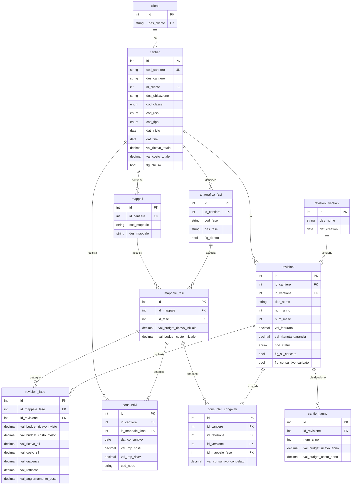

# Analisi Repository: albini-castelli

## 1. Overview

**Applicazione**: Sistema di gestione cantieri edili con controllo di gestione (budget, revisioni, consuntivi, SIL).

**Cliente**: Albini e Castelli -- impresa edile/costruzioni.

**Settore**: Edilizia / Construction Management.

**Descrizione funzionale**: L'app gestisce l'intero ciclo di vita economico dei cantieri edili. Per ogni cantiere traccia: budget iniziale (ricavi/costi), distribuzione annuale, revisioni periodiche del budget, upload di file SIL (Stato Importo Lavori) e consuntivi da Excel, calcolo di KPI finanziari (margini, avanzamento, valore produzione, giacenze, scostamenti). Include una dashboard aggregata per tipo cantiere e anno.

---

## 2. Versioni

| Elemento | Versione |
|---|---|
| App (`version.txt`) | **0.9.0** |
| Helm/deploy (`values.yaml`) | 1.1.0 |
| laif-template (`version.laif-template.txt`) | **5.6.0** |
| laif-ds (frontend) | 0.2.67 |
| Python | 3.12 |
| Node | >= 24.0.0 |
| Next.js | 16.1.1 |

---

## 3. Team (top contributor per commit)

| # Commits | Contributor |
|---|---|
| 265 | Pinnuz |
| 194 | mlife |
| 114 | github-actions[bot] |
| 100 | Simone Brigante |
| 86 | bitbucket-pipelines |
| 85 | Marco Pinelli |
| 71 | neghilowio |
| 49 | cavenditti-laif |
| 49 | sadamicis |
| 44 | Lorenzo T |
| 31 | Carlo A. Venditti |
| 31 | Matteo Scalabrini |
| 28 | Daniele DN |

Progetto con molti contributor, migrato da Bitbucket (presenza di `bitbucket-pipelines`).

---

## 4. Stack e dipendenze non-standard

### Backend (Python 3.12, FastAPI)

**Dipendenze standard template**: SQLAlchemy, Alembic, Pydantic v2, FastAPI, uvicorn, boto3, passlib, python-jose, httpx, requests.

**Dipendenze NON-standard / custom**:
- `openpyxl >= 3.1.5` -- lettura/scrittura file Excel
- `aiohttp ~= 3.13.0` -- client HTTP asincrono (non chiaro l'uso applicativo)

**Dependency groups aggiuntivi** (tramite `uv`):
- `pdf`: PyMuPDF (lettura PDF)
- `llm`: openai + pgvector (AI/LLM + vector search) -- **abilitato di default ma non usato nel codice app**
- `docx`: python-docx (generazione Word)
- `xlsx`: xlsxwriter + pandas (generazione/lettura Excel) -- **attivamente usato**

### Frontend (Next.js 16, React 19, TypeScript)

**Dipendenze NON-standard rispetto al template**:
- `@amcharts/amcharts5` 5.14.4 -- grafici/chart avanzati (dashboard)
- `lucide-react` -- icone (aggiuntivo)

Tutto il resto (Redux Toolkit, React Query, laif-ds, react-hook-form, framer-motion, draft-js, react-intl, ecc.) e' standard del template.

### Docker Compose

Servizi standard: `db` (PostgreSQL custom Dockerfile), `backend` (FastAPI).
- **Nessun servizio extra** nel docker-compose principale.
- `docker-compose.wolico.yaml`: configurazione per test con rete condivisa "wolico" (proxy + frontend aggiunti).
- Build arg `ENABLE_XLSX: 1` -- abilita dipendenze Excel nel container.

---

## 5. Modello dati completo

### Tabelle (schema `prs`)

#### `clienti`
| Colonna | Tipo | Note |
|---|---|---|
| id | int PK | |
| des_cliente | str | unique, indexed |

#### `cantieri`
| Colonna | Tipo | Note |
|---|---|---|
| id | int PK | |
| cod_cantiere | str | unique, indexed |
| des_cantiere | str | |
| id_cliente | int FK -> clienti.id | |
| des_ubicazione | str | |
| cod_classe | CantiereClasse (enum) | Immobiliare / Cliente |
| cod_uso | CantiereUso (enum) | Residenziale / Commerciale / Industriale / Logistica / Altro |
| cod_tipo | CantiereTipo (enum) | Gestito / Non Gestito / Previsionale A / Previsionale B |
| dat_inizio | date | |
| dat_fine | date | |
| val_ricavo_totale | Numeric(14,2) | |
| val_costo_totale | Numeric(14,2) | |
| des_nota | str | nullable |
| flg_chiuso | bool | default False |

#### `cantieri_anno`
| Colonna | Tipo | Note |
|---|---|---|
| id | int PK | |
| id_revisione | int FK -> revisioni.id | CASCADE |
| num_anno | int | |
| val_budget_ricavo_anno | Numeric(14,2) | |
| val_budget_costo_anno | Numeric(14,2) | |
| UQ(id_revisione, num_anno) | | |

#### `mappali`
| Colonna | Tipo | Note |
|---|---|---|
| id | int PK | |
| id_cantiere | int FK -> cantieri.id | CASCADE |
| cod_mappale | str | |
| des_mappale | str | |
| UQ(id_cantiere, cod_mappale) | | |

#### `anagrafica_fasi`
| Colonna | Tipo | Note |
|---|---|---|
| id | int PK | |
| id_cantiere | int FK -> cantieri.id | CASCADE |
| cod_fase | str | |
| des_fase | str | |
| flg_diretto | bool | default True -- distingue costi diretti/indiretti |
| UQ(id_cantiere, cod_fase) | | |

#### `mappale_fasi` (pivot mappale-fase)
| Colonna | Tipo | Note |
|---|---|---|
| id | int PK | |
| id_mappale | int FK -> mappali.id | CASCADE |
| id_fase | int FK -> anagrafica_fasi.id | |
| val_budget_ricavo_iniziale | Numeric(14,2) | nullable |
| val_budget_costo_iniziale | Numeric(14,2) | nullable |
| des_nota | str | nullable, data entry |
| UQ(id_mappale, id_fase) | | |

#### `revisioni_versioni`
| Colonna | Tipo | Note |
|---|---|---|
| id | int PK | |
| des_nome | str | es. "Budget Iniziale" |
| dat_creation | date | server_default now |

#### `revisioni`
| Colonna | Tipo | Note |
|---|---|---|
| id | int PK | |
| id_cantiere | int FK -> cantieri.id | CASCADE |
| id_versione | int FK -> revisioni_versioni.id | |
| des_nome | str | |
| num_anno | int | |
| num_mese | int | CHECK 1-12 |
| val_fatturato | Numeric(14,2) | nullable -- BUG comment "serve?" |
| val_aggiornamento_fatturato | Numeric(14,2) | nullable, default 0 |
| val_ritenuta_garanzia | Numeric(14,2) | nullable -- BUG comment "serve?" |
| cod_status | StatusRevisione (enum) | aperta / chiusa |
| flg_sil_caricato | bool | |
| flg_consuntivo_caricato | bool | |
| flg_revisione_fatta | bool | |
| dat_creation | date | |
| dat_update | date | |
| UQ(id_cantiere, num_anno, num_mese, id_versione) | | |

#### `revisioni_fase`
| Colonna | Tipo | Note |
|---|---|---|
| id | int PK | |
| id_mappale_fase | int FK -> mappale_fasi.id | CASCADE |
| id_revisione | int FK -> revisioni.id | CASCADE |
| val_budget_ricavo_rivisto | Numeric(14,2) | nullable, data entry |
| val_budget_costo_rivisto | Numeric(14,2) | nullable, data entry |
| val_ricavo_sil | Numeric(14,2) | nullable, upload SIL |
| val_costo_sil | Numeric(14,2) | nullable, upload SIL |
| val_giacenze | Numeric(14,2) | nullable, data entry |
| val_rettifiche | Numeric(14,2) | nullable, data entry |
| val_aggiornamento_costi | Numeric(14,2) | nullable, default 0 |
| UQ(id_mappale_fase, id_revisione) | | |

#### `consuntivi`
| Colonna | Tipo | Note |
|---|---|---|
| id | int PK | |
| id_cantiere | int FK -> cantieri.id | CASCADE |
| id_mappale_fase | int FK -> mappale_fasi.id | CASCADE |
| dat_consuntivo | date | COMPUTED(coalesce(dat_comp, dat_doc)), persisted |
| num_nr_doc, num_reg, dat_reg, dat_comp, ... | vari | ~20 colonne derivate da export Excel contabile |
| val_imp_costi | Numeric(14,2) | importo costi |
| val_imp_ricavi | Numeric(14,2) | importo ricavi |

#### `consuntivi_congelati`
| Colonna | Tipo | Note |
|---|---|---|
| id | int PK | |
| id_cantiere | int FK | CASCADE |
| id_revisione | int FK | CASCADE |
| id_versione | int FK | CASCADE |
| id_mappale_fase | int FK | CASCADE |
| val_consuntivo_congelato | Numeric(14,2) | snapshot del consuntivo al momento del freeze |
| dat_creation, dat_update | datetime(tz) | |
| UQ(id_cantiere, id_revisione, id_versione, id_mappale_fase) | | |

### Materialized Views (schema `prs`)

| View | Descrizione |
|---|---|
| `consuntivo_pivot` | Aggregazione mensile consuntivi per cantiere/mappale_fase |
| `tabellone_revisioni` | Aggregazione principale revisione con budget, SIL, consuntivi, giacenze dirette/indirette |
| `revisione_extra_kpis` | KPI per revisione aggregati per flg_diretto (margini, valore produzione, avanzamento, scostamenti) |
| `revisione_totali_per_cantiere` | Totali per revisione/cantiere con delta anni precedenti/correnti |

### Diagramma ER



---

## 6. API Routes

### Cantieri (`/cantieri`)
- `GET /{id}` -- dettaglio cantiere
- `GET /search` -- ricerca cantieri
- `POST /` -- crea cantiere
- `PUT /{id}` -- aggiorna cantiere
- `DELETE /{id}` -- elimina cantiere
- `GET /{item_id}/mappale-fase-count` -- conteggio MappaleFasi (determina se entry manuale o SIL upload)

### Clienti (`/clienti`)
- CRUD completo (get_by_id, search, create, update, delete)

### Revisioni (`/revisioni`)
- CRUD completo (get_by_id, search, create, update, delete)
- `GET /{item_id}/years-summary` -- riepilogo annuale con KPI (budget, margini, giacenze, SIL-SAL)

### Revisioni Fase (`/revisioni-fase`)
- `GET /{id}`, `GET /search`, `PUT /{id}`
- `POST /manual` -- crea fase manuale (default mappale 98, fasi A0-A10)
- `PUT /{item_id}/reassign-mappale` -- riassegna MappaleFase a diverso mappale

### Revisioni Versioni (`/revisioni-versioni`)
- `GET /search`

### Revisioni Extra KPI (`/revisioni-extra-kpi`)
- `GET /search`

### Cantieri Anno (`/cantieri-anno`)
- `PUT /batch` -- aggiornamento batch distribuzione annuale

### Mappali (`/mappali`)
- `GET /search`

### Consuntivi (`/consuntivi`)
- `GET /search`
- `GET /{item_id}/totals` -- totali consuntivo per cantiere (somme costi/ricavi + data piu' recente)

### Tabellone Revisioni (`/tabellone-revisioni`)
- `GET /search`
- `POST /freeze` -- congela consuntivi del tabellone (snapshot)

### Upload (`/upload`)
- `POST /{id_cantiere}/sil` -- upload SIL & Pianificazione Excel (o entry manuale con year_distribution)
- `POST /{id_cantiere}/consuntivo` -- upload Consuntivo Excel
- `POST /{id_cantiere}/revisione/{id_revisione}/sil` -- upload SIL per revisione specifica

### Dashboard (`/dashboard`)
- `GET /cantieri-anno` -- dati dashboard con filtri per tipo/anno, opzione group_by_tipo
- `GET /year-range` -- range anni disponibili

### Changelog (`/changelog`)
- `GET /` -- contenuto changelog (tipo: tech/customer, target: template/app)

### Materialized Views Admin (`/mat-views`)
- `POST /refresh` -- refresh tutte le viste materializzate
- `POST /refresh/{view_name}` -- refresh singola vista
- `POST /recreate` -- ricrea tutte le viste (drop + create)
- `POST /recreate/{view_name}` -- ricrea singola vista

### Import Storico (`/import-storico`)
- `POST /` -- import storico cantieri da Excel (solo admin-laif)

---

## 7. Business Logic

### Logica complessa principale

1. **Materialized Views con calcoli finanziari avanzati** (`materialized_views.py`, ~630 righe):
   - `TabelloneRevisione`: calcolo giacenze indirette con formula multi-step (valore produzione -> avanzamento -> costo SIL indiretto -> differenza -> distribuzione proporzionale). Usa CTE + window functions.
   - `RevisioneExtraKpi`: KPI aggregati per flg_diretto con calcoli di margine, valore produzione, consuntivo rettificato, scostamento, avanzamento cantiere.
   - `RevisioneTotaliPerCantiere`: delta budget anni precedenti vs corrente.

2. **Upload Excel con parsing strutturato** (3 handler distinti):
   - **SIL & Pianificazione**: crea Mappali, MappaleFasi, Revisione 0. Unica operazione che puo' creare nuove MappaleFasi.
   - **Consuntivo**: importa righe contabili (costi/ricavi) su MappaleFasi esistenti. Non puo' creare MappaleFasi.
   - **Revisione SIL**: aggiorna val_ricavo_sil/val_costo_sil su MappaleFasi esistenti.
   - Tutti i file vengono salvati su S3 dopo l'upload.

3. **Import Storico** (`import_storico/service.py`): importazione massiva da Excel con sheet "solo aperti solo 2025". Parsifica colonne con indici hardcoded (iloc), gestisce conversione valori in migliaia (moltiplicazione x1000), upsert cantieri/revisioni/fasi.

4. **Freeze Consuntivi** (`tabellone_revisione/service.py`): congela (snapshot) i valori di consuntivo rolling in una revisione, creando record `ConsuntivoCongelato`.

5. **Creazione Revisione con propagazione** (`revisione/service.py`): quando si crea una nuova revisione, copia automaticamente tutte le RevisioneFase e CantiereAnno dalla revisione precedente.

### Background Tasks

- Presente lo scaffolding `repeat_every` da `fastapi-utils` in `events.py`, ma **commentato/disabilitato**. Nessun background task attivo.

---

## 8. Integrazioni esterne

| Servizio | Uso | File |
|---|---|---|
| **AWS S3** | Salvataggio file Excel uploadati | `upload/utils.py` (tramite `template.common.aws.get_s3_client`) |
| **AWS Parameter Store** | Configurazione (via template) | utilities/ |

**Non ci sono integrazioni con API esterne** (no TeamSystem, no ERP, no servizi terzi). I dati entrano solo via upload Excel.

Le dipendenze `openai` e `pgvector` sono dichiarate come dependency group `llm` e abilitate di default, ma **non sono utilizzate nel codice applicativo** -- probabilmente preparazione per funzionalita' future.

---

## 9. Frontend - Albero pagine

```
/ (login/redirect)
|
+-- (authenticated)/
|   +-- dashboard/                    <- Dashboard principale
|   +-- sites-sheets/                 <- Lista cantieri (schede cantiere)
|   |   +-- detail/
|   |       +-- dashboard/            <- Dashboard singolo cantiere
|   |       +-- revisions/            <- Revisioni del cantiere (tabellone)
|   |       +-- consumptive/          <- Consuntivi del cantiere
|   |
|   +-- (app)/
|   |   +-- changelog-customer/       <- Changelog per il cliente
|   |   +-- changelog-technical/      <- Changelog tecnico
|   |
|   +-- (template)/                   <- Pagine standard laif-template
|       +-- conversation/             <- Chat AI, analytics, feedback, knowledge
|       +-- files/                    <- Gestione file
|       +-- help/ (faq, ticket)       <- Help
|       +-- profile/                  <- Profilo utente
|       +-- user-management/          <- Gestione utenti, ruoli, gruppi, permessi
|
+-- (not-auth-template)/
    +-- logout/
    +-- registration/
```

**Pagine custom app** (non template): `dashboard`, `sites-sheets` (con detail/dashboard/revisions/consumptive), `changelog-customer`, `changelog-technical`.

### Feature frontend principali (`frontend/src/features/`):
- `dashboard/` -- hooks e widgets per la dashboard principale (grafici amcharts)
- `sites-sheets/` -- lista cantieri con modale creazione
- `site-sheet-detail/` -- dettaglio cantiere con 3 tab:
  - `consumptive/` -- tab consuntivi
  - `dashboard/` -- tab dashboard con modale inizializzazione
  - `revisions/` -- tab revisioni con:
    - `years/` -- distribuzione annuale
    - `mappali/` -- gestione mappali
    - `dashboard/` -- dashboard revisione
    - `budget-revisions/` -- tabellone revisioni budget (celle editabili, hooks)
- `changelog/` -- componenti per visualizzazione changelog

**67 file TypeScript/TSX** nelle features custom.

---

## 10. Deviazioni dal laif-template

### Backend
- **`materialized_view.py`**: classe base custom `MaterializedView` che estende `Base` per gestire viste materializzate PostgreSQL (create/refresh/drop/recreate via DDL). Non presente nel template.
- **`materialized_views.py`**: 4 viste materializzate con query SQL complesse (CTE, window functions).
- **`materialized_views_admin/`**: controller admin per refresh/recreate viste materializzate.
- **`common/materialized_view_utils.py`**: utility per refresh centralizzato con gestione dipendenze.
- **`upload/handlers/`**: 3 handler specializzati per parsing Excel con formati diversi.
- **`import_storico/`**: modulo di importazione massiva dati storici da Excel.
- **`constants.py`**: mapping colonne Excel -> campi DB (3 formati diversi).
- **Ruolo custom** `AppRoles.MANAGER` oltre ai ruoli template.

### Frontend
- **amcharts5**: libreria grafici avanzata non presente nel template standard.
- **`features/site-sheet-detail/tabs/revisions/widgets/budget-revisions/`**: widget tabellone con celle editabili inline e hooks custom.
- **`shared/components/year-distribution/`**: componente distribuzione annuale.

### Docker
- `docker-compose.wolico.yaml`: configurazione per testing con rete condivisa "wolico" (altro progetto LAIF).

---

## 11. Pattern notevoli

1. **MaterializedView Pattern**: implementazione pulita di una base class astratta per gestire viste materializzate PostgreSQL via SQLAlchemy DDL. Pattern riutilizzabile cross-progetto. Include gestione dipendenze tra viste (ordine di refresh).

2. **Upload Handler Pattern**: separazione netta tra 3 tipi di upload Excel con regole business diverse (chi puo' creare MappaleFasi, chi no). Orchestrazione via service module che ri-esporta i handler.

3. **Propagazione Revisione**: quando si crea una nuova revisione, il service copia automaticamente tutte le RevisioneFase (con budget rivisto dalla revisione precedente o budget iniziale) e i CantiereAnno. Pattern utile per sistemi di budgeting con versioning.

4. **Calcolo Giacenze Indirette**: formula finanziaria complessa implementata come CTE SQL multi-step. Distingue tra costi diretti (da SIL) e indiretti (calcolati proporzionalmente tramite avanzamento cantiere).

5. **Freeze/Snapshot Pattern**: congelamento dei consuntivi rolling in un punto nel tempo per confronto storico tra revisioni.

---

## 12. Note e Tech Debt

### BUG/TODO marcati nel codice
- `models.py:210` -- `val_fatturato` su Revisione: commento "BUG: serve?"
- `models.py:212` -- `val_ritenuta_garanzia` su Revisione: commento "BUG: serve?"
- `models.py:331` -- `RevisioneFase`: "BUG: aggiungi join con tabella consuntivo pivot"
- `consuntivo_handler.py:136` -- FIXME: filtra righe con id_mappale_fase == 0 (mappali-fase non in SIL)
- `schema/tabellone_revisione.py:13` -- TODO: budget iniziale non dovrebbe essere nullable

### Osservazioni
- **CHANGELOG vuoto**: il CHANGELOG.md non e' mantenuto (solo entry "First release by LaifTemplate" del 2025-10-03).
- **Import Storico con indici hardcoded**: l'import usa `row.iloc[N]` con indici numerici (0-43) per parsificare l'Excel. Fragile e difficile da manutenere.
- **Dipendenze LLM abilitate ma non usate**: openai + pgvector sono nel default-groups di uv ma nessun codice app le usa.
- **Task.md vuoto**: nessun task tracciato.
- **aiohttp dichiarato** ma non chiaramente usato nel codice app (forse usato solo nel template).
- **~6.250 righe di codice Python** nel modulo app (escludendo template).
- **Duplicazione `materialized_view.py` / `materialized_views.py`**: il singolare contiene la base class, il plurale le implementazioni. Naming potenzialmente confuso.
- **Nessun test specifico app**: non trovati file di test nella directory app.
