# Analisi Deep-Dive: bandi-platform

## 1. Overview

**Applicazione**: Piattaforma Bandi Sinergia Srl
**Descrizione**: Piattaforma intelligente per il monitoraggio, la scoperta e il matching automatico di bandi e agevolazioni pubbliche con le aziende clienti. Il sistema crawla automaticamente siti web istituzionali, estrae informazioni sui bandi tramite LLM (OpenAI), e li incrocia con il profilo delle aziende (CRM) per suggerire le opportunita' piu' rilevanti. Include anche un modulo separato di automazione fatture (classificatore Ferrari).
**Cliente**: Sinergia Srl (consulenza in finanza agevolata)
**Settore**: Consulenza aziendale / Finanza agevolata
**Codice applicazione**: 2025019
**Infra repo**: sinergia-infra

## 2. Versioni

| Componente | Versione |
|---|---|
| App | **0.7.6** (version.txt) |
| values.yaml | 1.1.0 |
| laif-template | **5.6.1** |
| Node.js | >= 24.0.0 |
| Python | >= 3.12, < 3.13 |

## 3. Team (top contributors)

| Contributor | Commits |
|---|---|
| Pinnuz | 273 |
| cri-p | 252 |
| mlife | 203 |
| github-actions[bot] | 172 |
| Gabriele Fogu | 104 |
| Simone Brigante | 92 |
| bitbucket-pipelines | 86 |
| Marco Pinelli | 85 |
| neghilowio | 75 |
| cavenditti-laif | 51 |
| sadamicis | 49 |

Team molto ampio (35+ contributor unici), progetto maturo con molti contributi.

## 4. Stack e dipendenze non standard

### Backend (Python)

| Dipendenza | Note |
|---|---|
| `ultralytics ~= 8.4.16` | **YOLO** per OCR/detection su PDF (modulo file-completion) |
| `pgvector ~= 0.4.2` | Embeddings vettoriali su PostgreSQL |
| `openai ~= 2.14.0` | LLM per estrazione bandi e classificazione fatture |
| `apscheduler >= 3.11.0` | Scheduler asincrono per job periodici |
| `rapidfuzz >= 3.13.0` | Fuzzy matching stringhe |
| `playwright ~= 1.49.0` | Browser headless per crawling |
| `beautifulsoup4 ~= 4.12.0` | Parsing HTML |
| `pandas >= 2.0.0` | Manipolazione dati/Excel |
| `openpyxl >= 3.0.0` | Lettura Excel |
| `xlsxwriter ~= 3.2.2` | Scrittura Excel |
| `python-docx ~= 1.2.0` | Generazione documenti Word |
| `PyMuPDF ~= 1.26.7` | Manipolazione PDF |
| `pillow >= 12.1.0` | Elaborazione immagini (per YOLO) |
| `aiojobs >= 1.4.0` | Worker asincrono per task queue interna |
| `aiohttp >= 3.13.0` | Client HTTP asincrono |
| `broadcaster >= 0.2.2` | WebSocket broadcasting |

**Dependency groups** (pyproject.toml): `pdf`, `docx`, `llm`, `xlsx`, `crawler` -- tutti abilitati di default.

### Frontend (Next.js 16 + React 19)

| Dipendenza | Note |
|---|---|
| `@amcharts/amcharts5` | Grafici avanzati |
| `@react-pdf/renderer` | Generazione PDF lato client |
| `react-pdf` + `pdfjs-dist` | Visualizzazione PDF |
| `pdf-lib` | Manipolazione PDF |
| `@hello-pangea/dnd` | Drag & Drop |
| `draft-js` + plugins | Rich text editor con mention |
| `katex` + `rehype-katex` + `remark-math` | Formule matematiche |
| `react-markdown` + `react-syntax-highlighter` | Rendering markdown |
| `marked` | Parsing markdown |
| `xlsx` | Parsing Excel lato client |
| `framer-motion` | Animazioni |
| `@microsoft/fetch-event-source` | SSE (Server-Sent Events) |
| `nuqs` | URL query state management |

### Docker Compose

Servizi: `db` (PostgreSQL con Dockerfile custom), `backend` (FastAPI).
Varianti: `docker-compose.wolico.yaml` (rete condivisa con Wolico), `docker-compose.e2e.yaml`, `docker-compose.test.yaml`, `docker-compose.debug.yaml`.

**Nota**: Il frontend non e' nel docker-compose principale (solo backend + db), si avvia localmente con `npm run dev`.

## 5. Modello dati completo

Schema DB: `prs` (dati applicativi), `template` (dati laif-template standard).

### Tabelle (30 tabelle applicative in schema `prs`)

| Tabella | Descrizione |
|---|---|
| `thematics` | Tematiche dei bandi (beni strumentali, R&D, etc.) |
| `url_sources` | Sorgenti URL da crawlare |
| `url_source_businesses` | Associazione URL-Business (N:N) |
| `call_masters` | Bandi "master" (dati unici per URL) con embedding vettoriale |
| `call_businesses` | Bandi per business (vista specifica per ogni business del tenant) |
| `call_documents` | Documenti allegati ai bandi |
| `call_sheet_info` | Info scheda bando (sezioni testuali) |
| `call_jobs` | Job di elaborazione bandi |
| `call_tasks` | Task granulari del crawler (discovery, fetch, extract, etc.) |
| `call_sheet_jobs` | Job di generazione schede bando |
| `call_urls_discarded` | URL scartati dal crawler |
| `companies_crm` | Aziende importate dal CRM (dati grezzi) |
| `companies_app` | Aziende applicative (dati arricchiti, visura, etc.) |
| `company_documents` | Documenti aziendali (visure, bilanci, generici) |
| `company_businesses` | Associazione azienda-business (N:N) |
| `company_balance` | Dati di bilancio azienda (1:1) |
| `company_administrators` | Anagrafica amministratori |
| `company_administrator_relation` | Relazione N:N azienda-amministratore |
| `company_auditors` | Anagrafica revisori/sindaci |
| `company_auditor_relation` | Relazione N:N azienda-revisore |
| `company_shareholders` | Anagrafica soci |
| `company_shareholder_relation` | Relazione N:N azienda-socio (con % partecipazione) |
| `company_certifications` | Certificazioni aziendali (ISO, SOA, etc.) |
| `group_companies` | Aziende del gruppo |
| `company_group_relation` | Relazione N:N azienda-gruppo |
| `app_companies_sites` | Sedi aziendali applicative |
| `crm_companies_sites` | Sedi aziendali CRM |
| `app_company_site_atecos` | Codici ATECO per sede (app) |
| `crm_company_site_atecos` | Codici ATECO per sede (CRM) |
| `formularies` | Formulari associati ai bandi |
| `form_sections` | Sezioni formulario |
| `form_sub_sections` | Sotto-sezioni formulario |
| `form_questions` | Domande formulario |
| `form_answers` | Risposte formulario (legate a progetto) |
| `projects` | Progetti (associazione bando-azienda con AI assistant) |
| `project_documents` | Documenti di progetto |
| `matches` | Match bando-azienda con score |
| `match_validities` | Match invalidati |
| `excel_rows` | Righe Excel fatture (modulo Ferrari) |
| `analysis_results` | Risultati analisi fatture |
| `analysis_result_details` | Dettagli analisi fatture (fatture/contratti) |
| `etl_runs` | Run ETL per import Excel |
| `file_completion` | Template PDF con compilazione AI |

### Diagramma ER (Mermaid)

```mermaid
erDiagram
    %% === BANDI / CALLS ===
    url_sources ||--o{ call_masters : "produce"
    url_sources ||--o{ url_source_businesses : "assegnata a"
    call_masters ||--o{ call_businesses : "istanziato per"
    call_businesses ||--o{ call_documents : "ha"
    call_businesses ||--o{ call_sheet_info : "ha"
    call_businesses ||--o{ formularies : "ha"
    call_businesses ||--o{ matches : "matchato con"
    call_businesses ||--o{ projects : "ha progetto"

    url_sources {
        int id PK
        string des_name
        string des_url
        bool flg_active
        enum url_type
        string des_content_hash
        datetime tms_last_extraction_calls
    }

    call_masters {
        int id PK
        int id_url_source FK
        string web_page_url
        string des_title
        string des_description
        vector vec_content_embedding
        string des_content_hash
    }

    call_businesses {
        int id PK
        int id_call_master FK
        int id_business FK
        enum call_type
        enum region
        enum timing_status
        datetime tms_expiration
        numeric total_budget
        numeric incentive_max
        float incentive_percent
        bool flg_blacklisted
        bool flg_hidden
    }

    %% === AZIENDE / COMPANIES ===
    companies_crm ||--o| companies_app : "shadow"
    companies_app ||--o{ company_documents : "ha"
    companies_app ||--o{ company_businesses : "assegnata a"
    companies_app ||--o| company_balance : "ha bilancio"
    companies_app ||--o{ company_administrator_relation : "ha admin"
    companies_app ||--o{ company_auditor_relation : "ha revisori"
    companies_app ||--o{ company_shareholder_relation : "ha soci"
    companies_app ||--o{ company_certifications : "ha cert"
    companies_app ||--o{ company_group_relation : "in gruppo"
    companies_app ||--o{ app_companies_sites : "ha sedi"
    companies_crm ||--o{ crm_companies_sites : "ha sedi CRM"

    companies_crm {
        int id PK
        string id_crm
        string piva
        string cf
        string des_company_name
        enum beneficiary_type
        enum client_status
    }

    companies_app {
        int id PK
        int id_company_crm FK
        string piva
        string cf
        string des_company_name
        enum legal_form
        enum activity_status
        string des_business_object
    }

    company_balance {
        int id PK
        int id_company FK
        numeric num_share_capital
        int num_employees
        int num_revenue
    }

    %% === SEDI E ATECO ===
    app_companies_sites ||--o{ app_company_site_atecos : "ha codici"
    crm_companies_sites ||--o{ crm_company_site_atecos : "ha codici"

    app_companies_sites {
        int id PK
        int id_company FK
        enum cod_site_kind
        string des_address_full
        enum province
        enum region
    }

    %% === PERSONE (N:N) ===
    company_administrators ||--o{ company_administrator_relation : "in aziende"
    company_auditors ||--o{ company_auditor_relation : "in aziende"
    company_shareholders ||--o{ company_shareholder_relation : "in aziende"
    group_companies ||--o{ company_group_relation : "collegate"

    %% === MATCH E PROGETTI ===
    matches {
        int id PK
        int id_business FK
        int id_call FK
        int id_company FK
        bool flg_match
        float score
    }

    companies_app ||--o{ matches : "matchata con"

    projects {
        int id PK
        int id_business FK
        int id_call FK
        int id_company FK
        string des_name
        string id_vector_store
        string id_openai_assistant
        string id_openai_thread
    }

    projects ||--o{ form_answers : "ha risposte"
    projects ||--o{ project_documents : "ha documenti"

    %% === FORMULARI ===
    formularies ||--o{ form_sections : "ha"
    form_sections ||--o{ form_sub_sections : "ha"
    form_sub_sections ||--o{ form_questions : "ha"

    %% === AUTOMAZIONE FATTURE ===
    excel_rows ||--o| analysis_results : "analizzata"
    analysis_results ||--o{ analysis_result_details : "ha dettagli"

    excel_rows {
        int id PK
        string fonte
        string nome_disegno_brevetto
        int anno_competenza
        float importo
        bool user_check
        enum processing_status
    }

    %% === FILE COMPLETION ===
    file_completion {
        int id PK
        int id_business FK
        string des_name
        string des_status
        string des_model_layout
        string des_model_completion
        json js_coords
    }

    %% === CRAWLER TASKS ===
    call_jobs ||--o{ call_tasks : "contiene"
    call_tasks {
        int id PK
        enum task_type
        enum status
        int id_url_source FK
        int num_attempts
    }

    %% === ETL ===
    etl_runs {
        int id PK
        string id_ecs_task
        enum status
        int rows_added
        int rows_updated
    }
```



## 6. API Routes

### Data Entry
| Risorsa | Prefix | Operazioni principali |
|---|---|---|
| URL Sources | `/url-source` | CRUD, avvio crawling, scan singolo |
| Bandi (Calls) | `/call-businesses` | CRUD, search, hide/unhide, estrazione forzata |
| Call Documents | `/call-businesses/.../documents` | Upload/download documenti bando |
| Call Sheets | `/call-businesses/.../sheets` | Generazione schede informative bando (AI) |
| Discarded URLs | `/call-url-discarded` | CRUD URL scartati |
| Thematics | `/thematic` | CRUD tematiche bandi |

### Aziende
| Risorsa | Prefix | Operazioni principali |
|---|---|---|
| Companies | `/company` | CRUD, search, get by ID |
| Company Documents | `/company/.../documents` | Upload/download documenti azienda |

### Matching & Progetti
| Risorsa | Prefix | Operazioni principali |
|---|---|---|
| Matches | `/match` | CRUD, ricalcolo match per azienda |
| Match Invalidi | `/match-invalid` | Gestione match invalidati |
| Projects | `/projects` | CRUD, upload documenti, init AI |
| Formulari | `/formulary` | CRUD, generazione AI |
| Form Sections/SubSections/Questions/Answers | `/form-*` | CRUD struttura formulario |

### Automazione Fatture (modulo Ferrari)
| Risorsa | Prefix | Operazioni principali |
|---|---|---|
| Classificatore | `/classificatore` | Elaborazione righe Excel, caricamento S3 |
| Excel Rows | `/excel_row` | Search, export |
| Analysis Results | `/analysis_result` | Search, update |
| Analysis Result Details | `/analysis_result_detail` | Download documenti |
| ETL | `/etl` | Avvio ETL on-demand, kill task ECS |
| ETL Runs | `/etl_run` | Search run storico |

### File Completion (compilazione PDF AI)
| Risorsa | Prefix | Operazioni principali |
|---|---|---|
| File Completion | `/file-completion` | CRUD, upload, download, compile, extract coords |

### Integrazioni
| Risorsa | Prefix | Operazioni principali |
|---|---|---|
| CRM Integration | `/integrations/crm` | Sync aziende da CRM |

### Altro
| Risorsa | Prefix | Operazioni principali |
|---|---|---|
| Tasks | `/tasks` | Search task crawler |
| Changelog | `/changelog` | Lettura changelog tecnico/customer |
| App Analysis | `/app-analysis` | Check similarita' tra bandi (embedding) |

## 7. Business Logic

### Crawler automatico bandi (cuore del sistema)

Pipeline asincrona multi-stage con **APScheduler** + **aiojobs** worker:

1. **Discovery** (lun-ven ore 22:20): Per ogni URL source attiva, Playwright fa snapshot della pagina, calcola hash. Se il contenuto e' cambiato, scopre i link interni ai bandi.
2. **Fetch HTML**: Scarica il contenuto HTML delle pagine bando scoperte. Usa `BrowserManager` (Playwright) con fallback su WebScrapingAPI e AI Search (GPT web_search).
3. **Extraction**: LLM (GPT-5-nano) estrae metadati strutturati dal HTML (titolo, budget, date, regione, tipo beneficiario, tematiche, etc.) tramite prompt engineering sofisticato con regole di dominio.
4. **Aggregation & Persistence**: Crea/aggiorna `CallMaster` e `CallBusiness`, calcola embedding vettoriale.
5. **Check tasks** (lun-ven ore 1:00): Verifica aggiornamenti su bandi esistenti.
6. **Auto-discard**: Ogni 20 giorni scarta automaticamente bandi abbandonati.
7. **Stale URL check**: Ogni venerdi' controlla URL senza bandi da 60+ giorni, invia notifica.

Modelli LLM usati: `gpt-5-nano` (extraction), `gpt-5-mini` (AI search fallback).

### Sync CRM (giornaliero a mezzanotte)

Pipeline `crm_pipeline`:
1. Sync da **VTE CRM** (Sinergia) via REST API
2. Sync da **Creatio** CRM via OData API con OAuth
3. Ricalcolo match per aziende aggiornate oggi

### Matching bando-azienda

Incrocio automatico tra bandi e aziende basato su: regione, tipo beneficiario, codici ATECO, dimensione aziendale. Score di matching calcolato. Supporto per invalidazione manuale.

### Classificatore fatture (modulo Ferrari)

Import Excel da S3 con righe fattura. Per ogni riga:
- Cerca documenti (fatture/contratti) su AWS S3
- Analisi con OpenAI per determinare ammissibilita'
- Estrae dati strutturati (ragione sociale, importi, anno competenza)
- Export risultati in Excel

### File Completion (compilazione PDF AI)

Sistema per compilare automaticamente template PDF:
1. Upload template PDF
2. **YOLO** (ultralytics, modello FFDNet-L.pt) rileva campi compilabili (text_input, choice_button, signature)
3. LLM compila i campi basandosi su dati azienda/bando
4. Genera PDF compilato

### Generazione formulari e schede bando (AI)

- Generazione automatica di schede informative per ogni bando
- Generazione di formulari da compilare per la candidatura

## 8. Integrazioni esterne

| Servizio | Tipo | Dettaglio |
|---|---|---|
| **VTE CRM** (sinergia.vtecrm.net) | REST API | Sync giornaliero aziende, autenticazione Basic |
| **Creatio CRM** | OData + OAuth | Sync giornaliero aziende, OAuth token flow |
| **OpenAI** | API | GPT-5-nano/mini per estrazione bandi, classificazione fatture, compilazione PDF |
| **OpenAI Assistants API** | API | Vector store + assistant per progetti (Q&A su documenti bando) |
| **WebScrapingAPI** | REST API | Fallback per scraping quando Playwright e' bloccato |
| **AWS S3** | SDK | Storage documenti (fatture, bandi, visure, template) |
| **AWS ECS** | SDK | Invocazione task ETL come ECS task |
| **pgvector** | DB extension | Similarity search tra bandi (embedding 1536d) |

## 9. Frontend - Albero pagine

```
app/
  page.tsx                                         (Login)
  cerform/page.tsx                                 (Login custom branding Cerform)
  (not-auth-template)/
    logout/page.tsx
    registration/page.tsx
  (authenticated)/
    add-url/page.tsx                               ** Aggiunta URL sorgente
    calls/page.tsx                                 ** Lista bandi attivi
    calls-hidden/page.tsx                          ** Bandi nascosti
    calls-discarded/page.tsx                       ** URL/bandi scartati
    companies/page.tsx                             ** Anagrafica aziende
    reccomendations/page.tsx                       ** Raccomandazioni match
    projects/page.tsx                              ** Progetti (bando+azienda)
    moduli/page.tsx                                ** Formulari / moduli
    thematic/page.tsx                              ** Gestione tematiche
    excel-row/
      analysis/page.tsx                            ** Analisi fatture
      history/page.tsx                             ** Storico elaborazioni
    (app)/
      changelog-customer/page.tsx                  ** Changelog per il cliente
      changelog-technical/page.tsx                 ** Changelog tecnico
    (template)/                                    (pagine standard laif-template)
      conversation/analytics/page.tsx
      conversation/chat/page.tsx
      conversation/feedback/page.tsx
      conversation/knowledge/page.tsx
      conversation/knowledge/detail/page.tsx
      files/page.tsx
      help/faq/page.tsx
      help/ticket/page.tsx
      profile/page.tsx
      user-management/business/page.tsx
      user-management/group/page.tsx
      user-management/group/detail/page.tsx
      user-management/permission/page.tsx
      user-management/role/page.tsx
      user-management/user/page.tsx
      user-management/user/create/page.tsx
      user-management/user/detail/info/page.tsx
      user-management/user/detail/roles/page.tsx
      user-management/user/detail/groups/page.tsx
```

Feature components custom: `calls`, `companies`, `data-entry`, `excel-row`, `file-completion`, `projects`, `reccomendations`, `thematics`.

## 10. Deviazioni dal laif-template

### File/cartelle non standard

| Elemento | Tipo | Descrizione |
|---|---|---|
| `backend/src/app/tasks/crawler/` | Modulo | Intero sistema di crawling con Playwright + LLM |
| `backend/src/app/worker/` | Modulo | Worker asincrono custom con aiojobs |
| `backend/src/app/file_completion/` | Modulo | Sistema compilazione PDF con YOLO |
| `backend/src/app/file_completion/models/FFDNet-L.pt` | File | Modello YOLO addestrato custom |
| `backend/src/app/integrations/creatio.py` | File | Client Creatio CRM (non standard) |
| `backend/src/app/integrations/crm.py` | File | Client VTE CRM |
| `backend/src/app/integrations/geo.py` | File | Normalizzazione regioni/province italiane |
| `backend/src/app/classificatore/` | Modulo | Modulo automazione fatture |
| `backend/src/app/excel_row/` | Modulo | Gestione righe fatture |
| `backend/src/app/etl/` | Modulo | ETL via ECS task |
| `backend/src/app/tasks/creatio/` | Modulo | Sync da Creatio |
| `backend/src/app/tasks/crm/` | Modulo | Sync da VTE CRM |
| `backend/src/app/app_analysis/` | Modulo | Analisi similarita' bandi (embedding) |
| `docker-compose.wolico.yaml` | Config | Integrazione rete con progetto Wolico |
| `COMPANIES_APP_DATAMODEL_REFACTOR_PLAN.md` | Doc | Piano refactoring modello aziende |
| `frontend/app/cerform/` | Pagina | Login con branding custom Cerform |

### Dependency groups custom

Il `pyproject.toml` definisce gruppi opzionali: `pdf`, `docx`, `llm`, `xlsx`, `crawler` -- tutti abilitati di default. Questo e' un pattern non visto in altri progetti.

### Modello YOLO incluso nel repo

File binario `FFDNet-L.pt` nella cartella `backend/src/app/file_completion/models/`. Modello addestrato per rilevare campi compilabili su PDF (classi: text_input, choice_button, signature).

## 11. Pattern notevoli

### Architettura crawler multi-stage
Pipeline a 3 stage (Discovery -> Fetch -> Extraction) con worker asincrono basato su aiojobs. Ogni stage ha il suo Processor dedicato. I task vengono accodati in DB (tabella `call_tasks`) e processati dal worker con concurrency max 5. Pattern robusto con gestione retry, cleanup failed tasks, e recovery.

### Column properties per denormalizzazione
Uso massiccio di SQLAlchemy `column_property` per "appiattire" campi da tabelle correlate (es. `call_des_title`, `company_des_company_name` su Matches). Evita join nelle query di search.

### Dual-CRM sync
Pipeline che sincronizza da DUE CRM diversi (VTE e Creatio) nella stessa tabella `companies_crm`. Questo suggerisce una transizione tra sistemi CRM o la necessita' di coprire business unit diverse.

### Hash-based change detection
Il crawler usa hash SHA-256 del contenuto HTML per evitare ri-elaborazioni di pagine non cambiate. Pattern efficiente per ridurre costi LLM.

### Multi-branding frontend
Supporto per branding "Cerform" (pagina login dedicata con `preferredBrand`). Indica che la piattaforma serve piu' business unit o marchi.

### Business scoping con ScopedCRUDService
Servizi custom che estendono il CRUD template per garantire isolamento dati tra business diversi. Pattern multi-tenant.

## 12. Note

### Tech debt

- **CHANGELOG.md vuoto**: Solo la entry iniziale 0.1, nonostante l'app sia alla 0.7.6. Nessun changelog mantenuto.
- **TODO nel pyproject.toml**: "TODO maybe only use one?" su httpx + requests -- entrambi presenti come dipendenze.
- **File modelli.py da 1320 righe**: Tutte le 30+ tabelle in un unico file `models.py`. Esiste una cartella `models/` ma contiene solo il modello YOLO. Andrebbe refactorato.
- **`COMPANIES_APP_DATAMODEL_REFACTOR_PLAN.md`**: Indica un refactoring pianificato del data model aziende (struttura CRM vs App dualistica).
- **Typo "reccomendations"**: Cartella frontend con doppia 'c'.

### Peculiarita'

- **Uso di `gpt-5-nano` e `gpt-5-mini`**: Il codice referenzia modelli OpenAI con naming "gpt-5-*" -- potrebbe essere un alias interno o modelli nuovi.
- **Modulo Ferrari**: Il classificatore fatture (`excel_rows`, `analysis_results`) sembra un modulo separato per un sotto-progetto specifico (automazione fatture per Ferrari), integrato nella stessa piattaforma.
- **YOLO nel backend**: Uso di computer vision (ultralytics YOLO) per detection campi PDF -- pattern innovativo, unico nel panorama LAIF.
- **pgvector embedding 1536d**: Embeddings su `call_masters` per similarita' tra bandi. Usati anche per la deduplicazione.
- **WebSocket support**: Dipendenze per WebSocket (broadcaster, websockets) presenti ma non evidente un uso massiccio nei controller.
- **APScheduler con 7 job schedulati**: Crawler discovery, check, cleanup, CRM sync, stale URL check, embedding backfill, auto-discard. Sistema molto automatizzato.
- **Env var `CRAWLER_VALIDATION_ENABLED`**: Sistema di validazione per il crawler con cattura artefatti (screenshot, HTML) per debug.
