# Bonfiglioli Riduttori - Analisi Completa

## 1. Overview

**Cliente**: Bonfiglioli Riduttori - azienda manifatturiera specializzata in riduttori, motoriduttori e sistemi di trasmissione meccanica/elettrica.

**Industria**: Manufacturing / Meccanica industriale

**Cosa fa l'app**: Piattaforma di gestione report di analisi tecnica per prodotti Bonfiglioli (riduttori, motori elettrici, motori idraulici, combinazioni riduttore+motore+inverter). Il sistema gestisce un flusso di analisi multi-livello:

1. **Analisi di primo livello** (controllo preliminare) - checklist con step template predefiniti, allegati e tracking stato
2. **Analisi di secondo livello** (controllo operativo) - analisi tecnica approfondita con tipi Failure/Inspection, campi per difetti e cause
3. **Conclusioni** - step di analisi conclusiva con template dedicati
4. **Riparazioni** - gestione fasi di riparazione

Include inoltre un modulo **chatbot AI** basato su OpenAI per interrogare manuali tecnici Bonfiglioli tramite RAG (file_search su vector store OpenAI).

**Cod. applicazione**: 2025086

## 2. Versioni

| Elemento | Versione |
|---|---|
| App (version.txt) | 0.3.2 |
| Laif Template (version.laif-template.txt) | 5.6.2 |
| values.yaml version | 1.1.0 |
| Python | >=3.12, <3.13 |
| Node.js | >=25.0.0 |

## 3. Team e Contributori

| Contributore | Commit |
|---|---|
| Pinnuz (Marco Pinelli) | 269 + 85 |
| mlife / mlaif | 196 + 19 |
| github-actions[bot] | 108 |
| Simone Brigante | 92 + 20 |
| neghilowio | 67 |
| cavenditti-laif / Carlo Venditti | 49 + 40 + 11 |
| sadamicis | 49 |
| Lorenzo T / lorenzoTonetta | 28 + 36 |
| Daniele DN / Dalle Nogare | 27 + 17 + 3 |
| Matteo Scalabrini | 21 |
| frabarb | 20 |
| Angelo Longano | 18 + 10 |
| Marco Vita | 17 |
| Federico Frasca | 11 |
| kri-p | 8 |
| Roberto | 6 |
| mattiaGualandi01 | 6 |
| TancrediBosi | 5 |
| luca-stendardo | 5 |

**Totale commit**: ~1366 | **Periodo attivita**: marzo 2024 - marzo 2026

## 4. Stack e Dipendenze

### Backend (Python/FastAPI)

**Standard template**:
- FastAPI, Uvicorn, Starlette, Pydantic v2
- SQLAlchemy 2.0, Alembic, asyncpg, psycopg2-binary
- boto3 (AWS), bcrypt, passlib, python-jose
- httpx, requests, typer

**Non-standard / specifici progetto**:
| Dipendenza | Scopo |
|---|---|
| `openai` (dep group llm) | Integrazione chatbot AI / RAG |
| `pgvector` (dep group llm) | Supporto embeddings vettoriali in PostgreSQL |
| `PyMuPDF` (dep group pdf) | Estrazione testo da PDF per indicizzazione |
| `python-docx` (dep group docx) | Gestione documenti Word |
| `xlsxwriter` + `pandas` (dep group xlsx) | Export Excel |
| `aiohttp` | Client HTTP asincrono aggiuntivo |
| `alembic-postgresql-enum` | Gestione enum PostgreSQL nelle migrazioni |
| `fastapi-utils` | Task periodici (`repeat_every`) |

### Frontend (Next.js/React)

**Standard template**:
- Next.js 16, React 19, TypeScript, TailwindCSS 4
- Redux Toolkit, React Query (TanStack)
- laif-ds (design system)
- react-intl, react-hook-form, lucide-react
- Playwright (testing)

**Non-standard / specifici progetto**:
| Dipendenza | Scopo |
|---|---|
| `@amcharts/amcharts5` | Grafici avanzati (dashboard) |
| `draft-js` + plugin mention/editor | Rich text editor |
| `draft-js-export-html` | Export HTML da editor |
| `@hello-pangea/dnd` | Drag and drop (riordino step/documenti) |
| `@microsoft/fetch-event-source` | Streaming SSE per chatbot |
| `react-markdown` + `react-syntax-highlighter` | Rendering markdown nel chatbot |
| `remark-gfm`, `remark-math`, `rehype-katex`, `katex` | Supporto formule matematiche e GFM nel chat |
| `framer-motion` | Animazioni UI |
| `@ducanh2912/next-pwa` | Progressive Web App |

### Docker Compose

Servizi standard: `db` (PostgreSQL) + `backend` (FastAPI). Build arg `ENABLE_XLSX: 1`.
File aggiuntivo `docker-compose.wolico.yaml` per test integrazione con rete condivisa Wolico.

## 5. Modello Dati Completo

### Tabelle Applicative (schema `prs`)

```mermaid
erDiagram
    Plants {
        str id PK
        str cod_plant UK
        str des_plant
    }

    ProductUnits {
        str id PK
        str cod_pu UK
        str des_pu
    }

    Reports {
        str id PK
        str des_report
        enum type "GEARBOX|ELETRIC_MOTOR|HYDRAULIC_MOTOR|..."
        enum status "COMPLETED|WIP|IDLE|FAILED"
        str cod_product
        str num_case
        str num_complaint
        str cod_responsible_plant FK
        str id_creator FK
        str id_modified_by FK
        str cod_pu FK
        datetime dat_creation
        datetime dat_modification
    }

    FirstLevelAnalysisTemplateSteps {
        str id PK
        str des_step
        int val_position
        str des_group_name
    }

    ReportFirstLevelAnalysisSteps {
        str id PK
        str id_report FK
        str id_step FK
        str des_description
        enum status "IDLE|OPEN|PAUSED|OK|WARNING|KO"
    }

    ReportFirstLevelAnalysisStepAttachments {
        str id PK
        str id_analysis_step FK
        str des_image
        file file
    }

    ReportFirstLevelAnalysisStepEventLogs {
        str id PK
        str id_report_step FK
        datetime tms_event
        enum event_type
    }

    SecondLevelTemplateSteps {
        str id PK
        str des_step
        int val_position
        str des_group_name
        enum second_level_step_type "STANDARD|BOOLEAN|CAUSE_DEFECT"
        enum report_type
    }

    ReportSecondLevelAnalysisSteps {
        str id PK
        str id_report FK
        str id_step FK
        str des_description
        bool flg_value
        str des_defect
        str des_cause
        enum status
    }

    ReportSecondLevelAnalysisStepAttachments {
        str id PK
        str id_analysis_step FK
        str des_image
        file file
    }

    ReportSecondLevelAnalysisStepEventLogs {
        str id PK
        str id_report_step FK
        datetime tms_event
        enum event_type
    }

    ConclusionLevelAnalysisTemplateSteps {
        str id PK
        str des_step
        int val_position
        str des_group_name
    }

    ReportConclusionLevelAnalysisSteps {
        str id PK
        str id_report FK
        str id_step FK
        str des_description
        enum status
    }

    ReportConclusionLevelAnalysisStepAttachments {
        str id PK
        str id_analysis_step FK
        str des_image
        file file
    }

    ReportConclusionLevelAnalysisStepEventLogs {
        str id PK
        str id_report_step FK
        datetime tms_event
        enum event_type
    }

    AppCollection {
        str id PK
        str des_name
        date dat_creation
        str id_business FK
        str id_symboolic
        str id_vectorstore_openai
    }

    AppConversation {
        str id PK
        str des_name
        datetime dat_creation
        bool flg_favourite
        str id_user FK
        bool flg_disabled
        str id_symboolic
        str id_collection FK
    }

    AppThread {
        str id PK
        str des_sender
        str des_message
        datetime dat_sent
        str id_conversation FK
        str id_response UK
        str id_user FK
        json citations
    }

    AppFeedback {
        str id PK
        str id_thread FK
        str id_user FK
        bool flg_positive
        str des_status
        str des_question
        str des_answer
        str des_solution
        bool issue_resolved
        int response_accuracy
    }

    AppDocument {
        str id PK
        str des_name
        str des_url
        str des_url_pdf
        datetime dat_creation
        str id_collection FK
        str id_user FK
        str id_openai
        str id_feedback FK
        str id_section FK
        str des_status
        int cod_order
        bool flg_chat
    }

    AppDocumentPage {
        str id PK
        str id_document FK
        str des_text
        int page_number
    }

    AppDocumentSections {
        str id PK
        str name
        int cod_order
    }

    AppSystemInstruction {
        str id PK
        str des_title
        str des_instruction
        datetime dat_creation
        int id_collection FK
    }

    Reports ||--o{ ReportFirstLevelAnalysisSteps : "ha step primo livello"
    Reports ||--o{ ReportSecondLevelAnalysisSteps : "ha step secondo livello"
    Reports ||--o{ ReportConclusionLevelAnalysisSteps : "ha step conclusioni"
    Reports }o--|| Plants : "plant responsabile"
    Reports }o--|| ProductUnits : "unita produttiva"

    FirstLevelAnalysisTemplateSteps ||--o{ ReportFirstLevelAnalysisSteps : "template"
    ReportFirstLevelAnalysisSteps ||--o{ ReportFirstLevelAnalysisStepAttachments : "allegati"
    ReportFirstLevelAnalysisSteps ||--o{ ReportFirstLevelAnalysisStepEventLogs : "event log"

    SecondLevelTemplateSteps ||--o{ ReportSecondLevelAnalysisSteps : "template"
    ReportSecondLevelAnalysisSteps ||--o{ ReportSecondLevelAnalysisStepAttachments : "allegati"
    ReportSecondLevelAnalysisSteps ||--o{ ReportSecondLevelAnalysisStepEventLogs : "event log"

    ConclusionLevelAnalysisTemplateSteps ||--o{ ReportConclusionLevelAnalysisSteps : "template"
    ReportConclusionLevelAnalysisSteps ||--o{ ReportConclusionLevelAnalysisStepAttachments : "allegati"
    ReportConclusionLevelAnalysisSteps ||--o{ ReportConclusionLevelAnalysisStepEventLogs : "event log"

    AppCollection ||--o{ AppDocument : "documenti"
    AppCollection ||--o{ AppConversation : "conversazioni"
    AppConversation ||--o{ AppThread : "messaggi"
    AppDocument }o--|| AppDocumentSections : "sezione"
    AppDocument ||--o{ AppDocumentPage : "pagine testo"
    AppSystemInstruction }o--|| AppCollection : "istruzioni sistema"
    AppFeedback }o--|| AppThread : "feedback su messaggio"
```



### Enum

| Enum | Valori |
|---|---|
| `ReportType` | GEARBOX, ELETRIC_MOTOR, HYDRAULIC_MOTOR, GEARBOX_ELETRIC_MOTOR, GEARBOX_ELETRIC_MOTOR_INVERTER, ELETRIC_MOTOR_INVERTER |
| `ReportStatusType` | COMPLETED, WIP, IDLE, FAILED |
| `ReportStepStatusType` | IDLE, OPEN, PAUSED, OK, WARNING, KO |
| `SecondLevelStepType` | STANDARD, BOOLEAN, CAUSE_DEFECT |
| `SecondLevelReportType` | FAILURE, INSPECTION, EVALUATION |

### Ruoli applicativi

- Template roles (standard) + `AppRoles.MANAGER`

## 6. API Routes

### Report e Analisi

| Risorsa | Metodo | Endpoint | Operazioni |
|---|---|---|---|
| Reports | CRUD | `/reports/` | create, search, delete |
| Plants | R | `/plants/` | search |
| Product Units | R | `/product_units/` | search |
| First Level Steps | RU | `/first-level-user-completion/` | search, update |
| First Level Attachments | CUD | `/first-level-user-completion-attachments/` | create, update, delete |
| Second Level Steps | RU + custom | `/second-level/` | search, update, POST `/generate-steps` |
| Second Level Attachments | CUD | `/second-level-user-completion-attachments/` | create, update, delete |
| Conclusion Level Steps | RU + custom | `/conclusion-level/` | search, update, POST `/generate-steps` |
| Conclusion Level Attachments | CUD | `/conclusion-level-user-completion-attachments/` | create, update, delete |

### Chat / AI

| Risorsa | Metodo | Endpoint | Operazioni |
|---|---|---|---|
| Collections | CRUD | `/app-collections/` | get_by_id, search, create, update, delete |
| Conversations | CRUD + stream | `/app-conversations/` | CRUD + POST `/{id}/stream` (SSE) |
| Documents | CRUD + file | `/app-documents/` | CRUD + upload, download, POST `/reorder` |
| Document Sections | CRUD | `/app-document-sections/` | CRUD completo |
| Feedbacks | CRUD | `/app-feedbacks/` | CRUD completo |

### Template (ereditati)

Changelog, User Management, Auth, Files, Health, Notifications, ecc.

## 7. Business Logic

### Flusso Report

1. **Creazione report**: alla creazione, il sistema genera automaticamente tutti gli step di primo livello dal template (`FirstLevelAnalysisTemplateSteps`)
2. **Generazione step secondo livello**: endpoint dedicato `/generate-steps` che filtra i template per `report_type` del report (GEARBOX, ELETRIC_MOTOR, ecc.)
3. **Generazione step conclusioni**: endpoint dedicato `/generate-steps` che genera step da template conclusioni
4. **Event logging**: ogni aggiornamento di status su step (primo, secondo livello, conclusioni) genera un event log con timestamp - tracciabilita completa delle transizioni di stato
5. **Gestione allegati**: upload file su S3 per ogni step con descrizione immagine

### Tipi di step secondo livello

- **STANDARD**: step generico con descrizione
- **BOOLEAN**: step con valore booleano (si/no)
- **CAUSE_DEFECT**: step per indicare difetto e causa

### Chatbot AI (RAG)

Architettura complessa basata su OpenAI:

1. **Knowledge base**: documenti caricati su S3 + OpenAI vector store, organizzati per collection e sezione
2. **Upload documenti**: pipeline che carica file -> converte in PDF (se necessario) -> upload su OpenAI Files API -> attach a vector store -> estrae testo pagina per pagina con PyMuPDF
3. **Chat streaming**: usa OpenAI Responses API (`gpt-5.4`) con:
   - `file_search` su vector store per RAG
   - `web_search_preview` opzionale
   - Streaming SSE al frontend
   - Gestione `previous_response_id` per contesto conversazionale
4. **Auto-titolazione**: prima domanda genera titolo conversazione con `gpt-5-nano`
5. **Citazioni**: sistema sofisticato di matching citazioni a pagine documento con 4 strategie: exact match, cross-page boundary, token matching, sliding window
6. **System prompt**: assistente tecnico specializzato in manuali Bonfiglioli, strict grounding sui documenti
7. **Feedback**: sistema di feedback positivo/negativo con tracking risoluzione e accuratezza

### Background Tasks

Template per task periodici con `repeat_every` (fastapi-utils) presente ma commentato (solo esempio).

## 8. Integrazioni Esterne

| Integrazione | Libreria | Uso |
|---|---|---|
| **OpenAI API** | `openai` (SDK Python) | Chat completions, file upload, vector stores, embeddings, streaming responses |
| **AWS S3** | `boto3` | Storage file allegati e documenti |
| **AWS Parameter Store** | `boto3` | Configurazione/segreti |
| **Wolico** | docker-compose dedicato | Rete condivisa per test integrazione con Wolico |

### Modelli OpenAI utilizzati

- `gpt-5.4` - chat streaming principale (reasoning effort: low)
- `gpt-5-nano` - generazione titoli conversazione (reasoning effort: minimal)
- `gpt-5` - default per LLM response generiche
- `text-embedding-3-small` - embeddings

## 9. Albero Pagine Frontend

```
/                                   # Login
/registration/                      # Registrazione
/logout/                            # Logout

/(authenticated)/(app)/
  /dashboard/                       # Dashboard principale
  /ai/
    /chat/                          # Chatbot AI (RAG)
    /knowledge/                     # Gestione knowledge base
    /knowledge/detail/              # Dettaglio collection
  /report/                          # Report (mock/legacy?)
    /detail/info/                   # Info report
    /detail/controllo-preliminare/  # Analisi primo livello
    /detail/controllo-operativo/    # Analisi secondo livello
    /detail/storico/                # Storico eventi
  /reports/                         # Report (versione attuale)
    /detail/info/                   # Info report
    /detail/controllo-preliminare/  # Analisi primo livello
    /detail/controllo-operativo/    # Analisi secondo livello
    /detail/riparazioni/            # Fasi riparazione
    /detail/storico/                # Storico eventi
  /report-structure/                # Struttura template report
    /detail/info/                   # Info struttura
    /detail/editor/                 # Editor step template
    /detail/history/                # Storico modifiche
  /warehouse/                       # Magazzino
  /assignments/                     # Assegnazioni (con RepairCenterSelector)

/(authenticated)/(template)/
  /conversation/chat/               # Chat template (DISABILITATO)
  /conversation/analytics/          # Analytics
  /conversation/knowledge/          # Knowledge template
  /conversation/feedback/           # Feedback
  /files/                           # Files (DISABILITATO)
  /user-management/                 # Gestione utenti (user, role, permission, business, group)
  /help/ticket/                     # Supporto
  /help/faq/                        # FAQ
  /profile/                         # Profilo utente
  /changelog-customer/              # Changelog cliente
  /changelog-technical/             # Changelog tecnico
```

**Nota**: esistono DUE sezioni report (`/report/` e `/reports/`) - la prima sembra essere una versione mock/legacy, la seconda quella attuale con tab riparazioni aggiuntivo.

## 10. Deviazioni dal Template

### Struttura aggiuntiva rispetto al template

**Backend**:
- `app/chat/` - intero modulo chatbot con sub-moduli (collections, conversation, documents, document_sections, feedback, gen_ai_provider, prompt)
- `app/plants/` - gestione stabilimenti
- `app/product_units/` - unita produttive
- `app/reports/` - report di analisi
- `app/first_level/`, `app/first_level_attachments/` - analisi primo livello
- `app/second_level/`, `app/second_level_attachments/` - analisi secondo livello
- `app/conclusion_level/`, `app/conclusion_level_attachments/` - conclusioni
- `app/schema/chat/` - schemi chatbot
- `app/schema/generated/` - schemi generati
- Dependency groups opzionali: `pdf`, `llm`, `docx`, `xlsx`

**Frontend**:
- `features/reports/` - gestione report con detail, hooks, store, widgets
- `features/report-mock/` - versione mock report
- `features/report-structure/` - editor struttura template
- `features/chat/` - interfaccia chatbot
- `features/conversation/` (chat + knowledge) - gestione AI/knowledge
- `features/warehouse/` - magazzino
- `features/assignments/` - assegnazioni
- `features/dashboard/` - dashboard con amcharts5

**Docker**:
- `docker-compose.wolico.yaml` - integrazione rete Wolico
- Build arg `ENABLE_XLSX: 1`

**File aggiuntivi**:
- `planning.md` - guida sviluppo
- `task.md` - task
- `docs/` con sottocartelle (backend, frontend, tooling, troisi, utilities)

### Route template disabilitate

- `conversation` (template) - disabilitato, sostituito da modulo AI custom (`/ai/chat/`, `/ai/knowledge/`)
- `files` (template) - disabilitato

## 11. Pattern Notevoli

### Architettura a 3 livelli di analisi con template step

Pattern interessante: ogni livello di analisi (primo, secondo, conclusioni) ha la stessa struttura:
- **Template steps** (definiti dall'admin) - tabella con step predefiniti
- **Report steps** (istanziati per report) - join report + template step con stato
- **Attachments** per ogni step - file su S3 con descrizione
- **Event logs** per ogni step - tracciabilita completa transizioni stato

Questo pattern e ripetuto 3 volte con piccole variazioni (il secondo livello ha campi aggiuntivi `flg_value`, `des_defect`, `des_cause`).

### RAG con page-level citation matching

Il sistema di citazioni nel chatbot e sofisticato: dopo aver ricevuto le citazioni da OpenAI file_search, il sistema cerca la pagina esatta del documento tramite 4 strategie progressive (exact match -> cross-page -> token matching -> sliding window).

### Dual report system

Coesistenza di `/report/` (mock) e `/reports/` (reale) suggerisce un approccio di sviluppo incrementale dove il mock e stato mantenuto come reference.

### Custom AI module vs template conversation

Il progetto ha disabilitato il modulo `conversation` del template e implementato un modulo AI custom (`/ai/`) con architettura propria, probabilmente perche le esigenze di RAG su manuali tecnici richiedevano un controllo piu fine.

## 12. Note e Tech Debt

### Tech Debt

1. **Duplicazione strutturale**: il pattern Template/Report/Attachments/EventLogs e ripetuto 3 volte con minime variazioni. Un pattern generico con ereditarieta o composizione ridurrebbe la duplicazione.
2. **Dual report routes**: `/report/` e `/reports/` coesistono - la versione mock andrebbe rimossa quando quella reale e completa.
3. **`id_symboolic`**: typo nel campo (`symboolic` invece di `symbolic`) nella tabella `AppCollection` e `AppConversation`.
4. **Tipo errato `SecondLevelReportType.EVALUATION`**: l'enum esiste ma il codice lancia `ValueError` se usato ("Not implemented").
5. **`aiohttp` + `httpx` + `requests`**: tre client HTTP. Il TODO nel pyproject.toml conferma: "TODO maybe only use one?".
6. **Event system inutilizzato**: il file `events.py` ha solo un task di esempio commentato.
7. **35 migrazioni Alembic** - il progetto e relativamente giovane (1 anno), numero elevato di migrazioni.
8. **Template conversation disabilitato ma presente**: le pagine template conversation (analytics, feedback, knowledge) sono ancora nel filesystem anche se la navigazione custom le sostituisce.

### Peculiarita

- **Integrazione Wolico**: docker-compose dedicato per test su rete condivisa con Wolico (altro progetto LAIF)
- **Schema `prs`**: il progetto usa lo schema `prs` per i dati applicativi (convention LAIF), con reference cross-schema a `template.users` e `template.business`
- **PWA**: configurato `@ducanh2912/next-pwa` - l'app e pensata per uso mobile/tablet (ispettori in campo?)
- **Formule matematiche nel chat**: supporto KaTeX suggerisce che i manuali tecnici contengono formule
- **Tema dark** di default
- **Modelli OpenAI GPT-5**: il progetto usa gia modelli GPT-5/5.4/5-nano
- **Nessun task background attivo**: nonostante fastapi-utils sia incluso, non ci sono task periodici reali
