# Brain (SPH Brain) -- Analisi Completa

## 1. Overview

**Brain** e' la piattaforma gestionale per **SPH** (Sport Padel Hub / gruppo di circoli di padel). Gestisce l'intero ciclo operativo dei club di padel: prenotazioni campi, lezioni, corsi, tornei, maestri, cassa, abbonamenti, vendita materiali e analytics.

- **Cliente**: SPH (Sport Padel Hub)
- **Settore**: Sport / Padel / Gestione circoli sportivi
- **Descrizione app**: `SPH Brain` (da values.yaml)
- **Codice applicazione**: `2024010`
- **Infra repo**: `sph-infra`

Il sistema si integra pesantemente con **Playtomic** (piattaforma di booking campi padel) tramite ETL e API dirette, sincronizzando prenotazioni, giocatori, tornei e disponibilita' campi.

---

## 2. Versioni

| Componente | Versione |
|---|---|
| App (`version.txt`) | **2.1.19** |
| laif-template (`version.laif-template.txt`) | **5.6.0** |
| values.yaml version | 1.1.0 |
| laif-ds (frontend) | 0.2.67 |

---

## 3. Team (Top Contributors)

| Contributor | Commits |
|---|---|
| angelolongano | 1539 |
| mlife | 1039 |
| Angelo Longano | 336 |
| Pinnuz | 332 |
| github-actions[bot] | 330 |
| Tommaso Bagnolini | 291 |
| bitbucket-pipelines | 231 |
| daniele | 136 |
| mlaif | 117 |
| sadamicis | 117 |
| Marco Vita | 111 |
| Marco Pinelli | 102 |
| Gabriele Fogu | 101 |
| Simone Brigante | 93 |

Progetto maturo con ~5500+ commit totali e 40+ contributori nel tempo. Angelo Longano e' il lead developer principale.

---

## 4. Stack Tecnologico

### Backend
- **Python 3.12**, FastAPI 0.128, Uvicorn
- **SQLAlchemy 2.0** + Alembic (41 migrazioni)
- **PostgreSQL** (asyncpg + psycopg2-binary)
- Pydantic v2, Starlette
- **boto3** (AWS SDK), requests-aws4auth
- httpx, requests, aiohttp (client HTTP)
- bcrypt, passlib, python-jose (auth/crypto)

### Dipendenze NON-standard (rispetto al template)
| Pacchetto | Uso |
|---|---|
| `openai ~=2.14.0` | Integrazione LLM (chat template) |
| `pgvector ~=0.4.2` | Embeddings vettoriali (chat/RAG) |
| `PyMuPDF ~=1.26.7` | Parsing PDF |
| `python-docx ~=1.2.0` | Generazione documenti Word |
| `xlsxwriter ~=3.2.2` | Export Excel |
| `pandas ~=2.3.3` | Elaborazione dati analytics/export |
| `aiohttp ~=3.13.0` | Client HTTP asincrono (ETL) |

### Frontend
- **Next.js 16.1** (Turbopack), React 19, TypeScript 5.9
- **Tailwind CSS 4.1**, laif-ds 0.2.67
- @tanstack/react-query + react-table
- @reduxjs/toolkit + react-redux
- react-hook-form
- framer-motion (animazioni)
- @react-pdf/renderer (generazione PDF client-side)
- **amcharts5** (grafici analytics)
- draft-js (editor rich text)
- @hello-pangea/dnd (drag & drop)
- react-intl (i18n)
- react-markdown + katex (rendering markdown/math)
- next-pwa (Progressive Web App)
- Playwright (test E2E + component)

### Dipendenze Frontend NON-standard
| Pacchetto | Uso |
|---|---|
| `@amcharts/amcharts5` | Grafici/dashboard analytics |
| `@react-pdf/renderer` | Generazione PDF lato client |
| `draft-js` + plugins | Editor rich text (mention, export HTML) |
| `@hello-pangea/dnd` | Drag & drop (calendario, scheduling) |
| `katex`, `rehype-katex`, `remark-math` | Rendering formule matematiche |
| `next-pwa` | PWA support |

### Docker Compose
Servizi standard: `db` (PostgreSQL), `backend` (FastAPI). Nessun servizio extra.
- Build arg `ENABLE_XLSX: 1` nel backend
- Mount di `~/.aws` per accesso AWS locale
- Variante `docker-compose.wolico.yaml` per integrazione con Wolico (network condiviso)

---

## 5. Data Model Completo

Il modello dati usa due schema PostgreSQL:
- **`prs`** (presentazione / dati applicativi)
- **`stg`** (staging per ETL da Playtomic)
- **`template`** (schema standard laif-template: users, groups, permissions, etc.)

### Tabelle schema `prs` (70+ tabelle)

#### Core - Club e Struttura
| Tabella | Colonne principali | Note |
|---|---|---|
| `clubs` | id, des_club, des_club_shortened, id_playtomic, val_longitude, val_latitude, des_address, hour_post_weekday/weekend | Centro del modello |
| `club_opening_hours` | id_club, weekday, opening_time, closing_time | PK composita |
| `club_cash` | id_club, cash_type, flg_srl, flg_ssd | SRL/SSD per tipo cassa |
| `club_groups` | id_club, id_group | Link club-gruppo (FK a template.groups) |
| `club_targets` | id_club, num_month, num_day_week, phase, slot_type, num_target_slot, amt_target_hour_revenue | KPI obiettivi |
| `club_customers` | id_club, id_customer, amt_borsellino, flg_confirmed, amt_debt (computed) | Relazione molti-a-molti |

#### Giocatori/Clienti
| Tabella | Colonne principali | Note |
|---|---|---|
| `customers` | id, des_name, des_surname, des_playtomic, dat_birth, des_email, des_phone, val_level_customer, id_playtomic, gender, flg_junior (computed) | Anagrafica giocatori |
| `availability` | id, id_customer, hour_start, weekday, tms_created | Disponibilita' giocatori |
| `medical_certificates` | id, dat_expiration, id_customer, des_url, flg_competitive | Certificati medici con upload S3 |

#### Campi e Slot
| Tabella | Colonne principali | Note |
|---|---|---|
| `courts` | id, des_court, id_playtomic, id_club, flg_outdoor | Campi con sync Playtomic |
| `court_fixed_slots` | id, id_playtomic, id_club, id_court, hour_start/end, dat_start/end, weekday, duration | Slot fissi |
| `type_slot` | id, des_type_slot | Tipi slot (match, lezione, etc.) |
| `subtype_slot` | id, id_type_slot, des_subtype_slot, num_participants, flg_used_on_slots/courses/packages | Sottotipi con flag uso |
| `slots` | id, id_court, id_subtype_slot, id_course_lesson, id_tournament_block, id_package, id_playtomic, hour_start, dat_start, val_elapsed, amt_price, min/max_level, id_series, match_type, competition_mode, product_type | Entita' centrale - prenotazione campo |
| `slot_customers` | id_slot, id_customer, id_guest, amt_original_payment, amt_payment, des_payment, flg_paid, ... | Giocatori in uno slot (PK composita) |
| `slot_coaches` | id_slot, id_coach | Maestri assegnati a slot |

#### Maestri/Coach
| Tabella | Colonne principali | Note |
|---|---|---|
| `coaches` | id (FK users), des_level_ftp, iban, dat_start_contract, flg_valid, id_customer | FK a template.users |
| `coach_availabilities` | id, id_coach, dat_availability, hour_start | Disponibilita' coach |
| `coach_prices` | id, id_coach, dat_start/end, val_elapsed, amt_price, id_subtype_slot | Tariffe per tipo slot |
| `coach_monthly_targets` | id_coach, dat_month, val_tot_hours, val_pre_18, val_post_18, val_weekend | Target mensili |
| `coach_monthly_fixed_prices` | id, id_coach, dat_start/end, amt_price | Compensi fissi mensili |
| `coach_extra_payrolls` | id, id_coach, dat_start, amt_price, des_notes | Pagamenti extra |
| `coach_remunerations_with_period` | id, id_coach, amt_value, dat_payment, dat_start/end_considerate | Remunerazioni con periodo |
| `coach_seniority_remunerations` | id, id_coach, amt_value_extra, dat_payment_total_remuneration, dat_start/end_considerate | Compensi anzianita' |

#### Tariffe e Prezzi
| Tabella | Colonne principali | Note |
|---|---|---|
| `rates` | id, id_subtype_slot, id_club, id_coach, flg_indoor/outdoor, flg_senior/junior, standard_message | Listino prezzi |
| `rate_prices` | id, id_rate, dat_start/end, val_quantity, amt_price | Prezzi per periodo |
| `rate_availability` | id, id_rate, weekday, hour_start | Quando si applica la tariffa |

#### Abbonamenti/Bundle
| Tabella | Colonne principali | Note |
|---|---|---|
| `bundles` | id, id_club, des_bundle, cod_type (tessera/socio/generico), amt_default_price, id_category, flg_ago/non_ago/eps, srl_ssd | Tipologie abbonamento |
| `bundle_rules` | id, id_bundle, benefit_option, val_benefit | Regole sconto |
| `bundle_rule_subtypes` | id_bundle_rule, id_subtype_slot | A quali tipi slot si applica |
| `bundle_rule_availability` | id, id_bundle_rule, weekday, hour_start | Quando si applica |
| `customer_bundles` | id_bundle, id_customer, dat_expiration, cod_badge, flg_paid, amt_payment, status | Abbonamento attivo per cliente |

#### Corsi
| Tabella | Colonne principali | Note |
|---|---|---|
| `cycles` | id, id_club, des_name, dat_start/end, dat_end_registration, amt_deposit, amt_full_balance_discount, flg_senior/junior/basic/ago, num_refundable_lessons | Cicli di corsi |
| `cycle_availabilities` | id, id_cycle, hour_start, weekday, val_elapsed | Fasce orarie ciclo |
| `coach_course_availabilities` | id, id_cycle, id_coach, id_court, weekday, hour_start/end | Disponibilita' coach per ciclo |
| `courses` | id, id_cycle, id_coach, id_court, weekday, hour_start, flg_ago/under, status | Corso specifico |
| `course_lessons` | id, id_course, id_court_edited, dat_start, hour_start, val_elapsed, flg_cancelled, dat/hour_start_gen, flg_gen | Singole lezioni |
| `cycle_registrations` | id, id_cycle, id_customer, flg_basic, flg_ago, num_lessons_per_week | Iscrizioni ciclo |
| `cycle_registration_availabilities` | id, id_cycle_registration, hour_start, weekday, flg_veteran, id_coach | Preferenze orarie iscrizione |
| `customers_course_assignments` | id, id_course, id_customer, flg_full_payment, amt_deposit/balance, des_deposit/balance_payment, dat_start/end, ... | Assegnazione studente a corso |
| `cycle_calendar` | id, id_cycle, weekday, hour_start, id_coach, id_court, flg_can_be_ago, id_course, num_available/assignable | Vista calendario |
| `cycle_calendar_preselection` | id, id_cycle_calendar, id_cycle_registration_availability | Preselezioni |
| `no_courses_days` | id, id_club, dat_day | Giorni senza lezioni |

#### Pacchetti
| Tabella | Colonne principali | Note |
|---|---|---|
| `packages` | id, id_club, dat_creation, id_coach, id_subtype_slot, num_lessons, val_elapsed, val_discount, status | Pacchetti lezioni |
| `packages_customers` | id, id_package, id_customer, amt_suggested_price, amt_price, des_payment, dat_payment, applied_bundles (computed JSON) | Clienti nel pacchetto |

#### Tornei
| Tabella | Colonne principali | Note |
|---|---|---|
| `tournaments` | id, des_name, id_playtomic, id_club, id_manager_user, type_tournament (B2C/B2B/Livellamenti/OpenDay/FITP), format, tms_start/end (timezone-aware), status, flg_public/ranking, tms_registration_start/end, amt_price_per_person, val_min/max_players, val_min/max_level, flg_men/women, des_description, url_poster, srl_ssd | Entita' complessa |
| `tournaments_blocks` | id, id_court, id_tournament, dat_block, hour_start/end | Blocchi campo torneo |
| `tournaments_customers` | id, id_tournament, id_customer, id_fake_customer_playtomic, amt_payment, des_payment, flg_waiting_list, cod_team_playtomic, cod_team, val_rank, val_score_points | Iscrizioni torneo |
| `tournaments_coaches` | id, id_tournament, id_coach | Coach assegnati |
| `tournament_coach_blocks` | id, id_tournament_coach, dat_block, hour_start/end | Blocchi coach |
| `tournament_costs` | id, id_tournament, id_subtype_costs, val_people, val_quantity, amt_unit/total_price, (stessi _on_estimate), des_note | Costi torneo (preventivo vs consuntivo) |
| `tournament_type_costs` | id, des_name, des_label_* | Categorie costi |
| `tournament_subtype_costs` | id, id_type, des_name, flg_note | Sottocategorie costi |
| `tournament_prizes` | id, id_tournament, id_club_material, type_prize, amt_borsellino_recharge, val_quantity | Premi |
| `tournament_prize_customer` | id, id_prize, id_tournament_customer, flg_delivered | Assegnazione premi |
| `tournament_b2b_billing_data` | id, id_tournament, des_intestatario, des_iban, des_ragione_sociale, des_indirizzo, des_partita_iva, cod_destinatario_sdi | Dati fatturazione B2B |

#### Materiali/Vendite
| Tabella | Colonne principali | Note |
|---|---|---|
| `materials` | id, des_material, flg_obsolete | Anagrafica materiali |
| `club_materials` | id, id_club, id_material, flg_valid, srl_ssd | Materiali per club |
| `material_prices` | id, id_club_material, dat_start/end, amt_price, amt_cost, val_fee_coach, amt_min_price | Storico prezzi |
| `sales` | id, dat_sale, id_material, id_club, id_slot, id_customer, id_coach, val_quantity, des_payment, amt_payment, amt_total_payment | Vendite |

#### Cassa e Contabilita'
| Tabella | Colonne principali | Note |
|---|---|---|
| `master_activity` | id, id_club, srl_ssd, dat_considered (computed), dat_service, dat_payment, cash_type, flg_to_be_paid, amt_price, amt_payment, des_payment, flg_confirmed, flg_verified_by_admin, uniq_key (computed, persisted), + molti FK opzionali (id_slot, id_court, id_coach, id_customer, id_material, id_sales, id_course, id_package, id_tournament, id_bundle, id_wallet_movement) | **Tabella centralizzata di tutte le attivita' economiche** - unique key computed con formula complessa per deduplicazione |
| `master_activity_conflicts` | id, id_master_activity, id_club, uniq_key, incoming_hash, target_hash, incoming/target_payload, status, occurrences, tms_first/last_seen | Gestione conflitti ETL |
| `cash_process` | id_club, dat_process, srl_ssd, flg_approved, url_receipt, amt_previous/next_day_cash, calc_daily_total (computed), flg_deposited, amt_deposited, amt_cash/pos/satispay/playtomic/almapay/qomodo/wellhub_registered, flg_confirmed | Processo chiusura cassa giornaliera |
| `wallet_movements` | id, payment_id, wallet_movement_id, id_club, id_customer, tms_movement, amt_movement, amt_old/new_balance, des_payment, des_movement_type, ... | Movimenti borsellino |
| `master_coach` | id, id_club, id_coach, dat_service, amt_price, id_slot, id_course, id_package, id_tournament | Compensi coach |

#### Accordi Partner (Revenue Sharing)
| Tabella | Colonne principali | Note |
|---|---|---|
| `club_agreements` | id, id_club, des_partner, flg_valid, amt_partner/sph_fixed_default, dat_start/end | Accordi con partner |
| `agreement_rules` | id, id_agreement, typ_service, srl_ssd, sph_partner, amt_fixed_default, val_perc_default, formula | Regole di split |
| `agreement_report` | id, id_agreement, amt_partner/sph_fixed, dat_start/end | Report periodici |
| `report_rows` | id, id_agreement_report, id_agreement_rule, amt_fixed, val_perc, val_total_hours/amt_total_collected/amt_sph/amt_partner_registered | Righe del report |

#### Staff e Turni
| Tabella | Colonne principali | Note |
|---|---|---|
| `club_staff` | id, id_club, des_desk_operator, custom_color | Operatori desk |
| `club_staff_periods` | id, id_club_staff, dat_start/end, num_weekly_hours | Periodi contratto |
| `club_shifts` | id, id_club, shift_type (desk/meeting/tournament), dat_shift, hour_start/end | Turni |
| `club_shift_staff` | id, id_shift, id_staff | Assegnazione turni |
| `staff_outages` | id, id_staff, dat_start/end, hour_start/end | Assenze/permessi |
| `club_staff_week_finalization` | id, id_club, dat_monday, dat_finalization, id_user_finalization | Finalizzazione settimanale |

#### Feste/Holidays
| Tabella | Colonne principali | Note |
|---|---|---|
| `holidays` | id, id_playtomic, id_club, name, tms_start/end | Festivita'/chiusure |
| `holidays_courts` | id, id_holiday, id_court, id_club | Campi coinvolti |

#### Proposte
| Tabella | Colonne principali | Note |
|---|---|---|
| `proposals` | id_club, id_court, dat_start, hour_start, flg_outdoor, val_elapsed | Slot liberi proposti |

#### Semaforo e Logger
| Tabella | Colonne principali | Note |
|---|---|---|
| `brain_semaphore` | flg_red, owner | Semaforo per ETL (evita esecuzioni concorrenti) |
| `brain_logger` | id, tms_log, id_user, cod_action, des_entity_type, id_entity, des_entity_name, des_description, json_old/new_values, des_ip_address, des_user_agent | Audit log applicativo |
| `categories` | id, id_club, des_category, id_playtomic, cod_order, des_description, num_booking_ahead, num_active_bookings, des_pricing | Categorie giocatori (da Playtomic) |

### Tabelle schema `stg` (staging ETL)
| Tabella | Colonne principali | Note |
|---|---|---|
| `stg.customers` | id_playtomic, id_club_playtomic, des_playtomic, dat_connection, des_email, des_phone, val_level_customer, ... | Staging clienti Playtomic |
| `stg.customer_categories` | id_category_playtomic, id_customer_playtomic, dat_expiration | Staging categorie |
| `stg.slots` | id_playtomic, id_court_playtomic, tms_start/end, game_status, owner_id, payment_required/type, price, private_notes, ... | Staging slot Playtomic |
| `stg.slot_players` | id_slot_playtomic, id_player_count, id_customer_playtomic, price, payment_method_type, ... | Staging giocatori slot |
| `stg.proposals` | id_club_playtomic, id_court_playtomic, tms_start, flg_outdoor, val_elapsed | Staging proposte |

### Diagramma ER (relazioni principali)

```mermaid
erDiagram
    clubs ||--o{ courts : "ha"
    clubs ||--o{ club_customers : "ha"
    clubs ||--o{ categories : "ha"
    clubs ||--o{ bundles : "ha"
    clubs ||--o{ rates : "ha"
    clubs ||--o{ sales : "ha"
    clubs ||--o{ club_opening_hours : "orari"
    clubs ||--o{ club_cash : "tipo_cassa"
    clubs ||--o{ club_groups : "gruppi"
    clubs ||--o{ club_targets : "obiettivi"
    clubs ||--o{ club_agreements : "accordi"
    clubs ||--o{ club_staff : "staff"
    clubs ||--o{ club_shifts : "turni"
    clubs ||--o{ cycles : "cicli_corsi"
    clubs ||--o{ tournaments : "tornei"
    clubs ||--o{ holidays : "festivita"
    clubs ||--o{ packages : "pacchetti"
    clubs ||--o{ no_courses_days : "giorni_no_corsi"

    customers ||--o{ club_customers : "appartiene"
    customers ||--o{ availability : "disponibilita"
    customers ||--o{ medical_certificates : "certificati"
    customers ||--o{ customer_bundles : "abbonamenti"
    customers ||--o{ slot_customers : "prenotazioni"
    customers ||--o{ sales : "acquisti"
    customers ||--o{ tournaments_customers : "tornei"
    customers ||--o{ customers_course_assignments : "corsi"
    customers ||--o{ packages_customers : "pacchetti"
    customers ||--o{ cycle_registrations : "iscrizioni"

    courts ||--o{ slots : "contiene"
    courts ||--o{ court_fixed_slots : "slot_fissi"
    courts ||--o{ tournaments_blocks : "blocchi_torneo"

    slots ||--o{ slot_customers : "giocatori"
    slots ||--o{ slot_coaches : "coach"
    slots ||--o{ sales : "vendite"
    slots }o--|| subtype_slot : "tipo"
    slots }o--o| course_lessons : "lezione"
    slots }o--o| tournaments_blocks : "blocco_torneo"
    slots }o--o| packages : "pacchetto"

    subtype_slot }o--|| type_slot : "categoria"

    coaches }o--|| users : "utente"
    coaches ||--o{ coach_prices : "tariffe"
    coaches ||--o{ coach_availabilities : "disponibilita"
    coaches ||--o{ coach_monthly_targets : "obiettivi"
    coaches ||--o{ coach_monthly_fixed_prices : "fisso_mensile"
    coaches ||--o{ coach_extra_payrolls : "extra"
    coaches ||--o{ slot_coaches : "slot"
    coaches ||--o{ courses : "corsi"
    coaches ||--o{ tournaments_coaches : "tornei"

    bundles ||--o{ bundle_rules : "regole"
    bundles ||--o{ customer_bundles : "attivi"
    bundle_rules ||--o{ bundle_rule_subtypes : "sottotipi"
    bundle_rules ||--o{ bundle_rule_availability : "disponibilita"

    cycles ||--o{ courses : "corsi"
    cycles ||--o{ cycle_availabilities : "fasce"
    cycles ||--o{ coach_course_availabilities : "coach_disp"
    cycles ||--o{ cycle_registrations : "iscrizioni"
    cycles ||--o{ cycle_calendar : "calendario"

    courses ||--o{ course_lessons : "lezioni"
    courses ||--o{ customers_course_assignments : "assegnazioni"

    tournaments ||--o{ tournaments_blocks : "blocchi"
    tournaments ||--o{ tournaments_customers : "iscritti"
    tournaments ||--o{ tournaments_coaches : "coach"
    tournaments ||--o{ tournament_costs : "costi"
    tournaments ||--o{ tournament_prizes : "premi"
    tournaments ||--o| tournament_b2b_billing_data : "fatturazione"

    tournaments_coaches ||--o{ tournament_coach_blocks : "blocchi"
    tournament_prizes ||--o{ tournament_prize_customer : "vincitori"

    club_agreements ||--o{ agreement_rules : "regole"
    club_agreements ||--o{ agreement_report : "report"
    agreement_report ||--o{ report_rows : "righe"

    rates ||--o{ rate_prices : "prezzi"
    rates ||--o{ rate_availability : "disponibilita"

    materials ||--o{ club_materials : "per_club"
    club_materials ||--o{ material_prices : "prezzi"

    master_activity }o--o| slots : "slot"
    master_activity }o--o| customers : "cliente"
    master_activity }o--o| courses : "corso"
    master_activity }o--o| tournaments : "torneo"
    master_activity }o--o| bundles : "bundle"

    club_staff ||--o{ club_staff_periods : "periodi"
    club_staff ||--o{ club_shift_staff : "turni"
    club_staff ||--o{ staff_outages : "assenze"
    club_shifts ||--o{ club_shift_staff : "assegnazioni"

    packages ||--o{ packages_customers : "clienti"
```



---

## 6. API Routes

L'applicazione espone **~60 router** raggruppati per risorsa. Ecco il censimento completo:

### Gestione Club e Struttura
- `/clubs` -- CRUD club, target, materiali
- `/courts` -- CRUD campi
- `/court-fixed-slots` -- Slot fissi campi
- `/holidays` -- Festivita'/chiusure
- `/categories` -- Categorie giocatori

### Giocatori e Clienti
- `/customers` -- CRUD clienti, movimenti wallet
- `/customer-bundles` -- Abbonamenti clienti (+ vista players)
- `/certificates` -- Certificati medici

### Prenotazioni e Slot
- `/slots` -- CRUD slot, calcolo importi, creazione/modifica prenotazioni, conversione open match, refresh da Playtomic
- `/rates` -- Tariffe per tipo slot/club/coach
- `/sales` -- Vendite materiali

### Maestri/Coach
- `/coaches` -- CRUD coach (base, full, availabilities)
- `/coaches/remuneration/period` -- Remunerazioni con periodo
- `/coaches/remuneration/seniority` -- Compensi anzianita'

### Corsi
- `/cycles` -- Cicli corsi (+ disponibilita')
- `/courses` -- Corsi (con lezioni, studenti)
- `/coach-course-availabilities` -- Disponibilita' coach per corsi
- `/registrations` -- Iscrizioni cicli (+ disponibilita')
- `/customers-course-assignments` -- Assegnazioni studente-corso
- `/no-courses-days` -- Giorni senza corsi
- `/lessons` -- Gestione singole lezioni

### Pacchetti
- `/packages` -- CRUD pacchetti lezioni
- `/packages-customers` -- Clienti nei pacchetti

### Tornei
- `/tournaments` -- CRUD tornei
- `/tournaments/.../customers` -- Iscrizioni torneo
- `/tournaments/.../coaches` -- Coach torneo
- `/tournaments/.../coach-blocks` -- Blocchi orari coach
- `/tournaments/.../court-blocks` -- Blocchi campo
- `/tournaments/.../prizes` -- Premi
- `/tournaments/.../prize-customer` -- Assegnazione premi
- `/tournaments/.../costs` -- Costi (+ tipi costo)
- `/tournaments/.../billing-data` -- Dati fatturazione B2B

### Cassa e Contabilita'
- `/cash` -- Chiusura cassa giornaliera
- `/master-activity` -- Tabella master attivita' economiche
- `/master-coach` -- Compensi coach

### Accordi Partner
- `/agreements` -- Accordi club-partner
- `/agreements/.../rules` -- Regole di split
- `/agreements/.../reports` -- Report periodici
- `/agreements/.../reports/.../rows` -- Righe report

### Staff e Turni
- `/shifts` -- Turni, staff, assegnazioni, periodi, assenze

### Analytics e Utility
- `/analytics` -- KPI home, ricavi, pagamenti, saturazione club, export Excel
- `/etl` -- Invocazione ETL on-demand, semaforo, callback
- `/brain-logger` -- Log audit
- `/bundles` -- CRUD bundle/abbonamenti
- `/changelog` -- Changelog

---

## 7. Business Logic

### ETL Pipeline (Playtomic Sync)
Il modulo ETL (`backend/src/app/etl/`) e' un **task ECS** che gira su AWS Fargate con flag configurabili:

1. **`flg_config`**: Sincronizza club, campi, categorie da Playtomic + batch notturno
2. **`flg_customers`**: Sincronizza anagrafica giocatori
3. **`flg_planning`**: Sincronizza prenotazioni/slot + batch frequente
4. **`flg_holidays`**: Sincronizza festivita'
5. **`flg_tournaments`**: Sincronizza tornei
6. **`flg_fixed_slots`**: Sincronizza slot fissi
7. **`flg_master_activity`**: Aggiorna master_activity (ultimi 7 giorni)
8. **`flg_full_master_activity`**: Aggiorna master_activity completa

L'ETL usa un **semaforo DB** (`brain_semaphore`) per evitare esecuzioni concorrenti, con timeout e callback. Il processo:
- Legge dati da Playtomic API -> schema `stg` (staging)
- Trasforma e carica in schema `prs` (produzione)
- Aggiorna la `master_activity` (tabella centralizzata contabilita')

### Gestione Cassa (`master_activity`)
La `master_activity` e' la **tabella piu' complessa** del sistema: centralizza TUTTE le attivita' economiche (match, lezioni, tornei, bundle, borsellino, extra) con una **unique key computed** che previene duplicati usando una formula SQL di 30+ righe.

Supporta:
- Distinzione SRL/SSD per ogni operazione
- Verifica da admin per bonifici
- Riconciliazione con scontrini
- Calcolo automatico debiti cliente

Il `cash_process` gestisce la chiusura cassa giornaliera con confronto tra valori registrati (contanti, POS, Satispay, etc.) e valori calcolati.

### Gestione Corsi
Workflow articolato: Ciclo -> Registrazioni -> Disponibilita' -> Calendario -> Preselezioni -> Assegnazioni -> Lezioni -> Slot Playtomic. Include generazione automatica lezioni, gestione cancellazioni, spostamenti, e pagamenti (acconto + saldo o totale).

### Gestione Tornei
Supporta 5 tipi (B2C, B2B, Livellamenti, OpenDay, FITP) con 10 formati diversi (Flash/Flagship). Include gestione costi (preventivo vs consuntivo), premi (borsellino/materiale), classifica, fatturazione B2B, blocchi campo/coach, e sync con Playtomic.

### Compensi Coach
Sistema di remunerazione multilivello: tariffe per tipo slot, fisso mensile, extra, anzianita', target mensili (ore totali/pre18/post18/weekend).

### Accordi Revenue Sharing
Modello SPH-Partner per split cassa club: regole configurabili per tipo servizio con formule (per quantita', per ore, per fatturato, importo fisso), generazione report periodici.

---

## 8. Integrazioni Esterne

### Playtomic (integrazione principale)
- **Auth**: Login con credenziali, caching token JWT con lock thread-safe, gestione scadenza, alert email su failure
- **API calls**: `playtomic/matches.py` (calcolo pricing), `playtomic/users.py` (gestione utenti)
- **ETL**: 7 moduli di sincronizzazione (clubs, courts, categories, customers, planning/slots, holidays, tournaments)
- **URL base**: `playtomic.io` (v1/v3 API)

### AWS
- **S3**: Upload certificati medici, ricevute cassa, poster tornei
- **ECS/Fargate**: Esecuzione task ETL
- **Parameter Store**: Configurazione ambiente
- **Profili**: `sph-dev` (account 339712756431), `sph-prod` (account 211125341777)

### Wolico
- Integrazione via Docker network condiviso (`wolico_shared_network`)
- Configurazione dedicata in `docker-compose.wolico.yaml`

### OpenAI (via template)
- LLM integrato via laif-template (chat, RAG con pgvector)
- Non direttamente custom, ma i dependency group `llm` sono attivi di default

---

## 9. Frontend Page Tree

### Pagine App (authenticated/app)
```
/home                          -- Dashboard con KPI
/calendar                      -- Calendario prenotazioni
/players                       -- Lista giocatori

/data-entry/
  categories/                  -- Gestione categorie
  clubs/                       -- Gestione club
  coach/                       -- Lista coach
  coach/detail/                -- Dettaglio coach
  items/                       -- Gestione materiali
  rates/                       -- Tariffe

/coach/                        -- Dashboard coach

/courses/
  list (index)                 -- Lista corsi
  detail/                      -- Dettaglio corso
  scheduling/                  -- Scheduling
    bundle/                    -- Bundle corsi
    calendar/                  -- Calendario scheduling
    players/                   -- Assegnazione giocatori
  settings/
    coach/                     -- Impostazioni coach
    cycles/                    -- Gestione cicli

/packages/
  list (index)                 -- Lista pacchetti
  detail/                      -- Dettaglio pacchetto

/tournaments/
  list/                        -- Lista tornei
  ranking/                     -- Classifica generale
  detail/
    info/                      -- Info torneo
    coaches/                   -- Coach torneo
    communications/            -- Comunicazioni
    costs/                     -- Costi
    courts/                    -- Campi
    payments/                  -- Pagamenti
    prices/                    -- Prezzi
    prizes/                    -- Premi
    ranking/                   -- Classifica torneo

/cash/
  daily/                       -- Cassa giornaliera
  bank-transfers/              -- Bonifici
  unpaid/                      -- Non pagati
  partner/
    manage-agreements/         -- Gestione accordi
    manage-agreements/detail/  -- Dettaglio accordo
    manage-reports/            -- Report split cassa
    manage-reports/detail/     -- Dettaglio report
    report/                    -- Report partner

/analytics/
  main/                        -- Analytics principale
  coach/                       -- Analytics coach
  extra/                       -- Analytics extra
  payments/                    -- Analytics pagamenti

/staff/
  operators/                   -- Operatori desk
  shifts/                      -- Turni
  logs/                        -- Log attivita'
  outages/                     -- Assenze
  analytics/                   -- Analytics staff

/changelog-customer/           -- Changelog utente
/changelog-technical/          -- Changelog tecnico
```

### Pagine Template (authenticated/template)
```
/conversation/chat             -- Chat AI
/conversation/knowledge        -- Knowledge base documenti
/conversation/analytics        -- Analytics conversazioni
/conversation/feedback         -- Feedback
/files                         -- Gestione file
/help/faq                      -- FAQ
/help/ticket                   -- Ticketing
/profile                       -- Profilo utente
/user-management/              -- Gestione utenti, gruppi, ruoli, permessi
```

### Pagine Pubbliche (senza auth)
```
/availability-form             -- Form disponibilita' giocatore (link esterno)
/course-form                   -- Form iscrizione corso (link esterno)
/course-preselection-form      -- Form preselezione corso (link esterno)
/logout                        -- Logout
/registration                  -- Registrazione
```

### Features Frontend
Il frontend organizza la logica in `src/features/`:
- `analytics` - Dashboard e KPI con grafici amcharts
- `calendar` - Calendario prenotazioni
- `cash` - Gestione cassa
- `changelog` - Changelog
- `coach` - Dashboard coach
- `courses` - Corsi e cicli
- `data-entry` - Anagrafiche
- `home` - Home dashboard
- `packages` - Pacchetti lezioni
- `players` - Giocatori
- `staff` - Staff e turni
- `tournaments` - Tornei

---

## 10. Deviazioni dal laif-template

### Moduli custom significativi (non nel template)
1. **`backend/src/app/`** -- Tutto il dominio applicativo (~342 file Python):
   - `agreements/` - Revenue sharing SPH-partner
   - `analytics/` - KPI e dashboard con export Excel
   - `brain_logger/` - Audit log custom
   - `bundles/` - Abbonamenti
   - `cash/` - Chiusura cassa giornaliera
   - `categories/` - Categorie giocatori Playtomic
   - `certificates/` - Certificati medici
   - `clubs/` - Gestione multi-club con materiali
   - `coaches/` - Coach con remunerazione multilivello
   - `courts/`, `court_fixed_slots/` - Campi
   - `customers/`, `customer_bundles/` - Clienti
   - `etl/` - Pipeline ETL Playtomic
   - `holidays/` - Festivita'
   - `invoke_etl/` - Invocazione task ECS
   - `lessons/` - Gestione lezioni
   - `manage_courses/` - Corsi con 7 sotto-moduli
   - `manage_packages/` - Pacchetti lezioni
   - `master_activity/` - Contabilita' centralizzata
   - `master_coach/` - Compensi coach
   - `playtomic/` - Client API Playtomic
   - `rates/` - Tariffe
   - `sales/` - Vendite
   - `shifts/` - Turni staff
   - `slots/` - Prenotazioni (con servizi borsellino, open match)
   - `tournaments/` - Tornei con 10 sotto-moduli
   - `triggers/` - Trigger DB (solo file old.py)

2. **`frontend/src/features/`** -- 12 feature module custom
3. **`frontend/app/availability-form/`** -- Form pubblici (3 pagine senza auth)
4. **`docker-compose.wolico.yaml`** -- Integrazione Wolico
5. **`TOURNAMENTS_ANALYSIS.md`** -- Analisi bug tornei (30KB)
6. **`backend/check_indexes_usage.sql`** -- Script analisi indici DB

### Dipendenze extra nel template usate
- PDF generation (PyMuPDF)
- XLSX export (xlsxwriter + pandas)
- DOCX generation (python-docx)
- LLM/Chat (openai + pgvector)

---

## 11. Pattern Notevoli

### Architettura ETL con Semaforo
Pattern originale di semaforo DB per coordinare esecuzioni ETL concorrenti tra app web e task Fargate. Il semaforo ha un owner (ECS task ID) e viene rilasciato automaticamente in caso di errore.

### Dual-Base Model
`common_models.py` usa un pattern sofisticato per permettere l'uso degli stessi modelli sia nel contesto FastAPI (con `template.common.db.Base`) che nel contesto ETL (con `declarative_base()` standalone). La funzione `_template_fk()` produce FK reali o dummy in base all'ambiente.

### MasterActivity con Unique Key Computed
La `uniq_key` della `master_activity` e' una colonna computed persistita con una formula SQL case/when di ~30 righe che genera chiavi univoche per tipo di cash_type, evitando duplicati nell'ETL.

### Form Pubblici
Tre pagine frontend senza autenticazione (`availability-form`, `course-form`, `course-preselection-form`) permettono ai giocatori di compilare disponibilita' e iscrizioni via link condivisibile.

### Revenue Sharing Configurabile
Il sistema di accordi SPH-partner e' completamente configurabile: regole per tipo servizio, formule multiple (per quantita'/ore/fatturato/fisso), generazione automatica report con righe dettagliate.

---

## 12. Note e Osservazioni

### Complessita'
- **Modello dati massiccio**: 70+ tabelle nello schema `prs`, 5 tabelle staging, file `common_models.py` di 2660 righe
- **41 migrazioni Alembic** indicano evoluzione continua dello schema
- **342 file Python backend**, **841 file TypeScript frontend**

### Tech Debt
- 24 TODO/FIXME nel backend, concentrati in `common_models.py` (4), `slots/` (3), `tournaments/` (6)
- `REFACTORING_PLAN.md` nel backend e `REFACTORING.md` nel frontend indicano consapevolezza del debito tecnico
- Il file `triggers/old.py` suggerisce trigger DB deprecati ma non ancora rimossi
- `common_models.py` a 2660 righe e' oltre il limite di 500 righe dichiarato nelle convenzioni
- Changelog (`CHANGELOG.md`) non aggiornato -- fermo a v0.1 del 2024-04-14, mentre l'app e' alla 2.1.19

### Integrazione Playtomic
L'autenticazione Playtomic e' particolarmente robusta: caching token thread-safe, estrazione scadenza JWT, retry, diagnostica dettagliata, e alert email automatiche in produzione su failure. Questo suggerisce che l'integrazione ha avuto problemi in passato e il codice e' stato hardened progressivamente.

### Gestione Multi-Club
L'architettura supporta nativamente piu' club, con dati segregati per club (quasi tutte le tabelle hanno `id_club`). I club sono collegati ai gruppi utente del template per il controllo accessi.

### Distinzione SRL/SSD
Pattern ricorrente in tutto il dominio: ogni operazione economica e' taggata SRL o SSD, riflettendo la struttura societaria tipica dei circoli sportivi italiani (societa' a responsabilita' limitata + associazione sportiva dilettantistica).

### PWA
Il frontend e' configurato come Progressive Web App (`next-pwa`), probabilmente per l'uso su tablet/smartphone in reception dei club.
