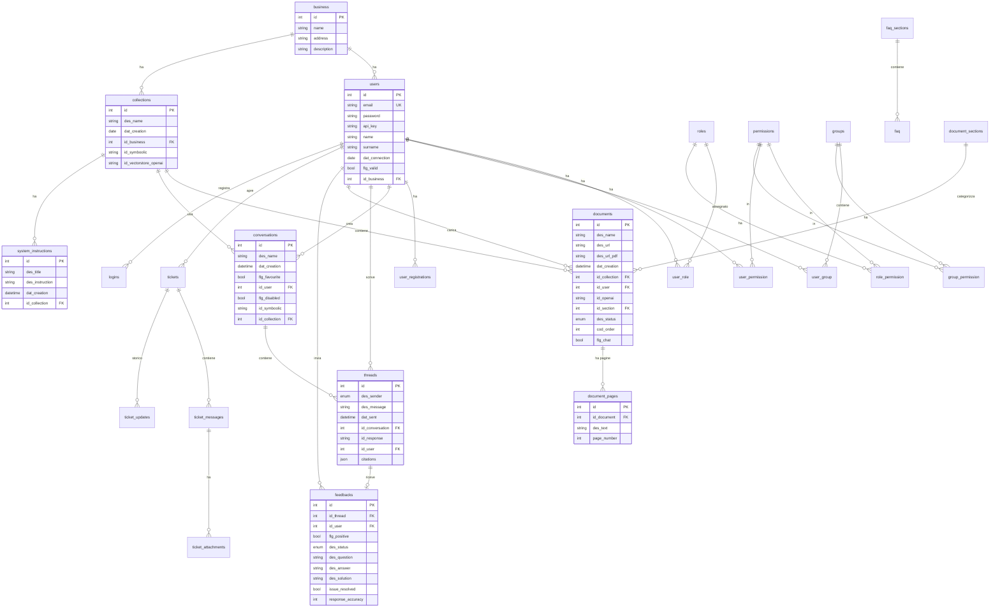

# CAE GenAI - Analisi Completa Repository

## 1. Overview

**Applicazione**: Piattaforma GenAI per CAE (cliente). Chat conversazionale con RAG (Retrieval-Augmented Generation) su documenti aziendali, alimentata da OpenAI.

**Industria**: Non specificata nel codice. CAE e un cliente generico con esigenze di AI conversazionale su knowledge base documentale.

**Funzionalita principali**:
- Chat conversazionale con streaming SSE, basata su OpenAI Responses API (gpt-4.1 / gpt-5)
- Upload documenti (PDF, DOCX, PPTX) con indicizzazione su OpenAI Vector Store
- Estrazione testo pagina per pagina (PyMuPDF) per citazioni inline precise
- Conversione file non-PDF in PDF tramite servizio esterno pdfrest.com
- Sistema di feedback sulle risposte AI (positive/negative, risoluzione, accuratezza)
- Knowledge base organizzata in collezioni e sezioni documenti
- Web search opzionale nelle risposte AI
- Sistema completo di ticketing (con integrazione Wolico)
- User management con ruoli, gruppi, permessi (RBAC)
- FAQ management
- Analytics login

## 2. Versioni

| Componente | Versione |
|---|---|
| App (`version.txt`) | **1.0.1** |
| Template (`version.laif-template.txt`) | **5.3.5** |
| `values.yaml` version | 1.1.0 |
| laif-ds (frontend) | ^0.2.33 |
| Python | ~3.12 |
| Node/Next.js | 15.3.3 |

## 3. Team (Contributors)

| Commits | Autore |
|---|---|
| 235 | Pinnuz |
| 133 | mlife |
| 101 | bitbucket-pipelines |
| 92 | Simone Brigante |
| 91 | Marco Pinelli |
| 49 | sadamicis |
| 36 | github-actions[bot] |
| 28 | Daniele DN |
| 23 | angelolongano |
| 21 | Matteo Scalabrini |
| 19 | Marco Vita |
| 17 | cavenditti-laif |
| 16 | neghilowio |
| 15 | SimoneBriganteLaif |
| 13 | Carlo A. Venditti |
| 12 | tancredibosiLaif |
| 11 | Carlo Antonio Venditti |
| 8 | TancrediBosi |

> Nota: repository migrata da Bitbucket a GitHub (101 commit da bitbucket-pipelines).

## 4. Stack Tecnico

### Backend
- **Framework**: FastAPI 0.105 (pinned, versioni successive rompono file upload)
- **ORM**: SQLAlchemy 2.0.0
- **DB**: PostgreSQL (psycopg2-binary)
- **Migrazioni**: Alembic 1.8.1 + alembic-postgresql-enum
- **Auth**: python-jose (JWT), bcrypt, passlib
- **AI/LLM**: openai 1.107.0 (Responses API + Chat Completions + Embeddings + Vector Store)
- **PDF**: PyMuPDF 1.25.5 (estrazione testo)
- **DOCX**: python-docx 1.1.2
- **Vector DB**: pgvector 0.3.3 (dependency presente, ma vector store gestito lato OpenAI)
- **HTTP Client**: httpx 0.24 + requests 2.31
- **AWS**: boto3, requests-aws4auth
- **CLI**: typer 0.7
- **Package manager**: uv

### Frontend
- **Framework**: Next.js 15.3.3 (Turbopack)
- **React**: 19.1.0
- **State**: Redux Toolkit + React Query (TanStack Query 5.80)
- **Tabelle**: TanStack React Table 8.21
- **Design System**: laif-ds ^0.2.33
- **Styling**: Tailwind CSS 4.1 + tailwind-merge + tailwind-variants
- **Forms**: react-hook-form 7.58
- **Markdown**: react-markdown + remark-gfm + remark-math + rehype-katex
- **Syntax Highlighting**: react-syntax-highlighter
- **Charts**: amcharts5
- **DnD**: @hello-pangea/dnd
- **Rich Text**: Draft.js + plugins (mention, export-html)
- **SSE**: @microsoft/fetch-event-source
- **Excel**: xlsx 0.18.5
- **API Client**: @hey-api/openapi-ts + @hey-api/client-axios
- **Animations**: framer-motion
- **i18n**: react-intl
- **Notifiche**: react-hot-toast

### Infrastruttura
- Docker Compose (db PostgreSQL + backend FastAPI)
- Frontend locale (`npm run dev` su porta 8080)
- AWS (ECS) per deploy (account dev: 182399720426, prod: 396608770058, regione eu-west-1)
- Integrazione Wolico (ticketing/monitoring LAIF interno)

### Dipendenze NON standard (rispetto al template base)
**Backend (gruppi extra in pyproject.toml)**:
- `openai` 1.107.0 (gruppo `llm`)
- `pgvector` 0.3.3 (gruppo `llm`)
- `PyMuPDF` 1.25.5 (gruppo `pdf`)
- `python-docx` 1.1.2 (gruppo `docx`)

**Frontend (non-template)**:
- `react-markdown`, `remark-gfm`, `remark-math`, `rehype-katex` - rendering markdown con formule matematiche
- `react-syntax-highlighter` - code blocks nella chat
- `katex` - rendering formule LaTeX
- `@microsoft/fetch-event-source` - streaming SSE per chat
- `@amcharts/amcharts5` - grafici analytics
- `@hello-pangea/dnd` - drag and drop (riordinamento documenti)
- `draft-js` + plugins - rich text editor
- `xlsx` - export Excel

## 5. Modello Dati Completo

### Schema `template` (tabelle gestione utenti e supporto)

| Tabella | Colonne | Note |
|---|---|---|
| **business** | id, name, address, description | Azienda/tenant |
| **users** | id, email, password, api_key, last_api_key_values, name, surname, dat_connection, flg_valid, id_business (FK business) | Utenti con API key |
| **roles** | id, name, description | Ruoli (admin-laif, admin, manager, user) |
| **permissions** | id, name, scope | Permessi granulari |
| **groups** | id, name | Gruppi utenti |
| **user_role** | id, id_user (FK users), id_role (FK roles) | M:N utenti-ruoli |
| **user_permission** | id, id_user (FK users), id_permission (FK permissions) | M:N utenti-permessi |
| **user_group** | id, id_user (FK users), id_group (FK groups) | M:N utenti-gruppi |
| **role_permission** | id, id_role (FK roles), id_permission (FK permissions) | M:N ruoli-permessi |
| **group_permission** | id, id_group (FK groups), id_permission (FK permissions) | M:N gruppi-permessi |
| **user_registrations** | id, id_user (FK users), token, tms_expiration | Registrazione utenti |
| **tickets** | id, des_title, id_user (FK users), cod_category, cod_status, cod_gravity, dat_creation, dat_update, flg_upload_wolico | Ticket supporto |
| **ticket_messages** | id, id_ticket (FK tickets), user_name, user_surname, user_email, user_business, des_message, dat_creation, flg_upload_wolico | Messaggi ticket |
| **ticket_attachments** | id, id_message (FK ticket_messages), des_name, des_url, dat_creation, flg_upload_wolico | Allegati ticket |
| **ticket_updates** | id, id_ticket (FK tickets), user_name/surname/email/business, cod_status, cod_gravity, dat_update, flg_upload_wolico | Storico aggiornamenti |
| **faq_sections** | id, name, cod_order | Sezioni FAQ |
| **faq** | id, id_section (FK faq_sections), question, answer, cod_order | FAQ |
| **runtasks** | uid, kind, title, status, description, dict_params (JSON), tms_start, tms_end | Task asincroni |

### Schema `demo` (tabelle GenAI/chat)

| Tabella | Colonne | Note |
|---|---|---|
| **collections** | id, des_name, dat_creation, id_business (FK business), id_symboolic, id_vectorstore_openai | Collezione documenti per RAG |
| **conversations** | id, des_name, dat_creation, flg_favourite, id_user (FK users), flg_disabled, id_symboolic, id_collection (FK collections) | Conversazioni chat |
| **threads** | id, des_sender (user/bot), des_message, dat_sent, id_conversation (FK conversations), id_response, id_user (FK users), citations (JSON) | Messaggi dentro conversazione |
| **feedbacks** | id, id_thread (FK threads), id_user (FK users), flg_positive, des_status (open/closed), des_question, des_answer, des_solution, issue_resolved, response_accuracy | Feedback su risposte AI |
| **documents** | id, des_name, des_url, des_url_pdf, dat_creation, id_collection (FK collections), id_user (FK users), id_openai, id_feedback (FK feedbacks), id_section (FK document_sections), des_status (loading/error/success), cod_order, flg_chat | Documenti caricati |
| **document_pages** | id, id_document (FK documents), des_text, page_number | Testo estratto per pagina |
| **document_sections** | id, name, cod_order | Sezioni/categorie documenti |
| **system_instructions** | id, des_title, des_instruction, dat_creation, id_collection (FK collections) | System prompt per collezione |
| **logins** | id, id_user (FK users), dat_login | Analytics login |

### Diagramma ER (Mermaid)



## 6. API Routes

### Chat / GenAI
| Metodo | Route | Descrizione |
|---|---|---|
| GET | `/conversations/{id}` | Dettaglio conversazione |
| POST | `/conversations/search` | Ricerca conversazioni |
| POST | `/conversations` | Crea conversazione |
| PUT | `/conversations/{id}` | Aggiorna conversazione |
| DELETE | `/conversations/{id}` | Elimina conversazione |
| POST | `/conversations/{id}/stream` | **Chat streaming SSE** (core GenAI) |
| GET | `/collections/{id}` | Dettaglio collezione |
| POST | `/collections/search` | Ricerca collezioni |
| POST | `/collections` | Crea collezione |
| PUT | `/collections/{id}` | Aggiorna collezione |
| DELETE | `/collections/{id}` | Elimina collezione |
| GET | `/documents/{id}` | Dettaglio documento |
| POST | `/documents` | Crea documento |
| PUT | `/documents/{id}` | Aggiorna documento |
| DELETE | `/documents/{id}` | Elimina documento (+ cleanup OpenAI) |
| POST | `/documents/{id}/upload` | Upload file documento |
| GET | `/documents/{id}/download` | Download file |
| POST | `/documents/reorder` | Riordina documenti |
| GET | `/document-sections/{id}` | Dettaglio sezione |
| POST | `/document-sections/search` | Ricerca sezioni |
| POST | `/document-sections` | Crea sezione |
| PUT | `/document-sections/{id}` | Aggiorna sezione |
| DELETE | `/document-sections/{id}` | Elimina sezione |
| GET | `/feedbacks/{id}` | Dettaglio feedback |
| POST | `/feedbacks/search` | Ricerca feedback |
| POST | `/feedbacks` | Crea feedback |
| PUT | `/feedbacks/{id}` | Aggiorna feedback |
| DELETE | `/feedbacks/{id}` | Elimina feedback |

### User Management
| Metodo | Route | Descrizione |
|---|---|---|
| POST | `/auth/login` | Login |
| POST | `/auth/refresh` | Refresh token |
| * | `/oauth2/*` | OAuth2 flow |
| CRUD | `/users/*` | Gestione utenti |
| CRUD | `/roles/*` | Gestione ruoli |
| CRUD | `/permissions/*` | Gestione permessi |
| CRUD | `/groups/*` | Gestione gruppi |
| CRUD | `/user-role/*` | Assegnazione ruoli utente |
| CRUD | `/user-permission/*` | Assegnazione permessi utente |
| CRUD | `/user-group/*` | Assegnazione gruppi utente |
| CRUD | `/role-permission/*` | Assegnazione permessi ruolo |
| CRUD | `/group-permission/*` | Assegnazione permessi gruppo |
| CRUD | `/business/*` | Gestione aziende/tenant |

### Ticketing / Support
| Metodo | Route | Descrizione |
|---|---|---|
| CRUD | `/tickets/*` | Gestione ticket |
| CRUD | `/ticket-messages/*` | Messaggi ticket |
| CRUD | `/ticket-attachments/*` | Allegati ticket |
| CRUD | `/ticket-updates/*` | Aggiornamenti ticket |
| * | `/ticket-data/*` | Dati aggregati ticket |
| CRUD | `/faq/*` | FAQ |
| CRUD | `/faq-sections/*` | Sezioni FAQ |

### Altro
| Metodo | Route | Descrizione |
|---|---|---|
| GET | `/summary` | Summary statistiche |
| GET | `/health` | Health check |
| * | `/login-analytics/*` | Analytics login |
| * | `/errors/*` | Audit errori |
| * | `/task/*` | Task management |

## 7. Business Logic

### Flusso Chat (core)
1. Utente invia domanda via POST `/conversations/{id}/stream`
2. Se primo messaggio: LLM genera titolo conversazione (gpt-4.1-mini, max 30 char)
3. Il messaggio utente viene salvato come `TemplateThread` (sender=user)
4. Si recupera la collezione del business dell'utente con il suo `id_vectorstore_openai`
5. Si recupera il system instruction associato alla collezione
6. Si avvia streaming via OpenAI Responses API (`gpt-4.1`) con:
   - `file_search` su vector store OpenAI (threshold 0.5)
   - `web_search_preview` opzionale
   - `previous_response_id` per continuita conversazione
7. Durante lo stream: yield di ogni chunk come SSE JSON
8. Al `response.completed`: match citazioni con documenti in DB, ricerca pagina esatta (exact + fuzzy), salvataggio thread bot con citazioni
9. Risposta include citazioni inline con riferimento a file, sezione e numero pagina

### Upload Documenti
1. File caricato su S3 (tramite CRUDService base)
2. Se non PDF: conversione via pdfrest.com API esterna
3. PDF caricato su OpenAI Files API
4. File allegato a Vector Store OpenAI
5. Estrazione testo per pagina con PyMuPDF e salvataggio in `document_pages`
6. Status tracking: loading -> success/error

### Integrazione Wolico
- Client singleton `WolicoClient` con autenticazione JWT cached (12h)
- Sync ticket, messaggi, allegati, aggiornamenti verso piattaforma Wolico
- Flag `flg_upload_wolico` su tutte le entita ticket per tracking sync
- Invio errori backend/frontend a Wolico

### Modelli LLM utilizzati
- `gpt-4.1` - chat streaming principale
- `gpt-4.1-mini` - generazione titoli conversazione
- `gpt-5` - metodo `llm_response` generico
- `text-embedding-3-small` - embedding (presente ma usato lato OpenAI Vector Store)

## 8. Integrazioni Esterne

| Servizio | Libreria | Scopo |
|---|---|---|
| **OpenAI API** | openai 1.107.0 | Chat completions, Responses API, Files, Vector Stores, Embeddings |
| **pdfrest.com** | requests (REST) | Conversione file (DOCX/PPTX -> PDF) |
| **AWS S3** | boto3 | Storage documenti |
| **AWS Parameter Store** | boto3 | Secrets management |
| **Wolico** | httpx (REST) | Ticketing/monitoring LAIF |
| **OAuth2 Provider** | httpx | SSO (configurabile) |

## 9. Frontend - Albero Pagine

```
/                                           -> Login page
/(authenticated)/
  /(template)/
    conversation/
      chat/                                 -> Chat AI (home page default)
      knowledge/                            -> Knowledge base (collezioni/documenti)
        detail/                             -> Dettaglio collezione con documenti
      feedback/                             -> Lista feedback
      analytics/                            -> Analytics conversazioni
    help/
      faq/                                  -> FAQ
      ticket/                               -> Ticket supporto
    profile/                                -> Profilo utente
    user-management/
      user/                                 -> Lista utenti
        create/                             -> Creazione utente
        detail/
          info/                             -> Info utente
          roles/                            -> Ruoli utente
          groups/                           -> Gruppi utente
      role/                                 -> Lista ruoli
      permission/                           -> Lista permessi
      group/                                -> Lista gruppi
        detail/                             -> Dettaglio gruppo
      business/                             -> Lista business
/(not-auth-template)/
  logout/                                   -> Logout
  registration/                             -> Registrazione
```

**Home page**: `/conversation/chat/` (configurato in `navigation.tsx`)
**Tema**: dark (default)

## 10. Deviazioni dal laif-template

### Aggiunte specifiche per GenAI
- **Schema `demo`**: intero schema DB dedicato (conversations, threads, collections, documents, document_pages, feedbacks, system_instructions, logins)
- **`template/chat/`**: modulo completo con conversation, collections, documents, document_sections, feedback + `gen_ai_provider.py`
- **`template/chat/gen_ai_provider.py`**: client OpenAI completo (Responses API, Vector Store, Files, Embeddings, Streaming)
- **`template/standard/error/openai.py`**: gerarchia errori OpenAI dedicata
- **`template/common/file_handler/pdf_rest.py`**: integrazione pdfrest.com
- **17 migrazioni Alembic** (da base fino a feedback_update)
- **`docs/prompt/`**: prompt engineering docs (FRONTEND_PAGE_NAVIGATION, LOVABLE_MIGRATION, create_data_model, create_schema_controller)
- **`docs/troisi/custom_email_style.md`**: styling email custom (riferimento a servizio Troisi)
- **Configurazione CORS S3** per preview PDF nel browser (react-pdf)
- **Webpack alias canvas=false** in Next.js per react-pdf compatibility
- **Dipendenze frontend**: react-markdown, katex, react-syntax-highlighter, fetch-event-source, amcharts5, xlsx, @hello-pangea/dnd, draft-js

### Settings custom nel template
- `gen_ai_provider`, `gen_ai_api_key`, `gen_ai_collection_id` - configurazione OpenAI
- `pdfrest_api_key` - chiave per conversione PDF
- `troisi_access_key_id`, `troisi_secret_access_key`, `troisi_uri` - servizio Troisi (email/notifiche)

### File app custom quasi vuoti
- `backend/src/app/controller.py` - nessun controller custom (tutto nel template)
- `backend/src/app/models.py` - solo import settings
- `backend/src/app/enums.py` - vuoto
- `backend/src/app/config.py` - solo estensione base senza override

> **Nota importante**: tutta la logica GenAI e stata implementata dentro `template/` anziche `app/`. Questo e una deviazione dalla convenzione (custom code dovrebbe stare in `app/`), suggerendo che il progetto potrebbe essere stato concepito come estensione del template stesso (per diventare il "template GenAI" di LAIF).

## 11. Pattern Notevoli

### Streaming SSE con citazioni inline
Il `gen_ai_provider.py` implementa un pattern sofisticato di streaming:
- Usa l'OpenAI Responses API (non Assistants API legacy)
- Gestisce `previous_response_id` per continuita conversazionale
- Processa eventi di annotazione (URL citations + file citations) in real-time
- Match citazioni con documenti in DB e ricerca fuzzy della pagina
- Inserisce marcatori di citazione inline nel testo (`source`)

### RouterBuilder pattern
Tutte le route usano un `RouterBuilder` dichiarativo che genera automaticamente CRUD + search + upload/download. Pattern molto pulito e ripetibile.

### Upload pipeline multi-step
Il flusso di upload documenti e una pipeline a 3 step asincrona:
1. Upload S3 + conversione PDF (se necessario)
2. Upload OpenAI + attach a vector store
3. Estrazione testo per pagina
Con tracking status (loading/error/success) e cleanup su errore.

### Collezioni per business (multi-tenant)
Le collezioni sono filtrate per `id_business`, implementando un soft multi-tenancy a livello di knowledge base.

## 12. Note e Tech Debt

### Tech Debt
- **FastAPI pinnata a 0.105**: le versioni >= 0.106 rompono il file upload (bug noto FastAPI #10857)
- **Starlette 0.27.0 pinnata**: dipendenza da FastAPI 0.105
- **httpx E requests**: due HTTP client in uso contemporaneamente (TODO nel pyproject.toml: "maybe only use one?")
- **Codice GenAI in `template/` anziche `app/`**: viola la convenzione template vs custom
- **`pgvector` in dipendenze ma vector store su OpenAI**: la dipendenza pgvector sembra non utilizzata attivamente (gli embedding sono gestiti lato OpenAI)
- **Nessun test specifico per la logica GenAI** visibile nella struttura
- **`app/enums.py` vuoto**: enums tutti in `template/enums.py`

### Peculiarita
- **Schema DB `demo`**: nome insolito per le tabelle GenAI in produzione
- **Doppia copia file in memoria** durante upload (`deepcopy` di BytesIO) per gestire le 3 operazioni (S3, OpenAI, text extraction)
- **System instructions per collezione**: ogni collezione puo avere un system prompt custom per il chatbot
- **Citazioni con ricerca fuzzy**: se il match esatto del testo non trova la pagina, usa word overlap >= 70%
- **Modelli LLM hardcoded** nei metodi (`gpt-4.1`, `gpt-5`, `gpt-4.1-mini`) - non configurabili da settings
- **`id_symboolic`** (typo: "symboolic") presente su conversations e collections - probabilmente riferimento a un servizio esterno Symboolic
- **Migrazioni numerate sequenzialmente** (00-17) invece del formato hash Alembic standard
- **react-pdf** menzionato in ProjectNotes.md ma non presente in package.json attuale (rimosso?)
- **`docs/prompt/LOVABLE_MIGRATION.md`**: suggerisce che parti del frontend potrebbero essere state migrate da Lovable (AI builder)
