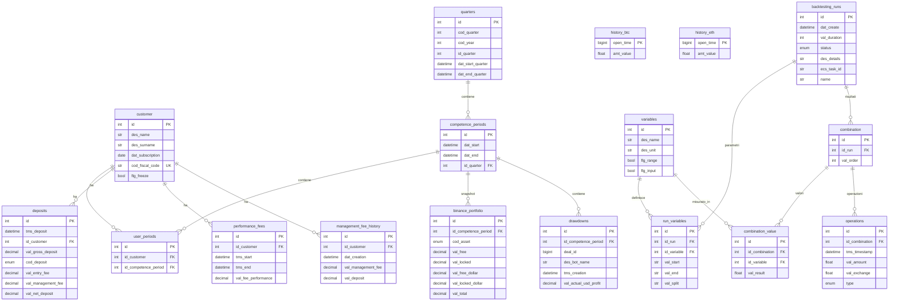

# COCI - Analisi Completa Repository

## 1. Overview

**Nome app**: COCI (Crypto Backtesting and Portfolio Management)
**Codice applicazione**: 2024044
**Descrizione**: Piattaforma di gestione portafoglio crypto e backtesting di strategie di trading. Consente di:
- Gestire clienti investitori e i loro depositi
- Monitorare il portafoglio Binance in tempo reale (BTC, ETH, USDC)
- Eseguire backtesting di strategie DCA (Dollar Cost Averaging) con parametri configurabili
- Calcolare performance fee, management fee e profitti trimestrali per cliente
- Tracciare drawdown via 3Commas

**Cliente**: interno / progetto crypto (non specificato un cliente esterno)
**Industria**: Fintech / Crypto Asset Management

---

## 2. Versioni

| Componente | Versione |
|---|---|
| App (`version.txt`) | **3.2.0** |
| laif-template (`version.laif-template.txt`) | **5.4.3** |
| `values.yaml` version | 1.1.0 |

---

## 3. Team (contributori principali)

| Contributore | Commit |
|---|---|
| mlife | 378 |
| Pinnuz | 303 |
| github-actions[bot] | 172 |
| bitbucket-pipelines | 116 |
| Simone Brigante | 92 |
| neghilowio | 91 |
| Marco Pinelli | 85 |
| mlaif | 75 |
| Matteo Scalabrini | 54 |
| cavenditti-laif | 49 |
| sadamicis | 49 |

---

## 4. Stack e deviazioni dal template

### Backend (Python 3.12)

**Dipendenze standard template**:
- FastAPI 0.105, SQLAlchemy 2.0.43, Alembic 1.8.1, Pydantic v2
- PostgreSQL (psycopg2-binary, asyncpg)
- boto3, bcrypt, passlib, python-jose (auth/AWS)
- httpx, requests, uvicorn, starlette

**Dipendenze NON standard (specifiche COCI)**:
| Dipendenza | Uso |
|---|---|
| `python-binance 1.0.25` | Client SDK Binance per lettura portafoglio |
| `polars >= 1.29.0` | DataFrame ad alte performance per simulazione backtesting |
| `sqlalchemy-utils 0.41.2` | Materialized views (create/refresh) |
| `aiohttp >= 3.13.0` | HTTP async (usato da python-binance internamente) |

**Dependency groups opzionali**:
- `pdf`: PyMuPDF
- `llm`: openai, pgvector
- `docx`: python-docx
- `xlsx`: xlsxwriter, pandas (attivo nel docker-compose via `ENABLE_XLSX: 1`)

### Frontend (Next.js 16 + React 19)

**Dipendenze NON standard**:
| Dipendenza | Uso |
|---|---|
| `@amcharts/amcharts5` | Grafici crypto (candlestick, portfolio) |
| `@tanstack/react-query` | Data fetching |
| `@reduxjs/toolkit` + `react-redux` | State management |
| `framer-motion` | Animazioni |
| `katex` + `rehype-katex` + `remark-math` | Rendering formule matematiche (chat AI) |
| `react-markdown` + `remark-gfm` | Markdown rendering |
| `react-hook-form` | Gestione form |
| `draft-js` + plugins | Rich text editor (mention) |
| `@hello-pangea/dnd` | Drag & drop |
| `tailwind-merge` | Utility CSS |

### Docker Compose

Servizi standard: `db` (PostgreSQL), `backend` (FastAPI).
**Deviazione**: il container algo (backtesting) ha un **Dockerfile separato** (`backend/src/app/algo/Dockerfile`) per esecuzione su **AWS ECS Fargate** come task standalone. Non e' nel docker-compose principale.

Esiste anche `docker-compose.wolico.yaml` per test locale con Wolico (error tracking).

---

## 5. Data Model Completo

### Tabelle (schema `prs`)

#### `customer`
| Colonna | Tipo | Note |
|---|---|---|
| id | int (PK) | |
| des_name | str | |
| des_surname | str | |
| dat_subscription | date | default now() |
| cod_fiscal_code | str | unique, indexed |
| flg_freeze | bool | default false, sospende investimento |

#### `quarters`
| Colonna | Tipo | Note |
|---|---|---|
| id | int (PK) | |
| cod_quarter | int | 1-4 (check constraint) |
| cod_year | int | 2000-9999 |
| id_quarter | int | computed: `year || quarter` |
| dat_start_quarter | datetime | |
| dat_end_quarter | datetime | nullable (null = attivo) |

#### `competence_periods`
| Colonna | Tipo | Note |
|---|---|---|
| id | int (PK) | |
| dat_start | datetime | |
| dat_end | datetime | nullable (null = aperto) |
| id_quarter | int (FK -> quarters.id) | CASCADE |

#### `user_periods`
| Colonna | Tipo | Note |
|---|---|---|
| id | int (PK) | |
| id_customer | int (FK -> customer.id) | |
| id_competence_period | int (FK -> competence_periods.id) | |
| | | unique(id_customer, id_competence_period) |

#### `deposits`
| Colonna | Tipo | Note |
|---|---|---|
| id | int (PK) | |
| tms_deposit | datetime | |
| id_customer | int (FK -> customer.id) | |
| val_gross_deposit | Numeric(12,2) | |
| cod_deposit | DepositType | deposit/uninvest/compound |
| val_entry_fee | Numeric(4,2) | 0-100 |
| val_management_fee | Numeric(4,2) | 0-100 |
| val_net_deposit | Numeric(12,2) | computed: `gross * (100-entry-mgmt)/100` |

#### `performance_fees`
| Colonna | Tipo | Note |
|---|---|---|
| id | int (PK) | |
| id_customer | int (FK -> customer.id) | CASCADE |
| tms_start | datetime | indexed |
| tms_end | datetime | nullable (null = attiva) |
| val_fee_performance | Numeric(4,2) | 0-1 |

#### `management_fee_history`
| Colonna | Tipo | Note |
|---|---|---|
| id | int (PK) | |
| id_customer | int (FK -> customer.id) | |
| dat_creation | datetime | |
| val_management_fee | Numeric(4,2) | 0-1 |
| val_deposit | Numeric(12,2) | snapshot depositi al momento |

#### `binance_portfolio`
| Colonna | Tipo | Note |
|---|---|---|
| id | int (PK) | |
| id_competence_period | int (FK -> competence_periods.id) | |
| cod_asset | ExtendedAssetType | btc/eth/usdc |
| val_free | Numeric(12,2) | |
| val_locked | Numeric(12,2) | |
| val_free_dollar | Numeric(12,2) | |
| val_locked_dollar | Numeric(12,2) | |
| val_total | Numeric(12,2) | computed: free_dollar + locked_dollar |

#### `drawdowns`
| Colonna | Tipo | Note |
|---|---|---|
| id | int (PK) | |
| id_competence_period | int (FK -> competence_periods.id) | |
| deal_id | BigInteger | ID deal 3Commas |
| des_bot_name | str | |
| tms_creation | datetime | |
| val_actual_usd_profit | Numeric(12,2) | |
| tms_update | datetime | |

#### `history_btc` / `history_eth`
| Colonna | Tipo | Note |
|---|---|---|
| open_time | BigInteger (PK) | timestamp unix, partizionato per mese |
| amt_value | float | prezzo di chiusura al secondo |

#### `GroupedCryptoData` (classi dinamiche: `HourBtc`, `DayBtc`, `HourEth`, `DayEth`)
| Colonna | Tipo | Note |
|---|---|---|
| date | datetime (PK) | |
| open | float | |
| close | float | |
| high | float | |
| low | float | |

#### `variables` (backtesting)
| Colonna | Tipo | Note |
|---|---|---|
| id | int (PK) | |
| des_name | str | es: perc_take_profit, perc_downside... |
| dat_create | datetime | |
| des_unit | str | |
| flg_range | bool | se ha range start/end/split |
| flg_input | bool | se e' parametro di input |

#### `backtesting_runs`
| Colonna | Tipo | Note |
|---|---|---|
| id | int (PK) | |
| dat_create | datetime | |
| val_duration | int | secondi |
| status | RunStatusType | draft/progress/error/completed/killed |
| des_details | str | dettagli errore |
| ecs_task_id | str | ID task Fargate |
| flg_modified | bool | |
| name | str | |

#### `run_variables`
| Colonna | Tipo | Note |
|---|---|---|
| id | int (PK) | |
| id_run | int (FK -> backtesting_runs.id) | CASCADE |
| id_variable | int (FK -> variables.id) | |
| val_start | str | |
| val_end | str | nullable (per range) |
| val_split | str | nullable (per range) |

#### `combination`
| Colonna | Tipo | Note |
|---|---|---|
| id | int (PK) | |
| id_run | int (FK -> backtesting_runs.id) | CASCADE |
| val_order | int | ordine risultato (top 5) |

#### `combination_value`
| Colonna | Tipo | Note |
|---|---|---|
| id | int (PK) | |
| id_combination | int (FK -> combination.id) | CASCADE |
| id_variable | int (FK -> variables.id) | |
| val_result | float | |

#### `operations`
| Colonna | Tipo | Note |
|---|---|---|
| id | int (PK) | |
| id_combination | int (FK -> combination.id) | CASCADE |
| tms_timestamp | datetime | |
| val_amount | float | |
| val_exchange | float | prezzo crypto al momento |
| type | TransactionType | in/out |

### Materialized Views

- **`user_period_shares_mv`**: profitto lordo per cliente per periodo di competenza, calcola percentuale portafoglio e investito
- **`user_period_mv`**: aggiunge profitto trimestrale cumulativo e performance fee
- **`quarterly_profit_mv`**: profitto netto trimestrale per cliente, con management fee, debiti cumulativi

Le view vengono refreshate in ordine (shares -> user_period -> quarterly_profit) dopo ogni operazione rilevante.

### Diagramma ER



---

## 6. API Routes

### Backtesting
| Metodo | Endpoint | Descrizione |
|---|---|---|
| GET | `/backtesting_runs/search` | Lista run |
| POST | `/backtesting_runs/` | Crea run |
| PUT | `/backtesting_runs/{id}` | Aggiorna run |
| DELETE | `/backtesting_runs/{id}` | Elimina run |
| POST | `/backtesting_runs/{id_run}/run` | Avvia esecuzione (bg task o ECS Fargate) |
| GET | `/backtesting_runs/{id_run}/complete` | Callback da Fargate a fine run |
| GET | `/backtesting_runs/{id_run}/kill` | Ferma task ECS |
| GET | `/backtesting_runs/crypto-data` | Dati crypto aggregati (candlestick) |

### Backtesting - Variabili, Combinazioni, Run Variables
| Metodo | Endpoint | Descrizione |
|---|---|---|
| GET | `/variables/search` | Lista variabili |
| GET | `/run_variables/search` | Lista variabili di una run |
| GET | `/combinations/search` | Lista combinazioni risultato |

### Binance
| Metodo | Endpoint | Descrizione |
|---|---|---|
| GET | `/binance` | Download on-demand dati storici |
| GET | `/portfolio/search` | Portafoglio Binance corrente |
| POST | `/portfolio/fetch-data` | Trigger fetch portafoglio + drawdown |

### Clienti
| Metodo | Endpoint | Descrizione |
|---|---|---|
| GET | `/customers/search` | Lista clienti |
| GET | `/customers/{id}` | Dettaglio cliente |
| POST | `/customers/` | Crea cliente (con performance fee iniziale) |
| PUT | `/customers/{id}` | Aggiorna cliente (gestisce freeze) |

### Periodi e Quarter
| Metodo | Endpoint | Descrizione |
|---|---|---|
| GET | `/competence-period/search` | Lista periodi competenza |
| POST | `/competence-period/` | Crea periodo (chiude precedente, crea user_periods) |
| GET | `/quarters/search` | Lista quarter |
| POST | `/quarters/` | Crea quarter (chiude precedente, crea nuovo CP) |
| GET | `/quarters/profit` | Profitti trimestrali (materialized view) |
| GET | `/quarters/owner` | Ownership per quarter (importi investiti) |

### Depositi e Fee
| Metodo | Endpoint | Descrizione |
|---|---|---|
| GET | `/deposits/search` | Lista depositi |
| POST | `/deposits/` | Crea deposito (refresh MV) |
| DELETE | `/deposits/{id}` | Elimina deposito |
| GET | `/fee/search` | Lista performance fee |
| POST | `/fee/` | Crea performance fee |
| POST | `/management-fee/batch` | Batch create management fee |

### Drawdown
| Metodo | Endpoint | Descrizione |
|---|---|---|
| GET | `/drawdown/search` | Lista drawdown |

### User Period
| Metodo | Endpoint | Descrizione |
|---|---|---|
| GET | `/user-period-mv/` | Dati materialized view per periodo/cliente |

### Operations
| Metodo | Endpoint | Descrizione |
|---|---|---|
| GET | `/operations/search` | Lista operazioni backtesting |

### Changelog
| Metodo | Endpoint | Descrizione |
|---|---|---|
| GET | `/changelog/...` | Changelog tecnico e customer |

---

## 7. Business Logic Complessa

### Algoritmo di Backtesting (modulo `algo`)

Il cuore dell'applicazione. Simula una **strategia DCA con extra-order e take-profit** su dati storici crypto (BTC/ETH al secondo).

**Parametri configurabili per run**:
- `perc_base_order`: % capitale per ordine base
- `perc_extra_order`: % capitale per ordini extra
- `perc_downside`: % ribasso per trigger acquisto
- `perc_take_profit`: % rialzo per trigger vendita
- `mg_extra_order`: moltiplicatore extra order
- `mg_downside`: moltiplicatore downside
- `amt_capital`: capitale iniziale
- `min_coverage`: copertura minima richiesta
- `max_drawdown`: drawdown massimo tollerato
- `dat_start`/`dat_end`: periodo simulazione
- `asset`: BTC o ETH

**Flusso**:
1. Genera tutte le combinazioni dei parametri (prodotto cartesiano)
2. Filtra per copertura minima
3. Verifica limite righe (max 40M) per evitare OOM
4. Esegue simulazione con **multiprocessing** (8 worker)
5. Seleziona **top 5 combinazioni**: 2 per Sortino ratio, 1 per gain, 1 per gain/drawdown ratio, 1 per numero TP
6. Ri-simula le top 5 con dettaglio operazioni
7. Salva risultati in DB

**Esecuzione**: in locale come background task FastAPI, in produzione come **task ECS Fargate** su cluster dedicato (`coci-algo-cluster`). Al termine, Fargate chiama il backend per notificare completamento.

### Scheduled Tasks (startup)

- `binance_schedule_batch`: ogni ora, scarica dati storici da Binance Vision (solo di notte, ore 0-1)
- `get_binance_portfolio_data`: all'avvio, legge portafoglio da API Binance
- `update_drawdowns`: all'avvio, legge drawdown da 3Commas
- `get_binance_and_drawdowns_data`: ogni ora, aggiorna portafoglio + drawdown + refresh MV

### Materialized Views

Sistema a 3 livelli di materialized view per calcolo performance:
1. **user_period_shares_mv**: calcola quota di portafoglio per cliente basata su depositi netti
2. **user_period_mv**: aggiunge profitto trimestrale cumulativo e performance fee
3. **quarterly_profit_mv**: calcola profitto netto con management fee e debiti cumulativi

Refreshate in cascata dopo: depositi, nuovi periodi, aggiornamento portafoglio Binance.

### Gestione Competence Period e Quarter

Logica complessa di lifecycle:
- Alla creazione di un nuovo quarter: chiude il precedente, chiude il CP aperto, ne crea uno nuovo, assegna tutti i clienti attivi
- Freeze cliente: chiude il CP corrente, ne crea uno nuovo senza il cliente freezato
- Ogni chiusura CP: aggiorna valori portafoglio Binance, resetta drawdown

---

## 8. Integrazioni Esterne

| Servizio | Protocollo | Uso |
|---|---|---|
| **Binance API** | SDK `python-binance` | Lettura portafoglio (account, flexible/locked earn, ticker prezzi USDC) |
| **Binance Vision** | HTTP (download ZIP CSV) | Dati storici kline 1s per BTC/ETH da `data.binance.vision` |
| **3Commas API** | httpx async, HMAC-SHA256 | Lettura deals attivi per calcolo drawdown |
| **AWS ECS Fargate** | boto3 `ecs.run_task` | Esecuzione task backtesting su cluster dedicato |
| **AWS SSM** | boto3 `ssm.get_parameter` | Recupero parametri app (link, credenziali admin) per callback |
| **AWS Secrets Manager** | boto3 `secretsmanager` | Credenziali DB per container algo |
| **Wolico** | error_handler (template) | Invio errori background task a Wolico |

**Configurazione credenziali** (in `app/config.py`):
- `three_commas_public` / `three_commas_private` (+ varianti `_local`)
- `binance_public` / `binance_private`

---

## 9. Frontend - Mappa Pagine

### Pagine App (custom)
```
/ (home) -> redirect a /backtesting_run/
/backtesting_run/                  - Lista run backtesting
/backtesting_run/detail/           - Dettaglio run (combinazioni, operazioni, grafico crypto)
/competence_period/                - Gestione periodi competenza (KPI, drawdown tab, users tab)
/quarters/                         - Gestione quarter (profitti, management fee)
/profits/                          - Vista profitti
/customers/                        - Lista clienti
/customers/detail/                 - Dettaglio cliente (generale, investimenti, transazioni, fee)
/changelog-customer/               - Changelog per il cliente
/changelog-technical/              - Changelog tecnico
```

### Pagine Template (standard)
```
/conversation/chat/                - Chat AI
/conversation/analytics/           - Analytics conversazioni
/conversation/feedback/            - Feedback conversazioni
/conversation/knowledge/           - Knowledge base
/files/                            - File management
/help/faq/                         - FAQ
/help/ticket/                      - Ticket
/profile/                          - Profilo utente
/user-management/user/             - Gestione utenti
/user-management/group/            - Gestione gruppi
/user-management/role/             - Gestione ruoli
/user-management/permission/       - Gestione permessi
/user-management/business/         - Gestione business
/logout/                           - Logout
/registration/                     - Registrazione
```

### Componenti custom rilevanti
- `CryptoStockChart`: grafico candlestick crypto (amcharts5)
- `PortfolioValueChart`: grafico valore portafoglio
- `CombinationCard`: card risultato combinazione backtesting
- `RunCard`: card run backtesting

**Tema**: dark di default, con opzione switch tema.

---

## 10. Deviazioni dal laif-template

### Aggiunte significative

| File/Cartella | Descrizione |
|---|---|
| `backend/src/app/algo/` | **Modulo algoritmo backtesting** con Dockerfile dedicato per ECS Fargate |
| `backend/src/app/algo/Dockerfile` | Container separato per esecuzione algoritmo |
| `backend/src/app/algo/pyproject.toml` | Dipendenze ridotte per container algo |
| `backend/src/app/materialized_views.py` | Framework MvBase per materialized views |
| `backend/src/app/general.py` | BaseWithId con tipi Numeric custom, helper Wolico |
| `backend/src/app/binance/queries/aggregation.sql` | SQL raw per aggregazione dati crypto |
| `backend/src/app/algo/algorithm/queries/*.sql` | Query SQL per estrazione dati storici |
| `backend/src/app/backtesting/combination/queries/portfolio.sql` | Query portafoglio |
| `docker-compose.wolico.yaml` | Compose con network Wolico per test locale |
| `.windsurf/rules/` | 8 file di regole per Windsurf AI assistant |
| `frontend/src/components/CryptoStockChart/` | Grafico candlestick |
| `frontend/src/components/PortfolioValueChart/` | Grafico portafoglio |

### Dipendenze non standard
- `python-binance`: SDK specifico per Binance
- `polars`: DataFrame per simulazione ad alte prestazioni (non pandas)
- `sqlalchemy-utils`: per materialized views
- `@amcharts/amcharts5`: grafici finanziari avanzati

### Classi ORM dinamiche
Pattern insolito: le classi `GroupedCryptoData` vengono create **dinamicamente** a runtime con `type()` per ogni combinazione `{period}_{crypto}` (HourBtc, DayBtc, HourEth, DayEth).

### Partizionamento tabelle
Le tabelle `history_btc` e `history_eth` sono **partizionate per mese** (`part_2024_01`, ecc.) con creazione dinamica delle partizioni a runtime.

---

## 11. Pattern Notevoli

### Architettura a container separato per heavy computation
Il modulo `algo` ha un proprio Dockerfile e viene eseguito come task ECS Fargate separato. Il container:
1. Si connette al DB autonomamente (legge credenziali da Secrets Manager)
2. Esegue il backtesting con multiprocessing (8 worker)
3. Al termine, chiama il backend via HTTP per notificare il completamento (login + API call)

### Materialized View a cascata
3 livelli di materialized view che dipendono l'una dall'altra, refreshate in ordine. Pattern utile per calcoli finanziari complessi che non possono essere calcolati on-the-fly.

### Polars per simulazione
Uso di Polars (non Pandas) per iterazione efficiente su dataframe di dati storici crypto (milioni di righe al secondo).

### Lifecycle hooks nei Service
I `CRUDService` custom (CompetencePeriodService, QuarterService, DepositService, CustomerService) implementano pre/post hook complessi nella `create_item` per orchestrare chiusura periodi, creazione user_periods, refresh MV.

---

## 12. Note e Tech Debt

### Problemi noti
- **FastAPI bloccato a 0.105**: commento nel pyproject.toml: "DON'T UPGRADE. FastAPI>=0.106 breaks file upload"
- **TODO nel pyproject.toml**: "TODO maybe only use one?" riferito a httpx + requests (doppio client HTTP)
- **WARNING in materialized_views.py**: "bug, currently CreateView does not consider schema and creates the view in the public schema"
- **CHANGELOG.md non aggiornato**: contiene solo "0.1 2024-10-28 First release" nonostante l'app sia alla v3.2.0

### Sicurezza
- Credenziali 3Commas e Binance in settings (caricate da env/SSM)
- Il container algo fa login al backend con credenziali admin per il callback -- pattern fragile

### Scalabilita'
- Il backtesting ha un limite di 40M righe (combo * giorni) per evitare OOM
- Max 3 run concorrenti (hard limit nel trigger)
- Il multiprocessing con 8 worker nel container Fargate richiede risorse adeguate

### Peculiarita'
- Lo storico crypto viene scaricato da `data.binance.vision` come file ZIP CSV giornalieri (dati al secondo)
- Le partizioni PostgreSQL per i dati storici vengono create dinamicamente con SQL raw
- Il dark theme e' il default (unica app LAIF con questa scelta)
- La pagina home di default e' `/backtesting_run/` (non una dashboard)
