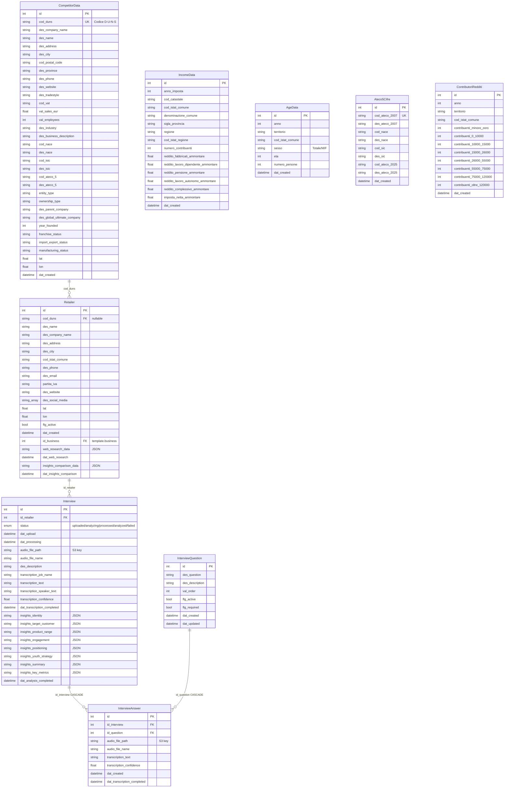

# Competitive Retail (Fiera Milano)

## 1. Overview

**Applicazione**: Piattaforma di Competitive Intelligence per il settore retail, sviluppata per **Fiera Milano**.

**Settore**: Fiere / Retail / Market Intelligence

**Cosa fa**: L'app permette di raccogliere, analizzare e confrontare dati su retailer e competitor nel mercato italiano. Le funzionalita principali sono:
- **Gestione Retailer**: CRUD retailer con associazione a business (multi-tenant)
- **Interviste AI-powered**: Upload audio interviste ai negozianti, trascrizione automatica via OpenAI Whisper, analisi semantica con GPT-4o-mini per estrarre insight strutturati (identita, target, posizionamento, strategia giovani, ecc.)
- **Web Research AI**: Ricerca automatica informazioni pubbliche sui retailer tramite OpenAI Responses API con tool `web_search`
- **Confronto Insights vs Web**: Generazione AI del confronto tra dati intervista e dati ricerca web
- **Analisi Competitiva**: Ricerca competitor per raggio geografico (haversine distance), con filtri per settore, codice NACE/ATECO/ISIC, tipo proprietà, franchise
- **Analisi Socio-Demografica**: Dati reddituali ISTAT per comune/provincia/regione, dati demografici per eta, contribuenti per classi di reddito
- **Mappa Leaflet**: Visualizzazione geolocalizzata competitor e retailer
- **Sistema RBAC custom**: Permessi app-specifici assegnati automaticamente a ruoli (admin, admin-laif, user) allo startup

**Repository**: `competitive-retail`
**Nome app AWS**: `fiera-milano`
**Cod applicazione**: `2025087`

---

## 2. Versioni

| Componente | Versione |
|---|---|
| App (`version.txt`) | **0.1.5** |
| `values.yaml` | 1.1.0 |
| laif-template (`version.laif-template.txt`) | **5.6.0** |
| laif-template (README) | Creata da template 5.4.1 |
| laif-ds (frontend) | **0.2.67** |
| Node.js | >= 24.0.0 |
| Python | >= 3.12, < 3.13 |

**Primo commit**: 2024-03-04
**Totale commit**: ~1341

---

## 3. Team (top contributor)

| Contributor | Commit |
|---|---|
| Pinnuz (Marco Pinelli) | 269 |
| mlife | 198 |
| github-actions[bot] | 106 |
| Simone Brigante | 92 |
| bitbucket-pipelines | 86 |
| Marco Pinelli | 85 |
| neghilowio | 75 |
| cavenditti-laif | 50 |
| sadamicis | 49 |
| Alessandro Grotti | 43 |

---

## 4. Stack e dipendenze non-standard

### Backend (Python 3.12)

**Dipendenze standard template**: FastAPI, SQLAlchemy 2.0, Pydantic v2, Alembic, boto3, uvicorn, bcrypt/passlib, python-jose, jinja2

**Dipendenze NON-standard (app-specifiche)**:
| Dipendenza | Scopo |
|---|---|
| `openai ~=2.14.0` | Trascrizione Whisper + analisi GPT-4o-mini + web research GPT-4o |
| `pgvector ~=0.4.2` | Embedding vettoriali (gruppo `llm`, usato probabilmente dal template chat) |
| `PyMuPDF ~=1.26.7` | Gestione PDF |
| `python-docx ~=1.2.0` | Generazione documenti Word |
| `xlsxwriter ~=3.2.2` | Generazione file Excel |
| `pandas ~=2.3.3` | Data processing (usato per import dati CSV) |
| `aiohttp ~=3.13.0` | HTTP client async aggiuntivo |

**Nota**: `pyproject.toml` contiene un TODO: "maybe only use one?" per `httpx` + `requests` (entrambi presenti).

### Frontend (Next.js 16 + React 19)

**Dipendenze NON-standard (app-specifiche)**:
| Dipendenza | Scopo |
|---|---|
| `leaflet` + `react-leaflet` + `@types/leaflet` | Mappe interattive per visualizzazione competitor |
| `@amcharts/amcharts5` | Grafici avanzati (analisi socio-demografica, competitive) |
| `@hello-pangea/dnd` | Drag & Drop (probabilmente per ordinamento domande intervista) |
| `lucide-react` | Icone (non standard template) |
| `draft-js` + plugin | Editor rich text con menzioni |
| `katex` + `rehype-katex` + `remark-math` | Rendering formule matematiche |
| `framer-motion` | Animazioni |
| `react-markdown` + `remark-gfm` | Rendering Markdown |
| `react-syntax-highlighter` | Highlighting codice |

### Docker Compose

Servizi standard: `db` (PostgreSQL), `backend` (FastAPI). Nessun servizio extra.
File speciale: `docker-compose.wolico.yaml` per integrazione con rete Wolico condivisa.

---

## 5. Modello dati completo

### Tabelle applicative (schema `prs`)



**Nota**: `IncomeData` ha molte piu colonne (circa 30 campi reddituali con freq + ammontare per ogni tipologia). Il diagramma mostra solo i principali.

### Tabelle template (schema `template`)

Standard laif-template: `business`, `user`, `role`, `permission`, `role_permission`, `user_role`, `group`, ecc.

---

## 6. API Routes

### App Routes

| Prefisso | Tag | Endpoint | Metodo | Descrizione |
|---|---|---|---|---|
| `/retailers` | Retailers | CRUD standard | GET/POST/PUT/DELETE | CRUD con business scoping |
| `/retailers` | Retailers | `/{id}/web-research` | POST | Lancia ricerca web AI |
| `/retailers` | Retailers | `/{id}/web-research` | GET | Recupera dati ricerca web salvati |
| `/retailers` | Retailers | `/{id}/insights-comparison` | POST | Genera confronto AI intervista vs web |
| `/retailers` | Retailers | `/{id}/insights-comparison` | GET | Recupera confronto salvato |
| `/interviews` | Interviews | search/get/update/delete | GET/PUT/DELETE | CRUD standard |
| `/interviews` | Interviews | `/upload` | POST | Upload file audio intervista (MP4) |
| `/interviews` | Interviews | `/create` | POST | Crea intervista vuota (per risposte per-domanda) |
| `/interviews` | Interviews | `/{id}/transcription` | GET | Stato trascrizione |
| `/interviews` | Interviews | `/{id}/retry-transcription` | POST | Riprova trascrizione fallita |
| `/interviews` | Interviews | `/{id}/analyze` | POST | Analisi AI della trascrizione |
| `/interviews` | Interviews | `/{id}/answers` | GET/POST | CRUD risposte audio per domanda |
| `/interviews` | Interviews | `/{id}/answers/{aid}` | DELETE | Elimina risposta audio |
| `/interview-questions` | Interview Questions (Admin) | CRUD standard | GET/POST/PUT/DELETE | Gestione domande configurabili |
| `/competitor-data` | Competitor Data | `/by-vat/{vat}` | GET | Lookup per P.IVA |
| `/competitor-data` | Competitor Data | `/by-duns/{duns}` | GET | Lookup per codice DUNS |
| `/competitor-analysis` | Competitor Analysis | `/retailers/{id}/competitors` | GET | Competitor per raggio geografico |
| `/income-data` | Income Data | `/{id}`, `/by-comune/`, `/by-city/`, `/by-regione/`, `/by-provincia/` | GET | Dati reddituali ISTAT |
| `/income-data` | Income Data | `/`, `/filters/available-years`, `/filters/available-regioni`, `/filters/available-province` | GET | Ricerca e filtri |
| `/age-data` | Age Data | `/{id}`, `/by-territorio/`, `/by-comune/`, `/latest/`, `/territories/list` | GET | Dati demografici per eta |
| `/contributori-redditi` | Contributori Redditi | `/{id}`, `/by-comune/`, `/by-territorio/`, `/` | GET | Contribuenti per classi di reddito |
| `/changelog` | Changelog | `/` | GET | Changelog tecnico/cliente |

### Template Routes (standard)

Auth, Users, Roles, Permissions, Business, Groups, Files, Chat/Conversation, Ticketing, FAQ, Health, Notifications, Task, Summary, Analytics.

---

## 7. Business Logic

### Pipeline Intervista (Background Tasks)

Il flusso principale e un **pipeline asincrono a 3 stadi**:

1. **Upload Audio** -> File salvato su S3 (`interviews/{retailer_id}_{timestamp}_{uuid}.ext`)
2. **Trascrizione** (background task via `BackgroundTasks`):
   - Download file da S3
   - Invio a OpenAI Whisper (`whisper-1`, lingua italiana, prompt specifico retail)
   - Salvataggio trascrizione su DB
   - Per risposte per-domanda: quando tutte le risposte sono trascritte, le combina in un'unica trascrizione
3. **Analisi AI** (background task):
   - Invio trascrizione + dati retailer a GPT-4o-mini
   - Estrazione insight strutturati in JSON (identita, target, prodotti, engagement, posizionamento, strategia giovani, metriche chiave)
   - Salvataggio insight in colonne dedicate

### Web Research (OpenAI Responses API)

- Usa `gpt-4o` con tool `web_search` per cercare informazioni pubbliche sui retailer
- Cerca su registri aziendali, Google Maps, social, stampa
- Risultato salvato come JSON nel campo `web_research_data` del retailer

### Confronto AI (Comparison Service)

- Prende insight intervista + dati web research
- GPT-4o-mini genera un confronto strutturato (allineamenti, divergenze, dati complementari)
- Max 3 sezioni x 2-3 punti ciascuna

### Analisi Competitiva Geospaziale

- Calcolo distanza Haversine (formula sfera terrestre)
- Bounding box pre-filtro + calcolo distanza esatta
- Geocoding via **Nominatim OpenStreetMap** (con salvataggio coordinate in DB per cache)
- Filtri multipli: settore, NACE, ATECO 5 cifre, ISIC, ownership, franchise

### Permessi App (Startup)

- All'avvio registra 16 permessi app-specifici nel DB
- Li assegna automaticamente ai ruoli admin/admin-laif/user
- Admin: tutti i permessi business/retailers/interviews/competitor-data/demographics + admin area
- User: solo permessi `:read`

### Import dati CSV

La cartella `backend/src/app/data/` contiene script di importazione per:
- `import_competitors.py` - dati competitor D&B (Dun & Bradstreet)
- `import_redditi.py` - dati redditi ISTAT
- `import_age_data.py` - dati demografici ISTAT per eta
- `import_ateco_5_cifre.py` - codici ATECO a 5 cifre
- `populate_geocoding.py` - geocoding batch
- `link_retailers.py` - collegamento retailer a competitor_data

---

## 8. Integrazioni esterne

| Servizio | Utilizzo | Modulo |
|---|---|---|
| **OpenAI Whisper** (`whisper-1`) | Trascrizione audio interviste | `interview/transcription.py` |
| **OpenAI GPT-4o-mini** | Analisi trascrizioni + confronto insights | `interview/ai_service.py`, `interview/comparison_service.py` |
| **OpenAI GPT-4o** (Responses API + web_search) | Ricerca web su retailer | `interview/web_research_service.py` |
| **AWS S3** | Storage file audio interviste | `interview/storage.py` |
| **Nominatim OpenStreetMap** | Geocoding indirizzi -> coordinate | `competitor_analysis/service.py` |
| **D&B (Dun & Bradstreet)** | Dati competitor importati via CSV (cod_duns) | Import iniziale |
| **ISTAT** | Dati redditi/demografici importati via CSV | Import iniziale |

---

## 9. Frontend - Albero pagine

```
app/
├── page.tsx                                    # Login
├── (not-auth-template)/
│   ├── logout/page.tsx
│   └── registration/page.tsx
├── (authenticated)/
│   ├── layout.tsx
│   ├── (app)/                                  # PAGINE APPLICATIVE
│   │   ├── retailer/page.tsx                   # Lista retailer + dettaglio
│   │   ├── intervista/page.tsx                 # Gestione interviste
│   │   ├── analisi_competitiva/page.tsx        # Mappa competitor + analisi
│   │   ├── analisi_socio_demografica/page.tsx  # Dashboard socio-demografica
│   │   ├── admin/
│   │   │   ├── page.tsx                        # Admin panel
│   │   │   └── interview-questions/page.tsx    # Gestione domande intervista
│   │   ├── changelog-customer/page.tsx
│   │   └── changelog-technical/page.tsx
│   └── (template)/                             # PAGINE TEMPLATE STANDARD
│       ├── conversation/ (chat, analytics, feedback, knowledge)
│       ├── files/
│       ├── help/ (faq, ticket)
│       ├── profile/
│       └── user-management/ (user, role, permission, group, business)
```

### Feature frontend principali (`src/features/`)

- **retailer/**: RetailerMain, RetailerDetailMain, IntervistaDetailMain, RetailerFormDialog, InsightCard, InsightDashboardCard, InsightsComparisonPanel, WebResearchPanel, InterviewCard, InterviewUploadDialog, InterviewRecordingDialog, CompetitorDataCard, DashboardMetricCard, DeleteConfirmDialog
- **analisi-competitiva/**: AnalisiCompetitivaMain, CompetitorMap (Leaflet), CompetitorCard, CompetitorsTable, CompetitorRanking, RetailerSelector, CompetitiveAnalysisHeader
- **analisi-socio-demografica/**: AnalisiSocioDemograficaMain, AgeFittingCard, CompetitorMapCard, ContributoriRedditiCard, DemographicDataCard, RetailerFittingCard, SocioDemographicHeader
- **changelog/**: ChangelogCustomerMain, ChangelogTechnicalMain + componenti
- **admin/**: Admin panel, InterviewQuestions management

---

## 10. Deviazioni dal laif-template

### Moduli app-specifici significativi

| Elemento | Descrizione |
|---|---|
| `backend/src/app/interview/` | Intero modulo interviste con 6 file (controller, services, ai_service, transcription, storage, web_research_service, comparison_service) |
| `backend/src/app/competitor_analysis/` | Analisi competitor geospaziale |
| `backend/src/app/competitor_data/` | Lookup dati competitor D&B |
| `backend/src/app/income_data/` | API dati reddituali ISTAT |
| `backend/src/app/age_data/` | API dati demografici per eta |
| `backend/src/app/contributori_redditi/` | API contribuenti per classi di reddito |
| `backend/src/app/auth_manager/` | AuthManager custom per business scoping |
| `backend/src/app/permissions.py` | Sistema permessi app-specifici con auto-assignment |
| `backend/src/app/data/` | Script importazione CSV + dataset (D&B, ISTAT, codici ATECO) |
| `frontend/src/features/analisi-competitiva/` | UI mappa competitor con Leaflet |
| `frontend/src/features/analisi-socio-demografica/` | Dashboard demografica con amCharts |
| `frontend/src/features/retailer/` | UI complessa con interviste, insights, web research, confronto |
| `docker-compose.wolico.yaml` | Integrazione rete Wolico |
| Dipendenza root `package.json` | Leaflet come dipendenza monorepo root |

### File extra non-template

- `backend/src/app/data/*.csv` - Dataset competitor, redditi, eta, codici ATECO (file CSV pesanti)
- `backend/src/app/data/*.py` - Script di importazione dati
- `planning.md` - Guida planning sviluppo
- `task.md` - Task di progetto

---

## 11. Pattern notevoli

### Architettura AI multi-servizio
L'app usa 3 servizi OpenAI distinti con modelli diversi per compiti diversi:
- **Whisper** per trascrizione audio
- **GPT-4o-mini** per analisi strutturata (costo-efficiente)
- **GPT-4o con web_search** per ricerca web in tempo reale (Responses API)

### Pipeline a stadi con background tasks
La pipeline intervista usa `BackgroundTasks` di FastAPI (no Celery) per:
1. Trascrizione asincrona (per singolo file o per domanda)
2. Combinazione automatica trascrizioni quando tutte le risposte sono pronte
3. Analisi AI separata (trigger manuale)

### Business scoping custom
L'`AuthManager` implementa un pattern di multi-tenancy basato su business:
- Admin vede tutto
- User vede solo retailer del proprio business
- Il filtro viene applicato sia in lettura che in scrittura

### Geocoding con cache DB
Le coordinate vengono ottenute da Nominatim al primo accesso e salvate nel DB per le richieste successive, evitando chiamate API ripetute.

### Get-or-create business
Il `RetailerService` supporta la creazione di un retailer con creazione automatica del business se non esiste (matching case-insensitive per nome).

### Due modalita di intervista
1. **Upload singolo file**: Un unico audio per tutta l'intervista
2. **Risposte per domanda**: Audio separato per ogni domanda, con combinazione automatica delle trascrizioni

---

## 12. Note e tech debt

### Tech debt identificato
- **TODO nel `pyproject.toml`**: "maybe only use one?" per `httpx` + `requests` (entrambi in dipendenze)
- **`asyncio.get_event_loop()` deprecato**: Usato in `ai_service.py`, `web_research_service.py`, `comparison_service.py` per eseguire client OpenAI sincrono in contesto async. Pattern fragile, meglio usare `asyncio.to_thread()` o il client async di OpenAI.
- **`asyncio.new_event_loop()` in background task**: In `process_interview_analysis()` viene creato un nuovo event loop manualmente. Potrebbe essere problematico.
- **JSON in colonne stringa**: Gli insight dell'intervista e i dati web research sono salvati come stringhe JSON in colonne text, non come JSONB nativo PostgreSQL.
- **Import inline**: Diversi `import json`, `from datetime import datetime` dentro i body delle funzioni invece che a livello di modulo.
- **Dataset CSV nel repo**: File CSV pesanti (dati competitor D&B, ISTAT) committati nella repo in `backend/src/app/data/`
- **CHANGELOG.md quasi vuoto**: Solo la entry iniziale "First release by LaifTemplate"
- **Ruolo `manager`**: Definito in `role.py` come `AppRoles.MANAGER` ma non usato nel sistema permessi (che gestisce solo admin, admin-laif, user)

### Peculiarita
- L'app e chiamata internamente "fiera-milano" in AWS/Docker/values.yaml, ma il repo si chiama "competitive-retail"
- Il prompt AI per analisi contiene "2026" hardcoded per calcolo anni di attivita
- Il `CompetitorData` contiene dati D&B (Dun & Bradstreet) importati via CSV - non c'e integrazione API live
- La tabella `IncomeData` ha circa 30 colonne per tipologia di reddito (fabbricati, lavoro dipendente, pensione, autonomo, impresa ordinaria, semplificata, partecipazione, imponibile, addizionali, complessivo per classi)
- Supporto Wolico: docker-compose dedicato per test con rete condivisa Wolico
