# Creama - Analisi Completa Repository

## 1. Overview

**Creama** e' una piattaforma web per la gestione condominiale. L'applicazione semplifica la comunicazione, la gestione amministrativa e la vita quotidiana all'interno dei condomini residenziali.

- **Settore**: Property Management / Gestione condominiale
- **Tipo**: Web application full-stack (SaaS multi-tenant)
- **Cod. Applicazione**: 2025017
- **Descrizione ufficiale**: "creama is designed to simplify communication, management, and daily life within residential condominiums"

L'applicazione copre l'intero ciclo di vita della gestione condominiale: anagrafica condomini e condoministi, contabilita' condominiale (esercizi, conti, sotto-conti), fatture fornitori, movimenti bancari, piani rateali, bilanci, tabelle millesimali, comunicazioni ai condoministi, e un portale self-service per i condoministi ("My Creama").

---

## 2. Versioni

| Componente | Versione |
|---|---|
| **App version** | 3.1.1 (`version.txt`) |
| **values.yaml version** | 1.1.0 |
| **laif-template version** | 5.4.1 (`version.laif-template.txt`) |
| **laif-ds** | ^0.2.58 |
| **Python** | >=3.12, <3.13 |
| **Node** | >=22.0.0, <24.0.0 |

---

## 3. Team (top contributors)

| Commits | Contributor |
|---|---|
| 281 | Carlo A. Venditti |
| 269 | Pinnuz |
| 239 | Luca Stendardo |
| 192 | mlife |
| 147 | github-actions[bot] |
| 92 | Simone Brigante |
| 87 | luca-stendardo |
| 86 | bitbucket-pipelines |
| 85 | Marco Pinelli |
| 69 | neghilowio |
| 62 | cavenditti-laif |
| 49 | sadamicis |
| 28 | Daniele DN |
| 23 | lorenzoTonetta |
| 21 | Matteo Scalabrini |

**Core team**: Carlo Venditti, Pinnuz, Luca Stendardo, mlife, Simone Brigante, Marco Pinelli.

---

## 4. Stack e Dipendenze

### Backend (Python/FastAPI)

**Framework e DB**:
- FastAPI 0.105 (bloccato - versioni successive rompono file upload)
- SQLAlchemy 2.0.43
- Alembic 1.8.1 + alembic-postgresql-enum
- PostgreSQL (psycopg2-binary, asyncpg)
- Pydantic v2

**Dipendenze non-standard (specifiche del progetto)**:
| Dipendenza | Uso |
|---|---|
| `weasyprint>=66.0` | Generazione PDF (bilanci, ricevute, piani rateali) |
| `markdown>=3.6` | Rendering note integrative in markdown |
| `pandas>=2.3.1` | Manipolazione dati per import/export |
| `openpyxl>=3.1.5` | Lettura file Excel |
| `xlsxwriter~=3.2.2` | Generazione template Excel per import |
| `python-codicefiscale>=0.11.3` | Validazione codice fiscale italiano |
| `pgeocode>=0.4.1` | Lookup CAP/citta' da coordinate |
| `PyMuPDF==1.25.5` | Manipolazione PDF (gruppo opzionale) |
| `openai==1.107.0` | Integrazione LLM (gruppo opzionale) |
| `pgvector==0.3.3` | Vector store per RAG/chat (gruppo opzionale) |
| `python-docx==1.1.2` | Generazione documenti Word (gruppo opzionale) |

**Gruppi opzionali abilitati di default**: pdf, docx, llm, xlsx

### Frontend (Next.js/React)

**Framework**:
- Next.js 15.3.3 con Turbopack
- React 19.1.0
- TypeScript 5.8.3
- Tailwind CSS 4

**Dipendenze non-standard (specifiche del progetto)**:
| Dipendenza | Uso |
|---|---|
| `@amcharts/amcharts5` | Grafici/visualizzazioni dati |
| `@hello-pangea/dnd` | Drag-and-drop (riordino sezioni/unita') |
| `@tiptap/core + react + starter-kit` | Editor rich-text per comunicazioni |
| `draft-js + @draft-js-plugins/*` | Editor legacy (mention, rich text) |
| `xlsx` | Parsing file Excel lato client |
| `katex + rehype-katex + remark-math` | Rendering formule matematiche |
| `react-markdown + remark-gfm` | Rendering markdown (chat AI) |
| `react-syntax-highlighter` | Syntax highlighting (chat AI) |
| `framer-motion` | Animazioni |
| `next-pwa` | Progressive Web App support |
| `@microsoft/fetch-event-source` | Server-Sent Events per chat AI |
| `@hookform/resolvers + zod` | Validazione form con Zod |
| `react-hot-toast` | Notifiche toast |

### Infrastruttura (Docker Compose)

Servizi standard:
- **db**: PostgreSQL (port 5432)
- **backend**: FastAPI con ENABLE_XLSX=1 (port 8000)

Nessun servizio extra (Redis, worker, ecc.). La riconciliazione bancaria e' un background task integrato nel processo FastAPI.

Docker compose aggiuntivi:
- `docker-compose.wolico.yaml` - Network condiviso per testing con Wolico (altro progetto LAIF)
- `docker-compose.debug.yaml` / `docker-compose.debug-pycharm.yaml` - Debug
- `docker-compose.test.yaml` / `docker-compose.test-restler.yaml` - Testing

---

## 5. Modello Dati Completo

Lo schema applicativo e' `prs` (dati app). Lo schema `template` contiene i dati del laif-template (users, business, etc.).

### Tabelle (42 tabelle applicative)

#### Core: Condominio

| Tabella | Colonne principali | Note |
|---|---|---|
| `condos` | id_business, id_admin, id_cadastral_data, des_name, des_code, des_address, des_city, cod_zip_code, cod_province, des_tax_id, cod_ateco, des_pec, cod_pin, val_sections_count, val_last_receipt_number, flg_is_super, id_odoo, des_odoo_company_name, heating period fields | Supporta SuperCondomini (M2M self-referential) |
| `sections` | id_condo, id_cadastral_data, id_parent_section, des_name, address fields | Gerarchica (sezioni annidabili) |
| `units` | id_section, id_parent_unit, id_cadastral_data, des_name, cod_unit, typ_unit, des_internal, des_floor | Supporta pertinenze (parent/child units) |
| `facilities` | id_condo, id_cadastral_data, typ_facility | Attualmente non usata |
| `bank_accounts` | id_condo, cod_iban, flg_primary, cod_bank, des_bank_group, des_bank_name | |
| `cadastral_data` | dat_registration, val_number, cod_province, des_city, des_paper, des_particle, des_subalterno, val_area, des_category, typ_register, typ_extent | Dati catastali condivisi tra condo/unit/section/facility |
| `condo_employees` | id_condo, des_name, des_role, des_contact_info | Personale del condominio (es. portinai) |
| `condo_counselors` | id_condo, id_person | Consiglieri |
| `condo_documents` | id_condo, typ_type, des_tags, file (FileField) | Regolamento, catastale, legale, verbali assemblea |
| `supercondos_condos` | id_condo, id_super_condo | Tabella associativa M2M per super-condomini |

#### Persone e Anagrafiche

| Tabella | Colonne principali | Note |
|---|---|---|
| `people` | id_business, des_name, des_surname, des_tax_id, typ_person (PHYSICAL/COMPANY), residence/home address fields, typ_mailing_address_source, typ_docs_delivery_preference | Unique constraint (id_business, des_tax_id) |
| `units_people` | id_unit, id_person, id_section, id_condo, typ_relationship, val_percentage, flg_payments_appointed, flg_communications_appointed, flg_first_home, dat_start/end | Associazione centrale persona-unita' |
| `person_accounts` | id_user, tax_id, flg_accepted_terms | Account self-service per portale "My Creama" |
| `admins` | id_business, des_name, des_surname, des_company, des_tax_id, cod_iva, fiscal address, des_password_ade, des_pin_ade, doc_signature (FileField) | Amministratori di condominio |

#### Contatti e Indirizzi

| Tabella | Colonne principali | Note |
|---|---|---|
| `people_contacts` | id_person, id_business, typ_contact, des_value, flg_primary | Partial unique index per un primary per tipo |
| `admins_contacts` | id_admin, typ_contact, des_value, flg_primary | |
| `suppliers_contacts` | id_supplier, id_business, typ_contact, des_value, flg_primary | |
| `units_contacts` | id_unit, typ_contact, des_value, flg_primary | |
| `people_extra_addresses` | id_person, id_business, address fields, flg_active | |
| `admins_extra_addresses` | id_admin, address fields, flg_active | |
| `suppliers_extra_addresses` | id_supplier, id_business, address fields, flg_active | |
| `units_extra_addresses` | id_unit, address fields, flg_active | |

#### Contabilita'

| Tabella | Colonne principali | Note |
|---|---|---|
| `operating_years` | id_condo, id_previous, id_rate_plan, des_name, dat_start, dat_end, typ_state (ESTIMATING/CURRENT/CLOSED) | Esercizi, collegabili a catena |
| `accounts` | id_operating_year, des_name, cod_code, typ_account (ACTIVE/PASSIVE/REVENUE/EXPENSE) | Conti generali |
| `sub_accounts` | id_account, des_name, cod_code (5xx=entrata, 6xx=uscita), val_estimate, flg_closed, typ_default_for_reason | Sotto-conti con budget |
| `sub_account_values` | id_sub_account, id_invoice_allocation, id_movement_unit/unit_person/supplier, dat_date, val_raw | Valore singolo in un sotto-conto. Exactly-one-source constraint |

#### Fornitori e Fatture

| Tabella | Colonne principali | Note |
|---|---|---|
| `suppliers` | id_business, des_name, des_denomination, typ_legal_entity, typ_supplier (CondoSupplierType), des_vat_number, des_tax_id, cod_tax_code (F24), val_withholding, cod_iban, fiscal/office address, flg_virtual, flg_quadro_ac | ~35 tipi di fornitore catalogati |
| `suppliers_condos` | id_supplier, id_condo | Associazione M2M supplier-condo |
| `supplier_balances` | id_supplier, id_operating_year, val_amount | Saldo fornitore per esercizio |
| `invoices` | id_condo, id_supplier, cod_id, dat_emission, dat_expiration, val_net_amount, val_vat, val_witholding, id_odoo, cod_odoo | Fatture passive. Computed: val_total, val_paid, val_outstanding, flg_paid |
| `invoice_sub_account_allocations` | id_invoice, id_sub_account, val_percentage | Ripartizione fattura su sotto-conti |

#### Movimenti Bancari

| Tabella | Colonne principali | Note |
|---|---|---|
| `movements` | id_condo, id_bank_account, id_provision_fund_operating_year, dat_created/received/accrual, val_amount, typ_currency, typ_reason (9 tipi), typ_method (5 tipi), des_description, des_counterpart, des_counterpart_iban, id_odoo, cod_odoo | Computed: val_unassociated, flg_fully_associated |
| `movement_unit` | id_movement, id_unit, id_sub_account, amt_associated | |
| `movement_unit_person` | id_movement, id_unit_person, id_sub_account, amt_associated | |
| `movement_supplier` | id_movement, id_supplier, id_sub_account, amt_associated | |
| `movement_invoice` | id_movement, id_invoice, amt_associated | |
| `movement_rates` | id_movement, id_rate, amt_associated | |

#### Rate e Piani Rateali

| Tabella | Colonne principali | Note |
|---|---|---|
| `rate_plans` | id_condo, des_name, val_rates, val_months_delta, dat_start, typ_logic (FLAT/PAST_FIRST/PAST_LAST/CUSTOM), typ_state | |
| `rates` | id_unit_person, id_rate_plan, cod_id, dat_due, val_amount | Computed: val_paid, val_outstanding, flg_paid |

#### Bilanci

| Tabella | Colonne principali | Note |
|---|---|---|
| `balances` | id_condo, id_operating_year, dat_start, dat_end, typ_state (DRAFT/DISCARDED/PUBLISHED/APPROVED/REJECTED) | |
| `balance_values` | id_balance, id_supplier o id_unit_person (mutualmente esclusivi), des_account_code/name (snapshot), val_amount | |
| `balance_documents` | id_balance, des_name, typ_type (8 tipi), pdf_file (FileField) | |
| `balance_notes` | id_account, des_name, des_content | Note integrative |
| `operating_year_unit_person_balances` | id_operating_year, id_unit_person, val_amount | Saldi iniziali persona-unita' |

#### Tabelle Millesimali

| Tabella | Colonne principali | Note |
|---|---|---|
| `shares_tables` | id_condo, des_name, typ_table (STANDARD/CONSUMPTION), val_shares_count | |
| `shares_tables_values` | id_shares_table, id_unit_person, id_unit, val_shares, val_consumption | Validazione via SQLAlchemy event listener |
| `sub_account_shares_tables` | id_sub_account, id_shares_table, val_percentage, val_owner/tenant/usufructuary_percentage | Ripartizione percentuali per tipo persona |

#### Comunicazioni

| Tabella | Colonne principali | Note |
|---|---|---|
| `notices` | id_condo, id_template, subject, content, fields (JSON), typ_method (EMAIL/PHYSICAL_MAIL), typ_type, typ_state, recipients_type, sections_ids | |
| `notice_templates` | id_business, typ_type, subject, content, fields (JSON) | Template personalizzabili |
| `notice_messages` | id_notice, id_notice_template, recipient_unit_person_id, subject, generated_content, sending_attempt_success | |
| `notice_message_attachments` | id_notice_message, id_balance_document, attachment (FileField) | Exactly-one-source constraint |
| `notice_references` | id_notice, table_name, pk_value | Generic reference a qualsiasi entita' |
| `notice_unit_person` | unit_person_id, notice_id | Tabella associativa M2M |

#### Fondi di Accantonamento

| Tabella | Colonne principali | Note |
|---|---|---|
| `provision_funds` | id_condo, des_name, amt_target, val_estimated, flg_open | Fondi virtuali (money resta nel conto condo) |
| `provision_fund_operating_year` | id_fund, id_operating_year, amt_target | Allocazione per esercizio |

### Diagramma ER (Mermaid)

```mermaid
erDiagram
    %% ── Core Condominio ──
    Condo ||--o{ Section : "ha sezioni"
    Condo ||--o{ BankAccount : "ha conti bancari"
    Condo ||--o{ CondoEmployee : "ha dipendenti"
    Condo ||--o{ CondoCounselor : "ha consiglieri"
    Condo ||--o{ CondoDocuments : "ha documenti"
    Condo ||--o{ OperatingYear : "ha esercizi"
    Condo ||--o{ ProvisionFund : "ha fondi"
    Condo ||--o{ RatePlan : "ha piani rateali"
    Condo ||--o{ Balance : "ha bilanci"
    Condo ||--o{ Movement : "ha movimenti"
    Condo ||--o{ Invoice : "ha fatture"
    Condo ||--o{ Notice : "ha comunicazioni"
    Condo |o--|| Admin : "gestito da"
    Condo |o--|| CadastralData : "dati catastali"
    Condo }o--o{ Condo : "super-condomini"
    Condo }o--o{ Supplier : "fornitori associati"

    Section ||--o{ Unit : "contiene unita"
    Section |o--o| Section : "sezione padre"
    Section |o--|| CadastralData : "dati catastali"

    Unit |o--|| CadastralData : "dati catastali"
    Unit |o--o| Unit : "pertinenza di"
    Unit ||--o{ UnitPerson : "occupanti"
    Unit ||--o{ SharesTableValue : "millesimi"

    %% ── Persone ──
    Person ||--o{ UnitPerson : "associazioni"
    Person |o--o| PersonAccount : "account self-service"
    Person ||--o{ PersonContact : "contatti"
    Person ||--o{ PersonExtraAddress : "indirizzi extra"

    UnitPerson ||--o{ Rate : "rate assegnate"
    UnitPerson ||--o{ SharesTableValue : "valori millesimi"
    UnitPerson ||--o{ OperatingYearUnitPersonBalance : "saldi"
    UnitPerson ||--o{ MovementUnitPersonAssociation : "movimenti"
    UnitPerson ||--o{ NoticeMessage : "messaggi ricevuti"

    PersonAccount |o--|| User : "utente login"

    %% ── Contabilita ──
    OperatingYear ||--o{ Account : "conti"
    OperatingYear |o--o| RatePlan : "piano rateale"
    OperatingYear |o--o| OperatingYear : "anno precedente"
    OperatingYear ||--o{ ProvisionFundOperatingYear : "fondi"
    OperatingYear ||--o{ Balance : "bilanci"

    Account ||--o{ SubAccount : "sotto-conti"
    Account ||--o{ BalanceNote : "note integrative"

    SubAccount ||--o{ SubAccountValue : "valori"
    SubAccount ||--o{ InvoiceSubAccountAllocation : "allocazioni fatture"
    SubAccount ||--o{ SubAccountSharesTable : "millesimi associati"

    %% ── Fornitori e Fatture ──
    Supplier ||--o{ Invoice : "fatture"
    Supplier ||--o{ SupplierBalance : "saldi per esercizio"
    Supplier ||--o{ SupplierContact : "contatti"
    Supplier ||--o{ SupplierExtraAddress : "indirizzi extra"

    Invoice ||--o{ InvoiceSubAccountAllocation : "allocazioni sotto-conti"
    Invoice ||--o{ MovementInvoiceAssociation : "movimenti associati"

    %% ── Movimenti ──
    Movement ||--o{ MovementUnitAssociation : "associazioni unita"
    Movement ||--o{ MovementUnitPersonAssociation : "associazioni persone"
    Movement ||--o{ MovementSupplierAssociation : "associazioni fornitori"
    Movement ||--o{ MovementInvoiceAssociation : "associazioni fatture"
    Movement ||--o{ MovementRateAssociation : "associazioni rate"
    Movement |o--|| BankAccount : "conto bancario"
    Movement |o--o| ProvisionFundOperatingYear : "fondo accantonamento"

    %% ── Rate ──
    RatePlan ||--o{ Rate : "rate generate"

    %% ── Bilanci ──
    Balance ||--o{ BalanceValue : "valori"
    Balance ||--o{ BalanceDocument : "documenti PDF"

    %% ── Millesimi ──
    SharesTable ||--o{ SharesTableValue : "valori"
    SharesTable ||--o{ SubAccountSharesTable : "sotto-conti associati"

    %% ── Comunicazioni ──
    Notice ||--o{ NoticeMessage : "messaggi"
    Notice ||--o{ NoticeReference : "riferimenti"
    Notice |o--|| NoticeTemplate : "template"
    NoticeMessage ||--o{ NoticeMessageAttachment : "allegati"

    %% ── Fondi Accantonamento ──
    ProvisionFund ||--o{ ProvisionFundOperatingYear : "allocazioni"
    ProvisionFundOperatingYear ||--o{ Movement : "movimenti"
```



---

## 6. API Routes

L'app espone **56 controller** raggruppati per risorsa. Tutti sotto lo schema `prs`.

### Gestione Condominio
- `/condos` - CRUD condomini
- `/sections` - CRUD sezioni
- `/units` - CRUD unita' immobiliari
- `/facilities` - CRUD strutture comuni
- `/bank-accounts` - CRUD conti bancari
- `/cadastral-data` - CRUD dati catastali
- `/condo-employees` - CRUD personale
- `/condo-counselors` - CRUD consiglieri
- `/condo-documents` - CRUD documenti condominiali

### Persone e Contatti
- `/people` - CRUD persone
- `/unit-people` - CRUD associazioni persona-unita'
- `/person-account` - CRUD account self-service
- `/admins` - CRUD amministratori
- `/people-contacts`, `/admins-contacts`, `/suppliers-contacts`, `/units-contacts` - CRUD contatti
- `/people-extra-addresses`, `/admins-extra-addresses`, `/suppliers-extra-addresses`, `/units-extra-addresses` - CRUD indirizzi extra

### Contabilita'
- `/operating-years` - CRUD esercizi
- `/accounts` - CRUD conti
- `/sub-accounts` - CRUD sotto-conti
- `/sub-account-values` - CRUD valori sotto-conti

### Fornitori e Fatture
- `/suppliers` - CRUD fornitori
- `/supplier-condo-associations` - Associazioni fornitore-condominio
- `/supplier-balances` - Saldi fornitori
- `/invoices` - CRUD fatture
- `/invoice-sub-account-allocations` - Allocazioni fatture a sotto-conti

### Movimenti
- `/movements` - CRUD movimenti bancari
- `/movement-invoice` - Associazioni movimento-fattura
- `/movement-rate` - Associazioni movimento-rata
- `/movement-supplier` - Associazioni movimento-fornitore
- `/movement-unit` - Associazioni movimento-unita'
- `/movement-unit-person` - Associazioni movimento-persona

### Rate e Bilanci
- `/rate-plans` - CRUD piani rateali
- `/rates` - CRUD rate
- `/balances` - CRUD bilanci
- `/balance-values` - Valori bilancio
- `/balance-documents` - Documenti bilancio (PDF)
- `/balance-notes` - Note integrative
- `/operating-year-unit-person-balances` - Saldi iniziali

### Tabelle Millesimali
- `/shares-tables` - CRUD tabelle millesimali
- `/shares-tables-values` - Valori millesimali
- `/sub-account-shares-tables` - Associazioni sotto-conto-millesimi

### Comunicazioni
- `/notices` - CRUD comunicazioni
- `/notice-templates` - Template comunicazioni
- `/notice-messages` - Messaggi singoli

### Fondi di Accantonamento
- `/provision-fund` - CRUD fondi
- `/provision-fund-operating-year` - Allocazioni per esercizio

### Import/Export
- `/io/templates/*` - Generazione template Excel (register, shares, balances, suppliers)
- `/io/import/*` - Import da file Excel

### Integrazioni
- `/odoo/companies` - Lista aziende Odoo
- `/odoo/refresh-condo` - Sincronizzazione dati Odoo

### Self-Service
- `/my-creama/units-dashboard` - Dashboard unita' per condominista
- `/my-creama/cross-business-people` - Ricerca persone cross-business
- `/my-creama/rates-stats` - Statistiche rate
- `/my-creama/person-account` - Gestione account personale

### Altro
- `/autocomplete` - Autocomplete generico
- `/changelog` - Changelog applicativo

---

## 7. Business Logic

### Background Task: Riconciliazione Bancaria Automatica
- Eseguito ogni **2 ore** (con 5 minuti di attesa al primo avvio)
- Per ogni condominio collegato a Odoo:
  1. Scarica estratti conto da Odoo via XML-RPC
  2. Scarica fatture passive da Odoo
  3. Bulk merge (upsert) movimenti e fatture nel DB
  4. Matching automatico: movimenti non associati vengono abbinati a rate o fatture per codice nel campo descrizione
  5. Priorita': prima match con rate, poi con fatture
- Usa threading per parallelizzare i condomini

### Generazione Piani Rateali
- Logica nel `RatePlanLogicEnum.__call__()` - callable enum
- 4 strategie: FLAT (distribuzione uniforme), PAST_FIRST (debiti pregressi nella prima rata), PAST_LAST (debiti nell'ultima), CUSTOM (manuale)
- Gestione corretta degli arrotondamenti

### Import/Export Excel
- 5 importer specializzati:
  - **RegisterImporter**: Import completo anagrafica (Person, Unit, Section, UnitPerson, OperatingYear, Balance)
  - **SharesTableImporter**: Tabelle millesimali
  - **OyUnitPersonBalancesImporter**: Saldi iniziali persona-unita'
  - **SupplierBalanceImporter**: Saldi fornitori
  - **SupplierImporter**: Import fornitori con dedup su P.IVA
- Template Excel generabili dall'API

### Generazione PDF
18 generatori PDF via WeasyPrint con template HTML/CSS:
- Stato patrimoniale (dettagliato e sintetico)
- Conto economico (dettagliato e sintetico)
- Consuntivo ripartizioni
- Nota integrativa
- Riepilogo esercizio (estimate e actual)
- Piano rateale dettagli
- Ricevuta pagamento
- Riepilogo rate
- Informazioni generali condominio
- Aggregato esercizio

### Sistema di Comunicazioni
- Template con interpolazione campi (JSON)
- Generazione messaggi per singolo destinatario
- Metodi di invio: EMAIL, PHYSICAL_MAIL
- Allegati da file o da documenti bilancio esistenti
- Follow-up chain (notice -> follow-up notice)
- Filtro destinatari: per condominio, sezione, ruolo (owner/tenant), personalizzato

### Portale "My Creama"
- Portale self-service per condoministi
- Dashboard unita' e rate
- Gestione dati personali cross-business
- Account separato da utente template (collegamento via tax_id)
- Accettazione termini e condizioni

### Column Properties Avanzate
Pattern tecnico notevole: uso massivo di `column_property` SQLAlchemy per calcoli a livello DB:
- Totali fatture, importi pagati, outstanding
- Associazioni movimenti
- Nomi aggregati (owners, suppliers, ecc.)
- Saldi calcolati
- Pattern di deferred attachment per evitare import circolari

---

## 8. Integrazioni Esterne

### Odoo (ERP)
- **Protocollo**: XML-RPC (`xmlrpc.client.ServerProxy`)
- **Funzionalita'**:
  - Sincronizzazione bidirezionale condomini/aziende
  - Import estratti conto bancari
  - Import fatture passive
  - Creazione aziende e business partner in Odoo
- **Configurazione**: via settings (odoo_url, odoo_db, odoo_username, odoo_password)
- **Sync**: automatica ogni 2 ore + manuale via `/odoo/refresh-condo`

### Wolico
- Docker compose con network condiviso `wolico_shared_network` per testing locale con il progetto Wolico

### Template Features (da laif-template)
- **Chat AI**: configurato con OpenAI + pgvector (RAG)
- **Ticketing**: sistema ticket integrato
- **User Management**: completo (auth, roles, groups, permissions, OAuth2)
- **File handling**: LogicalFile + ImmutableFileVersion + Blob pattern
- **Email**: template email con Jinja2

---

## 9. Frontend - Albero Pagine

### Pagine App (authenticated)

```
/landing/                                          Dashboard principale
/condo-list/                                       Lista condomini
  /create-condo/                                   Creazione condominio
  /condo-detail/
    /general-info/                                 Info generali
    /cadastral-data/                               Dati catastali
    /bank-accounts/                                Conti bancari
    /structure/                                    Struttura (sezioni)
    /units/                                        Unita' immobiliari
    /staff/                                        Personale
    /misc-info/                                    Varie (sub-condos, ecc.)
    /condo-docs/                                   Documenti
    /sub-condos/                                   Super-condomini
/info/
  /register/                                       Anagrafica condoministi
  /shares-tables/
    /shares/                                       Tabelle millesimali
    /consumptions/                                 Tabelle consumi
  /suppliers/                                      Fornitori
  /units/                                          Unita'
/accounting/
  /movements/
    /movements/                                    Movimenti bancari
    /cash-fund/                                    Fondo cassa
  /billings/                                       Fatturazione
  /pending-payments/                               Pagamenti in sospeso
/balances/
  /accounts/                                       Conti
    /account-detail/                               Dettaglio conto
    /account-people-detail/                        Dettaglio persona
    /account-supplier-detail/                      Dettaglio fornitore
    /balance-notes/                                Note integrative
    /provision-funds/                              Fondi accantonamento
  /balance-sheet/                                  Bilancio
  /balance-sheets-archive/
    /create/                                       Crea bilancio
    /archive/                                      Archivio bilanci
      /balance-sheet-detail/                       Dettaglio bilancio
      /balance-sheet-documents/                    Documenti bilancio
  /installments/
    /rate-plans/                                   Piani rateali
    /manage-rate-plan/                             Gestione piano rateale
    /person-installments/                          Rate per persona
    /unpaid-installments/                          Rate non pagate
  /provision-funds/                                Fondi accantonamento
/communications/
  /notices/
    /new-notice/                                   Nuova comunicazione (wizard 3 step)
    /archive/                                      Archivio comunicazioni
  /notice-templates/                               Template comunicazioni
  /test/                                           Test editor
/my-creama/
  /dashboard/                                      Dashboard condominista
  /personal-info/                                  Info personali
  /terms/                                          Termini e condizioni
/taxation/
  /model-770/                                      Modello 770
  /unified_certification/                          Certificazione unica
/insurance/                                        Assicurazioni (placeholder)
/reports-and-tickets/                              Segnalazioni e ticket (placeholder)
/changelog-customer/                               Changelog cliente
/changelog-technical/                              Changelog tecnico
```

### Pagine Template (standard laif-template)
- `/conversation/chat/`, `/conversation/knowledge/`, `/conversation/analytics/`, `/conversation/feedback/`
- `/files/`
- `/help/faq/`, `/help/ticket/`
- `/profile/`
- `/user-management/` (user, role, group, permission, business)
- `/login/`, `/logout/`, `/registration/`

---

## 10. Deviazioni dal laif-template

### Dipendenze Backend Non-Standard
- `weasyprint` - Generazione PDF per bilanci condominiali
- `python-codicefiscale` - Validazione codice fiscale italiano
- `pgeocode` - Geocoding per CAP
- `pandas` + `openpyxl` + `xlsxwriter` - Import/export Excel
- `markdown` - Rendering markdown per note integrative

### Dipendenze Frontend Non-Standard
- `@amcharts/amcharts5` - Grafici avanzati
- `@hello-pangea/dnd` - Drag-and-drop
- `@tiptap/*` + `draft-js` - Due editor rich-text (legacy + nuovo)
- `xlsx` - Parsing Excel client-side
- `katex` + `remark-math` - Formule matematiche
- `next-pwa` - PWA support

### Moduli Applicativi Unici
- `app/odoo/` - Integrazione completa Odoo via XML-RPC
- `app/background_services/` - Task background per riconciliazione bancaria (non usa Celery, usa `fastapi_utils.tasks.repeat_every`)
- `app/io/` - Framework import/export Excel completo
- `app/print/` - 18 generatori PDF per documenti contabili
- `app/my_creama/` - Portale self-service condoministi
- `app/autocomplete/` - Servizio autocomplete
- `app/changelog/` - Changelog in-app
- `app/common/email/` - Template email personalizzati
- Docker compose per Wolico network

### Pattern Architetturali Specifici
- SuperCondomini: self-referential M2M su `condos`
- `column_property` massivo per computed fields a livello SQL
- Deferred column property attachment per risolvere dipendenze circolari
- FileField pattern custom (LogicalFile + ImmutableFileVersion + Blob)
- Callable enum per logica generazione rate (`RatePlanLogicEnum.__call__`)

---

## 11. Pattern Notevoli

### 1. Deferred Column Property Attachment
Per gestire le dipendenze circolari tra modelli, tutte le `column_property` che richiedono cross-module imports sono definite in funzioni `_attach_*_column_properties()` e chiamate in `models/__init__.py` dopo che tutti i modelli sono importati. Pattern sofisticato e ben strutturato.

### 2. Callable Enum per Business Logic
`RatePlanLogicEnum` usa `__call__` per incapsulare la logica di generazione rate nell'enum stesso. Elegante per evitare switch/if-else sparsi.

### 3. Exactly-One-Source CHECK Constraints
Diversi modelli (`SubAccountValue`, `BalanceValue`, `NoticeMessageAttachment`) usano CHECK constraints PostgreSQL per garantire che esattamente una sorgente sia impostata tra N FK nullable. Pattern di integrita' robusto.

### 4. Background Task senza Celery
La riconciliazione bancaria usa `fastapi_utils.repeat_every` + threading anziche' Celery. Piu' semplice ma meno scalabile.

### 5. Modello Dati Contabile Completo
Il modello a 5 livelli (OperatingYear -> Account -> SubAccount -> SubAccountValue) con hybrid properties per calcoli aggregati e' un design contabile professionale.

### 6. Soft Delete con Cascade
Tutte le relationship usano `soft_delete_cascading_relationship` dal template, garantendo che il soft delete si propaghi correttamente.

---

## 12. Note e Tech Debt

### FIXME/TODO nel Codice (16 occorrenze in 12 file)
- **FastAPI bloccato a 0.105**: versioni successive rompono file upload (issue nota #10857)
- **OperatingYear-RatePlan**: relazione potenzialmente one-to-many ma dovrebbe essere one-to-one (2 FIXME)
- **Invoice model**: campi `des_partner_name` e `des_tax_id` marcati come "TODO: remove?"
- **Odoo withholding calc**: FIXME sulla formula `val_witholding` nell'import Odoo
- **Enums.py**: TODO su logica RatePlanLogicEnum per verificare se copre tutti i casi
- **Facility model**: marcato come "Currently unused"

### Peculiarita'
- **Due editor rich-text**: `draft-js` (legacy) e `@tiptap` (nuovo) coesistono nel frontend
- **httpx + requests**: entrambi presenti come HTTP client (TODO nel codice per unificazione)
- **Odoo XML-RPC**: protocollo antiquato (Odoo supporta anche JSON-RPC)
- **Threading nel background task**: `threading.Thread` per la riconciliazione puo' causare problemi con SQLAlchemy session management
- **datetime.now() come default value**: in `Balance.dat_created` e `Notice.dat_created`, il default `datetime.now()` viene valutato una volta sola all'import del modulo (bug noto Python)
- **Print module molto grande**: 18 generatori PDF con template HTML inline
- **Pagine /insurance/ e /reports-and-tickets/**: sembrano placeholder non ancora implementati
- **Pagine /taxation/**: Modello 770 e CU, probabilmente in fase di sviluppo iniziale
- **Pagina /communications/test/**: test editor rimasto in produzione
