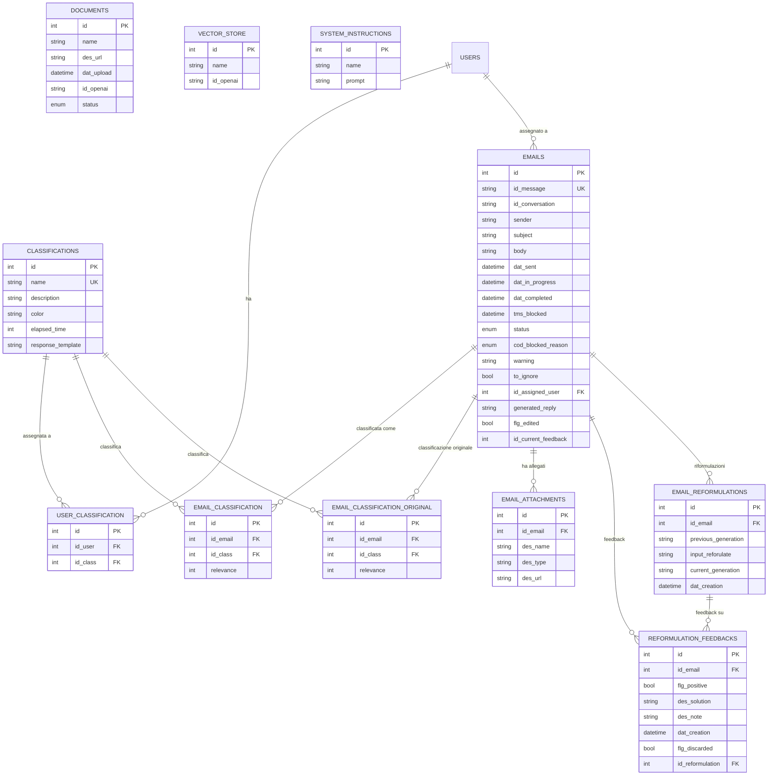

# Credit Assistant (Nivi) - Analisi Completa

## 1. Overview

**Nome app**: `nivi-credit` (repo: `credit-assistant`)
**Descrizione**: Nivi Credit Assistant - piattaforma di assistenza al credito basata su AI
**Cliente**: Nivi S.p.A. (settore autostradale/pedaggi, basato sui domini blacklistati: cavspa.it, asticuneo.it, satapweb.it, pedemontana.com, autostrade.it, ecc.)
**Settore**: Credito / Recupero crediti nel settore autostradale e infrastrutture
**Infra repo**: `nivi-infra`

L'applicazione gestisce un flusso automatizzato di email in ingresso: le scarica da Outlook/Microsoft Graph, le classifica automaticamente tramite OpenAI (GPT-5-mini), genera bozze di risposta AI-assisted, e permette agli operatori di lavorarle, riformularle e completarle. Include una dashboard analytics completa per monitorare KPI e performance degli operatori.

## 2. Versioni

| Componente | Versione |
|---|---|
| App (`version.txt`) | **1.12.5** |
| laif-template (`version.laif-template.txt`) | **5.6.7** |
| `values.yaml` version | 1.1.0 |
| laif-ds (frontend) | 0.2.73 |
| Node.js richiesto | >= 25.0.0 |
| Python richiesto | >= 3.12, < 3.13 |

## 3. Team (top contributors)

| Commits | Contributor |
|---|---|
| 295 | Pinnuz |
| 183 | mlife |
| 142 | github-actions[bot] |
| 92 | Simone Brigante |
| 86 | bitbucket-pipelines |
| 85 | Marco Pinelli |
| 80 | Carlo A. Venditti |
| 68 | Federico Frasca |
| 55 | neghilowio |
| 50 | cavenditti-laif |
| 49 | sadamicis |
| 29 | tancredibosiLaif |
| 28 | Daniele DN |
| 21 | Matteo Scalabrini |

## 4. Stack e deviazioni dal template

### Backend (pyproject.toml)

**Dipendenze standard template**: alembic, sqlalchemy, psycopg2-binary, asyncpg, pydantic, fastapi, uvicorn, boto3, bcrypt, passlib, python-jose, httpx, requests, typer, jinja2

**Dipendenze NON-standard (specifiche app)**:
| Dipendenza | Uso |
|---|---|
| `exchangelib==5.2.0` | Integrazione Microsoft Exchange/Outlook |
| `msal>=1.29.0` | Microsoft Authentication Library (OAuth2 per Graph API) |
| `markdownify>=0.12.1` | Conversione HTML-to-Markdown (corpo email) |
| `python-dateutil>=2.8.2` | Parsing date flessibile (email receivedDateTime) |
| `aiohttp~=3.13.3` | Client HTTP async (aggiuntivo) |

**Dependency groups opzionali** (tutti abilitati di default):
- `pdf`: pymupdf (parsing PDF allegati)
- `llm`: openai, pgvector (classificazione e generazione risposte AI)
- `docx`: python-docx
- `xlsx`: xlsxwriter, pandas

### Frontend (package.json)

**Dipendenze NON-standard (specifiche app)**:
| Dipendenza | Uso |
|---|---|
| `@amcharts/amcharts5` | Grafici dashboard (chart avanzati) |
| `@draft-js-plugins/editor` + `@draft-js-plugins/mention` | Editor rich-text per risposte email con menzioni |
| `draft-js` + `draft-js-export-html` | Editor WYSIWYG per template risposte |
| `@microsoft/fetch-event-source` | Server-Sent Events (streaming risposte AI?) |
| `react-markdown` + `remark-gfm` + `remark-math` | Rendering Markdown con GFM e formule matematiche |
| `rehype-katex` + `katex` | Rendering formule LaTeX |
| `react-syntax-highlighter` | Evidenziazione codice |
| `rehype-raw` + `rehype-sanitize` | Rendering HTML sicuro |
| `@hello-pangea/dnd` | Drag-and-drop (riordinamento categorie?) |
| `@ducanh2912/next-pwa` | Progressive Web App |

### Docker Compose

Configurazione base minimale (solo `db` + `backend`). Variante `docker-compose.wolico.yaml` aggiunge rete condivisa `wolico_shared_network` per test locali con Wolico.

Nessun servizio extra (no Redis, no Celery, no Elasticsearch).

## 5. Data Model completo

### Schema: `prs`

#### Tabella `classifications`
| Colonna | Tipo | Note |
|---|---|---|
| id | int (PK) | |
| name | str | UNIQUE |
| description | str | nullable |
| color | str | nullable |
| elapsed_time | int | giorni prima della scadenza, nullable |
| response_template | str | nullable, HTML template di risposta |

#### Tabella `user_classification`
| Colonna | Tipo | Note |
|---|---|---|
| id | int (PK) | |
| id_user | int (FK -> template.users.id) | CASCADE |
| id_class | int (FK -> prs.classifications.id) | CASCADE |
| UNIQUE | (id_user, id_class) | |

#### Tabella `emails`
| Colonna | Tipo | Note |
|---|---|---|
| id | int (PK) | |
| id_message | str | UNIQUE, Outlook message ID |
| id_conversation | str | Outlook conversation ID |
| sender | str | nullable |
| subject | str | nullable |
| body | str | nullable |
| dat_sent | datetime | server_default=now() |
| dat_in_progress | datetime | nullable |
| dat_completed | datetime | nullable |
| tms_blocked | datetime | nullable |
| status | EmailStatus (enum) | default=to_classify |
| cod_blocked_reason | BlockedReason (enum) | nullable |
| warning | str | nullable, errori salvati |
| to_ignore | bool | default=False, spam/junk |
| id_assigned_user | int (FK -> template.users.id) | nullable |
| generated_reply | str | nullable |
| flg_edited | bool | nullable, default=False |
| id_current_feedback | int | nullable |
| **computed** is_stale | bool | email > 2 mesi non lavorata |
| **computed** expiring_days | int | giorni alla scadenza (min elapsed_time classificazione) |
| **computed** classification_ids | list[int] | array ID classificazioni |
| **computed** primary_classification_id | int | classificazione con relevance=1 |

#### Tabella `email_attachments`
| Colonna | Tipo | Note |
|---|---|---|
| id | int (PK) | |
| id_email | int (FK -> prs.emails.id) | |
| des_name | str | nome file originale |
| des_type | str | MIME type |
| des_url | str | path S3 |

#### Tabella `email_classification`
| Colonna | Tipo | Note |
|---|---|---|
| id | int (PK) | |
| id_email | int (FK -> prs.emails.id) | |
| id_class | int (FK -> prs.classifications.id) | CASCADE |
| relevance | int | ordine di rilevanza |
| UNIQUE | (id_email, id_class) | |
| UNIQUE | (id_email, relevance) | |

#### Tabella `email_classification_original`
| Colonna | Tipo | Note |
|---|---|---|
| id | int (PK) | |
| id_email | int (FK -> prs.emails.id) | |
| id_class | int (FK -> prs.classifications.id) | CASCADE |
| relevance | int | |

Conserva la classificazione originale AI prima di eventuali ri-classificazioni manuali.

#### Tabella `documents`
| Colonna | Tipo | Note |
|---|---|---|
| id | int (PK) | |
| name | str | |
| des_url | str | nullable |
| dat_upload | datetime | server_default=now() |
| id_openai | str | nullable, ID file su OpenAI |
| status | DocumentStatus (enum) | default=loading |

#### Tabella `vector_store`
| Colonna | Tipo | Note |
|---|---|---|
| id | int (PK) | |
| name | str | |
| id_openai | str | ID vector store OpenAI |

#### Tabella `system_instructions`
| Colonna | Tipo | Note |
|---|---|---|
| id | int (PK) | |
| name | str | chiave (es. "email_classification", "generate_reply") |
| prompt | str | prompt di sistema configurabile |

#### Tabella `reformulation_feedbacks`
| Colonna | Tipo | Note |
|---|---|---|
| id | int (PK) | |
| id_email | int (FK -> prs.emails.id) | |
| flg_positive | bool | |
| des_solution | str | nullable |
| des_note | str | nullable |
| dat_creation | datetime | server_default=now() |
| flg_discarded | bool | rifiuto riformulazione |
| id_reformulation | int (FK -> prs.email_reformulations.id) | nullable |

#### Tabella `email_reformulations`
| Colonna | Tipo | Note |
|---|---|---|
| id | int (PK) | |
| id_email | int (FK -> prs.emails.id) | |
| previous_generation | str | nullable |
| input_reforulate | str | nullable (nota: typo nel nome) |
| current_generation | str | nullable |
| dat_creation | datetime | server_default=now() |

### Enums

**EmailStatus**: `downloading`, `to_classify`, `classified`, `to_process`, `in_progress`, `blocked`, `completed`, `warning`, `error`

**BlockedReason**: `client_verification`, `manager_verification`, `internal_verification`

**DocumentStatus**: `loading`, `success`, `error`

### Diagramma ER (Mermaid)



## 6. API Routes

### Classification (`/classification`)
| Metodo | Path | Descrizione |
|---|---|---|
| GET | `/{id}` | Dettaglio classificazione |
| POST | `/search` | Ricerca classificazioni |
| POST | `/` | Crea classificazione (perm: `categories:write`) |
| PUT | `/{id}` | Aggiorna classificazione (perm: `categories:write`) |
| DELETE | `/{id}` | Elimina classificazione (perm: `categories:write`) |

### Inbox (`/inbox`)
| Metodo | Path | Descrizione |
|---|---|---|
| GET | `/{id}` | Dettaglio email |
| PUT | `/{id}` | Aggiorna email (assegnazione, status) |
| POST | `/search` | Ricerca inbox paginata con conteggi per periodo |
| POST | `/generate/{id_email}` | Genera risposta AI per email |
| POST | `/parse_template_cases/{id_classification}` | Parsing template classificazione in casi |

### Email Classification (`/email-classification`)
| Metodo | Path | Descrizione |
|---|---|---|
| GET | `/{id}` | Dettaglio classificazione email |
| POST | `/search` | Ricerca |
| POST | `/` | Crea |
| PUT | `/{id}` | Aggiorna |
| DELETE | `/{id}` | Elimina |
| POST | `/download_email` | Trigger download email da Outlook |
| POST | `/classify_email` | Trigger classificazione AI email |
| POST | `/generate_replies` | Trigger generazione risposte AI |
| POST | `/{id_email}/reclassify` | Ri-classifica email escludendo categorie |

### Email Attachment (`/email_attachment`)
| Metodo | Path | Descrizione |
|---|---|---|
| GET | `/{id}/download` | Download allegato da S3 |

### Email Reformulation (`/email_reformulation`)
| Metodo | Path | Descrizione |
|---|---|---|
| CRUD standard | | GET, search, create, update, delete |

### Reformulation Feedback (`/reformulation_feedback`)
| Metodo | Path | Descrizione |
|---|---|---|
| CRUD standard | | GET, search, create, update, delete |

### User Classification (`/user-classification`)
| Metodo | Path | Descrizione |
|---|---|---|
| POST | `/` | Crea assegnazione utente-categoria |
| DELETE | `/{id}` | Elimina assegnazione |

### App Document (`/app_document`)
| Metodo | Path | Descrizione |
|---|---|---|
| CRUD + upload + download | | Gestione documenti knowledge base con upload su OpenAI + S3 |

### Dashboard (`/dashboard`)
| Metodo | Path | Descrizione |
|---|---|---|
| POST | `/kpis/search` | KPI aggregati per timeframe |
| GET | `/kpis/metadata` | Metadati KPI (date disponibilita) |
| GET | `/users` | Lista utenti con categorie (perm: `user:read`) |
| GET | `/users/{user_id}` | Dettaglio utente dashboard |
| POST | `/users/{user_id}/kpis/search` | KPI per singolo utente |
| POST | `/time-series/search` | Serie temporali |
| POST | `/users/{user_id}/time-series/search` | Serie temporali per utente |
| GET | `/realtime-metrics` | Metriche real-time |
| GET | `/users/{user_id}/realtime-metrics` | Metriche real-time per utente |

### Changelog (`/changelog`)
| Metodo | Path | Descrizione |
|---|---|---|
| GET | `/` | Changelog (tech/customer, template/app) |

## 7. Business Logic

### Task schedulati (Background tasks con `repeat_every`)

1. **`_emails_download_task`** - ogni 15 minuti
   - Scarica nuove email da Outlook via Microsoft Graph API
   - Flusso: fetch message IDs (inbox + junk) -> salva in DB -> download contenuto completo -> upload allegati su S3
   - Attivo solo in ambienti non-local

2. **`_emails_classification_task`** - ogni 15 minuti
   - Classifica email con status `to_classify` usando OpenAI GPT-5-mini
   - Usa `responses.parse()` con structured output (`ClassificationResponse`)
   - Supporta analisi allegati PDF (presigned URL da S3)
   - Blacklist domini mittente (autostrade, pedaggi) -> classificazione automatica con id=0

3. **Generazione risposte** (commentato nel cron, disponibile via API)
   - Genera risposte email usando GPT-5-mini con `reasoning={"effort": "low"}`
   - Usa template di risposta per categoria + file_search su VectorStore OpenAI
   - Firma automatica "Nivi S.p.A."

### Flusso email completo

```
Outlook Mailbox (inbox + junk)
    |
    v
[Download IDs] -- fetch_latest_messages_id (Graph API, ultimi N giorni)
    |
    v
[Download Full] -- contenuto, sender, subject, body, allegati
    |                Upload allegati su S3
    v
[Classificazione AI] -- GPT-5-mini con structured output
    |                    Blacklist domini -> skip AI
    |                    Max 3 classificazioni per email
    v
[Generazione risposta] -- GPT-5-mini con template + VectorStore
    |
    v
[Inbox operatore] -- assegnazione, lavorazione, riformulazione
    |
    v
[Completamento] -- feedback, tracking tempi
```

### Logica di accesso role-based

- **admin**: vede tutte le email
- **user**: vede email delle proprie categorie + email non classificate
- **contractor**: vede SOLO email delle proprie categorie
- **manager**: ruolo custom app (definito in `role.py`)

### Gestione blocco email

Le email possono essere bloccate (`EmailStatus.blocked`) con motivazione (`BlockedReason`). Solo admin o utente assegnato possono bloccare/sbloccare.

### Riformulazione AI

L'operatore puo richiedere riformulazioni della risposta generata, con prompt aggiuntivo. Ogni riformulazione viene salvata come `EmailReformulation` con storico precedente/corrente. Feedback positivo/negativo viene tracciato.

### Knowledge Base (OpenAI VectorStore)

I documenti caricati vengono:
1. Salvati su S3 (via template standard)
2. Uploadati su OpenAI come file
3. Attaccati al VectorStore "general"
4. Usati come contesto per la generazione risposte (file_search tool)

### System Instructions configurabili

I prompt di sistema per classificazione e generazione sono configurabili da DB (`system_instructions`), con fallback su prompt hardcoded.

## 8. Integrazioni esterne

| Servizio | Libreria | Uso |
|---|---|---|
| **Microsoft Graph API** | `requests` (diretto) | Download email da shared mailbox Outlook (inbox + junk) |
| **Microsoft OAuth2** | `msal` + endpoint diretto | Token refresh per Graph API |
| **OpenAI GPT-5-mini** | `openai` (via template `OpenAIProvider`) | Classificazione email, generazione risposte |
| **OpenAI VectorStore** | `openai` (via template `OpenAIProvider`) | RAG per knowledge base documenti |
| **AWS S3** | `boto3` (via template) | Storage allegati email e documenti |
| **AWS Parameter Store** | `boto3` (via template) | Persistenza token MS dopo refresh |

### Configurazione Microsoft

Secrets gestiti via Settings (Parameter Store AWS):
- `ms_client_id` - Client ID app Azure AD
- `ms_tenant_id` - Tenant ID Azure AD
- `ms_access_token` - Access token (refreshato automaticamente)
- `ms_refresh_token` - Refresh token
- `ms_user_email` - Email shared mailbox

## 9. Frontend - Albero pagine

```
/
├── /dashboard/
│   ├── /overview/           -- DashboardOverviewMain (KPI, grafici, serie temporali)
│   └── /operators/          -- DashboardOperatorsMain (performance operatori)
│       └── /[id]/           -- DashboardOperatorDetailMain (dettaglio singolo operatore)
├── /my-dashboard/           -- Dashboard personale operatore
├── /inbox/
│   ├── /incoming/           -- InboxMain (tutte le email in arrivo)
│   ├── /my-inbox/           -- MyInboxMain (email assegnate all'utente)
│   └── /spam/               -- SpamMain (email spam/junk)
├── /categories/             -- CategoriesMain (gestione categorie classificazione)
├── /knowledge-base/         -- KnowledgeBaseMain (gestione documenti RAG)
├── /help/
│   ├── /ticket/             -- Supporto ticket (template standard)
│   └── /faq/                -- FAQ (template standard)
├── /conversation/           -- Chat (template, nascosta dal menu)
└── /files/                  -- File management (template, nascosto dal menu)
```

### Componenti chiave frontend

- **EmailAccordion**: Vista email espandibile con body, allegati, risposta AI, riformulazione
- **EmailSuggestedAnswer**: Mostra risposta AI generata con azioni accetta/rifiuta/riformula
- **ReformulateToolbar**: Toolbar per riformulare la risposta con prompt aggiuntivo
- **RichTextEditor**: Editor basato su Draft.js per editing risposte
- **CategoriesChart**: Grafici categorie con amCharts5
- **TimeSeriesChart**: Serie temporali per dashboard
- **EmailDueDateBadge**: Badge scadenza email
- **StaleBadge**: Badge email "stale" (> 2 mesi)
- **BlockReasonDialog**: Dialog per specificare motivo blocco
- **NegativeFeedbackModal**: Modale feedback negativo su riformulazione
- **ContractorCategoryRemovalDialog**: Dialog per rimozione categoria dal contractor

### Permessi frontend

- `dashboard:read` - Dashboard overview + operatori
- `my-dashboard:read` - Dashboard personale
- `inbox:read` - Inbox email
- `spam:read` - Spam
- `categories:read/write` - Gestione categorie
- `knowledge:read` - Knowledge base
- `ticket:read` - Help/ticket
- `user:read` - Visibilita utenti dashboard

## 10. Deviazioni dal laif-template

### Backend

1. **Integrazione Microsoft Graph API** - modulo `email_classification/outlook.py` con download email, gestione token, attachments
2. **Classificazione AI automatica** - pipeline completa con OpenAI GPT-5-mini, structured output, gestione errori
3. **Sistema di riformulazione** - storico riformulazioni con feedback
4. **Knowledge Base con VectorStore** - upload documenti su OpenAI + file_search come tool RAG
5. **Dashboard analytics avanzata** - KPI per timeframe, serie temporali, metriche real-time, trend
6. **Blacklist domini email** - skip classificazione per domini noti (autostrade, pedaggi)
7. **Column properties calcolate** - `is_stale`, `expiring_days`, `classification_ids`, `primary_classification_id`
8. **Ruolo custom "manager"** - aggiunto ai ruoli template
9. **Task schedulati** - `repeat_every` per download + classificazione (ogni 15 min)
10. **File `reclassify.py`** - script di ri-classificazione batch per date range specifiche

### Frontend

1. **Editor rich-text Draft.js** - per editing risposte email
2. **amCharts5** - grafici dashboard avanzati
3. **PWA** - configurazione Progressive Web App
4. **Markdown rendering** - con KaTeX per formule
5. **Dashboard multi-livello** - overview, operatori, dettaglio operatore, my-dashboard
6. **Gestione spam dedicata** - vista separata per email junk
7. **Sistema feedback** - accetta/rifiuta riformulazioni con note

### Docker

1. **`docker-compose.wolico.yaml`** - variante con rete condivisa per testing con Wolico

## 11. Pattern notevoli

1. **Structured Output OpenAI**: usa `responses.parse()` con Pydantic model per classificazione, garantendo output JSON valido
2. **Dual-classification tracking**: mantiene sia la classificazione corrente (`email_classification`) che quella originale AI (`email_classification_original`), utile per analytics e debugging
3. **Column properties SQLAlchemy**: computed columns per `is_stale`, `expiring_days`, `classification_ids` direttamente nel modello, evitando query multiple
4. **RAG con VectorStore OpenAI**: documenti caricati vengono usati come contesto per la generazione risposte tramite `file_search` tool
5. **Token refresh chain**: il refresh token Microsoft viene persistito su AWS Parameter Store dopo ogni refresh, mantenendo il ciclo OAuth2 attivo
6. **Role-based email visibility**: filtro a livello di query che varia per ruolo (admin/user/contractor), non solo a livello di UI
7. **PDF attachment classification**: gli allegati PDF vengono inclusi nel prompt di classificazione via presigned URL

## 12. Note e tech debt

### Tech Debt

1. **Duplicazione codice classificazione**: la logica di classificazione e in `service.py` E in `reclassify.py` con variazioni minori - andrebbe unificata
2. **TODO nel codice**: `# TODO maybe only use one?` per httpx vs requests - il progetto usa entrambi
3. **Typo nel modello**: `input_reforulate` invece di `input_reformulate` nella tabella `email_reformulations`
4. **Controller duplicato**: `changelog_controller` viene incluso DUE VOLTE in `controller.py` (riga 41 e 43)
5. **Task generazione risposte commentato**: `_emails_reply_generation_task` e il relativo `generate_replies` nel cron sono commentati - la generazione avviene solo su richiesta manuale
6. **Date hardcoded**: `reclassify.py` ha date hardcoded (2025-11-01 / 2025-12-04) per batch di ri-classificazione
7. **KPI_AVAILABLE_FROM hardcoded**: `datetime(2026, 1, 11, 10, 0, 0)` - data fissa nel codice

### Peculiarita

- **Blacklist domini autostradali**: logica di business molto specifica, con lista hardcoded di domini da ignorare nella classificazione
- **Firma automatica**: ogni risposta generata ha "Nivi S.p.A." appeso in fondo
- **Filtro PEC**: le email con subject che inizia con "POSTA CERTIFICATA:" vengono escluse dal download inbox
- **Overlap temporale download**: 2 ore di overlap nel lookback window per evitare email perse
- **Junk email separate**: le email junk vengono scaricate dalla cartella `junkemail` di Graph API e marcate come `to_ignore=True`
- **Reasoning effort differenziato**: classificazione usa `effort: "medium"`, generazione risposte usa `effort: "low"`
- **Modello AI**: usa `gpt-5-mini` (non gpt-4o o simili)
