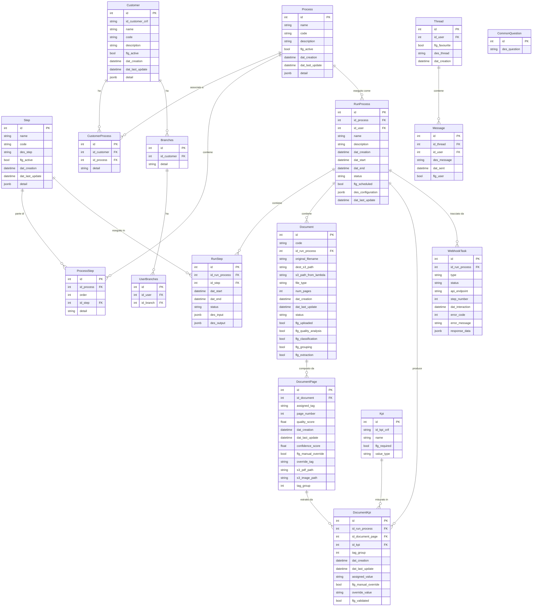

# CRIF — Analisi Repository

## 1. Overview

**Applicazione**: Piattaforma di analisi documentale per istruttorie di mutuo bancarie. Il sistema gestisce il ciclo completo di elaborazione documenti: upload, analisi qualita, classificazione/tagging, segmentazione e estrazione KPI.

**Cliente**: CRIF S.p.A. (azienda leader nei servizi di credit information e business information)

**Settore**: Fintech / Credit & Document Management

**Stato**: In sviluppo attivo (v0.2.0), circa 1227 commit dal marzo 2024

**Basato su laif-template**: Si (v5.2.6). Architettura multi-tenant con 3 database (principale + 2 tenant).

---

## 2. Versioni

| Componente | Versione |
|---|---|
| App | 0.2.0 |
| laif-template | 5.2.6 |
| Python | ~3.12 |
| FastAPI | 0.105 |
| SQLAlchemy | 2.0.0 |
| Next.js | (frontend, con Turbopack) |
| PostgreSQL | 15.14 (con pgvector) |
| laif-ds | ^0.2.12 |

---

## 3. Team

| Contributore | Commit |
|---|---|
| Pinnuz (Marco Pinelli) | 245 + 85 |
| mlife / mlaif (Marco Vita) | 177 + 16 + 17 |
| Simone Brigante | 93 + 20 |
| bitbucket-pipelines / github-actions | 86 + 83 |
| Daniele (Dalle Nogare) | 65 + 28 + 18 + 3 + 2 |
| sadamicis | 48 + 2 |
| cavenditti-laif (Carlo Venditti) | 42 + 31 + 11 |
| neghilowio | 42 |
| Federico Frasca | 25 |
| Matteo Scalabrini | 21 + 3 |
| angelolongano | 18 + 7 |
| lorenzoTonetta | 13 + 3 |
| Altri | ~15 |

---

## 4. Stack Tecnico

### Backend
- **Framework**: FastAPI 0.105 (pinned per bug file upload)
- **ORM**: SQLAlchemy 2.0 con Mapped columns
- **DB**: PostgreSQL 15.14 con pgvector
- **Migrazioni**: Alembic 1.8.1
- **HTTP Client**: httpx 0.24 + requests 2.31
- **Auth**: AWS Cognito (client credentials flow per lambda, API key per webhook)
- **Cloud**: AWS (S3, Cognito, Lambda, Secrets Manager)
- **Package manager**: uv

### Frontend
- **Framework**: Next.js con TypeScript + Turbopack
- **State**: Redux Toolkit + TanStack React Query
- **UI**: laif-ds ^0.2.12 + Tailwind CSS
- **Charts**: amcharts5
- **DnD**: @hello-pangea/dnd
- **API Client**: @hey-api/openapi-ts (generazione automatica)
- **Rich text**: draft-js con mention plugin

### Infrastruttura
- Docker Compose con 3 DB PostgreSQL (principale + 2 tenant)
- AWS S3 per storage documenti
- AWS Lambda per elaborazione documenti (con simulatore locale)
- AWS Cognito per autenticazione
- Just per task automation

---

## 5. Data Model

### Schema `prs` (custom)



### Tabelle custom (schema `prs`): 16 tabelle

| Tabella | Descrizione |
|---|---|
| `customer` | Banche clienti CRIF |
| `process` | Processi disponibili (es. istruttoria mutuo) |
| `step` | Step di un processo (upload, quality, tagging, segmentation, extraction) |
| `process_steps` | Associazione processo-step con ordine |
| `customer_process` | Processi attivi per ogni cliente |
| `branches` | Filiali di una banca |
| `user_branches` | Associazione utente-filiale |
| `run_process` | Esecuzione di un processo |
| `run_step` | Esecuzione di un singolo step |
| `documents` | Documenti caricati |
| `document_pages` | Pagine singole di un documento |
| `kpis` | Definizioni KPI estraibili |
| `document_kpis` | Valori KPI estratti dai documenti |
| `webhook_task` | Log interazioni con lambda |
| `threads` | Thread di chat (Credit Coach) |
| `messages` | Messaggi di chat |
| `common_questions` | Domande frequenti predefinite |

---

## 6. API Routes

### Routes custom (app)

| Metodo | Endpoint | Descrizione |
|---|---|---|
| GET | `/process/search` | Cerca processi |
| GET | `/process/{id}` | Dettaglio processo |
| DELETE | `/process/{id}` | Elimina processo |
| GET | `/run-process/search` | Cerca esecuzioni processo |
| GET | `/run-process/{id}` | Dettaglio esecuzione |
| POST | `/run-process/` | Crea esecuzione processo |
| PATCH | `/run-process/{id}` | Aggiorna esecuzione |
| DELETE | `/run-process/{id}` | Elimina esecuzione |
| GET | `/run-step/search` | Cerca step esecuzione |
| GET | `/run-step/{id}` | Dettaglio step esecuzione |
| POST | `/run-step/` | Crea step esecuzione |
| PATCH | `/run-step/{id}` | Aggiorna step esecuzione |
| DELETE | `/run-step/{id}` | Elimina step esecuzione |
| GET | `/document_analysis/search` | Cerca documenti |
| GET | `/document_analysis/{id}` | Dettaglio documento |
| POST | `/document_analysis/` | Crea documento |
| PATCH | `/document_analysis/{id}` | Aggiorna documento |
| DELETE | `/document_analysis/{id}` | Elimina documento |
| POST | `/document_analysis/upload` | Upload file documento su S3 |
| GET | `/document_analysis/download` | Download documento |
| GET | `/document_page/search` | Cerca pagine documento |
| GET | `/document_page/{id}` | Dettaglio pagina |
| POST | `/document_page/` | Crea pagina |
| PATCH | `/document_page/{id}` | Aggiorna pagina |
| DELETE | `/document_page/{id}` | Elimina pagina |
| GET | `/document_kpi/search` | Cerca KPI documento |
| GET | `/document_kpi/{id}` | Dettaglio KPI |
| POST | `/document_kpi/` | Crea KPI |
| PATCH | `/document_kpi/{id}` | Aggiorna KPI |
| DELETE | `/document_kpi/{id}` | Elimina KPI |
| GET | `/document_kpi/extraction/{id_run_process}` | Dati estrazione KPI completi |
| POST | `/document_kpi/bulk_update` | Aggiornamento KPI in bulk |
| POST | `/lambda/upload` | Invio file a lambda (PDF/ZIP) |
| POST | `/lambda/quality` | Analisi qualita via lambda |
| POST | `/lambda/tagging` | Classificazione via lambda |
| POST | `/lambda/segmentation` | Segmentazione via lambda |
| POST | `/lambda/extraction` | Estrazione KPI via lambda |
| GET | `/webhook/search` | Cerca webhook task |
| POST | `/webhook/document_upload` | Webhook ricezione upload |
| POST | `/webhook/document_quality` | Webhook ricezione qualita |
| POST | `/webhook/document_tagging` | Webhook ricezione tagging |
| POST | `/webhook/document_segmentation` | Webhook ricezione segmentazione |
| POST | `/webhook/document_extraction` | Webhook ricezione estrazione |

---

## 7. Business Logic

### Pipeline di analisi documentale (5 step)

Il cuore dell'applicazione e una pipeline di elaborazione documenti a 5 step, orchestrata tramite Lambda AWS e webhook:

1. **Upload** (`upload_01`): Il documento (PDF o ZIP) viene caricato su S3, la lambda lo processa (splitting pagine, conversione immagini) e restituisce i path S3 per ogni pagina via webhook
2. **Quality** (`quality_01`): Analisi qualita di ogni pagina (brightness, contrast, resolution, leggibilita). Calcola un quality_score medio
3. **Tagging** (`tagging_01`): Classificazione automatica delle pagine con tag (APE = Attestato Prestazione Energetica, ID = Documento Identita) e confidence score
4. **Segmentation** (`segmentation_01`): Raggruppamento pagine con stesso tag in gruppi logici (tag_group). Es: se ci sono 2 carte d'identita diverse, vengono separate in 2 gruppi
5. **Extraction** (`extraction_01`): Estrazione KPI dai documenti classificati. Per APE: classe energetica, EPgl, date, indirizzo. Per ID: numero, nome, date nascita/rilascio/scadenza

### Flusso asincrono

```
Frontend -> POST /lambda/upload -> Lambda AWS -> POST /webhook/document_upload -> DB update
Frontend -> POST /lambda/quality -> Lambda AWS -> POST /webhook/document_quality -> DB update
...
```

Ogni step:
- Crea/aggiorna un `RunStep` con status "started"
- Invia richiesta alla lambda CRIF (autenticata via Cognito)
- La lambda risponde via webhook (autenticato via API key)
- Il webhook aggiorna `Document`, `DocumentPage`, `DocumentKpi` e `RunStep`
- Dopo segmentazione, l'estrazione viene invocata automaticamente

### Simulatore Lambda

Per lo sviluppo locale, esiste un `LambdaResponseSimulator` che genera dati mock realistici e chiama direttamente gli endpoint webhook interni (`http://crif_backend:8000/webhook/...`). Configurabile tramite `LambdaSimulationConfig` con possibilita di simulare errori.

### Credit Coach (Chat)

Modello dati presente per un assistente conversazionale ("Credit Coach") con thread, messaggi e domande comuni. Il frontend include un popup `CreditCoachPopup` nella dashboard. Probabilmente integrato con un servizio AI esterno (inferito dalla presenza di `@microsoft/fetch-event-source` nel frontend per SSE).

### Validazione manuale KPI

L'ultimo step del wizard frontend consente la validazione manuale dei KPI estratti: l'operatore puo sovrascrivere valori (`flg_manual_override`, `override_value`), validare (`flg_validated`), e fare bulk update.

---

## 8. Integrazioni Esterne

| Servizio | Utilizzo |
|---|---|
| **AWS Lambda** | Pipeline elaborazione documenti (5 endpoint lambda CRIF) |
| **AWS S3** | Storage documenti, pagine PDF e immagini |
| **AWS Cognito** | Autenticazione utenti + client credentials per lambda |
| **AWS Secrets Manager** | Configurazione tenant (database URL per tenant) |
| **CRIF API** | API lambda di CRIF per quality, tagging, segmentation, extraction |

### Autenticazione

- **Utenti**: AWS Cognito (standard laif-template)
- **Lambda -> App (webhook)**: API Key (`X-Webhook-API-Key`)
- **App -> Lambda**: Token Cognito (client credentials flow con `CognitoAuthManager`)

---

## 9. Frontend

### Pagine custom

| Route | Descrizione |
|---|---|
| `/dashboard` | Dashboard con i processi dell'utente, Credit Coach |
| `/analysis/new` | Wizard per nuova analisi documentale (5 step) |
| `/analysis/history` | Storico analisi completate |

### Wizard di analisi (5 step)

Il frontend implementa un wizard con 5 step che corrisponde alla pipeline backend:

1. **UploadStep** — Upload documenti PDF/ZIP
2. **QualityStep** — Visualizzazione risultati analisi qualita
3. **ClassificationStep** — Revisione classificazione/tagging delle pagine (con accordion per documento)
4. **SummaryStep** — Riepilogo prima dell'estrazione
5. **KpiValidationStep** — Validazione KPI estratti con form editabili, navigazione per tag/tag-group, possibilita di override

### Componenti dashboard

- `MyProcessesCard` — Processi disponibili
- `MyRunProcessesCard` — Esecuzioni in corso
- `MyCreditCoachCard` — Accesso al Credit Coach
- `CreditCoachPopup` — Chat popup

### Pagine template (standard laif)

- Conversation (chat, feedback, knowledge)
- User Management (user, group, role, permission, business)
- Profile

---

## 10. Pattern Notevoli

### Architettura multi-tenant con DB separati
3 database PostgreSQL separati (principale + 2 tenant). Il `TenantRouterBuilder` gestisce automaticamente il routing al DB corretto. I webhook risolvono il tenant dal `tenantCode` nel payload e creano sessioni DB dinamiche.

### Pipeline asincrona con webhook
Pattern request/callback: l'app invia richieste alle lambda CRIF e riceve i risultati via webhook. Ogni interazione e loggata nella tabella `webhook_task` per tracciabilita.

### Simulatore Lambda per sviluppo locale
`LambdaResponseSimulator` con configurazione mock dettagliata (KPI realistici per APE e ID), possibilita di simulare errori con probabilita configurabile.

### Tag come enum
I tag dei documenti sono un StrEnum (`APE`, `ID`) — attualmente solo 2 tipi supportati. Estensibile per nuovi tipi documentali.

### Cognito Auth Manager con token caching
`CognitoAuthManager` gestisce il ciclo di vita del token Cognito con caching e refresh automatico (buffer di 5 minuti prima della scadenza).

---

## 11. Tech Debt e Note

### Tech Debt

1. **FastAPI pinned a 0.105**: Non si puo aggiornare per bug nel file upload (issue #10857). Questo blocca anche l'aggiornamento di starlette (0.27.0) e uvicorn (0.22.0)
2. **httpx E requests**: Due HTTP client diversi installati. Commento nel codice: "TODO maybe only use one?"
3. **Simulazione Lambda hardcoded**: `ENABLE_SIMULATION = True` e hardcoded nella classe, non configurabile da env. In produzione va disabilitato
4. **Tenant fallback fragile**: Il metodo `_get_tenant_from_db_session` fa pattern matching sul nome del DB nella URL (`"tenant1_db" in db_url`). Fragile e non scalabile
5. **TODO sparsi nel codice**: Diversi `# TODO` nel webhook service (es. "estrarre il nome del file dal filePath")
6. **Credit Coach incompleto**: Il modello dati (Thread, Message, CommonQuestion) e presente ma il backend non ha controller/service dedicati
7. **Solo 2 tag supportati**: L'enum `Tag` ha solo `APE` e `ID`. Per nuovi tipi di documento serve estensione
8. **`print()` nel codice**: Uso di `print()` invece di `logger` in alcuni punti del webhook service

### Note

- Il progetto usa `pgvector` (estensione PostgreSQL nel Dockerfile DB) ma non sembra usato nel modello dati attuale — probabilmente predisposto per future funzionalita di similarity search
- La pipeline di segmentazione chiama automaticamente l'estrazione dopo il completamento — accoppiamento forte tra i due step
- Il frontend usa `framer-motion` per animazioni e `katex` per formule matematiche (probabilmente per il Credit Coach)
- Il sistema di ruoli aggiunge solo `MANAGER` ai ruoli template standard
- Codice applicativo: `2025042`
