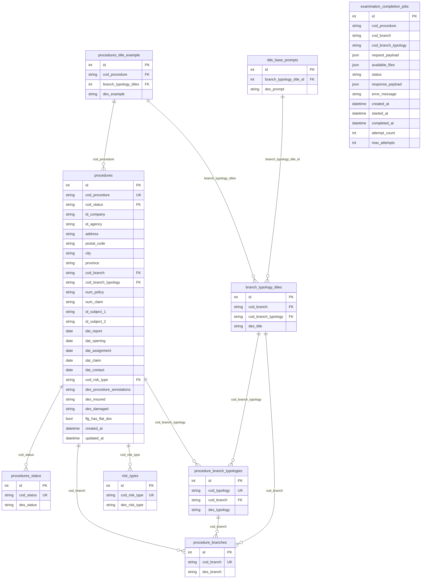

# Experior

## 1. Overview

**Descrizione**: Piattaforma AI per la compilazione automatica di perizie assicurative. Il sistema riceve richieste di completamento perizie (da Sygest, il gestionale del cliente), recupera documenti da S3 (denunce, polizze, email, immagini), e utilizza OpenAI per generare i contenuti dei paragrafi ("titoletti") della perizia basandosi sui documenti reali del caso.

**Cliente**: Experior (studio peritale assicurativo)
**Settore**: Assicurativo - Perizie
**Stato**: In produzione (v0.1.19)
**Codice applicazione**: 2025068

## 2. Versioni

| Componente | Versione |
|---|---|
| App | 0.1.19 |
| laif-template | 5.4.3 |
| Node.js | >= 24.0.0 |
| Python | >= 3.12, < 3.13 |
| Next.js | 16.1.1 |
| laif-ds | 0.2.65 |

## 3. Team

| Contributore | Commit |
|---|---|
| Pinnuz | 265 |
| mlife | 194 |
| github-actions[bot] | 117 |
| Simone Brigante | 92 |
| bitbucket-pipelines | 86 |
| Marco Pinelli | 85 |
| neghilowio | 71 |
| cavenditti-laif | 49 |
| sadamicis | 49 |
| Roberto Zanolli | 46 |
| Carlo A. Venditti | 31 |
| Daniele DN | 28 |
| Roberto | 23 |
| lorenzoTonetta | 23 |
| Matteo Scalabrini | 21 |
| SimoneBriganteLaif | 20 |
| mlaif | 19 |
| angelolongano | 18 |
| Marco Vita | 17 |
| frabarb | 16 |
| + altri minori | ~64 |

## 4. Modello dati CUSTOM

Il progetto adotta un'architettura ETL a 3 layer (Landing → Staging → Presentation) con schemi DB separati (`lnd`, `stg`, `prs`). I dati vengono estratti da un database MSSQL sorgente (il gestionale Experior) e trasformati in PostgreSQL.

### Tabelle custom (schema `prs` - Presentation)

| Tabella | Descrizione |
|---|---|
| `procedures` | Pratiche/perizie assicurative |
| `procedures_status` | Stati delle pratiche (es. "F" = finalizzata) |
| `procedure_branches` | Rami assicurativi (es. incendio, furto) |
| `procedure_branch_typologies` | Tipologie per ramo |
| `risk_types` | Tipi di rischio |
| `branch_typology_titles` | Titoletti per combinazione ramo/tipologia (AI-extracted) |
| `procedures_title_example` | Esempi di valori per titoletti (AI-extracted) |
| `title_base_prompts` | Prompt specifici per titoletto (configurati dall'utente) |
| `examination_completion_jobs` | Job asincroni di completamento perizia AI |

Le stesse tabelle (escluse quelle AI) esistono anche in `lnd` (landing, dati grezzi da MSSQL) e `stg` (staging, dati normalizzati).

### Diagramma ER

## 5. API routes CUSTOM

| Metodo | Route | Descrizione |
|---|---|---|
| `POST` | `/examination_completion/` | Crea job asincrono di completamento perizia AI |
| `GET` | `/examination_completion/{job_id}` | Stato/risultato job di completamento |
| `GET` | `/procedure/{cod_procedure}/branch-info` | Info ramo/tipologia per una procedura |
| `POST` | `/etl/run` | Trigger manuale ETL (solo admin) |
| `POST` | `/titles/etl/title-values` | Pipeline estrazione titoletti da PDF flat (solo admin) |
| CRUD | `/title-prompts/` | CRUD completo prompt per titoletti (search, get, create, update, delete) |
| `GET` | `/title-prompts/filters/branches` | Filtro rami disponibili |
| `GET` | `/title-prompts/filters/typologies` | Filtro tipologie disponibili |
| `GET` | `/title-prompts/filters/titles` | Filtro titoletti disponibili |
| `POST` | `/test-connectivity` | Endpoint test connettivita con Sygest |
| `GET` | `/changelog/` | Changelog tecnico/customer |

## 6. Business logic CUSTOM

### ETL (Extract-Transform-Load)
- **Sorgente**: Database MSSQL di Experior (gestionale perizie Sygest)
- **Credenziali**: recuperate da AWS Parameter Store
- **Pipeline a 3 fasi**: Landing (copia raw da MSSQL) → Staging (normalizzazione via SQL) → Presentation (trasformazione finale via SQL)
- **Schedulazione**: esecuzione automatica 2 volte/giorno (05:00 UTC e 13:00 UTC) con retry (max 3 tentativi, delay 30s)
- **Notifiche email**: successo/fallimento inviate ai destinatari configurati in DB (`EtlNotificationRecipient`)

### Examination Completion (core business)
- **Job asincroni** con retry (max 5 tentativi, backoff lineare)
- **Flusso**: ricezione richiesta → validazione procedura in DB → recupero documenti S3 → generazione AI → callback Sygest
- **Documenti S3**: raccoglie file input della perizia corrente + flat PDF storici (max 3) della stessa polizza
- **Sanitizzazione file**: nomi file sanitizzati per compatibilita OpenAI, copiati in cartella `processed/`
- **Prompt engineering**: prompt di sistema definisce il ruolo di "perito assicurativo senior" con linee guida dettagliate su completezza, fedelta ai dati, e gestione mancanze
- **Prompt dinamico**: arricchito con contesto procedura (assicurato, danneggiato, sinistri pregressi), prompt specifici per titoletto, ed esempi da DB
- **Modello**: GPT-5.4 con structured output (`responses.parse`) e reasoning effort "low"
- **Callback Sygest**: risultati (o errori) inviati via POST HTTP con autenticazione basic all'API Sygest

### Titles ETL Pipeline
- **Scopo**: estrarre titoletti e relativi valori esempio dai PDF "flat" (perizie completate) usando OpenAI
- **Pipeline**: per ogni combinazione ramo/tipologia, prende fino a N procedure con PDF flat, estrae titoli e valori via AI, e li salva in DB
- **Modello**: OpenAI `responses.parse` con reasoning effort "medium" e structured output `TitlesWithExamplesResponse`
- **Protezione**: singleton (una sola pipeline alla volta), gestione errori per singola procedura

## 7. Integrazioni esterne

| Servizio | Utilizzo |
|---|---|
| **Sygest API** | Callback per invio risultati/errori completamento perizia (`expsql-test.experior.it/api/ai/savepratica`) |
| **OpenAI API** | Generazione contenuti perizia (GPT-5.4) + estrazione titoletti da PDF |
| **AWS S3** | Storage documenti perizia (input, flat PDF, file processati) |
| **AWS Parameter Store** | Credenziali DB sorgente MSSQL |
| **MSSQL (Sygest)** | Database sorgente per ETL (pratiche, anagrafiche, rami, stati) |

## 8. Pagine frontend CUSTOM

| Pagina | Descrizione |
|---|---|
| `/etl` | Trigger manuale ETL con stato |
| `/test-examination` | Test completamento perizia: form input, polling job asincrono, visualizzazione risultati |
| `/title-prompts` | CRUD prompt specifici per titoletti con filtri ramo/tipologia |
| `/changelog-customer` | Changelog per il cliente |
| `/changelog-technical` | Changelog tecnico |

## 9. Stack e deviazioni

### Dipendenze non-standard (rispetto al template)

**Backend**:
- `pymssql >= 2.3.8` - Driver per connessione al database MSSQL sorgente (Sygest)
- `aiohttp ~= 3.13.0` - Client HTTP asincrono
- Dependency group `xlsx`: `xlsxwriter`, `pandas` - Generazione report Excel

**Frontend**:
- Nessuna dipendenza non-standard significativa rispetto al template

### Ruoli custom
- `manager` (unico ruolo custom oltre ai ruoli template)

## 10. Pattern notevoli

- **Architettura ETL a 3 layer** (Landing/Staging/Presentation) con schemi DB separati e query SQL statiche su file - pattern riutilizzabile per ingestione dati da sorgenti esterne
- **Job asincroni con retry e callback**: pattern robusto per task LLM long-running con BackgroundTasks di FastAPI, retry con backoff, e callback HTTP al sistema chiamante
- **Prompt enrichment dinamico**: prompt arricchito con esempi reali da DB (few-shot learning) e prompt specifici per titoletto, configurabili dall'utente senza intervento tecnico
- **Self-learning pipeline**: la pipeline titles estrae automaticamente titoletti e valori esempio dai PDF storici, alimentando il DB di esempi che viene poi usato per arricchire i prompt di generazione
- **Sanitizzazione file per OpenAI**: pattern di copia file S3 con nome sanitizzato in cartella temporanea per compatibilita API OpenAI
- **Doppia schedulazione ETL** con factory pattern per evitare duplicazione codice

## 11. Tech debt e note

- **Test app vuoti**: `backend/tests/test_app/` contiene solo `__init__.py` - nessun test applicativo
- **Modello GPT-5.4**: versione molto recente, verificare disponibilita e costi
- **Credenziali Sygest via env vars** con naming non standard (uso trattini: `sygest-user`, `sygest-psw`)
- **`asyncio.run()` dentro BackgroundTasks**: pattern potenzialmente problematico se il loop principale e gia in esecuzione; funziona perche BackgroundTasks usa un thread executor
- **39 migrazioni Alembic**: accumulo significativo
- **`README.md` vuoto**: nessuna documentazione progetto
- **Nessun rate limiting** sulle chiamate OpenAI nella examination completion (presente solo nella titles pipeline con `OPENAI_CALL_DELAY_SECONDS`)
- **Cartella `docs/troisi/`**: contiene documentazione per setup email custom, non chiaro il contesto
- **`restler-fuzzer/`**: cartella presente per fuzzing API (testing di sicurezza), non standard nel template
