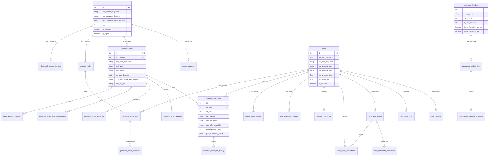

# Far Automation - Analisi Completa Repository

## 1. Overview

**Applicazione**: Far Automation Platform - piattaforma per la gestione ordini clienti, offerte commerciali, verifica disponibilita prodotti e logistica per FAR (azienda manifatturiera nel settore della componentistica industriale: rivetti, inserti, rivettatrici, ricambi).

**Cliente**: FAR S.r.l. (Far Automation)

**Settore**: Manifatturiero - componentistica industriale (rivetti, inserti filettati, rivettatrici)

**Descrizione funzionale**: La piattaforma integra dati dal sistema ERP Diapason (su IBM i / AS400) e da MasterFactory (SQL Server) tramite un ETL dedicato, consentendo al team commerciale e logistico di:
- Gestire offerte e ordini clienti con flusso di approvazione multi-step
- Verificare automaticamente la disponibilita dei prodotti con algoritmi differenziati per famiglia prodotto
- Aggregare ordini per conferma date di consegna
- Generare PDF di offerte/ordini in piu lingue
- Monitorare KPI commerciali (Italia/Estero, per area)
- Gestire articoli critici con causali e report PDF

---

## 2. Versioni

| Componente | Versione |
|---|---|
| App (`version.txt`) | **1.0.0** |
| laif-template (`version.laif-template.txt`) | **5.7.0** |
| values.yaml version | 1.1.0 |
| laif-ds (frontend) | 0.2.76 |

---

## 3. Team (top contributors)

| Contributor | Commits |
|---|---|
| Michele Roberti | 388 |
| Pinnuz (Marco Pinelli) | 251 |
| github-actions[bot] | 237 |
| mlife | 192 |
| angelolongano | 120 |
| Simone Brigante | 92 |
| bitbucket-pipelines | 86 |
| Marco Pinelli | 85 |
| neghilowio | 53 |
| sadamicis | 49 |

Totale: ~1836 commit, ~35 contributori. Repository migrata da Bitbucket a GitHub.

---

## 4. Stack e dipendenze

### Backend (Python 3.12)

**Dipendenze standard template**: FastAPI, SQLAlchemy 2.0, Pydantic v2, Alembic, uvicorn, boto3, bcrypt/passlib, python-jose

**Dipendenze NON standard (specifiche progetto)**:
| Dipendenza | Uso |
|---|---|
| `aiohttp` | Client HTTP asincrono |
| `xlsxwriter` + `pandas` | Export Excel |
| `pymupdf` + `weasyprint` | Generazione PDF |
| `openai` + `pgvector` | LLM / embeddings (opzionale) |
| `python-docx` | Generazione documenti Word |
| `pyodbc` | Connessione ODBC a IBM i (Diapason AS/400) |
| `pymssql` | Connessione SQL Server (MasterFactory) |
| `tqdm` | Progress bar ETL |
| `sqlalchemy-utils` | Utility SQLAlchemy (usato in ETL) |
| `pytz` | Timezone (ETL) |
| `alembic-postgresql-enum` | Gestione enum PostgreSQL nelle migrazioni |

### Frontend (Next.js 16, React 19, TypeScript)

**Dipendenze NON standard**:
| Dipendenza | Uso |
|---|---|
| `@amcharts/amcharts5` | Grafici avanzati (dashboard/monitoring) |
| `draft-js` + plugin mention/export | Rich text editing |
| `framer-motion` | Animazioni |
| `katex` + `rehype-katex` + `remark-math` | Formule matematiche (markdown) |
| `react-markdown` + `remark-gfm` | Rendering markdown |
| `react-syntax-highlighter` | Evidenziazione codice |

### Docker Compose - Servizi extra

| Servizio | Descrizione |
|---|---|
| `etl` | Container dedicato per ETL Diapason, con **IBM i Access ODBC Driver** installato. Immagine separata con proprio `Dockerfile` e `pyproject.toml` |

Presente anche `docker-compose.wolico.yaml` per test integrazione con Wolico (rete Docker condivisa).

---

## 5. Modello dati completo

Il database usa schema **`prs`** (presentazione) e **`stg`** (staging). Tutte le tabelle prs hanno campi base `id`, `tms_created`, `tms_updated`, `tms_last_etl_update`.

### Tabelle Presentazione (schema `prs`) - 28 tabelle

| Tabella | Descrizione | Righe chiave |
|---|---|---|
| `subjects` | Anagrafica soggetti (clienti/fornitori/agenti) | cod_subject, company, tax/vat, flags |
| `subject_address` | Indirizzi soggetti | FK subject, tipo, via, citta, provincia, CAP |
| `items` | Anagrafica articoli | cod_item, tipo, status, phantom, product_type, product_family, qty_available, base_price |
| `item_material` | Distinta base (BOM) padre/figlio | FK parent_item, FK component_item, quantita |
| `item_description_locales` | Testi articoli multilingua | FK item, market_type, testo |
| `item_stock_level` | Giacenze magazzino | FK item, location, qty_on_hand/allocated/available |
| `item_work_orders` | Ordini di lavoro | FK item, status, qty planned/remaining |
| `item_work_order_operations` | Operazioni ordini lavoro | FK work_order, work_center, setup/run time |
| `work_order_commitment` | Impegni materiale ordini lavoro | FK item, FK work_order, warehouse, qty |
| `inventory_summary` | Riepiloghi inventariali | FK item, plant, on_hand/committed/available/production/purchase |
| `customer_orders` | Testate ordini/offerte clienti | FK customer, cod_order, status, type, date, amounts, commercial_area |
| `customer_order_lines` | Righe ordini clienti | FK order, FK item, qty, prezzi, disponibilita, delivery_days |
| `customer_order_deliveries` | Piani consegna ordini | FK order, FK item, qty confermata/richiesta/spedita |
| `customer_order_address` | Indirizzi ordini | FK order, tipo indirizzo, dati anagrafici |
| `customer_order_description_locales` | Testi speciali ordini multilingua | FK order, market_type, testo |
| `customer_order_line_history` | Storico modifiche righe offerta | FK order_line, user, availability, delivery_days |
| `order_discount_charges` | Sconti/ricarichi ordini | FK order, tipo sconto, percentuali, condizioni |
| `purchase_order` | Testate ordini acquisto | FK supplier, cod_order, status, importo |
| `purchase_order_lines` | Righe ordini acquisto | FK purchase_order, FK item, qty |
| `purchase_order_schedules` | Schedulazioni consegna acquisti | FK line, qty ordinata/consegnata, data |
| `days_verification_settings` | Settings giorni verifica disponibilita | phase, product_family, days |
| `divisional_commercial_data` | Dati commerciali divisionali | FK subject, area commerciale, condizioni |
| `general_sales_conditions` | Condizioni generali vendita | FK subject, area, pagamento, spedizione |
| `customer_commercial_data` | Dati commerciali cliente | cod_customer, lingua, fido, banche |
| `bank_abi_cab` | Codici ABI/CAB banche | company, ABI, CAB, SWIFT |
| `critical_items_causals` | Causali articoli critici | FK item, causal, data |
| `aggregated_orders` | Aggregazioni ordini per logistica | status, user_created/confirmed, flags conferma per area |
| `aggregated_orders_lines` | Righe aggregate per prodotto | FK aggregate, FK item, snapshot giacenza |
| `aggregated_orders_line_details` | Dettagli righe ordine nell'aggregazione | FK aggregated_line, FK customer_order_line, snapshot dati |
| `mf_segment_requirements_all` | Requisiti segmento MasterFactory | codici produzione, date, stati |
| `mf_segment_requirements_qty` | Quantita requisiti MasterFactory | quantita prodotte, date, attrezzature |

### Tabelle Staging (schema `stg`) - 27 tabelle

27 tabelle `Stg*` che mappano 1:1 le tabelle sorgente di Diapason (IBM i) e MasterFactory (SQL Server).

### Diagramma ER (entita principali)



---

## 6. API Routes

### Risorse applicative (21 controller)

| Prefisso | Operazioni | Descrizione |
|---|---|---|
| `/availability/{order_id}` | GET | Verifica disponibilita per ordine/riga |
| `/customer-orders` | SEARCH, GET, UPDATE | Gestione ordini/offerte clienti |
| `/customer-orders/{id}/send-to-logistics` | POST | Invio offerta a logistica |
| `/customer-orders/{id}/send-to-commercial` | POST | Conferma logistica -> commerciale |
| `/customer-orders/{id}/send-to-customer` | POST | Invio offerta a cliente |
| `/customer-orders/{id}/generate-pdf` | POST | Generazione PDF offerta |
| `/customer-orders/{id}/pdf-url` | GET | URL presigned S3 per PDF |
| `/customer-orders/verify-same-customer-same-product` | POST | Verifica duplicati ordini |
| `/customer-orders/download-multiple-pdf` | POST | Download multiplo PDF |
| `/customer-order-lines` | SEARCH, GET, UPDATE | Righe ordini |
| `/customer-order-lines/{id}/delivery-days` | PUT | Aggiornamento giorni consegna |
| `/customer-order-line-history` | CRUD | Storico modifiche righe |
| `/aggregate-orders` | CRUD + custom | Ordini aggregati |
| `/aggregate-orders/current` | GET | Ordine aggregato corrente |
| `/aggregate-orders/history` | POST | Storico aggregazioni |
| `/aggregate-orders/dates/{id}` | PATCH | Conferma data consegna |
| `/aggregate-orders/notes/{id}` | PATCH | Note riga aggregata |
| `/aggregate-orders/{id}/pdf-url` | GET | PDF ordine aggregato |
| `/aggregate-orders/export_for_check/{id}` | POST | Export PDF controllo |
| `/aggregate-orders/aggregated_orders_kpi` | GET | KPI ordini aggregati |
| `/critical_items/get_critical` | GET | Articoli critici per data |
| `/critical_items/causal` | POST, PUT, DELETE | CRUD causali |
| `/critical_items/print_pdf` | GET | Stampa PDF articoli critici |
| `/critical_items/cleanup` | POST | Cleanup causali vecchie |
| `/items` | CRUD standard | Anagrafica articoli |
| `/item-material` | CRUD standard | Distinta base |
| `/item-stock-level` | CRUD standard | Giacenze |
| `/item-work-orders` | CRUD standard | Ordini lavoro |
| `/item-work-order-operations` | CRUD standard | Operazioni OdL |
| `/purchase-order` | CRUD standard | Ordini acquisto |
| `/purchase-order-lines` | CRUD standard | Righe acquisti |
| `/purchase-order-schedules` | CRUD standard | Schedulazioni acquisti |
| `/subjects` | CRUD standard | Anagrafica soggetti |
| `/subject-address` | CRUD standard | Indirizzi soggetti |
| `/settings/days-verification` | CRUD | Settings giorni verifica |
| `/etl-invoke` | POST, GET health | Invocazione e monitoraggio ETL |
| `/etl-execution-logs` | CRUD standard | Log esecuzioni ETL |
| `/etl-error-logs` | CRUD standard | Log errori ETL |
| `/changelog` | template | Changelog applicativo |
| `/public` | template | Endpoint pubblici |

---

## 7. Business Logic

### ETL Multi-sorgente (componente piu complesso)

L'ETL e il cuore del sistema, con architettura a 2 fasi e 2 sorgenti:

**Sorgenti dati**:
- **Diapason** (ERP su IBM i / AS400): connessione via ODBC con driver IBM i Access. 29 mapping di tabelle (ANSADID, DBSAITE, OCSAORH, etc.)
- **MasterFactory** (SQL Server): connessione via `pymssql`. Dati di schedulazione produzione

**Fasi ETL**:
1. **Staging (STG)**: estrazione dati raw dalle sorgenti verso tabelle `stg.*` in PostgreSQL
2. **Presentation (PRS)**: trasformazione e normalizzazione dei dati staging verso tabelle `prs.*`

**Esecuzione**: container Docker dedicato su AWS ECS Fargate oppure locale. Invocabile dall'API con health check ogni 5 minuti via background thread.

### Flussi di verifica disponibilita (logica FAR-specifica)

Algoritmi complessi e differenziati per famiglia prodotto:

- **Inserti/Rivetti**: verifiche multi-step (0, 1A, 1B, 2, 3, 4A, 4B) - giacenza immediata, OdL fase unica, OdL multifase, componenti livello 1, acquisti, componenti livello 2, OdL componenti
- **Rivettatrici**: verifiche specifiche (1 OdL, 2 componenti livello 1)
- **Rivetti (boccole/chiodi)**: verifiche (5 livello 1, 6 livello 2)
- **Ricambi**: verifica immediata e speciale

### Flusso ordini multi-step

```
Offerta -> Invio a Logistica -> Conferma Logistica -> Invio a Commerciale -> Invio a Cliente
```

Con generazione PDF, upload su S3, invio email.

### Ordini aggregati

Snapshot di ordini raggruppati per prodotto per conferma date da parte della logistica, con:
- Flag conferma separati per area (rivetti/inserti, rivettatrici, commerciale Italia, commerciale estero)
- Snapshot giacenze al momento dell'aggregazione
- Generazione PDF di controllo

### Task schedulati

- **Cleanup causali articoli critici**: ogni giorno alle 21:00, elimina causali non aggiornate da 7+ giorni
- **ETL health check**: ogni 5 minuti, verifica che i container ETL siano effettivamente in esecuzione

### Generazione PDF

Servizi PDF dedicati per:
- Offerte cliente (multilingua)
- Ordini cliente
- Ordini aggregati
- Articoli critici (per phantom code o per causale)

---

## 8. Integrazioni esterne

| Integrazione | Tecnologia | Scopo |
|---|---|---|
| **Diapason (IBM i / AS400)** | `pyodbc` + IBM i Access ODBC Driver | ETL - estrazione dati ERP |
| **MasterFactory (SQL Server)** | `pymssql` | ETL - dati schedulazione produzione |
| **AWS S3** | `boto3` | Storage PDF generati |
| **AWS ECS Fargate** | `boto3` | Esecuzione container ETL in cloud |
| **AWS Secrets Manager** | `boto3` | Recupero credenziali ETL |
| **Email (SES/SMTP)** | template LAIF | Invio offerte/ordini a clienti |
| **OpenAI** | `openai` (opzionale) | Funzionalita LLM (non core) |
| **Wolico** | Docker network condivisa | Integrazione test locale con altra app LAIF |

---

## 9. Frontend - Albero pagine

```
/dashboard/                          -- Dashboard principale
/offers/                             -- Lista offerte
  /detail/                           -- Dettaglio offerta
/orders/
  /single/                           -- Ordini singoli
    /detail/                         -- Dettaglio ordine
  /multiple/                         -- Ordini aggregati
/logistics/
  /offers/                           -- Offerte per logistica
    /detail/                         -- Dettaglio offerta logistica
  /single-orders/                    -- Ordini singoli logistica
  /multiple-orders/                  -- Ordini multipli logistica
/monitoring/                         -- KPI e monitoraggio
/archive/                            -- Archivio ordini
/etl/                                -- Gestione ETL
/settings/                           -- Impostazioni
/receipt-confirmation/               -- Conferma ricezione
/changelog/                          -- Changelog applicativo
```

**Permessi applicativi**: `offers:read`, `orders:read`, `logistics:read`, `archive:read`, `archive:write`

**Ruoli custom**: `manager` (oltre ai ruoli template)

---

## 10. Deviazioni dal laif-template

### File/cartelle NON standard

| Path | Descrizione |
|---|---|
| `backend/src/app/etl/` | Intero modulo ETL con Dockerfile dedicato, pyproject.toml separato, 29 mapping |
| `backend/src/app/etl/Dockerfile` | Dockerfile specifico con IBM i Access ODBC Driver |
| `backend/src/app/etl/pyproject.toml` | Dipendenze dedicate (pyodbc, pymssql, tqdm) |
| `backend/src/app/controllers/availability/` | 7 file di logica verifica disponibilita (helpers_flows_*) |
| `backend/src/app/services/pdf/` | Servizi PDF custom (offerte, ordini aggregati, articoli critici) |
| `backend/src/app/services/s3/` | Servizio S3 per upload/download PDF |
| `backend/src/app/services/etl_invoke/` | Orchestrazione ETL (Fargate + locale + scheduler) |
| `backend/src/app/services/lookup_service.py` | Servizio traduzioni da TBITEM |
| `docker-compose.wolico.yaml` | Compose per test integrazione Wolico |
| `ADDING_DIAPASON_TABLE.md` | Guida per aggiungere tabelle Diapason (10 fasi) |
| `diapason_er_model.md` | Modello ER sorgente Diapason |
| `docs/ETL_HEALTH_CHECK.md` | Documentazione health check ETL |
| `docs/PDF_FIELDS_MAPPING.md` | Mapping campi PDF |

### Deviazioni architetturali

- **ETL come container separato**: il processo ETL ha il proprio Dockerfile, pyproject.toml e dipendenze isolate (ODBC driver IBM i). Viene eseguito come task Fargate separato o come container Docker locale.
- **File models.py monolitico**: 2481 righe in un singolo file (viola la convenzione max 500 righe del progetto).
- **Background scheduler custom**: usa `threading.Thread` con loop + `threading.Event` anziche APScheduler (come indicato nel TODO).
- **`repeat_every` di fastapi-utils**: usato per task schedulati (cleanup causali), approccio diverso dal scheduler custom ETL.

---

## 11. Pattern notevoli

### Architettura ETL a 3 layer

```
Sorgenti (IBM i + SQL Server) --> Staging (stg.*) --> Presentation (prs.*)
```

Pattern ben strutturato con:
- `BaseETL` come classe base
- Step individuali per ogni tabella in moduli separati
- Execution log con tracciamento errori e performance
- Health check per container dead

### Flussi di disponibilita multi-famiglia

Logica di business molto specifica per FAR, con verifiche progressive e differenziate per tipo prodotto. Ogni verifica produce un `StepResult` con dettagli di calcolo salvati come JSONB sulla riga ordine.

### Aggregazione ordini con snapshot

Gli ordini aggregati creano uno snapshot immutabile delle giacenze al momento dell'aggregazione, permettendo confronti storici e audit trail.

### RouterBuilder pattern (template)

Uso estensivo del `RouterBuilder` del template per generare CRUD standard, con endpoint custom aggiunti sopra.

---

## 12. Note e tech debt

- **models.py monolitico** (2481 righe): dovrebbe essere splittato in moduli per entita. Viola la regola dei 500 righe max definita nel README del progetto.
- **Scheduler ETL**: TODO nel codice indica necessita di passare ad APScheduler per robustezza.
- **Duplicazione dipendenze ETL**: il pyproject.toml dell'ETL ha versioni diverse (SQLAlchemy 2.0.0 vs 2.0.46 nel backend), potenziale fonte di bug.
- **Funzionalita LLM**: OpenAI e pgvector sono nelle dipendenze default ma non sembrano usati attivamente nelle route/controller visibili.
- **`_send_example_task`**: task di esempio commentato ma ancora presente nel codice.
- **IBM i ODBC Driver**: dipendenza critica da pacchetto proprietario IBM, installato da repo APT IBM. Potenziale punto di fragilita per build.
- **Connessione MasterFactory**: usa `pymssql` che e in maintenance mode. Potrebbe servire migrazione a `pyodbc` con driver SQL Server.
- **Frontend senza App Router**: il frontend usa una struttura basata su `features/` e `components/` senza la directory `app/` di Next.js App Router. Le route sono gestite probabilmente dalla configurazione template.
- **Integrazione Wolico**: docker-compose dedicato suggerisce dipendenza cross-app non ancora risolta architetturalmente.
