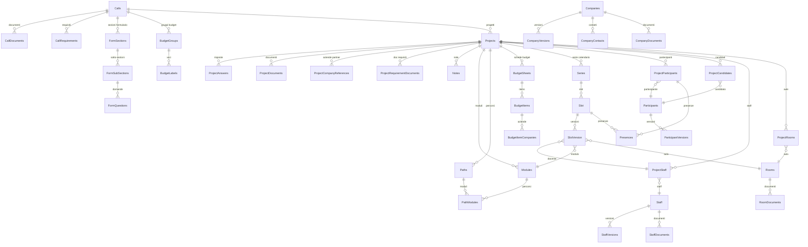

# Formart Marche

## 1. Overview

**Descrizione**: Piattaforma di gestione progetti formativi per Formart Marche. Copre l'intero ciclo di vita dei bandi di formazione professionale: dalla progettazione alla gestione operativa (calendario, presenze, budget, staff, partecipanti).

**Cliente**: Formart Marche (ente di formazione professionale)
**Settore**: Formazione professionale / Fondi pubblici
**Stato**: Attivo, in produzione (v0.7.6)
**Codice applicazione**: 2024056

## 2. Versioni

| Componente | Versione |
|---|---|
| App | 0.7.6 |
| laif-template | 5.3.13 |
| values.yaml | 1.1.0 |

## 3. Team

| Commits | Autore |
|---|---|
| 211 | Pinnuz |
| 164 | mlife |
| 102 | cri-p |
| 92 | Simone Brigante |
| 86 | bitbucket-pipelines |
| 85 | Marco Pinelli |
| 73 | github-actions[bot] |
| 55 | Gabriele |
| 49 | sadamicis |
| 30 | Gabriele Fogu |
| 30 | cavenditti-laif |
| 28 | Daniele DN |
| 21 | Matteo Scalabrini |
| 18 | angelolongano |
| 17 | Marco Vita |
| 17 | SimoneBriganteLaif |
| 16 | Carlo A. Venditti |

## 4. Modello dati CUSTOM

Data model molto ricco e articolato, tutto nello schema `prs`. Pattern di versioning sulle anagrafiche (Companies, Participants, Staff hanno tabelle `*_versions` con snapshot immutabili).

### Tabelle custom (28 tabelle)

| Tabella | Descrizione |
|---|---|
| `calls` | Bandi di formazione (Fondo Artigianato, Regione, altro) |
| `call_documents` | Documenti allegati ai bandi |
| `call_requirements` | Requisiti del bando |
| `form_sections` | Sezioni del formulario bando |
| `form_sub_sections` | Sotto-sezioni formulario |
| `form_questions` | Domande del formulario |
| `projects` | Progetti formativi (collegati a un bando) |
| `project_answers` | Risposte al formulario del progetto |
| `project_documents` | Documenti del progetto |
| `project_company_references` | Aziende/partner collegati al progetto |
| `project_requirement_documents` | Documenti requisiti per progetto |
| `project_participants` | Partecipanti iscritti a un progetto |
| `project_candidates` | Candidati in fase di pre-selezione |
| `project_staff` | Staff assegnato al progetto (docenti, tutor) |
| `project_staff_documents` | Documenti staff per progetto |
| `project_rooms` | Aule assegnate al progetto |
| `notes` | Note per progetto |
| `modules` | Moduli formativi (teoria, pratica, FAD, stage, esame, etc.) |
| `paths` | Percorsi formativi |
| `path_modules` | Associazione percorso-modulo (M2M) |
| `companies` | Anagrafica aziende (P.IVA/CF) |
| `company_versions` | Versioni immutabili dati azienda |
| `company_contacts` | Contatti azienda |
| `company_documents` | Documenti azienda |
| `participants` | Anagrafica partecipanti (CF univoco) |
| `participant_versions` | Versioni immutabili dati partecipante |
| `staff` | Anagrafica staff/docenti (CF univoco) |
| `staff_versions` | Versioni immutabili dati staff |
| `staff_documents` | Documenti staff |
| `rooms` | Aule formative |
| `rooms_documents` | Documenti aule |
| `budget_groups` | Gruppi di budget per bando |
| `budget_labels` | Voci di budget |
| `budget_sheets` | Schede budget per progetto (con fasi e versioni) |
| `budget_items` | Voci singole di budget |
| `budget_item_companies` | Associazione voce budget - azienda |
| `calendar` | Calendario giorni (weekend/festivi) |
| `series` | Serie di lezioni (intervallo date + giorni settimana) |
| `slot` | Singola lezione/slot |
| `slot_versions` | Versione dello slot (docente, aula, modulo, orari) |
| `presences` | Presenze partecipanti per slot |

### Diagramma ER (tabelle principali)

## 5. API routes CUSTOM

17 controller custom (escluso changelog che e template-adjacent):

| Controller | Prefix | Operazioni notevoli |
|---|---|---|
| `calls` | `/calls` | CRUD bandi |
| `calls.document` | `/call-documents` | Upload documenti bando |
| `calls.requirement` | `/call-requirements` | Requisiti bando |
| `calls.form_section` | `/form-sections` | Sezioni formulario |
| `calls.form_sub_section` | `/form-sub-sections` | Sotto-sezioni |
| `calls.form_question` | `/form-questions` | Domande formulario |
| `projects` | `/project` | CRUD + GenAI + init knowledge base + selezione + conferma calendario |
| `project_answers` | `/project-answers` | Risposte formulario |
| `project_company_references` | `/project-company-references` | Aziende partner |
| `modules` | `/modules` | Moduli formativi |
| `companies` | `/companies` + `/company-versions` + `/company-contacts` + `/company-documents` | Anagrafica aziende con versioning |
| `participants` | `/participants` + `/participant-versions` | Anagrafica partecipanti con versioning |
| `staff` | `/staff` + `/staff-versions` + `/staff-documents` | Anagrafica staff con versioning |
| `rooms` | `/rooms` + `/room-documents` | Aule formative |
| `budgets` | `/budget-groups` + `/budget-labels` + `/budget-sheets` + `/budget-items` + `/budget-item-companies` | Sistema budget completo con duplicazione schede |
| `calendar` | `/series` + `/slot` + `/slot-versions` | Calendario lezioni con creazione automatica slot |
| `presences` | `/presences` | Gestione presenze con update batch |
| `project_participants` | `/project-participants` | Iscrizione partecipanti |
| `project_candidates` | `/project-candidates` | Pre-selezione candidati |
| `project_staff` | `/project-staff` + `/project-staff-documents` | Staff assegnato |
| `project_rooms` | `/project-rooms` | Aule assegnate |
| `project_requirements_documents` | `/project-requirements-documents` | Documenti requisiti |
| `paths` | `/paths` | Percorsi formativi |
| `notes` | `/notes` | Note progetto |

### Endpoint custom notevoli

- `POST /project/gen-ai` - Generazione risposte formulario con AI
- `POST /project/init-knowledge-base/{id}` - Inizializzazione knowledge base OpenAI per progetto
- `POST /project/change-selection-status/{id}` - Chiusura pre-selezione/selezione con assegnazione stati
- `POST /project/confirm-calendar/{id}` - Conferma calendario e generazione PDF
- `POST /series/create-with-slots` - Creazione serie con generazione automatica slot
- `POST /slot/conclude/{id}` - Conclusione slot con generazione presenze
- `POST /presences/update-presences` - Update batch presenze
- `POST /budget-sheets/duplicate` - Duplicazione scheda budget

## 6. Business logic CUSTOM

### Generazione AI per formulari (OpenAI)
Sistema sofisticato di AI per la compilazione automatica dei formulari dei bandi:
- **Vector Store OpenAI**: ogni progetto ha un vector store dedicato con documenti del bando, dell'azienda e del progetto
- **Knowledge Base**: documenti caricati vengono sincronizzati con OpenAI (upload/delete tramite hook)
- **Prompt engineering**: prompt specifici per bandi di formazione con contesto partnership/ente singolo/partner
- **Istruzione assistente**: specializzato in formazione professionale (Fondo Artigianato, FSE, IFTS)

### Sistema di selezione partecipanti
Workflow a fasi per la selezione:
1. **Pre-selezione** (`ProjectCandidates`): candidature con protocollo, tipo presentazione, stato
2. **Chiusura pre-selezione**: assegnazione automatica stati (idoneo/non idoneo) basata su punteggio
3. **Selezione finale**: transizione a `ProjectParticipants` con stato finale (diplomato, ritirato, etc.)

### Generazione calendario automatica
- Creazione serie di lezioni specificando intervallo date e giorni della settimana
- Esclusione automatica festivi consultando tabella `calendar`
- Slot con versioning (per tracciare modifiche a docente/aula/orari)
- Conclusione slot con generazione automatica presenze

### Generazione PDF calendario
- Template Jinja2 + WeasyPrint per generare PDF del calendario progetto
- Griglia oraria con colori per modulo
- Raggruppamento per percorso formativo

### Sistema budget multi-fase
- Budget con fasi (iniziale, revisione) e versioni
- Duplicazione schede budget
- Calcolo automatico budget per bandi regionali: `(ore_totali) x partecipanti x parametro_regolamento`
- Supporto specifico per Fondo Artigianato vs Regione
- Associazione voci budget a aziende delegate

### Versioning anagrafiche
Pattern di versioning immutabile su Companies, Participants, Staff: ogni modifica crea una nuova versione, preservando lo storico. `current_version` espone sempre l'ultima.

## 7. Integrazioni esterne

| Servizio | Uso |
|---|---|
| **OpenAI** | Vector stores per knowledge base progetto, generazione risposte formulari con RAG |
| **AWS S3** | Storage documenti (template standard) |
| **WeasyPrint** | Generazione PDF calendario progetto |
| **pgvector** | Estensione PostgreSQL per vector embeddings (nel Dockerfile DB) |

## 8. Pagine frontend CUSTOM

Il frontend non usa App Router di Next.js nella struttura standard. Le pagine custom sono organizzate in `frontend/src/`:

| Sezione | Pagine/Tab | Descrizione |
|---|---|---|
| **Bandi** (`/calls/`) | Lista, Dettagli, Formulario, Moduli, Budget, Documenti | Gestione completa bandi |
| **Proposte** (`/proposals/`) | Info, Formulario, Aziende/Partner, Budget, Percorsi, Moduli, Documenti, Note | Progetti in fase proposta |
| **Progetti** (`/projects/`) | Info, Dati progetto, Gestione progetto (calendario, classi, aule, staff), Formulario, Aziende/Partner, Budget, Percorsi formativi, Documenti, Note | Gestione completa progetti vinti |
| **Data Entry** (`/data-entry/`) | Aziende, Partecipanti, Staff, Aule | Anagrafiche trasversali |
| **Classi** (`/classes/`) | Dettaglio lezione con presenze | Registro presenze con editor inline |

### Componenti frontend notevoli
- **Form Builder**: costruzione dinamica formulari per bandi (`calls/details/formBuilder/`)
- **Class Detail**: registro presenze con editor inline per orari e note (`class/classDetail.tsx`, 418 righe)
- **Calendar Tab**: gestione visuale calendario lezioni (`management/calendarTab/`)
- **Budget components**: gestione budget con tab per fasi

## 9. Stack e deviazioni

### Backend
- Stack standard laif-template (FastAPI, SQLAlchemy, PostgreSQL)
- **pgvector**: estensione PostgreSQL installata nel Dockerfile DB (per RAG/embeddings)
- **WeasyPrint + Jinja2**: generazione PDF lato server (non standard nel template)
- **Nessun requirements.txt custom trovato** (dipendenze gestite dal template)

### Frontend
- Next.js con Turbopack (standard)
- **xlsx**: libreria per export Excel (non standard)
- **draft-js + plugins**: editor rich text con mention (per note/formulari)
- **@hello-pangea/dnd**: drag & drop (per ordinamento)
- **amcharts5**: grafici avanzati
- **katex + rehype-katex + remark-math**: rendering formule matematiche

### Docker
- Setup standard (db + backend), no servizi aggiuntivi

## 10. Pattern notevoli

### Pattern versioning anagrafiche
Ogni entità anagrafica (Company, Participant, Staff) ha:
- Tabella master con solo identificativo univoco (P.IVA, CF)
- Tabella versions con tutti i dati + numero versione + timestamp
- `current_version` come hybrid property che ritorna l'ultima versione
- `column_property` flattened per ricerca/ordinamento sui campi della versione corrente

### Pattern safe delete con integrity check
Utility riutilizzabile (`safe_delete_with_integrity_check`) che cattura `IntegrityError` da FK constraint e ritorna messaggi user-friendly in italiano indicando quale dipendenza blocca l'eliminazione.

### Pattern creazione serie con slot automatici
La creazione di una serie genera automaticamente slot per ogni giorno valido nell'intervallo, consultando la tabella calendario per escludere festivi. Supporta filtro per giorni della settimana.

### Separazione Proposta/Progetto
Lo stesso modello `Projects` viene usato per proposte (studio, progettazione, presentato) e progetti vinti (gestione, rendicontazione), con status machine che governa la transizione. Il frontend li mostra in sezioni separate con tab diversi.

## 11. Tech debt e note

- **Duplicazione `column_property` Staff**: le proprietà flattened `versions_des_name` e `versions_des_surname` sono definite due volte identiche nel file models.py (righe 699-712 e 716-729)
- **Nessun background task attivo**: il file `events.py` ha solo placeholder commentati
- **Schema monolitico**: tutte le 40+ tabelle sono definite in un unico `models.py` (~1220 righe), il che rende il file molto grande
- **Nessun test custom visibile** nella struttura app (solo template standard)
- **`pass` residuo** in `controller.py` dopo l'inclusione di tutti i router
- **Tipologie ore moduli**: le ore formative sono distribuite su 12+ campi separati (`num_theory_hours`, `num_practice_hours`, `num_fad_hours`, etc.) sia nei moduli che nei budget sheets, con logica duplicata per il calcolo totale
- **Slot type mutuamente esclusivo**: constraint DB `check_only_one_slot_type` su `SlotVersion` per differenziare slot standard vs Fondo Artigianato - buon pattern ma potrebbe essere semplificato con single enum
- **Frontend senza App Router**: le pagine non usano la struttura `app/` di Next.js, suggerendo una migrazione non completata o un approccio custom alla navigazione
