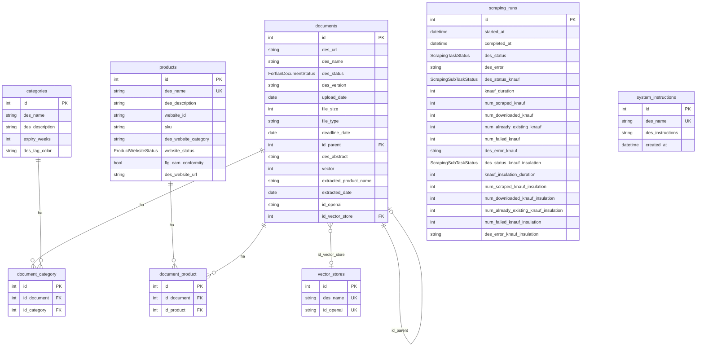

# Fortlan-Dibi - Analisi Completa Repository

## 1. Overview

**Descrizione**: Piattaforma di classificazione e gestione documentale per i prodotti dell'azienda Fortlan-Dibi, azienda nel settore dei materiali per edilizia (isolamento, prodotti chimici per costruzione). L'app semplifica la classificazione dei documenti tecnici (schede tecniche, schede di sicurezza, DOP, certificazioni) associati ai prodotti dell'azienda.

**Cliente**: Fortlan-Dibi S.p.A.

**Industria**: Edilizia / Materiali da costruzione

**Funzionalita principali**:
- Gestione catalogo prodotti con sync dal sito web aziendale (sitemap XML)
- Upload e classificazione automatica documenti tramite AI (OpenAI GPT-5-nano)
- Estrazione automatica di date di scadenza e nomi prodotto dai documenti
- Web scraping periodico di documenti tecnici da siti fornitori (Knauf, Knauf Insulation, Ursa)
- Ricerca semantica avanzata (MegaSearch) tramite OpenAI Vector Store
- Import massivo prodotti/documenti da CSV
- Gestione categorie documentali con tracking obsolescenza
- Chat AI integrata (template standard)

## 2. Versioni

| Componente | Versione |
|---|---|
| App (`version.txt`) | **0.6.1** |
| Laif Template (`version.laif-template.txt`) | **5.6.0** |
| `values.yaml` version | 1.1.0 |

## 3. Team (Top Contributors)

| Contributor | Commits |
|---|---|
| Pinnuz | 250 |
| mlife | 178 |
| github-actions[bot] | 97 |
| Simone Brigante | 92 |
| bitbucket-pipelines | 86 |
| Marco Pinelli | 85 |
| sadamicis | 49 |
| cavenditti-laif | 48 |
| neghilowio | 41 |
| Luca Stendardo | 34 |
| Carlo A. Venditti | 31 |
| Daniele DN | 28 |
| Matteo Scalabrini | 21 |

## 4. Stack & Dipendenze Non-Standard

### Backend (Python 3.12)
Framework standard laif-template (FastAPI, SQLAlchemy, Pydantic v2, PostgreSQL).

**Dipendenze NON standard** (specifiche del progetto):
| Pacchetto | Uso |
|---|---|
| `aiohttp` | Client HTTP async per download concorrente documenti durante scraping |
| `mechanicalsoup` | Scraping web (probabilmente legacy, sostituito da Selenium) |
| `selenium` | Web scraping con browser headless (Knauf, Knauf Insulation, Ursa) |
| `webdriver-manager` | Gestione driver Chrome per Selenium |

**Dependency groups opzionali** (tutti abilitati di default):
- `pdf`: PyMuPDF
- `llm`: openai, pgvector
- `docx`: python-docx
- `xlsx`: xlsxwriter, pandas

### Frontend (Node >= 24, Next.js 16)
**Dipendenze NON standard** (oltre il template):
| Pacchetto | Uso |
|---|---|
| `@amcharts/amcharts5` | Grafici/visualizzazioni dati |
| `katex` + `rehype-katex` + `remark-math` | Rendering formule matematiche |
| `react-markdown` + `remark-gfm` | Rendering Markdown |
| `react-syntax-highlighter` | Syntax highlighting codice |
| `@hello-pangea/dnd` | Drag and drop |
| `@draft-js-plugins/editor` + `@draft-js-plugins/mention` | Editor rich text con menzioni |
| `draft-js` + `draft-js-export-html` | Editor rich text (Draft.js) |
| `@microsoft/fetch-event-source` | Server-Sent Events (per streaming chat AI) |
| `framer-motion` | Animazioni |
| `laif-ds` | ^0.2.67 |

### Docker Compose
Servizi standard: `db` (PostgreSQL), `backend` (FastAPI).
- Build arg `ENABLE_XLSX: 1` nel backend
- File extra: `docker-compose.wolico.yaml` per test con rete condivisa Wolico
- Nessun servizio extra (no Redis, no Celery)

## 5. Modello Dati Completo

### Schema `prs` (applicativo)



### Enum

| Enum | Valori |
|---|---|
| `FortlanDocumentStatus` | `active`, `obsolete`, `nearing_obsolescence`, `waiting_confirmation` |
| `ProductWebsiteStatus` | `published`, `draft` |
| `ScrapingTaskStatus` | `running`, `success`, `failure` |
| `ScrapingSubTaskStatus` | `success`, `failure` |

### Column Properties calcolate (su Document)
- `des_category_names`: aggregazione nomi categorie associate
- `des_related_product_name`: aggregazione nomi prodotti associati
- `des_related_product_website_category`: aggregazione categorie web dei prodotti
- `calculated_status`: stato calcolato in base a deadline_date, extracted_date, e expiry_weeks delle categorie (logica SQL complessa con COALESCE e sotto-query)
- `des_parent_name`, `des_parent_url`: nome e URL del documento padre

## 6. API Routes

### App Routes (custom)

| Prefisso | Metodo | Endpoint | Descrizione |
|---|---|---|---|
| **fortlan-documents** | POST | `/` | Crea documento |
| | PUT | `/{id}` | Aggiorna documento |
| | DELETE | `/{id}` | Elimina documento (+ cleanup OpenAI/VectorStore) |
| | GET | `/search` | Cerca documenti |
| | GET | `/{id}` | Dettaglio documento |
| | POST | `/batch` | Batch create |
| | PUT | `/batch` | Batch update |
| | DELETE | `/batch` | Batch delete |
| | GET | `/download/{id}` | Download file |
| | POST | `/bulk_update` | Aggiornamento massivo (stato, scadenza, categorie) |
| | PUT | `/related_product/{doc_id}` | Aggiorna prodotto associato |
| | POST | `/custom_upload/{doc_id}` | Upload custom + classificazione AI + estrazione dati |
| | POST | `/mega_search/` | Ricerca semantica via OpenAI Vector Store |
| | POST | `/scraper_knauf/` | Avvia scraping Knauf |
| | POST | `/scraper_ursa/` | Avvia scraping Ursa |
| | POST | `/scraper_knauf_insulation/` | Avvia scraping Knauf Insulation |
| | POST | `/import_website_docs/` | Import massivo da CSV |
| **categories** | CRUD | Standard | Gestione categorie |
| **products** | CRUD | Standard | Gestione prodotti |
| | POST | `/sync-website-urls` | Sync URL prodotti da sitemap XML |
| **document-categories** | CRUD+Batch | Standard | Relazioni documento-categoria |
| **document-products** | CRUD+Batch | Standard | Relazioni documento-prodotto |
| **scraping-history** | GET | `/search`, `/{id}` | Storico sessioni scraping |
| **changelog** | GET | `/` | Changelog (tech/customer, template/app) |

### Template Routes (standard)
Conversation (chat, knowledge, analytics, feedback), Files, User Management, Ticketing, Notifications, Health, etc.

## 7. Business Logic

### Classificazione AI Documenti
- All'upload di un documento, il sistema:
  1. Prima tenta match per **pattern nel filename** (es. "scheda tecnica", "msds", "sicurezza")
  2. Se non trova match, invoca **OpenAI GPT-5-nano** per classificazione AI
  3. Estrae **data di scadenza** e **nome prodotto** dal contenuto del documento
  4. Associa automaticamente il documento alle categorie e prodotti estratti
- Le istruzioni di sistema per classificazione/estrazione sono configurabili via tabella `system_instructions`

### Web Scraping Automatizzato
- **Task schedulato**: ogni 1 ora controlla se e il 1 del mese, finestra 02:00-03:00
- **3 scraper con Selenium headless** (Chromium in Docker):
  - **Knauf Download Center** (`knauf.com/it-IT/tools/download-center`): paginazione, filtro per data aggiornamento
  - **Knauf Insulation** (`knaufinsulation.com`): infinite scroll con "Mostra di piu"
  - **Ursa** (`ursa.it/documentazione/`): paginazione standard
- Download concorrente documenti via `aiohttp` + `asyncio.gather`
- Ogni scraping run viene tracciato nella tabella `scraping_runs` con metriche dettagliate per sub-task
- Cutoff date configurabili: `scraper_knauf_cutoff_date`, `scraper_knauf_ts_cutoff_date`

### Ricerca Semantica (MegaSearch)
- Utilizza **OpenAI Vector Store** per ricerca semantica sui documenti
- Configurabile: `MS_max_num_results` (default 50), `MS_score_threshold` (default 0.60)
- Supporta filtro per categoria e stato

### Import CSV Massivo
- Importa prodotti e documenti da file CSV esportato dal sito web
- Per ogni riga CSV: crea prodotto, processa colonne "Scheda Tecnica 1-9", "Scheda Sicurezza 1-2", "Dop 1-2", "Altre 1-4"
- Per ogni documento: download URL, upload S3, upload OpenAI, vector store, estrazione data scadenza AI, classificazione AI

### Sync URL Sito Web
- Parse sitemap XML statico del sito fortlan-dibi.it
- Match prodotti DB con slug URL via normalizzazione nomi

### Gestione Obsolescenza Documenti
- Stato calcolato automaticamente via SQL: `active`, `nearing_obsolescence` (< 1 mese alla scadenza), `obsolete` (scaduto)
- Cascade di priorita: deadline_date > extracted_date > upload_date + expiry_weeks della categoria

## 8. Integrazioni Esterne

| Servizio | Uso |
|---|---|
| **OpenAI API** (GPT-5-nano) | Classificazione documenti, estrazione dati (prodotto, scadenza) |
| **OpenAI Vector Store** | Indicizzazione documenti per ricerca semantica |
| **OpenAI Files API** | Upload/gestione file documenti |
| **AWS S3** | Storage file documenti |
| **Knauf.com** | Scraping documenti tecnici (Selenium) |
| **Knauf Insulation** | Scraping documenti tecnici (Selenium) |
| **Ursa.it** | Scraping documentazione (Selenium) |
| **Fortlan-Dibi sitemap** | Sync URL prodotti |

## 9. Frontend - Albero Pagine

```
frontend/app/
├── page.tsx                              (Landing/Login)
├── (not-auth-template)/
│   ├── logout/page.tsx
│   └── registration/page.tsx
└── (authenticated)/
    ├── (app)/                            [Pagine custom]
    │   ├── changelog-customer/page.tsx
    │   └── changelog-technical/page.tsx
    ├── categories/page.tsx               [Gestione categorie documentali]
    ├── documents/page.tsx                [Gestione documenti - pagina principale]
    ├── website-products/page.tsx         [Prodotti dal sito web]
    ├── scraped-websites/page.tsx         [Siti web scrappati]
    ├── scraping-history/page.tsx         [Storico sessioni scraping]
    └── (template)/                       [Pagine standard template]
        ├── conversation/
        │   ├── chat/page.tsx
        │   ├── knowledge/page.tsx
        │   ├── knowledge/detail/page.tsx
        │   ├── analytics/page.tsx
        │   └── feedback/page.tsx
        ├── files/page.tsx
        ├── help/
        │   ├── faq/page.tsx
        │   └── ticket/page.tsx
        ├── profile/page.tsx
        └── user-management/
            ├── business/page.tsx
            ├── group/page.tsx
            ├── group/detail/page.tsx
            ├── permission/page.tsx
            ├── role/page.tsx
            └── user/
                ├── page.tsx
                ├── create/page.tsx
                └── detail/{info,roles,groups}/page.tsx
```

### Features Frontend (src/features/)
- `documents` - Gestione documenti (componenti, hooks, helpers, widgets, tipi)
- `categories` - Gestione categorie (con config, widgets)
- `website-products` - Prodotti sito web (con helpers)
- `scraped-websites` - Visualizzazione siti scrappati
- `scraping-history` - Storico scraping (con helpers)
- `changelog` - Changelog (con servizi, componenti, utils, tipi)

## 10. Deviazioni dal Template Standard

### File/Cartelle NON standard
| Path | Descrizione |
|---|---|
| `backend/src/app/document/` | Logica complessa documenti con scraping, AI, import CSV |
| `backend/src/app/document/initial_import/` | Servizio import massivo CSV |
| `backend/src/app/document/temp/` | File temporanei (XML Sitemap statico) |
| `backend/src/app/category/` | Gestione categorie documentali |
| `backend/src/app/products/` | Gestione prodotti con sync sitemap |
| `backend/src/app/document_category/` | Relazione M:N documenti-categorie |
| `backend/src/app/document_product/` | Relazione M:N documenti-prodotti |
| `backend/src/app/scraping_history/` | Storico sessioni scraping |
| `backend/src/app/changelog/` | API changelog con file docs/ |
| `backend/src/app/events.py` | Task schedulati (scraper periodico) |
| `backend/src/app/common/email/` | Template email custom |
| `docker-compose.wolico.yaml` | Configurazione per test con Wolico |
| `frontend/app/(authenticated)/categories/` | Pagina categorie |
| `frontend/app/(authenticated)/documents/` | Pagina documenti |
| `frontend/app/(authenticated)/website-products/` | Pagina prodotti web |
| `frontend/app/(authenticated)/scraped-websites/` | Pagina siti scrappati |
| `frontend/app/(authenticated)/scraping-history/` | Pagina storico scraping |

### Personalizzazioni config
- `Settings` esteso con: `MS_max_num_results`, `MS_score_threshold`, `scraper_knauf_cutoff_date`, `scraper_knauf_ts_cutoff_date`
- Ruolo custom: `AppRoles.MANAGER`
- Build Docker con Chromium + ChromeDriver per Selenium headless

## 11. Pattern Notevoli

### Classificazione AI con Fallback a Pattern Matching
Il sistema usa un approccio ibrido per la classificazione: prima pattern matching sui nomi file (zero-cost), poi AI solo se necessario. Le istruzioni di sistema sono salvate in DB (tabella `system_instructions`), permettendo aggiornamento senza deploy.

### Scraping Robusto con Metriche
Il sistema di scraping traccia metriche dettagliate per ogni sub-task (num_scraped, num_downloaded, num_already_existing, num_failed, duration, errori). Il task schedulato usa `repeat_every` di fastapi-utils e gira in finestra oraria specifica.

### Column Properties SQL Complesse
L'entita `Document` ha diverse column_property calcolate direttamente in SQL (aggregazioni cross-tabella, logica di obsolescenza a cascata). Questo sposta la complessita nel DB evitando N+1 queries.

### Download Concorrente
I documenti scrappati vengono scaricati in parallelo via `aiohttp` + `asyncio.gather`, con gestione robusta delle eccezioni.

## 12. Note & Tech Debt

### Tech Debt Identificato
- **`document/service.py` = 2121 righe**: File enorme, viola la regola delle 500 righe. Contiene scraping, AI, upload, search, download. Diversi `# TODO: REFACTOR, TOO COMPLEX` nel codice. Marchiato `noqa: C901` in piu funzioni.
- **3 scraper quasi identici**: `scraping_knauf_selenium`, `scraping_knauf_ts_selenium`, `scraping_ursa_selenium` condividono ~80% del codice (setup Chrome, gestione driver). Andrebbero refactorizzati in un base scraper.
- **`mechanicalsoup` in requirements**: Presente nelle dipendenze ma probabilmente non piu usato (sostituito da Selenium). Dead dependency.
- **Sitemap XML statico**: Il file `XML Sitemap.xml` e un file statico nella cartella `temp/`. Non viene scaricato dinamicamente dal sito.
- **CHANGELOG vuoto**: Il changelog ha solo la entry iniziale del template. Nessuna documentazione delle release successive.
- **Import CSV con id_product**: Il codice di import CSV referenzia `Document.id_product` e `Document.flg_active_website` che non sono presenti nel modello attuale (probabilmente rimossi dopo refactoring M:N).

### Peculiarita
- Usa **GPT-5-nano** (modello leggero) con `reasoning.effort: "low"` per classificazione ed estrazione - scelta di costo/performance
- Il Docker backend include **Chromium browser** per scraping headless in produzione
- `docker-compose.wolico.yaml` suggerisce integrazione/test con il progetto Wolico
- Lo schema DB e `prs` (non il classico `app`) - naming forse da "Products" o "PRS" aziendale
- Il modello `VectorStore` gestisce l'indirizzamento agli OpenAI Vector Store con un singolo store "global"
