# Helia - Analisi Completa Repository

## 1. Overview

**Helia** e' una piattaforma AI voice-agent per customer care. Permette alle aziende di configurare agenti vocali AI che gestiscono chiamate telefoniche reali (inbound e outbound), automatizzando:

- Raccolta e triage callback
- Prenotazioni calendario
- Trasferimento chiamata a operatori umani
- Esecuzione query controllate su database esterni
- Campagne outbound con CSV/webhook/API

L'app fornisce anche visibilita' operativa: analytics conversazioni, KPI agenti, outcomes, qualita' tool-call e dashboard di monitoraggio.

- **Cliente**: Helia S.R.L. (prodotto proprio LAIF)
- **Industria**: AI / Customer Care / VoIP
- **URL prodotto**: https://helia.app.laifgroup.com
- **Landing page pubblica**: https://helia-voice.com

## 2. Versioni

| Elemento | Versione |
|---|---|
| App (`version.txt`) | **0.7.5** |
| laif-template (`version.laif-template.txt`) | **5.6.7** |
| `values.yaml` version | 1.1.0 |
| laif-ds (frontend) | **0.2.73** |
| Node.js richiesto | >= 25.0.0 |
| Python richiesto | >= 3.12, < 3.13 |

## 3. Team (top contributors)

| Commits | Autore |
|---|---|
| 414 | Leonardo Carboni |
| 300 | Pinnuz |
| 204 | mlife |
| 194 | github-actions[bot] |
| 99 | Carlo A. Venditti |
| 94 | Luca Torresan |
| 92 | Simone Brigante |
| 86 | bitbucket-pipelines |
| 85 | Marco Pinelli |
| 77 | neghilowio |
| 62 | cavenditti-laif |
| 49 | sadamicis |

**Totale commit**: ~2075 | **Migrazioni Alembic**: 58

## 4. Stack e dipendenze non-standard

### Backend (Python)

Dipendenze **specifiche di Helia** (non presenti nel template base):

| Pacchetto | Scopo |
|---|---|
| `elevenlabs==2.14.0` | SDK agenti vocali AI (core del prodotto) |
| `google-api-python-client`, `google-auth-*` | OAuth Google Calendar |
| `notion-client>=2.3.0` | Integrazione Notion (landing form) |
| `pymysql>=1.1.0` | Driver MySQL per DB consulting |
| `pyodbc>=5.1.0` | Driver ODBC (MSSQL) per DB consulting |
| `oracledb>=2.0.0` | Driver Oracle per DB consulting |
| `python-magic>=0.4.27` | Detect MIME type documenti |
| `cryptography>=45.0.4` | Crittografia token/credenziali |
| `aiohttp~=3.13.3` | Client HTTP async |

**Dependency groups opzionali**:
- `pdf`: pymupdf (parsing PDF per knowledge base)
- `llm`: openai + pgvector (AI analysis / daily digest)
- `docx`: python-docx
- `xlsx`: xlsxwriter, pandas, openpyxl

### Frontend (Next.js 16 + React 19)

Dipendenze **specifiche di Helia**:

| Pacchetto | Scopo |
|---|---|
| `@elevenlabs/react` | Widget test voce in-app |
| `@tiptap/*` (7 pacchetti) | Editor rich text (wiki pages) |
| `@amcharts/amcharts5` | Grafici dashboard |
| `recharts` | Grafici aggiuntivi |
| `@hello-pangea/dnd` | Drag & drop |
| `draft-js` + plugins | Editor menzioni/rich text legacy |
| `libphonenumber-js` | Validazione numeri telefono |
| `simplex-noise` | Effetti visuali landing page |
| `xlsx` | Import/export CSV/XLSX |
| `marked`, `turndown`, `turndown-plugin-gfm` | Conversione HTML/Markdown |
| `katex`, `rehype-katex`, `remark-math` | Rendering formule matematiche |
| `react-hot-toast` | Notifiche toast |
| `react-syntax-highlighter` | Highlighting codice |

### Docker Compose

Servizi standard (db PostgreSQL + backend FastAPI). Nessun servizio extra (no Redis, no Celery, no Elasticsearch).

Compose aggiuntivi:
- `docker-compose.wolico.yaml`: rete condivisa per test con Wolico
- `docker-compose.e2e.yaml`: ambiente test E2E separato
- `docker-compose.debug.yaml` / `docker-compose.debug-pycharm.yaml`: debug

## 5. Data Model Completo

### Tabelle applicative (schema `prs`)

#### Core - Agenti Vocali

| Tabella | Colonne principali | Note |
|---|---|---|
| `helia_prompts` | id, prompt, dat_creation | Prompt globale Helia |
| `voice_agent_prompts` | id, id_voice_agent, id_helia_prompt_base, prompt, dat_creation | Versioning prompt per agente |
| `voice_agents` | id, id_business, id_elevenlabs, des_name, des_prompt_name, id_elevenlabs_voice, expertise, main_restrictions, first_message, dynamic_first_message_template, timezone, languages[], dat_creation | Configurazione agente AI |
| `features` | id, des_name, prompt | Feature disponibili (booking, callback, ecc.) |
| `tools` | id, des_name, prompt, id_elevenlabs | Tool eseguibili da agenti |
| `feature_tool` | id, id_feature, id_tool | Associazione M:N feature-tool |
| `feature_agents` | id, id_feature, id_voice_agent, custom_prompt | Associazione feature-agente con prompt custom |
| `voice_agent_processes` | id, id_voice_agent, des_name, when_to_apply, blocks, dat_creation | Workflow decisionali per casi specifici |

#### Conversazioni e Messaggi

| Tabella | Colonne principali | Note |
|---|---|---|
| `conversations` | id, id_voice_agent, id_conversation_elevenlabs, id_contact, val_duration, status, direction (inbound/outbound), cost, external_number, des_audio_url, val_is_new_customer, val_inferred_category/subcategory/sentiment/script, val_tool_calls_total/validated, outbound_extraction_payload | Record chiamata |
| `messages` | id, id_conversation, id_conversation_elevenlabs, des_sender (customer/tool/agent), des_message, dat_sent | Singolo messaggio |
| `conversation_audio` | id, id_conversation, des_url | Audio conversazione |

#### Contatti

| Tabella | Colonne principali | Note |
|---|---|---|
| `contacts` | id, id_business, normalized_phone, raw_phone, display_name, preferred_language, tags[], notes, last_interaction_at, last_conversation_summary, last_sentiment, context_data (JSONB) | Profilo contatto arricchito |
| `contact_interactions` | id, id_contact, id_conversation, happened_at, channel, summary, sentiment, topics[], context_payload, notes | Log cronologico interazioni |

#### Callback e CRM

| Tabella | Colonne principali | Note |
|---|---|---|
| `callbacks` | id, customer_name, reason, priority, status, notes, category, tone_of_voice, id_callback_category, form_data (JSONB), id_conversation_elevenlabs, id_voice_agent, customer_phone, id_contact | Richiesta callback |
| `callback_categories` | id, id_voice_agent, des_name, description, email_recipients[], is_active, email_recap_timing, id_crm_connection, crm_ticket_settings, form_schema | Categoria callback con routing notifiche |
| `callback_crm_tickets` | id, id_callback, id_crm_connection, provider, provider_ticket_id, provider_ticket_url, last_status, last_error, payload_request/response | Ticket CRM sincronizzato |
| `crm_connections` | id, id_business, provider, connection_name, connection_description, provider_data (JSONB) | Connessione CRM (HubSpot, Zendesk, Salesforce, Zoho, Deepser, Freshdesk, Intercom, Jira) |

#### Calendario

| Tabella | Colonne principali | Note |
|---|---|---|
| `calendar_connections` | id, id_business, provider (Google/Microsoft/Calendly/Cal.com), connection_name, provider_data (JSONB) | Connessione calendario OAuth |
| `calendar_event_types` | id, id_calendar_connection, title, description, duration_minutes, is_active | Tipo evento prenotabile |
| `calendar_event_type_availabilities` | id, id_calendar_event_type, day_of_week, start_time, end_time | Finestre disponibilita' |
| `calendar_event_type_agents` | id, id_reservation_type, id_voice_agent | Associazione tipo evento-agente |
| `calendar_events` | id, customer_name, title, description, start_time, end_time, event_type, status, provider_event_id, id_conversation, id_contact, id_voice_agent | Evento calendario creato da AI |

#### Database Consulting

| Tabella | Colonne principali | Note |
|---|---|---|
| `db_connections` | id, id_business, provider (PostgreSQL/MySQL/MSSQL/Oracle/SQLite), connection_name, connection_config (JSONB), is_active | Connessione DB esterno |
| `db_queries` | id, id_business, id_db_connection, identifier, display_name, description, sql_statement, max_rows, parameters (JSONB), is_active, result_sample | Query predefinita |
| `db_query_agents` | id, id_db_query, id_voice_agent | Associazione query-agente |
| `db_query_executions` | id, id_db_query, id_voice_agent, id_business, status, duration_ms, row_count, parameters, error, result_preview | Log esecuzioni |

#### Telefonia e Transfer

| Tabella | Colonne principali | Note |
|---|---|---|
| `phone_number_connections` | id, id_business, provider (sip_trunk/twilio), label, phone_number, id_voice_agent, inbound_trunk_config, outbound_trunk_config, id_elevenlabs, telnyx_proxy_config | Connessione numero telefonico |
| `transfer_tool_configs_phone_numbers` | id, id_voice_agent, reason, transfer_mode (conference/refer/warm), type (e164/sip), value | Destinazione trasferimento |
| `transfer_phone_number_availabilities` | id, id_transfer_phone_number, day_of_week, start_time, end_time | Disponibilita' trasferimento |
| `telnyx_call_sessions` | id, id_business, id_voice_agent, id_conversation, telnyx_call_session_id, leg_a/b/c_call_control_id, external_number, called_number, status, transfer_*, warm_transfer_*, payload | Sessione Telnyx bridged |

#### Outbound Campaigns

| Tabella | Colonne principali | Note |
|---|---|---|
| `outbound_campaigns` | id, id_business, id_voice_agent, id_phone_number_connection, name, description, is_active, intent_key, subprompt, variables_schema, extraction_schema, first_message_template, dialing_policy, recap_webhook_url | Campagna outbound |
| `outbound_batches` | id, id_business, id_campaign, status, start_mode, original_filename, scheduled_at, total/valid/invalid_rows, queued/dialing/in_call/completed/failed/skipped, validation_summary | Batch CSV upload |
| `outbound_batch_rows` | id, id_business, id_campaign, id_batch, row_index, external_id, to_number_raw/normalized, variables, is_valid, errors[] | Singola riga CSV |
| `outbound_runs` | id, id_business, id_campaign, id_batch, source (webhook/csv/api), status, totali contatori, started_at, completed_at | Esecuzione batch |
| `outbound_leads` | id, id_business, id_campaign, id_run, id_batch, external_id, to_number, variables, status, last_error, attempt_count, next_attempt_at, id_contact | Lead outbound |
| `outbound_call_attempts` | id, id_business, id_lead, attempt_no, provider, conversation_id_elevenlabs, request/response_payload, status, error, dialed_at, connected_at, ended_at | Tentativo chiamata |

#### Billing e Subscriptions

| Tabella | Colonne principali | Note |
|---|---|---|
| `minute_bundles` | id, id_owner_business, des_name, included_minutes, default_price, overage_price, billing_interval, trial_days | Piano minuti |
| `business_subscriptions` | id, id_business, id_bundle, status, started_at, trial_ends_at, auto_renew, cancel_at_period_end, active_period_id | Subscription attiva |
| `business_subscription_periods` | id, subscription_id, period_index, period_start/end, minutes_included, base_price, overage_price, is_closed | Periodo di fatturazione |

#### AI Analysis

| Tabella | Colonne principali | Note |
|---|---|---|
| `ai_daily_insights` | id, id_business, summary_date, window_start/end_utc, brief/detailed_summary_markdown, key_actions[], model_name (gpt-5-mini) | Digest giornaliero AI |
| `ai_daily_insight_feedbacks` | id, id_ai_daily_insight, id_business, id_user, feedback (like/dislike), notes | Feedback utente su digest |

#### Supporto e Wiki

| Tabella | Colonne principali | Note |
|---|---|---|
| `support_tickets` | id, id_business, id_user, id_conversation, category, status, title, description | Ticket supporto |
| `support_ticket_messages` | id, id_support_ticket, sender (customer/admin/helia), message | Thread messaggi ticket |
| `wiki_pages` | id, slug, category, category_order, page_order | Pagine wiki prodotto |
| `wiki_page_contents` | id, id_wiki_page, locale, title, content_markdown | Contenuti localizzati |
| `wiki_images` | id, id_wiki_page, filename, content_type, file_size, sha256, blob | Immagini wiki (binary in DB) |

#### Altro

| Tabella | Colonne principali | Note |
|---|---|---|
| `business_hours` | id, id_business, timezone | Orari business |
| `business_hour_windows` | id, id_business_hours, day_of_week, start_time, end_time | Finestre orarie |
| `business_features` | id, id_business, contacts_enabled, outbound_enabled | Feature flags per business |
| `documents` | id, id_voice_agent, des_name, des_url, source_type, des_content, des_status, id_knowledge_doc_elevenlabs, cached content/hash, sync metadata | Knowledge base agente |
| `document_sync_jobs` | id, document_id, action, status, attempts, payload, last_error | Outbox sync ElevenLabs |
| `reseller_profiles` | id_reseller_business | Profili reseller |
| `reseller_customer_businesses` | id, id_reseller_business, id_customer_business | Associazione reseller-cliente |
| `qa_sections` | id, des_name, id_voice_agent | Sezioni Q&A knowledge base |
| `qa` | id, id_section, question, answer | Coppie domanda-risposta |

### Diagramma ER (Mermaid)

```mermaid
erDiagram
    Business ||--o{ VoiceAgent : "possiede"
    Business ||--o{ CalendarConnection : "ha"
    Business ||--o{ CrmConnection : "ha"
    Business ||--o{ DbConnection : "ha"
    Business ||--o{ PhoneNumberConnection : "ha"
    Business ||--o{ BusinessSubscription : "ha"
    Business ||--o{ BusinessHours : "ha"
    Business ||--o{ BusinessFeatures : "ha"
    Business ||--o{ Contact : "ha"
    Business ||--o{ AIDailyInsight : "ha"
    Business ||--o{ SupportTicket : "ha"
    Business ||--o{ ResellerProfile : "puo essere"
    Business ||--o{ OutboundCampaign : "ha"

    VoiceAgent ||--o{ Conversation : "gestisce"
    VoiceAgent ||--o{ Callback : "riceve"
    VoiceAgent ||--o{ Document : "ha knowledge"
    VoiceAgent ||--o{ QASection : "ha Q&A"
    VoiceAgent ||--o{ FeatureAgent : "ha feature"
    VoiceAgent ||--o{ VoiceAgentPrompt : "ha prompt"
    VoiceAgent ||--o{ AgentProcess : "ha processi"
    VoiceAgent ||--o{ CallbackCategory : "ha categorie"
    VoiceAgent ||--o{ OutboundCampaign : "ha campagne"
    VoiceAgent ||--o{ TransferPhoneNumber : "ha transfer"
    VoiceAgent ||--o{ TelnyxCallSession : "ha sessioni"
    VoiceAgent }o--o{ DbQuery : "puo eseguire"
    VoiceAgent ||--o{ PhoneNumberConnection : "collegato a"

    Conversation ||--o{ Message : "contiene"
    Conversation ||--o| ConversationAudio : "ha audio"
    Conversation }o--o| Contact : "con"

    Contact ||--o{ ContactInteraction : "ha"
    Contact ||--o{ Callback : "richiede"
    Contact ||--o{ CalendarEvent : "prenota"

    CalendarConnection ||--o{ CalendarEventType : "offre"
    CalendarEventType ||--o{ CalendarEventTypeAvailability : "disponibile"
    CalendarEventType ||--o{ CalendarEventTypeAgent : "assegnato a"
    CalendarEventType ||--o{ CalendarEvent : "tipo di"

    CallbackCategory ||--o{ Callback : "classifica"
    CallbackCategory }o--o| CrmConnection : "sincronizza con"
    Callback ||--o{ CallbackCrmTicket : "ha ticket"
    CrmConnection ||--o{ CallbackCrmTicket : "genera"

    DbConnection ||--o{ DbQuery : "ha"
    DbQuery ||--o{ DbQueryExecution : "eseguita come"
    DbQuery ||--o{ DbQueryAgent : "autorizzato per"

    Feature ||--o{ FeatureAgent : "attivata per"
    Feature }o--o{ Tool : "usa"

    Document ||--o{ DocumentSyncJob : "sincronizzato via"

    BusinessSubscription ||--o{ BusinessSubscriptionPeriod : "ha periodi"
    MinuteBundle ||--o{ BusinessSubscription : "piano"
    BusinessHours ||--o{ BusinessHourWindow : "ha finestre"

    OutboundCampaign ||--o{ OutboundRun : "ha run"
    OutboundCampaign ||--o{ OutboundLead : "ha lead"
    OutboundCampaign ||--o{ OutboundBatch : "ha batch"
    OutboundBatch ||--o{ OutboundBatchRow : "ha righe"
    OutboundRun ||--o{ OutboundLead : "processa"
    OutboundLead ||--o{ OutboundCallAttempt : "ha tentativi"

    TransferPhoneNumber ||--o{ TransferPhoneNumberAvailability : "disponibile"
    TelnyxCallSession }o--o| Conversation : "collegata a"

    AIDailyInsight ||--o{ AIDailyInsightFeedback : "ha feedback"
    SupportTicket ||--o{ SupportTicketMessage : "ha messaggi"
    WikiPage ||--o{ WikiPageContent : "ha contenuti"
    WikiPage ||--o{ WikiImage : "ha immagini"

    ResellerProfile ||--o{ ResellerCustomerBusiness : "gestisce"

    QASection ||--o{ QA : "contiene"
```



## 6. API Routes

### Risorse applicative (34 controller)

| Prefisso | Risorsa | Descrizione |
|---|---|---|
| `/voice_agents` | Voice Agents | CRUD agenti, demo outbound call, testing |
| `/agent_conversations` | Conversations | Webhook ElevenLabs (post_call, initiation), CRUD conversazioni |
| `/messages` | Messages | Messaggi conversazione |
| `/conversation_audio` | Audio | Audio conversazioni |
| `/contacts` | Contacts | CRUD contatti arricchiti |
| `/callbacks` | Callbacks (via tool) | Tool callback da ElevenLabs |
| `/callback_categories` | Callback Categories | Categorie con routing notifiche |
| `/calendar_connections` | Calendar Connections | OAuth Google/Microsoft |
| `/calendar_event_types` | Event Types | Tipi evento prenotabili |
| `/tool/calendar_event` | Calendar Events (tool) | Creazione eventi da agente |
| `/tool/callback` | Callbacks (tool) | Creazione callback da agente |
| `/tool/db_consulting` | DB Consulting (tool) | Esecuzione query da agente |
| `/tool/crm_ticket_status` | CRM Ticket Status | Stato ticket CRM |
| `/crm_connections` | CRM Connections | OAuth CRM providers |
| `/db_connections` | DB Connections | Connessioni DB esterni |
| `/db_queries` | DB Queries | Query predefinite |
| `/phone_numbers` | Phone Numbers | Numeri telefonici SIP/Twilio |
| `/transfer_phone_numbers` | Transfer Numbers | Destinazioni trasferimento |
| `/telnyx_proxy` | Telnyx Proxy | Webhook + transfer Telnyx |
| `/outbound_campaigns` | Outbound Campaigns | Campagne outbound |
| `/dashboard_statistics` | Dashboard Stats | KPI e analytics per business |
| `/admin_dashboard_statistics` | Admin Stats | Dashboard admin cross-business |
| `/helia_prompts` | Prompts | Gestione prompt globali |
| `/features` | Features | Feature disponibili |
| `/documents` | Documents | Knowledge base documenti |
| `/business_subscriptions` | Subscriptions | Piani e subscription |
| `/minute_bundles` | Minute Bundles | Piani minuti |
| `/business_hours` | Business Hours | Orari business |
| `/business_features` | Business Features | Feature flags |
| `/ai_analysis` | AI Analysis | Digest giornaliero AI |
| `/resellers` | Resellers | Gestione reseller |
| `/landing_form` | Landing Form | Form landing page (pubblico) |
| `/support_tickets` | Support Tickets | Ticket supporto in-app |
| `/wiki` | Wiki | Documentazione utente in-app |
| `/changelog` | Changelog | Changelog visibile utente |

### Tool endpoints (chiamati da ElevenLabs durante le conversazioni)

- `POST /tool/callback/create` - Crea callback
- `POST /tool/calendar_event/create` - Crea evento calendario
- `POST /tool/db_consulting/execute` - Esegui query DB
- `POST /tool/crm_ticket_status/get` - Stato ticket CRM

## 7. Business Logic

### Background Tasks (9 task periodici)

| Task | Frequenza | Scopo |
|---|---|---|
| `sync_elevenlabs_conversations` | Ogni 12h | Backfill conversazioni ElevenLabs |
| `renew_subscriptions_job` | Startup | Rinnovo subscription scadute |
| `refresh_url_documents_task` | Periodico | Aggiorna documenti da URL |
| `document_sync_task` | Periodico | Sincronizza documenti con ElevenLabs KB |
| `send_callback_summaries_task` | Giornaliero (ore 8 Roma) | Email riepilogo callback |
| `sync_crm_ticket_statuses_task` | Periodico | Sincronizza stato ticket CRM |
| `ai_daily_digest_scheduler_task` | Giornaliero (ore 8 Roma) | Genera digest AI con GPT-5-mini |
| `ai_daily_digest_startup_check` | Startup | Controlla digest mancanti |
| `outbound_csv_dispatcher_task` | Periodico | Dispatching chiamate outbound da CSV |
| `bootstrap_wiki_pages_task` | Startup | Bootstrap pagine wiki da file MD |

### Logica complessa

- **Prompt assembly**: il prompt dell'agente e' assemblato dinamicamente da prompt globale + override per agente + feature attive + knowledge base + sezioni Q&A + processi. Le variabili dinamiche vengono iniettate all'iniziazione della conversazione.
- **Initiation webhook**: quando arriva una chiamata, Helia risponde con `dynamic_variables` che includono `extra_context` (dal contatto), subprompt per eventi/callback/transfer/DB queries.
- **Tool validation**: validazione post-call delle tool call (contatore validated vs total).
- **Conversation analysis**: inferenza automatica di categoria, sottocategoria, sentiment e script delle conversazioni.
- **Outbound campaigns**: pipeline completa CSV upload -> validazione -> batching -> dispatching seriale (1 chiamata concorrente per business) con retry policy.
- **Subscription billing**: sistema minuti con periodi, overage, auto-renewal, calcolo costi real-time dalle conversazioni completate.

### FilteredCRUDService

Pattern custom di business-scoping centralizzato che filtra automaticamente le query per `id_business`, con supporto per ruoli `admin-laif`, `reseller` e utenti normali. Usa `hybrid_property` su quasi tutti i modelli per consentire filtering SQL su `id_business` anche per entita' senza FK diretta al business.

## 8. Integrazioni Esterne

| Servizio | Tipo | Dettagli |
|---|---|---|
| **ElevenLabs** | Voice AI (core) | 885 righe di integrazione. Creazione/aggiornamento agenti, signed URL, WebRTC testing, conversazioni, audio, knowledge base docs. LLM: `claude-haiku-4-5`, voce: `eleven_flash_v2_5` |
| **Telnyx** | Telephony SIP proxy | Webhook receiver, call control, warm/conference/refer transfer, bridge ElevenLabs-PSTN |
| **Google Calendar** | OAuth2 | Creazione eventi, disponibilita' |
| **Microsoft Calendar** | OAuth2 | Pianificato (credenziali configurate) |
| **HubSpot** | CRM OAuth2 | Sincronizzazione ticket callback |
| **Salesforce** | CRM OAuth2 | Sincronizzazione ticket |
| **Zendesk** | CRM | Supporto ticket |
| **Zoho Desk** | CRM OAuth2 | Supporto ticket |
| **Freshdesk** | CRM OAuth2 | Supporto ticket |
| **Intercom** | CRM OAuth2 | Supporto ticket |
| **Jira Service Management** | CRM OAuth2 | Supporto ticket |
| **Deepser** | CRM | Supporto ticket |
| **Notion** | API | Landing form -> Notion database |
| **OpenAI** | LLM | AI daily digest (gpt-5-mini) |
| **AWS** | Parameter Store, S3 | Credenziali, storage |
| **DB esterni** | PostgreSQL, MySQL, MSSQL, Oracle, SQLite | DB consulting tool per agenti |

## 9. Frontend - Albero Pagine

### Pagine autenticate (app)

```
/(authenticated)/
  dashboard/                          # Dashboard KPI principale
  inbound-conversations/              # Storico conversazioni inbound
  callbacks/                          # Coda callback
  calendar_events/                    # Eventi calendario AI
  contacts/                           # Rubrica contatti arricchiti
  ai-analysis/                        # Analisi AI giornaliera
  outbound/                           # Landing outbound
    campaigns/                        # Campagne outbound
    batches/                          # Batch CSV
    conversations/                    # Conversazioni outbound
  settings/
    agent-customization/              # Personalizzazione agente
    agent-knowledge/                  # Knowledge base agente
    callback-categories/              # Categorie callback
    db_queries/                       # Query DB predefinite
    event-types/                      # Tipi evento calendario
    transfer-phone-numbers/           # Numeri trasferimento
  connections/
    calendar-connections/             # Connessioni calendario
    crm-connections/                  # Connessioni CRM
    db_connections/                   # Connessioni DB
    telephony/                        # Numeri telefonici
  testing/                            # Test agente vocale in-app
  wiki/                               # Documentazione utente
  support/                            # Ticket supporto
  admin/
    dashboard/                        # Dashboard admin
    agents/                           # Gestione agenti (admin)
    bundles/                          # Piani minuti
    subscriptions/                    # Subscription
    prompt/                           # Prompt globale
    feedback/                         # Feedback AI admin
  user-management/
    helia-businesses/                 # Business Helia (admin)
    helia-resellers/                  # Reseller (admin)
    helia-users/                      # Utenti Helia (admin)
    resellers/                        # Vista reseller
  changelog-customer/                 # Changelog utente
  changelog-technical/                # Changelog tecnico
```

### Pagine template (ereditate)

```
/(authenticated)/(template)/
  conversation/                       # Chat AI template
    analytics/
    chat/
    feedback/
    knowledge/
  files/                              # File manager
  help/
    faq/
    ticket/
  profile/                            # Profilo utente
  user-management/                    # Gestione utenti standard
    business/ user/ role/ permission/ group/
```

### Feature modules frontend

```
frontend/src/features/helia/
  dashboard/                          # Grafici e KPI
  inbound_conversations/              # Lista conversazioni
  callbacks/                          # Gestione callback
  calendar_events/                    # Eventi calendario
  contacts/                           # Contatti
  ai_analysis/                        # AI insights
  outbound/
    outbound_campaigns/               # Campagne
    outbound_conversations/           # Conversazioni outbound
  settings/
    agent_customization/              # Config agente
    agent_knowledge/                  # Knowledge base
    db_queries/                       # Query DB
    event_categories/                 # Categorie eventi
    ticket_categories/                # Categorie ticket
    transfers/                        # Transfer
    shared/                           # Componenti condivisi
  connections/
    calendar_connections/
    crm_connections/
    db_connections/
    telephony/
  testing/                            # Widget test ElevenLabs
  business_scope/                     # Componenti business scope
  components/                         # Componenti condivisi Helia
```

## 10. Deviazioni dal laif-template

### Directory non-standard

| Directory/File | Scopo |
|---|---|
| `services/avr-sts-elevenlabs/` | Servizio esterno (solo cache Python compilata) |
| `helia_wiki/` | Wiki backend/frontend (contenuti statici?) |
| `bruno/` | Collection Bruno (API testing manuale) con 7 endpoint |
| `restler-fuzzer/` | Fuzzer per API (presente nel template ma usato) |
| `docker-compose.wolico.yaml` | Rete condivisa per test cross-progetto Wolico |

### Deviazioni architetturali

1. **Tool endpoint pattern**: endpoint dedicati sotto `/tool/` chiamati direttamente da ElevenLabs durante le conversazioni (non standard template)
2. **Telnyx proxy**: layer di bridging SIP completo con gestione sessioni e warm transfer
3. **Multi-database consulting**: supporto 5 engine DB diversi (PostgreSQL, MySQL, MSSQL, Oracle, SQLite) con driver dedicati
4. **Wiki in-app**: sistema wiki completo con editor TipTap, contenuti localizzati, immagini binary in DB
5. **Reseller model**: multi-tenancy esteso con reseller che gestiscono business multipli
6. **Subscription/billing**: sistema billing minuti integrato nel modello dati
7. **Landing form con Notion**: form pubblica che scrive su Notion database + notifica email
8. **AI Daily Digest**: analisi giornaliera automatica con OpenAI/GPT
9. **Outbound campaigns**: pipeline completa per chiamate outbound (CSV, webhook, API)
10. **`hybrid_property` pervasivo**: quasi tutti i modelli usano `hybrid_property` per `id_business`, consentendo business-scoping SQL su entita' senza FK diretta

## 11. Pattern Notevoli

### FilteredCRUDService + hybrid_property id_business

Pattern architetturale dove ogni entita' ha un `hybrid_property` `id_business` che risolve tramite subquery SQL la catena di relazioni fino al business. Questo permette al `FilteredCRUDService` di applicare filtri business-scope uniformi su qualsiasi modello, anche quelli collegati al business indirettamente (es. Message -> Conversation -> VoiceAgent -> Business).

### ElevenLabs Integration Layer

885 righe di integrazione con ElevenLabs che gestiscono l'intero ciclo di vita dell'agente: creazione, aggiornamento prompt, gestione knowledge base, webhook signature verification, testing via signed URL/WebRTC.

### Outbound Campaign Pipeline

Pipeline outbound completa: Campaign (config) -> Batch (CSV upload + validazione) -> Run (esecuzione) -> Lead (singolo contatto) -> CallAttempt (tentativo chiamata). Supporta retry policy, scheduling, webhook recap.

### Document Sync Outbox

Pattern outbox per sincronizzazione documenti: le modifiche alla knowledge base vengono accodate come `DocumentSyncJob` e processate in background con retry, evitando perdita di aggiornamenti.

## 12. Note e Tech Debt

### Sicurezza
- **CRITICO**: in `config.py` ci sono chiavi di crittografia hardcoded (`DB_CONNECTIONS_ENCRYPTION_KEY`, `CALENDAR_ENCRYPTION_KEY`) -- dovrebbero essere in Parameter Store
- Commento TODO nel codice: `"TODO maybe only use one?"` riguardo httpx vs requests (entrambi usati)

### Tech Debt
- `draft-js` nel frontend (legacy) insieme a `@tiptap/*` (nuovo) -- due editor rich text coesistono
- `@amcharts/amcharts5` e `recharts` coesistono (due librerie grafici)
- `services/avr-sts-elevenlabs/` contiene solo file `.pyc` compilati -- codice sorgente mancante
- `katex` / `rehype-katex` / `remark-math` inclusi ma probabilmente non necessari per un'app di customer care
- Il modello `models.py` e' un singolo file da ~2400 righe -- andrebbe splittato in moduli

### Complessita'
- 58 migrazioni Alembic
- ~45 tabelle nel schema `prs`
- 34 controller applicativi
- 9 task background
- 8 provider CRM supportati
- 5 engine database per consulting
- Integrazione profonda con 3+ servizi esterni (ElevenLabs, Telnyx, Google/Microsoft Calendar)
- Il progetto e' il piu' complesso della codebase LAIF per numero di integrazioni e modelli

### Peculiarita'
- LLM usato per voce: `claude-haiku-4-5` (Anthropic via ElevenLabs)
- LLM per daily digest: `gpt-5-mini` (OpenAI)
- La rete Wolico condivisa suggerisce testing cross-progetto
- Il frontend richiede Node.js >= 25.0.0 (molto recente)
- Il file `notes.md` nella root contiene note di design per la feature outbound (shaping notes preservate)
