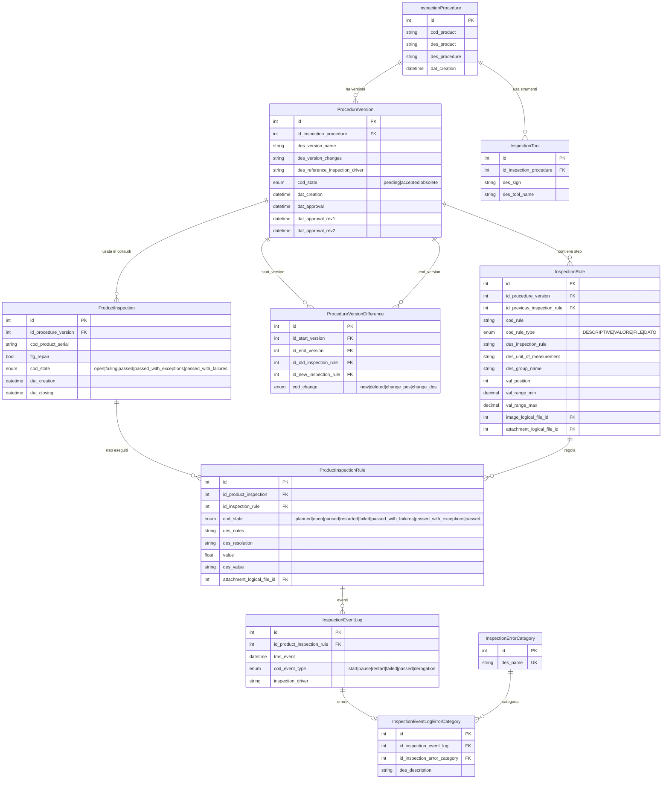

# IDS GeoRadar — Analisi Repository

## 1. Overview

**Applicazione**: Piattaforma di gestione del ciclo di validazione prodotto (collaudo) per IDS GeoRadar S.r.l.
**Cliente**: IDS GeoRadar S.r.l. (Ospedaletto, Pisa) — produttore di sistemi georadar
**Settore**: Manifatturiero / Strumentazione geotecnica
**Stato**: Produzione (v1.1.1)
**Descrizione**: Gestione completa di procedure di collaudo, esecuzione ispezioni su prodotti con tracciamento step-by-step, generazione report PDF (clienti e interni), dashboard analytics con KPI e trend mensili. Supporta anche prodotti Leica (template report dedicato).

## 2. Versioni

| Componente | Versione |
|---|---|
| App | 1.1.1 |
| laif-template | 5.6.0 |

## 3. Team

| Contributore | Commit |
|---|---|
| Pinnuz | 269 |
| mlife | 195 |
| Lorenzo Monni Sau | 157 |
| github-actions[bot] | 117 |
| Simone Brigante | 92 |
| bitbucket-pipelines | 86 |
| Marco Pinelli | 85 |
| Lorenzo T | 79 |
| neghilowio | 75 |
| cavenditti-laif | 50 |
| sadamicis | 49 |
| frabarb | 37 |
| Carlo A. Venditti | 31 |
| Daniele DN | 28 |
| lorenzoTonetta | 24 |
| Matteo Scalabrini | 21 |
| SimoneBriganteLaif | 20 |
| + altri | ~80 |

## 4. Data Model Custom

Tutte le tabelle custom sono nello schema `prs`.

### Tabelle custom

| Tabella | Descrizione |
|---|---|
| `inspection_procedures` | Procedure di collaudo per prodotto (cod_product, des_product) |
| `procedure_versions` | Versioni delle procedure con stato (pending/accepted/obsolete) e workflow di approvazione a 3 livelli (dat_approval, rev1, rev2) |
| `inspection_rules` | "Punti norma" — singoli step della procedura con tipo (DESCRIPTIVE/VALORE/FILE/DATO), range min/max, immagine, allegato |
| `procedure_version_differences` | Diff tra versioni di procedura (new/deleted/change_pos/change_des) |
| `inspection_tools` | Strumenti di collaudo associati a una procedura |
| `product_inspections` | Collaudi eseguiti su prodotti specifici (serial number), con stato (open/failing/passed/passed_with_exceptions/passed_with_failures), flag riparazione |
| `product_inspection_rules` | Singoli punti norma eseguiti in un collaudo, con stato, valore misurato, note, allegato |
| `inspection_event_logs` | Log eventi su ogni punto norma (start/pause/restart/failed/passed/derogation) con driver |
| `inspection_error_categories` | Categorie di errore (lookup table) |
| `inspection_event_log_error_categories` | Associazione 1:1 tra event log di errore e categoria errore con descrizione |

### Diagramma ER

## 5. API Routes Custom

| Prefisso | Controller | Endpoint notevoli |
|---|---|---|
| `/procedures` | CRUD + custom | `POST /{id}/clone`, `GET /detail/info`, `GET /detail/preview`, `POST /detail/versions/{id}/approve`, `POST /parse-excel` |
| `/product-inspections` | CRUD + custom | `POST /{id}/generate-customer-report`, `POST /{id}/generate-internal-report` |
| `/dashboard` | Custom | `GET /analytics` (KPI + trend + distribuzione categorie errore), `GET /distinct_product` |
| `/inspection-error-categories` | CRUD | Gestione categorie errore |
| `/inspection-event-logs` | CRUD | Log eventi collaudo |
| `/inspection-event-log-error-categories` | CRUD | Associazione errore-categoria |
| `/inspection-event-log-history` | Read | Storico eventi |
| `/inspection-tools` | CRUD | Strumenti di collaudo |
| `/procedure-versions` | CRUD | Versioni procedure |
| `/product-inspection-rules` | CRUD + custom | Punti norma collaudo |
| `/changelog` | Read | Changelog tecnico/cliente |

## 6. Business Logic Custom

### Excel Parser per Procedure
- **File**: `backend/src/app/procedures/excel_parser.py` + `excel_parsing_utils.py`
- Parsing di file Excel (.xlsx) contenenti definizioni di procedure di collaudo
- Riconoscimento automatico di: header "azione da eseguire", step numerati, gruppi, valori di riferimento (range min/max)
- Estrazione immagini embedded dal file Excel e upload su S3 come LogicalFile
- Upload concorrente immagini con semaforo (max 4 paralleli)
- Supporto sheet secondario "Strumenti" per parsing automatico strumenti di collaudo

### Generazione Report PDF
- **File**: `backend/src/app/product_inspections/reports/generator.py`
- Generazione PDF con WeasyPrint + Jinja2 templates HTML
- **3 template**: IDS GeoRadar (customer), Leica (customer), Report Interno
- Upload automatico su S3 con presigned URL (validita 1 ora)
- Template brandizzati con loghi e stili specifici per cliente

### Dashboard Analytics
- **File**: `backend/src/app/dashboard/service.py`
- KPI aggregati: totale collaudati, positivi, negativi, positivi con riserva, positivi con fallimenti
- Trend mensile con generate_series PostgreSQL
- Distribuzione categorie errore per mese (cross join categories x months)
- Filtri: periodo (6/12/24 mesi, all time), prodotto, riparazione/non riparazione
- Due modalita target: analytics per ispezioni o per singoli punti norma

### Workflow Versioning Procedure
- Stato versioni: pending -> accepted -> obsolete
- Approvazione a 3 livelli (dat_approval, rev1, rev2)
- Clonazione procedure
- Diff automatico tra versioni (new/deleted/change_pos/change_des)
- Column properties calcolate su InspectionProcedure per versione corrente (id, nome, stato, driver, conteggio step)

### Workflow Collaudo
- Macchina a stati per collaudo: open -> failing -> passed/passed_with_exceptions/passed_with_failures
- Macchina a stati per singolo punto norma: planned -> open -> paused -> restarted -> failed/passed/passed_with_failures/passed_with_exceptions
- Event log con tipo (start/pause/restart/failed/passed/derogation)
- Categorizzazione errori con lookup table
- Flag riparazione su collaudo

## 7. Integrazioni Esterne

| Integrazione | Tipo | Note |
|---|---|---|
| AWS S3 | Storage | Upload report PDF + immagini procedure, presigned URL |
| WeasyPrint | Libreria | Generazione PDF da template HTML/Jinja2 |
| openpyxl | Libreria | Parsing Excel procedure di collaudo |

Nessuna integrazione con API di terze parti esterne.

## 8. Pagine Frontend Custom

| Pagina | Descrizione |
|---|---|
| `/dashboard` | Dashboard analytics con KPI, grafici trend mensili, distribuzione categorie errore (amcharts5) |
| `/procedures` | Lista procedure di collaudo con tabella |
| `/procedures/detail/info` | Dettaglio procedura: info, versioni |
| `/procedures/detail/preview` | Preview procedura con step card, gestione gruppi, salvataggio versione, editing header |
| `/procedures/detail/changelog` | Changelog versioni con diff dialog |
| `/inspections` | Lista collaudi con tabella, barra fasi/progresso |
| `/inspections/detail/info` | Dettaglio collaudo: info card, riepilogo errori |
| `/inspections/detail/inspection` | Esecuzione collaudo step-by-step: card per step, navigazione, data entry (numerico/booleano/dato/immagine), dialog errore/risoluzione/deroga |
| `/inspections/detail/attachments` | Allegati collaudo |
| `/inspections/detail/history` | Storico eventi collaudo |
| `/changelog-customer` | Changelog cliente |
| `/changelog-technical` | Changelog tecnico |

### Widget frontend notevoli
- **Data entry polimorfo**: BooleanRuleEntry, NumberRuleEntry, DatoRuleEntry, ImageRuleEntry + varianti Override
- **PhaseStatus**: barra progressi fasi collaudo con tooltip
- **Report modals**: ExternalReportModal (IDS/Leica), InternalReportModal
- **Procedure editing**: GroupManagementDialog, EditPhaseDialog, SaveVersionDialog, DuplicateProcedureDialog
- **Dashboard widgets**: KPICards, MonthlyTrendChart, CollaudiDistributionChart, CategoryDistributionChart

## 9. Deviazioni dallo Stack Standard

| Deviazione | Dettaglio |
|---|---|
| WeasyPrint | Dipendenza opzionale per generazione PDF (richiede librerie di sistema: cairo, pango) |
| PyMuPDF | Dipendenza opzionale per manipolazione PDF |
| openpyxl | Parsing Excel per import procedure |
| xlsxwriter + pandas | Export Excel |
| amcharts5 | Libreria grafici frontend (al posto di chart.js o recharts) |

## 10. Pattern Notevoli

- **Column properties calcolate**: uso estensivo di `column_property` con subquery su `InspectionProcedure` per denormalizzare dati dalla versione corrente, evitando join ripetuti nelle query di lista
- **Excel parser robusto**: gestione immagini embedded con fallback (openpyxl images -> zip extraction), riconoscimento automatico header, step impliciti
- **Raw SQL per analytics**: query CTE con `generate_series` per trend mensili con riempimento mesi vuoti, cross join per distribuzione categorie
- **Report multi-template**: pattern factory per selezionare template HTML in base al tipo (IDS vs Leica)
- **Workflow a stati complesso**: doppia macchina a stati (collaudo + punto norma) con event sourcing tramite log eventi
- **Upload concorrente con semaforo**: pattern asyncio per limitare parallelismo upload immagini

## 11. Note e Debito Tecnico

- **Background task esempio**: `events.py` contiene un task di esempio commentato, nessun task schedulato reale
- **Ruolo custom minimo**: solo `MANAGER` aggiunto ai ruoli template, nessuna granularita RBAC specifica
- **40 migrazioni Alembic**: storia migratoria consistente
- **32 test backend, 11 test frontend**: copertura test moderata
- **Config app vuota**: `Settings` estende `TemplateSettings` senza aggiungere configurazioni custom
- **Raw SQL nel dashboard service**: query SQL raw lunghe per analytics, potenzialmente fragili se lo schema cambia
- **Nessun task asincrono attivo**: la generazione report PDF e sincrona nella request, potrebbe diventare un collo di bottiglia con report complessi
