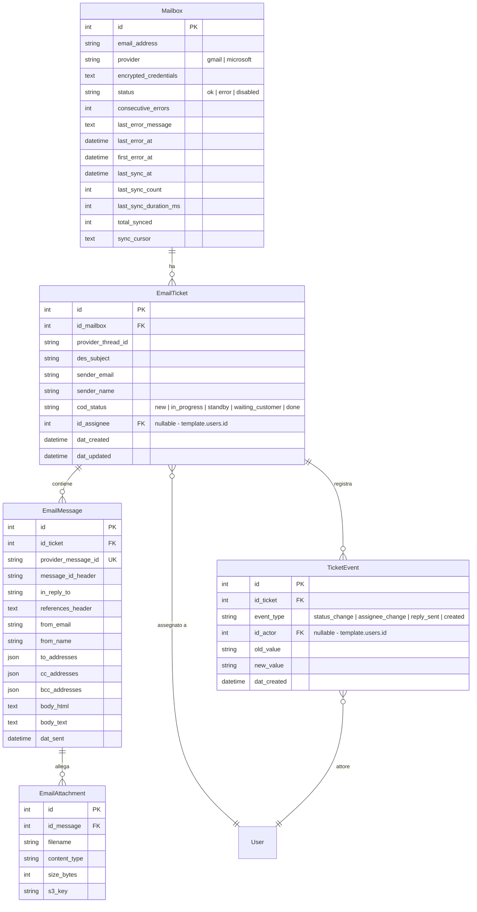

# Jubatus

> Piattaforma di Customer Care per la gestione centralizzata dei ticket email provenienti da caselle dedicate (eventi, concerti, supporto clienti).

**Repository**: `jubatus`
**Data analisi**: 2026-03-21
**Branch analizzato**: `feat/gsd-test` (branch con lo sviluppo custom attivo)

---

## 1. Overview

Jubatus e' una piattaforma costruita su laif-template che trasforma caselle email (Gmail, Microsoft 365) in un sistema di ticketing strutturato. Le email vengono sincronizzate automaticamente ogni 4 minuti, raggruppate in thread/ticket, e gestite da operatori con workflow di stato, assegnazione e risposta diretta dall'interfaccia.

**Nota**: la precedente analisi identificava jubatus come "il template stesso". Questo perche' il branch `develop` non contiene lavoro custom. Tutto lo sviluppo custom e' sul branch `feat/gsd-test` (e precedentemente su `feat/email-engine`).

**Industria**: Customer Care / Eventi e concerti
**Cliente**: da definire (probabilmente progetto interno o in fase di presales)

---

## 2. Versioni

| Componente | Versione |
|---|---|
| App version (`pyproject.toml`) | **0.1** |
| Template version | standard (migrazioni 00-22 template, 23-24 custom) |
| FastAPI | ~0.131.0 |
| SQLAlchemy | ~2.0.46 |
| Python | >=3.12, <3.13 |
| Node.js | >=25.0.0 |

---

## 3. Team (top contributors)

| Commits | Autore |
|---------|--------|
| 289 | Pinnuz |
| 202 | mlife |
| 163 | github-actions[bot] |
| 148 | Carlo A. Venditti |
| 148 | Michele Roberti |
| 141 | Simone Brigante |
| 86 | bitbucket-pipelines |
| 85 | Marco Pinelli |
| 84 | cavenditti-laif |
| 77 | neghilowio |
| 69 | Matteo Scalabrini |
| 62 | daniele |
| 57 | Gabriele Fogu |

**Totale autori unici**: ~45 (inclusi bot CI)
**Totale commit**: ~1995 (tutte le branch)

---

## 4. Data Model Custom

5 tabelle custom nello schema `prs`, create con 2 migrazioni Alembic (23 e 24):

**Vincoli notevoli**:
- `UniqueConstraint("id_mailbox", "provider_thread_id")` su `email_tickets` — dedup per thread provider
- `provider_message_id` unique su `email_messages` — dedup per messaggio
- FK verso `template.users` per assegnazione ticket e audit trail

---

## 5. API Custom

### Ticket Controller (`/api/tickets`)

| Metodo | Endpoint | Descrizione |
|--------|----------|-------------|
| GET | `/api/tickets/` | Lista ticket con paginazione server-side, filtri per status e assignee |
| GET | `/api/tickets/{id}` | Dettaglio ticket con thread email completo e audit trail |
| PATCH | `/api/tickets/{id}/status` | Aggiornamento stato (genera evento audit) |
| PATCH | `/api/tickets/{id}/assignee` | Assegnazione operatore (genera evento audit) |
| POST | `/api/tickets/{id}/reply` | Invio risposta email tramite provider (genera evento audit) |

### Mailbox Controller (`/api/mailboxes`) — solo admin

| Metodo | Endpoint | Descrizione |
|--------|----------|-------------|
| GET | `/api/mailboxes/` | Lista caselle con health monitoring |
| POST | `/api/mailboxes/` | Registrazione nuova casella email |
| POST | `/api/mailboxes/{id}/sync` | Trigger sincronizzazione manuale |
| PATCH | `/api/mailboxes/{id}/enable` | Riabilitazione casella disabilitata |

### Changelog Controller (`/changelog`)

| Metodo | Endpoint | Descrizione |
|--------|----------|-------------|
| GET | `/changelog/` | Contenuto changelog (tipo: tech/customer, target: template/app) |

---

## 6. Business Logic Custom

### 6.1 Email Sync Engine (cuore del sistema)

**Architettura**: task background `repeat_every(seconds=240)` registrato su startup FastAPI. Sincronizza tutte le caselle attive ogni 4 minuti.

**Flusso di sincronizzazione**:
1. Iterazione su tutte le mailbox con `status != "disabled"`
2. Decrypt credenziali con Fernet (chiave da env `EMAIL_CREDENTIALS_KEY`)
3. Autenticazione con il provider (Gmail API / Microsoft Graph)
4. Fetch messaggi con cursor incrementale (delta sync)
5. Raggruppamento per thread (via `provider_thread_id`)
6. Upsert con dedup (`ON CONFLICT DO NOTHING` su `provider_message_id`)
7. Upload allegati su S3 (MinIO in dev)
8. Auto-reopen: se arriva messaggio su ticket con status `done`, il ticket viene riaperto
9. Health tracking: contatore errori consecutivi, auto-disable dopo 5 errori
10. Notifica admin (via sistema notifiche template) quando una casella viene disabilitata

**Lock**: `asyncio.Lock()` per prevenire sync concorrenti.

### 6.2 Provider Adapters (Strategy Pattern)

**Base astratta** `EmailProvider` con interfaccia:
- `authenticate(credentials)` — validazione e refresh token
- `fetch_messages(cursor, since_days)` — fetch incrementale
- `download_attachment(message_id, attachment_id)` — download allegato binario
- `send_reply(to, subject, body_html, thread_id, ...)` — invio risposta in-thread

**GmailProvider**:
- `google-api-python-client` + `google-auth-oauthlib`
- OAuth2 con refresh token automatico
- Sync via History API (delta) quando c'e' un cursor, oppure query con filtro temporale per la prima sync
- Parsing MIME completo (multipart, allegati, inline)
- Chiamate sync wrappate in `asyncio.to_thread` (la libreria Google e' sincrona)
- Normalizzazione subject (strip Re:/Fwd:/Fw:)

**MicrosoftProvider**:
- `msal` per autenticazione confidential client
- `httpx` async per Microsoft Graph API v1.0
- Delta sync via `messages/delta` endpoint con paginazione
- Retry con backoff per throttling (HTTP 429)

### 6.3 Ticket Lifecycle

**Stati**: `new` → `in_progress` → `standby` | `waiting_customer` → `done`

**Audit trail completo**: ogni cambio stato, assegnazione e risposta genera un `TicketEvent` con:
- tipo evento (`status_change`, `assignee_change`, `reply_sent`, `created`)
- vecchio e nuovo valore
- attore (FK a `template.users`)
- timestamp

**Auto-reopen**: nuova email su ticket chiuso → riapre automaticamente il ticket.

### 6.4 Credenziali Crittografate

Le credenziali OAuth delle caselle sono cifrate con Fernet. Decrypt solo al momento della sync. Chiave da variabile d'ambiente.

---

## 7. Integrazioni Esterne

| Integrazione | Libreria | Uso |
|---|---|---|
| **Gmail API** | `google-api-python-client`, `google-auth-oauthlib` | Sync email, invio risposte, download allegati |
| **Microsoft Graph API** | `msal`, `httpx` | Sync email, invio risposte, download allegati |
| **S3 / MinIO** | `boto3` (via template) | Storage allegati email |
| **Fernet** | `cryptography` (implicita) | Cifratura credenziali caselle email |

---

## 8. Pagine Frontend Custom

### Navigazione

- **Home page default**: `/tickets` (lista ticket)
- **Pagine nascoste dal menu**: File Management (non serve a jubatus)
- **Tema default**: dark

### Componenti custom (12 file TSX, ~1.500 LOC)

| Componente | Descrizione |
|---|---|
| `TicketList` | DataTable con paginazione server-side, filtri status/assignee, badge colorati per stato, warning banner caselle |
| `TicketDetail` | Dettaglio ticket con dropdown status/assignee, thread email interleaved con eventi audit |
| `EmailThread` | Timeline unificata: messaggi email + eventi audit ordinati cronologicamente |
| `EmailBody` | Rendering sicuro HTML email con DOMPurify (whitelist tag rigorosa, blacklist script/iframe/form) |
| `ReplyComposer` | Editor rich text con Draft.js (bold, italic, underline, liste puntate/numerate) + invio risposta |
| `AuditEventEntry` | Singolo evento audit con icona contestuale, descrizione localizzata e timestamp |
| `LastSyncBadge` | Badge nell'header template che mostra tempo trascorso dall'ultima sincronizzazione |
| `MailboxHealthTable` | Tabella admin: stato caselle, errori consecutivi, ultima sync, azioni (sync manuale, riabilita) |
| `MailboxWarningBanner` | Banner giallo nella lista ticket quando caselle in errore/disabilitate (silenzioso per non-admin) |

### Pagine Settings custom

- `/settings/mailboxes/` — pagina admin per monitoraggio e gestione caselle email

### Feature frontend changelog (app-specific)

Sotto `src/features/changelog/`: visualizzazione changelog con selettore tipo (tech/customer) e target (template/app), rendering markdown, componenti per breaking changes.

---

## 9. Stack e Deviazioni dal Template

### Dipendenze backend aggiuntive

| Pacchetto | Versione | Uso |
|---|---|---|
| `google-api-python-client` | >=2.192.0 | Gmail API |
| `google-auth-oauthlib` | >=1.3.0 | OAuth2 Gmail |
| `msal` | >=1.35.1 | Microsoft authentication |

### Dipendenze frontend aggiuntive

| Pacchetto | Uso |
|---|---|
| `draft-js` + `@draft-js-plugins/editor` + `@draft-js-plugins/mention` | Editor rich text per risposte email |
| `draft-js-export-html` | Conversione stato editor in HTML |
| `dompurify` + `@types/dompurify` | Sanitizzazione HTML email ricevute |

### Ruoli custom

- `manager` — ruolo app-specific definito in `role.py` (oltre ai ruoli template `admin`, `admin-laif`, `user`)
- I controller mailbox verificano `role.startswith("admin")` per le operazioni admin

---

## 10. Pattern Notevoli

1. **Strategy Pattern per provider email**: interfaccia astratta `EmailProvider` con implementazioni Gmail e Microsoft, selezionata dinamicamente dal campo `provider` della mailbox. Facile estensione per nuovi provider.

2. **Delta sync con cursor**: sincronizzazione incrementale via History API (Gmail) / delta endpoint (Microsoft), con fallback a query temporale per la prima sync. Il cursor viene salvato sulla riga `Mailbox`.

3. **Health monitoring con auto-disable**: contatore errori consecutivi sulla mailbox, auto-disabilitazione dopo `MAX_CONSECUTIVE_ERRORS = 5`, notifica admin via sistema notifiche template, possibilita' di riabilitazione manuale.

4. **Dedup a due livelli**: `ON CONFLICT DO NOTHING` su thread ID per ticket + unique constraint su `provider_message_id` per messaggi. Previene duplicati anche in caso di re-sync.

5. **Timeline interleaved**: il frontend unisce messaggi email e eventi audit in un'unica timeline cronologica, con rendering differenziato per tipo.

6. **Sicurezza rendering email**: DOMPurify con whitelist tag esplicita per rendering HTML email ricevute. Nessun script, iframe, form, o event handler permesso.

7. **Service pattern (non CRUDService)**: i service custom (`TicketService`, `MailboxService`) non estendono il `CRUDService` generico del template — scelta consapevole documentata nel codice ("per Research anti-patterns").

---

## 11. Dimensioni Codice Custom

| Area | File | LOC approssimative |
|---|---|---|
| Backend custom (`app/`) | 22 file .py | ~2.100 |
| Frontend custom (componenti + features) | ~25 file .tsx/.ts | ~1.500+ |
| Test custom | 5 file .py | ~500 (stima) |
| Migrazioni custom | 2 file | ~130 |
| **Totale codice custom** | **~54 file** | **~4.200+** |

---

## 12. Test Custom

| File test | Copertura |
|---|---|
| `test_email_sync.py` | Integrazione sync orchestrator |
| `test_gmail_provider.py` | Unit test provider Gmail |
| `test_microsoft_provider.py` | Unit test provider Microsoft |
| `test_mailbox_health.py` | Health monitoring, auto-disable, errori consecutivi |
| `test_ticket_workflow.py` | Lifecycle ticket: status, assignee, reply, eventi audit |

---

## 13. Tech Debt e Note

1. **Lock non distribuito**: `asyncio.Lock()` funziona solo in single-instance. Se il backend scala orizzontalmente serve un lock distribuito (Redis, pg advisory lock).

2. **Modulo `email/` legacy vuoto**: `backend/src/app/email/` contiene solo sottocartelle con `__pycache__` — sembra un tentativo precedente rimpiazzato da `email_sync/`. Da rimuovere.

3. **Rotazione chiavi cifratura**: la chiave Fernet per le credenziali e' in variabile d'ambiente senza meccanismo di rotazione implementato.

4. **Draft.js deprecated**: Draft.js e' in maintenance mode (Meta l'ha deprecato). Per il futuro considerare Tiptap, Lexical, o Plate.

5. **Ruolo `manager` non utilizzato**: definito in `role.py` ma nessun controller lo verifica. I controller verificano solo `admin*`. Potrebbe servire per autorizzazioni piu' granulari future.

6. **Schema `Mailbox` inconsistente**: il model Python `Mailbox` non dichiara `__table_args__ = {"schema": "prs"}` esplicitamente (usa il default di `LaifBase`), mentre gli altri modelli lo dichiarano. La migrazione crea correttamente in `prs`, ma potrebbe generare confusione.

7. **Duplicate `httpx` + `requests`**: il `pyproject.toml` riporta il TODO "maybe only use one?" — da consolidare.

8. **Branch strategy**: tutto lo sviluppo custom e' su `feat/gsd-test`, non su `develop`. Prima del merge in develop servira' review/cleanup.

9. **Nome repo**: "jubatus" non e' collegato al dominio "customer care per eventi" — potrebbe creare confusione onboarding.

10. **App version 0.1**: il progetto e' in fase iniziale di sviluppo. Il modello dati e le API sono stabili ma il frontend ha UI hardcoded (label in italiano nel codice, non i18n).
