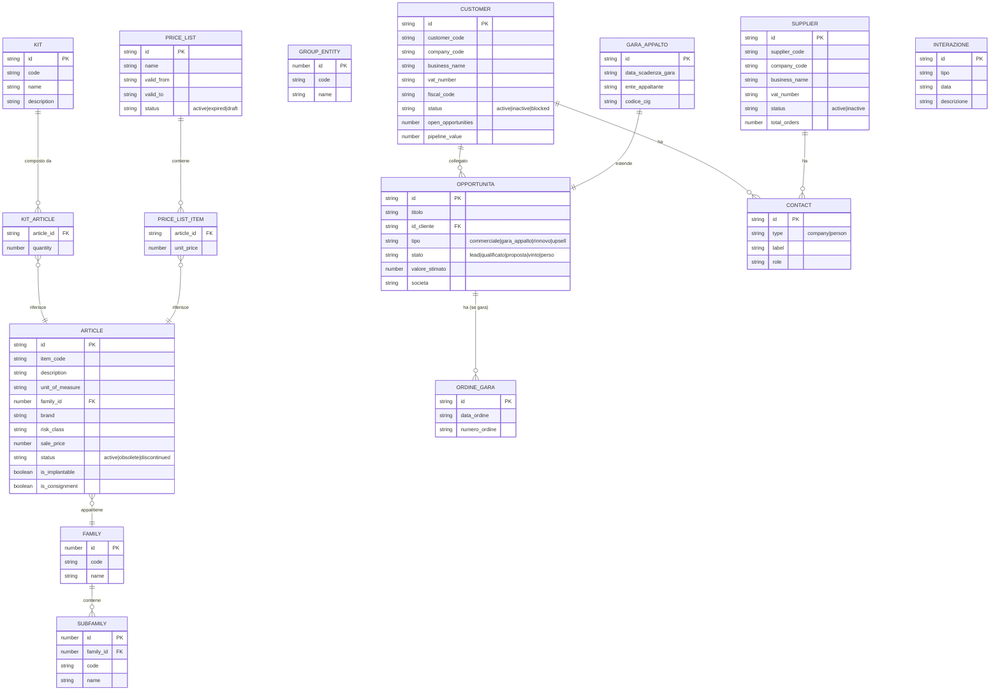

# Lamonea -- Censimento Repository

## 1. Overview

**Lamonea** e' una piattaforma ERP/CRM per **Lamonea Group**, distributore di dispositivi medici con tre societa operative:
- **Lamonea SRL** (ditta 49)
- **Lamonea Endosurgery** (ditta 133)
- **Lamonea Medical** (ditta 212)

Il progetto integra il gestionale **TeamSystem (TS Azienda)** per importare anagrafiche clienti, fornitori e articoli tramite API async (EVWSASYNC). Il frontend e' un mockup funzionale avanzato con dati statici (~32k righe di mock data) per CRM, gestione prodotti, catalogo e dashboard.

**Cliente**: Lamonea Group
**Settore**: Distribuzione dispositivi medici / ERP-CRM
**Stato**: Fase mockup/review avanzata (branch `feat/mockup-review`). Backend con integrazione TeamSystem funzionante per import dati raw. Frontend interamente basato su dati mock (nessun collegamento backend per le entita di dominio). Nessuna migrazione DB custom (solo migrazioni template). Nessun modello SQLAlchemy custom.

---

## 2. Versioni

| Componente | Versione |
|---|---|
| App | `0.1.1` |
| laif-template | `5.6.1` |
| Node.js | `>=24.0.0` |
| Python | `>=3.12, <3.13` |
| Next.js | `16.1.1` |
| laif-ds | `0.2.67` |

---

## 3. Team

| Commits | Contributor |
|---|---|
| 269 | Pinnuz |
| 197 | mlife |
| 103 | github-actions[bot] |
| 93 | Simone Brigante |
| 86 | bitbucket-pipelines |
| 85 | Marco Pinelli |
| 75 | neghilowio |
| 53 | cavenditti-laif |
| 49 | sadamicis |
| 40 | Carlo A. Venditti |
| 28 | Daniele DN |
| 23 | Luca Stendardo |
| 23 | lorenzoTonetta |
| 21 | Matteo Scalabrini |
| 20 | SimoneBriganteLaif |
| 18 | angelolongano |
| 17 | Marco Vita |
| 11 | Federico Frasca |
| + altri (~40 contributori totali) |

---

## 4. Modello dati CUSTOM

**Nessuna tabella custom in DB.** Le 22 migrazioni Alembic sono tutte del template (gestione utenti, conversation/AI, ticket, file, notifiche). Il file `models.py` importa solo config, `enums.py` e' vuoto. Non esistono modelli SQLAlchemy custom.

Tutto il dominio (clienti, fornitori, articoli, opportunita, gare, interazioni, kit, listini) e' attualmente rappresentato solo come:
- **Backend**: schema Pydantic per risposte TeamSystem (dati passthrough, nessuna persistenza locale)
- **Frontend**: type TypeScript + dati mock statici (~32k righe in `staticData.ts`)

### Entita di dominio (solo frontend, non persistite)

---

## 5. API routes CUSTOM

### TeamSystem Integration (backend funzionante, no auth)

| Metodo | Route | Descrizione |
|---|---|---|
| `POST` | `/team-system/articles/import` | Import articoli da tutte le ditta (49, 133, 212) |
| `POST` | `/team-system/articles/import/{ditta_id}` | Import articoli da una ditta specifica |
| `GET` | `/team-system/articles/batch/{uuid}` | Check/poll stato batch articoli |
| `POST` | `/team-system/customers/import` | Import clienti da tutte le ditta |
| `POST` | `/team-system/customers/import/{ditta_id}` | Import clienti da una ditta specifica |
| `GET` | `/team-system/customers/batch/{uuid}` | Check/poll stato batch clienti |
| `POST` | `/team-system/suppliers/import` | Import fornitori da tutte le ditta |
| `POST` | `/team-system/suppliers/import/{ditta_id}` | Import fornitori da una ditta specifica |
| `GET` | `/team-system/suppliers/batch/{uuid}` | Check/poll stato batch fornitori |

### Changelog (backend custom)

| Metodo | Route | Descrizione |
|---|---|---|
| `GET` | `/changelog/` | Recupera changelog (tech/customer, template/app) da file .md |

**Nota**: tutte le API TeamSystem sono **demo endpoints senza autenticazione**. I dati importati non vengono persistiti in DB ma restituiti direttamente al chiamante (passthrough).

---

## 6. Business logic CUSTOM

### 6.1 Integrazione TeamSystem

Architettura a 3 livelli ben strutturata:

1. **`TeamSystemClient`** (singleton, `backend/src/app/team_system/client.py`) -- client HTTP asincrono verso `lamonea.teamsystem.io`
   - `request_entity()`: invio richiesta EVWSASYNC, riceve UUID
   - `poll_batch_response()`: polling con timeout configurabile (default 120s, intervallo 5s)
   - `get_batch_response()`: check singolo non-bloccante
   - Gestione status: `finished`, `ok`, `cancelled`, `crashed`, `PENDING`, `TIMEOUT`

2. **`service.py`** (orchestrazione, `backend/src/app/team_system/service.py`) -- logica di import
   - `trigger_import_for_ditta()`: fire-and-forget per una ditta
   - `import_and_poll_ditta()`: trigger + polling end-to-end
   - `import_and_poll_all()`: import parallelo via `asyncio.gather` per tutte le ditta
   - `_truncate_data()`: limita i record restituiti (protezione Swagger UI, risposte 5-10 MB)
   - `_find_records_list()`: parsing flessibile della risposta TeamSystem (formato variabile per servizio)

3. **Entity modules** (articles, customers, suppliers) -- payload builders specifici per CodiceWS
   - **Articoli**: `CodiceWS 500012`, filtri `M-DESCRIZIONE <> 0`, `M-CODMAG <> 0`
   - **Clienti**: `CodiceWS 500011`, filtro `CF-TIPO = 1` (tipo cliente)
   - **Fornitori**: `CodiceWS 500011`, filtro `CF-TIPO = 2` (tipo fornitore)
   - Supporto import incrementale via `variazioni_data` / `variazioni_ora` (formato `YYYYMMDD` / `HHMM`)

### 6.2 CRM (solo frontend mock, Redux state management)

- **Gestione opportunita**: CRUD completo con pipeline Kanban (stati: lead -> qualificato -> proposta -> vinto/perso)
- **Gare d'appalto**: estensione di Opportunita con date copertura, ente appaltante, codice CIG, gestione ordini collegati
- **Interazioni**: timeline di interazioni con clienti (chiamata, email, visita, nota)
- **Carrello**: sistema carrello per ordini con gestione quantita e prezzi unitari

### 6.3 Gestione Prodotti (solo frontend mock)

- **Articoli**: schede prodotto dettagliate con 6 tab (info generali, packaging, commerciale, supply/logistics, gallery, documenti). Campi specifici settore medicale: `is_implantable`, `is_consignment`, `needs_certification`, `risk_class`, `barcode_udi_di`
- **Famiglie/Sottofamiglie e Gruppi/Sottogruppi**: classificazione gerarchica a due livelli
- **Kit**: composizione di articoli multipli con packaging dedicato (primario/secondario/terziario)
- **Listini prezzi**: gestione listini con date validita, associazione articoli e clienti

### 6.4 Multi-societa (filtro globale)

- Redux slice `societaSlice` con mapping `ditta -> societa` (`49=srl, 133=endosurgery, 212=medical`)
- Componente `CompanySelector` nell'header di tutte le pagine app
- Filtro propagato a tutte le viste (CRM, prodotti, catalogo, dashboard)

---

## 7. Integrazioni esterne

| Integrazione | Stato | Dettagli |
|---|---|---|
| **TeamSystem (TS Azienda)** | Funzionante (passthrough) | API EVWSASYNC per import articoli (500012), clienti/fornitori (500011). Auth via Bearer token (API key env var). Base URL: `lamonea.teamsystem.io`. 3 ditta configurate. |
| TeamSystem docs | Documentazione | `docs/from_client/`: guida chiamate API (331 righe), Postman collections SYNC/ASYNC, struttura DB, anagrafica articolo, CSV di esempio |

---

## 8. Frontend CUSTOM

### Pagine applicative (~44 pagine custom sotto `(authenticated)/(app)/`)

| Area | Pagine | Descrizione |
|---|---|---|
| **Dashboard** | 1 | KPI cards, pipeline chart, attivita recenti, follow-up |
| **CRM - Clienti** | 5 (lista + 4 tab detail) | Info generali, contatti, commerciale, fiscale |
| **CRM - Fornitori** | 5 (lista + 4 tab detail) | Stessa struttura clienti |
| **CRM - Opportunita** | 4 | Pipeline Kanban, lista, detail opportunita |
| **CRM - Gare d'Appalto** | 2 | Lista gare, detail con ordini e avanzamento |
| **CRM - Interazioni** | 1 | Timeline interazioni con modale creazione |
| **Product Mgmt - Articoli** | 7 (lista + 6 tab detail) | Info, packaging, commerciale, supply/logistics, gallery, documenti |
| **Product Mgmt - Famiglie/Gruppi** | 2 | Tab famiglie, tab gruppi |
| **Product Mgmt - Kit** | 4 (lista + 3 tab detail) | Info, composizione, packaging |
| **Product Mgmt - Listini** | 4 (lista + 3 tab detail) | Info, items, clienti associati |
| **Catalogo** | 4 (2 versioni IT + EN) | Grid/table view, detail prodotto, carrello |
| **Changelog** | 2 | Customer + technical changelog |

### Componenti custom significativi (~100 file .tsx/.ts in `src/`)

| Componente | Funzione |
|---|---|
| `CompanySelector` | Selettore multi-societa nell'header |
| `PipelineKanban` | Board Kanban drag-ready per opportunita |
| `InterazioneTimeline` / `InterazioneModal` | Timeline + creazione interazioni CRM |
| `CartPanel` / `CarrelloPanel` | Pannello carrello ordini |
| `SocietaSelector` | Filtro societa condiviso |
| `ContactCard` / `ContactModal` | Gestione contatti aziendali |
| `OpportunitaModal` / `OpportunitaDetail` | CRUD opportunita |
| `GaraAppaltoDetail` / `AvanzamentoGara` | Gestione gare con avanzamento |
| `RegistraOrdineModal` / `AggiungProdottoModal` | Ordini da gara, aggiunta prodotti |
| `ArticlesTable` / `CreateArticleModal` | Lista articoli con creazione |
| `ArticleDetail*` (6 widget) | Tab detail articolo |
| `KitDetail*` (3 widget) | Tab detail kit |
| `PriceListDetail*` (3 widget) | Tab detail listino |
| `ImportMassivoModal` | Import massivo prodotti catalogo |

### Redux Store custom

| Slice | Responsabilita |
|---|---|
| `crmSlice` | Opportunita, gare d'appalto, ordini gara, interazioni (CRUD completo con ID auto-generati) |
| `carrelloSlice` | Carrello ordini (add/remove/update quantita e prezzo) |
| `societaSlice` | Selezione societa attiva (filtro globale multi-societa) |

### API layer frontend

- **React Query** hooks per customers e suppliers (`useCustomers`, `useCustomer`, `useUpdateCustomer`)
- **TanStack Query** con `staleTime: Infinity` e dati iniziali statici (nessuna fetch reale)
- **Mutations client-side only**: aggiornano solo la query cache, senza chiamate server
- API layer pronto per essere collegato al backend (`customerApi.ts`, `supplierApi.ts`, `articleApi.ts`, `kitApi.ts`, `priceListApi.ts`, `familyGroupApi.ts`)

---

## 9. Deviazioni dallo stack

| Aspetto | Standard template | Lamonea |
|---|---|---|
| Conversation/Chat AI | Attiva nel menu | Commentata, disabilitata nel menu |
| File management | Attivo nel menu | Nascosto dal menu (`isHiddenFromMenu: true`) |
| Custom role | Nessuno | `AppRoles.MANAGER` aggiunto |
| Home page default | `/profile/` | `/dashboard/` |
| Theme default | light | `dark` |
| Custom email style | Standard | Template custom in `docs/troisi/custom_email_style.md` |
| Background tasks | Nessuno | Scaffold per `repeat_every` (commentato, non attivo) |
| Config custom | Nessuna | `team_system_base_url`, `team_system_ditta_ids` |

---

## 10. Pattern notevoli

### Async Integration Client (TeamSystem)

Pattern gia estratto in KB come `async-integration-client-poller`. Implementazione completa:
- **Client singleton** via `__new__` override
- **PayloadBuilder pattern**: `Callable[[str], dict]` via `functools.partial` per separare parametri entita da codice ditta
- **Parallel polling**: `asyncio.gather` per import simultaneo di tutte le ditta
- **Truncation layer**: protezione Swagger UI da risposte 5-10 MB
- **Response normalization**: `_find_records_list()` gestisce formati risposta variabili (`TabellaDati`, lista diretta, fallback su lista piu grande)
- **Graceful error handling**: ogni ditta restituisce il proprio stato (mai eccezioni su `asyncio.gather`)

### Multi-company filter

Filtro globale per societa con mapping bidirezionale codice ditta TeamSystem <-> etichetta frontend, propagato via Redux store a tutte le viste.

### Mockup-first development

Sviluppo frontend completo e interattivo con dati mock statici prima del backend:
- ~32k righe di dati mock realistici (clienti ospedalieri, dispositivi medici, gare d'appalto)
- CRUD completo su Redux store con ID auto-generati
- Pronto per sostituzione con chiamate API reali (layer API gia strutturato)
- Duplicazione pagine IT/EN come esplorazione UX (`catalogo/` vs `catalog/`, `clienti/` vs `customers/`)

---

## 11. Tech debt e note

### Criticita

1. **Nessun modello DB custom**: tutto il dominio (clienti, fornitori, articoli, opportunita, kit, listini, interazioni, contatti) esiste solo come mock frontend e tipi TypeScript. Servira creare ~15-20 tabelle per la persistenza reale.

2. **API TeamSystem senza auth**: tutti gli endpoint `/team-system/*` sono demo senza autenticazione (`SecurityScope` non applicato). Da proteggere prima del deploy.

3. **Dati TeamSystem non persistiti**: l'import da TeamSystem restituisce i dati raw al chiamante ma non li salva in DB. Servira:
   - Tabelle di staging per dati importati
   - Job ETL periodici (lo scaffold `repeat_every` in `events.py` esiste gia)
   - Logica di merge/reconciliation tra dati TeamSystem e dati locali

4. **Duplicazione pagine IT/EN**: esistono versioni parallele di alcune pagine (`catalogo/` vs `catalog/`, `clienti/` vs `customers/`, `fornitori/` vs `suppliers/`). Andranno consolidate scegliendo una convenzione e usando i18n.

5. **File mock molto grandi**: `staticData.ts` CRM (~22k righe) + Product Management (~10k righe) = ~32k righe di dati hardcoded. Andranno sostituite con chiamate API reali.

6. **Frontend disconnesso dal backend**: le query usano `staleTime: Infinity` con dati iniziali statici. Le mutations aggiornano solo la cache locale. Da riscrivere quando il backend CRM/prodotti sara pronto.

7. **Nomi duplicati nei contributori**: diversi alias per stessi sviluppatori (es. `mlife`/`mlaif`, `Daniele DN`/`Daniele DalleN`/`daniele`).

### Prossimi passi (inferiti dalla struttura)

1. Creare modelli SQLAlchemy per le entita di dominio nel schema `prs`
2. Implementare ETL TeamSystem -> DB locale con job periodici
3. Creare API CRUD backend per clienti, fornitori, articoli, opportunita
4. Collegare il layer API frontend al backend reale
5. Consolidare le pagine duplicate IT/EN
6. Aggiungere `SecurityScope` alle API TeamSystem
