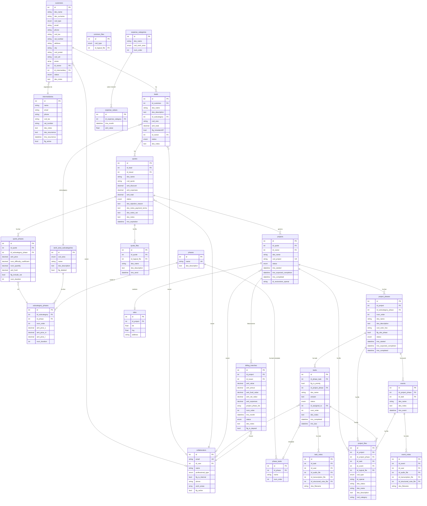

# Manfredi - Analisi Completa Repository

## 1. Overview

**Applicazione**: Gestionale Studio Manfredi - sistema per la gestione di uno studio di progettazione tecnica (architettura, termotecnica, legionella, project management, design).

**Cliente**: Studio Manfredi (Per. Ind. Enrico Manfredi / ARCH Studio 45) - studio professionale con sede a Castelfranco Emilia (MO) e Vignola (MO).

**Industria**: Servizi professionali / Progettazione tecnica e impiantistica.

**Funzionalita principali**:
- CRM completo (clienti, intermediari, lead, preventivi)
- Gestione progetti/commesse con fasi, task, eventi
- Generazione PDF preventivi con template branded (WeasyPrint + Jinja2)
- Fatturazione a tranche
- Registrazioni audio con trascrizione AI e note strutturate (OpenAI)
- RAG per documenti di progetto (OpenAI Vector Store)
- Agente AI custom con tool per search/create/update su tutti i dati applicativi
- Mappa cantieri (MapLibre)
- Gestione spese per categoria
- Changelog tecnico e cliente
- Invio email preventivi

---

## 2. Versioni

| Componente | Versione |
|---|---|
| App (`version.txt`) | 1.0.1 |
| App (`values.yaml`) | 1.1.0 |
| laif-template (`version.laif-template.txt`) | **5.6.4** |
| laif-ds (frontend) | ^0.2.73 |
| Python | >=3.12, <3.13 |
| Node.js | >=25.0.0 |
| Next.js | ^16.1.6 |
| React | ^19.2.4 |
| FastAPI | ^0.131.0 |
| SQLAlchemy | ~2.0.46 |
| cod_application | 2025084 |

---

## 3. Team (Contributors)

| # Commits | Autore |
|---|---|
| 269 | Pinnuz |
| 212 | Michele Roberti |
| 195 | mlife |
| 166 | github-actions[bot] |
| 92 | Simone Brigante |
| 87 | Carlo A. Venditti |
| 86 | bitbucket-pipelines |
| 85 | Marco Pinelli |
| 75 | neghilowio |
| 73 | Gabriele Fogu |
| 59 | cavenditti-laif |
| 49 | sadamicis |
| 28 | Daniele DN |
| 25 | matteeeeeee |
| 23 | lorenzoTonetta |

---

## 4. Stack & Dipendenze Non-Standard

### Backend (Python)

Dipendenze standard template:
- FastAPI, SQLAlchemy, Alembic, Pydantic v2, Uvicorn, boto3, bcrypt/passlib, python-jose, httpx, requests

**Dipendenze NON-standard / specifiche del progetto**:
| Dipendenza | Uso |
|---|---|
| `openai ~=2.14.0` | Trascrizione audio, LLM per note strutturate, Vector Store RAG |
| `pgvector ~=0.4.2` | Embedding vettoriali in PostgreSQL |
| `python-docx ~=1.2.0` | Generazione documenti Word |
| `PyMuPDF ~=1.26.7` | Manipolazione PDF (merge privacy + preventivo) |
| `weasyprint ~=63.1` | Generazione PDF preventivi da HTML/Jinja2 |
| `xlsxwriter ~=3.2.9` | Export Excel |
| `pandas ~=3.0.1` | Elaborazione dati tabellari |
| `aiohttp ~=3.13.3` | Client HTTP asincrono |

### Frontend (Next.js)

**Dipendenze NON-standard / specifiche del progetto**:
| Dipendenza | Uso |
|---|---|
| `@amcharts/amcharts5` | Grafici/chart avanzati (economics) |
| `draft-js` + plugins | Editor rich text con menzioni |
| `@hello-pangea/dnd` | Drag & drop (task board) |
| `maplibre-gl` + `react-map-gl` | Mappa cantieri geolocalizzati |
| `@microsoft/fetch-event-source` | SSE per streaming AI |
| `katex` + `rehype-katex` + `remark-math` | Rendering formule matematiche |
| `react-markdown` + `react-syntax-highlighter` | Rendering markdown (risposte AI) |
| `framer-motion` | Animazioni UI |
| `@ducanh2912/next-pwa` | Progressive Web App |

### Docker Compose

Servizi: `db` (PostgreSQL con Dockerfile custom in `db/`), `backend` (FastAPI). Nessun servizio extra (Redis, Celery, ecc.).

Variante `docker-compose.wolico.yaml` per test integrazione con progetto Wolico (shared network).

---

## 5. Modello Dati Completo

Schema PostgreSQL: `prs` (dati applicativi), `template` (dati laif-template).

### Tabelle Applicative (schema `prs`)

| Tabella | Descrizione | Colonne principali |
|---|---|---|
| `collaborators` | Collaboratori/professionisti dello studio | id, email, id_user (FK template.users), name, professional_type, flg_is_internal, phone, work_areas (ARRAY), flg_active |
| `work_area_subcategories` | Sottocategorie per area di lavoro | id, cod_area (WorkArea enum), name, des_description, flg_deleted |
| `phases` | Anagrafica fasi (master data) | id, name (unique), des_description |
| `subcategory_phases` | Associazione subcategory-fase con prezzi per taglia | id, id_subcategory, id_phase, num_order, amt_price_s/m/l (Decimal), num_duration |
| `phase_tasks` | Task master di fase (template) | id, id_phase, name, num_order |
| `customers` | Clienti | id, des_name, des_surname, cod_type (Privato/Impresa/PA), email, phone, cod_tax, vat_number, address, city, cod_postal, cod_country, cod_sdi, areas (ARRAY), id_owner, id_intermediary, status, des_notes |
| `intermediaries` | Intermediari/segnalatori | id, name, email, phone, cod_tax, vat_number, address, city, des_notes, des_recurrence, tms_recurrence, flg_active |
| `leads` | Lead/opportunita commerciali | id, id_customer, des_name, des_description, id_subcategory, cod_size, amt_total, flg_includesVAT, id_owner, status, des_notes |
| `quotes` | Preventivi | id, id_lead, id_issuer, des_name, cod_quote, amt_discount, amt_expenses, des_notes_expenses, amt_total, status, des_rejection_reason, des_notes_payment_terms, des_notes_vat, des_notes, tms_expiration |
| `quote_phases` | Fasi del preventivo | id, id_quote (CASCADE), id_subcategory_phase, amt_price, num_difficulty_coefficient, num_quantity, amt_fund, flg_include_vat, num_duration |
| `quote_files` | File PDF associati ai preventivi | id, id_quote (CASCADE), id_logical_file, des_name, des_description, tms_send |
| `projects` | Progetti/commesse | id, id_quote, id_owner, des_name, cod_project (unique), status, tms_started, tms_expected_completion, tms_completed, id_vectorstore_openai |
| `project_phases` | Fasi del progetto | id, id_project, id_subcategory_phase, num_order, des_name, des_description, cod_color_hex, flg_site_phase, status, tms_started/expected/completed |
| `tasks` | Task operativi | id, id_phase_task, flg_is_priority, id_project_phase, des_name, answer, status, id_assigned_to, num_order, des_notes, tms_completed, tms_due |
| `events` | Eventi di fase progetto | id, id_project_phase, id_task, des_name, des_notes, tms_event |
| `task_notes` | Note audio su task | id, id_task, id_user, id_audio_file, id_transcription_file, id_structured_note_file, des_filename |
| `event_notes` | Note audio su eventi | id, id_event, id_user, id_audio_file, id_transcription_file, id_structured_note_file, des_filename |
| `billing_tranches` | Tranche fatturazione | id, id_project, id_issuer, amt_value, amt_amout, amt_fund_value, amt_vat_value, amt_expenses, project_phase_ids (ARRAY INT), num_order, tms_month, status, des_notes, flg_is_deposit |
| `project_files` | File progetto con integrazione OpenAI Vector Store | id, id_project, id_project_phase, id_task, id_event, id_logical_file, cod_type (input/output/ia), id_openai, des_status, des_name, des_description, cod_category |
| `common_files` | File comuni riusabili (privacy, lettera incarico) | id, cod_type (CommonFileType enum), id_logical_file |
| `expense_categories` | Categorie spese | id, des_name, cod_work_area, num_order |
| `expense_values` | Valori spese mensili | id, id_expense_category (CASCADE), tms_month, amt_value |
| `sites` | Cantieri geolocalizzati | id, id_project (CASCADE), lat, lng, address |

### Diagramma ER (Mermaid)



### Enum applicativi

| Enum | Valori |
|---|---|
| WorkArea | Architettura, Termotecnica, Legionella, Project Management, Design |
| ProfessionalType | Progettista, Termotecnico, Topografo, Geologo, Strutturista, Acustica, Elettrotecnico, Project Manager, Altro |
| CustomerType | Privato, Impresa, Pubblica Amministrazione |
| CustomerStatus | Attivo, Inattivo |
| LeadStatus | Nuovo, In valutazione, Perso, Vinto |
| QuoteStatus | Bozza, Inviato, Accettato, Rifiuto |
| ProjectStatus | In avvio, In corso, Bloccato, Concluso |
| PhaseStatus | In sospeso, In corso, Completato |
| TaskStatus | todo, in_progress, blocked, done |
| BillingStatus | pending, issued, paid, overdue |
| ProjectFileType | input, output, ia |
| CommonFileType | privacy, lettera_incarico |

---

## 6. API Routes

### Controller Applicativi (schema `prs`)

| Prefisso | Tag | Operazioni | Note |
|---|---|---|---|
| `/collaborators` | collaborators | CRUD + search | RouterBuilder standard |
| `/customers` | customers | CRUD + search | RouterBuilder standard |
| `/intermediaries` | intermediaries | CRUD + search | RouterBuilder standard |
| `/leads` | leads | CRUD + search | RouterBuilder standard |
| `/quotes` | quotes | CRUD + search + `POST /{id}/pdf` + `POST /send-email` | Generazione PDF + invio email |
| `/quote-phases` | quote_phases | CRUD + search | RouterBuilder standard |
| `/quote-files` | quote_files | CRUD + search | RouterBuilder standard |
| `/projects` | projects | CRUD + search | RouterBuilder standard |
| `/project-phases` | project_phases | CRUD + search | RouterBuilder standard |
| `/projects/{id}/files` | Project Files | `GET /`, `POST /upload`, `DELETE /{file_id}`, `PATCH /{file_id}` | Upload con integrazione OpenAI Vector Store |
| `/tasks` | tasks | CRUD + search | RouterBuilder standard |
| `/task-notes` | task_notes | CRUD + search | RouterBuilder standard |
| `/events` | events | CRUD + search | RouterBuilder standard |
| `/event-notes` | event_notes | CRUD + search | RouterBuilder standard |
| `/recordings` | recordings | `POST /upload_and_transcribe`, `POST /upload_and_transcribe_async` | Trascrizione audio + note strutturate AI |
| `/subcategories` | subcategories | CRUD + search | RouterBuilder standard |
| `/phases` | phases | CRUD + search | RouterBuilder standard |
| `/phase-tasks` | phase_tasks | CRUD + search | RouterBuilder standard |
| `/subcategory-phases` | subcategory_phases | CRUD + search | RouterBuilder standard |
| `/billing-tranches` | billing_tranches | CRUD + search | RouterBuilder standard |
| `/sites` | sites | CRUD + search | RouterBuilder standard |
| `/changelog` | changelog | `GET /` (type=tech/customer, target=template/app) | Changelog leggibile in-app |
| `/common-files` | common_files | CRUD + search | File comuni (privacy, lettera incarico) |
| `/expense-categories` | Expense Categories | CRUD + search | RouterBuilder standard |
| `/expense-values` | Expense Values | CRUD + search | RouterBuilder standard |

### Controller Template (standard laif-template)

User management, auth, OAuth2, groups, roles, permissions, agent, ticketing, health, files, notifications, summary, analytics, loaders.

---

## 7. Business Logic Rilevante

### Generazione PDF Preventivi
- **File**: `backend/src/app/services/pdf/quote_pdf.py`
- Template Jinja2 HTML con branding dinamico in base alla WorkArea:
  - Architettura/Design: brand "ARCHSTUDIO"
  - Termotecnica/Legionella/PM: brand "PER. IND. ENRICO MANFREDI"
- Calcolo automatico: imponibile, cassa previdenziale, IVA, spese
- Generazione PDF via WeasyPrint
- Possibilita di allegare documento privacy (merge PDF con PyMuPDF)

### Registrazioni Audio e Trascrizione AI
- **File**: `backend/src/app/controllers/recording/service.py`
- Pipeline completa:
  1. Upload audio (webm/mp3/wav/m4a/ogg/flac) su S3 via logical files
  2. Trascrizione automatica con OpenAI Whisper (`transcribe_audio`, lingua "it")
  3. Strutturazione nota con LLM (GPT-5, reasoning_effort="low")
  4. Salvataggio file .md strutturato
  5. Upload su OpenAI Vector Store per RAG (associato a progetto)
  6. Creazione record TaskNote o EventNote
- Versione sincrona e asincrona (con background task + notifiche)

### RAG per Documenti di Progetto
- **File**: `backend/src/app/controllers/project_files/service.py`
- Ogni progetto ha un OpenAI Vector Store dedicato (`id_vectorstore_openai`)
- File caricati vengono sincronizzati con il Vector Store
- Il Laif Agent puo interrogare i documenti via file search

### Agente AI Custom
- **File**: `backend/src/app/custom_agent/`
- Tool registrati per il Laif Agent integrato:
  - **Search**: projects, quotes, project_phases, tasks, billing_tranches, customers, leads, phases, phase_tasks, subcategories
  - **Create**: customers, leads
  - **Update**: task status e altri campi
- Context builder: inietta il progetto selezionato nel system prompt dell'agente

### Invio Email Preventivi
- **File**: `backend/src/app/controllers/quotes/service.py`
- Invio PDF preventivo via email con template branded
- Prefisso "TEST -" automatico in ambienti dev/local

### Codice Preventivo Automatico
- Formato: `P-{categoria}-{AA-prog}-{cognome}-{Prov-citta}-{indirizzo civico}`

---

## 8. Integrazioni Esterne

| Servizio | Uso | Libreria |
|---|---|---|
| **OpenAI** | Trascrizione audio (Whisper), LLM (GPT-5), Vector Store (RAG), File Search | `openai` |
| **AWS S3** | Storage file via presigned URLs (tramite template) | `boto3` |
| **AWS Parameter Store** | Configurazione (tramite template) | `boto3` |
| **Email SMTP** | Invio preventivi via email | `template.common.email` |

---

## 9. Frontend - Albero Pagine

```
/                                   (login)
/registration
/logout

/(authenticated)
  /dashboard
    /bacheca                        Bacheca principale
    /calendar                       Calendario

  /crm
    /                               Overview CRM
    /customers                      Lista clienti
    /leads                          Lista lead
    /quotes                         Lista preventivi
    /projects                       Lista progetti (vista CRM)

  /operations
    /                               Overview operazioni
    /projects                       Lista progetti (vista operativa)
    /detail                         Dettaglio progetto (fasi, task, eventi)
    /map                            Mappa cantieri (MapLibre)
    /audio-notes                    Note audio registrate

  /economics
    /                               Overview economica
    /revenue                        Ricavi
    /expenses                       Spese per categoria
    /operations                     Operazioni economiche

  /settings
    /                               Settings generali
    /phases                         Anagrafica fasi
    /subcategories                  Sottocategorie per area

  /changelog-customer               Changelog lato cliente
  /changelog-technical              Changelog tecnico

  /(template)                       Pagine standard template
    /files, /help/faq, /help/ticket,
    /knowledge/application, /knowledge/config, /knowledge/vector-store,
    /profile, /user-management/*
```

### Feature Frontend

| Feature | Componenti chiave |
|---|---|
| `crm` | Gestione clienti, lead, preventivi, progetti |
| `dashboard` | Bacheca, calendario |
| `operations` | Dettaglio progetto, mappa cantieri, note audio |
| `economics` | Ricavi, spese, grafici (amcharts5) |
| `settings` | Configurazione fasi e sottocategorie |
| `changelog` | Visualizzazione changelog in-app |

### Componenti Custom Notevoli

- `components/common/audio/` - Registrazione audio nel browser
- `components/common/geoloc/` - Geolocalizzazione cantieri
- `components/common/uploadFile/` - Upload file con integrazione Vector Store
- `components/operations/map/` - Mappa interattiva cantieri
- `components/chat/` - Interfaccia chat per Laif Agent

---

## 10. Deviazioni dal laif-template

### Aggiunte applicative (non presenti nel template standard)

| Elemento | Descrizione |
|---|---|
| `backend/src/app/controllers/` (25 controller) | Controller CRUD per tutte le entita di dominio |
| `backend/src/app/custom_agent/` | Agente AI custom con tool search/create/update |
| `backend/src/app/services/pdf/` | Servizio generazione PDF preventivi con template HTML |
| `backend/src/app/common/email/` | Template email custom per invio preventivi |
| `backend/src/app/changelog/` | Endpoint changelog leggibile in-app |
| `backend/src/app/enums.py` | 18 enum di dominio |
| `backend/src/app/models.py` | 766 righe, 20 tabelle applicative |
| `frontend/src/features/` | 6 feature modules (crm, dashboard, operations, economics, settings, changelog) |
| `frontend/src/components/common/audio/` | Registratore audio browser |
| `frontend/src/components/common/geoloc/` | Componente geolocalizzazione |
| `frontend/src/components/operations/map/` | Mappa cantieri |
| `docker-compose.wolico.yaml` | Variante per test integrazione Wolico |
| `db/Dockerfile` | Dockerfile custom per PostgreSQL (pgvector?) |
| `.windsurf/rules/` | 7 file di regole per Windsurf AI |

### Dependency groups nel pyproject.toml

Gruppi di dipendenze opzionali (tutti abilitati di default):
- `llm`: openai, pgvector
- `docx`: python-docx
- `pdf`: PyMuPDF, weasyprint
- `xlsx`: xlsxwriter, pandas

---

## 11. Pattern Notevoli

### Architettura Custom Agent molto avanzata
L'agente AI e fortemente integrato con il dominio applicativo. Ha tool custom per:
- **Search** su 10 entita diverse con filtri tipizzati (Pydantic args)
- **Create** clienti e lead via conversazione
- **Update** task e altri record
- **Context builder** che inietta il progetto corrente nel system prompt
- Il tutto con prompt in italiano e UX-friendly ordering

### Pipeline Audio-to-Knowledge
La pipeline di registrazioni audio e particolarmente sofisticata:
1. Audio -> S3 (logical file)
2. Whisper transcription -> S3 (txt)
3. LLM structuring (GPT-5) -> S3 (markdown)
4. Vector Store attach (con attributi progetto/task/evento)
5. Notifiche asincrone al completamento

Questa catena crea una knowledge base automatica dai verbali vocali.

### PDF Generation con Branding Dinamico
Il sistema gestisce due brand diversi (ARCHSTUDIO vs Per. Ind. Manfredi) nello stesso template Jinja2, scegliendo in base alla WorkArea del preventivo. Include calcoli fiscali (cassa previdenziale, IVA) e merge automatico con documento privacy.

### RouterBuilder Pattern
Uso massivo del pattern `RouterBuilder` del template per generare CRUD standardizzati con una sintassi fluent/builder.

### PWA
Il frontend e configurato come Progressive Web App (`@ducanh2912/next-pwa`), utile per l'uso in cantiere.

---

## 12. Note e Osservazioni

### Complessita
Progetto di complessita medio-alta. 20 tabelle applicative, 25 controller, pipeline AI avanzata, generazione documenti PDF.

### Tech Debt
- `pyproject.toml` ha un TODO: "maybe only use one?" riferito a httpx vs requests (usa entrambi)
- Colonna `amt_amout` in `BillingTranche` - probabile typo per `amt_amount`
- CHANGELOG.md non aggiornato (ancora a "0.1 2025-11-07" con "First release by LaifTemplate")
- Mismatch versione tra `version.txt` (1.0.1) e `values.yaml` (1.1.0)

### Peculiarita
- Due brand commerciali gestiti dalla stessa app (ARCHSTUDIO per architettura/design, Manfredi per termotecnica)
- Integrazione con Wolico (altro progetto LAIF) tramite shared Docker network
- Template versione 5.6.4 - tra le piu aggiornate nel portfolio
- Node.js >=25.0.0 richiesto (versione molto recente)
- Usa GPT-5 per la strutturazione delle note audio
- 18 enum di dominio - modello dati ben tipizzato
- Email custom con template per invio preventivi
- Sistema di changelog dual-track (tecnico + cliente) leggibile in-app
