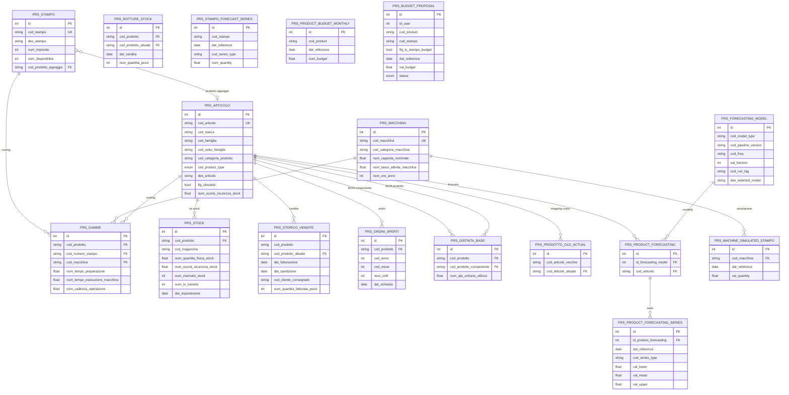

# Nespak - Analisi Completa Repository

## 1. Overview

**Nome app**: Nespak
**Descrizione**: Nespak Planning Platform - piattaforma di demand planning e forecasting per la supply chain
**Cliente**: Nespak (produttore di imballaggi/packaging alimentare in materiale plastico, gruppo Guillin)
**Settore**: Manufacturing / Food Packaging / Supply Chain Planning
**Basato su**: laif-template (v5.6.7)

L'applicazione consente di:
- Importare dati di produzione (articoli, stampi, macchine, distinte base, stock, storico vendite) da CSV/Excel/S3
- Trasformare i dati grezzi (schema `stg`) in dati operativi (schema `prs`) tramite pipeline ETL
- Eseguire forecasting della domanda con modelli statistici avanzati (ETS, ARMA, Croston, Hawkes, Negative Binomial, TSB)
- Visualizzare previsioni, budget, stock e produttivita macchine tramite frontend Next.js
- Gestire proposte di budget con workflow pending/approved/denied

## 2. Versioni

| Elemento | Versione |
|----------|---------|
| App | **1.3.16** |
| laif-template | **5.6.7** |
| Python | 3.12 |
| values.yaml | 1.1.0 |
| Prima release | 2025-11-04 |

## 3. Team (contributor per commit)

| Contributor | Commit |
|------------|--------|
| Pinnuz | 269 |
| mlife | 198 |
| github-actions[bot] | 131 |
| Simone Brigante | 92 |
| bitbucket-pipelines | 86 |
| Marco Pinelli | 85 |
| neghilowio | 75 |
| Lorenzo Monni Sau | 67 |
| Gabriele Fogu | 62 |
| cavenditti-laif | 50 |
| sadamicis | 49 |
| mattiagualandi | 38 |
| Carlo A. Venditti | 31 |
| Daniele DN | 28 |
| lorenzoTonetta | 23 |
| Matteo Scalabrini | 21 |

## 4. Stack Tecnologico

### Backend
- **Framework**: FastAPI (0.131.0) + Uvicorn (0.41.0)
- **ORM**: SQLAlchemy 2.0.46 (async con asyncpg 0.31.0)
- **Database**: PostgreSQL (via Docker, multi-schema: `stg`, `prs`, `anls`, `template`)
- **Migrazioni**: Alembic 1.18.4 (con plugin `alembic-postgresql-enum`)
- **Validazione**: Pydantic 2.12.5
- **ML/Forecasting**: scikit-learn 1.8.0, statsmodels (opzionale), pandas
- **Visualizzazione**: matplotlib, seaborn
- **AWS**: boto3 1.42.54, requests-aws4auth (S3 per import dati)
- **LLM** (opzionale): OpenAI 2.21.0, pgvector 0.4.2
- **Excel**: openpyxl, xlrd, xlsxwriter
- **PDF** (opzionale): pymupdf
- **Docx** (opzionale): python-docx
- **HTTP**: httpx 0.28.1, requests 2.32.5, aiohttp 3.13.3
- **CLI**: typer 0.24.1
- **Auth**: passlib + bcrypt + python-jose (JWT)
- **Task scheduler**: fastapi-utils `repeat_every` (configurato ma non attivo)

### Frontend
- **Framework**: Next.js (con TypeScript)
- **UI Library**: laif-ds (design system LAIF)
- **Styling**: Tailwind CSS
- **E2E Testing**: Playwright

### Infrastruttura
- **Container**: Docker + Docker Compose
- **CI/CD**: GitHub Actions
- **Cloud**: AWS (eu-west-1) - account dev: 547576598284, account prod: 865377811256
- **Profili AWS**: `nespak-dev`, `nespak-prod`
- **Servizio ETL**: container Docker separato (`nespak_etl`) con profilo `etl`

## 5. Data Model Completo

### Architettura a 3 schemi

Il database e organizzato in 3 schemi principali:
- **`stg`** (staging): dati grezzi importati da CSV/Excel/S3
- **`prs`** (presentation): dati trasformati e arricchiti per l'uso applicativo
- **`anls`** (analytics): modelli di forecasting e performance (schema parallelo a prs per analytics)

### Tabelle - Schema `stg` (Staging)

| Tabella | Descrizione | Colonne principali |
|---------|-------------|-------------------|
| `articolo` | Anagrafica articoli grezza | ~100 colonne: cod_articolo (PK), des_articolo, codici famiglia/marca/categoria, dimensioni fisiche, pesi, flag obsoleto/stock, codici doganali, EAN, scorta sicurezza |
| `stock` | Dati stock per magazzino | cod_prodotto (FK articolo), cod_magazzino, cod_deposito, quantita fisiche/riservate/in transito, date ingresso/uscita, tempi riapprovvigionamento, MRP |
| `storico_vendite` | Storico vendite dettagliato | cod_prodotto (FK articolo), dat_fatturazione, dat_spedizione, cliente, paese, zona geografica, quantita fatturata |
| `stampo` | Anagrafica stampi (utensili) | cod_stampo (PK), impronte, capacita nominale, categoria macchina, tempi esecuzione, disponibilita, manutenzione |
| `macchina` | Anagrafica macchine produttive | cod_macchina (PK), categoria, capacita nominale, tasso attivita, ore anno/mese, calendario produzione |
| `gamme` | Cicli di lavorazione (routing) | cod_prodotto (FK), cod_macchina (FK), cod_numero_stampo (FK), tempi preparazione/esecuzione, cadenza |
| `distinta_base__intestazione` | BOM - intestazione | cod_prodotto (FK), cod_prodotto_componente (FK), quantita utilizzo, coefficiente perdita |
| `distinta_base__nomenclatura` | BOM - nomenclatura | cod_prodotto (FK), versione, ordine modifica |
| `ordini_aperti` | Ordini clienti aperti | cod_prodotto (FK), data richiesta, ragione sociale, colli, peso, volume, nazione |
| `prodotto_old_new` | Mapping codici prodotto vecchio/nuovo | cod_articolo_vecchio, cod_articolo_nuovo |
| `rotture_di_stock` | Rotture di stock (stockout) | cod_prodotto (FK), date vendita/creazione, cliente, quantita pezzi, motivo annullamento |

### Tabelle - Schema `prs` (Presentation)

| Tabella | Descrizione | Colonne principali |
|---------|-------------|-------------------|
| `articolo` | Articolo arricchito | cod_articolo (PK), cod_product_type (ENUM), cod_marca, famiglie, flag, scorta sicurezza |
| `stock` | Stock semplificato | cod_prodotto (FK), magazzino, deposito, quantita fisica/riservata/in transito/ordinata |
| `storico_vendite` | Vendite con mapping prodotto attuale | cod_prodotto, cod_prodotto_attuale (FK), date, cliente, quantita, paese |
| `macchina` | Macchina semplificata | cod_macchina (PK), categoria, capacita, tasso attivita, ore anno |
| `stampo` | Stampo semplificato | cod_stampo (PK), descrizione, impronte, disponibilita, prodotto appoggio |
| `gamme` | Routing semplificato | cod_prodotto (FK), cod_stampo (FK), cod_macchina (FK), tempi, cadenza |
| `ordini_aperti` | Ordini semplificati | cod_prodotto (FK), anno/mese, ragione sociale, colli, peso, volume |
| `distinta_base__intestazione` | BOM semplificata | cod_prodotto (FK), cod_prodotto_componente (FK), quantita |
| `distinta_base__nomenclatura` | BOM nomenclatura | cod_prodotto (FK), versione |
| `prodotto_old_actual` | Mapping con cod attuale | cod_articolo_vecchio, cod_articolo_attuale (FK) |
| `rotture_di_stock` | Rotture con mapping attuale | cod_prodotto (FK stg), cod_prodotto_attuale (FK prs) |
| `forecasting_model` | Modelli di forecast | cod_model_type, pipeline_version, frequenza, orizzonte, run_tag, training_signature |
| `training_attributes` | Attributi di training | cod_attribute |
| `forecasting_model_training_attributes` | Join M:N modello-attributi | id_forecasting_model, id_training_attribute, val_numeric/string |
| `product_forecasting` | Forecast per prodotto | id_forecasting_model (FK), cod_articolo (FK) |
| `product_forecasting_series` | Serie temporali forecast | id_product_forecasting (FK), dat_reference, cod_series_type, val_lower/mean/upper |
| `stampo_forecast_series` | Serie forecast aggregate per stampo | cod_stampo, dat_reference, cod_series_type, num_quantity |
| `product_budget_monthly` | Budget mensile per prodotto | cod_product, dat_reference, num_budget |
| `budget_proposal` | Proposte di budget | id_user, cod_product, cod_stampo, dat_reference, val_budget, status (ENUM) |
| `machine_simulated_stampo_monthly` | Simulazione stampo mensile per macchina | cod_macchina (FK), dat_reference, val_quantity |

### Tabelle - Schema `anls` (Analytics)

Struttura parallela a `prs` per analytics separati:
- `forecasting_model`, `training_attributes`, `forecasting_model_training_attributes`
- `products` (con campi similarity: Pearson, Spearman, seasonality_score, nonzero_ratio)
- `product_forecasting`, `product_forecasting_series` (con val_actual e cod_dataset_split train/val/test)
- `product_forecasting_performance` (metriche per categoria: validation/testing)
- `performance_category`

### Enums

| Enum | Valori |
|------|--------|
| `ETLStep` | etl, forecast |
| `Frequency` | MONTHLY (MS), WEEKLY (W-SUN) |
| `ForecastDatasetSplit` | train, val, test |
| `ForecastSeriesType` | forecast, backtest, history |
| `BudgetProposalStatus` | pending, approved, denied |
| `ProductType` | STANDARD, FUORI_STANDARD, PROGRAMMATO, OTHER |

### Diagramma ER (relazioni principali)

## 6. API Routes

### ETL (`/etl`)
| Metodo | Path | Descrizione |
|--------|------|-------------|
| GET | `/etl/scan` | Scan file Excel/mapping disponibili |
| GET | `/etl/process-excel` | Processa Excel sostituendo header con mapping |
| POST | `/etl/import` | Importa dati da CSV processati nel DB |
| POST | `/etl/import-s3` | Importa dati direttamente da S3 |
| DELETE | `/etl/clear-tables` | Svuota tutte le tabelle |
| POST | `/etl/prs` | Esegue trasformazioni stg -> prs |

### Forecasting (`/forecasting`)
| Metodo | Path | Descrizione |
|--------|------|-------------|
| GET | `/forecasting/products` | Lista prodotti con dati sufficienti per forecast |
| POST | `/forecasting/train` | Training modelli + generazione forecast |
| GET | `/forecasting/forecast/{product_code}` | Forecast singolo prodotto |
| GET | `/forecasting/results` | Risultati forecast salvati |
| GET | `/forecasting/model-summary` | Metriche aggregate per tipo modello |
| GET | `/forecasting/backtest/{product_code}` | Backtest per prodotto |
| GET | `/forecasting/historical-split/{product_code}` | Split storico legacy vs current |

### Products (`/products`)
| Metodo | Path | Descrizione |
|--------|------|-------------|
| GET | `/products/list` | Lista prodotti con forecast |
| GET | `/products/stampi` | Lista stampi con conteggio prodotti |
| GET | `/products/famiglie` | Lista famiglie con conteggio prodotti |
| GET | `/products/aggregate` | Dati aggregati storico + forecast (per filtro) |
| GET | `/products/aggregate-totals` | Totali aggregati senza breakdown |
| GET | `/products/aggregate-prodotto` | Aggregato singolo prodotto |
| GET | `/products/productivity` | Produttivita per prodotto |
| GET | `/products/summary` | Statistiche riassuntive |
| GET | `/products/forecast-series/products` | Serie forecast per prodotto |

### Articolo (`/articolo`)
| Metodo | Path | Descrizione |
|--------|------|-------------|
| GET | `/articolo/{id}` | Dettaglio articolo per ID |
| GET | `/articolo/search` | Ricerca articoli |
| PUT | `/articolo/{id}` | Aggiorna articolo |
| PUT | `/safety-stock` | Aggiorna scorta sicurezza |

### Macchinari (`/macchinari`)
| Metodo | Path | Descrizione |
|--------|------|-------------|
| GET | `/macchinari/` | Lista macchine con sommario |
| GET | `/macchinari/{code}` | Dettaglio macchina con stampi |
| GET | `/macchinari/{code}/simulated-stampo` | Valori simulazione stampo mensile |
| PUT | `/macchinari/{code}/simulated-stampo` | Salva simulazione stampo |
| GET | `/macchinari/{code}/stamps/series` | Serie temporali stampi per macchina |
| GET | `/macchinari/{code}/stamps/budgets` | Budget stampi per macchina |
| GET | `/macchinari/{code}/stamps/{stampo}/products/series` | Serie prodotti per stampo/macchina |
| GET | `/macchinari/{code}/stamps/{stampo}/products/budgets` | Budget prodotti per stampo/macchina |
| CRUD | `/macchinari/simulated-stampo-monthly/*` | CRUD simulazione stampo mensile |

### Stamps (`/stamps`)
| Metodo | Path | Descrizione |
|--------|------|-------------|
| GET | `/stamps/list` | Lista stampi con conteggio prodotti |
| GET | `/stamps/forecast-series` | Serie forecast aggregate per stampo |

### Stock (`/stock`)
| Metodo | Path | Descrizione |
|--------|------|-------------|
| GET | `/stock/` | Dati stock per prodotto |
| GET | `/stock/aggregate` | Aggregato stock totale con filtri |
| GET | `/stock/filter` | Stock filtrato per prodotto/stampo/famiglia |
| GET | `/stock/{product_code}` | Dettaglio stock per magazzino |

### Sales History (`/sales-history`)
| Metodo | Path | Descrizione |
|--------|------|-------------|
| GET | `/sales-history/products` | Lista prodotti con totali vendite |
| GET | `/sales-history/data` | Storico vendite per prodotto (month/week, zero-fill) |
| GET | `/sales-history/years` | Anni disponibili con dati vendite |

### Budgets (`/budgets`)
| Metodo | Path | Descrizione |
|--------|------|-------------|
| GET | `/budgets/proposals/history` | Storico proposte budget |
| POST | `/budgets/proposals` | Crea proposta budget |
| PATCH | `/budgets/proposals/{id}/status` | Aggiorna stato proposta |
| GET | `/budgets/series` | Serie budget per scope (machine/stampo/product) |

### Changelog (`/changelog`)
| Metodo | Path | Descrizione |
|--------|------|-------------|
| - | `/changelog-customer`, `/changelog-technical` | Pagine changelog |

## 7. Business Logic

### Pipeline ETL (3 stadi)

1. **Import** (CSV da S3 o locale -> schema `stg`):
   - Legge file CSV/Excel dall'S3 bucket `{env}-nespak-data-bucket/input-data/`
   - Mapping header tramite file JSON di configurazione
   - TRUNCATE + INSERT per ogni tabella con ordine per rispettare FK
   - Supporta 11 entita: Articolo, Stock, StoricoVendite, Stampo, Macchina, Gamme, DistintaBase (2 tabelle), OrdiniAperti, ProdottoOldNew, RottureDiStock

2. **PRS Build** (schema `stg` -> schema `prs`):
   - 11 task sequenziali con ordine di dipendenza
   - Semplificazione colonne (da ~100 a ~15 per articolo)
   - Mapping codici prodotto vecchio -> attuale (ProdottoOldActual)
   - Arricchimento con `cod_product_type` (STANDARD, FUORI_STANDARD, PROGRAMMATO, OTHER)
   - Task piu complesso: `build_storico_vendite_prs` (295 righe) con risoluzione catene di sostituzione prodotto

3. **Forecast** (schema `prs` -> serie forecast):
   - Pipeline `minimal_approach` con 10 modelli candidati
   - Classificazione automatica serie: smooth, intermittent, erratic
   - Validazione rolling con fold multipli
   - Selezione automatica miglior modello (metrica WAPE)
   - Supporto frequenza mensile e settimanale
   - Orizzonte configurabile (1-24 mesi)
   - Confidence intervals con capping robusto

### Modelli di Forecasting (10 implementazioni)

| Modello | Righe | Tipo serie |
|---------|-------|-----------|
| ETS (Exponential Smoothing) | 196 | Standard |
| ARMA | 190 | Standard/Erratic |
| Croston | 230 | Intermittente |
| Hawkes Process | 246 | Intermittente |
| Hurdle Negative Binomial | 233 | Intermittente |
| Seasonal Negative Binomial | 200 | Intermittente |
| TSB (Teunter-Syntetos-Babai) | 201 | Intermittente |
| Multivariate (Robust NB) | 297 | Standard (con covarianti) |
| Naive | 111 | Fallback |
| Seasonal Naive | 128 | Erratic/Fallback |

### Budget Management

- Proposte di budget con workflow di approvazione (pending -> approved/denied)
- Budget mensili per prodotto e per stampo
- Simulazione stampo mensile per macchina
- Aggregazione budget per scope: macchina, stampo, prodotto

### Produttivita Macchine

- Gerarchia: Macchina -> Stampi -> Prodotti
- Serie temporali di produzione per ogni livello
- Simulazione carico stampo mensile editabile dall'utente

## 8. Integrazioni Esterne

| Servizio | Libreria | Scopo |
|----------|---------|-------|
| **AWS S3** | boto3, requests-aws4auth | Import dati CSV da bucket S3 |
| **OpenAI** | openai (opzionale, dep group `llm`) | Funzionalita conversazionale (template) |
| **pgvector** | pgvector (opzionale, dep group `llm`) | Embeddings per knowledge base (template) |
| **Wolico** | template integrato | Ticketing (dal template, non custom Nespak) |

## 9. Frontend - Pagine e Routing

### Pagine Custom (app-specific)

| Path | Descrizione |
|------|-------------|
| `/products/` | **Home page** - Lista prodotti con forecast, filtri per tipo/famiglia/stampo, grafici aggregati |
| `/stock/` | Dashboard stock per prodotto con aggregati e filtri |
| `/stock/safety-stock/` | Gestione scorta di sicurezza (tab separato) |
| `/machines/` | Lista macchine con accordion stampi/prodotti |
| `/machines/detail/[detailTab]/` | Dettaglio macchina (tab: overview, budget) |
| `/forecasting/` | Pagina forecasting (commentata dal menu, ma esistente) |
| `/sales_history/` | Storico vendite (commentato dal menu, ma esistente) |
| `/changelog-customer/` | Changelog utente |
| `/changelog-technical/` | Changelog tecnico |

### Features Frontend

| Feature | Componenti principali |
|---------|----------------------|
| **Products** | Lista prodotti, grafici aggregati, serie forecast, produttivita, sommario |
| **Stock** | Dashboard stock, dettaglio per magazzino, safety stock editabile |
| **Machines** | Lista accordion, dettaglio con stampi/prodotti, tab overview + budget, simulazione stampo |
| **Forecasting** | Chart forecast, product selector, chart simulato |
| **Sales History** | Storico vendite per prodotto |
| **Safety Stock** | Gestione scorta sicurezza con editing |

### Pagine Template (ereditate da laif-template)

- Gestione utenti, ruoli, permessi, gruppi, business
- Chat conversazionale con knowledge base
- File management
- Help (FAQ + Ticket/Wolico)
- Profilo utente

## 10. Pattern Notevoli

### Architettura a 3 schemi DB
Pattern non comune: separazione netta tra dati grezzi (`stg`), dati operativi (`prs`) e analytics (`anls`). Permette di re-importare i dati senza perdere le trasformazioni e i risultati dei modelli.

### Pipeline di forecasting modulare
Ogni modello statistico e un file separato con interfaccia uniforme. La pipeline classifica automaticamente le serie temporali (smooth/intermittent/erratic) e seleziona i candidati appropriati. Approccio competitivo: tutti i modelli candidati vengono valutati e il migliore viene selezionato.

### Dual-schema forecasting (prs vs anls)
I risultati di forecasting possono essere scritti in `prs` (operativi) o `anls` (analytics) a seconda della configurazione. Permette di avere risultati di produzione separati da esperimenti.

### ETL container separato
Il container ETL (`nespak_etl`) e un servizio Docker separato con profilo opzionale, che condivide il codice backend ma esegue solo la pipeline ETL/forecasting. Permette scheduling indipendente.

### Mapping codici prodotto con catena di sostituzione
Logica sofisticata in `build_storico_vendite_prs` e `build_prodotto_old_actual` per gestire catene di sostituzione prodotto (A -> B -> C -> D) e ricondurre tutto lo storico al codice attuale.

## 11. Note e Osservazioni

### Dimensione codebase
- **Backend app**: ~18.200 righe Python
- **Forecasting**: ~2.000 righe (solo forecasters) + ~1.000 righe pipeline/runner
- **PRS builders**: ~1.150 righe
- **Test**: 26 file, ~6.100 righe

### Peculiarita
- Le pagine `/forecasting/` e `/sales_history/` sono funzionanti ma **commentate dal menu di navigazione** - probabilmente sostituite dalla vista `/products/` che integra tutto
- Il template include funzionalita LLM/chat che potrebbero non essere utilizzate dal cliente
- Ruoli custom: solo `MANAGER` oltre ai template roles
- Nessun TODO/FIXME nel codice app (solo nel template)
- Il container ETL ha un BUG documentato: se `profiles` e impostato, `env_file` non viene caricato dal docker compose

### Infrastruttura
- Deploy su AWS con 2 ambienti (dev/prod)
- Dati di input su S3 bucket `{env}-nespak-data-bucket/input-data/`
- Integrazione con Wolico per testing locale (docker-compose.wolico.yaml)

### Maturita
Progetto maturo (v1.3.16, 1400+ commit), con pipeline ML significativa e gestione complessa dei dati di produzione industriale. Il focus principale e sulla previsione della domanda per ottimizzare la produzione di imballaggi.
