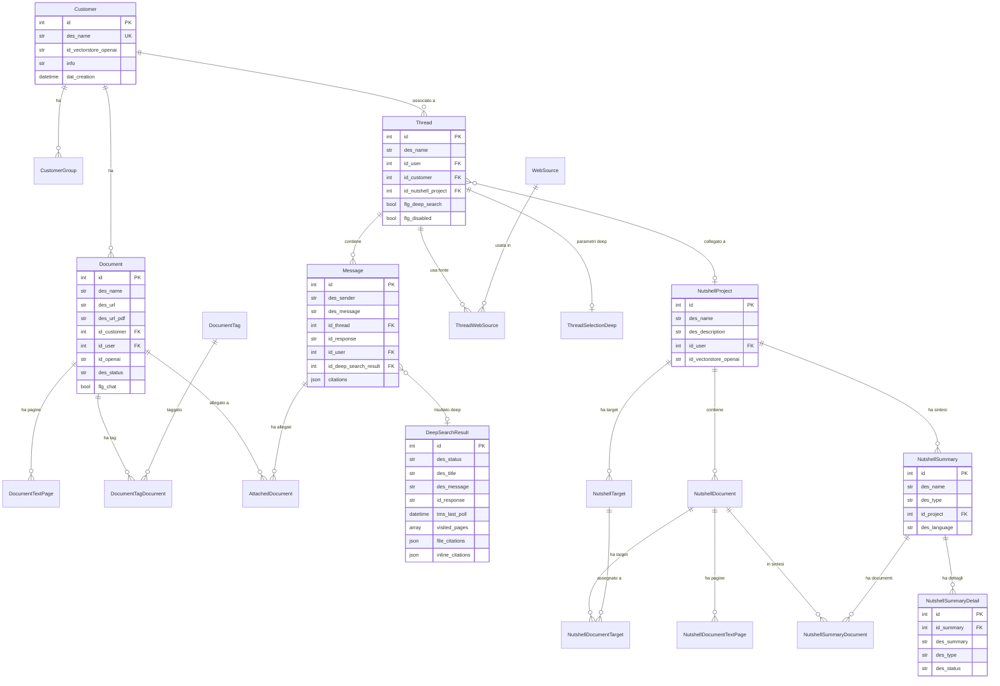

# Nessy - Analisi Completa Repository

## 1. Overview

**Nessy** e' una piattaforma di ricerca e analisi documentale basata su AI (OpenAI), pensata per consentire a utenti aziendali di interrogare documenti caricati tramite chat, effettuare "Deep Search" con ricerca web integrata, e generare sintesi automatiche di documenti ("In a Nutshell").

- **Cliente**: People (infra repo `people-infra`), probabilmente un'azienda di market research/consulenza strategica (i clienti interni includono brand come Coca Cola, Barilla, Stellantis, Heineken, McDonald's, UniCredit, ecc.)
- **Settore**: Market Research / Business Intelligence / Consulenza strategica
- **Codice applicazione**: 2025014
- **Descrizione**: Assistente AI per ricerca documentale, deep search web, e sintesi automatica

## 2. Versioni

| Componente | Versione |
|---|---|
| App (`version.txt`) | **1.7.7** |
| laif-template (`version.laif-template.txt`) | **5.6.0** |
| values.yaml | 1.1.0 |
| laif-ds (frontend) | 0.2.67 |

## 3. Team (top contributors)

| Commits | Contributor |
|---|---|
| 258 | Pinnuz |
| 179 | mlife |
| 138 | github-actions[bot] |
| 93 | Simone Brigante |
| 86 | bitbucket-pipelines |
| 85 | Marco Pinelli |
| 50 | neghilowio |
| 49 | Federico Frasca |
| 49 | sadamicis |
| 48 | cavenditti-laif |
| 31 | Carlo A. Venditti |
| 28 | Daniele DN |
| 22 | TancrediBosi |
| 21 | Matteo Scalabrini |

## 4. Stack e dipendenze

### Backend (Python 3.12)

**Dipendenze standard template:**
- FastAPI, Uvicorn, Starlette, SQLAlchemy 2.0, Alembic, Pydantic v2
- PostgreSQL (asyncpg + psycopg2)
- boto3 (AWS), bcrypt/passlib/python-jose (auth)
- httpx, requests

**Dipendenze custom/non-standard:**
| Dipendenza | Uso |
|---|---|
| `openai ~=2.14.0` | Integrazione OpenAI (GPT-4.1, GPT-5, o4-mini-deep-research) |
| `pgvector ~=0.4.2` | Vector embeddings PostgreSQL |
| `PyMuPDF (fitz) ~=1.26.7` | Estrazione testo da PDF |
| `python-docx ~=1.2.0` | Generazione documenti DOCX |
| `pypandoc_binary ==1.16.2` | Conversione Markdown -> DOCX |
| `xlsxwriter ~=3.2.2` | Generazione Excel |
| `pandas ~=2.3.3` | Manipolazione dati |
| `aiohttp ~=3.13.0` | Client HTTP asincrono |

### Frontend (Node >= 24, Next.js 16.1.1, React 19)

**Dipendenze custom/non-standard:**
| Dipendenza | Uso |
|---|---|
| `@amcharts/amcharts5` | Grafici avanzati |
| `draft-js` + plugins | Rich text editor con menzioni |
| `@hello-pangea/dnd` | Drag and drop |
| `@microsoft/fetch-event-source` | SSE per streaming chat |
| `katex` + `rehype-katex` + `remark-math` | Rendering formule matematiche |
| `react-markdown` + `react-syntax-highlighter` | Rendering markdown con syntax highlighting |
| `framer-motion` | Animazioni |
| `next-pwa` | Progressive Web App |

### Docker Compose

- **db**: PostgreSQL (porta 5432)
- **backend**: FastAPI (porta 8000) con `ENABLE_XLSX: 1`
- Variante `docker-compose.wolico.yaml` per test integrazione Wolico (shared network)
- Nessun servizio extra (no Redis, no Celery)

## 5. Data Model Completo

Schema DB: **`prs`** (dati applicativi), **`template`** (dati template LAIF)

### Tabelle applicative (schema `prs`)

#### `documents`
| Colonna | Tipo | Note |
|---|---|---|
| id | int | PK |
| des_name | str | Nome file |
| des_url | str | URL S3 file originale |
| des_url_pdf | str | URL S3 versione PDF |
| dat_creation | datetime | Server default now() |
| id_customer | int | FK -> customers.id |
| id_user | int | FK -> template.users.id |
| id_openai | str | File ID su OpenAI |
| des_status | DocumentStatus | loading/success/error |
| flg_chat | bool | Flag per documenti da chat attachment |

#### `customers`
| Colonna | Tipo | Note |
|---|---|---|
| id | int | PK (id=0 = general, id=-1 = attachments) |
| des_name | str | Unique |
| id_vectorstore_openai | str | Vector Store ID OpenAI |
| info | str | Descrizione cliente |
| dat_creation | datetime | |
| documents_count | computed | Count documenti associati |

#### `customer_groups`
| Colonna | Tipo | Note |
|---|---|---|
| id | int | PK |
| id_customer | int | FK -> customers.id |
| id_group | int | FK -> template.groups.id |

#### `document_text_pages`
| Colonna | Tipo | Note |
|---|---|---|
| id | int | PK |
| id_document | int | FK -> documents.id |
| des_text | str | Testo estratto della pagina |
| num_page | int | Numero pagina |

#### `threads`
| Colonna | Tipo | Note |
|---|---|---|
| id | int | PK |
| des_name | str | Titolo generato da AI |
| dat_creation | datetime | |
| id_user | int | FK -> template.users.id |
| flg_disabled | bool | |
| id_customer | int | FK -> customers.id |
| id_nutshell_project | int | FK -> nutshell_projects.id |
| flg_deep_search | bool | Flag deep search mode |

#### `messages`
| Colonna | Tipo | Note |
|---|---|---|
| id | int | PK |
| des_sender | SenderType | user/bot |
| des_message | str | Testo messaggio |
| dat_sent | datetime | |
| id_thread | int | FK -> threads.id |
| id_response | str | OpenAI response ID |
| id_user | int | FK -> template.users.id |
| id_deep_search_result | int | FK -> deep_search_results.id |
| citations | JSON | Lista citazioni [{id_openai_file, des_file_name, num_page, ...}] |

#### `attached_documents`
| Colonna | Tipo | Note |
|---|---|---|
| id | int | PK |
| id_message | int | FK -> messages.id |
| id_document | int | FK -> documents.id |
| dat_creation | datetime | |
| dat_deletion | datetime | |

#### `web_sources`
| Colonna | Tipo | Note |
|---|---|---|
| id | int | PK |
| des_name | str | |
| des_url | str | |
| dat_creation | datetime | |
| description | str | |

#### `thread_web_sources`
| Colonna | Tipo | Note |
|---|---|---|
| id | int | PK |
| id_thread | int | FK -> threads.id |
| id_web_source | int | FK -> web_sources.id |

#### `system_instructions`
| Colonna | Tipo | Note |
|---|---|---|
| id | int | PK |
| des_title | str | Chiave (es. "general", "deep_search_clarification") |
| des_instruction | str | Prompt di sistema |
| dat_creation | datetime | |

#### `document_tags`
| Colonna | Tipo | Note |
|---|---|---|
| id | int | PK |
| des_tag | str | Es. "2024", "Italia" |
| des_tag_section | str | Es. "year", "country" |

#### `document_tag_documents`
| Colonna | Tipo | Note |
|---|---|---|
| id | int | PK |
| id_document | int | FK -> documents.id |
| id_document_tag | int | FK -> document_tags.id |

#### `nutshell_projects`
| Colonna | Tipo | Note |
|---|---|---|
| id | int | PK |
| des_name | str | |
| des_description | str | |
| id_user | int | FK -> template.users.id |
| id_vectorstore_openai | str | Vector Store dedicato |
| dat_creation | datetime | |
| documents_count | computed | |

#### `nutshell_documents`
| Colonna | Tipo | Note |
|---|---|---|
| id | int | PK |
| id_project | int | FK -> nutshell_projects.id |
| id_user | int | FK -> template.users.id |
| id_openai | str | |
| des_name | str | |
| des_status | DocumentStatus | |
| des_url | str | |
| des_url_pdf | str | |
| dat_creation | datetime | |

#### `nutshell_targets`
| Colonna | Tipo | Note |
|---|---|---|
| id | int | PK |
| des_name | str | |
| id_project | int | FK -> nutshell_projects.id |

#### `nutshell_document_targets` (M2M)
| Colonna | Tipo | Note |
|---|---|---|
| id | int | PK |
| id_document | int | FK -> nutshell_documents.id |
| id_target | int | FK -> nutshell_targets.id |

#### `nutshell_summaries`
| Colonna | Tipo | Note |
|---|---|---|
| id | int | PK |
| des_name | str | Auto-generato: timestamp_type |
| des_type | NutshellSummaryType | single_document/by_target/total |
| id_project | int | FK -> nutshell_projects.id |
| dat_creation | datetime | |
| des_language | str | Default "it-IT" |

#### `nutshell_summary_documents` (M2M)
| Colonna | Tipo | Note |
|---|---|---|
| id | int | PK |
| id_summary | int | FK -> nutshell_summaries.id |
| id_document | int | FK -> nutshell_documents.id |

#### `nutshell_summary_details`
| Colonna | Tipo | Note |
|---|---|---|
| id | int | PK |
| id_summary | int | FK -> nutshell_summaries.id |
| des_summary | str | Contenuto generato |
| des_type | NutshellSummaryDetailType | concise/equilibrated |
| des_status | NutshellSummaryDetailStatus | processing/warning/error/completed |

#### `nutshell_document_text_pages`
| Colonna | Tipo | Note |
|---|---|---|
| id | int | PK |
| id_document | int | FK -> nutshell_documents.id |
| des_text | str | |
| num_page | int | |

#### `threads_selection_deep`
| Colonna | Tipo | Note |
|---|---|---|
| id | int | PK |
| id_thread | int | FK -> threads.id |
| initial_year | int | Filtro anno inizio |
| final_year | int | Filtro anno fine |
| countries | ARRAY(String) | Lista paesi |
| flg_web_search | bool | Default true |
| flg_general | bool | Default false |

#### `deep_search_results`
| Colonna | Tipo | Note |
|---|---|---|
| id | int | PK |
| des_status | DeepSearchStatus | processing/error/completed |
| des_title | str | Estratto dal contenuto |
| des_message | str | Report completo (markdown) |
| id_response | str | OpenAI response ID |
| tms_last_poll | datetime | Heartbeat per recovery |
| visited_pages | ARRAY(String) | URL visitate |
| file_citations | JSON | Citazioni da file |
| inline_citations | JSON | Citazioni inline |

### Diagramma ER



## 6. API Routes

### Risorse App (prefix `/api/`)

| Gruppo | Endpoint | Metodo | Note |
|---|---|---|---|
| **threads** | CRUD standard | GET/POST/PUT/DELETE | Search, get_by_id, create, update, delete |
| | `/{id_thread}/stream` | POST | Chat streaming (SSE) con OpenAI |
| | `/{id_thread}/create_first_message` | POST | Primo messaggio deep search |
| | `/{id_thread}/deep_search` | POST | Avvia deep search (202 Accepted) |
| | `/{id_message}/download_docx` | POST | Export messaggio in DOCX |
| | `/{id_message}/download_deep_search_docx` | POST | Export report deep search in DOCX |
| **customers** | CRUD standard | GET/POST/PUT/DELETE | |
| **customer_groups** | CRUD standard | GET/POST/PUT/DELETE | |
| **app_documents** | CRUD standard + file upload | GET/POST/PUT/DELETE | Upload con pipeline OpenAI |
| **attached_documents** | CRUD standard | GET/POST/PUT/DELETE | |
| **web_sources** | CRUD standard | GET/POST/PUT/DELETE | |
| **thread_web_sources** | CRUD standard | GET/POST/PUT/DELETE | |
| **document_tags** | CRUD standard | GET/POST/PUT/DELETE | |
| **document_tag_documents** | CRUD standard | GET/POST/PUT/DELETE | |
| **changelog** | GET | GET | Legge file CHANGELOG markdown |
| **threads_selection_deep** | CRUD standard | GET/POST/PUT/DELETE | |
| **nutshell_projects** | CRUD standard | GET/POST/PUT/DELETE | |
| **nutshell_documents** | CRUD standard | GET/POST/PUT/DELETE | |
| **nutshell_targets** | CRUD standard | GET/POST/PUT/DELETE | |
| **nutshell_document_targets** | CRUD standard | GET/POST/PUT/DELETE | |
| **nutshell_summaries** | CRUD standard | GET/POST/PUT/DELETE | |
| | `/create_summary/{id_project}` | POST | Crea sintesi con background task |
| **nutshell_summary_details** | CRUD standard | GET/POST/PUT/DELETE | |
| **nutshell_summary_documents** | CRUD standard | GET/POST/PUT/DELETE | |

### Risorse Template (standard LAIF)
- Auth, Users, Roles, Permissions, Groups, Business, User-Role, User-Group, User-Permission, Group-Permission, Role-Permission
- Chat (Collections, Conversation, Documents, Document Sections, Feedback)
- Ticketing (Tickets, Messages, Attachments, FAQs, FAQ Sections, Ticket Updates)
- Health, Notifications, Summary, Task, Files, Analytics

## 7. Business Logic

### 7.1 Chat Streaming con OpenAI

Flusso principale (`threads/controller.py` -> `stream_response`):
1. Se primo messaggio: genera titolo con **gpt-5-nano** (max 30 char)
2. Salva messaggio utente in DB
3. Se ci sono allegati: upload su S3, converti in PDF, upload su OpenAI, attacca a vector store, polling completamento
4. Seleziona vector store(s) da usare (customer, general id=0, attachments id=-1, nutshell project)
5. Costruisce system instructions dinamiche da tabella `system_instructions`
6. Esegue tag detection con **gpt-4.1-nano** (classificazione per anno/paese)
7. Crea filtri OpenAI file_search dai tag rilevati
8. Streaming risposta con **gpt-4.1** usando OpenAI Responses API (file_search + web_search)
9. Gestione citazioni (file_citation, url_citation) con match pagina precisa

### 7.2 Deep Search

Flusso (`threads/deep_search.py`):
1. **Primo messaggio**: genera titolo + prompt di chiarimento con **gpt-5-mini** (sincrono, 200)
2. **Messaggi successivi**: crea placeholder in DB, lancia background task (202 Accepted)
3. Background task:
   - Enrichment del prompt con **gpt-5-mini** (genera istruzioni dettagliate per il ricercatore)
   - Lancia **o4-mini-deep-research** in modalita' `background=True` con file_search + web_search + code_interpreter
   - Polling risultato ogni 30s (max 60 retry = 30 minuti timeout)
   - Estrae risultato: testo, citazioni inline, pagine visitate, file citations
   - Aggiorna DB con risultato completato
4. Filtri: per paese (ARRAY), per anno (range), per web source (domain whitelist)

### 7.3 In a Nutshell (Sintesi Documentale)

Flusso (`nutshell_summaries/`):
- **Tipo single_document**: ogni documento riassunto individualmente con **gpt-5-nano** (parallelo, semaphore 10)
- **Tipo by_target / total**: Map-Reduce:
  - **Phase 1 (Map)**: estrazione strutturata JSON da ogni documento con **gpt-5-nano** (schema `DocumentExtraction`)
  - **Phase 2 (Reduce)**: sintesi batch con **gpt-5** (reasoning effort medium), con batching per 50+ documenti
  - Se > 50 documenti: sintesi gerarchica (batch -> final synthesis con **gpt-5-mini** effort high)
- Due livelli di dettaglio: `concise` e `equilibrated`
- Supporto multilingua (it, en, fr, de, es)

### 7.4 Document Upload Pipeline

1. Upload file su S3
2. Parse metadata dal filename (anno, paesi) con mapping abbreviazioni (IT, GER, FRA, ecc.)
3. Assegna tag automaticamente
4. Converti in PDF se necessario (pypandoc/libreoffice)
5. Upload PDF su OpenAI
6. Attacca a vector store del customer con attributi (anno, paese)
7. Estrazione testo pagina per pagina con PyMuPDF

### 7.5 Background Tasks e Cron

| Task | Frequenza | Funzione |
|---|---|---|
| `recover_orphaned_deep_searches` | Ogni 5 min (wait 60s) | Recupera deep search orfani dopo restart backend |
| `add_yearly_document_tag` | Ogni 24h | Crea tag anno corrente a gennaio |
| `upload_documents_openai` | Disabilitato (commentato) | Retry upload documenti falliti |
| `save_pages_to_db` | Disabilitato (commentato) | Estrazione testo per documenti mancanti |

### 7.6 Citazioni e Page Matching

Sistema sofisticato a 5 strategie per trovare la pagina corretta di una citazione:
1. Match esatto su testo normalizzato
2. Cross-page boundary (testo a cavallo tra pagine)
3. Token matching con bonus per sequenze consecutive
4. Substring matching con sliding window
5. Relaxed word matching per testi brevi

### 7.7 Export DOCX

Conversione Markdown -> DOCX tramite `pypandoc` per messaggi chat e report deep search. File caricato su S3, restituito come presigned URL.

## 8. Integrazioni Esterne

| Servizio | Uso | Modelli |
|---|---|---|
| **OpenAI** | Chat, Deep Search, Sintesi, Tag Detection, Titoli | gpt-4.1, gpt-4.1-nano, gpt-5, gpt-5-mini, gpt-5-nano, o4-mini-deep-research |
| **OpenAI Vector Stores** | RAG per documenti customer | file_search con filtri e ranking |
| **OpenAI Web Search** | Ricerca web in chat e deep search | web_search tool con domain filtering |
| **OpenAI Code Interpreter** | Deep search | code_interpreter (container auto) |
| **AWS S3** | Storage documenti e report | Presigned URLs |
| **AWS SES** | Email (template) | Via template LAIF |
| **Wolico** | Integrazione ticketing (shared network) | Via docker-compose dedicato |

## 9. Frontend - Albero Pagine

```
/
├── (not-auth-template)/
│   ├── logout/
│   └── registration/
│
├── (authenticated)/
│   ├── nessy/                          ← Chat principale (NessyMain + NessyThread)
│   │
│   ├── customers/                      ← Lista clienti
│   │   └── customer/
│   │       ├── documents/              ← Documenti del cliente
│   │       └── permissions/            ← Permessi per gruppo
│   │
│   ├── general-settings/
│   │   ├── documents/                  ← Documenti generali
│   │   └── research-sources/           ← Fonti web per ricerca
│   │
│   ├── in-a-nutshell/                  ← Lista progetti Nutshell
│   │   └── project/
│   │       ├── (detail)/               ← Dettaglio progetto + sintesi
│   │       └── history/                ← Storico sintesi
│   │
│   ├── (app)/
│   │   ├── changelog-customer/         ← Changelog per clienti
│   │   └── changelog-technical/        ← Changelog tecnico
│   │
│   └── (template)/                     ← Pagine standard template LAIF
│       ├── conversation/
│       │   ├── chat/
│       │   ├── analytics/
│       │   ├── feedback/
│       │   └── knowledge/
│       ├── files/
│       ├── help/ (faq + ticket)
│       ├── profile/
│       └── user-management/ (user, role, group, permission, business)
```

### Feature Frontend custom principali

- **NessyMain / NessyThread**: Chat AI con streaming SSE, drawer storico thread, allegati, citazioni con pagina, deep search flow
- **DeepSearchSelectionFlow**: Wizard per parametri deep search (paesi, anni, web search, fonti)
- **DeepSearchResultPanel**: Pannello risultati con citazioni inline, pagine visitate, export DOCX
- **In a Nutshell**: Gestione progetti, upload documenti, configurazione sintesi (tipo, dettaglio, lingua), visualizzazione risultati
- **Customers**: Gestione clienti con gruppi, documenti, permessi
- **Web Sources**: CRUD fonti web per ricerca
- **Changelog**: Visualizzazione changelog markdown con selector tipo/target

## 10. Deviazioni dal laif-template

### File/cartelle custom
- `backend/src/app/custom_gen_ai_provider.py` - Provider OpenAI esteso con streaming, deep search, page matching
- `backend/src/app/threads/deep_search.py` - Logica deep search con background tasks
- `backend/src/app/threads/docx.py` - Export DOCX via pypandoc
- `backend/src/app/app_documents/utils.py` - Parser filename per metadata (anno, paesi, clienti italiani/internazionali)
- `backend/src/app/nutshell_summaries/utils.py` - Map-Reduce per sintesi documentale
- `docker-compose.wolico.yaml` - Compose per test integrazione Wolico
- `docs/troisi/` - Documentazione custom email style
- `.windsurf/rules/` - Regole Windsurf specifiche per progetto

### Moduli Nutshell (interamente custom)
Tutto il dominio "In a Nutshell" (6 tabelle, 6 controller, 2 service, 1 utils) e' completamente custom.

### Moduli Deep Search (interamente custom)
ThreadSelectionDeep, DeepSearchResult, logica background + recovery cron.

### Dipendenze extra non-template
- openai, pgvector, PyMuPDF, python-docx, pypandoc, xlsxwriter, pandas, aiohttp

## 11. Pattern Notevoli

1. **CustomOpenAIProvider**: Estensione del provider template con streaming SSE personalizzato, gestione errori, citazioni file + web, e page matching a 5 strategie. Molto sofisticato.

2. **Map-Reduce per sintesi**: Pattern scalabile per sintetizzare 50+ documenti con estrazione strutturata (Phase 1) e sintesi gerarchica (Phase 2). Usa JSON schema strict per output strutturato.

3. **Deep Search con recovery**: Pattern robusto per task di lunga durata: avvio background -> polling con heartbeat -> cron recovery per orfani dopo restart. Timeout 30 minuti.

4. **Vector Store multi-livello**: Sistema a 3 livelli di vector store (customer, general id=0, attachments id=-1) con priorita' e filtri dinamici per anno/paese/thread.

5. **Filename metadata parsing**: Parsing intelligente dei filename per estrarre anno (formato "22P_...") e paesi (abbreviazioni IT, GER, FRA, ecc.) con mapping clienti italiani vs internazionali.

6. **System Instructions dinamiche**: Prompt di sistema composti dinamicamente da blocchi in DB (`system_instructions`), combinati in base al contesto (customer, vectorstore, web search).

7. **Tag Detection con LLM**: Classificazione automatica delle domande utente per anno/paese usando gpt-4.1-nano con JSON schema strict, usata per filtrare i risultati file_search.

8. **Modelli OpenAI avanzati**: Uso di modelli recenti/avanzati: o4-mini-deep-research (background mode), gpt-5/gpt-5-mini/gpt-5-nano con reasoning effort, code_interpreter.

## 12. Note e Tech Debt

### Tech debt
- Duplicazione `create_message_db` in `threads/service.py` e `threads/deep_search.py` (stessa funzione copiata)
- Task periodici `upload_documents_openai` e `save_pages_to_db` commentati/disabilitati ma ancora nel codice
- Commento portoghese nel codice: "download da s3 and upload diretamente para OpenAI"
- `CHANGELOG.md` praticamente vuoto (solo entry "0.1 - First release by LaifTemplate")
- `task.md` vuoto
- Controller changelog incluso due volte in `include_app_controllers` (riga 52 e 63)
- Molti `except Exception: pass` nella logica di page matching (silenziano errori)

### Peculiarita'
- Customer con `id=0` usato come "general" vector store
- Customer con `id=-1` usato come vector store per allegati chat
- Lista hardcoded di clienti italiani e internazionali in `app_documents/utils.py` (Coca Cola, Barilla, Stellantis, ecc.)
- Il formato filename segue una convenzione specifica del cliente: "22P-348 COCA COLA Winning at home_ITA, FRA.pptx"
- Supporto PWA (`next-pwa` configurato)
- Ruolo app custom: solo `MANAGER` oltre ai template roles
- Draft.js usato per editor con menzioni (possibile tech debt, Draft.js e' in maintenance mode)
