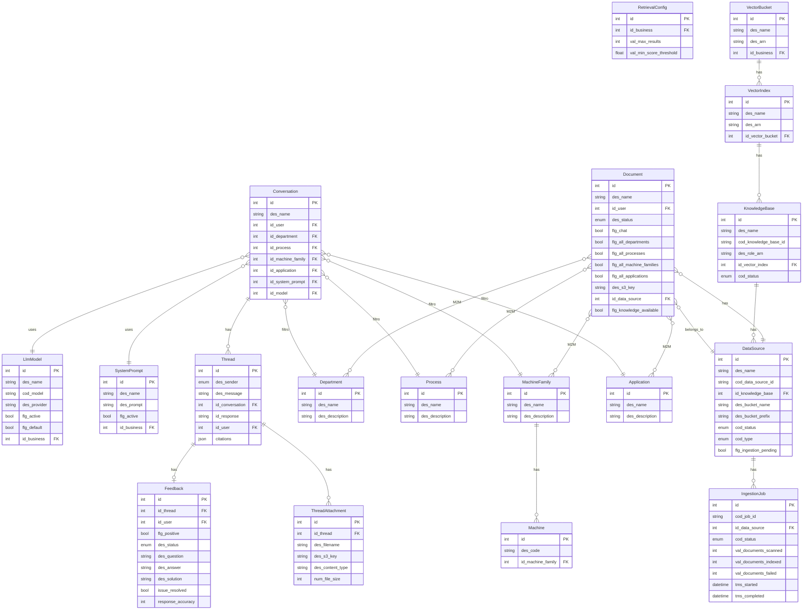

# Phoenix Assistant — Analisi Repository

## 1. Overview

**Cosa fa**: Assistente conversazionale AI con RAG (Retrieval-Augmented Generation) basato su AWS Bedrock Knowledge Base. L'utente carica documenti, li classifica per dipartimento/processo/macchina/applicazione, e poi interroga l'assistente AI che recupera informazioni dalla knowledge base per generare risposte contestuali con citazioni.

**Cliente**: Non specificato nel codice (nome generico "Phoenix-Genai")
**Settore**: Industriale/manifatturiero (entita: macchine, famiglie macchine, processi, applicazioni, dipartimenti)
**Stato**: Attivo, v1.1.4
**Repository**: phoenix-assistant

## 2. Versioni

| Componente | Versione |
|---|---|
| App | 1.1.4 |
| laif-template | 5.6.7 |

## 3. Team

| Contributore | Commit |
|---|---|
| Pinnuz | 263 |
| mlife | 193 |
| github-actions[bot] | 112 |
| Simone Brigante | 92 |
| bitbucket-pipelines | 86 |
| Marco Pinelli | 85 |
| neghilowio | 65 |
| cavenditti-laif | 49 |
| sadamicis | 49 |
| Carlo A. Venditti | 31 |
| Daniele DN | 28 |
| lorenzoTonetta | 23 |
| Matteo Scalabrini | 21 |
| tancredibosi | 21 |
| SimoneBriganteLaif | 20 |
| mlaif | 19 |
| TancrediBosi | 18 |
| angelolongano | 18 |
| Marco Vita | 17 |
| Daniele DalleN | 14 |
| + altri minori | ~50 |

## 4. Modello dati CUSTOM

Tutte le tabelle sono nello schema `prs`. Il modello e fortemente orientato alla gestione di una knowledge base documentale con classificazione multi-dimensionale.

**Tabelle associative M2M**: `document_departments`, `document_processes`, `document_machine_families`, `document_applications`, `business_knowledge_bases`

## 5. API Routes CUSTOM

| Prefisso | Descrizione |
|---|---|
| `/app_conversations` | Chat conversazionale con streaming SSE |
| `/app_documents` | Upload/gestione documenti con presigned URL S3 |
| `/app_feedbacks` | Feedback utenti sulle risposte AI |
| `/knowledge-bases` | CRUD Knowledge Base Bedrock |
| `/vector-buckets` | Gestione S3 Vector Buckets |
| `/vector-indexes` | Gestione Vector Indexes |
| `/data-sources` | Gestione Data Sources Bedrock |
| `/ingestion-jobs` | Monitoraggio job di indicizzazione |
| `/departments` | Anagrafica dipartimenti |
| `/processes` | Anagrafica processi |
| `/machines` | Anagrafica macchine |
| `/machine_families` | Anagrafica famiglie macchine |
| `/applications` | Anagrafica applicazioni |
| `/system-prompts` | Gestione system prompt per business |
| `/llm-models` | Configurazione modelli LLM per business |
| `/retrieval-configs` | Configurazione parametri di retrieval |
| `/changelog` | Changelog applicativo |

## 6. Business Logic CUSTOM

### RAG Orchestrator (Agentic Tool-Call Pattern)
Componente centrale che coordina il pipeline RAG:
- L'LLM riceve un tool `search_knowledge_base` e decide autonomamente quando e quante volte interrogare la KB (max 3 round)
- Supporto multimodale: immagini estratte dai chunk, PDF e immagini allegati dall'utente
- Citazioni con riferimento ai documenti sorgente e pagine
- Streaming SSE con status updates (generating_title, processing_attachments, retrieving_context, preparing_response)

### Ingestion Pipeline (Background)
- Upload documenti su S3 con metadati Bedrock
- Job di indicizzazione con polling asincrono (background task o thread daemon)
- Sistema di chaining: se arriva una richiesta durante un job attivo, viene flaggata come pending e concatenata automaticamente
- Riconciliazione periodica ogni 180 secondi per recuperare job orfani/bloccati
- Riconciliazione `flg_knowledge_available` tramite confronto con documenti indicizzati su Bedrock

### Filtri dimensionali
I documenti sono classificati su 4 dimensioni (dipartimento, processo, famiglia macchine, applicazione) con flag `flg_all_*` per applicabilita globale. La conversazione filtra i documenti recuperati dalla KB in base alle dimensioni selezionate.

### Generazione titolo conversazione
Usa GPT-5-nano per generare automaticamente un titolo di max 30 caratteri dalla prima domanda.

## 7. Integrazioni esterne

| Servizio | Utilizzo |
|---|---|
| **AWS Bedrock** | Knowledge Base: creazione KB, data source, ingestion, retrieve. Embedding con Titan Embed Text v2 |
| **AWS S3** | Storage documenti, metadati (.metadata.json), allegati chat. Presigned URL per upload/download |
| **AWS S3 Vectors** | Vector store per embeddings (alternativa a OpenSearch) |
| **AWS IAM** | Creazione automatica ruoli e policy per KB Bedrock |
| **OpenRouter** | Proxy LLM per streaming risposte (OpenAI Responses API). Default: `openai/gpt-5-mini`. Web search nativa |
| **OpenAI (via OpenRouter)** | Embeddings (`text-embedding-3-small`), generazione titoli (`gpt-5-nano`) |

## 8. Pagine frontend CUSTOM

| Pagina | Descrizione |
|---|---|
| `/assistant/` | Chat AI principale (home page default, tema dark) |
| `/assistant-config/` | Configurazione assistente (system prompt, modello LLM, retrieval config) |
| `/documents/` | Gestione documenti con upload e classificazione |
| `/feedbacks/` | Dashboard feedback utenti sulle risposte AI |
| `/knowledge-base/*` | Monitoring KB con 5 tab: vector buckets, vector indexes, knowledge bases, data sources, ingestion jobs |
| `/entity-management/*` | Gestione anagrafiche con 5 tab: dipartimenti, processi, macchine, famiglie macchine, applicazioni |

## 9. Deviazioni dallo stack

| Aspetto | Standard template | Questo progetto |
|---|---|---|
| LLM Provider | OpenAI diretto | **OpenRouter** come proxy (supporto multi-modello) |
| Vector Store | Non presente | **AWS S3 Vectors** (non OpenSearch/Pinecone) |
| Knowledge Base | Chat AI semplice del template | **AWS Bedrock Knowledge Base** completa |
| Background tasks | Template base | **Polling ingestion con chaining** + riconciliazione periodica (`repeat_every`) |
| Streaming | Non presente | **SSE con status pipeline** e agentic tool-call loop |
| Ruolo custom | - | `manager` (oltre ai template roles) |

**Dipendenze aggiuntive rispetto al template**:
- `boto3` (AWS SDK, piu pesante del solito con bedrock, s3vectors, iam, bedrock-agent, bedrock-agent-runtime)
- `openai` (via OpenRouter)
- `pgvector` (presente nelle deps ma non usato attivamente - rimpiazzato da S3 Vectors)
- `pymupdf` (estrazione PDF)
- `python-docx` (documenti Word)
- `xlsxwriter` + `pandas` (export Excel)

## 10. Pattern notevoli

- **Agentic RAG**: l'LLM decide autonomamente quando cercare nella KB tramite tool calling, non e un semplice retrieve-then-generate
- **Ingestion chaining con SELECT FOR UPDATE**: previene race condition su job concorrenti, garantisce che ogni modifica venga indicizzata
- **Riconciliazione periodica**: task ogni 3 minuti che recupera job orfani (crashed poller) e flag pending dimenticati
- **Metadata Bedrock**: sistema sofisticato di metadati `.metadata.json` con tipi nativi (STRING_LIST, BOOLEAN) per filtraggio dimensionale
- **Multi-tenant KB**: una KB puo essere associata a piu business tramite tabella `business_knowledge_bases` con flag attivazione
- **Presigned URL pattern**: sia per upload documenti (PUT) che per download allegati chat e immagini KB (GET)

## 11. Tech debt e note

- **`pgvector` nelle dipendenze ma non usato**: la migrazione a S3 Vectors ha reso pgvector superfluo, ma resta come dipendenza
- **`blocking_function` di esempio in events.py**: codice di test lasciato nel modulo eventi (commentato ma presente)
- **CHANGELOG non aggiornato**: fermo a "0.1 2026-01-02 - First release", nonostante la app sia a v1.1.4
- **`time.sleep(15)` in BedrockProvider**: attesa fissa per propagazione IAM, potrebbe essere ottimizzata con retry/backoff
- **Async/sync mixing**: `RAGOrchestrator.run_stream()` crea un nuovo event loop (`asyncio.new_event_loop()`) per bridgare async->sync, pattern fragile
- **`_pending_document_uploads` in-memory dict**: nel service documenti c'e un dict globale per tracking upload pendenti che non sopravvive a restart
