# Preventivatore (Benozzi) - Analisi Completa

## 1. Overview

**Applicazione**: Sistema di preventivazione industriale per azienda metalmeccanica (lavorazioni CNC, tornitura, fresatura).

**Cliente**: Benozzi (azienda manifatturiera specializzata in lavorazioni meccaniche di precisione).

**Industria**: Manufacturing / Metalmeccanica di precisione.

**Descrizione funzionale**: Il preventivatore permette di creare, gestire e calcolare preventivi (quotation) per lavorazioni meccaniche. Include gestione completa di:
- Anagrafica clienti con difficolta' e business unit
- Catalogo materie prime, componenti commerciali, articoli e semilavorati
- Cicli di lavorazione (fasi, processi, centri di lavoro, macchine utensili)
- Calcolo automatico costi con markup, difficolta', rincari standard
- Gestione lotti (batch) con calcolo costi per pezzo
- Assiemi (preventivi padre-figlio) con albero ricorsivo
- Importazione dati da ERP Galileo tramite ETL schedulato
- Gestione cataloghi (trattamenti, certificazioni, processi speciali, utensileria)
- Generazione automatica fasi di lavorazione da regole di business

**Repo**: `preventivatore` (GitHub: laif-group/preventivatore)
**Prima commit**: 2024-03-04
**Totale commit**: ~1274

---

## 2. Versioni

| Componente | Versione |
|---|---|
| App (`version.txt`) | **2.3.5** |
| laif-template (`version.laif-template.txt`) | **5.4.0** |
| values.yaml template version | 1.1.0 |
| Python | 3.12 |
| Node.js / Next.js | 15.3.3 |
| laif-ds | ^0.2.58 |

---

## 3. Team (top contributors)

| Contributor | Commit |
|---|---|
| Simone Brigante | 325 |
| Pinnuz (Marco Pinelli) | 208 |
| mlife (Marco Vita) | 127 |
| bitbucket-pipelines | 118 |
| Daniele (Dalle Nogare) | ~92 |
| Marco Pinelli | 85 |
| sadamicis | 49 |
| github-actions[bot] | 46 |
| SimoneBriganteLaif | 33 |
| Matteo Scalabrini | 21 |
| Angelo Longano | 18 |
| Carlo A. Venditti | ~23 |
| Roberto (Zanolli) | 9 |

---

## 4. Stack e dipendenze non-standard

### Backend (Python 3.12, pyproject.toml)

**Dipendenze standard template**: SQLAlchemy 2.0.43, FastAPI 0.105, Pydantic v2, Alembic, boto3, bcrypt, passlib, python-jose, uvicorn, httpx, requests

**Dipendenze NON standard / specifiche progetto**:
- `aiohttp>=3.13.0` - per chiamate HTTP async (ETL)
- `asyncpg>=0.30.0` - driver async PostgreSQL
- Dependency group `xlsx`: `xlsxwriter~=3.2.2`, `pandas~=2.2.3` - export Excel
- Dependency group `llm`: `openai==1.107.0`, `pgvector==0.3.3` - (presente ma probabilmente non usato attivamente nel preventivatore)
- Dependency group `pdf`: `PyMuPDF==1.25.5`
- Dependency group `docx`: `python-docx==1.1.2`
- `alembic-postgresql-enum==1.2.0` - gestione enum in migrazioni

**Nota**: FastAPI pinned a 0.105 per bug noto file upload in >=0.106.

### Frontend (Next.js 15.3.3, TypeScript 5.8.3)

**Dipendenze NON standard / specifiche progetto**:
- `@amcharts/amcharts5` 5.13.3 - grafici/chart avanzati
- `@hello-pangea/dnd` 18.0.1 - drag and drop
- `xlsx` 0.18.5 - export/import Excel
- `draft-js` + plugins (`@draft-js-plugins/editor`, `@draft-js-plugins/mention`) - editor rich text
- `draft-js-export-html` - export HTML da editor
- `katex` + `rehype-katex` + `remark-math` - rendering formule matematiche
- `react-markdown` + `remark-gfm` - rendering Markdown
- `react-syntax-highlighter` - syntax highlighting
- `@microsoft/fetch-event-source` - SSE per streaming (probabilmente per AI chat template)
- `react-hot-toast` - notifiche toast
- `framer-motion` - animazioni

### Docker Compose

Servizi standard: `db` (PostgreSQL), `backend` (FastAPI).
**Extra**: `docker-compose.wolico.yaml` - configurazione per test locale con rete condivisa `wolico_shared_network` (integrazione con progetto Wolico).

Build arg: `ENABLE_XLSX: 1` - abilita supporto Excel nel backend.

---

## 5. Modello dati completo

### Schema DB: `prs` (presentation) + `stg` (staging)

Il database usa 2 schema PostgreSQL:
- **`prs`**: dati di produzione/presentazione
- **`stg`**: tabelle di staging per ETL (dati grezzi da Galileo)

### Tabelle principali (schema `prs`)

#### Difficolta' (parametri di calcolo)
| Tabella | Colonne chiave |
|---|---|
| `difficulty_customer` | id, cod, des, val_difficulty_percentage |
| `difficulty_raw_material` | id, cod, des, val_difficulty_percentage |
| `difficulty_treatment` | id, des, val_difficulty_percentage |
| `difficulty_roughness` | id, val_lower_limit, val_upper_limit, val_difficulty_percentage |
| `difficulty_tolerance` | id, val_lower_limit, val_upper_limit, val_difficulty_percentage |
| `difficulty_tolerance_quote` | id, val_lower_limit, val_upper_limit, val_difficulty_percentage |
| `difficulty_markup` | id, val_lower_limit, val_upper_limit, val_percentage_markup |
| `standard_markup` | id, cod_markup, des_markup, val_percentage_markup |
| `standard_industrial_markup` | id, val_markup_process_work/setup/raw_material/... (10 campi markup) |

#### Clienti
| Tabella | Colonne chiave |
|---|---|
| `business_unit` | id, cod, des |
| `customer_payment` | id, cod_payment, des_payment |
| `customer` | id, cod, des, id_business_unit, id_difficulty_customer, val_markup, flg_custom |

#### Distinta Base (Legacy)
| Tabella | Colonne chiave |
|---|---|
| `raw_material_group` | id, cod, des |
| `raw_material` | id, cod, des, id_raw_material_group, id_difficulty_raw_material, cod_dimension_type, val_diameter/width/length/thickness, amt_cost_per_kg, flg_custom |
| `external_raw_material` | id, id_quotation, id_article, des, cod_dimension_type, dimensioni |
| `commercial_component` | id, cod, des, amt_cost, validita' prezzo |
| `article_family` | id, cod, des |
| `article` | id, cod, des, cod_drawing, id_article_family, id_raw_material_group, amt_cost, dimensioni |
| `article_raw_material` | id, id_article, id_raw_material, val_quantity (join M:N) |
| `article_commercial_component` | id, id_article, id_commercial_component, val_quantity |
| `article_article` | id, id_article_parent, id_article_child, val_quantity (struttura gerarchica) |

#### Distinta Base Unificata (nuova - migrazione in corso)
| Tabella | Colonne chiave |
|---|---|
| `all_article` | id, cod, des, cod_article_type (enum 8 tipi), dimensioni, amt_cost, id_raw_material_group, id_difficulty_raw_material, id_article_family, flg_custom |
| `all_article_all_article` | id, id_parent, id_child, val_quantity, val_sequence (distinta base gerarchica) |
| `migration_error` | id, cod_source_table, id_source_record, des_error_type/message, flg_resolved |

#### Preventivo
| Tabella | Colonne chiave |
|---|---|
| `quotation` | id, cod, date (richiesta/completamento/consegna/scadenza), id_customer, id_business_unit, id_article_family, materiale, tecnologia, rugosita'/tolleranze, difficolta', status (DRAFT/VALID/COMPLETED/ACCEPTED/REJECTED/DELETED), 10 campi markup standard, created_by/updated_by, tags |
| `quotation_raw_material` | id, id_quotation, id_raw_material, val_quantity, amt_custom_cost (legacy + unified) |
| `quotation_article` | id, id_quotation, id_article, val_quantity, amt_custom_cost |
| `quotation_commercial_component` | id, id_quotation, id_commercial_component, val_quantity, amt_custom_cost |
| `quotation_quotation` | id, id_parent, id_child, val_quantity, amt_custom_cost_per_piece (assiemi) |
| `quotation_all_article` | id, id_quotation, id_all_article, val_quantity, pricing unificato |
| `quotation_tag_association` | id_quotation, id_tag (M:N) |
| `quotation_tag` | id, des_name, des_description |

#### Cataloghi
| Tabella | Colonne chiave |
|---|---|
| `treatment_catalog` | id, des, flg_external, id_difficulty_treatment, amt_cost_per_piece/flat |
| `special_process_catalog` | id, des, config JSONB (opzioni: Laser/TIG/etc) |
| `certification_catalog` | id, des, config JSONB, amt_cost_per_piece/flat |
| `certification_config` | id, id_certification_catalog, cod_option, cod_difficulty, val_minutes |
| `tooling_catalog` | id, des, des_sub_category, amt_cost |
| `quotation_tooling` | id, id_quotation, id_tooling_catalog, val_quantity, amt_custom_cost |
| `quotation_certification` | id, id_quotation, id_certification_catalog, extra_values JSONB |
| `quotation_special_process` | id, id_quotation, id_special_process_catalog, extra_values JSONB |
| `quotation_treatment` | id, id_quotation, id_treatment_catalog, amt_custom_cost |

#### Lotti e Costi
| Tabella | Colonne chiave |
|---|---|
| `batch` | id, id_quotation, val_index, val_quantity, ~30 campi costo (raw_material, commercial_component, article, semilavorati per tipo, machine_setup, machine_work, man_setup, man_work, external_process, certification, tooling, transportation), ~15 campi prezzo (con markup), totali (cost_per_piece, full_cost, with_difficulty, final_price, margin), cost_calculation_details JSONB |

#### Processi e Fasi
| Tabella | Colonne chiave |
|---|---|
| `machining_center` | id, cod, des, amt_machine_cost_per_hour, amt_man_cost_per_hour |
| `machine` | id, id_machining_center, cod, des |
| `process` | id, id_machining_center, id_machine, cod, des, flg_external, flg_active, cod_process_type, tempi_standard |
| `work_cycle` | id, id_quotation, id_article, cod |
| `phase` | id, id_work_cycle, id_process, val_index, des, cod_phase_type (MANUAL/AUTOMATIC/EDITED), tempi macchina/uomo (setup ricorrente/non ricorrente, lavoro, media, standard), costi_esterni, fornitore, note, flg_certified |

#### ETL
| Tabella | Colonne chiave |
|---|---|
| `etl_run` | id, dat_start/end, cod_event, cod_status, steps JSONB, failed_steps JSONB |
| `etl_error` | id, id_run, cod_step, cod_error, des_error, extra_data JSONB |

#### Documenti
| Tabella | Colonne chiave |
|---|---|
| `document` | id, id_quotation, des_name, des_url (S3), cod_file_type, val_file_size, flg_main, created_by |

### Tabelle staging (`stg`)
- `stg.customer`, `stg.article_family`, `stg.article_material_class`, `stg.article_inventory_class`, `stg.article_alloy`, `stg.article_difficulty_raw_material`, `stg.article`, `stg.article_base_material`, `stg.article_price`, `stg.phase`, `stg.machining_center`, `stg.machine`, `stg.process`

### Diagramma ER (Mermaid)

```mermaid
erDiagram
    BusinessUnit ||--o{ Customer : ha
    BusinessUnit ||--o{ Quotation : ha
    DifficultyCustomer ||--o{ Customer : ha

    Customer ||--o{ Quotation : ha

    RawMaterialGroup ||--o{ RawMaterial : contiene
    RawMaterialGroup ||--o{ Article : riferisce
    RawMaterialGroup ||--o{ Quotation : riferisce
    DifficultyRawMaterial ||--o{ RawMaterial : ha

    ArticleFamily ||--o{ Article : contiene
    ArticleFamily ||--o{ Quotation : riferisce

    Article ||--o{ ArticleRawMaterial : ha
    RawMaterial ||--o{ ArticleRawMaterial : in
    Article ||--o{ ArticleCommercialComponent : ha
    CommercialComponent ||--o{ ArticleCommercialComponent : in
    Article ||--o{ ArticleArticle : "padre"
    Article ||--o{ ArticleArticle : "figlio"
    Article ||--o{ WorkCycle : ha
    Article ||--o{ ExternalRawMaterial : ha

    AllArticle ||--o{ QuotationAllArticle : in
    AllArticle ||--o{ AllArticleAllArticle : "padre"
    AllArticle ||--o{ AllArticleAllArticle : "figlio"
    RawMaterialGroup ||--o{ AllArticle : riferisce
    DifficultyRawMaterial ||--o{ AllArticle : ha
    ArticleFamily ||--o{ AllArticle : riferisce

    Quotation ||--o{ QuotationRawMaterial : ha
    RawMaterial ||--o{ QuotationRawMaterial : in
    Quotation ||--o{ QuotationArticle : ha
    Article ||--o{ QuotationArticle : in
    Quotation ||--o{ QuotationCommercialComponent : ha
    CommercialComponent ||--o{ QuotationCommercialComponent : in
    Quotation ||--o{ QuotationQuotation : "padre"
    Quotation ||--o{ QuotationQuotation : "figlio"
    Quotation ||--o{ QuotationAllArticle : ha

    Quotation ||--o{ QuotationToolingCatalog : ha
    ToolingCatalog ||--o{ QuotationToolingCatalog : in
    Quotation ||--o{ QuotationCertificationCatalog : ha
    CertificationCatalog ||--o{ QuotationCertificationCatalog : in
    CertificationCatalog ||--o{ CertificationConfig : ha
    Quotation ||--o{ QuotationSpecialProcessCatalog : ha
    SpecialProcessCatalog ||--o{ QuotationSpecialProcessCatalog : in
    Quotation ||--o{ QuotationTreatmentCatalog : ha
    TreatmentCatalog ||--o{ QuotationTreatmentCatalog : in
    DifficultyTreatment ||--o{ TreatmentCatalog : ha

    Quotation ||--o{ WorkCycle : ha
    WorkCycle ||--o{ Phase : contiene
    Phase }o--|| Process : usa
    Process }o--|| MachiningCenter : in
    Process }o--|| Machine : su
    MachiningCenter ||--o{ Machine : contiene

    Quotation ||--o{ Batch : ha
    Quotation ||--o{ Document : ha
    Quotation ||--o{ QuotationTagAssociation : ha
    QuotationTag ||--o{ QuotationTagAssociation : ha
    Quotation ||--o{ ExternalRawMaterial : ha

    EtlRun ||--o{ EtlError : ha

    Quotation {
        int id PK
        string cod_quotation UK
        enum status
        int id_customer FK
        int id_business_unit FK
        int id_article_family FK
        float val_roughness
        float val_tolerance
        enum cod_technology
    }

    Batch {
        int id PK
        int id_quotation FK
        int val_index
        int val_quantity
        float amt_total_cost_per_piece
        float amt_full_cost_per_piece
        float amt_final_price_per_piece
        float amt_margin_percentage
    }

    AllArticle {
        int id PK
        string cod_article UK
        string des_article
        enum cod_article_type
        float amt_cost
        int num_quotations
    }
```



---

## 6. API Routes

### ETL
| Metodo | Route | Descrizione |
|---|---|---|
| POST | `/etl/run` | Avvia ETL (non bloccante, asyncio.create_task) |
| GET | `/etl/proxy/my_ip` | IP pubblico istanza |
| GET | `/etl/proxy/login` | Test login Galileo |
| Scheduler | ogni ora | ETL automatico (prod, weekday, ore 2:00) |

### ETL v2 (async, non bloccante)
| Metodo | Route | Descrizione |
|---|---|---|
| POST | `/etl-v2/run` | Avvia ETL v2 |

### Preventivi (Quotations)
| Metodo | Route | Descrizione |
|---|---|---|
| GET | `/quotations` | Lista con ricerca/paginazione |
| GET | `/quotations/{id}` | Dettaglio |
| POST | `/quotations` | Crea |
| PUT | `/quotations/{id}` | Aggiorna |
| DELETE | `/quotations/{id}` | Elimina |
| POST | `/quotations/{id}/duplicate` | Duplica |
| POST | `/quotations/{id}/compute_costs` | Ricalcola costi batch |
| POST | `/quotations/{id}/generate_phases` | Genera fasi automatiche |
| POST | `/quotations/{dest}/import_from_quotation/{src}` | Importa da altro preventivo |
| POST | `/quotations/{dest}/import_from_article/{src}` | Importa da articolo |
| GET | `/quotations/{id}/assembly-tree` | Albero assiemi ricorsivo |
| GET | `/quotations/{id}/assembly-costs` | Costi assiemi per batch |
| GET | `/quotations/{id}/assembly-costs/report` | Report costi assieme |
| GET | `/quotations/{id}/assembly-costs/report/csv` | Export CSV costi |

### Clienti
| Metodo | Route | Descrizione |
|---|---|---|
| CRUD | `/customers` | Clienti |
| CRUD | `/business-units` | Business unit |

### Materiali Base
| Metodo | Route | Descrizione |
|---|---|---|
| CRUD | `/raw-material-groups` | Gruppi materie prime |
| CRUD | `/raw-materials` | Materie prime |
| CRUD | `/external-raw-materials` | Materie prime esterne |
| CRUD | `/commercial-components` | Componenti commerciali |

### Articoli
| Metodo | Route | Descrizione |
|---|---|---|
| CRUD | `/article-families` | Famiglie articolo |
| CRUD | `/articles` | Articoli |
| CRUD | `/article-raw-materials` | Relazione articolo-materia prima |
| CRUD | `/article-commercial-components` | Relazione articolo-componente |
| CRUD | `/article-articles` | Relazione articolo-articolo (BOM) |

### Articoli Unificati
| Metodo | Route | Descrizione |
|---|---|---|
| CRUD | `/all-articles` | Articoli unificati (nuova gestione) |

### Cataloghi
| Metodo | Route | Descrizione |
|---|---|---|
| CRUD | `/certification-catalogs` | Certificazioni |
| CRUD | `/tooling-catalogs` | Utensileria |
| CRUD | `/treatment-catalogs` | Trattamenti |
| CRUD | `/special-process-catalogs` | Processi speciali |

### Relazioni Preventivo
| Metodo | Route | Descrizione |
|---|---|---|
| CRUD | `/quotation-raw-materials` | Materie prime preventivo |
| CRUD | `/quotation-commercial-components` | Componenti preventivo |
| CRUD | `/quotation-articles` | Articoli preventivo |
| CRUD | `/quotation-quotations` | Assiemi (preventivi padre-figlio) |
| CRUD | `/quotation-certification-catalogs` | Certificazioni preventivo |
| CRUD | `/quotation-tooling-catalogs` | Utensileria preventivo |
| CRUD | `/quotation-treatment-catalogs` | Trattamenti preventivo |
| CRUD | `/quotation-special-process-catalogs` | Processi speciali preventivo |

### Processi
| Metodo | Route | Descrizione |
|---|---|---|
| CRUD | `/work-cycles` | Cicli di lavoro |
| CRUD | `/phases` | Fasi lavorazione |
| CRUD | `/processes` | Processi (lavorazioni) |

### Difficolta'
| Metodo | Route | Descrizione |
|---|---|---|
| CRUD | `/difficulty-customers` | Difficolta' cliente |
| CRUD | `/difficulty-raw-materials` | Difficolta' materia prima |
| CRUD | `/difficulty-treatments` | Difficolta' trattamento |
| CRUD | `/difficulty-roughness` | Difficolta' rugosita' |
| CRUD | `/difficulty-tolerances` | Difficolta' tolleranza |
| CRUD | `/difficulty-tolerance-quotes` | Difficolta' tolleranza quotata |
| CRUD | `/difficulty-markups` | Markup difficolta' |
| CRUD | `/standard-markups` | Markup standard |

### Data Entry
| Metodo | Route | Descrizione |
|---|---|---|
| CRUD | `/tags` | Tag preventivi |
| CRUD | `/standard-industrial-markups` | Markup industriali standard |
| CRUD | `/documents` | Documenti (con upload S3) |

### Migrazione
| Metodo | Route | Descrizione |
|---|---|---|
| POST | `/migration/...` | Migrazione legacy -> AllArticle |

### Changelog
| Metodo | Route | Descrizione |
|---|---|---|
| GET | `/changelog` | Changelog app (tech/customer) |

---

## 7. Business Logic

### Motore di calcolo costi (CORE)

Il cuore del sistema e' il calcolo costi del preventivo, organizzato in un'architettura a layer:

```
QuotationCostService (orchestratore, ~1663 LOC)
  +-- BatchCostCalculator
  |     +-- RawMaterialCostCalculator (costo materia prima al pezzo)
  |     +-- ComponentCostCalculator (componenti commerciali, articoli, semilavorati)
  |     +-- ProcessingCostCalculator (tempi macchina/uomo * costi orari)
  |     +-- ToolingCostCalculator (utensileria ammortizzata)
  +-- MarkupService (rincari standard industriali)
  +-- PriceCalculator (prezzo finale = costo + markup + difficolta')
```

Il calcolo gestisce:
- Costi materia prima con unita' di misura diverse (KG, PIECE, BAR, BOX)
- Conversioni dimensionali (diametro, spessore, lunghezza barra)
- Tempi macchina/uomo ricorrenti e non ricorrenti
- Setup ammortizzato sul lotto
- Costi lavorazioni esterne (per pezzo e per batch)
- Certificazioni, trasporti, utensileria
- Markup standard per categoria (10 tipi diversi)
- Moltiplicatore di difficolta' aggregato (cliente + materiale + rugosita' + tolleranza + trattamento)
- Prezzi per pezzo, costi NR, margine percentuale
- Debug trace in JSONB (`cost_calculation_details`)

### Assembly Cost Service (~1007 LOC)

Calcolo costi ricorsivo per assiemi (preventivi composti da sub-preventivi):
- Albero ricorsivo con costi aggregati
- Costi per batch con breakdown materiali/lavorazione/altro
- Costo lineare vs costo reale (arrotondamenti BOX/BAR)
- Export CSV report

### Generatore fasi automatiche (~994+ LOC)

`PhaseGenerator` genera automaticamente le fasi di lavorazione in base a:
- Tipo tecnologia (tornitura, fresatura, integrex, centro di lavoro)
- Tipo dimensione materia prima (tondo, piatto, tagliato)
- Processi speciali selezionati (foratura profonda, rettifica, saldatura, lucidatura, sbavatura, etc.)
- Certificazioni selezionate (con calcolo minuti per difficolta')
- Regole di business documentate con riferimento a diagrammi draw.io

### ETL da Galileo (ERP)

Due versioni dell'ETL coesistono:

**ETL v1** (`etl/service.py`, ~2085 LOC):
- 21 step sequenziali in 4 fasi
- Client HTTP async singleton (`GalileoClient`)
- Pattern staging -> presentation con upsert
- Schedulato ogni ora, esegue alle 2:00 nei giorni feriali (solo prod)
- Verifica IP prima dell'esecuzione
- Max 20 run storici mantenuti
- Gestione errori con tabella `etl_error`

**ETL v2** (`etl_v2/`, design doc completo):
- Architettura refactored con step indipendenti e dipendenze
- Runner orchestratore con esecuzione in background
- Client v2 con gestione sessione separata
- Quality checks framework (da implementare)
- Test framework predisposto (da implementare)
- Step organizzati in moduli: customers, article_relations, base_materials, prices, production_cycles

### Migrazione AllArticle

Sistema di migrazione in corso da gestione legacy (3 tabelle separate: RawMaterial, CommercialComponent, Article) a tabella unificata `AllArticle` con 8 tipi di classificazione:
- `MigrationService` con dual-write support
- Tracking errori di migrazione
- Feature flag `ArticleManagementMode` (LEGACY/DUAL/UNIFIED)

---

## 8. Integrazioni esterne

| Integrazione | Tecnologia | Descrizione |
|---|---|---|
| **Galileo ERP** | httpx AsyncClient | API REST per import anagrafiche, articoli, cicli produzione, distinte base, prezzi. Auth con login/token. |
| **AWS S3** | boto3 | Upload/download documenti preventivo |
| **ipify** | httpx | Verifica IP pubblico per schedulazione ETL |
| **Wolico** | Docker network condivisa | Integrazione con altro progetto LAIF (docker-compose.wolico.yaml) |

---

## 9. Frontend - Albero pagine

```
/ (login)
+-- (authenticated)/
|   +-- quotation/
|   |   +-- page.tsx          (lista preventivi con filtri)
|   |   +-- updater/
|   |       +-- page.tsx      (editor preventivo con tab)
|   |           Tabs: properties, details, list, costs, assembly, phases, documents
|   +-- customers/
|   |   +-- page.tsx          (anagrafica clienti)
|   +-- article/
|   |   +-- page.tsx          (catalogo articoli unificato)
|   |   +-- viewer/
|   |       +-- page.tsx      (dettaglio articolo)
|   +-- raw-materials/
|   |   +-- page.tsx          (materie prime)
|   +-- difficulty/
|   |   +-- page.tsx          (gestione difficolta')
|   +-- data-entry/
|   |   +-- standard-markups/
|   |   |   +-- page.tsx      (markup standard)
|   |   +-- tags/
|   |       +-- page.tsx      (gestione tag)
|   +-- (app)/
|   |   +-- changelog-customer/
|   |   |   +-- page.tsx      (changelog visibile al cliente)
|   |   +-- changelog-technical/
|   |       +-- page.tsx      (changelog tecnico)
|   +-- (template)/
|       +-- conversation/     (chat AI - template)
|       +-- files/            (gestione file - template)
|       +-- help/             (FAQ + ticket - template)
|       +-- profile/          (profilo utente)
|       +-- user-management/  (utenti, ruoli, gruppi, permessi)
+-- (not-auth-template)/
    +-- logout/
    +-- registration/
```

### Features frontend (src/features/)
- **quotation** - Modulo principale: updater con 7 tab (properties, details, list, costs, assembly, phases, documents), modali, helper per calcoli
- **customers** - Gestione clienti con modali e widget
- **article** - Viewer e modale articolo con tab (detail, phases)
- **raw-materials** - Materie prime con modali
- **difficulty** - Widget gestione difficolta'
- **standard-markups** - Markup standard
- **tags** - Gestione tag con modali
- **changelog** - Componenti changelog con tipi, utils, services

---

## 10. Deviazioni dal laif-template

### Cartelle/file extra NON template:
- `backend/src/app/etl/` - ETL completo per Galileo
- `backend/src/app/etl_v2/` - ETL v2 refactored
- `backend/src/app/migration/` - Migrazione legacy -> AllArticle
- `backend/src/app/quotations/quotation/quotation_cost_service.py` - Motore calcolo costi (1663 LOC)
- `backend/src/app/quotations/quotation/assembly_cost_service.py` - Calcolo costi assiemi (1007 LOC)
- `backend/src/app/quotations/quotation/assembly_cost_report_service.py` - Report CSV
- `backend/src/app/quotations/quotation/generate_phases.py` - Generatore fasi automatiche
- `backend/src/app/quotations/quotation/import_quotation.py` - Import da altri preventivi/articoli
- `backend/src/app/quotations/quotation/dual_write_service.py` - Dual write per migrazione
- `backend/src/app/all_article/` - Gestione articoli unificata
- `backend/src/app/db_init_const/` - Costanti inizializzazione DB
- `backend/src/app/constants.py` - Cataloghi trattamenti/certificazioni/processi hardcoded (~14K tokens)
- `docker-compose.wolico.yaml` - Integrazione Wolico
- `docs/analisi_progetto/` - Documentazione analisi
- `docs/troisi/` - Documentazione Troisi (probabilmente fornitore/consulente)
- `frontend/src/acernity/` - Componenti UI custom
- `frontend/app/(authenticated)/(app)/changelog-customer/` e `changelog-technical/` - Pagine changelog custom

### Caratteristiche specifiche:
- Schema DB separato (`prs` per dati, `stg` per staging) - non standard template
- ETL schedulato con `@repeat_every` di fastapi_utils
- Verifica IP prima dell'esecuzione ETL in produzione
- Build arg Docker `ENABLE_XLSX` per abilitare condizionalmente supporto Excel
- JSONB usato estensivamente per config cataloghi e debug costi

---

## 11. Pattern notevoli

1. **Dual data model con migrazione graduale**: Coesistenza tabelle legacy (RawMaterial, CommercialComponent, Article) e nuova tabella unificata (AllArticle) con feature flag a 3 stati (LEGACY/DUAL/UNIFIED). Pattern di migrazione live senza downtime.

2. **Motore calcolo costi modulare**: Architettura a calculator con pattern Strategy per i diversi tipi di costo. Debug trace completo in JSONB per ogni batch.

3. **ETL con staging bidimensionale**: Pattern staging (stg) -> presentation (prs) con run tracking, error logging e cleanup automatico. Due versioni coesistenti durante refactoring.

4. **Generazione fasi rule-based**: Generatore automatico di fasi di lavorazione basato su regole di business complesse (tecnologia + dimensione + processi speciali). Ogni regola documentata con codici processo Galileo.

5. **Assiemi ricorsivi**: Preventivi composti da sub-preventivi con calcolo costi ricorsivo e albero navigabile.

6. **RouterBuilder pattern**: Controller definiti con builder pattern fluente (search, get_by_id, delete) dal template, con endpoint custom aggiunti dopo.

---

## 12. Note e tech debt

### Tech debt identificato:
- **Modello dati duplicato**: Coesistenza legacy + AllArticle. Campi marcati `# LEGACY: da rimuovere dopo migrazione completa` in QuotationRawMaterial, QuotationArticle, QuotationCommercialComponent.
- **File troppo grandi**: `etl/service.py` (2085 LOC), `quotation_cost_service.py` (1663 LOC), `assembly_cost_service.py` (1007 LOC), `models.py` (2180 LOC) superano il limite di 500 LOC dichiarato nelle convenzioni.
- **ETL v1 e v2 coesistenti**: Duplicazione logica tra le due versioni dell'ETL.
- **constants.py hardcoded**: Cataloghi trattamenti, certificazioni, processi speciali e tooling definiti come liste di dizionari hardcoded (~14K tokens). Dovrebbero essere in DB o file di configurazione.
- **TODO sparsi**: ~15+ TODO nel codice (markup certificazioni, scelta lavorazione per carico, calcolo costo totale per pezzo, quality rules ETL v2, test unitari ETL v2).
- **FIXME fasi-processi**: Fasi associate a processi inesistenti (bug noto nel schema).
- **Dependency httpx**: Sia httpx che requests nelle dipendenze (TODO nel pyproject.toml: "maybe only use one?").

### Peculiarita':
- FastAPI pinned a 0.105 per bug file upload (non aggiornabile senza fix upstream).
- Verifica IP pubblico come guardia per schedulazione ETL (fragile se IP cambia).
- `@repeat_every` di fastapi_utils usato per scheduling (non Celery o task queue dedicata).
- 21K+ righe di codice Python solo nella cartella `app/`.
- Progetto attivo e in evoluzione costante (ultimo commit: aggiornamento etichette costi).
