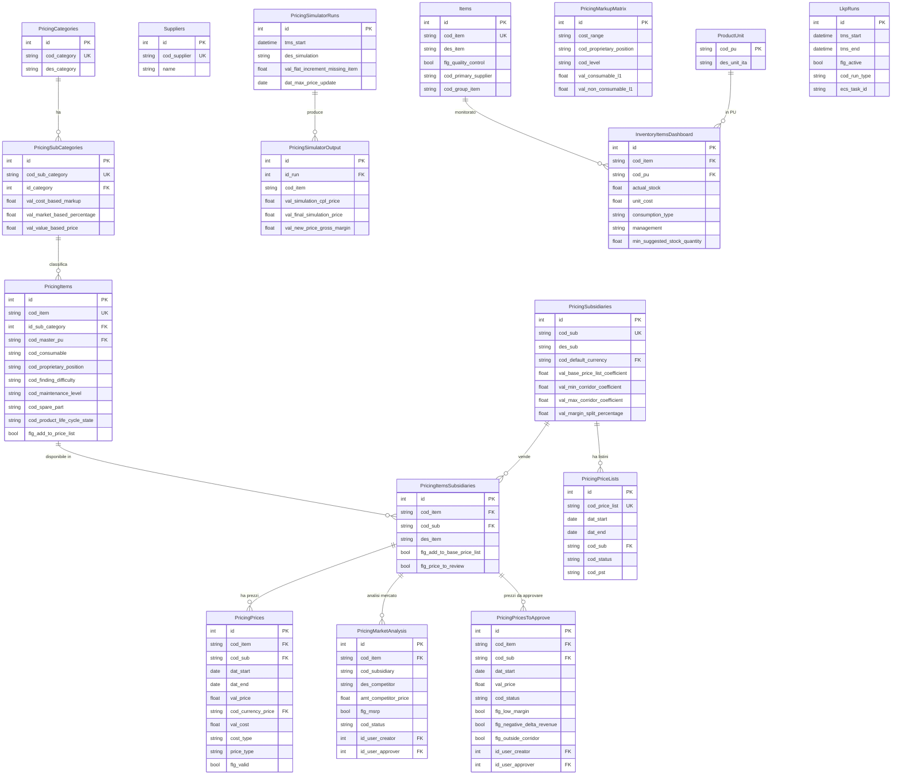

# Prima Power - Analisi Completa Repository

## 1. Overview

**Applicazione**: Piattaforma di gestione **Inventory** e **Pricing** per ricambi industriali (spare parts).

**Cliente**: **Prima Power** - divisione del gruppo Prima Industrie, leader mondiale nella produzione di macchine per la lavorazione della lamiera (taglio laser, punzonatrici, pannellatrici).

**Settore**: Manufacturing / Industrial Machinery / After-Sales Service

**Descrizione funzionale**: L'applicazione gestisce due macro-aree:
1. **Inventory Management**: Monitoraggio giacenze, calcolo minimi (safety stock, reorder point), analisi Pareto, service levels, gestione eccezioni
2. **Pricing Management**: Gestione prezzi ricambi per sussidiarie globali, simulazione pricing, listini prezzi, analisi di mercato, flusso approvazione prezzi, export verso sistema PST (sistema gestionale Prima)

Il sistema include un ETL complesso che ingesta dati da **4 database Microsoft SQL Server on-premise** (AX Reporting, Planning WH, Divisional DWH, PST Global) e li trasforma attraverso una pipeline a 6 step (STC -> LND -> STG -> TRN -> PRS -> EXP).

## 2. Versioni

| Componente | Versione |
|---|---|
| App (`version.txt`) | **0.3.8** |
| laif-template (`version.laif-template.txt`) | **5.6.0** |
| `values.yaml` version | 1.1.0 |
| Next.js | 16.1.1 |
| laif-ds | 0.2.69 |
| Python | >=3.12, <3.13 |
| Node.js | >=24.0.0 |

## 3. Team (Top Contributors)

| Contributore | Commits |
|---|---|
| frabarb | 622 |
| Lorenzo T | 314 |
| Pinnuz | 269 |
| github-actions[bot] | 233 |
| mlife | 195 |
| Simone Brigante | 168 |
| bitbucket-pipelines | 86 |
| Marco Pinelli | 85 |
| neghilowio | 75 |
| cavenditti-laif | 51 |
| sadamicis | 49 |

Totale: **~40 contributori**, progetto molto attivo con il team principale di ~6-7 sviluppatori.

## 4. Stack e Dipendenze

### Backend - Dipendenze Custom (non template)

| Dipendenza | Uso |
|---|---|
| `openpyxl` | Lettura/scrittura Excel (caricamento prezzi) |
| `pymssql` (dependency-group `etl`) | Connessione a Microsoft SQL Server per ETL |
| `xlsxwriter` + `pandas` (group `xlsx`) | Generazione report Excel |

### Frontend - Dipendenze Custom (non template)

| Dipendenza | Uso |
|---|---|
| `@amcharts/amcharts5` | Grafici avanzati (dashboard inventory/pricing) |
| `katex` + `rehype-katex` + `remark-math` | Rendering formule matematiche |
| `react-markdown` + `remark-gfm` | Rendering markdown |
| `react-syntax-highlighter` | Syntax highlighting |
| `@hello-pangea/dnd` | Drag & drop |

### Docker Compose - Servizi Extra

| Servizio | Descrizione |
|---|---|
| `etl` | Container dedicato per la pipeline ETL, con profilo Docker separato |

Sono presenti anche `docker-compose.wolico.yaml`, `docker-compose.e2e.yaml`, `docker-compose.test.yaml`, `docker-compose.debug-pycharm.yaml`.

## 5. Data Model Completo

### Schema Overview

Il database usa **4 schema PostgreSQL**:
- `template` - Dati template LAIF (utenti, ruoli, permessi, ticket, chat, ecc.)
- `prs` - Dati presentation/applicativi (tabelle principali dell'app)
- `static` - Lookup tables statiche
- `lnd` - Landing (dati grezzi dall'ETL)
- `stg` - Staging (dati trasformati intermedi)
- `trn` - Transformation (dati trasformati finali)

### Tabelle Schema `prs` (Presentation - Applicativo)

#### Core
| Tabella | Descrizione | Colonne Chiave |
|---|---|---|
| `items` | Anagrafica articoli ricambi | `cod_item`, `des_item`, `flg_quality_control`, `cod_primary_supplier`, `cod_group_item` |
| `suppliers` | Anagrafica fornitori | `cod_supplier`, `name` |
| `lkp_runs` | Log esecuzioni ETL | `tms_start`, `tms_end`, `flg_active`, `cod_run_type`, `ecs_task_id` |
| `default_lead_time` | Lead time di default per item/PU | `cod_item`, `cod_pu`, `lead_time` |
| `stock_items` | Giacenze per item/PU | `cod_item`, `cod_pu`, `val_actual_stock` |
| `warehouse` | Anagrafica magazzini | `cod_warehouse`, `cod_site`, `stock_classification` |

#### Inventory
| Tabella | Descrizione |
|---|---|
| `sigma_product_category` | Categorie sigma per calcolo minimi |
| `inventory_dashboard_stock_kpis` | KPI dashboard (understock, overstock, correct) |
| `inventory_dashboard_stock_chart_by_month` | Grafico stock mensile |
| `inventory_items_dashboard_info` | Info dettagliata item (Pareto, consumi, minimi, safety stock, reorder point) |
| `inventory_items_by_exceptions_dashboard_info` | Info eccezioni per item |
| `inventory_items_dashboard_chart_by_month` | Grafico item mensile (venduto, resi, backlog, giacenze) |
| `inventory_items_dashboard_chart_by_week` | Grafico item settimanale |
| `inventory_items_dashboard` | Dashboard item aggregata (~30 colonne con Pareto, copertura, ecc.) |
| `inventory_items_dashboard_summary_trend` | Trend annuale per item |
| `service_levels` | Livelli di servizio (ritardi consegna) |
| `inventory_exceptions` | Eccezioni manuali (minimo, sigma, lead time) |
| `inventory_setting` | Impostazioni inventory per PU |

#### Pricing
| Tabella | Descrizione |
|---|---|
| `pricing_subsidiaries` | Sussidiarie (filiali globali) con coefficienti prezzo |
| `pricing_subsidiary_currency` | Valute per sussidiaria |
| `pricing_currency_conversions` | Tassi di conversione valuta per anno |
| `pricing_categories` | Categorie pricing |
| `pricing_sub_categories` | Sotto-categorie con markup cost/market/value-based |
| `pricing_sub_categories_subsidiaries` | Override sotto-categorie per sussidiaria |
| `pricing_items` | ~30 colonne: classificazione item (consumable, proprietary position, difficulty, maintenance level, spare part, life cycle state, ecc.) |
| `pricing_items_subsidiaries` | Associazione item-sussidiaria con flag price list |
| `pricing_repaired_items` | Articoli riparati (old -> new) |
| `pricing_alternative_items` | Articoli alternativi con cluster |
| `pricing_last_purchase_price_by_year` | Ultimo prezzo acquisto per anno/mese |
| `pricing_commercial_agreements_costs` | Costi da accordi commerciali |
| `pricing_last_valid_cost_for_buy_erp_by_year` | Ultimo costo valido ERP per anno |
| `pricing_sales_world_wide_volume` | Volumi vendita globale per anno |
| `pricing_sales_world_wide_volume_by_month` | Volumi vendita globale per mese |
| `pricing_sales_by_subsidiary_volume` | Volumi vendita per sussidiaria |
| `pricing_market_analysis` | Analisi di mercato (competitor, MSRP, approvazione) |
| `pricing_markup_matrix` | Matrice markup per range costo / proprietary position / difficulty |
| `pricing_prices` | Prezzi attivi con storico (price, cost, date validity, currency) |
| `pricing_prices_to_approve` | Prezzi in attesa approvazione (~30 colonne: warning flags, margini, corridoio, delta ricavi) |
| `pricing_price_lists` | Listini prezzi per sussidiaria |
| `pricing_price_list_on_pst` | Mapping listini verso PST |
| `pricing_price_list_to_approve` | Dettaglio item in listino con prezzo finale |
| `pricing_general_discount_group` | Gruppi sconto generali |
| `pricing_distinct_discount_group` | Gruppi sconto distinti |

#### Simulatore Pricing
| Tabella | Descrizione |
|---|---|
| `pricing_simulator_runs` | Configurazione simulazioni |
| `pricing_simulator_markup_matrix` | Matrice markup per simulazione |
| `pricing_simulator_items` | Item nella simulazione con override manuali |
| `pricing_simulator_sub_categories_increase` | Incrementi per sotto-categoria |
| `pricing_simulator_output` | Output simulazione (~80 colonne: evoluzione costi, prezzi, markup, gross margin su 5 anni, revenues Pareto, ecc.) |
| `pricing_simulator_summary` | Summary aggregato per PU / Pareto / matrix area |

### Schema `static` (Lookup Tables)

| Tabella | Descrizione |
|---|---|
| `site` | Siti (spare parts / production) |
| `product_unit` | Unita di prodotto (PU) |
| `product_unit_site` | Associazione PU-sito |
| `subsidiary` | Sussidiarie statiche |
| `transaction_status` | Status transazioni (IN/OUT) |
| `transaction_type` | Tipi transazione |
| `sigma_coverage` | Tabella sigma -> copertura |
| `devaluation_curve` | Curva svalutazione |
| `coverage_cluster` | Cluster copertura |
| `currency` | Valute |

### Schema `lnd` (Landing - ETL)

| Tabella | Sorgente |
|---|---|
| `pst_subsidiaries` | PST (db_sgat_Evo_PPGlobal) |
| `pst_costs` | PST |
| `pst_invoice_details` | PST |
| `ax_transactions` | AX Reporting |
| `ax_items` | AX Reporting |
| ... (altre tabelle AX e Dynamics) | |

### Schema `stg` (Staging) e `trn` (Transformation)

Tabelle intermedie per il processo ETL con dati trasformati (transactions, items, lead time, service levels, ecc.)

### Diagramma ER (Principale - Schema `prs`)



## 6. API Routes

### Inventory
| Gruppo | Route Principali |
|---|---|
| Dashboard | `stock_kpis`, `stock_chart` |
| Items Dashboard | `items_dashboard`, `items_info`, `items_trend`, `items_chart`, `items_chart_by_week`, `items_service_levels` |
| Exceptions | CRUD eccezioni inventario |
| Settings | CRUD impostazioni inventory |
| Sigma Product Category | CRUD categorie sigma |
| Warehouse | CRUD magazzini |

### Pricing
| Gruppo | Route Principali |
|---|---|
| Items | Ricerca, dettaglio item pricing |
| Items Subsidiaries | Associazione item-sussidiaria |
| Cost | Costi ERP, prezzi acquisto |
| Prices | `pricing_prices` (CRUD), `search`, `original_search` |
| Prices To Approve | Flusso approvazione: `search`, `approve`, `reject`, `batch-approve`, `batch-reject` |
| Market Analysis | CRUD analisi di mercato con approvazione |
| Price Lists | CRUD listini, dettaglio listino |
| Price List To Approve | Approvazione listini |
| Categories / Sub Categories | CRUD categorie pricing |
| Sub Categories Subsidiaries | Override per sussidiaria |
| Subsidiaries | CRUD sussidiarie |
| Subsidiary Currency | CRUD valute sussidiaria |
| Currencies | CRUD valute |
| Currency Conversions | CRUD tassi conversione |
| Markup Matrix | CRUD matrice markup |
| Discount Groups | General + Distinct discount groups |
| Sales Volume | World wide + by subsidiary |
| Simulator | `runs`, `markup_matrix`, `items`, `output`, `sub_categories_increase`, `summary` |
| Dashboard | KPI pricing |

### Altre
| Gruppo | Route |
|---|---|
| Changelog | Log modifiche |
| LKP Runs | Storico esecuzioni ETL |
| Product Unit | CRUD unita prodotto |
| Static | Sigma coverage |

**Totale**: ~40+ controller/router registrati.

## 7. Business Logic

### ETL Pipeline (Complessa)

Pipeline a **6 step** eseguita come container Docker separato (`etl`):

1. **STC** (Static): Caricamento dati statici (siti, PU, valute, ecc.)
2. **LND** (Landing): Ingestione da **4 database MSSQL on-premise**:
   - `PLANNING-WH` (host 10.151.1.68) - AX data
   - `AX_REPORTING` (host 10.151.1.68) - AX reporting
   - `DIVISIONAL_DWH` (host 10.150.2.52) - Dynamics data
   - `db_sgat_Evo_PPGlobal` (host 10.150.2.79) - PST data
3. **STG** (Staging): Trasformazione dati per inventory e pricing separatamente
4. **TRN** (Transformation): Calcoli complessi (minimi, Pareto, service levels, ecc.)
5. **PRS** (Presentation): Preparazione dati per le dashboard
6. **EXP** (Export): Export prezzi verso database PST

L'ETL supporta due `RunType`: `INVENTORY`, `PRICING`, `ALL`.

### Pricing Simulator

Sistema di simulazione prezzi con:
- Matrice markup configurabile per simulazione
- Incrementi per sotto-categoria
- Output con ~80 colonne: evoluzione costi/prezzi/markup su 5 anni storici
- Summary aggregato per PU / classe Pareto / area matrice
- Calcolo revenues proiettati, gross margin, delta costi

### Flusso Approvazione Prezzi

Flusso strutturato con:
- `create-v2` API unica: il backend decide se salvare direttamente o mandare in approvazione
- Warning flags automatici: `flg_low_margin` (margine < 25%), `flg_negative_delta_revenue` (delta ricavi < -10.000 EUR), `flg_outside_corridor`
- Snapshot dati al momento della creazione (margine, markup, corridoio, delta ricavi)
- Batch approve/reject

### Conversione Valuta

Conversione multi-valuta con EUR come valuta ponte, fallback su anno precedente se tasso non disponibile.

### Export verso PST

Sincronizzazione listini prezzi verso il sistema gestionale Prima Power (PST), con gestione stati `TO_SEND`, `SENT`, `NOT_TO_SEND`.

### Script Caricamento Prezzi

Script standalone (`script/carica_prezzi/load_prices.py`) per caricamento massivo prezzi da Excel con batch processing.

## 8. Integrazioni Esterne

| Integrazione | Tecnologia | Descrizione |
|---|---|---|
| **Microsoft SQL Server** (AX/Dynamics) | `pymssql` via ETL | 4 database on-premise per ingestione dati |
| **AWS Secrets Manager** | `boto3` | Credenziali DB sorgente |
| **AWS ECS** | Task ETL schedulato | `ecs_task_id` tracciato in `lkp_runs` |
| **AWS S3** | `boto3` | Upload file (market analysis attachments) |
| **PST (Prima Service Tool)** | MSSQL export | Export listini prezzi verso sistema gestionale |
| **OpenAI** (dependency group `llm`) | `openai` + `pgvector` | Chat AI template (non custom) |

## 9. Frontend - Albero Pagine

### Inventory (`/inventory/`)
```
/inventory/
  /dashboard/          - Dashboard KPI e grafici stock
  /items/              - Lista articoli
  /item-dashboard/     - Dashboard singolo articolo (grafici, trend, service levels)
  /exceptions/         - Gestione eccezioni manuali
  /settings/           - Impostazioni (lead time acquisto)
  /sigma-category/     - Categorie sigma
  /warehouse/          - Gestione magazzini
  /documentation/      - Documentazione
```

### Pricing (`/pricing/`)
```
/pricing/
  /dashboard/          - Dashboard KPI pricing
  /items/              - Lista articoli pricing
    /detail/
      /history/        - Storico prezzi
      /market-analysis/ - Analisi di mercato
      /pricing-calculator/ - Calcolatore prezzo (cost-based, market-based, value-based)
      /volume/         - Volumi vendita
    /pending/          - Prezzi in attesa approvazione
  /categories/         - Gestione categorie/sotto-categorie
  /market-analysis/    - Lista analisi di mercato
  /price-lists/        - Listini prezzi
    /detail/           - Dettaglio listino
    /pending/          - Listini da approvare
  /settings/
    /by-country-on-single-item/        - Override per paese su singolo item
    /by-country-to-all-items/          - Override per paese su tutti gli item
    /by-country-to-items-in-pricing-matrix/  - Override per matrice
    /by-country-to-items-in-sub-categories/  - Override per sotto-categoria
    /currency/         - Gestione valute e conversioni
    /general-discount-group/  - Gruppi sconto generali
    /markup-matrix/    - Matrice markup
    /subsidiaries/     - Gestione sussidiarie
  /simulations/        - Lista simulazioni
    /detail/
      /console/        - Console simulazione
      /info/           - Info simulazione
      /output/         - Output dettagliato
      /overview/       - Overview risultati
      /summary/        - Summary aggregato
      /table/          - Tabella dati
```

### App Custom
```
/changelog-customer/   - Changelog per il cliente
/changelog-technical/  - Changelog tecnico
/fallback/             - Pagina fallback
```

**Totale pagine custom**: ~35 pagine (escluse template)

## 10. Deviazioni dal laif-template

### Strutturali
- **ETL engine completo** (`backend/src/app/etl/`): 48 file Python + 118 file SQL per la pipeline ETL. Non standard nel template.
- **Container Docker `etl`**: servizio separato in docker-compose con profilo dedicato
- **Schema DB multipli**: `lnd`, `stg`, `trn`, `prs`, `static` (il template usa solo `template` e `prs`)
- **Script caricamento prezzi** (`script/carica_prezzi/`): utility standalone
- **`docker-compose.wolico.yaml`**: compose separato per Wolico
- **`docs/` estesa**: analisi approfondite (approval flow, pricing calculator bugs, master PU change impact)

### Dipendenze non standard
- `pymssql` per connessione a SQL Server
- `openpyxl` + `xlsxwriter` + `pandas` per Excel
- `@amcharts/amcharts5` nel frontend per grafici avanzati
- `katex` per formule matematiche

### Configurazioni
- **Dependency groups** in `pyproject.toml`: `pdf`, `llm`, `docx`, `etl`, `xlsx`, `debugger`, `pycharm-debugger`
- **Ruolo custom**: solo `MANAGER` (oltre ai template roles)
- **Permessi custom granulari**: 15 permessi per inventory/pricing/settings/simulation

## 11. Pattern Notevoli

1. **Pipeline ETL multi-step con schema separation**: Pattern maturo di data warehousing (LND -> STG -> TRN -> PRS) implementato in Python/SQLAlchemy con schema PostgreSQL separati. Include export bidirezionale verso il sistema sorgente (PST).

2. **Pricing Simulator con output denormalizzato**: La tabella `pricing_simulator_output` ha ~80 colonne con dati storici su 5 anni, permettendo analisi what-if senza join complessi. Pattern di denormalizzazione intenzionale per performance.

3. **Flusso approvazione con snapshot**: I prezzi da approvare (`pricing_prices_to_approve`) contengono uno snapshot dei dati calcolati al momento della creazione, evitando che cambiamenti successivi alterino il contesto di approvazione.

4. **Partial unique index** per pending: `idx_unique_pending_item_sub` garantisce un solo prezzo pending per item/sub, permettendo storico di approvati/rifiutati.

5. **Indici trigram** (`gin_trgm_ops`) per ricerca ILIKE performante su `cod_item` e `des_item`.

6. **Conversione valuta con EUR ponte**: Pattern a 2 step (source -> EUR -> target) con fallback su anno precedente.

7. **Classe base astratta per chart** (`_BaseInventoryItemsDashboardChart`): Condivide ~20 colonne tra chart mensile e settimanale.

8. **Connessione multi-database MSSQL**: L'ETL si connette a 4 database SQL Server diversi su 2 host on-premise distinti.

## 12. Note

### Tech Debt
- `models.py` ha **1.781 righe** - file molto grande, andrebbe suddiviso per dominio
- Import wildcard: `from app.etl.models import *  # noqa: F403` in `models.py`
- Changelog `include_router(changelog_controller)` duplicato nel controller principale (riga 158 e 164)
- TODO nel `pyproject.toml`: "maybe only use one?" per `httpx` + `requests` (entrambi presenti)
- Il changelog (`CHANGELOG.md`) ha solo la prima release 0.1 - non viene mantenuto manualmente

### Complessita
- **19.249 righe** di codice Python solo in `backend/src/app/`
- **118 file SQL** per le query ETL
- **48 file Python** nel modulo ETL
- **~35 pagine frontend** custom
- **~50 tabelle** tra schema prs, static, lnd, stg, trn
- Uno dei progetti LAIF piu complessi per volume di codice e logica di business

### Peculiarita
- L'ETL accede a **host interni Prima Power** (10.151.x.x, 10.150.x.x) - richiede VPN/rete dedicata
- Il sistema PST (Prima Service Tool) e sia sorgente (ingestione costi/fatture) che destinazione (export listini)
- La simulazione pricing e un vero e proprio engine di pricing algoritmico con: matrice markup, cost-based, market-based, value-based pricing, flat increments, variance limiting
- Le dashboard inventory usano classificazione Pareto (A/B/C/NO_STOCK/FERMO) su molteplici dimensioni: quantita richieste, valore stock, costo unitario, valore ordini mensili, pickup
