# Retropricing (Tecnoform)

## Overview

Applicazione web per la gestione dei **MODTEC** (offerte commerciali per prodotti termoformati/pulp) per il cliente **Tecnoform**. Il sistema consente di creare, calcolare costi, generare revisioni e PDF di offerte commerciali per prodotti industriali (termoformati e pulp moulding). Include gestione campagne commerciali, storico offerte, feedback sugli esiti e integrazione bidirezionale con i sistemi gestionali del cliente (Gamma/EWGE via MSSQL e Nicim via Oracle).

- **Cliente**: Tecnoform (settore packaging industriale / termoformatura)
- **Industria**: Manufacturing / Packaging
- **Stato**: In produzione (deploy su AWS, account Tecnoform)
- **NON basato su laif-template** - stack completamente custom (Strapi + React)

## Versioni

| Componente | Versione |
|---|---|
| App | 0.1.1 (`version.txt`) |
| Strapi | 3.0.0 |
| Node.js | 12 |
| React | 16.13.1 |
| PostgreSQL | 12.3 |
| react-scripts | 3.4.1 (CRA) |
| react-router-dom | 5.1.2 |

## Team

| Contributore | Commit |
|---|---|
| Pinnuz | 251 |
| mlife | 182 |
| Simone Brigante | 92 |
| github-actions[bot] | 87 |
| bitbucket-pipelines | 86 |
| Marco Pinelli | 85 |
| sadamicis | 49 |
| cavenditti-laif | 48 |
| neghilowio | 43 |
| Carlo A. Venditti | 31 |
| Daniele DN | 28 |
| Alessandro Grotti | 25 |
| Matteo Scalabrini | 21 |
| SimoneBriganteLaif | 20 |
| angelolongano | 18 |
| Marco Vita | 17 |
| lorenzoTonetta | 17 |
| mlaif | 16 |
| Daniele DalleN | 13 |
| + altri contributori minori | ~30 |

## Stack

### Backend
- **Strapi v3.0.0** (headless CMS Node.js) su porta 1337
- **Bookshelf ORM** (Knex) come connector DB
- **PostgreSQL 12.3** - database `tecnoform_db`
- **EJS** per template HTML (generazione PDF offerte)
- **html-pdf** per conversione HTML-to-PDF
- **json-2-csv** per export CSV feedback
- **ExcelJS** per export Excel offerte con costi trasporto
- **mssql** per connessione a DB Gamma/EWGE (SQL Server)
- **oracledb** per connessione a DB Nicim (Oracle)
- **aws-sdk** per servizi AWS
- **redis** (4.0.6) presente come dipendenza
- **strapi-provider-email-amazon-ses** per invio email via SES

### Frontend
- **React 16** (CRA - create-react-app)
- **React Bootstrap** + Bootstrap 4
- **react-bootstrap-table-next** (tabelle con filtri, paginazione, editing inline)
- **Formik** + **Yup** per form e validazione
- **unstated** per state management (pattern container)
- **react-router-dom v5** per routing
- **strapi-sdk-javascript** per comunicazione con backend
- **react-hotjar** per analytics
- **moment.js** per date
- **lodash** per utility

### ETL
- Script Node.js standalone in `/etl/`
- Connessione a **Gamma (MSSQL)** e **Nicim (Oracle)** per sincronizzazione dati
- Comunicazione con Strapi via **strapi-sdk-javascript**
- Eseguibile via command-line con flag (`--customers`, `--machines`, `--all`, ecc.)

### Infrastruttura
- **Docker Compose** per sviluppo locale (backend + db + frontend)
- **AWS**: ECR, ECS/Fargate per backend, S3 + CloudFront per frontend
- **GitHub Actions** per CI/CD (prod + dev)
- **Bitbucket Pipelines** (legacy, presente ma migrato a GitHub)
- **VPN** configurata per accesso ai DB on-premise del cliente
- **CloudFront Function** (`lamba-code.js`) per URL rewriting API

## Modello dati

### Diagramma ER

```mermaid
erDiagram
    Customer ||--o{ Modtec : "ha"
    Customer ||--o{ Campaign : "ha"
    Customer }o--o{ Destination : "ha destinazioni"
    Campaign ||--o{ Modtec : "contiene"
    Campaign }o--o| Campaign : "reference_campaign_1"
    Campaign }o--o| Campaign : "reference_campaign_2"
    ModtecType ||--o{ Modtec : "classifica"
    Modtec ||--o{ Article : "contiene"
    Modtec ||--o| ModtecComputation : "ha calcolo"
    Modtec }o--o| Machine : "usa"
    Modtec }o--o| Destination : "destinazione"
    Article }o--o| Material : "usa materiale"
    Article }o--o| MaterialCategory : "categoria"
    Article ||--o| ArticleComputation : "ha calcolo"
    ArticleComputation }o--o| Packaging : "tipo recipiente"
    MaterialCategory ||--o{ Material : "contiene"
    Transport ||--|{ Transport : "listino"

    Customer {
        int id PK
        string denominazione
        string settore_merceologico
        int id_gamma
        string indirizzo
        string cap
        string citta
        string provincia
        string nazione
        string codice_pagamento
        string descrizione_pagamento
        string telefono
        string cellulare
        string consegna
        string resa
        string imballo
        string validita
        string tipo_bancale
        string descrizione_tipo_bancale
        int consegna_settimane
        string descrizione_porto
        boolean flg_comprensivo_trasporto
    }

    Campaign {
        int id PK
        int year
        string period
        int update
    }

    Modtec {
        int id PK
        string n_offerta
        string n_offerta_completa
        int n_revisione
        string descrizione_articolo
        string note
        decimal x_formato
        decimal y_formato
        decimal z_formato
        float costo_stampo_attrezzature_taglio
        float costo_tassellatura_cad_referenza
        float costo_eventuale_stampa_caldo
        float costo_eventuale_spizzatura
        int state
        int feedback_state
        string feedback_comment
        string data_offerta
        string linea
        string settore
        boolean is_consuntivo
        boolean offerta_conclusa_flg
        boolean storico_flg
        string n_offerta_origine
        string n_ultimo_consuntivo
        string codice_articolo
        boolean has_feedback
        boolean comprensivo_trasporto_flg
        string operatore
        string language
        string firma_offerta
        string specifica
        int num_cv
        boolean to_compute
        string data_scadenza
        boolean in_sviluppo
    }

    ModtecType {
        int id PK
        string nome
        string offerta_prefix
        string nuova_offerta_prefix
    }

    Article {
        int id PK
        int quantita
        int n_referenza
        string colore
        float spessore
        float prezzo
        float prezzo_pezzo
        string n_offerta
        boolean is_deleted
        float conf_tot_confezionamento
    }

    ArticleComputation {
        int id PK
        float costo_materiale
        float costo_macchina
        float costo_scarico
        float costo_avviamento
        float costo_scarto
        float costo_imballo
        float costo_netto_produzione
        decimal ricarico_perc
        decimal spese_generali_perc
        decimal provvigione_perc
        float prezzo_produzione
        decimal resa_oraria
        float costo_puro_trasporto
        float costo_ricaricato_trasporto
        string tipo_trasporto
        float costo_trasporto_listino
        boolean is_costo_trasporto_separato
        float altre_lavorazioni
        float pulp_costo_materia_prima
        float pulp_costo_manodopera
        float pulp_costo_energia
    }

    ModtecComputation {
        int id PK
        int pose_d1
        int pose_d2
        boolean stampo_pos_neg
        int impronte
        decimal sviluppo_taglio
        decimal stampo_d1
        decimal stampo_d2
        decimal stampata_d1
        decimal stampata_d2
        float spizzatura
        float stampa_caldo
        decimal ore_avviamento
        decimal battute_h
        decimal scarico_perc
        decimal costo_operatore
        decimal costo_macchina_orario
        float conf_tot
        float pulp_superficie_totale_cm2
        float pulp_peso_grammi
        int pulp_impronte
        float pulp_totale
        boolean stampo_misto_flg
    }

    Machine {
        int id PK
        string identificativo
        string tipo_macchina
        decimal ore_avviamento
        decimal battute_h
        decimal scarico_perc
        decimal scarto_perc
        decimal max_stampo_x
        decimal max_stampo_y
        decimal min_stampo_x
        decimal min_stampo_y
        int max_sviluppo_taglio
    }

    Material {
        int id PK
        string nome
        decimal costo_kg
        decimal peso_specifico
    }

    MaterialCategory {
        int id PK
        string nome
    }

    Packaging {
        int id PK
        string codice
        string tipo_scatola
        int lunghezza
        int larghezza
        int altezza
        float prezzo
        int num_pezzi_alto
        int num_pezzi_basso
    }

    Destination {
        int id PK
        string citta
        string provincia
    }

    Transport {
        int id PK
        string citta
        int num_pallets
        float costo
    }

    List {
        int id PK
        decimal costo_macchina_orario_pinze
        decimal costo_macchina_orario_catene
        decimal costo_macchina_avviamento_orario
        float spizzatura
        float stampa_caldo
        float foratura
        float costo_singolo_bancale
        decimal spese_generali_perc
        decimal delta_area_modtec_costi_trasporto
        float costo_operatore
        string piede_imballo_fatturati_al_costo
        string piede_consegna
        string piede_validita
        string piede_resa_se_addebitata
        string piede_resa_se_non_addebitata
    }
```

### Dettaglio entita

- **Customer**: Clienti Tecnoform, sincronizzati da Gamma (ERP). Contengono dati anagrafici, condizioni commerciali (bancali, trasporto, pagamento).
- **Campaign**: Campagne annuali di offerte per cliente. Supporta campagne di riferimento per confronti.
- **Modtec**: Entita principale. Rappresenta un'offerta/preventivo per un prodotto termoformato. Ha stato workflow (0=bozza, 1=in lavorazione, 2=completato), feedback (0-4), sistema revisioni.
- **ModtecType**: Tipo di modtec (termoformato, pulp, ecc.) con prefisso per numerazione offerte.
- **Article**: Singolo articolo dentro un modtec (variante per quantita/colore/spessore/materiale).
- **ArticleComputation**: Calcolo dettagliato costi per articolo (materiale, macchina, scarico, avviamento, scarto, imballo, trasporto, ricarichi).
- **ModtecComputation**: Calcolo stampata e layout per modtec (pose, impronte, dimensioni stampo, confezionamento, dati pulp).
- **Machine**: Macchine di produzione (termoformatrici), sincronizzate da Nicim (MES Oracle).
- **Material / MaterialCategory**: Materiali con costo al kg e peso specifico, organizzati per categoria.
- **Packaging**: Tipi di imballo/recipiente (scatole) con dimensioni e prezzo.
- **Destination**: Destinazioni di consegna (citta/provincia), associate a clienti.
- **Transport**: Listino trasporti per citta e numero pallet.
- **List**: Singleton con parametri globali di configurazione (costi orari macchina, percentuali spese generali, testi piede offerta IT/EN).

## API Routes

### Modtec (entita principale)
| Metodo | Path | Handler | Note |
|---|---|---|---|
| GET | `/modtecs` | find | Lista con filtri |
| GET | `/modtecs/count` | count | |
| GET | `/modtecs/n_offerta` | searchNOfferte | Ricerca autocomplete offerte |
| GET | `/modtecs/export/excel` | exportToExcel | Export XLSX con costi trasporto |
| GET | `/modtecs/:id` | findOne | |
| GET | `/modtecs/:id/pdf` | generatePdf | Genera HTML offerta (template EJS) |
| GET | `/modtecs/:id/costi_attrezzature` | getCostiAttrezzature | Costi stampo da DB Nicim |
| GET | `/modtecs/:id/storico` | getStorico | Storico offerte simili/revisioni/campagne |
| POST | `/modtecs` | create | |
| POST | `/modtecs/bulk` | bulkCreate | Creazione massiva |
| POST | `/modtecs/:id/generate_rev` | handleGenerateRev | Genera nuova revisione (deep copy) |
| PUT | `/modtecs/:id` | update | |
| DELETE | `/modtecs/:id` | delete | |
| GET | `/modtecs/reports/feedback` | feedback | Export CSV report feedback |

### Campaign
| Metodo | Path | Handler |
|---|---|---|
| GET | `/campaigns` | find |
| GET | `/campaigns/all` | findAllInfo |
| GET | `/campaigns/:id` | findOne |
| POST | `/campaigns` | create |
| POST | `/campaigns/storico` | createCampaignFromStorico |
| PUT | `/campaigns/:id` | update |
| DELETE | `/campaigns/:id` | delete |
| GET | `/campaigns/:id/pdf` | generatePdf |

### Customer
| Metodo | Path | Handler |
|---|---|---|
| CRUD standard | `/customers` | find/findOne/create/update/delete |
| POST | `/customers/giacenze` | getGiacenze (query DB Gamma) |

### Machine
| Metodo | Path | Handler |
|---|---|---|
| CRUD standard | `/machines` | find/findOne/create/update/delete |
| POST | `/machines/find_machines` | findMachines (filtro per dimensioni stampo) |

### Altre entita (CRUD standard)
- `/articles` - Articoli
- `/article-computations` - Calcoli articoli
- `/modtec-computations` - Calcoli modtec
- `/modtec-types` - Tipi modtec
- `/materials` - Materiali
- `/material-categories` - Categorie materiali
- `/packagings` - Imballaggi
- `/destinations` - Destinazioni
- `/transports` + POST `/transports/bulk` - Trasporti
- `/list` (singleType) - Parametri globali

## Business logic

### Calcolo costi offerta
La logica core dell'applicazione. Per ogni articolo dentro un modtec viene calcolato:
1. **Costo materiale**: peso specifico x spessore x area x costo/kg
2. **Costo macchina**: basato su battute/h, costo orario macchina (pinze vs catene)
3. **Costo scarico**: percentuale scarico macchina x costo operatore
4. **Costo avviamento**: ore avviamento x costo avviamento orario / quantita
5. **Costo scarto**: percentuale scarto x costi precedenti
6. **Costo imballo**: basato su packaging (recipiente + bancale)
7. **Ricarichi**: spese generali %, provvigione %, ricarico %
8. **Trasporto**: lookup da listino per citta/num_pallets, con ricarico
9. **Confezionamento**: costo manodopera confezionamento (secondi/ciclo, persone, costo orario)
10. **Lavorazioni pulp**: logica separata per prodotti in polpa di cellulosa

### Generazione revisioni (`generateRev`)
Deep copy di modtec + modtec_computation + articles + article_computations con nuovo numero revisione incrementale.

### Storico offerte (`getStorico`)
Algoritmo di ricerca offerte simili basato su:
- Area formato (con tolleranza 10%)
- Stesso cliente
- Stesso settore/linea
- Spessore simile
- Catena di consuntivi e revisioni precedenti
- Offerte dalla stessa campagna

### Generazione PDF offerta
Template EJS multilingua (IT/EN) con rendering HTML, include tutti i dati commerciali, costi, note piede personalizzabili.

### Export Excel
Export XLSX delle offerte con codice, cliente, costo trasporto, quantita, pezzi per bancale.

### Report Feedback
Export CSV con stato feedback di tutte le offerte (aperta, chiusa con ordine, prezzo alto, concorrenza privilegiata, progetto abortito).

## ETL (processi batch)

Script standalone in `/etl/index.js`, eseguibile con flag CLI:

| Flag | Funzione | Sorgente |
|---|---|---|
| `--customers` | Sync clienti e destinazioni | Gamma (MSSQL) |
| `--machines` | Sync macchine produzione | Nicim (Oracle) |
| `--materials` | Caricamento listino materiali | File JSON preset |
| `--pallets` | Caricamento listino imballaggi | File JSON preset |
| `--transports` | Caricamento listino trasporti | File JSON preset |
| `--storico` | Import storico offerte da file | Elaborazione interna |
| `--update-feedback` | Aggiornamento stato feedback da ordini arrivati | Gamma (MSSQL) |
| `--export-transports` | Export costi trasporto verso Gamma | Gamma (MSSQL) - tabella `GE_CostiTrasporto` |
| `--all` | Esegue tutti i processi | Tutti |

### Flusso ETL dettagliato
- **Clienti**: legge da `EXT_Gamma_Customers.sql` su MSSQL, raggruppa per codice, crea/aggiorna clienti e destinazioni su Strapi. Gestisce blacklist e aggiunta province.
- **Macchine**: legge da `EXT_nicim_macchine.sql` su Oracle Nicim, merge con preset JSON, crea/aggiorna su Strapi.
- **Feedback**: legge ordini arrivati da Gamma (`get_ordini_arrivati.sql`), aggiorna lo stato `feedback_state` e `num_cv` sui modtec corrispondenti.
- **Export trasporti**: scrive i costi trasporto calcolati sulla tabella `GE_CostiTrasporto` in Gamma per integrazione con ERP.

## Integrazioni esterne

| Servizio | Tipo | Dettaglio |
|---|---|---|
| **Gamma/EWGE** (MSSQL) | Database on-premise | ERP Tecnoform. Lettura clienti, ordini, giacenze. Scrittura costi trasporto. Server: `192.168.1.203` |
| **Nicim** (Oracle) | Database on-premise | MES produzione. Lettura dati macchine, stampi, costi attrezzature. Server: `192.168.1.214/NIC` |
| **AWS SES** | Email | Invio email via Amazon SES |
| **AWS S3** | Storage | Hosting frontend statico |
| **AWS CloudFront** | CDN | Distribuzione frontend con function per URL rewriting |
| **AWS ECR/ECS** | Container | Deploy backend Strapi |
| **Hotjar** | Analytics | Tracking UX frontend (`react-hotjar`) |
| **VPN** | Networking | Accesso ai DB on-premise del cliente da ambiente cloud |

## Frontend - Pagine

| Route | Componente | Descrizione |
|---|---|---|
| `/login` | Login | Autenticazione utente |
| `/` | ModtecList (Home) | Lista offerte con filtri, paginazione, ricerca |
| `/modtec/:id` | ModtecDetail | Dettaglio offerta: dati, articoli, calcolo costi, storico, generazione PDF/revisioni |
| `/feedback` | FeedbackContainer | Gestione feedback offerte (esiti commerciali) |
| `/campagne` | CampaignList | Lista campagne commerciali |
| `/campagne/:id` | CampaignDetail | Dettaglio campagna con offerte associate |
| `/backend/clienti` | BackendClientiContainer | Gestione anagrafica clienti |
| `/backend/listini` | BackendListiniContainer | Gestione parametri globali (listino) |
| `/backend/trasporti` | BackendTrasportiContainer | Gestione listino trasporti |
| `/backend/imballi` | BackendImballiContainer | Gestione listino imballaggi |

### Architettura frontend
- **State management**: pattern `unstated` (container-based, simile a Context API)
- **Services**: layer di servizi dedicati per ogni entita (ModtecService, ArticleService, CustomerService, ecc.)
- **Tabelle**: `react-bootstrap-table-next` con filtri, paginazione, editing inline
- **Form**: Formik + Yup per validazione

## Pattern notevoli

### Calcolo costi industriali complesso
Il sistema implementa un modello di costificazione industriale completo per termoformatura e pulp moulding, con calcolo automatico di costi materiale, macchina, imballo, trasporto e ricarichi. La logica tiene conto di parametri specifici per macchina (battute/h, scarico), per articolo (spessore, quantita) e per destinazione (listino trasporti per citta/pallet).

### Integrazione bidirezionale ERP
Il sistema non e solo consumer di dati dal gestionale: esporta anche i costi trasporto calcolati verso la tabella `GE_CostiTrasporto` del DB Gamma, creando un flusso bidirezionale.

### Deep copy per revisioni
La generazione revisioni crea una copia completa di modtec + computation + articles + article_computations, mantenendo la catena di traceability (n_offerta_origine, n_ultimo_consuntivo).

### Sistema storico con ricerca per similarita
Lo storico offerte implementa un algoritmo di ricerca per similarita basato su area formato (con tolleranza %), spessore, cliente, settore e linea produttiva.

### Multilingua offerte
Le offerte possono essere generate in italiano o inglese, con testi configurabili nella tabella List (piede offerta, condizioni commerciali).

## Tech debt e note

1. **Strapi v3.0.0 obsoleto**: Strapi 3 e EOL da tempo. La versione corrente e Strapi 5. Aggiornamento complesso per breaking changes.
2. **Node.js 12 EOL**: Node 12 non riceve piu aggiornamenti di sicurezza dal 2022.
3. **React 16 e CRA obsoleti**: Create React App e deprecato, React 16 e molto datato.
4. **Credenziali hardcoded**: Password dei DB Gamma/Nicim e credenziali PostgreSQL hardcoded in `etl/utils/dbUtils.js` e `backend/config/database.js`.
5. **Nessun test**: Non ci sono test automatizzati per nessun componente (backend, frontend, ETL).
6. **Connessioni DB on-premise**: La dipendenza da MSSQL e Oracle on-premise richiede VPN, complicando deploy e manutenzione.
7. **State management legacy**: `unstated` e una libreria abbandonata; React moderno userebbe Context + hooks o Zustand/Redux.
8. **Logica di calcolo nel controller**: Buona parte della business logic di calcolo costi e nei controller Strapi anziche in servizi separati.
9. **Migrazione da Bitbucket a GitHub**: La pipeline Bitbucket e ancora presente ma il deploy attivo usa GitHub Actions.
10. **SSL disabilitato**: `rejectUnauthorized: false` nella config database, potenziale rischio sicurezza.
11. **oracledb**: Richiede Oracle Instant Client, complicando il setup locale e il build Docker.
12. **Lambda/CloudFront Function**: Il file `lamba-code.js` (typo nel nome) implementa URL rewriting per distinguere richieste API vs frontend.
