# Analisi Deep-Dive: scheduler-roloplast

## 1. Overview

**Applicazione**: Schedulatore di produzione per Ferrari Rolo Plast (ora Rolo Plast), azienda nel settore della **plastica / stampaggio ad iniezione**.

**Cosa fa**: Piattaforma di pianificazione della produzione che:
- Estrae dati dai sistemi gestionali del cliente (ERP Gamma, MES Nicim, PowerMES) tramite ETL
- Esegue un algoritmo di ottimizzazione (OR-Tools CP-SAT solver) per schedulare le produzioni sulle macchine
- Presenta il risultato come diagramma di Gantt interattivo
- Gestisce un magazzino con posizioni, depositi e prelievi

**Cliente**: Ferrari Rolo Plast (infrastruttura AWS: `ferrariroloplast-dev` / `ferrariroloplast-prod`)
**Industria**: Manifattura plastica (stampaggio ad iniezione)
**Codice applicazione**: 2025001

---

## 2. Versioni

| Componente | Versione |
|---|---|
| App (`version.txt`) | **1.2.5** |
| Laif Template (`version.laif-template.txt`) | **5.6.1** |
| `values.yaml` version | 1.1.0 |
| laif-ds (frontend) | 0.2.72 |
| Next.js | 16.1.1 |
| Python | >=3.12, <3.13 |
| Node.js | >=24.0.0 |

---

## 3. Team (contributori principali)

| Contributore | Commit |
|---|---|
| Pinnuz (Marco Pinelli) | 305 + 85 |
| mlife / mlaif | 241 + 22 |
| github-actions[bot] | 148 |
| Simone Brigante | 92 + 21 |
| neghilowio | 84 |
| cavenditti-laif / Carlo Venditti | 49 + 31 + 11 |
| sadamicis | 49 |
| Luca Stendardo | 45 + 5 |
| Gabriele Fogu | 39 + 15 |
| Daniele DN / Dalle Nogare | 28 + 15 + 3 |
| lorenzoTonetta | 23 |
| Matteo Scalabrini | 21 + 13 |
| angelolongano | 18 + 8 |
| Marco Vita | 17 |
| Federico Frasca | 8 |

---

## 4. Stack e dipendenze non-standard

### Backend (Python 3.12)
Dipendenze standard del template: FastAPI, SQLAlchemy, Pydantic v2, Alembic, boto3, uvicorn, bcrypt/passlib, python-jose, httpx, requests, typer.

**Dipendenze NON standard (specifiche del progetto)**:
| Dipendenza | Uso |
|---|---|
| `pandas` | Manipolazione dati ETL e scheduler |
| `aiohttp` | Client HTTP async |
| `fastapi-restful` | Task periodici (`repeat_every`) |
| `xlsxwriter` | Export XLSX (flag `ENABLE_XLSX` nel docker-compose) |
| `openai` + `pgvector` | Gruppo opzionale LLM (template, non usato attivamente) |

### Scheduler (Python 3.12, pacchetto separato)
**Dipendenze critiche specifiche del progetto**:
| Dipendenza | Uso |
|---|---|
| `ortools==9.8.3296` | **Google OR-Tools** - solver CP-SAT per ottimizzazione combinatoria |
| `networkx>=3.4.2` | Grafi per struttura distinta base (BOM) |
| `oracledb>=2.0.0` | Connessione a DB Oracle (Nicim MES) |
| `pymssql>=2.3.2` | Connessione a DB SQL Server (Gamma ERP, PowerMES) |
| `pandas==2.2.3` | Manipolazione DataFrame |
| `tqdm` | Progress bar per iterazioni solver |
| `python-binance==1.0.25` | **Anomalo** - libreria Binance crypto, probabilmente residuo |

### Frontend (Next.js 16 + React 19)
**Dipendenze NON standard**:
| Dipendenza | Uso |
|---|---|
| `@amcharts/amcharts5` | Grafici avanzati (probabilmente per Gantt) |
| `@hello-pangea/dnd` | Drag and drop |
| `@react-pdf/renderer` | Generazione PDF |
| `react-dnd` + `react-dnd-html5-backend` | Drag and drop (duplicato con hello-pangea) |
| `draft-js` + plugin | Rich text editor |
| `katex` + `rehype-katex` + `remark-math` | Formule matematiche |
| `framer-motion` | Animazioni |

### Docker Compose
- Servizi: `db` (PostgreSQL), `backend` (FastAPI)
- Il frontend gira locale (non in Docker)
- Variante `docker-compose.wolico.yaml` per test con rete condivisa Wolico
- Variante `docker-compose.e2e.yaml` per test E2E con Playwright
- Flag build `ENABLE_XLSX: 1` nel backend

---

## 5. Modello dati completo

Tutte le tabelle custom sono nello schema **`prs`** (presentazione). L'ETL usa anche gli schemi `stg` (staging), `trn` (trasformazione) e `mdl` (modello) nel DB PostgreSQL.

### Tabelle PRS (schema applicativo)

```mermaid
erDiagram
    schedules {
        int id PK
        string des_name
        string des_description
        Status des_status "open|closed|suspended|canceled"
        datetime tms_creation
        datetime tms_start
        TimeBalance val_time_balance "CUSTOMER|BALANCED|DELIVERY"
        EfficencyBalance val_efficency_balance "ENERGY|BALANCED|WASTE"
        int val_percent_otif "nullable"
        int val_percent_sat "nullable"
        string ecs_task_id "nullable"
    }

    solutions {
        int id PK
        int id_run
        int id_schedule FK
        int id_item FK "nullable"
        int id_machine FK
        int id_customer FK "nullable"
        string des_activity "nullable"
        WorkType cod_type "production|changing_mold|changing_material|initial_setup"
        datetime tms_start
        datetime tms_end
    }

    constraints {
        int id PK
        int id_schedule FK
        int id_item FK "nullable"
        int id_machine FK
        int id_customer FK "nullable"
        WorkType cod_type
        datetime tms_start
        datetime tms_end
    }

    items {
        int id PK
        string cod_item UK
        string des_name
    }

    orders {
        int id PK
        int id_customer FK
        string cod_order
        string customer_name "computed"
    }

    item_orders {
        int id PK
        int id_order FK
        int id_item FK
    }

    customers {
        int id PK
        string cod_customer UK
        string des_name
        bool flg_customer
        string des_label "nullable"
        string hex_color "nullable"
    }

    machines {
        int id PK
        string cod_machine UK
        string des_name
    }

    operators {
        int id PK
        string cod_operator
        string des_operator
    }

    turns {
        int id PK
        Weekday des_weekday "0-6"
        string cod_shift
        string tm_start "nullable"
        string tm_end "nullable"
    }

    warehouse_positions {
        int id PK
        string des_position "nullable"
        string cod_position UK
        PositionType type_position "one_time_deposit|any_time_deposit"
        int count_items "computed"
    }

    warehouse_items {
        int id PK
        int id_position FK
        int id_item FK
        int id_customer FK "nullable"
        int val_qnt
        string des_note "nullable"
        string position_cod_position "computed"
        string item_cod_item "computed"
        string customer_des_name "computed"
    }

    withdraw_journals {
        int id PK
        int id_customer FK
        WithdrawStatus des_withdraw_status "waiting|satisfied"
        string des_note "nullable"
    }

    withdraw_journal_details {
        int id PK
        int id_journal FK "CASCADE"
        int id_item FK
        int id_position FK
        WithdrawStatus des_withdraw_status
        int val_qnt
        string cod_item "computed"
        string cod_position "computed"
        string des_customer_name "computed"
    }

    deposit_journals {
        int id PK
        int id_item FK
        int id_position FK
        int id_customer FK
        int val_qnt
    }

    schedules ||--o{ solutions : "ha soluzioni"
    schedules ||--o{ constraints : "ha vincoli"
    solutions }o--|| machines : "su macchina"
    solutions }o--o| items : "produce articolo"
    solutions }o--o| customers : "per cliente"
    constraints }o--|| machines : "su macchina"
    constraints }o--o| items : "per articolo"
    constraints }o--o| customers : "per cliente"
    orders }o--|| customers : "di cliente"
    orders ||--o{ item_orders : "contiene"
    item_orders }o--|| items : "riferisce articolo"
    warehouse_items }o--|| warehouse_positions : "in posizione"
    warehouse_items }o--|| items : "articolo"
    warehouse_items }o--o| customers : "di cliente"
    withdraw_journals }o--|| customers : "per cliente"
    withdraw_journals ||--o{ withdraw_journal_details : "dettagli"
    withdraw_journal_details }o--|| items : "articolo"
    withdraw_journal_details }o--|| warehouse_positions : "da posizione"
    deposit_journals }o--|| items : "articolo"
    deposit_journals }o--|| warehouse_positions : "in posizione"
    deposit_journals }o--|| customers : "di cliente"
```



### Tabelle ETL (schema stg - staging)

Lo scheduler ETL estrae dati da 3 sorgenti esterne verso ~20 tabelle staging:
- **Da Nicim (Oracle)**: `bubbles`, `changing_mold_times`, `equipments_registry`, `items_registry`, `machines_registry`, `productions_historical`, `productions_live`, `working_orders`
- **Da Gamma (SQL Server)**: `customer_orders`, `customer_suppliers_registry`, `depots_registry`, `items_hierarchy`, `items_types`, `machines_costs`, `operators_registry`, `phases_registry`, `production_cycles`, `stock`, `suppliers_historical_orders`, `suppliers_incoming_orders`
- **Da PowerMES (SQL Server)**: `consumptions`

### Tabelle ETL (schema mdl - model)
Output dell'algoritmo:
- `productions_solutions` (schedulazione produzioni per macchina)
- `setups_solutions` (tempi di setup tra produzioni)
- `inventory_solutions` (movimenti di magazzino/approvvigionamento)
- `broken_iterations` (iterazioni fallite)

---

## 6. API Routes

### Controller custom dell'app (prefix `/api/`)

| Gruppo | Endpoint | Tipo | Descrizione |
|---|---|---|---|
| **ETL** | `GET /etl/run/{with_schedule}` | Custom | Avvia ETL (con/senza schedulazione) |
| | `GET /etl/{id_run}/{id_schedule}/execute` | Custom | Ri-esegue ETL/scheduler su EC2 |
| | `GET /etl/{id_schedule}/{id_run}/complete` | Custom | Callback da ECS a fine run |
| | `GET /etl/{id_schedule}/kill` | Custom | Ferma task ECS |
| **Schedules** | CRUD + search, export, download, upload | RouterBuilder | Gestione schedulazioni |
| **Solutions** | CRUD + search, download, upload | RouterBuilder | Soluzioni dello scheduler |
| **Constraints** | CRUD + search, download, upload | RouterBuilder | Vincoli manuali |
| **Items** | CRUD + search, download, upload | RouterBuilder | Anagrafica articoli |
| **Machines** | CRUD + search, download, upload | RouterBuilder | Anagrafica macchine |
| **Customers** | CRUD + search, download, upload | RouterBuilder | Anagrafica clienti |
| **Orders** | CRUD + search, download, upload | RouterBuilder | Ordini cliente |
| **OrderItems** | CRUD + search, download, upload | RouterBuilder | Righe ordine |
| **Operators** | CRUD + search, download, upload | RouterBuilder | Anagrafica operatori |
| **Turns** | CRUD + search, download, upload | RouterBuilder | Configurazione turni |
| **WarehousePositions** | CRUD + search, download, upload | RouterBuilder | Posizioni magazzino |
| | `GET /warehousepositions/import-locations` | Custom | Import posizioni da CSV |
| | `GET /warehousepositions/import-items` | Custom | Import articoli da CSV |
| | `GET /warehousepositions/import-detail` | Custom | Import dettaglio magazzino da CSV |
| **WarehouseItems** | CRUD + search, download, upload | RouterBuilder | Articoli a magazzino |
| **WithdrawJournal** | CRUD + search, download, upload | RouterBuilder | Giornale prelievi |
| | `POST /withdrawjournal/confirm/{id}` | Custom | Conferma prelievo (scala quantita) |
| **WithdrawJournalDetail** | CRUD + search, download, upload | RouterBuilder | Dettaglio prelievi |
| **DepositJournal** | CRUD + search, download, upload | RouterBuilder | Giornale depositi |
| **Changelog** | `GET /changelog/` | Custom | Changelog tecnico/cliente |

### Task periodico
- `repeat_every(seconds=3600)`: alle 20:00 ogni giorno lancia ETL. Il giovedi lancia anche la schedulazione.

**Nota**: nel file `controller.py` ci sono router duplicati (turns, warehouseitems, warehousepositions, withdrawjournal, withdrawjournaldetail inclusi due volte) - probabile bug di copia-incolla.

---

## 7. Business Logic

### Componente Scheduler (pacchetto separato `/scheduler/`)

Cuore del progetto. Pipeline a 4 stadi:

1. **STG (Staging)**: estrae dati da 3 database esterni (Nicim Oracle, Gamma MSSQL, PowerMES MSSQL) in tabelle staging PostgreSQL. IP dei DB: `88.214.45.175`.

2. **TRN (Trasformazione)**: trasforma i dati grezzi in strutture normalizzate per l'algoritmo:
   - Registri macchine, operatori, attrezzature, articoli
   - Turni macchine e operatori
   - Ordini, produzioni, velocita, tempi di setup
   - Stock, approvvigionamenti, articoli in arrivo
   - Alternative di produzione
   - Usa `networkx` per gestire la distinta base (BOM) come grafo diretto

3. **MDL (Modello/Algoritmo)**: ottimizzazione iterativa con **Google OR-Tools CP-SAT**:
   - `InputManager` (3950 righe): prepara i dati per il solver, clusterizza produzioni/ordini
   - `IterativeScheduler` (2242 righe): modello CP-SAT con variabili, vincoli e funzione obiettivo
   - Discretizzazione temporale a 15 minuti
   - Parametri obiettivo configurabili (QUICKLY vs EXACTLY) con pesi alpha/beta/gamma/delta/eta/mu
   - Bilancio deadline vs consegna, energia vs scarti
   - 8 worker paralleli, 10 minuti per iterazione
   - Include test funzionali post-soluzione (`FunctionalTest`)

4. **PRS (Presentazione)**: trasforma la soluzione in blocchi Gantt:
   - Genera blocchi per produzioni, setup (cambio stampo, cambio materiale, montaggio iniziale)
   - Gestisce sovrapposizioni con fermate macchina
   - Calcola KPI: **OTIF** (on-time in-full) e **SAT** (saturazione macchine)
   - Scrive la soluzione nella tabella `prs.solutions`

### Esecuzione su AWS ECS
- L'ETL/scheduler gira come **ECS Task** su istanze EC2 (con Auto Scaling Group `scheduler-rolo-etl-asg`)
- Il backend invoca il task ECS via boto3
- A fine esecuzione, lo scheduler fa callback al backend per completare il run
- Possibilita di killare task ECS e scalare a 0 l'ASG

### Gestione Magazzino
- Import iniziale da CSV (4 file: `stampi.csv`, `cartoni.csv`, `inserti.csv`, `magazzino.csv`)
- Workflow prelievi: creazione richiesta -> conferma -> scalatura quantita
- Posizioni di tipo `one_time_deposit` o `any_time_deposit`

---

## 8. Integrazioni esterne

| Sistema | Protocollo | Direzione | Dettaglio |
|---|---|---|---|
| **Nicim MES** | Oracle DB (oracledb) | Lettura | `oracle+oracledb://...@88.214.45.175:1521/NIC` - produzioni, stampi, macchine, articoli |
| **Gamma ERP** | SQL Server (pymssql) | Lettura | `mssql+pymssql://...@88.214.45.175:1433/FERRARI` - ordini, clienti, cicli produzione, stock |
| **PowerMES** | SQL Server (pymssql) | Lettura | `mssql+pymssql://...@88.214.45.175:1433/ATYSPOWERMES` - consumi |
| **AWS ECS** | boto3 | Invocazione | Lancio task ECS per ETL/scheduler |
| **AWS ASG** | boto3 | Gestione | Scale-down dopo completamento |
| **AWS SSM** | boto3 | Lettura | Parametri di configurazione (credenziali DB esterni) |
| **AWS S3** | boto3 | Scrittura | Dump figure Plotly (report grafici) |
| **Backend API** | HTTP (requests) | Callback | Lo scheduler richiama il backend a fine esecuzione |

---

## 9. Frontend - Albero pagine

```
/ (login)
|
+-- /schedule/                          (Home - Gantt chart interattivo)
|   +-- Gantt Chart (amcharts5)
|   +-- scheduleView/                  (Visualizzazione schedulazione)
|   |   +-- infoTab                    (Tab informazioni)
|   +-- scheduleModify/               (Modifica schedulazione)
|       +-- parametersTab             (Parametri scheduler)
|       +-- modalCreateConstraint     (Modal vincoli manuali)
|
+-- /archive-schedule/                 (Archivio schedulazioni passate)
|
+-- /configurations/                   (Menu configurazioni)
|   +-- /configurations/operators/     (Gestione operatori)
|   +-- /configurations/turns/         (Gestione turni)
|   +-- /configurations/orders/        (Gestione ordini)
|
+-- /warehouse/                        (Menu magazzino)
|   +-- /warehouse/warehouse_archive/  (Archivio magazzino - posizioni e articoli)
|   +-- /warehouse/withdrawals/        (Prelievi - attivi e passati)
|
+-- /changelog-customer/               (Changelog cliente)
+-- /changelog-technical/              (Changelog tecnico)
|
+-- [Template routes]
    +-- /conversation/                 (Chat AI, Knowledge, Analytics, Feedback)
    +-- /files/                        (File management)
    +-- /help/                         (FAQ, Ticket)
    +-- /profile/                      (Profilo utente)
    +-- /user-management/              (Utenti, Ruoli, Gruppi, Permessi, Business)
```

**Componenti custom notevoli**:
- `ganttChart.tsx` / `ganttTab.tsx` / `ganttTimeline.tsx` / `ganttZoomControls.tsx` - Gantt interattivo
- `taskBlock.tsx` / `previewBlock.tsx` - Blocchi nel Gantt
- `monitoringTable.tsx` / `monitoringFilters.tsx` - Tabella di monitoraggio
- `modalCreateConstraint.tsx` - Creazione vincoli manuali sulla schedulazione

---

## 10. Deviazioni dal laif-template

### Struttura non-standard
| Elemento | Descrizione |
|---|---|
| `/scheduler/` | **Pacchetto Python completamente separato** con proprio `pyproject.toml`, `Dockerfile`, `uv.lock`. Contiene l'intero motore ETL+ottimizzazione. Non fa parte del backend. |
| `/scheduler/src/stg/` | Staging ETL - connessioni a DB esterni (Oracle, MSSQL) |
| `/scheduler/src/trn/` | Trasformazione dati per l'algoritmo |
| `/scheduler/src/anagram/` | Core algoritmo di ottimizzazione (OR-Tools CP-SAT) |
| `/scheduler/src/prs/` | Presentazione - generazione Gantt e KPI |
| `docker-compose.wolico.yaml` | Variante per test con rete Wolico |
| CSV magazzino | File CSV hardcoded nel backend (`stampi.csv`, `cartoni.csv`, ecc.) |
| Schema DB multi-livello | `stg`, `trn`, `mdl`, `prs` invece del singolo schema `prs` |
| `python-binance` | Dipendenza anomala nello scheduler (probabilmente residuo) |

### Dipendenze backend non-template
- `pandas`, `aiohttp`, `fastapi-restful` nel backend
- Intero stack ETL/OR-Tools/Oracle/MSSQL nello scheduler

---

## 11. Pattern notevoli

1. **Architettura ETL a 4 stadi** (STG -> TRN -> MDL -> PRS): pattern data warehouse classico, ben strutturato con separazione netta tra estrazione, trasformazione, modello e presentazione.

2. **RouterBuilder fluent interface**: tutti i controller CRUD usano il pattern builder del template per definire le rotte in modo dichiarativo (`.search().update().create().delete().build()`).

3. **Column properties SQL**: uso estensivo di `column_property` SQLAlchemy per campi calcolati lato SQL (count, nomi denormalizzati) evitando join Python-side per filtering/sorting server-side.

4. **Task schedulato con repeat_every**: ETL automatico alle 20:00, schedulazione completa solo il giovedi.

5. **Separazione scheduler come servizio**: il motore di ottimizzazione e un pacchetto Python indipendente che gira su ECS, con callback HTTP al backend. Architettura a microservizi de facto.

6. **Solver iterativo**: l'algoritmo non risolve tutto in una volta ma clusterizza ordini/produzioni e risolve iterativamente, accumulando risultati. Gestisce gracefully le iterazioni fallite ("broken iterations").

---

## 12. Note e tech debt

### Bug noti
- **Router duplicati in `controller.py`**: `turn_controller`, `warehouseitems_controller`, `warehousepositions_controller`, `withdrawjournal_controller`, `withdrawjournaldetail_controller` sono inclusi DUE volte (righe 37-53 e 54-58).

### Tech debt
- **`python-binance==1.0.25`** nello scheduler: dipendenza per criptovalute, chiaramente fuori contesto. Residuo da copia o esperimento.
- **IP hardcoded** (`88.214.45.175`) per i database esterni Nicim, Gamma e PowerMES in `stg/db_commons.py`.
- **Credenziali admin** usate per callback: lo scheduler fa login come admin per richiamare il backend (`admin_email` / `admin_password` da SSM).
- **`print()` sparse**: molte funzioni in `etl/service.py` usano `print()` invece del logger.
- **`df.append()` deprecato** in `gannt_blocks.py` (riga 157): `DataFrame.append` e rimosso da pandas 2.0+.
- **Schema custom con `column_property` e `text()`**: le subquery SQL in `column_property` usano stringhe raw con `text()`, fragili e non type-safe.
- **File `events.py`**: contiene solo un esempio commentato (`_send_example_task`), non usato.
- **Due librerie drag-and-drop** nel frontend: `@hello-pangea/dnd` e `react-dnd` - probabilmente ne basta una.
- **Changelog docs**: il `CHANGELOG.md` principale e quasi vuoto (solo "First release"), la documentazione changelog vive altrove.
- **Input manager enorme**: `input_manager.py` e 3950 righe, `iterative_scheduler.py` e 2242 righe - ben oltre il limite di 500 righe indicato nelle convenzioni del progetto.
