# Searchbridge - Analisi Completa

## 1. Overview

**Searchbridge** e' una piattaforma di AI Search Optimization (ASO) e Brand Visibility progettata per l'era dell'AI generativa. Permette a brand di fama mondiale di monitorare, analizzare e ottimizzare la propria presenza nelle risposte dei principali LLM browser (Google AI Mode, ChatGPT, Atlas, Perplexity Comet, Claude).

**Cliente**: Searchbridge (prodotto proprio / SaaS B2B per agenzie e brand)
**Industria**: Digital Marketing / SEO / Brand Intelligence
**Descrizione app**: `Profit Intelligence Platform`

### Target Users
- **Brand Manager e Marketing Executive**: monitoraggio reputazione e visibilita' nei risultati AI
- **Specialisti SEO/ASO**: ottimizzazione asset digitali per indicizzazione LLM
- **Business Analyst**: ricerca competitiva e posizionamento di mercato negli ecosistemi AI

### Core Features
1. **KPI Analysis** - Motore di monitoraggio multi-LLM che esegue prompt mirati e valuta le performance del brand
2. **Competitive Tracking** - Ranking automatizzato della visibilita' del brand su vari "search intent"
3. **Geo Audit** - Audit tecnico e di contenuto multi-fase che simula la percezione di un sito da parte di agenti LLM (discoverability, navigability, content clarity)
4. **Actions Module** - Hub centrale che prioritizza le raccomandazioni da Competitive, Geo-Audit e KPI
5. **Knowledge Graph** - Grafo di conoscenza per tracciare insight, azioni e relazioni tra entita'
6. **MCP Server** - Server MCP integrato per query analitiche strutturate via tool AI

---

## 2. Versioni

| Componente | Versione |
|---|---|
| App (`version.txt`) | **0.6.4** |
| Helm chart (`values.yaml`) | **1.1.0** |
| laif-template (`version.laif-template.txt`) | **5.6.0** |
| laif-template iniziale (README) | 5.2.6 |
| laif-ds (frontend) | **0.2.75** |
| Node.js | >=24.0.0 |
| Python | >=3.12, <3.13 |
| Next.js | 16.1.1 |
| PostgreSQL | 17.6 (con pgvector) |

---

## 3. Team

| Contributore | Commit |
|---|---|
| Pinnuz | 261 |
| cri-p | 243 |
| github-actions[bot] | 205 |
| mlife | 194 |
| Alessandro Grotti | 159 |
| Simone Brigante | 92 |
| Matteo Scalabrini | 87 |
| bitbucket-pipelines | 86 |
| Marco Pinelli | 85 |
| neghilowio | 68 |
| cavenditti-laif | 49 |
| sadamicis | 49 |
| Carlo A. Venditti | 31 |
| Daniele DN | 28 |
| lorenzoTonetta | 23 |

Team molto attivo (1700+ commit umani). I contributor principali sono Pinnuz, cri-p, mlife e Alessandro Grotti.

---

## 4. Stack e Deviazioni dal Template

### Backend (Python)
Dipendenze standard template:
- FastAPI, SQLAlchemy 2.0, Alembic, Pydantic v2, uvicorn, boto3, bcrypt/passlib, python-jose

**Dipendenze NON standard (specifiche del progetto)**:
| Pacchetto | Scopo |
|---|---|
| `openai ~=2.14.0` | Client OpenAI/OpenRouter per chiamate LLM |
| `pgvector ~=0.4.2` | Estensione PostgreSQL per vector similarity search (embeddings) |
| `aiohttp ~=3.13.0` | Client HTTP asincrono (usato per chiamate esterne) |
| `apscheduler ~=3.11.0` | Scheduler per job periodici (analisi giornaliera) |
| `mcp[cli] ~=1.26.0` | Model Context Protocol server per tool AI |
| `PyMuPDF ~=1.26.7` | Gestione PDF (gruppo opzionale `pdf`) |
| `python-docx ~=1.2.0` | Gestione documenti Word (gruppo opzionale `docx`) |
| `xlsxwriter ~=3.2.2` | Generazione Excel |
| `pandas ~=2.3.3` | Manipolazione dati tabulari |
| `lxml` | Parsing HTML per il crawler (implicito, usato in geo_audit/crawler) |
| `alembic-postgresql-enum ~=1.8.0` | Gestione enum PostgreSQL in migrazioni |

### Frontend (Next.js)
Dipendenze standard template:
- React 19, Next.js 16, laif-ds, @reduxjs/toolkit, react-query, react-intl, react-hook-form

**Dipendenze NON standard**:
| Pacchetto | Scopo |
|---|---|
| `@amcharts/amcharts5` | Grafici avanzati (dashboard, analisi KPI) |
| `draft-js` + plugin | Rich text editor (mention, export HTML) |
| `@hello-pangea/dnd` | Drag-and-drop per ordinamento azioni |
| `@microsoft/fetch-event-source` | Server-Sent Events per streaming risposte LLM |
| `react-markdown` + remark/rehype | Rendering markdown con supporto LaTeX/KaTeX |
| `react-syntax-highlighter` | Syntax highlighting per codice |
| `katex` + `rehype-katex` + `remark-math` | Rendering formule matematiche |
| `framer-motion` | Animazioni UI |
| `lucide-react` | Icone |

### Docker Compose
- **DB PostgreSQL 17.6 con pgvector**: Dockerfile custom che installa `postgresql-17-pgvector`
- Nessun servizio aggiuntivo rispetto al template (solo db + backend)
- Variante `docker-compose.wolico.yaml` per testing locale con rete Wolico condivisa

---

## 5. Data Model Completo

Il modello dati e' molto ricco (1116 righe in `models.py`). Tutte le tabelle sono nello schema `prs`.

### Entita' Principali

#### Struttura Organizzativa
| Tabella | Colonne Chiave | Note |
|---|---|---|
| `agencies` | id, des_name | Agenzie (livello superiore) |
| `companies` | id, des_name, id_agency(FK) | Aziende, opzionalmente sotto un'agenzia |
| `lkp_business` | id_business, id_agency, id_company | Mapping business -> agency/company (check constraint: uno solo dei due) |
| `brands` | id, des_name, desl_url_avatar, id_company(FK), des_url, flg_site_is_ecommerce | Brand, l'entita' centrale |
| `countries` | id, des_name, des_code, des_main_city, lat, lon | Paesi per segmentazione geografica |
| `brand_countries` | id_brand(FK), id_country(FK) | Relazione N:N brand-paese |

#### Sistema di Pacchetti e KPI
| Tabella | Colonne Chiave | Note |
|---|---|---|
| `packages` | id, des_name, description, num_interval_run, flg_active, des_valuation | Pacchetti di analisi |
| `packages_brands` | id_package(FK), id_brand(FK), custom_num_interval_run, tms_last_schedule | Associazione N:N brand-pacchetto con scheduling |
| `kpis` | id, des_name, des_long_name, description, des_valuation, flg_value_higher_better, id_package(FK) | KPI di valutazione |
| `prompts` | id, des_text, id_package(FK) | Prompt da inviare agli LLM |
| `trackers` | id_prompt(FK), id_kpi(FK) | Associazione N:N prompt-KPI |
| `kpis_brands` | id_kpi(FK), id_brand(FK), id_agency, id_company | KPI associati a brand |
| `brand_variables` | id_brand(FK), price_tier, industry, core_categories, heritage_level, geographic_origin, all_competitors | Variabili del brand per prompt building |

#### Risposte e Scoring LLM
| Tabella | Colonne Chiave | Note |
|---|---|---|
| `providers` | id, des_name, flg_active | Provider LLM (OpenAI, ecc.) |
| `llm_models` | id, des_model, id_provider(FK), pricing (input/output/web_search), flg_active, flag default per actions/geo_audit/evaluation | Modelli LLM con pricing |
| `trackers_jobs` | id, id_brand(FK), created_at, completed_at, flg_status, flg_active, flg_scheduled | Job di tracking |
| `trackers_tasks` | id_track_job(FK), id_prompt(FK), id_brand, id_model, id_country, id_package, id_kpi, flg_type(PROMPT/SCORE), depend_on, flg_status, num_tries | Task granulari con dipendenze |
| `responses_llm` | id_prompt(FK), id_brand, id_model, num_tokens, des_req, des_res, sources[], id_job, id_country | Risposte raw degli LLM |
| `response_scores` | id_tracker(FK), id_kpi(FK), id_track_job(FK), id_llm_call(FK), value, positive_reasons(JSONB), negative_reasons(JSONB), confidence | Score calcolati per KPI |

#### Competitive Analysis
| Tabella | Colonne Chiave | Note |
|---|---|---|
| `intents` | id, id_brand(FK), des_name, des_description | Intent di ricerca del brand |
| `questions` | id, id_intent(FK), des_text, json_translations(JSONB), flg_active | Domande per intent |
| `competitive_jobs` | id, id_brand(FK), status, total_tasks, completed_tasks, flg_scheduled | Job di analisi competitiva |
| `competitive_tasks` | id_job(FK), type(RANKING/SCORING/INTENT_GENERATION), status, id_question, id_intent, id_country, id_model, num_tries | Task atomici |
| `competitive_rankings` | id_question(FK), id_job(FK), id_country(FK), id_model, num_rank, des_brand, des_url, sources(JSONB) | Ranking per domanda |
| `competitive_scores` | id_job(FK), id_intent(FK), id_country, id_model, num_rank, positive/negative_reasons(JSONB), competitor_insights(JSONB), sources(JSONB) | Score per intent |
| `competitive_leaderboard_entries` | id_job(FK), id_brand(FK), id_intent, id_model, id_provider, des_brand, des_url, flg_is_my_brand, metriche (rank, visibility_share, avg_rank, citations, presence, weighted_score, trend) | Classifica aggregata |

#### Actions (Raccomandazioni)
| Tabella | Colonne Chiave | Note |
|---|---|---|
| `actions` | id, id_package, type(GENERIC/ONSITE/OFFSITE), subcategory(ONSITE_TECH/ONSITE_CONTENT/OFFSITE_MODERATION/EARNED_MEDIA), timeframe(SHORT/MEDIUM/LONG), id_brand(FK), id_country(FK), id_kpis[], id_intents[], id_geo_audit_kpis[], des_name, des_activity, status(TODO/IN_PROGRESS/DONE/REVIEW/DELETED), priority(LOW/MEDIUM/HIGH), num_order, sources[], rejection_reason, vec_embedding(Vector 1536) | Azioni generate dall'AI con embedding vettoriale |
| `action_jobs` | id, id_brand(FK), status, id_kpis[], mode, num_actions_created | Job di generazione azioni |
| `action_tasks` | id_job(FK), type, status, id_country, num_tries | Task atomici per generazione azioni |

#### Geo Audit
| Tabella | Colonne Chiave | Note |
|---|---|---|
| `geo_audit_kpi` | id, cod_kpi(DISCOVERABILITY/NAVIGABILITY/CONTENT_CLARITY), des_kpi_name, des_kpi_description | KPI del Geo Audit |
| `geo_audit_checks` | id, cod_check, id_geo_audit_kpi(FK), des_check_name, flg_actionable | Check specifici per KPI |
| `geo_audit_run` | id, id_brand(FK), cod_status, cod_step, error_message, num_brand_run, flg_scheduled | Run di audit completo |
| `geo_audit_scores` | id_run(FK), id_geo_audit_kpi(FK), val_score, list_check_passed[], list_check_failed[] | Score aggregati per KPI |
| `geo_audit_model_scores` | id_geo_audit_scores(FK), id_model(FK), val_score, dict_info(JSONB) | Score per singolo modello LLM |

#### Knowledge Graph
| Tabella | Colonne Chiave | Note |
|---|---|---|
| `knowledge_nodes` | id, id_brand(FK), id_country, id_source, node_type(BRAND/KPI/INTENT/SCORE/REASON_*/ACTION/REJECTION/SOURCE_URL), focus_type, des_source_table, des_content, json_metadata(JSONB), vec_embedding(Vector 1536) | Nodi del knowledge graph con embedding |
| `knowledge_edges` | id, id_source_node(FK), id_target_node(FK), edge_type(BELONGS_TO/OPERATES_IN/MEASURES/HAS_INSIGHT/CITES/ADDRESSES/TARGETS/IMPROVED/REJECTED), num_weight, json_metadata(JSONB) | Archi del knowledge graph |

#### Subscription e Billing
| Tabella | Colonne Chiave | Note |
|---|---|---|
| `plans` | subscription_type(BASE/PREMIUM/ENTERPRISE), flag per moduli, max_actions_per_month, max_intents, max_geo_audit_runs_per_month, intervalli scheduling | Piani di abbonamento |
| `brand_subscriptions` | id_brand(FK), subscription_type, is_active, date, flag moduli, limiti | Sottoscrizione per brand |
| `brand_memories` | id_brand(FK), des_memory, vector_memory(Vector 1536), subcategory_type, kind_memory(FACT/CONSTRAINT) | Memorie vettoriali per brand |

#### AI Usage Tracking
| Tabella | Colonne Chiave | Note |
|---|---|---|
| `ai_usage_events` | module, kind, status, cost_quality, des_operation, id_brand, id_package, id_country, des_model, token counts, cost breakdown, json_metadata(JSONB) | Tracking dettagliato di ogni chiamata AI |
| `ai_usage_rollup` | dat_day, id_brand, costi aggregati, token aggregati, breakdown per module/model/country (JSONB) | Rollup giornaliero per dashboard costi |

#### Overview
| Tabella | Colonne Chiave | Note |
|---|---|---|
| `overview_visibility_shares` | id_brand(PK), dat_job(PK), val_score | Serie temporale visibility share |

### Diagramma ER (Mermaid)

```mermaid
erDiagram
    agencies ||--o{ companies : "ha"
    agencies ||--o{ lkp_business : "mappa"
    companies ||--o{ brands : "possiede"
    companies ||--o{ lkp_business : "mappa"

    brands ||--o{ brand_countries : "opera in"
    countries ||--o{ brand_countries : "include"
    brands ||--o{ packages_brands : "sottoscrive"
    packages ||--o{ packages_brands : "associa"

    packages ||--o{ kpis : "definisce"
    packages ||--o{ prompts : "contiene"
    kpis ||--o{ trackers : "traccia"
    prompts ||--o{ trackers : "traccia"

    brands ||--o{ brand_variables : "ha variabili"
    brands ||--o{ brand_subscriptions : "ha sottoscrizione"
    brands ||--o{ brand_memories : "ha memorie"

    brands ||--o{ trackers_jobs : "ha job"
    trackers_jobs ||--o{ trackers_tasks : "contiene task"
    trackers_jobs ||--o{ responses_llm : "produce risposte"
    responses_llm ||--o{ response_scores : "ha score"
    trackers ||--o{ response_scores : "valuta"
    llm_models ||--o{ responses_llm : "usa modello"
    providers ||--o{ llm_models : "fornisce"

    brands ||--o{ intents : "ha intent"
    intents ||--o{ questions : "ha domande"
    brands ||--o{ competitive_jobs : "ha job competitivo"
    competitive_jobs ||--o{ competitive_tasks : "contiene task"
    competitive_jobs ||--o{ competitive_rankings : "produce ranking"
    competitive_jobs ||--o{ competitive_scores : "produce score"
    competitive_jobs ||--o{ competitive_leaderboard_entries : "genera classifica"

    brands ||--o{ actions : "ha azioni"
    brands ||--o{ action_jobs : "ha job azioni"
    action_jobs ||--o{ action_tasks : "contiene task"

    brands ||--o{ geo_audit_run : "ha audit"
    geo_audit_run ||--o{ geo_audit_scores : "ha score"
    geo_audit_kpi ||--o{ geo_audit_scores : "valuta"
    geo_audit_kpi ||--o{ geo_audit_checks : "definisce check"
    geo_audit_scores ||--o{ geo_audit_model_scores : "dettaglio modello"

    brands ||--o{ knowledge_nodes : "ha nodi"
    knowledge_nodes ||--o{ knowledge_edges : "connette (source)"
    knowledge_nodes ||--o{ knowledge_edges : "connette (target)"

    brands ||--o{ ai_usage_events : "genera eventi"
    brands ||--o{ ai_usage_rollup : "ha rollup"
    brands ||--o{ overview_visibility_shares : "ha visibilita"
```



---

## 6. API Routes

### Route Applicative (28 controller)

| Prefisso | Tag | Operazioni Principali |
|---|---|---|
| `/actions` | actions | POST `/generate` (202), CRUD standard, `/analytics`, `/recalibrate-priorities`, `/subcategory-context` |
| `/agencies` | agencies | CRUD standard |
| `/analytics` | analytics | Metriche e statistiche |
| `/brand-memories` | brand-memories | CRUD memorie vettoriali per brand |
| `/brand-runs` | brand-runs | DELETE run, reset dati brand |
| `/brand-subscriptions` | brand-subscriptions | CRUD sottoscrizioni |
| `/brand-countries` | brand-countries | Associazione brand-paese |
| `/brands` | brands | CRUD brand, query KPI, default country |
| `/changelog` | changelog | Changelog per clienti e tecnico |
| `/companies` | companies | CRUD aziende |
| `/competitive-analysis` | Competitive Analysis | POST `/start/{brand_id}`, ranking globale/intent/domanda/data/run, leaderboard, report, sources, metadata |
| `/countries` | countries | CRUD paesi |
| `/geo-audit` | Geo Audit | CRUD run, GET `/mode`, POST create run, GET `/checks` |
| `/graphs` | graphs | GET `/brand-knowledge/{id_brand}` (knowledge graph) |
| `/insights` | insights | Insight aggregati da tracking |
| `/intents` | intents | CRUD intent con generazione automatica |
| `/kpi-analysis` | KPI Analysis | Controller runner per esecuzione analisi KPI |
| `/kpis` | KPIs | CRUD KPI |
| `/llm-models` | LLM Models | CRUD modelli LLM |
| `/llm-responses` | LLM Responses | Risposte raw dagli LLM |
| `/logging` | logging | Log applicativi |
| `/mcp` | MCP | Server MCP (tools: `describe_data_surface`, `run_query`) |
| `/openrouter` | openrouter | Dashboard costi, balance, breakdown per brand/country |
| `/overview` | overview | GET `/visibility_shares` |
| `/packages` | packages | CRUD pacchetti di analisi |
| `/packages-brands` | packages-brands | Associazione pacchetto-brand |
| `/plans` | plans | CRUD piani di abbonamento |
| `/prompts` | prompts | CRUD prompt |
| `/providers` | providers | CRUD provider LLM |
| `/track-jobs` | track-jobs | Job di tracking |
| `/variables` | variables | Variabili brand (industry, price_tier, ecc.) |

### Route Template (standard laif-template)
- `/auth`, `/users`, `/roles`, `/groups`, `/permissions`, `/business`
- `/health`, `/files`, `/conversation`, `/tickets`, `/faq`, `/notifications`
- `/summary`, `/tasks`, `/analytics/login`

---

## 7. Business Logic

### Task Worker (architettura a processori)
Il cuore del sistema e' un **TaskWorker** asincrono che processa task in background con 4 processori specializzati:

1. **KPIProcessor** - Esegue prompt su LLM, raccoglie risposte, calcola score per KPI
   - Throttle: illimitato | Timeout: 2400s | Stale: 45min
2. **CompetitiveProcessor** - Analisi competitiva: ranking, scoring, generazione intent
   - Throttle: illimitato | Timeout: 2700s | Stale: 50min
3. **ActionProcessor** - Generazione azioni AI (onsite/offsite) da dati KPI e competitive
   - Throttle: illimitato | Timeout: 2100s | Stale: 40min
4. **GeoAuditWorkerProcessor** - Crawling siti web + analisi LLM (discoverability, navigability, content clarity)
   - Throttle: **2** (limitato) | Timeout: 3600s | Stale: 65min

Concorrenza globale massima: **20 task simultanei**.

### Scheduler Giornaliero (APScheduler)
Cron giornaliero alle 01:00 che esegue in sequenza:
1. `schedule_due_kpi_runs` - Programma run KPI per brand che hanno raggiunto l'intervallo
2. `schedule_competitive_jobs` - Programma job competitivi periodici
3. `schedule_geo_audit_jobs` - Programma audit geo periodici

### Review Worker
Background task separato per la review di azioni nel knowledge graph (poll ogni 86400s = 24h).

### Geo Audit Crawler
Crawler asincrono (`httpx` + `lxml`) per siti web dei brand:
- Max 50 pagine, max profondita' 3
- Check iniziali: HTTPS, robots.txt, sitemap.xml, **llm.txt** (!)
- Fallback a **Jina AI** per siti JS-heavy con contenuto sparso
- Estrazione metadata SEO: title, description, canonical, og:title, schema.org types
- Calcolo score discoverability

### Generazione Azioni AI
Sistema di prompt engineering sofisticato con:
- Direttive ONSITE (contenuto website), OFFSITE (piattaforme esterne), GEO_AUDIT (SEO tecnico)
- Subcategory manager con contesto per ciascuna sottocategoria di azione
- Ricalibratura priorita' azioni attive
- Embedding vettoriali per deduplica (pgvector, cosine similarity)
- Memorie brand (fatti e vincoli) con embedding vettoriale

### Sistema Subscription
Modello SaaS con 3 tier (BASE, PREMIUM, ENTERPRISE):
- Limiti mensili su azioni, intent, run geo audit
- Feature flag per moduli (KPI, competitive, geo audit)
- Scheduling abilitabile/disabilitabile per modulo
- Intervalli personalizzabili per brand

### Auth Manager Custom
Sistema di autorizzazione multi-livello:
- **Permessi**: `sb:business` (accesso completo), `sb:read` (accesso filtrato)
- Gerarchia: Agency -> Company -> Brand
- Utenti business vedono solo i brand delle proprie company/agency
- Filtro automatico su ricerche

---

## 8. Integrazioni Esterne

| Servizio | Uso | File |
|---|---|---|
| **OpenRouter** (via OpenAI SDK) | Tutte le chiamate LLM (chat completions), routing su diversi provider/modelli | `app/utils/ai.py`, `app/utils/llm_call.py` |
| **OpenAI** (diretto) | Embedding (`text-embedding-3-small`) | `app/utils/ai.py` |
| **Jina AI** (`r.jina.ai`) | Fallback per rendering pagine JS-heavy durante il crawling | `app/geo_audit/crawler/main.py` |
| **AWS S3** | File storage (template standard) | via boto3 |
| **AWS SSM Parameter Store** | Configurazione e versioni | via boto3 |
| **pgvector** | Vector similarity search per embedding azioni e knowledge nodes | Estensione PostgreSQL |

Modelli LLM utilizzati (da `constants.py`):
- `openai/gpt-5` - Generazione azioni
- `openai/gpt-5-mini` - Generazione memorie e sviluppo

---

## 9. Frontend - Mappa Pagine

### Pagine Applicative (`(authenticated)`)
```
/overview                          -- Dashboard principale (visibility shares)
/performance                       -- Performance KPI del brand
/insights                          -- Insight aggregati
/actions                           -- Hub azioni con prioritizzazione
/competitive-tracking/
  /general                         -- Overview competitiva
  /insights                        -- Insight competitivi
  /intent                          -- Analisi per intent
  /questions                       -- Dettaglio domande
  /sources                         -- Fonti citate dagli LLM
/geo-audit/
  /overview                        -- Dashboard geo audit
  /runs                            -- Lista run
  /run                             -- Dettaglio singolo run
/settings                          -- Impostazioni brand (pacchetti, KPI, variabili)
/history                           -- Storico analisi
/admin/
  /analytics                       -- Analytics admin
  /brands                          -- Gestione brand
  /config                          -- Configurazione sistema
  /packages                        -- Gestione pacchetti
  /openrouter                      -- Dashboard costi OpenRouter
  /doc/                            -- Documentazione interna
    /actions                       -- Doc azioni
    /brains                        -- Doc knowledge graph
    /competitive                   -- Doc competitive
    /geo-audit                     -- Doc geo audit
/changelog-customer                -- Changelog per clienti
/changelog-technical               -- Changelog tecnico
```

### Pagine Template (`(template)`)
```
/conversation/chat                 -- Chat AI
/conversation/knowledge            -- Knowledge base
/conversation/analytics            -- Analytics conversazione
/conversation/feedback             -- Feedback conversazione
/files                             -- File management
/help/faq                          -- FAQ
/help/ticket                       -- Ticketing
/profile                           -- Profilo utente
/user-management/                  -- Gestione utenti, ruoli, gruppi, permessi
```

### Features Frontend (`src/features/`)
- `actions/` - Componenti, hooks, modali per gestione azioni
- `brands/` - Gestione brand con stepper wizard
- `changelog/` - Sistema changelog con componenti, servizi, tipi
- `competitive_tracking/` - General, insights, intents, questions, sources, utils
- `configuration/` - Agency, company, countries, LLMs, packages (kpis/prompts), plans, runs, brand memories
- `dashboard/` - Widget dashboard
- `doc/` - Documentazione interna con widget
- `geo_audit/` - Overview (con widget), dettaglio run (componenti, hooks, modali, widget)
- `insights/` - Componenti insight
- `openrouter/` - Widget costi OpenRouter
- `performance/` - Componenti e utils performance KPI
- `settings/` - Dettaglio brand con tab (packages, logging)

---

## 10. Deviazioni dal laif-template

### Aggiunte Significative (non presenti nel template)
1. **`app/actions/`** - Intero modulo azioni con generatore AI, evaluators, prompt, worker, query, knowledge graph integration
2. **`app/competitive_analysis/`** - Modulo analisi competitiva completo
3. **`app/geo_audit/`** - Modulo geo audit con crawler web custom
4. **`app/kpi_analysis/`** - Motore di analisi KPI multi-LLM
5. **`app/graphs/`** - Knowledge graph con nodi, archi, review worker
6. **`app/worker/`** - Sistema worker generalizzato con processori, claim/execute, stale cleanup
7. **`app/scheduler/`** - Scheduler APScheduler per job periodici
8. **`app/mcp/`** - Server MCP integrato con tool `describe_data_surface` e `run_query`
9. **`app/auth_manager/`** - Sistema di autorizzazione custom multi-livello (agency/company/brand)
10. **`app/openrouter/`** - Dashboard costi e billing per chiamate AI
11. **`app/ai_usage/`** - Tracking dettagliato utilizzo AI con rollup
12. **`app/brand_memories/`** - Memorie vettoriali per brand
13. **`app/brand_subscriptions/`** - Sistema subscription SaaS
14. **`app/tools/`** - Query proxy per MCP (DSL strutturato)
15. **`app/variables/`** - Variabili brand per prompt building
16. **`app/insights/`** - Insight aggregati
17. **`app/overview/`** - Metriche overview con materialized view
18. **`tasks/`** - Task di computazione (leaderboard, overview) con back_running
19. **DB Dockerfile** custom con pgvector
20. **`conductor/`** - Documentazione Roo/Conductor (product, workflow, tech-stack, code_styleguides)
21. **`.windsurf/rules/`** - Regole Windsurf personalizzate (7 file)
22. **`.roo/skills/`** - Skills per Roo Code

### File Template Non Modificati
La struttura template e' preservata per: auth, user management, chat/conversation, ticketing, files, health, notifications, fixtures.

---

## 11. Pattern Notevoli

1. **Task Worker Architecture** - Pattern sofisticato con processori prioritizzati, throttling per tipo, claim/execute atomici, stale cleanup periodico. Generalizzabile come pattern LAIF.

2. **Knowledge Graph in-DB** - Grafo di conoscenza in PostgreSQL con nodi tipizzati, archi pesati e embedding vettoriali. Usato per tracciare relazioni tra brand, KPI, score, azioni, ragioni.

3. **Multi-LLM Routing** - Tutte le chiamate passano per OpenRouter che permette di switchare tra modelli LLM senza cambiare codice. Pricing tracciato per modello.

4. **MCP Server Integrato** - Server MCP nativo in FastAPI che espone il data model come tool per AI agent, con query DSL strutturato (no raw SQL).

5. **Geo Audit Crawler** - Web crawler asincrono con fallback a Jina AI per siti JS-heavy, check llm.txt (standard emergente per AI).

6. **AI Cost Tracking** - Sistema completo di tracking costi AI per chiamata, con rollup giornalieri per brand, modello, paese, modulo.

7. **Subscription-based Access Control** - Auth manager custom con gerarchia agency/company/brand + limiti SaaS per modulo/feature.

8. **Action Embedding Dedup** - Azioni con embedding vettoriale per deduplica tramite cosine similarity (pgvector).

---

## 12. Note

### Tech Debt e TODO
- `# TODO maybe only use one?` su httpx vs requests in `pyproject.toml` - doppio client HTTP
- `MOCK_AI`, `MOCK_AI_ACTION`, `MOCK_COMPETITIVE` hardcoded come `False` in constants.py (non configurabili via env)
- `REVIEW_WINDOW_DAYS = 20  # TODO: revert to 20 after testing` - sembra gia' al valore target
- `CHANGELOG.md` praticamente vuoto (solo "First release by LaifTemplate")
- `LaifTemplate.md` ancora presente (file di setup iniziale)
- `task.md` contiene solo `Task.md\n` (file placeholder)
- File `test_gen.py` e `test_gen2.py` in `backend/src/` - file di test probabilmente da rimuovere

### Peculiarita'
- Usa **GPT-5 e GPT-5-mini** come modelli (via OpenRouter) - il progetto e' aggiornato ai modelli piu' recenti
- Il DB PostgreSQL ha l'estensione **pgvector** compilata nel Dockerfile custom
- Sistema multi-AI-tool: `.windsurf/rules/`, `.roo/skills/`, `conductor/` - il team usa sia Windsurf che Roo Code
- Il progetto ha una **documentazione interna ricca** in `conductor/` con product definition, workflow, tech stack, code styleguides
- Sistema di changelog dual: uno tecnico e uno customer-facing
- Modello di autorizzazione custom **non basato sui ruoli template** ma su permessi specifici (`sb:business`, `sb:read`) con lookup su tabella `lkp_business`
- Pattern `hybrid_property` usato estensivamente in SQLAlchemy per proprieta' calcolate (es. `has_variables`, `package_ids`, `val_kpi_scores`)
- L'applicazione fa partire al boot: task worker, review worker, scheduler, upgrade legacy actions, permission setup
- **321 file Python** backend, **267 file TypeScript** frontend - codebase di dimensioni significative
