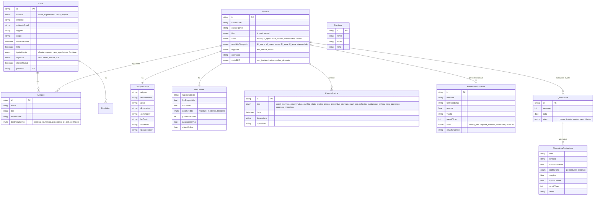

# sebi-group

**Data analisi**: 2026-03-21 (ri-analisi da branch `feat/mockup-frontend`)
**Repository locale**: `/Users/simonebrigante/LAIF/repo/sebi-group/`

---

## 1. Panoramica

Piattaforma AI-powered per la gestione di email e quotazioni nel settore spedizioni internazionali (import/export). Il cliente, Sebi Group, e' uno spedizioniere con 51-200 dipendenti che gestisce 400-700 email/giorno su ~20.000 quotazioni/anno.

**Stato**: presales (mockup frontend interattivi, nessuna logica backend custom implementata).

Il progetto e' sul branch `feat/mockup-frontend` con un sistema completo di mockup che dimostrano il flusso operativo: inbox email con classificazione AI, gestione pratiche/offerte, dashboard operativa e management, configurazione admin.

## 2. Versioni

| Componente | Versione |
|---|---|
| App | 5.7.0 |
| laif-template | 5.7.0 |

## 3. Team (git shortlog --all)

| Commits | Contributor |
|---|---|
| 289 | Pinnuz |
| 209 | mlife |
| 168 | github-actions[bot] |
| 160 | Carlo A. Venditti |
| 148 | Michele Roberti |
| 107 | Simone Brigante |
| 86 | bitbucket-pipelines |
| 85 | Marco Pinelli |
| 84 | Matteo Scalabrini |
| 62 | daniele |
| 58 | Gabriele Fogu |

*La maggior parte dei commit sono di template. Il lavoro custom mockup e' sul branch corrente.*

## 4. Modello dati CUSTOM

**Nessuna tabella custom nel database.** Il progetto e' in fase presales: il data model esiste solo come tipi TypeScript nel frontend (mockup). Il file `backend/src/app/models.py` e' vuoto (solo import config). Le 22 migrazioni sono tutte standard di template.

### Modello dati previsto (da tipi TypeScript mockup)

Il modello pianificato e' visibile in `frontend/src/features/mockup/types/index.ts`:

## 5. API routes CUSTOM

**Nessuna API custom significativa.** L'unico controller registrato in `backend/src/app/controller.py` e' il modulo `changelog` (feature di template). Il file `events.py` contiene un task di esempio commentato.

Ruoli custom definiti: solo `MANAGER` (in `backend/src/app/role.py`), in aggiunta ai ruoli template.

## 6. Logica di business CUSTOM

**Nessuna logica backend custom implementata.** Tutta la logica e' simulata nel frontend tramite:

- **MockupContext** (`frontend/src/features/mockup/store/mockupContext.tsx`, ~238 righe): stato React con azioni simulate — presa in carico email, creazione pratica, cambio stato, simulazione risposte fornitore
- **Dati mock** coerenti: 6 email + 4 pratiche + 10 fornitori + KPI + todo items

### Moduli pianificati (da KB `projects/sebi-group/README.md`)

| # | Modulo | Descrizione |
|---|---|---|
| M1 | Email Intelligence | Connessione M365, classificatore AI per tipo/area/trasporto, assegnazione automatica |
| M2 | Gestione Offerte Export | Ciclo RDO -> preventivi -> quotazione, pricing con margini, WebCargo |
| M3 | Gestione Offerte Import | Autocotazione, integrazione Osma, invio massivo, parsing risposte |
| M4 | Integrazione Gestionale | API bidirezionale Osma, anagrafiche, fido/credito |
| M5 | Dashboard & Analytics | KPI operativi e management |
| M6 | Alerting Intelligente | Alert fido, email non lavorati, solleciti |

**Stima totale**: 93-142 giorni/uomo.

## 7. Integrazioni esterne

**Nessuna integrazione implementata.** Integrazioni previste:

| Integrazione | Stato | Descrizione |
|---|---|---|
| Microsoft 365 (Graph API) | Pianificata | Lettura email da 10-15 caselle condivise |
| WebCargo | Pianificata | Quotazioni export automatiche |
| Osma (gestionale) | Pianificata | API bidirezionale, anagrafiche, fido, tariffari |

## 8. Pagine frontend CUSTOM

Il branch `feat/mockup-frontend` contiene un sistema completo di mockup interattivi (~3.300 righe di codice custom).

### Pagine (in `frontend/app/(authenticated)/(app)/mockup/`)

| Pagina | Righe | Descrizione |
|---|---|---|
| `/mockup/inbox` | 162 | Inbox email unificata multi-casella con filtri AI |
| `/mockup/pratiche` | 156 | Lista pratiche con filtri per stato, tipo, trasporto |
| `/mockup/pratiche/[id]` | 14 | Dettaglio pratica (delega a PraticaDetailClient) |
| `/mockup/dashboard` | 206 | Dashboard operativa con KPI, todo, timeline |
| `/mockup/dashboard/management` | ~160 | Dashboard management con metriche business |
| `/mockup/admin` | 284 | Configurazione: caselle, commodity, fornitori, template email |

### Componenti (in `frontend/src/features/mockup/components/`)

| Componente | Righe | Descrizione |
|---|---|---|
| `PreventiviQuotazione` | 305 | Confronto preventivi fornitori + builder quotazione con margini |
| `EmailPreview` | 297 | Preview email con badge AI, azioni rapide, presa in carico |
| `EmailList` | 257 | Lista email con filtri, badge stato, indicatori AI |
| `PraticaDetailClient` | 251 | Dettaglio pratica completo: spedizione + preventivi + timeline |
| `ComposeEmail` | 230 | Composizione email con template precompilati (RDO, sollecito, quotazione) |
| `DatiSpedizione` | 222 | Scheda dati spedizione con campi AI (confidence + source) |
| `EmailFilters` | 144 | Filtri avanzati: casella, tipo, area, trasporto, stato lettura |
| `TimelineCRM` | 147 | Timeline eventi pratica tipo CRM |
| `BadgeAI` | 123 | Badge con confidence AI + indicatore source (ai/manual) |
| `DocumentiAllegati` | 109 | Lista documenti con tipo documento e metadata |
| `ModuloERP` | 94 | Sezione push verso gestionale con stato sincronizzazione |
| `KPICard` | 35 | Card KPI riutilizzabile |
| `BadgeCasella` | 32 | Badge colorato per casella email |
| `BadgeStato` | 18 | Badge stato pratica con colori semantici |

### Navigazione custom (`applicationNavigation.tsx`)

5 voci di menu: Inbox (homepage), Pratiche, Dashboard Operativa, Dashboard Management, Configurazione.

### Concetto AIField

Ogni campo estratto dall'AI ha la struttura `AIField<T>` con:
- `value`: valore estratto
- `confidence`: 0-100 (visualizzato con colori: verde >80, giallo >50, rosso <=50)
- `source`: "ai" o "manual" (editabile dall'operatore)

## 9. Deviazioni dallo stack standard

**Nessuna deviazione significativa.** Stack template standard:
- Backend: FastAPI, SQLAlchemy, Alembic, PostgreSQL (15 file Python custom vs 196 di template)
- Frontend: Next.js con Turbopack, laif-ds, TypeScript
- Nessuna dipendenza aggiuntiva nel `pyproject.toml` o `package.json`

## 10. Pattern notabili

| Pattern | Descrizione |
|---|---|
| **Mockup-first presales** | Intero frontend mockup con dati statici e React context per simulare interazioni. Nessun backend custom. Permette demo al cliente prima dello sviluppo. |
| **AIField pattern** | Tipo generico `AIField<T>` con value/confidence/source per tracciare provenienza e affidabilita' di ogni dato estratto dall'AI. Previsto per diventare pattern backend. |
| **Multi-casella email** | Architettura inbox che aggrega 4+ caselle email condivise con filtri per casella. |
| **Preventivi comparativi** | Flusso: RDO a N fornitori -> raccolta preventivi -> normalizzazione dati -> confronto -> builder quotazione con margine percentuale o assoluto. |
| **Timeline CRM** | Ogni pratica ha una timeline di eventi tipati (email, cambi stato, push ERP, note operatore) per tracciabilita' completa. |

## 11. Debito tecnico e note

- **Nessun backend custom**: tutto il lavoro e' frontend mockup. Il passaggio a implementazione reale richiedera' creazione data model, migrazioni, API, integrazioni.
- **`siteConfig.name` ancora "Laif App"**: non personalizzato per il cliente.
- **`events.py` con task di esempio**: codice boilerplate da template, non ripulito.
- **Template email HTML**: solo `example.html` in `backend/src/app/common/email/templates/`.
- **Integrazioni critiche non avviate**: M365, Osma, WebCargo richiedono credenziali e specifiche API dal cliente.
- **Stima progetto**: 93-142 giorni/uomo totali (dettaglio in KB: `projects/sebi-group/stima-modulare.md`).
