# Sireco - Analisi Completa Repository

## 1. Overview

**Nome applicazione**: Sireco
**Descrizione**: Controllo di gestione - piattaforma CRM per studi di revisione/consulenza contabile
**Codice applicazione**: 2026013
**Settore**: Revisione contabile, controllo di gestione, consulenza finanziaria
**Cliente**: Sireco (studio di revisione/consulenza che lavora con cooperative e aziende)

L'applicazione gestisce il ciclo commerciale di uno studio di revisione: anagrafica partner (aziende clienti), contatti, lead commerciali, dati economici (bilanci, rating), collaboratori e team interni. Include funzionalita AI per analisi documentale (visure camerali, export AIDA, bilanci) e generazione di summary economici.

## 2. Versioni

| Componente | Versione |
|---|---|
| App (`version.txt`) | **0.1.6** |
| Laif Template (`version.laif-template.txt`) | **5.7.0** |
| `values.yaml` | 1.1.0 |
| Prima release | 2026-02-23 |
| Totale commit (all branches) | ~1417 |

## 3. Team (top contributors)

| Contributor | Commit |
|---|---|
| Pinnuz | 269 |
| mlife | 197 |
| github-actions[bot] | 115 |
| Simone Brigante | 92 |
| bitbucket-pipelines | 86 |
| Marco Pinelli | 85 |
| neghilowio | 75 |
| cavenditti-laif | 61 |
| Carlo A. Venditti | 50 |
| sadamicis | 49 |
| matteeeeeee | 35 |
| Matteo Scalabrini | 30 |

**Nota**: la maggior parte dei commit proviene dal template (eredita tutta la history). I commit applicativi specifici sono relativamente pochi (~8 PR/release app).

## 4. Stack e Dipendenze

### Backend (Python 3.12)

**Dipendenze standard template**:
- FastAPI + Uvicorn + Starlette
- SQLAlchemy 2.0 + Alembic + asyncpg + psycopg2
- Pydantic v2
- boto3 (AWS)
- bcrypt + passlib + python-jose (auth)
- httpx + requests
- Jinja2

**Dipendenze NON standard (specifiche app)**:
| Pacchetto | Uso |
|---|---|
| `openai~=2.21.0` | Analisi documenti con GPT-4o, generazione summary economici |
| `pgvector~=0.4.2` | Embeddings vettoriali (probabilmente per RAG/chat template) |
| `pymupdf~=1.27.1` | Parsing PDF (visure camerali, report AIDA) |
| `python-docx~=1.2.0` | Generazione/lettura documenti Word |
| `xlsxwriter~=3.2.9` | Generazione file Excel |
| `pandas~=3.0.1` | Parsing file Excel per dati economici |
| `aiohttp~=3.13.3` | Client HTTP async |

**Dependency groups**: `pdf`, `docx`, `llm`, `xlsx` (tutti abilitati di default).

### Frontend (Node >= 25)

**Dipendenze standard template**:
- Next.js 16 + React 19 + TypeScript
- Tailwind CSS 4 + laif-ds 0.2.76
- Redux Toolkit + React Query
- Playwright (testing)

**Dipendenze NON standard (specifiche app)**:
| Pacchetto | Uso |
|---|---|
| `@amcharts/amcharts5` | Grafici avanzati (probabilmente per dashboard economiche) |
| `@draft-js-plugins/editor` + `draft-js` | Rich text editor (note partner) |
| `@draft-js-plugins/mention` | Menzioni in editor |
| `draft-js-export-html` | Export HTML da editor |
| `@hello-pangea/dnd` | Drag & drop (kanban board leads) |
| `@microsoft/fetch-event-source` | SSE per streaming (chat AI template) |
| `katex` + `rehype-katex` + `remark-math` | Rendering formule matematiche |
| `react-markdown` + `remark-gfm` | Rendering markdown |
| `react-syntax-highlighter` | Syntax highlighting codice |
| `react-intl` | Internazionalizzazione |
| `framer-motion` | Animazioni UI |

### Docker Compose

Servizi standard: `db` (PostgreSQL), `backend` (FastAPI).
Nota: `ENABLE_XLSX: 1` nel build args backend.
Configurazione speciale `docker-compose.wolico.yaml` per test con rete condivisa Wolico.

## 5. Modello Dati Completo

### Schema: `prs` (applicativo)

```mermaid
erDiagram
    partners {
        int id PK
        str des_name
        str des_alias
        PartnerSector des_sector
        str des_address
        str des_zip_code
        str des_city
        str vat
        str fiscal_code
        str phone
        str email
        str website
        str pec
        str forma_giuridica
        date dat_costituzione
        date dat_chiusura_bilancio
        str des_attivita
        str cod_ateco
        str des_url
        bool flg_is_cooperativa
        int shareholders_count
        int board_members_count
        float capital_amount
        str company_status
        str des_economic_summary
        datetime tms_created
        datetime tms_updated
    }

    contacts {
        int id PK
        int id_partner FK
        str des_name
        str des_surname
        str des_role
        str des_email
        str des_phone
        datetime tms_created
        datetime tms_updated
    }

    partner_uploads {
        int id PK
        int id_partner FK
        UploadType upload_type
        str des_filename
        str des_file_hash
        str des_s3_key
        UploadStatus status
        datetime dat_uploaded_at
        datetime dat_processed_at
        str des_error_message
    }

    partner_economic_data {
        int id PK
        int id_upload FK
        int id_partner FK
        int fiscal_year
        float revenue
        float ebitda
        float net_income
        float total_assets
        float equity
        float pfn
        int employees_count
        float ebitda_margin_pct
        float equity_adjusted
        float financial_expenses
        float covenant_pfn_ebitda
        float covenant_pfn_equity
        float covenant_ebitda_interest
        float borrowing_cost_pct
        str rating_more
        str rating_more_color
        float rating_more_pd_pct
        str rating_crif
        str rating_crif_color
        float rating_crif_min
        float rating_crif_avg
        float rating_crif_max
        datetime created_at
        datetime updated_at
    }

    partner_notes {
        int id PK
        int id_partner FK
        int id_user FK
        str des_name
        str des_title
        str des_text
        datetime dat_creation
    }

    companies {
        int id PK
        str des_name
        str des_description
        str des_address
        datetime tms_created
        datetime tms_updated
    }

    leads {
        int id PK
        int id_partner FK
        int id_company FK
        int id_partner_economic_data FK
        str des_name
        LeadType type
        float amt_expected_revenue
        str des_origin
        LeadStatus status
        bool flg_upsell
        int id_user_creation FK
        Convenzione convenzione
        date dat_creation
        date dat_close
        date dat_potential_start
        LostReasons des_lost_reason
    }

    collaborators {
        int id PK
        str des_name
        str des_surname
        str email
        str phone
        int id_user FK
        CollaboratorCompensation cod_compensation
        bool flg_active
        datetime tms_created
        datetime tms_updated
    }

    partners ||--o{ contacts : "ha"
    partners ||--o{ partner_uploads : "ha"
    partners ||--o{ partner_economic_data : "ha"
    partners ||--o{ partner_notes : "ha"
    partners ||--o{ leads : "ha"
    companies ||--o{ leads : "ha"
    partner_economic_data ||--o{ leads : "riferimento"
    partner_uploads }o--|| partner_economic_data : "importato_da"
```



### Enums

| Enum | Valori |
|---|---|
| `PartnerSector` | immobiliare, industriale, commerciale, produzione_su_commessa, cooperativa |
| `LeadStatus` | proposition, won, lost |
| `LeadType` | 39, 59, 3959, pef, aup |
| `Convenzione` | UN.I.COOP., UE.COOP., A.G.C.I., CONFCOOPERATIVE |
| `LostReasons` | ghosted, pricing, timing, competition, missing_skills, other |
| `CollaboratorCompensation` | fixed, variable |
| `UploadType` | visura_camerale, aida_export, balance, quotation, contract, other |
| `UploadStatus` | pending, processing, completed, failed |

### Ruoli applicativi

- `AppRoles.MANAGER` (oltre ai ruoli template standard)

## 6. API Routes

### CRM - Partners (`/partners`)
| Metodo | Endpoint | Descrizione |
|---|---|---|
| POST | `/partners/` | Crea partner |
| GET | `/partners/search` | Ricerca partner (con full-text su nome, alias, citta, vat, contatti...) |
| GET | `/partners/{id}` | Dettaglio partner |
| PUT | `/partners/{id}` | Aggiorna partner |
| DELETE | `/partners/{id}` | Elimina partner |
| POST | `/partners/analyze-files/start` | Avvia analisi asincrona file (PDF/Excel) con AI |
| GET | `/partners/analyze-files/status/{task_id}` | Polling stato analisi |
| POST | `/partners/{id}/attach-files` | Allega file a partner (upload S3) |
| POST | `/partners/{id}/generate-economic-summary` | Genera summary economico con GPT-4o-mini |

### CRM - Contacts (`/contacts`)
CRUD standard (create, search, get_by_id, update, delete)

### CRM - Leads (`/leads`)
CRUD standard con SecurityScope

### CRM - Notes (`/notes`)
CRUD standard con SecurityScope

### CRM - Economic Data (`/partner-economic-data`)
CRUD standard + batch upsert (ultimi 3 anni per partner)

### CRM - Uploads (`/partner-uploads`)
CRUD standard + `GET /{id}/download` (genera presigned URL S3)

### Teams - Collaborators (`/collaborators`)
CRUD standard con SecurityScope

### Teams - Companies (`/companies`)
CRUD standard con SecurityScope

### Changelog (`/changelog`)
`GET /changelog/` con parametri `type` (tech/customer) e `target` (template/app)

## 7. Business Logic Significativa

### Analisi documentale AI (feature principale)
- **Parsing PDF**: usa PyMuPDF per estrarre testo, poi invia a GPT-4o per estrazione strutturata (dati anagrafici + economici + rating)
- **Parsing Excel**: usa pandas con mapping colonne italiano/inglese
- **Estrazione rating**: regex dedicati per MORE rating (A-E con colore), CRIF score, covenant ratios, indicatori finanziari
- **Task asincroni in-memory**: `AnalysisTaskManager` gestisce task con polling (no Celery, tutto in asyncio)
- **Merge multi-file**: unisce dati da piu documenti con priorita all'ultimo

### Calcolo onorari (`CalcoloOnorari`)
Logica di business specifica per revisori contabili:
- Tabelle interpolazione ore/fatturato e ore/attivo (da 2M a 2B EUR)
- Tariffe per convenzione cooperativa (UN.I.COOP., UE.COOP., A.G.C.I., CONFCOOPERATIVE)
- Calcolo onorario con riduzioni

### Generazione summary economico
- Usa GPT-4o-mini per generare riassunti (max 150 parole) del trend economico partner
- Salva il summary direttamente nel record partner

### Search full-text custom
- Ricerca su partner con filtro manuale in-memory su tutti i campi (nome, alias, citta, vat, CF, telefono, email, PEC, attivita, ATECO) + campi dei contatti associati

## 8. Integrazioni Esterne

| Servizio | Uso | Libreria |
|---|---|---|
| **OpenAI GPT-4o** | Estrazione dati da PDF (visure, AIDA) | `openai` via `template.chat.gen_ai_provider.OpenAIProvider` |
| **OpenAI GPT-4o-mini** | Generazione summary economici partner | `openai.AsyncOpenAI` diretto |
| **AWS S3** | Storage file partner (upload, visure, bilanci) | `boto3` via `template.common.utils.aws` |
| **Wolico** | Rete condivisa Docker per test integrazione | docker-compose network |

## 9. Frontend - Mappa Pagine

### CRM (home page default: `/crm/partners/`)
```
/crm/
  /crm/partners/              -- Lista partner (card view con filtri)
  /crm/contacts/              -- Lista contatti
  /crm/lead/                  -- Kanban board leads (proposition/won/lost)
  /crm/sale/                  -- Vendite (tab)
  /crm/partner-create/        -- Wizard creazione partner (3 step: Upload -> Registry -> Economic)
  /crm/partner-detail/        -- Dettaglio partner (info, contatti, documenti, economics, note)
  /crm/partner-edit/          -- Modifica partner
  /crm/lead-create/           -- Wizard creazione lead (multi-step)
  /crm/lead-detail/           -- Dettaglio lead
```

### Economics (route definite, probabilmente in sviluppo)
```
/economics/
  /economics/revenues/                    -- Ricavi
  /economics/revenues/invoices-to-issue/  -- Fatture da emettere
  /economics/revenues/expiring-recurring/ -- Ricorrenti in scadenza
  /economics/sales/                       -- Vendite
  /economics/cash/                        -- Cash flow
  /economics/cash/credit-recovery/        -- Recupero crediti
  /economics/balance/                     -- Bilancio
```

### Teams
```
/teams/
  /teams/collaborators/  -- Gestione collaboratori
  /teams/companies/      -- Gestione societa interne
```

### Template (ereditati)
- `/conversation/` - Chat AI, analytics, knowledge base, feedback
- `/user-management/` - Utenti, ruoli, permessi, gruppi
- `/help/` - Ticketing, FAQ
- `/changelog-technical/`, `/changelog-customer/`

## 10. Deviazioni dal Template

### File/cartelle NON standard
| Path | Descrizione |
|---|---|
| `featuresMock/` | ~99 file di mock frontend (CRM, economics, changelog) - prototipazione pre-implementazione |
| `featuresMock/economics/` | Mock completi per modulo economics (revenues, cash, sales, credit recovery, forecast) |
| `featuresMock/crm/sale/` | Mock per vendite |
| `docker-compose.wolico.yaml` | Rete condivisa con Wolico per test integrazione |
| `backend/src/app/crm/partners/analysis_task.py` | Task manager in-memory custom |
| `backend/src/app/crm/partners/utils.py` | Parsing AI documenti con regex + OpenAI |
| `backend/src/app/crm/leads/offer.py` | Logica calcolo onorari revisione |
| `backend/src/app/changelog/` | Gestione changelog custom (docs markdown serviti via API) |

### Deviazioni architetturali
- **Security disabilitata su molti controller**: Partner, Uploads, Economic Data hanno le SecurityScope commentate
- **Search in-memory**: la ricerca partner fa filter in Python anziche in SQL
- **Task asincroni in-memory**: nessun broker (Celery/Redis), tutto in dict Python
- **Due provider OpenAI**: uno via template (`OpenAIProvider`), uno diretto (`AsyncOpenAI`)
- **Modulo Economics**: definito nella navigazione frontend ma non implementato nel backend (solo mock)

## 11. Pattern Notevoli

1. **AI Document Pipeline**: upload file -> parsing (PDF con PyMuPDF / Excel con pandas) -> estrazione strutturata con GPT-4o -> merge multi-file -> salvataggio. Pattern ibrido AI + regex per rating finanziari.

2. **Kanban Board Leads**: frontend con drag-and-drop (`@hello-pangea/dnd`) per gestione pipeline commerciale (proposition -> won/lost).

3. **Calcolo onorari parametrico**: tabelle di interpolazione lineare basate su soglie fatturato/attivo con tariffe per convenzione cooperativa. Logica di dominio molto specifica.

4. **Rich Text Editor**: Draft.js con plugin menzioni per note partner.

5. **Prospect workflow**: wizard multi-step per creazione partner da documenti (visura camerale / report AIDA), con estrazione automatica dati anagrafici ed economici.

## 12. Note e Tech Debt

### Tech Debt
- **Search in-memory**: `PartnerService.read_items()` fa fetch di tutti i partner e filtra in Python. Non scalabile.
- **Print statements ovunque**: il service e utils di parsing sono pieni di `print()` di debug (dovrebbero essere `logger.debug()`)
- **Task in-memory**: l'`AnalysisTaskManager` usa un dict in memoria, quindi i task si perdono al restart. Non adatto a multi-worker.
- **SecurityScope commentate**: i controller partner, uploads e economic data non hanno security. Potenziale problema di sicurezza.
- **Codice duplicato**: `analyze_files()` e `_analyze_files_worker()` nel PartnerService contengono la stessa logica di costruzione PartnerSchema/EconomicDataSchema (duplicata 2 volte).
- **Modulo Economics**: route frontend definite, mock presenti, ma backend non implementato.
- **`featuresMock/`**: 99 file di mock che probabilmente dovrebbero essere ripuliti o spostati.
- **ApplicationPermissions**: contiene solo `TODO = "todo:todo"` - permissions non implementate.

### Peculiarita
- Il progetto e molto giovane (prima release 2026-02-23, solo 6 release app)
- Focus forte su cooperative (convenzioni UN.I.COOP., UE.COOP., ecc.) e revisione contabile (tipo lead 39, 59, 3959 = riferimenti normativi)
- `LeadType` con valori `39`, `59`, `3959`, `pef`, `aup` - sono riferimenti a tipi di incarico di revisione/audit
- Integrazione con dati AIDA (Bureau van Dijk) e CRIF per rating creditizio
- Board members estratti da PDF con cleaning automatico titoli (Sig., Dott., Avv., ecc.)
