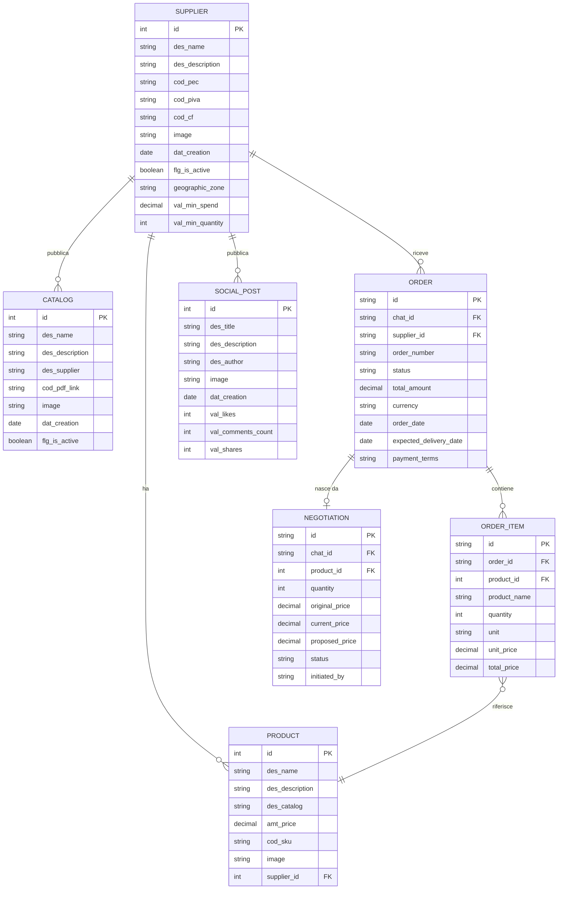

# Supplynk

## 1. Overview

**Cosa fa**: Piattaforma B2B AI-assisted per il settore Horeca / Food & Beverage. Digitalizza il processo di approvvigionamento sostituendo la figura tradizionale del rappresentante di commercio con un agente AI che gestisce matching fornitore-cliente, cataloghi, negoziazione e ordini.

**Cliente**: Supplynk S.r.l. (Startup Innovativa, CEO Ludovico D'Amato)

**Industria**: Horeca / Food & Beverage — Supply Chain B2B

**Stato**: MVP in sviluppo attivo (v0.1.14). Demo per fiera completata (marzo 2026). Fase di prototipazione/sviluppo MVP.

**Codice progetto**: 2026028

**Budget**: 42.000 EUR (sviluppo) + ~500 EUR/mese (infra)

---

## 2. Versioni

| Componente | Versione |
|---|---|
| App | 0.1.14 |
| laif-template | 5.6.2 |
| laif-ds | 0.2.72 |
| Node.js | >=25.0.0 |
| Python | >=3.12, <3.13 |

---

## 3. Team

| Commits | Autore |
|---|---|
| 269 | Pinnuz |
| 196 | mlife |
| 117 | github-actions[bot] |
| 92 | Simone Brigante |
| 86 | bitbucket-pipelines |
| 85 | Marco Pinelli |
| 67 | neghilowio |
| 54 | cavenditti-laif |
| 49 | sadamicis |
| 47 | Carlo A. Venditti |
| 47 | angelolongano |
| 28 | Daniele DN |
| 23 | lorenzoTonetta |
| 21 | Matteo Scalabrini |
| 21 | matteeeeeee |
| 20 | SimoneBriganteLaif |
| 19 | mlaif |
| 17 | Daniele DalleN |
| 17 | Marco Vita |
| 13 | Angelo Longano |
| 12 | Federico Frasca |

Team ampio con molti contributori (tipico di template fork con sviluppo distribuito). I commit di Pinnuz e mlife dominano lo sviluppo attivo.

---

## 4. Modello dati CUSTOM

**Stato attuale: NESSUNA tabella custom.** Il backend non ha modelli dati applicativi: `backend/src/app/models.py` importa solo le settings, non definisce tabelle. Tutte le migrazioni Alembic (22 file) sono di template. Il frontend usa interamente **dati mock** (file JSON/TS statici).

Il data model previsto (da mockData e documentazione) sara':

**Nota**: questo e' il modello derivato dai mock, non ancora implementato in DB.

---

## 5. API routes CUSTOM

L'unico controller custom e' **changelog**:

| Metodo | Endpoint | Descrizione |
|---|---|---|
| GET | `/changelog/` | Restituisce contenuto changelog (tech o customer, template o app) |

**Nessun endpoint custom per il dominio applicativo** (suppliers, products, orders, catalogs). Tutto il frontend lavora con dati mock.

---

## 6. Business logic CUSTOM

### Background tasks
Nessun task attivo. Esiste solo un `_send_example_task` di template (commentato, non registrato).

### AI/Agent
- **Agent conversazionale**: UI frontend presente con chat AI (usa il modulo template `conversation/chat`), con logica differenziata per ruolo (Supplier vs Manager)
- **Matching AI**: previsto ma non ancora implementato lato backend
- **Import cataloghi AI**: previsto (estrazione automatica da PDF/Excel/Word), non ancora implementato
- **Ricerca semantica**: prevista, non ancora implementata

### Negoziazione
Logica di negoziazione prezzi tra buyer e supplier implementata solo lato frontend con mock (stati: pending, counter_offer, accepted, rejected, completed).

### Pagamenti
Dialog di pagamento simulato (mock Stripe) nel frontend. Pagamenti fuori piattaforma nel design finale.

---

## 7. Integrazioni esterne

**Nessuna integrazione custom implementata.** Previste:
- OpenAI/Anthropic (LLM per matching e cataloghi) — usa il modulo template conversation
- AWS S3 (file storage) — via template
- Potenziale Stripe/PayPal/Satispay (escluso da scope MVP)

---

## 8. Pagine frontend CUSTOM

Progetto con frontend ricco, interamente basato su mock data:

| Pagina | Descrizione |
|---|---|
| `/home/` | Homepage differenziata per ruolo (Supplier, Manager, Admin) con AI search bar, stats, quick actions |
| `/agent/` | Chat AI conversazionale con web search toggle, conversazioni mock |
| `/products/` | Catalogo prodotti con dettaglio, specifiche tecniche |
| `/catalogs/` | Lista cataloghi fornitori con dettaglio |
| `/suppliers/` | Lista fornitori con dettaglio (info, cataloghi, prodotti, social) |
| `/my-suppliers/` | Profilo del proprio fornitore (info, cataloghi, prodotti, social) con editing |
| `/orders/` | Lista ordini con dettaglio, stepper stati, dialog pagamento |
| `/chat/` | Chat privata fornitore-cliente con pannello negoziazione |
| `/social/` | Feed social con post, like, commenti |
| `/signup/` | Registrazione con selezione ruolo (manager/producer) |
| Landing page | Pagina pubblica completa: hero, how it works, benefits, AI catalog demo, trust, CTA |
| `/changelog-customer/` | Changelog per clienti |
| `/changelog-technical/` | Changelog tecnico |

### Ruoli applicativi
- **AdminLaif** / **Admin**: dashboard amministrativa
- **Manage** (gestore): vista buyer/manager
- **Supplier** (fornitore): gestione profilo, catalogo, ordini ricevuti
- **User**: utente base

### Store Redux custom
`product`, `catalog`, `supplier`, `chat`, `mySupplier`, `agent`

---

## 9. Deviazioni dallo stack

| Area | Deviazione |
|---|---|
| Nessun modello DB custom | Tutto il frontend lavora con mock data statici — non c'e' nessun backend applicativo |
| Nessun controller custom (oltre changelog) | Le API di dominio non esistono ancora |
| Node.js >=25 | Versione molto recente |

Dipendenze standard di template, nessuna dipendenza esterna aggiuntiva significativa.

---

## 10. Pattern notevoli

- **Mock-first development**: l'intero frontend e' stato sviluppato con dati mock prima di costruire il backend. Approccio utile per demo/fiera ma crea debito tecnico nel collegamento futuro.
- **Role-based UI differentiation**: homepage e agent cambiano completamente in base al ruolo corrente, con lazy loading dei widget.
- **Landing page come showcase**: pagina pubblica ricca con sezioni AI demo (estrazione prodotti da catalogo simulata), trust signals, dual-target (fornitori + gestori).
- **Negoziazione in-chat**: pannello negoziazione integrato nella chat con storico offerte/contro-offerte.
- **Changelog come feature**: controller custom per servire changelog differenziati (tech/customer, template/app).

---

## 11. Debito tecnico e note

### Debito tecnico critico
- **Nessun backend applicativo**: tutti i dati sono mock. Il 100% del data layer (modelli, migrazioni, API CRUD, servizi) deve ancora essere sviluppato. E' il gap piu' grande del progetto.
- **Mock data hardcoded ovunque**: ~20 file di mock data con fornitori (Kombru, Mulino Rovey, Nuova Alba, Guido 1860, ecc.), prodotti, ordini, negoziazioni, social. Al collegamento con il backend reale, tutto questo codice dovra' essere sostituito con chiamate API.
- **Logica di pagamento simulata**: dialog Stripe finto nel frontend.
- **Signup commentato**: la registrazione non chiama API reali (tutto commentato).

### Note
- Progetto molto giovane (prima release: 2 marzo 2026, 20 giorni fa)
- 14 release in 20 giorni = ritmo veloce di iterazione UI/demo
- La demo per la fiera (11-13 marzo) era l'obiettivo primario — raggiunto con frontend mock
- Il lavoro vero di backend (modelli, API, integrazioni AI) deve ancora iniziare
- Documentazione contrattuale completa e dettagliata in `docs/contract/`
- Il modulo AI piu' critico (import cataloghi multi-formato) e' stimato separatamente (+5.000 EUR)
- Target utenti a bassa alfabetizzazione digitale = forte enfasi su semplicita' UX
