# Analisi Completa: umbra-recommend

## 1. Overview

**Cosa fa**: Piattaforma di raccomandazione prodotti per la rete vendita (agenti commerciali) di Umbra Group, settore distribuzione materiale odontoiatrico. Il sistema utilizza modelli ML (CatBoost) per predire quantita di vendita, probabilita di acquisto e rischio out-of-stock (OOS) a livello cliente-articolo. Include segmentazione clienti con clustering e dashboard operative per agenti, area manager e marketing. Gestisce anche promozioni WOW tramite canvass settimanali.

**Cliente**: Umbra Group (distribuzione materiale odontoiatrico B2B)

**Descrizione funzionale**:
- Predizione vendite mensili per coppia cliente-articolo (3 modelli CatBoost: quantita, periodo, buy/no-buy)
- Calcolo priorita OOS (out-of-stock) e mesi prima dell'esaurimento
- Segmentazione clienti RFM-like (superloyal, loyal, opportunity, uncommitted, lapsing, gone)
- Dashboard operativa per agenti con suggerimenti personalizzati per cliente
- Dashboard marketing con aggregazione per fornitore/marchio/classe/sottoclasse
- Vista macro-operativa con suggerimenti aggregati
- Storico segmentazione clienti (fino a 24 mesi)
- Clienti borderline per segmento per agente
- Trendlines venduto vs suggerito per articolo nel tempo
- Storico attivita agente
- Export Excel per tutte le viste principali
- Gestione relazione utenti-codici agente (multi-agente per utente)
- ETL pipeline: staging FTPS/S3 -> trasformazione -> training -> inferenza -> segmentazione -> presentazione
- Aggiornamento settimanale promozioni WOW (canvass) via pipeline ridotta
- Export risultati modello su FTPS e S3 per sistemi esterni

## 2. Versioni

| Componente | Versione |
|---|---|
| App (`version.txt`) | 1.5.0 |
| laif-template (`version.laif-template.txt`) | 5.4.0 |

## 3. Team

| Contributore | Commit |
|---|---|
| Pinnuz | 259 |
| mlife | 212 |
| Simone Brigante | 128 |
| github-actions[bot] | 113 |
| bitbucket-pipelines | 86 |
| Marco Pinelli | 85 |
| neghilowio | 66 |
| cavenditti-laif | 50 |
| sadamicis | 49 |
| Carlo A. Venditti | 31 |
| Daniele DN | 28 |
| luca-stendardo | 26 |
| mlaif | 25 |
| lorenzoTonetta | 22 |
| Matteo Scalabrini | 21 |
| SimoneBriganteLaif | 20 |
| angelolongano | 18 |
| Marco Vita | 17 |
| Daniele DalleN | 15 |
| Carlo Antonio Venditti | 11 |
| Federico Frasca | 11 |
| Angelo Longano | 10 |
| Luca Stendardo | 10 |
| kri-p | 8 |
| matteeeeeee | 8 |
| tancredibosi / TancrediBosi | 13 |
| Roberto | 5 |
| Altri (< 5 commit) | ~15 |

**Contributori principali**: Pinnuz (ML/ETL), mlife (ML), Simone Brigante, Marco Pinelli, neghilowio, cavenditti-laif

## 4. Modello dati CUSTOM

Tutte le tabelle custom sono nello schema `prs` (presentazione). L'ETL usa anche schemi intermedi (`stg`, `trn`, `infer`, `temp`) gestiti solo dal processo ETL.

### Tabelle schema `prs` (14 tabelle)

| Tabella | Descrizione | Righe stimate |
|---|---|---|
| `lookup_agenti` | Anagrafica agenti con area manager, regione, ruolo | - |
| `agent_code_user_relations` | Relazione N:M tra utenti template e codici agente | FK -> users, lookup_agenti |
| `data_entry` | Inserimenti manuali agente (dismiss articoli con data e tipo) | - |
| `latest_model_results` | Risultati ultimo run modello (predizioni per cliente-articolo) | tabella principale |
| `predictions` | Storico predizioni raw da inferenza (partitioned by actual_date) | - |
| `suggestions_details` | Suggerimenti dettagliati per agente-cliente-articolo | - |
| `suggestions_macro` | Suggerimenti aggregati per cliente-classe-marchio | - |
| `model_performance_by_month` | Performance modello per mese (precision, MAE) | - |
| `model_performance_by_segment` | Performance modello per segmento | - |
| `model_result_in_time_by_item` | Storico venduto vs suggerito per articolo nel tempo | - |
| `borderline_clients_per_segment_by_agent` | Clienti ai bordi di ogni segmento per agente | - |
| `latest_segmentation_metrics` | Metriche segmentazione corrente per cliente | - |
| `segmentation_history_metrics` | Storico segmentazione fino a 24 mesi (colonne _00.._23) | - |

### Tabelle schema `stg` (staging, ETL-only)

| Tabella | Origine |
|---|---|
| `agenti` | agenti.csv via FTPS |
| `catalogo` | catalogo.csv |
| `clienti` | clienti.csv |
| `ordini` | ordini.csv |
| `sconti` | sconti.csv |
| `classe_sottoclasse` | classe_Sottoclasse.csv |
| `prodotti_in_canvass` | ProdottiInCanvass.csv |
| `fornitori` | fornitori.csv |

### Diagramma ER (schema `prs`)

```mermaid
erDiagram
    LOOKUP_AGENTI {
        int id PK
        string cod_area_manager
        string id_agente_rel
        string cod_agente
        string des_agente
        enum ruolo "AGENTE | AREA-MANAGER"
        string email
        string cod_regione
        string des_regione
    }

    AGENT_CODE_USER_RELATIONS {
        int id PK
        int user_id FK
        int lookup_agente_id FK
    }

    USERS_template {
        int id PK
    }

    DATA_ENTRY {
        int id PK
        string cod_agente
        string cod_cliente
        string ragione_sociale
        string cod_classe
        string cod_sotto_classe
        string cod_articolo
        date dismiss_date
        int dismiss_type
        date actual_date
    }

    LATEST_MODEL_RESULTS {
        int id PK
        string timestamp_run
        string cod_cliente
        string cod_agente
        string cod_articolo
        string cod_classe
        string cod_sotto_classe
        string cod_marchio
        string cod_fornitore
        float pred_val_venduta
        float prezzo
        float pred_val_importo
        bool next_month_buy
        float gg_before_oos
        int oos_priority
        date actual_date
        float next_buy_prob
        int months_before_oos
        string cod_validita
        string des_canvass
    }

    PREDICTIONS {
        string actual_date PK
        string id PK
        string cod_cliente
        string cod_articolo
        float next_quantity_pred
        float next_period_pred
        bool next_buy_pred
        float next_buy_prob
        float gg_before_oos
        int oos_priority
        float months_before_oos
    }

    SUGGESTIONS_DETAILS {
        int id PK
        string cod_cliente
        string cod_agente
        string cod_articolo
        float pred_val_venduta
        float pred_val_importo
        float next_buy_prob
        int months_before_oos
        string des_canvass
        bool flg_interacted
    }

    SUGGESTIONS_MACRO {
        int id PK
        string cod_cliente
        string cod_agente
        string cod_classe
        string cod_marchio
        float pred_val_venduta
        float pred_val_importo
        int oos_priority
        int n_skus
    }

    MODEL_PERFORMANCE_BY_MONTH {
        int id PK
        date year_month
        bool perf_type_flag
        float precision
        float true_missing
        float mean_abs_error
    }

    MODEL_PERFORMANCE_BY_SEGMENT {
        int id PK
        string segment
        int segment_value
        float precision
        float mean_abs_error
    }

    MODEL_RESULT_IN_TIME_BY_ITEM {
        int id PK
        date year_month
        string cod_articolo
        int sold
        int suggested
    }

    BORDERLINE_CLIENTS {
        int id PK
        string cod_cliente
        string segment_desc
        int segment_value
        string cod_agente
        string borderline_desc
        int orders
        float spend
    }

    LATEST_SEGMENTATION_METRICS {
        int id PK
        string cod_cliente
        int orders
        float spend
        string segment
        string segment_desc
        int segment_value
        string cod_agente
    }

    SEGMENTATION_HISTORY_METRICS {
        int id PK
        string cod_cliente
        string segment_desc_00
        float segment_value_00
        string segment_desc_23
        float segment_value_23
    }

    AGENT_CODE_USER_RELATIONS ||--o{ USERS_template : "user_id"
    AGENT_CODE_USER_RELATIONS ||--o{ LOOKUP_AGENTI : "lookup_agente_id"
```

## 5. API routes CUSTOM

| Modulo | Prefix | Metodi principali | Note |
|---|---|---|---|
| `distinct` | `/distinct/*` | GET agents, articles, brands, classes, subclasses, suppliers | Ricerche filtrate per autocomplete UI |
| `suggestion_detail` | `/suggestion_details` | SEARCH, UPDATE + POST export | Suggerimenti dettagliati per agente, con export Excel |
| `suggestion_macro` | `/suggestion_macro` | SEARCH + POST export | Suggerimenti aggregati, con export Excel |
| `data_entry` | `/data-entry` | SEARCH, CREATE + POST export | Inserimento manuale dismiss articoli |
| `latest_model_result` | `/latest-model-result` | POST aggregate-by-column/{group_by} + POST export | Tabella marketing con aggregazione dinamica |
| `model_result_by_item` | `/model_result_by_item` | SEARCH | Storico venduto vs suggerito per articolo |
| `borderline_clients` | `/borderline_clients_per_segment_by_agent` | SEARCH + POST export/{segment_desc} | Clienti borderline per segmento |
| `agent_code_user_relation` | `/agent-code-user-relation` | CRUD + GET users-with-agents + POST assign | Gestione mapping utente-agente |
| `lookup_agenti` | `/lookup-agenti` | SEARCH + GET unattached_codes | Anagrafica agenti |
| `etl` | `/etl` | GET execute, GET {id}/complete, GET {id}/kill | Trigger e gestione run ETL |
| `changelog` | `/changelog` | GET / | Changelog tecnico e customer |

Totale: **11 controller custom**, la maggior parte usa `RoleBasedCRUDService` + `generate_crud_routes` del template.

## 6. Business logic CUSTOM

### Pipeline ML/ETL (modulo `etl/`)

Pipeline in 6 step, eseguita su ECS (AWS) come task separato dal backend:

1. **Staging**: download CSV da FTPS (8 file: ordini, sconti, agenti, catalogo, classe_sottoclasse, ProdottiInCanvass, clienti, fornitori) -> caricamento in schema `stg`
2. **Transformation**: aggregazione ordini per mese, creazione features temporali (schema `trn`)
3. **Training**: addestramento 3 modelli CatBoost:
   - `CatBoostRegressor` per quantita (`next_quantity`)
   - `CatBoostRegressor` per periodo (`next_period` in mesi)
   - `CatBoostClassifier` + `CalibratedClassifierCV` per probabilita acquisto (`next_buy`)
4. **Inference**: caricamento modelli pickle, predizioni su dataset test, calcolo `gg_before_oos`, `months_before_oos`, `oos_priority`
5. **Segmentation**: segmentazione clienti RFM-like con `StandardScaler`, assegnazione a 6 segmenti (superloyal -> gone), calcolo distanze borderline
6. **Presentation**: SQL mega-query per popolare tabelle `prs.*`, export CSV su S3 + FTPS

### Scheduling

- **Mensile** (giorno 2 del mese, ore 10): pipeline completa (tutti i 6 step)
- **Settimanale** (domenica, ore 10): pipeline ridotta (solo staging + presentation) per aggiornamento promozioni canvass/WOW
- Implementato con `@repeat_every(seconds=3600)` nel controller ETL

### Promozioni WOW / Canvass

- Tabella `stg.prodotti_in_canvass` (file `ProdottiInCanvass.csv`) contiene i prodotti in promozione
- La pipeline settimanale aggiorna solo `des_canvass` nelle tabelle di presentazione tramite `prs_promo_update.sql`
- I prodotti in canvass vengono evidenziati nella UI agente

### Export dati

- Export risultati modello in CSV su S3 (`shared/output/`) e FTPS (`/OUT/`) per integrazione con sistemi esterni
- Export Excel da UI per suggerimenti, data entry, clienti borderline, tabella marketing

## 7. Integrazioni esterne

| Servizio | Tipo | Utilizzo |
|---|---|---|
| **FTPS** (server Umbra) | Input/Output | Download CSV dati grezzi (8 file) da `/IN`, upload risultati modello su `/OUT`. TLS session reuse custom. |
| **AWS S3** | Storage | Bucket `{mode}-umbra-recommend-data-bucket` per file processati e output condiviso |
| **AWS ECS** | Compute | Cluster `{mode}-umbra-recommend-etl-cluster` per esecuzione pipeline ETL su EC2 via capacity provider |
| **AWS SSM Parameter Store** | Secrets | Credenziali FTPS e DB |
| **AWS Auto Scaling** | Infra | Scaling a 0 dell'ASG ETL dopo completamento task |

## 8. Pagine frontend CUSTOM

| Pagina | Route | Permessi | Descrizione |
|---|---|---|---|
| Agent Operational | `/agent-operational/` | tutti | Dashboard principale agente: suggerimenti per cliente-articolo |
| Marketing Operational | `/marketing-operational/` | `marketing:read` | Tabella marketing con aggregazione dinamica per fornitore/marchio/classe |
| Macro Operational | `/macro-operational/` | tutti | Vista suggerimenti aggregati |
| Agent Activity History | `/agent-activity-history/` | `agent_activity_history:read` | Storico attivita agente |
| Trendlines | `/trendlines/` | `trendlines:read` | Grafici venduto vs suggerito per articolo nel tempo |
| Agent Segmentation | `/agent-segmentation/` | tutti | Segmentazione clienti con storico e borderline |
| Agent Codes | `/agent-codes/` | `agent_codes:read` | Gestione mapping utente-codice agente |
| Changelog (Customer + Technical) | via template | - | Due varianti changelog |

**Home page di default**: `/agent-operational`
**Tema**: dark

**Widget custom**: `AgentSelect`, `ArticleSelect`, `GenericTable`, `TablePagination`
**Componenti custom**: `Ahime`, `DebouncedInput`, `HeaderSrcComponentMap`, `Logos`, `table-header-filters`

## 9. Stack e dipendenze NON standard

### ETL (`etl/src/requirements.txt`)

| Dipendenza | Versione | Motivo |
|---|---|---|
| **catboost** | 1.2.3 | Modelli ML (regressor + classifier) |
| **pandas** | 2.2.2 | Manipolazione dati ETL |
| **scikit-learn** | 1.4.2 | CalibratedClassifierCV, StandardScaler, train_test_split |
| **statsmodels** | 0.14.2 | Analisi statistica |
| **networkx** | 3.2.1 | Analisi grafi (probabilmente segmentazione) |
| **openpyxl** | 3.1.5 | Generazione Excel |
| **python-Levenshtein** | 0.25.1 | Fuzzy matching nomi |
| **joblib** | 1.4.2 | Serializzazione modelli |
| **jsonargparse** | 4.27.4 | Parsing argomenti CLI |

### Backend

- Dipendenze standard laif-template (FastAPI, SQLAlchemy, boto3, etc.)
- **Nessuna dipendenza ML nel backend** (l'ETL gira su ECS separato)
- XLSX export abilitato (`ENABLE_XLSX: 1` nel docker-compose)

### Infrastruttura

- ETL su **ECS con capacity provider** (EC2, non Fargate) con ASG dedicato
- Pipeline schedulata dal backend via `@repeat_every` (polling orario)
- Backend chiama `ecs:RunTask` per avviare ETL, ETL chiama backend callback per completare run

## 10. Pattern notevoli

| Pattern | Descrizione |
|---|---|
| **ETL-as-ECS-task** | Backend triggera ETL come task ECS separato, con callback HTTP per segnalare completamento. Run tracciato in `RunTask` del template. |
| **FTPS con TLS session reuse** | Classe custom `_ReusedSessionFTP_TLS` per gestire server FTPS che richiedono riuso sessione TLS sul data channel. |
| **Pipeline full vs weekly** | Flag `flg_weekly` discrimina tra pipeline completa (mensile, 6 step) e ridotta (settimanale, solo staging + presentation per aggiornamento promozioni). |
| **RoleBasedCRUDService everywhere** | Quasi tutti i controller usano `RoleBasedCRUDService` + `generate_crud_routes` del template per CRUD standard. |
| **Segmentazione RFM custom** | Classe `Segmentation` con assegnazione a 6 livelli basata su terzili (orders, spend_x_order, items_x_order, skus, cats) e calcolo distanze borderline. |
| **Aggregazione dinamica** | Endpoint marketing con `group_by` parametrico (path param con `|` separator) per aggregare risultati modello per colonne diverse. |
| **Export multi-canale** | Risultati esportati sia su S3 che su FTPS per consumo da sistemi esterni. |
| **Storico segmentazione denormalizzato** | Tabella `segmentation_history_metrics` con 24 coppie di colonne `(segment_desc_XX, segment_value_XX)` per tracking mensile. |

## 11. Debito tecnico e note

- **Storico segmentazione denormalizzato**: 24 coppie di colonne hardcoded (`_00` a `_23`) invece di tabella normalizzata con riga per mese. Limita l'estensibilita.
- **SQL injection potenziale**: `export_to_sftp.py` usa f-string per costruire query SQL con `last_timestamp_run` (non parametrizzato).
- **Scheduling fragile**: il polling orario `@repeat_every(seconds=3600)` nel controller backend per schedulare ETL potrebbe perdere finestre se il backend si riavvia. Nessun meccanismo di retry o lock distribuito.
- **Nessun test ETL**: la cartella `etl/src/test/` non contiene test significativi.
- **Modelli serializzati con pickle**: i modelli CatBoost sono salvati come `.cbm` e `.pkl` su filesystem locale dell'ECS task. Nessun model registry o versioning formale.
- **Commenti e codice commentato**: `presentation/execute.py` ha ampie sezioni commentate (row permissions, trigger users), indicando funzionalita dismesse ma non rimosse.
- **24 migrazioni Alembic**: storia migratoria significativa.
- **Ruolo custom singolo**: solo `AppRoles.MANAGER` in aggiunta ai ruoli template. Due ruoli agente in enum separato (`AGENTE`, `AREA-MANAGER`).
- **Prompt M2W**: presente `prompt_M2W.md` con piano per convertire predizioni da granularita mensile a settimanale (non ancora implementato a livello di modello).

## 12. Metriche codebase

| Area | File Python/TS | LOC principali |
|---|---|---|
| ETL (`etl/src/`) | 57 .py | ~2050 LOC nei file principali |
| Backend custom (`backend/src/app/`) | 52 .py | ~352 LOC solo models.py |
| Frontend custom (`frontend/src/`) | 71 .ts/.tsx | 8 feature pages + 5 widget |
