# Wolico -- Analisi Completa

## 1. Overview

**Wolico** e' il tool interno principale di LAIF. Si tratta di una piattaforma gestionale centralizzata che copre molteplici funzioni aziendali:

- **CRM**: gestione partner (clienti/fornitori), lead, vendite, contatti, note
- **Economics**: ricavi, fatturazione, cash flow, EBITDA, marginalita'
- **Operations**: reporting ore, staffing, ferie/assenze, presenze in ufficio, costi cloud AWS
- **Ticketing**: sistema centralizzato di ticketing cross-applicazione (Wolico riceve ticket da tutte le app LAIF)
- **Monitoring applicazioni**: scansione automatica di tutte le app LAIF (health check, stato infrastruttura)
- **Amministrazione**: note spese, recap mensile dipendenti
- **Integrazione Odoo**: sync dati contabili (fatture, pagamenti, partner, estratti conto)

**Cliente**: LAIF stessa (tool interno)
**Industry**: Software / Consulenza IT

---

## 2. Versioni

| Campo | Valore |
|---|---|
| **Versione applicazione** | `7.1.0` (da `version.txt`) |
| **Versione in values.yaml** | `1.1.0` |
| **Versione laif-template** | `5.7.0` (da `version.laif-template.txt`) |
| **laif-ds (frontend)** | `0.2.76` |

---

## 3. Team

Top contributor (tutti i branch):

| Commits | Contributor |
|---|---|
| 691 | mlife |
| 273 | Pinnuz |
| 187 | github-actions[bot] |
| 173 | mlaif |
| 162 | Simone Brigante |
| 140 | bitbucket-pipelines |
| 85 | Marco Pinelli |
| 76 | neghilowio |
| 61 | cavenditti-laif |
| 51 | Marco Vita |
| 50 | Carlo A. Venditti |
| 49 | sadamicis |
| 35 | matteeeeeee |
| 33 | angelolongano |
| 30 | Matteo Scalabrini |

Totale contributor: **41** -- il progetto piu' sviluppato e con piu' persone coinvolte nell'ecosistema LAIF.

---

## 4. Stack e Dipendenze

### Backend (Python 3.12, FastAPI)

**Dipendenze standard template:**
- FastAPI, Uvicorn, SQLAlchemy 2, Alembic, Pydantic v2
- asyncpg, psycopg2-binary
- boto3, httpx, requests
- bcrypt, passlib, python-jose, PyJWT, cryptography

**Dipendenze NON standard (specifiche Wolico):**

| Dipendenza | Uso |
|---|---|
| `aiohttp` | Client HTTP asincrono |
| `holidays` | Calcolo festivita' italiane (per calendario lavorativo) |
| `ruamel-yaml` | Parsing YAML avanzato (per gestione infra) |
| `pandas` + `xlsxwriter` | Generazione report Excel |
| `pymupdf` | Gestione PDF |
| `python-docx` | Generazione documenti Word |
| `openai` | Integrazione LLM (dependency group opzionale) |
| `pgvector` | Vettori per embedding in PostgreSQL |

**Dependency groups opzionali**: `pdf`, `llm`, `docx`, `xlsx` (tutti abilitati di default).

### Frontend (Next.js 16, React 19, TypeScript)

**Dipendenze NON standard:**

| Dipendenza | Uso |
|---|---|
| `@amcharts/amcharts5` | Grafici avanzati (economics, cloud costs, reporting) |
| `@draft-js-plugins/editor` + `draft-js` | Editor rich text (note, messaggi) |
| `@draft-js-plugins/mention` | Menzioni utenti nei messaggi |
| `@ducanh2912/next-pwa` | Progressive Web App |
| `@hello-pangea/dnd` | Drag and drop (staffing, kanban?) |
| `@microsoft/fetch-event-source` | Server-Sent Events (chat/streaming LLM) |
| `draft-js-export-html` | Export HTML da editor |
| `katex` + `rehype-katex` + `remark-math` | Rendering formule matematiche (chat AI) |
| `react-markdown` + `react-syntax-highlighter` | Rendering markdown (chat AI, changelog) |

### Docker Compose

Servizi: `db` (PostgreSQL), `backend` (FastAPI). Build arg `ENABLE_XLSX=1`.
Un docker-compose aggiuntivo `docker-compose.wolico.yaml` aggiunge una rete condivisa `wolico_shared_network` per testing locale cross-app.

---

## 5. Data Model Completo

Lo schema applicativo e' `prs`. Tutte le tabelle custom sono in questo schema. Il template usa lo schema `template`.

### Tabelle (37 tabelle custom + template)

#### CRM / Partner

| Tabella | Colonne principali |
|---|---|
| `countries` | id, id_odoo, name, code |
| `provinces` | id, id_odoo, name, code |
| `partners` | id, id_odoo, odoo_supplier_category, name, alias, flg_customer, flg_supplier, address, zip_code, city, id_province (FK), id_country (FK), sector (PartnerSector), vat, fiscal_code, phone, email, website, sdi, pec |
| `contacts` | id, id_partner (FK), des_name, des_surname, des_role, des_email, des_phone |
| `tags` | id, name |
| `lead_origins` | id, name |
| `leads` | id, id_partner (FK), company (Companies), name, amt_expected_revenue, id_origin (FK), status (LeadStatus), cod_project, cod_application, link_sharepoint, flg_recurrent, flg_upsell, id_user_creation (FK users), dat_creation, dat_close, dat_potential_start, des_lost_reason (LostReasons), des_lost_reason_description |
| `lead_status_updates` | id, id_lead (FK), status, dat_update, id_user_update (FK), des_note |
| `lead_tags` | id, id_lead (FK), id_tag (FK) -- M2M |
| `notes` | id, id_partner (FK), id_lead (FK), id_sale (FK), id_invoice_tranche (FK), id_tranche_payment (FK), des_note, id_user_creation (FK), tms_creation |

#### Vendite / Fatturazione

| Tabella | Colonne principali |
|---|---|
| `sales` | id, id_lead (FK unique), company, id_odoo, dat_creation, flg_real, flg_official, dat_order, amt_untaxed, amt_tax, status (SalesStatus), amt_external_cost, des_external_cost, flg_active, id_team_leader (FK employees), flg_renew |
| `sales_invoice_tranches` | id, id_sale (FK), dat_month, amt_untaxed, amt_tax, flg_risk_deferral, flg_possible_advance, id_real_invoice (FK), type_payment, dat_competence_month, num_month_recurring |
| `invoice_tranche_payments` | id, id_invoice_tranche (FK), dat_month, amt_untaxed, amt_tax, id_real_payment (FK bank_statements) |
| `revenues` | PK(id_invoice_tranche, dat_month), amt_untaxed -- ricavi di competenza mensile |
| `revenues_per_year` | PK(company, year), amt_revenues -- obiettivo annuale |

#### Odoo / Contabilita'

| Tabella | Colonne principali |
|---|---|
| `odoo_associations` | id, id_odoo, name |
| `odoo_bank_statements` | id, company, id_odoo, name, dat_movement, id_partner (FK), id_association (FK), amt_movement, flg_reconciled |
| `odoo_invoices` | id, company, id_odoo, name, dat_invoice, in_out, id_partner (FK), id_sale (FK), amt_untaxed, amt_tax, amt_total, state, payment_state |
| `odoo_invoice_payments` | PK(id_invoice, id_bank_statement), amt_payment -- M2M |

#### Cash Flow / Economics

| Tabella | Colonne principali |
|---|---|
| `cash_categories` | id, category, cod_order, flg_direct_cost, flg_costo, flg_personnel, num_years_ammortisation |
| `cash_out_voices` | id, company, year, id_category (FK), sub_category, note |
| `cash_out_details` | id, id_voice (FK), month, amt_total, flg_current_month_paid |
| `cash_flow` | id, company, dat_month, flg_forecast, in_out, id_category (FK), sub_category, amt_total |

#### Dipendenti / Operations

| Tabella | Colonne principali |
|---|---|
| `employees` | id, company, des_name, des_surname, des_role, id_user (FK), flg_operations, flg_notify_won_lead, dat_born, flg_team_leader, id_team_leader (FK self), amt_km_rate |
| `employees_contracts` | id, id_employee (FK), dat_start, dat_end, contract_type (ContractType), amt_ral, amt_hourly_compensation, amt_monthly_ral, amt_total_compensation, min_daily_hour |
| `reporting_categories` | id, company, cod_type (ReportingType), des_category |
| `reporting_sub_categories` | id, id_category (FK), des_sub_category |
| `reporting` | id, id_employee (FK), dat_month, num_week, dat_day, id_category (FK), id_sub_category (FK), id_sale (FK), num_hours |
| `staffing` | id, id_employee (FK), dat_week, id_category (FK), id_sub_category (FK), id_sale (FK), num_hours, id_series (FK self), num_week_series |
| `outages` | id, id_employee (FK), dat_from, dat_to, am_pm (AmPm), des_note, flg_declined, tms_request, id_approver (FK), tms_approval |
| `calendar` | id, dat_calendar (unique), flg_weekend, flg_holiday |
| `office_presence` | id, id_employee (FK), id_calendar (FK), flg_maybe |

#### Spese / Amministrazione

| Tabella | Colonne principali |
|---|---|
| `expenses` | id, id_employee (FK), des_title, id_partner (FK), dat_start, dat_end, cod_travel_reason (TravelReason), tms_request, id_approver (FK), tms_approval, flg_paid |
| `expenses_voices` | id, id_expense (FK), cod_type_expense_voice (TypeExpenseVoice), des_url, num_km, amt_expense, des_description |
| `monthly_recap` | id, dat_month (unique), num_working_days, id_closer (FK), tms_closing |
| `monthly_recap_expenses` | id, id_monthly_recap (FK), id_expense (FK) |
| `monthly_recap_outages` | id, id_monthly_recap (FK), id_employee (FK), dat_calendar, num_absence_hours |
| `monthly_recap_missing_hours` | id, id_monthly_recap (FK), id_employee (FK), dat_week_start, num_missing_hours |
| `monthly_recap_details` | id, id_monthly_recap (FK), id_employee (FK), company, contract_type, num_worked_hours, num_worked_sold_hours, num_absence_hours, num_overtime_hours, amt_expected_invoice, amt_expenses |

#### Applicazioni / Monitoring

| Tabella | Colonne principali |
|---|---|
| `applications` | PK=id (FK users), cod_application, env (Environment), app_name, app_domain, id_partner (FK), flg_turn_off, summary (JSONB), health (JSONB), cloud_account_id (FK), repo_name, infra_repo_name, id_infra_stack, profile_name, flg_updating_infra, project_status |
| `application_infra_on_periods` | id, id_application (FK), num_weekday_start, tim_start, num_weekday_end, tim_end |
| `application_maintainers` | id, id_application (FK), id_maintainer (FK users) |
| `application_tickets` | id, id_external, id_application (FK), des_title, id_owner (FK), user_name/surname/email/business, cod_category, cod_status, cod_gravity, tms_creation, tms_update, metriche SLA (taking charge, solve time, overtime) |
| `application_ticket_messages` | id, id_external, id_application, id_ticket_external, user info, des_message, tagged_users (JSONB) |
| `application_ticket_attachments` | id, id_external, id_application, id_message_external, des_name, des_url, id_logical_file (FK template) |
| `application_ticket_updates` | id, id_external, id_application, id_ticket_external, user info, cod_status, cod_gravity |
| `application_backend_errors` | id, id_application (FK), cod_path, cod_error, date occorrenza, stack trace, occurrenze, des_status (ErrorStatus), des_assigned_dev_email |
| `application_frontend_errors` | come backend_errors + cod_component, des_browser |
| `application_users` | id, id_application (FK), email, name, surname, id_business, des_business |
| `cloud_accounts` | PK=account_id, des_account, des_organization, des_ou, email, status (AccountStatus), dat_creation, amt_budget, amt_current_month_forecast + computed: billing corrente/precedente, credits |
| `cloud_costs` | PK(account_id, dat_month, des_service), amt_billing |

### Diagramma ER (Mermaid)

```mermaid
erDiagram
    %% CRM
    partners ||--o{ contacts : "ha"
    partners ||--o{ leads : "ha"
    partners ||--o{ odoo_invoices : "ha"
    partners ||--o{ odoo_bank_statements : "ha"
    partners ||--o{ notes : "ha"
    countries ||--o{ partners : "provincia"
    provinces ||--o{ partners : "nazione"

    leads ||--o{ lead_tags : "ha"
    leads ||--o{ sales : "1:1"
    leads ||--o{ lead_status_updates : "ha"
    leads ||--o{ notes : "ha"
    lead_origins ||--o{ leads : "origine"
    tags ||--o{ lead_tags : "tag"

    %% Sales / Invoicing
    sales ||--o{ sales_invoice_tranches : "ha"
    sales ||--o{ odoo_invoices : "associata"
    sales ||--o{ notes : "ha"
    sales_invoice_tranches ||--o{ invoice_tranche_payments : "ha"
    sales_invoice_tranches ||--o{ revenues : "ha"
    sales_invoice_tranches ||--o{ notes : "ha"
    invoice_tranche_payments ||--o{ notes : "ha"

    %% Odoo
    odoo_associations ||--o{ odoo_bank_statements : "ha"
    odoo_invoices }o--o{ odoo_bank_statements : "M2M via odoo_invoice_payments"

    %% Cash
    cash_categories ||--o{ cash_out_voices : "ha"
    cash_categories ||--o{ cash_flow : "ha"
    cash_out_voices ||--o{ cash_out_details : "ha"

    %% Employees
    employees ||--o{ employees_contracts : "ha"
    employees ||--o{ reporting : "ha"
    employees ||--o{ staffing : "ha"
    employees ||--o{ outages : "ha"
    employees ||--o{ expenses : "ha"
    employees ||--o{ office_presence : "ha"

    %% Reporting
    reporting_categories ||--o{ reporting_sub_categories : "ha"
    reporting_categories ||--o{ reporting : "ha"
    reporting_categories ||--o{ staffing : "ha"

    %% Applications / Monitoring
    applications ||--o{ application_maintainers : "ha"
    applications ||--o{ application_tickets : "ha"
    applications ||--o{ application_backend_errors : "ha"
    applications ||--o{ application_frontend_errors : "ha"
    applications ||--o{ application_users : "ha"
    applications ||--o{ application_infra_on_periods : "ha"
    cloud_accounts ||--o{ applications : "ha"
    cloud_accounts ||--o{ cloud_costs : "ha"

    %% Tickets
    application_tickets ||--o{ application_ticket_messages : "ha"
    application_tickets ||--o{ application_ticket_updates : "ha"
    application_ticket_messages ||--o{ application_ticket_attachments : "ha"

    %% Monthly Recap
    monthly_recap ||--o{ monthly_recap_expenses : "ha"
    monthly_recap ||--o{ monthly_recap_outages : "ha"
    monthly_recap ||--o{ monthly_recap_missing_hours : "ha"
    monthly_recap ||--o{ monthly_recap_details : "ha"
```



---

## 6. API Routes

Tutte le route sono registrate in `/backend/src/app/controller.py`.

| Prefisso | Risorse | Operazioni |
|---|---|---|
| `/applications` | Applications, InfraOnPeriods | CRUD, register, update-from-infra, target/template-version, update-infra (on/off) |
| `/partners` | Partners | CRUD + search |
| `/countries` | Countries | Read |
| `/provinces` | Provinces | Read |
| `/leads` | Leads | CRUD + search |
| `/lead-origins` | LeadOrigins | Read |
| `/lead-status-updates` | LeadStatusUpdates | CRUD |
| `/lead-tags` | LeadTags | CRUD |
| `/tags` | Tags | CRUD |
| `/contacts` | Contacts | CRUD |
| `/notes` | Notes | CRUD |
| `/sales` | Sales, InvoiceTranches, TranchePayments | CRUD |
| `/application-maintainers` | ApplicationMaintainers | CRUD |
| `/application-tickets` | ApplicationTickets | CRUD + search |
| `/application-ticket-messages` | ApplicationTicketMessages | CRUD |
| `/application-ticket-attachments` | ApplicationTicketAttachments | CRUD |
| `/application-ticket-updates` | ApplicationTicketUpdates | CRUD |
| `/errors-backend` | ApplicationBackendErrors | CRUD |
| `/errors-frontend` | ApplicationFrontendErrors | CRUD |
| `/odoo/{flg_geo}` | Sync Odoo | Trigger manuale |
| `/economics/revenues` | Revenues | search, to-issue, expiring-recurring, chart-data |
| `/economics/cash` | CashCategories, CashOutVoices, CashOutDetails, CashFlow | CRUD multipli |
| `/economics/balance` | EBITDA | Query aggregate |
| `/economics/marginality` | Marginalita' | Per cliente/progetto |
| `/employees` | Employees, Contracts | CRUD, light-search, refresh-cash, myself |
| `/reporting` | Reporting, Categories, SubCategories | CRUD, hours-analysis (KPIs, trend, period, completion), weeks, employee-monthly-hours |
| `/outages` | Outages (ferie/assenze) | CRUD |
| `/calendar` | Calendar | search, working-weeks |
| `/staffing` | Staffing | CRUD |
| `/expenses` | Expenses, ExpensesVoices | CRUD |
| `/monthly-recap` | MonthlyRecap | CRUD, generate |
| `/cloud` | CloudAccounts, CloudCosts | CRUD, trend, budget update |
| `/office` | OfficePresence | CRUD |
| `/changelog` | Changelog files | Read (tech/customer, template/app) |

---

## 7. Business Logic e Background Tasks

### Task periodici (`repeat_every`)

| Task | Frequenza | Descrizione |
|---|---|---|
| `app_monitoring` | ogni 5 min | Scansiona tutte le applicazioni LAIF, verifica health, autenticazione, stato on/off. Invia email se cambio stato. Solo in prod, ore 7-24. |
| `run_fetch_odoo` | ogni 3 ore | Sincronizza dati da Odoo (partner, fatture, pagamenti, estratti conto, ordini vendita). Solo in prod, ore 6-24. |
| `check_hours` | ogni 10 min | Controlla le ore di reporting e invia warning se mancanti. |
| `anniversaries` | ogni 10 min | Controlla compleanni dipendenti e invia notifiche. |
| `get_cloud_cost` | ogni 1 ora | Fetcha costi AWS (Cost Explorer), budget, forecast, account da AWS Organizations multi-org. |

### Logica di business notevole

- **ApplicationClient**: client HTTP generico per comunicare con tutte le app LAIF. Gestisce autenticazione, CRUD ticket, upload allegati. Supporta sia API nuove che legacy (fallback).
- **OdooClient**: client XML-RPC per Odoo. Legge partner, ordini, fatture, estratti conto, righe fattura. Supporta anche write (create, update, delete).
- **Sync Odoo**: ETL complesso che legge da Odoo e upsert nel DB Wolico. Include merge fatture-pagamenti, aggiornamento cash categories, cash flow, associazione partner-applicazione.
- **Cloud Costs ETL**: fetcha da AWS Cost Explorer (multi-organization), gestisce crediti separatamente, calcola forecast, upsert budget, trend analytics con compressione servizi.
- **Monthly Recap**: genera recap mensile aggregando ore lavorate, assenze, straordinari, spese per dipendente. Include query SQL complesse.
- **Marginalita'**: calcola marginalita' per cliente e per progetto con query SQL dedicate.
- **InvoiceTranches**: logica complessa per determinare stato tranche (to_be_invoiced, invoiced, partially_paid, paid, overdue), con calcolo scadenze per tipo pagamento.
- **Infrastructure management**: Wolico puo' gestire l'infrastruttura delle altre app LAIF, avviando/fermando istanze RDS, leggendo config YAML da GitHub via GitHub App.

### Query SQL custom (18 file .sql)

Notevole la quantita' di query SQL raw per analytics complesse: EBITDA, marginalita', cash flow, ore mensili, KPI, trend, ecc.

---

## 8. Integrazioni Esterne

| Servizio | Protocollo | Uso |
|---|---|---|
| **Odoo** | XML-RPC (`xmlrpc.client`) | Sync partner, fatture, ordini vendita, estratti conto, pagamenti |
| **AWS Cost Explorer** | boto3 (`ce`) | Costi cloud mensili per account/servizio, forecast |
| **AWS Organizations** | boto3 (`organizations`) | Lista account e OU |
| **AWS Budgets** | boto3 (`budgets`) | Budget per linked account |
| **AWS STS** | boto3 (`sts`) | Identita' account management |
| **AWS RDS** | boto3 (`rds`) | Start/stop istanze database |
| **AWS Secrets Manager** | boto3 (via template) | Chiavi applicazione, credenziali CDK |
| **AWS Parameter Store** | boto3 (via template) | GitHub App private key, parametri ambiente |
| **GitHub API** | httpx | Lettura file YAML da repo infra, GitHub App authentication (JWT) |
| **Tutte le app LAIF** | httpx (`ApplicationClient`) | Monitoring health, sync ticket, sync utenti, lost tickets |
| **Email (SES/SMTP)** | template.common.email | Notifiche cambio stato app, warning ore, errori ETL |

---

## 9. Frontend -- Albero Pagine

```
app/
  (not-auth-template)/
    (login)/                       -- Login
    logout/                        -- Logout
    registration/                  -- Registrazione

  (authenticated)/
    (template)/                    -- Pagine del template
      conversation/
        analytics/                 -- Analytics chat AI
        chat/                      -- Chat con AI
        feedback/                  -- Feedback conversazioni
        knowledge/                 -- Knowledge base
          detail/                  -- Dettaglio documento
      files/                       -- File manager
      help/
        faq/                       -- FAQ
        ticket/                    -- Ticket utente
          ticket-detail/           -- Dettaglio ticket
      profile/                     -- Profilo utente
      user-management/
        business/                  -- Business units
        group/ + detail/           -- Gruppi e dettaglio
        permission/                -- Permessi
        role/                      -- Ruoli
        user/ + create/ + detail/  -- Utenti (info, groups, roles)

    (app)/                         -- Pagine custom Wolico
      crm/
        partners/                  -- Lista partner
        partner-detail/            -- Dettaglio partner
        lead/                      -- Lista lead
        lead-detail/               -- Dettaglio lead
        contacts/                  -- Contatti
        sale/                      -- Lista vendite
        sale-detail/               -- Dettaglio vendita
      economics/
        sales/                     -- Vendite (vista economica)
        revenues/                  -- Ricavi
          invoices-to-issue/       -- Fatture da emettere
          expiring-recurring/      -- Canoni in scadenza
        cash/                      -- Cash flow
          credit-recovery/         -- Recupero crediti
        balance/                   -- Bilancio / EBITDA
        marginality/               -- Marginalita'
      operations/
        reporting/                 -- Reporting ore
        hours_analysis/            -- Analisi ore
        staffing/                  -- Staffing settimanale
        outages/                   -- Ferie e assenze
        office/                    -- Presenze ufficio
        cloud_costs/               -- Costi cloud AWS
          account/                 -- Dettaglio account
          history/                 -- Storico
          services/                -- Per servizio
      monitoring/                  -- Monitoring applicazioni
        app-detail/                -- Dettaglio app
      ticketing/                   -- Ticketing centralizzato
        detail/                    -- Dettaglio ticket
      administration/
        employees/                 -- Dipendenti
        expenses/                  -- Note spese
        monthly-recap/             -- Recap mensile
          detail/                  -- Dettaglio recap
      settings/
        reporting_settings/        -- Impostazioni reporting
      changelog-customer/          -- Changelog per cliente
      changelog-technical/         -- Changelog tecnico
```

---

## 10. Deviazioni dal laif-template

### Moduli backend completamente custom (`backend/src/app/`):

- `administration/` -- expenses, monthly_recap con query SQL
- `applications/` -- monitoring apps, scanning, infrastructure management, GitHub App
- `calendar/` -- calendario lavorativo con festivita'
- `changelog/` -- servizio changelog con file markdown
- `crm/` -- contacts, leads, notes, partners, sales (5 sottomuduli)
- `economics/` -- balance, cash, marginality, revenues (4 sottomoduli con 6+ query SQL)
- `employees/` -- dipendenti, contratti, compleanni
- `errors/` -- aggregazione errori backend/frontend da tutte le app
- `odoo/` -- client XML-RPC Odoo + ETL completo + 5 query SQL
- `operations/` -- cloud, office, outages, reporting, staffing (5 sottomoduli con 8 query SQL)
- `ticketing/` -- ticketing cross-app (5 sottomoduli + email)
- `utils/` -- `application_client.py` (client HTTP per app LAIF), `odoo_client.py` (client Odoo), `datetime_utils.py`

### File extra a livello root:

- `docker-compose.wolico.yaml` -- rete condivisa per testing cross-app
- `docker-compose.e2e.yaml` -- setup end-to-end
- `utilities/` -- script per AWS (store_parameters, transfer_data, transfer_s3_files, update_version, github-user-policy)

### Enum custom notevoli (non template):

`Companies`, `ContractType`, `LeadStatus`, `LostReasons`, `PartnerSector`, `SalesStatus`, `ReportingType`, `AmPm`, `ErrorStatus`, `TravelReason`, `TypeExpenseVoice`, `AccountStatus`, `ProjectStatus`, `Environment`

### Ruoli custom:

Solo `MANAGER` oltre ai ruoli template.

---

## 11. Pattern Notevoli

1. **Hub centralizzato**: Wolico funge da hub per tutte le app LAIF. Monitora health, aggrega ticket, raccoglie errori, gestisce utenti applicazione.

2. **ETL multi-sorgente**: due pipeline ETL complesse (Odoo via XML-RPC, AWS via boto3) con upsert, cleanup, e notifiche email in caso di errore.

3. **Multi-organization AWS**: supporta piu' organizzazioni AWS con credenziali separate, gestione budget per linked account.

4. **ApplicationClient con fallback legacy**: il client HTTP per comunicare con le altre app gestisce automaticamente il fallback dai nuovi nomi dei campi API ai vecchi (per app non ancora aggiornate).

5. **Column properties e hybrid properties estensivi**: uso massiccio di SQLAlchemy `column_property` e `@hybrid_property` per calcoli derivati (search_concat, flg_has_sales, num_days_reported, billing aggregates, flg_valid).

6. **18 query SQL raw**: per analytics complesse dove l'ORM non basta (EBITDA, marginalita', cash flow, hours analysis).

7. **Infrastructure management**: Wolico puo' avviare/fermare istanze RDS delle altre app, aggiornare infra CDK via GitHub App (JWT authentication).

8. **Multi-company**: supporta due societa' (LAIF e Helia) con logica separata per reporting, cash, vendite.

---

## 12. Note e Osservazioni

### Tech Debt / Peculiarita'

- **TODO nel codice**: `# TODO maybe only use one?` su httpx + requests (dipendenze duplicate per client HTTP)
- **CHANGELOG vuoto**: il CHANGELOG.md e' essenzialmente vuoto dopo la prima release 0.1
- **Odoo connection silently fails**: `OdooClient.__init__` cattura eccezioni senza propagarle, con `is_available` property. Puo' causare errori ritardati.
- **Print statements**: vari `print()` sparsi nel codice di scanning applicazioni (dovrebbero essere logger)
- **hardcoded email**: `marco.vita@laifgroup.com` hardcoded come destinatario notifiche errori ETL cloud
- **Version discrepancy**: `version.txt` dice 7.1.0 ma `values.yaml` dice 1.1.0 -- due sistemi di versioning non allineati
- **Complessita' del modello**: 37+ tabelle custom piu' quelle template. Il file `models.py` e' un singolo file da 1600+ righe -- candidato per split in moduli
- **dependency groups llm/pgvector**: presenti ma nessun utilizzo visibile nel codice app (probabilmente usati dal template per la chat AI)
- **`holidays` library**: pinned a versione specifica `0.41` (senza `~=`), potenziale problema di aggiornamento

### Punti di forza

- Architettura pulita con separazione in moduli per dominio
- Uso estensivo del `RouterBuilder` del template per CRUD standard
- Buona copertura di test (`pytest`, `playwright`, e2e)
- GitHub Actions per CI/CD (backend-tests, frontend-tests, build-and-deploy dev/prod)
- PWA abilitata per accesso mobile
