# Catalogo Skill

← [System.md](../System.md) · [workflow.md](workflow.md) · [struttura.md](struttura.md)

**Ultimo aggiornamento**: 2026-03-09

---

## Indice

- [Mappa globale skill](#mappa-globale-skill)
- [Sistema di stato](#sistema-di-stato-delle-skill)
- [Riepilogo](#riepilogo)
- **Presales**: [init-project](#init-project) · [estrazione-requisiti](#estrazione-requisiti) · [genera-allegato-tecnico](#genera-allegato-tecnico) · [genera-mockup-brief](#genera-mockup-brief)
- **Development**: [feature-workflow](#feature-workflow) · [feature-plan](#feature-plan) · [feature-develop](#feature-develop) · [feature-test](#feature-test) · [feature-review](#feature-review) · [estrazione-decisioni](#estrazione-decisioni) · [estrazione-pattern](#estrazione-pattern)
- **Maintenance**: [audit-periodico](#audit-periodico)
- **Meta**: [gestione-kb](#gestione-kb) · [verifica-pre-commit](#verifica-pre-commit)
- [Confronto skill manutenzione](#differenze-tra-skill-di-manutenzione)
- [Formato SKILL.md](#formato-standard-skillmd)

---

## Mappa globale skill

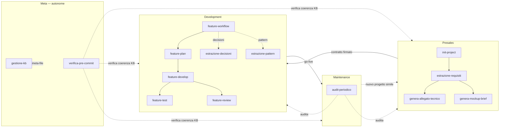

> Per i flussi temporali e le sequenze d'uso → [docs/workflow.md](workflow.md)

---

## Sistema di stato delle skill

Ogni skill ha un campo `stato` nel frontmatter:

| Stato | Significato | Comportamento |
|-------|-------------|---------------|
| `beta` | Skill in fase di rodaggio | All'inizio avvisa che è in beta. Durante l'uso, ad ogni step chiede se il processo ha senso o se va modificato. |
| `stable` | Skill validata e collaudata | Esecuzione normale senza interruzioni extra. |

Quando una skill beta viene usata abbastanza da risultare stabile, si aggiorna lo stato a `stable` e si registra nel changelog.

---

## Riepilogo

| Skill | Fase | Stato | Scopo | Legge | Scrive |
|-------|------|-------|-------|-------|--------|
| `init-project` | Presales | beta | Bootstrap completo progetto | Notion, GitHub | projects/[nome]/, INDEX.md |
| `estrazione-requisiti` | Presales | beta | Note → requisiti strutturati | Materiale grezzo | requisiti.md, meeting/ |
| `genera-allegato-tecnico` | Presales | beta | Requisiti → allegato contrattuale | requisiti.md | allegato-tecnico.md |
| `genera-mockup-brief` | Presales | beta | Requisiti → brief mockup per Windsurf | requisiti.md | mockup-brief.md |
| `feature-workflow` | Development | beta | Orchestra ciclo completo feature (Plan→Dev→Test→Review) | requisiti.md, .feature-state.md | .feature-state.md, feature-log.md |
| `feature-plan` | Development | beta | Requisito → piano implementazione tecnico | requisiti.md, architettura.md, patterns/ | .feature-state.md (Piano) |
| `feature-develop` | Development | beta | Piano → implementazione (Claude Code o brief Windsurf) | .feature-state.md (Piano), processi.md | Codebase, .feature-state.md (Sviluppo) |
| `feature-test` | Development | beta | Scrive test, esegue suite, verifica criteri e regressioni | .feature-state.md, requisiti.md, codebase | Nuovi test, .feature-state.md (Test) |
| `feature-review` | Development | beta | Review codice: pattern LAIF, duplicazioni, qualità, KB | .feature-state.md, processi.md, patterns/ | .feature-state.md (Review) |
| `estrazione-decisioni` | Development | beta | Documenta decisioni tecniche (ADR) | decisioni.md | decisioni.md, architettura.md |
| `estrazione-pattern` | Development | beta | Fine sprint → pattern riutilizzabili | feature-log, decisioni.md | patterns/, knowledge/ |
| `audit-periodico` | Maintenance | beta | Audit mensile intera KB | Tutta la KB | Report + aggiornamenti distribuiti |
| `gestione-kb` | Meta | beta | Gestione meta-file del sistema | Meta-file, struttura cartelle | changelog, IDEAS.md, docs/ |
| `verifica-pre-commit` | Meta | stable | Verifica ibrida coerenza KB pre-commit (script Python + check semantici) | Tutti i meta-file + struttura reale | nessuno (solo report) |

---

## Presales

### init-project

**Path**: `skills/presales/init-project/SKILL.md`
**Trigger**: Inizio di un nuovo progetto
**Stato**: beta

Bootstrap completo: legge Notion, clona repo, rileva stack, popola struttura progetto, genera CLAUDE.md nel repo.

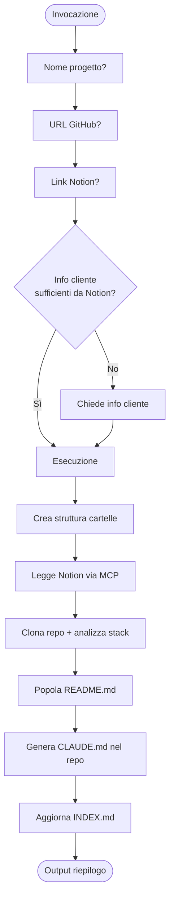

---

### estrazione-requisiti

**Path**: `skills/presales/estrazione-requisiti/SKILL.md`
**Trigger**: Dopo un meeting con il cliente
**Stato**: beta

Note grezze di meeting → requisiti strutturati (RF + RNF) con priorità, criteri di accettazione, domande aperte.


---

### genera-allegato-tecnico

**Path**: `skills/presales/genera-allegato-tecnico/SKILL.md`
**Trigger**: Quando `requisiti.md` è validato e serve il documento contrattuale
**Stato**: beta

Produce l'allegato tecnico per il contratto: max 3 pagine, linguaggio non tecnico, comprensibile da un CEO.

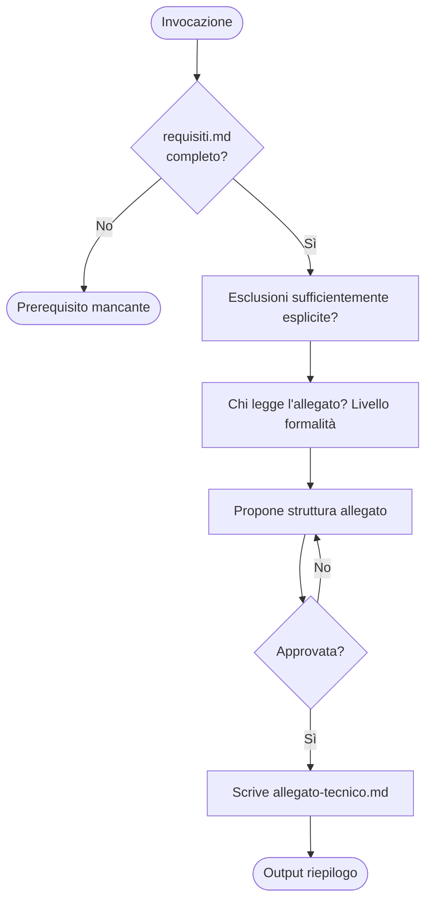

---

### genera-mockup-brief

**Path**: `skills/presales/genera-mockup-brief/SKILL.md`
**Trigger**: Quando `requisiti.md` è validato e servono i mockup
**Stato**: beta

Produce il brief per i mockup destinato a Windsurf: schermate prioritarie, flussi, brand guidelines, vincoli UI.

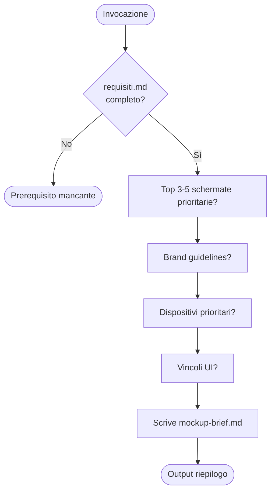

---

## Development

### feature-workflow

**Path**: `skills/development/feature-workflow/SKILL.md`
**Trigger**: Sviluppo feature end-to-end
**Stato**: beta

Orchestra il ciclo completo: Plan → Develop → Test + Review → Exit. Coordina 4 sub-skill con gate di qualità. Può essere ripreso da una fase precedente.

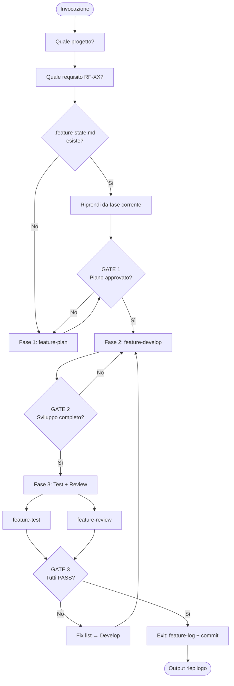

---

### feature-plan

**Path**: `skills/development/feature-plan/SKILL.md`
**Trigger**: Prima di sviluppare una feature
**Stato**: beta

Analizza un requisito e produce un piano tecnico: task list, file coinvolti, dipendenze, criteri di accettazione, rischi, pattern da applicare.

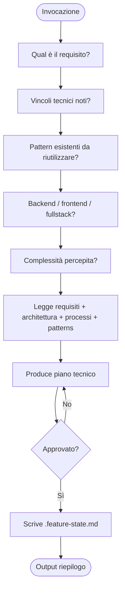

---

### feature-develop

**Path**: `skills/development/feature-develop/SKILL.md`
**Trigger**: Piano approvato (GATE 1 passato)
**Stato**: beta

Implementa la feature dal piano. Due modalità: sviluppo diretto (Claude Code) o brief autocontenuto per Windsurf.

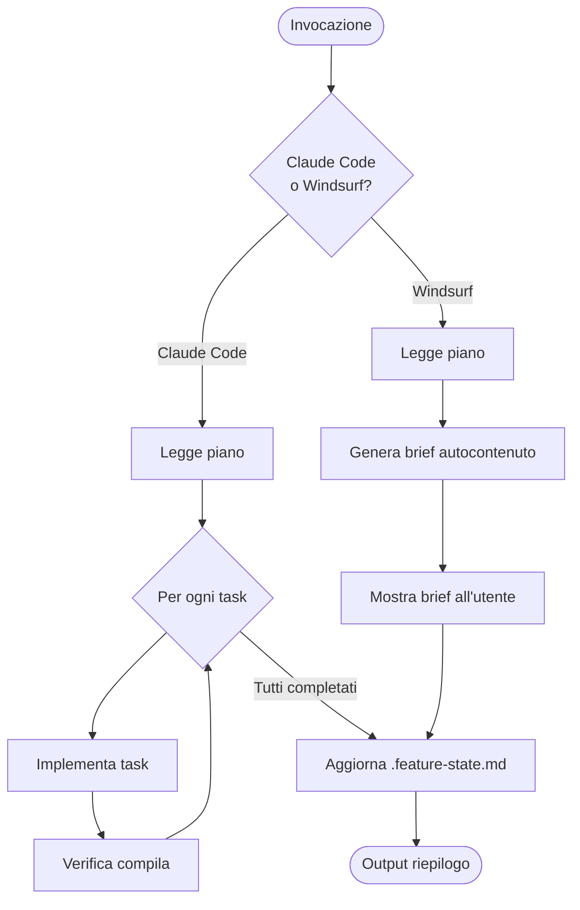

---

### feature-test

**Path**: `skills/development/feature-test/SKILL.md`
**Trigger**: Sviluppo completato (GATE 2 passato)
**Stato**: beta

Test completo: scrive test mancanti, esegue suite, verifica criteri di accettazione, testa edge case, controlla regressioni.

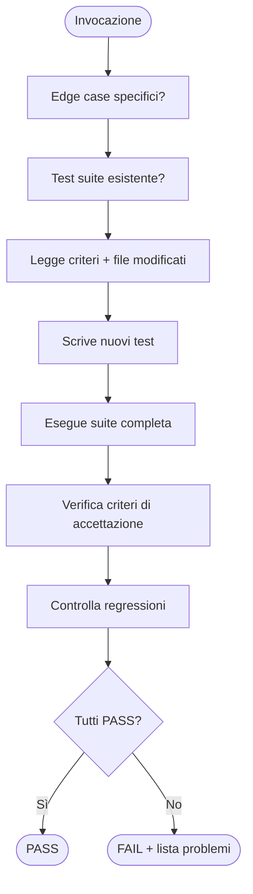

---

### feature-review

**Path**: `skills/development/feature-review/SKILL.md`
**Trigger**: Sviluppo completato (GATE 2 passato)
**Stato**: beta

Review autonoma: check aderenza pattern LAIF, duplicazioni, qualità, sicurezza. Confronta con `patterns/` e suggerisce nuovi pattern estraibili.

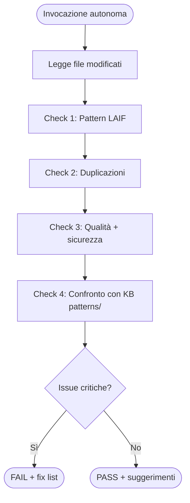

---

### estrazione-decisioni

**Path**: `skills/development/estrazione-decisioni/SKILL.md`
**Trigger**: Dopo ogni decisione tecnica non banale
**Stato**: beta

Cattura decisioni architetturali in formato ADR. Solo per scelte che qualcuno potrebbe mettere in discussione.

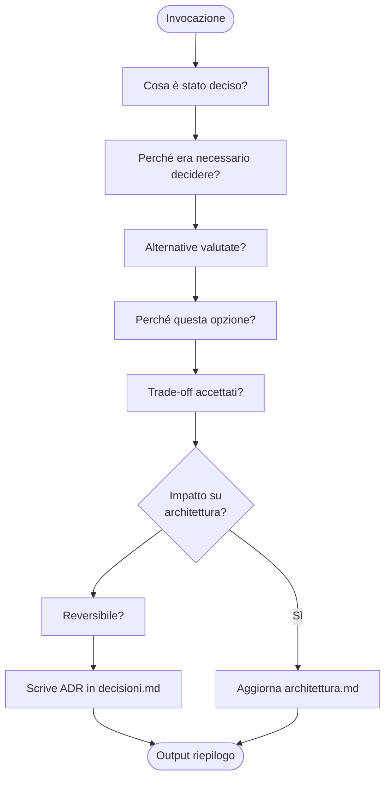

---

### estrazione-pattern

**Path**: `skills/development/estrazione-pattern/SKILL.md`
**Trigger**: Fine sprint o fine progetto
**Stato**: beta

Analizza UN progetto specifico ed estrae pattern riutilizzabili in `patterns/` e knowledge in `knowledge/`. Non è un audit generale (per quello c'è `audit-periodico`).


---

## Maintenance

### audit-periodico

**Path**: `skills/maintenance/audit-periodico/SKILL.md`
**Trigger**: Fine mese o fine sprint
**Stato**: beta

Audit autonomo dell'intera KB: verifica progetti, pattern, tag, domande aperte scadute, debito tecnico. Non opera su un singolo progetto (per quello c'è `estrazione-pattern`). Non gestisce meta-file (per quello c'è `gestione-kb`).


---

## Meta

### gestione-kb

**Path**: `skills/meta/gestione-kb/SKILL.md`
**Trigger**: Dopo modifiche alla KB, nuove idee, o periodicamente
**Stato**: beta

Gestisce i meta-file del sistema (changelog, idee, documentazione). Non audita progetti o pattern (per quello c'è `audit-periodico`). Opera in 4 modalità.

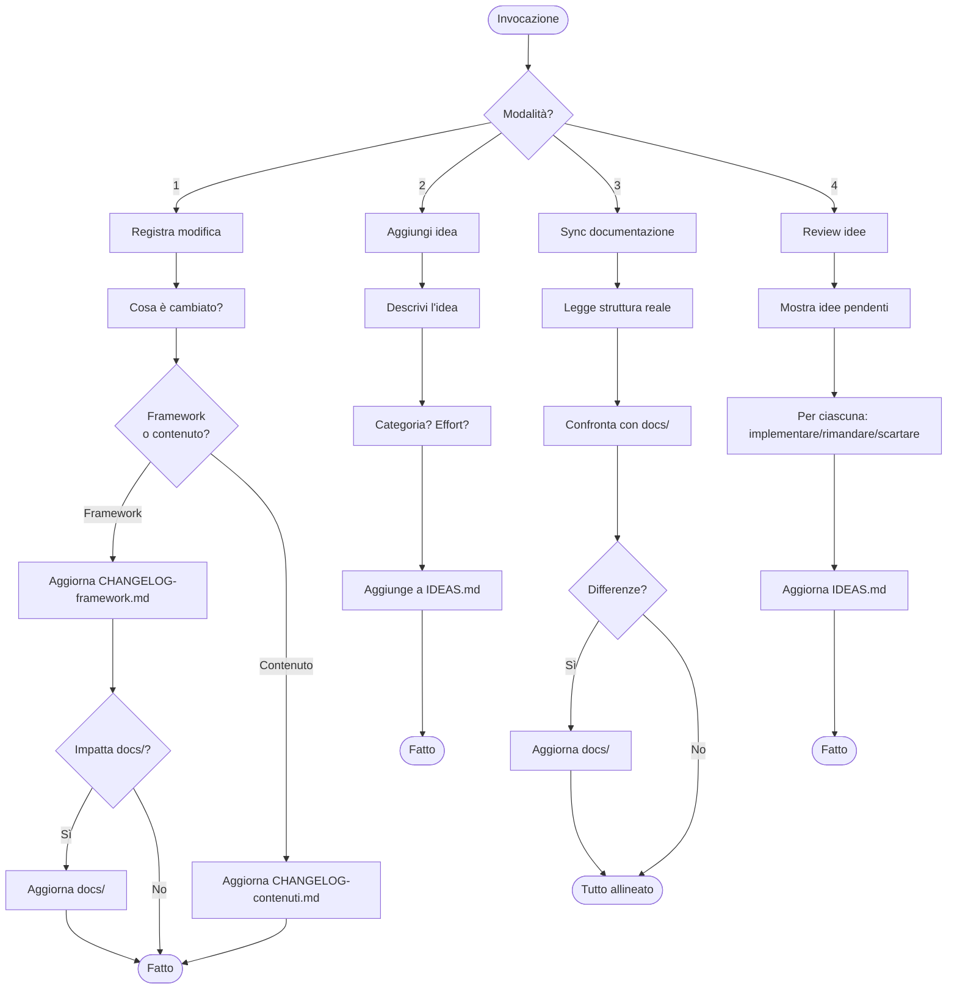

---

### verifica-pre-commit

**Path**: `skills/meta/verifica-pre-commit/SKILL.md`
**Trigger**: Automatico — dopo ogni modifica a file KB, prima di ogni `git commit`
**Stato**: stable

Verifica ibrida: 4 check automatizzati (script Python) + check semantici (parent agent). Il commit è bloccato finché tutti i check non passano.

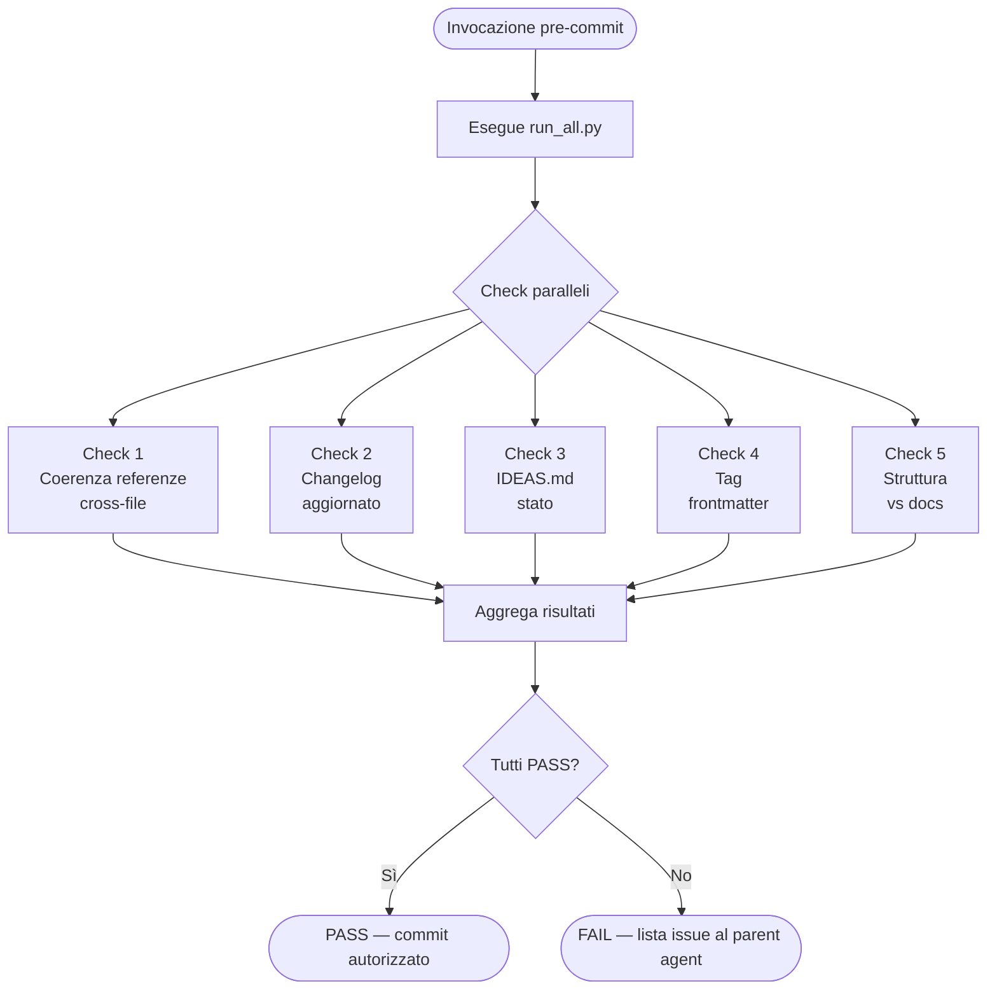

---

## Differenze tra skill di manutenzione

| | `estrazione-pattern` | `audit-periodico` | `gestione-kb` | `verifica-pre-commit` |
|---|---|---|---|---|
| **Scope** | Un singolo progetto | Intera KB | Meta-file del sistema | Coerenza interna KB |
| **Quando** | Fine sprint/progetto | Fine mese | Dopo ogni modifica / periodicamente | Automatico — ad ogni modifica e pre-commit |
| **Legge** | feature-log, decisioni-tecniche di un progetto | Tutti i progetti, pattern, tag | Changelog, IDEAS.md, docs/ | Tutti i meta-file + struttura reale |
| **Scrive** | patterns/, knowledge/ | Report + aggiornamenti distribuiti | Changelog, IDEAS.md, docs/ | Niente — solo report |
| **Conversazione** | Sì | Sì (con conferma) | Sì (4 modalità) | No — autonoma |
| **Focus** | Estrarre knowledge riutilizzabile | Trovare gap, obsolescenze, disallineamenti | Tenere traccia modifiche e idee | Bloccare commit inconsistenti |

---

## Formato standard SKILL.md

Ogni skill segue questo formato nel frontmatter:

```yaml
---
nome: "Nome della skill"
descrizione: >
  Descrizione con scope chiaro: cosa fa, cosa NON fa, e rimandi ad altre skill.
fase: presales | development | maintenance | meta
versione: "1.0"
stato: beta | stable
legge:
  - file/cartelle che la skill legge come input
scrive:
  - file/cartelle che la skill produce o aggiorna
aggiornato: "YYYY-MM-DD"
---
```

Sezioni nel corpo:
1. **Obiettivo** — cosa fa
2. **Perimetro** — cosa fa / cosa NON fa / rimandi ad altre skill
3. **Quando usarla / Trigger** — quando invocarla
4. **Prerequisiti** — cosa serve prima
5. **Loop conversazionale** — domande da fare (una alla volta)
6. **Processo di produzione** — passi da eseguire
7. **Output in chat** — riepilogo obbligatorio al termine
8. **Checklist qualità** — verifiche finali

**Principio**: mai produrre output senza prima raccogliere le informazioni necessarie.
