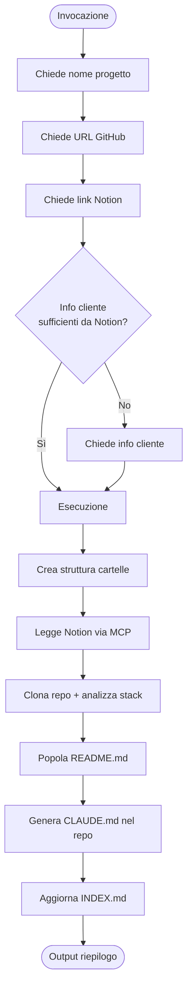
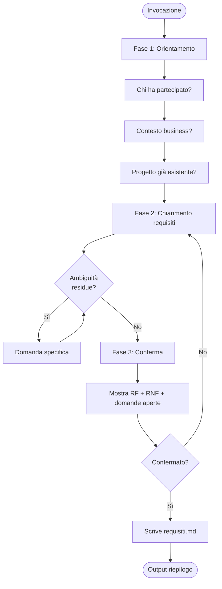
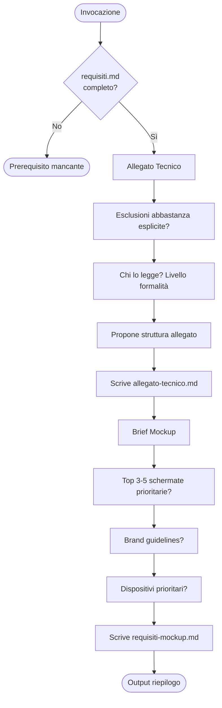
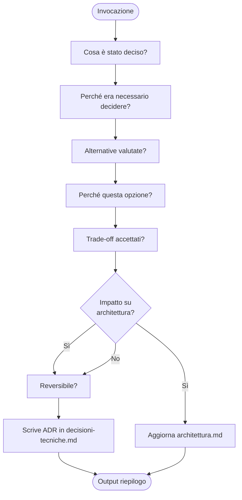
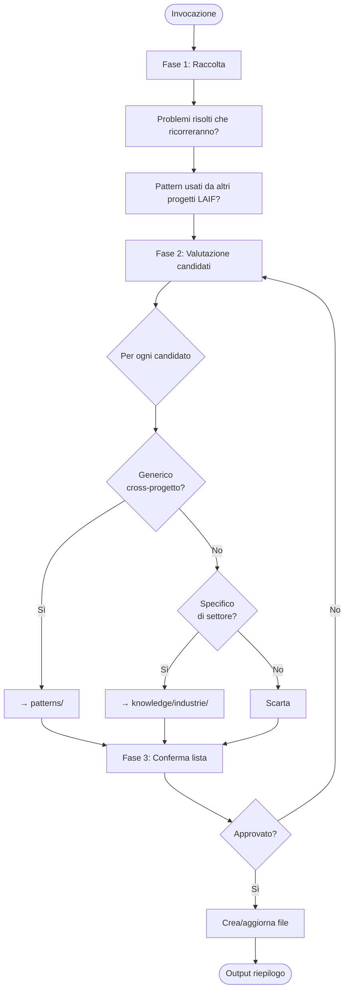
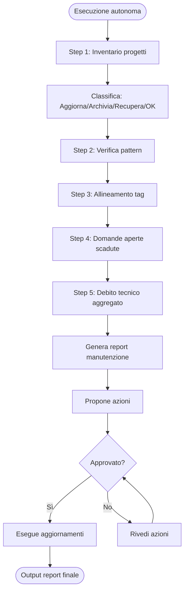
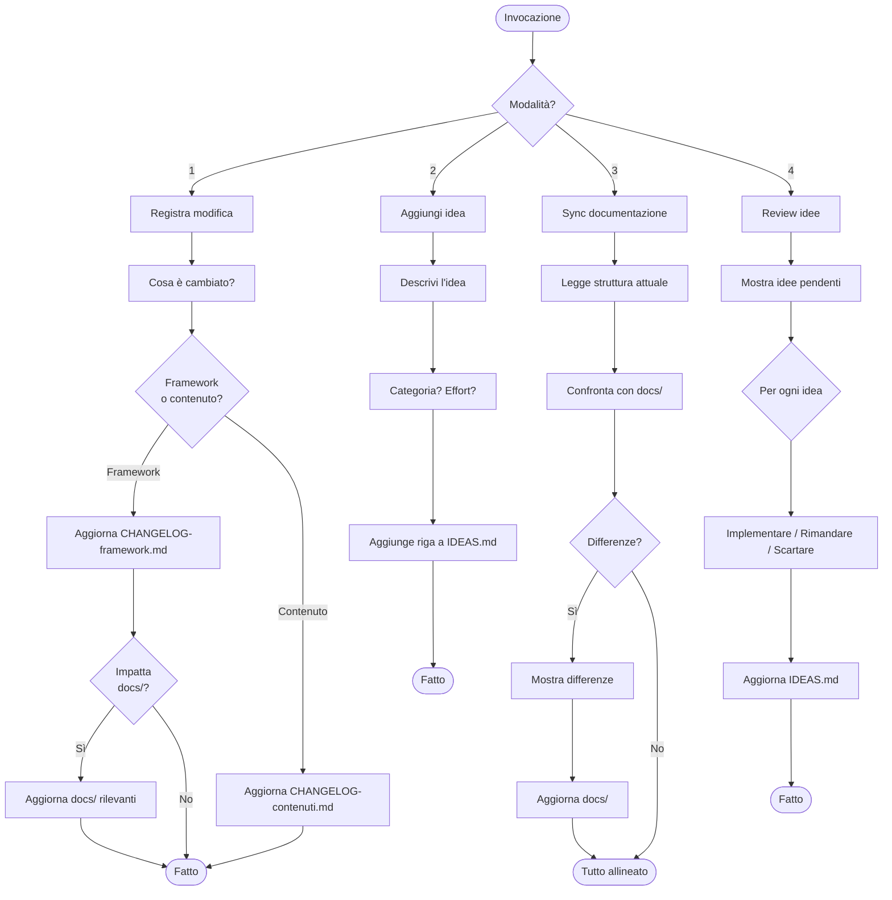

# Catalogo Skill

**Ultimo aggiornamento**: 2026-03-08

---

## Riepilogo

| Skill | Fase | Scopo | Input | Output |
|-------|------|-------|-------|--------|
| `init-project` | Presales | Bootstrap completo progetto | Nome, GitHub URL, Notion links | Struttura KB + CLAUDE.md repo |
| `estrazione-requisiti` | Presales | Note grezze → requisiti strutturati | Trascrizioni meeting | `requisiti.md` |
| `genera-documenti` | Presales | Requisiti → documenti cliente | `requisiti.md` validato | Allegato tecnico + brief mockup |
| `estrazione-decisioni` | Development | Documenta scelte architetturali | Descrizione decisione | ADR in `decisioni-tecniche.md` |
| `aggiornamento-kb` | Development | Estrai pattern a fine sprint | Feature log, codice | Pattern in `patterns/` |
| `aggiornamento-periodico` | Maintenance | Audit mensile KB | Nessuno (autonoma) | Report manutenzione |
| `gestione-kb` | Meta | Gestione changelog, idee, docs | Varia per modalità | Aggiornamento meta-file |

---

## Presales

### init-project

**Path**: `skills/presales/init-project/SKILL.md`
**Trigger**: Inizio di un nuovo progetto
**Versione**: 1.0

Crea l'intera struttura di un progetto in una sola operazione: legge le note da Notion, clona il repository, rileva lo stack tecnologico, e genera i file iniziali.



---

### estrazione-requisiti

**Path**: `skills/presales/estrazione-requisiti/SKILL.md`
**Trigger**: Dopo un meeting con il cliente
**Versione**: 1.1

Trasforma note grezze di meeting in requisiti strutturati con priorità, criteri di accettazione e domande aperte.



---

### genera-documenti

**Path**: `skills/presales/genera-documenti/SKILL.md`
**Trigger**: Quando `requisiti.md` è validato
**Versione**: 1.1

Produce due documenti: l'allegato tecnico per il contratto (max 3 pagine, linguaggio non tecnico) e il brief per i mockup (schermate, flussi, brand).



---

## Development

### estrazione-decisioni

**Path**: `skills/development/estrazione-decisioni/SKILL.md`
**Trigger**: Dopo ogni decisione tecnica non banale
**Versione**: 1.1

Documenta decisioni architetturali in formato ADR (Architecture Decision Record). Non per decisioni ovvie, ma per scelte che qualcuno potrebbe mettere in discussione.



---

### aggiornamento-kb

**Path**: `skills/development/aggiornamento-kb/SKILL.md`
**Trigger**: Fine sprint o fine progetto
**Versione**: 1.1

Estrae pattern riutilizzabili dall'esperienza del progetto e aggiorna la knowledge base cross-progetto.



---

## Maintenance

### aggiornamento-periodico

**Path**: `skills/maintenance/aggiornamento-periodico/SKILL.md`
**Trigger**: Fine mese o fine sprint
**Versione**: 1.1

Sub-agente autonomo che audita l'intera KB: verifica progetti, pattern, tag, domande aperte scadute e debito tecnico.



---

## Meta

### gestione-kb

**Path**: `skills/meta/gestione-kb/SKILL.md`
**Trigger**: Dopo modifiche alla KB, nuove idee, o periodicamente
**Versione**: 1.0

Skill di gestione dei meta-file del sistema (changelog, idee, documentazione). Opera in 4 modalità: registra modifica, aggiungi idea, sync docs, review idee.



---

## Formato standard SKILL.md

Ogni skill segue questo formato:

```yaml
---
nome: "Nome della skill"
descrizione: >
  Descrizione breve usata per capire quando invocarla.
fase: presales | development | maintenance | meta
versione: "1.0"
output:
  - path/al/file/prodotto.md
aggiornato: "YYYY-MM-DD"
---
```

Sezioni:
1. **Obiettivo** — cosa fa
2. **Quando usarla / Trigger** — quando invocarla
3. **Prerequisiti** — cosa serve prima
4. **Loop conversazionale** — domande da fare (una alla volta)
5. **Processo di produzione** — passi da eseguire
6. **Output in chat** — riepilogo obbligatorio al termine
7. **Checklist qualità** — verifiche finali

**Principio**: mai produrre output senza prima raccogliere le informazioni necessarie.
