# Struttura della Knowledge Base

**Ultimo aggiornamento**: 2026-03-08

---

## Albero delle cartelle

```mermaid
graph TD
    ROOT["SimoneAI/"] --> CLAUDE["CLAUDE.md<br/><i>Istruzioni operative per Claude Code</i>"]
    ROOT --> SYSTEM["System.md<br/><i>Panoramica del sistema</i>"]
    ROOT --> CHANGELOG_F["CHANGELOG-framework.md<br/><i>Modifiche alla struttura</i>"]
    ROOT --> CHANGELOG_C["CHANGELOG-contenuti.md<br/><i>Modifiche ai contenuti</i>"]
    ROOT --> IDEAS["IDEAS.md<br/><i>Backlog idee e miglioramenti</i>"]
    ROOT --> DOCS["docs/<br/><i>Documentazione navigabile</i>"]
    ROOT --> PROJECTS["projects/<br/><i>Un progetto per cartella</i>"]
    ROOT --> PATTERNS["patterns/<br/><i>Pattern tecnici riutilizzabili</i>"]
    ROOT --> SKILLS["skills/<br/><i>Skill e sub-agenti</i>"]
    ROOT --> KNOWLEDGE["knowledge/<br/><i>Conoscenza cross-progetto</i>"]
    ROOT --> TAGS[".tags/<br/><i>Indice tag per ricerca rapida</i>"]

    DOCS --> DOC_STRUTTURA["struttura.md<br/><i>Questa pagina</i>"]
    DOCS --> DOC_SKILLS["skills.md<br/><i>Catalogo skill</i>"]
    DOCS --> DOC_WORKFLOW["workflow.md<br/><i>Flussi di lavoro</i>"]

    PROJECTS --> TEMPLATE["_template/<br/><i>Template base</i>"]
    PROJECTS --> INDEX_P["INDEX.md<br/><i>Registro progetti</i>"]
    TEMPLATE --> T_README["README.md"]
    TEMPLATE --> T_PRESALES["presales/"]
    TEMPLATE --> T_DEV["development/"]
    TEMPLATE --> T_MAINT["maintenance/"]

    SKILLS --> S_PRESALES["presales/"]
    SKILLS --> S_DEV["development/"]
    SKILLS --> S_MAINT["maintenance/"]
    SKILLS --> S_META["meta/"]
    S_PRESALES --> S_INIT["init-project/"]
    S_PRESALES --> S_REQ["estrazione-requisiti/"]
    S_PRESALES --> S_DOC["genera-documenti/"]
    S_DEV --> S_DEC["estrazione-decisioni/"]
    S_DEV --> S_UPD["aggiornamento-kb/"]
    S_MAINT --> S_PER["aggiornamento-periodico/"]
    S_META --> S_GEST["gestione-kb/"]

    KNOWLEDGE --> K_IND["industrie/"]
    KNOWLEDGE --> K_PROB["problemi-tecnici/"]

    PATTERNS --> P_README["README.md"]
    PATTERNS --> P_TEMPLATE["_template.md"]
```



---

## Descrizione cartelle

### `docs/`
Documentazione del sistema stesso. Serve sia come riferimento per l'utente sia come contesto per gli agenti AI.

| File | Contenuto |
|------|-----------|
| `struttura.md` | Mappa delle cartelle e convenzioni (questo file) |
| `skills.md` | Catalogo completo delle skill con flussi |
| `workflow.md` | Diagrammi dei flussi di lavoro per fase |

### `projects/`
Ogni progetto ha la sua cartella. La struttura interna è definita dal template `_template/`.

```
projects/
├── INDEX.md          ← registro di tutti i progetti (stato, stack, date)
├── _template/        ← template base — NON copiare manualmente, usa init-project
│   ├── README.md
│   ├── presales/
│   │   ├── note-meeting/
│   │   ├── requisiti.md
│   │   ├── requisiti-mockup.md
│   │   └── allegato-tecnico.md
│   ├── development/
│   │   ├── architettura.md
│   │   ├── decisioni-tecniche.md
│   │   └── feature-log.md
│   └── maintenance/
│       └── note.md
└── [nome-progetto]/  ← creato dalla skill init-project
```

### `patterns/`
Pattern tecnici riutilizzabili estratti dai progetti completati. Ogni pattern documenta: problema, soluzione, trade-off, e in quali progetti LAIF è stato usato.

### `skills/`
Le "istruzioni operative" del sistema. Ogni skill è una cartella con un `SKILL.md` che definisce il processo conversazionale. Organizzate per fase: `presales/`, `development/`, `maintenance/`, `meta/`.

### `knowledge/`
Conoscenza cross-progetto non legata a un progetto specifico:
- `industrie/` — cosa sappiamo di settori specifici (retail, finance, healthcare...)
- `problemi-tecnici/` — soluzioni a problemi ricorrenti

### `.tags/`
Indice dei tag. Permette di navigare la KB tramite tag senza conoscere la struttura delle cartelle.

---

## Convenzioni di naming

| Tipo | Formato | Esempio |
|------|---------|---------|
| Cartelle progetto | kebab-case | `progetto-ecommerce` |
| File markdown | kebab-case | `allegato-tecnico.md` |
| Cartelle skill | kebab-case | `estrazione-requisiti/` |
| Tag | `#categoria:valore` | `#industria:retail` |
| ID requisiti | `RF-NN` / `RNF-NN` | `RF-01`, `RNF-03` |
| ID decisioni | `ADR-NNN` | `ADR-001` |
| ID idee | `IDEA-NNN` | `IDEA-001` |

---

## File nella root

| File | Scopo |
|------|-------|
| `CLAUDE.md` | Istruzioni operative per Claude Code — letto automaticamente a ogni sessione |
| `System.md` | Panoramica del sistema, motivazioni, struttura ad alto livello |
| `CHANGELOG-framework.md` | Traccia modifiche alla struttura: cartelle, skill, template, processi |
| `CHANGELOG-contenuti.md` | Traccia modifiche ai contenuti: progetti, pattern, knowledge, decisioni |
| `IDEAS.md` | Backlog strutturato di idee e miglioramenti futuri |
