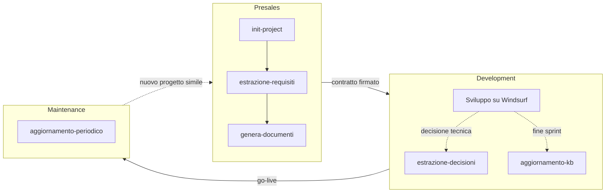
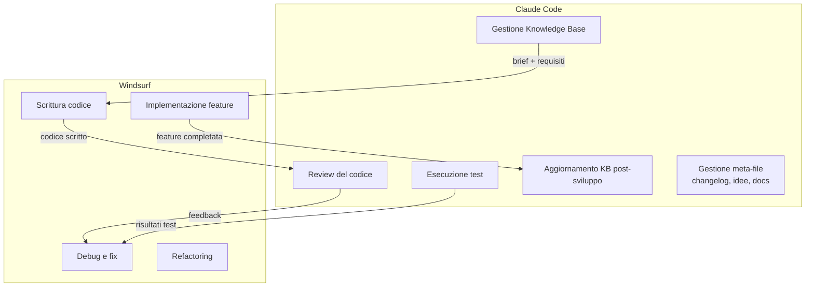
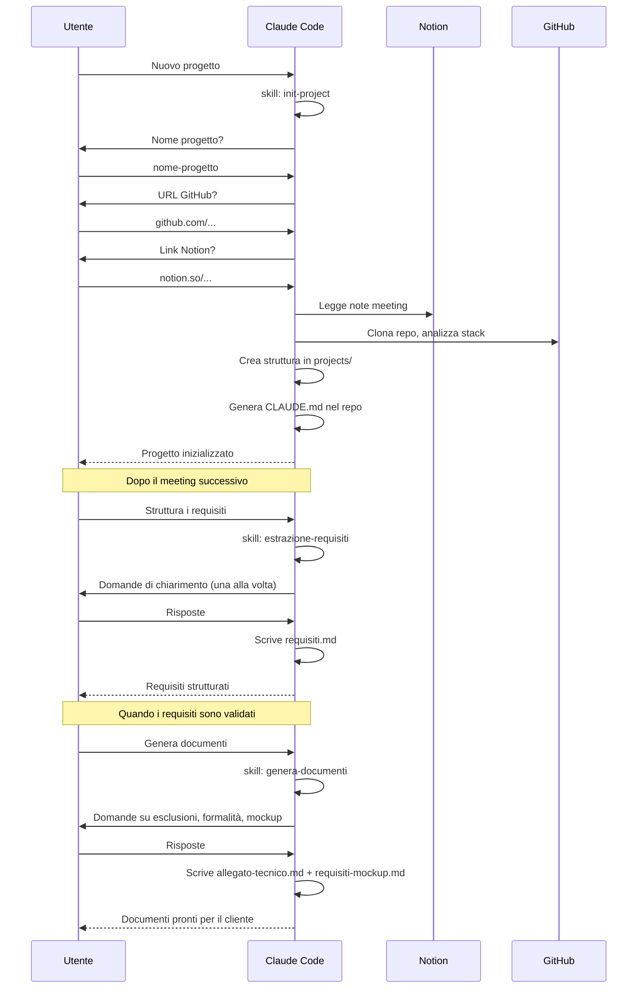
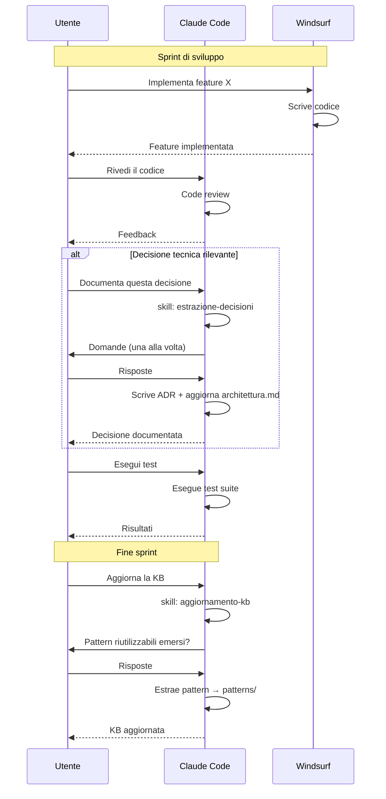
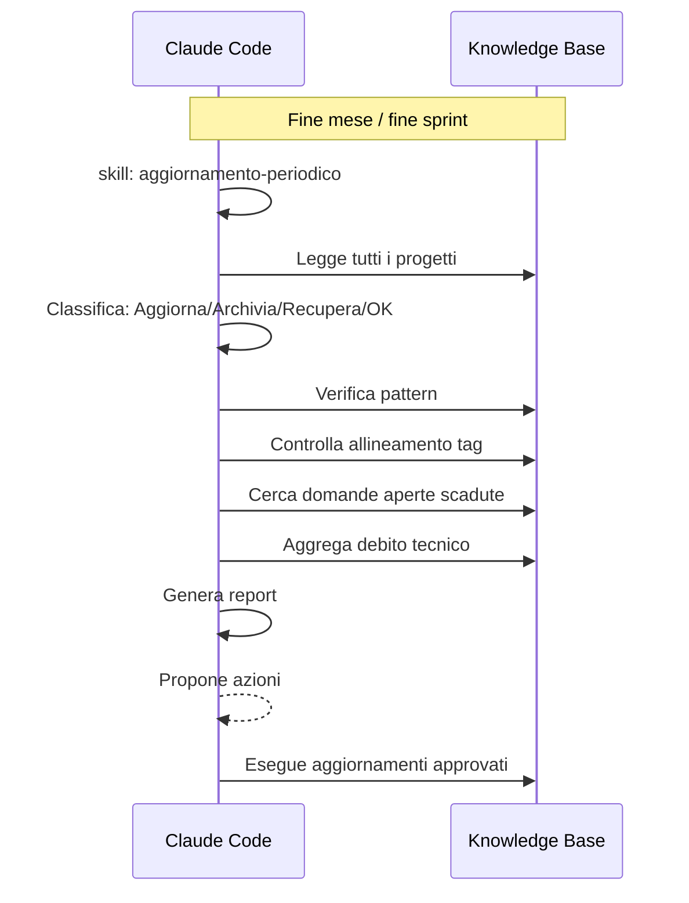
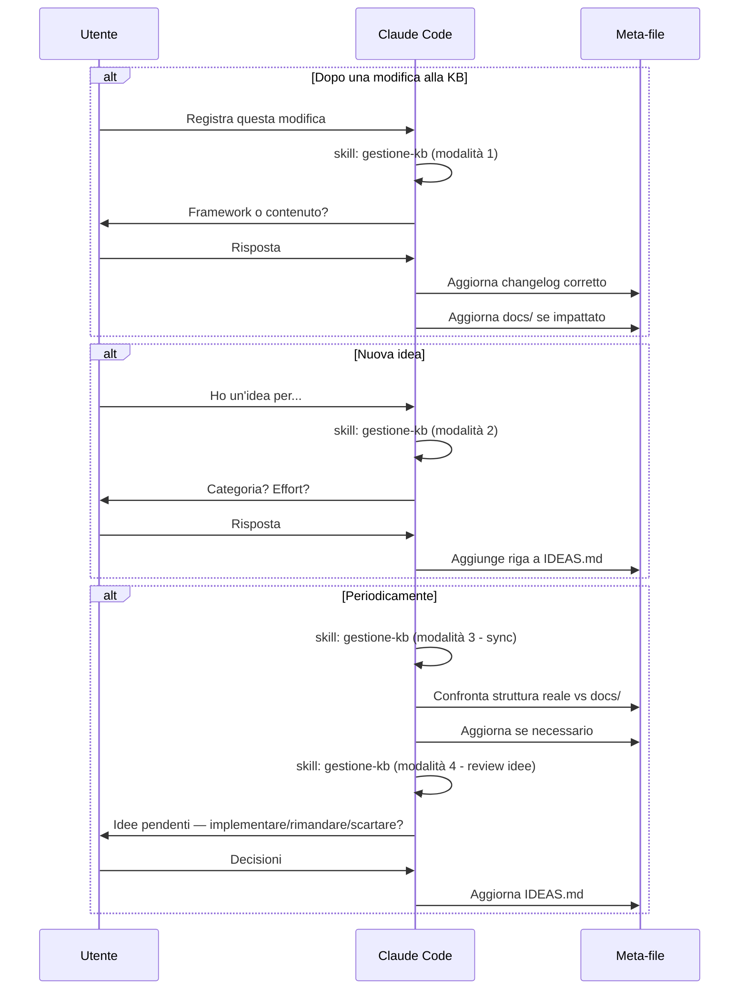

# Flussi di Lavoro

**Ultimo aggiornamento**: 2026-03-08

---

## Ciclo di vita di un progetto

---

## Divisione strumenti: Claude Code vs Windsurf

### Quando usare cosa

| Attività | Strumento | Motivo |
|----------|-----------|--------|
| Creare/gestire progetti nella KB | Claude Code | Gestione file .md, skill conversazionali |
| Estrarre requisiti da note meeting | Claude Code | Processo strutturato con loop conversazionale |
| Generare documenti per il cliente | Claude Code | Template e formato specifico |
| Scrivere codice applicativo | Windsurf | Più token, più libertà, sviluppo intensivo |
| Fare code review | Claude Code | Verifica qualità e aderenza a decisioni |
| Eseguire test | Claude Code | Validazione post-sviluppo |
| Documentare decisioni tecniche | Claude Code | ADR nella KB |
| Estrarre pattern a fine sprint | Claude Code | Aggiornamento knowledge base |
| Audit periodico KB | Claude Code | Skill automatizzata |

---

## Flusso Presales

---

## Flusso Development

---

## Flusso Maintenance

---

## Flusso Meta / Gestione KB

