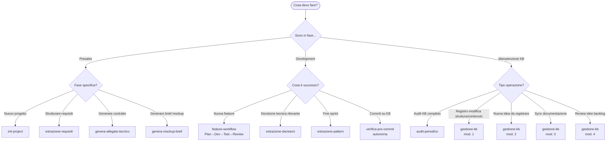
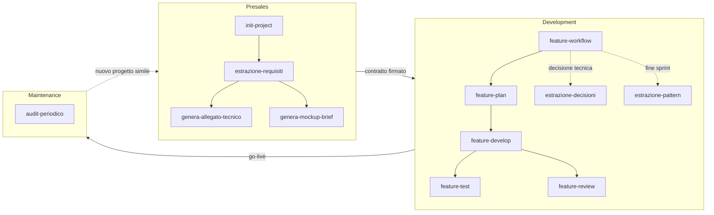
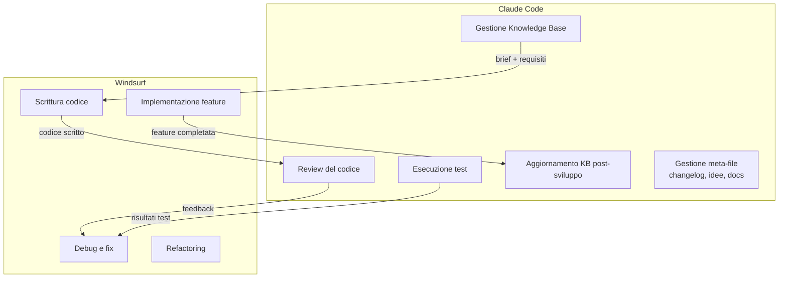
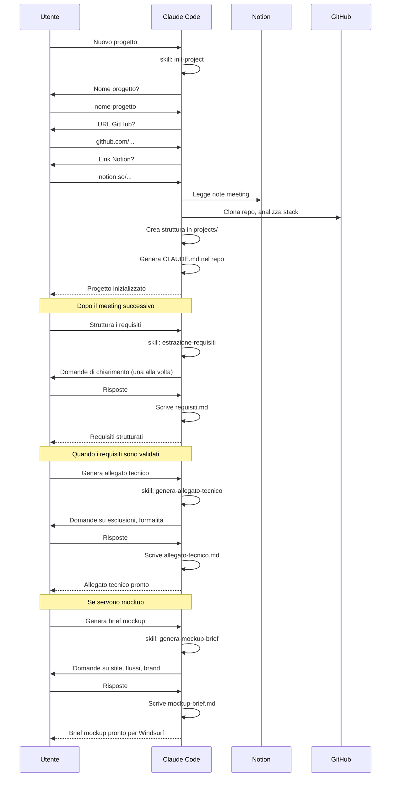
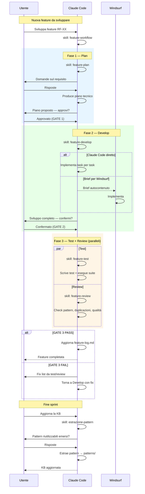
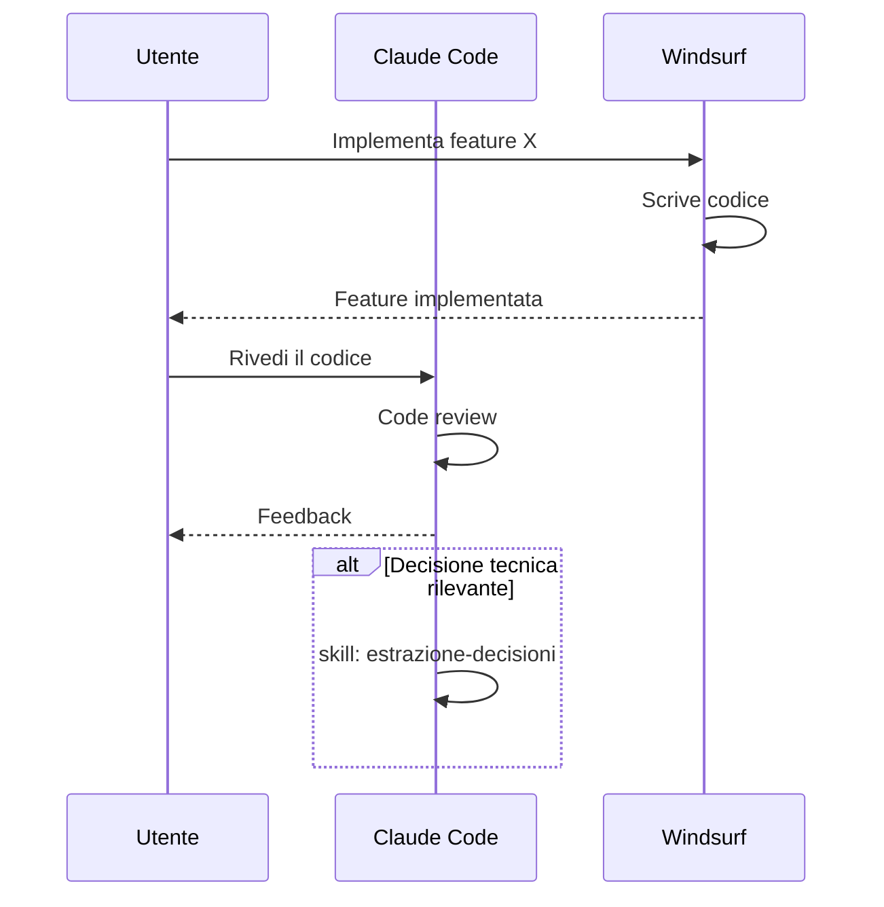
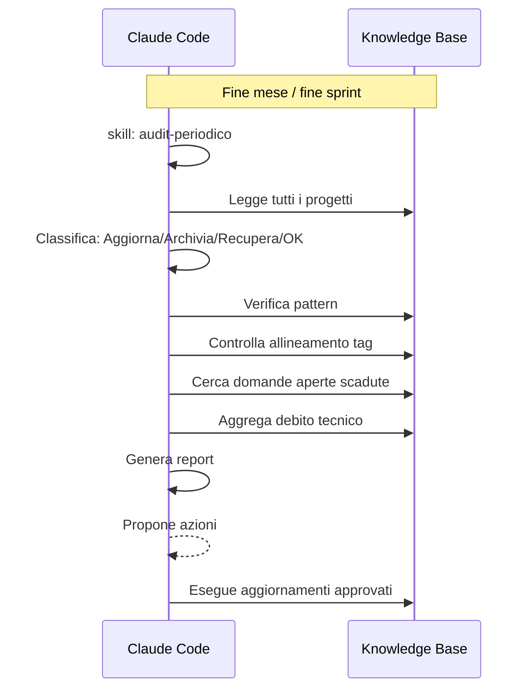
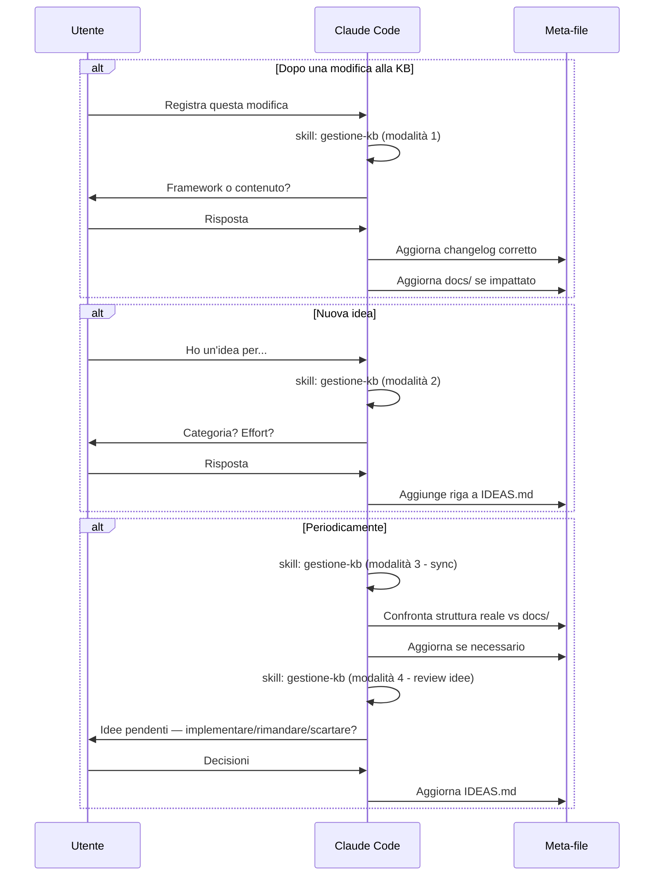

# Flussi di Lavoro

← [System.md](../System.md) · [skills.md](skills.md) · [struttura.md](struttura.md)

**Ultimo aggiornamento**: 2026-03-09

---

## Indice

- [Quale flusso usare?](#quale-flusso-usare)
- [Ciclo di vita di un progetto](#ciclo-di-vita-di-un-progetto)
- [Divisione strumenti: Claude Code vs Windsurf](#divisione-strumenti-claude-code-vs-windsurf)
- [Flusso Presales](#flusso-presales)
- [Flusso Development](#flusso-development)
- [Flusso Maintenance](#flusso-maintenance)
- [Flusso Meta / Gestione KB](#flusso-meta--gestione-kb)

---

## Quale flusso usare?

> Per i dettagli di ogni skill (input, output, flowchart) → [docs/skills.md](skills.md)

---

## Ciclo di vita di un progetto

---

## Divisione strumenti: Claude Code vs Windsurf

### Quando usare cosa

| Attività | Strumento | Motivo |
|----------|-----------|--------|
| Creare/gestire progetti nella KB | Claude Code | Gestione file .md, skill conversazionali |
| Estrarre requisiti da note meeting | Claude Code | Processo strutturato con loop conversazionale |
| Generare documenti per il cliente | Claude Code | Template e formato specifico |
| Scrivere codice applicativo | Windsurf | Più token, più libertà, sviluppo intensivo |
| Fare code review | Claude Code | Verifica qualità e aderenza a decisioni |
| Eseguire test | Claude Code | Validazione post-sviluppo |
| Documentare decisioni tecniche | Claude Code | ADR nella KB |
| Estrarre pattern a fine sprint | Claude Code | Aggiornamento knowledge base |
| Audit periodico KB | Claude Code | Skill automatizzata |

---

## Flusso Presales

---

## Flusso Development

### Feature Workflow (ciclo completo)

### Flusso alternativo (senza orchestratore)

Le sub-skill possono essere invocate singolarmente per task semplici o quando serve solo una fase specifica:

| Skill standalone | Quando usarla da sola |
|-----------------|----------------------|
| `feature-plan` | Voglio solo pianificare, senza sviluppare subito |
| `feature-develop` | Il piano è già stato fatto, devo solo implementare |
| `feature-test` | Il codice è pronto, devo solo testare |
| `feature-review` | Il codice è pronto, voglio solo una review |

### Flusso legacy (senza feature-workflow)

---

## Flusso Maintenance

---

## Flusso Meta / Gestione KB

