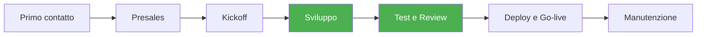

# Processi LAIF — Mappa del ciclo di vita

Ogni progetto LAIF attraversa queste fasi, dal primo contatto con il cliente fino alla manutenzione post go-live.

## Fasi

| # | Fase | Descrizione | Skill | Conoscenze utili |
|---|------|-------------|-------|-----------------|
| 1 | **Primo contatto** | Qualificazione opportunita, primo incontro, raccolta esigenze ad alto livello | — | — |
| 2 | **Presales** | Analisi requisiti, stima effort, proposta commerciale, allegato tecnico | — | [convenzioni/](../convenzioni/) |
| 3 | **Kickoff** | Assegnazione team, fork da laif-template, setup infrastruttura AWS, config `values.yaml` | — | [convenzioni/git-flow.md](../convenzioni/git-flow.md) |
| 4 | **Sviluppo** | Implementazione feature, sprint iterativi, code review continua | [analisi-repo](../skills/analisi-repo/) | [convenzioni/naming-db.md](../convenzioni/naming-db.md) |
| 5 | **Test e Review** | Test automatici, review codice, QA manuale | [analisi-repo](../skills/analisi-repo/) | — |
| 6 | **Deploy e Go-live** | Pipeline CI/CD, deploy su AWS, checklist go-live, monitoring | — | — |
| 7 | **Manutenzione** | SLA, bug fix, upstream merge da template, evoluzione | — | [convenzioni/git-flow.md](../convenzioni/git-flow.md) |

## Come aggiungere un processo

Usa la skill [documenta-processo](../skills/documenta-processo/) per creare documentazione strutturata di un processo specifico. I documenti generati vanno in questa cartella.

## Flusso di sviluppo (fase 4 — dettaglio)

Il flusso quotidiano di sviluppo segue questo ordine:

**Backend**: Modello → Schema Pydantic → Controller (RouterBuilder) → Registra in main.py → Migrazione (`just migrate create` + `just migrate upgrade`)

**Frontend**: `just fe generate-client` → Feature in `src/features/` → Componenti `@laif/ds` → Navigation config → Traduzioni

**Ambiente locale**:
- `just run default` — Backend + DB in Docker
- `just fe dev` — Frontend dev server
- `just run all` — Tutto insieme
