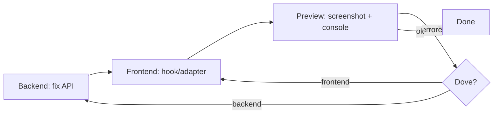

# Pattern: Full-Stack Development con Preview Loop

## Problema

Quando sviluppi una feature full-stack (backend API + frontend UI), il ciclo di feedback è lento: modifichi il backend, poi il frontend, poi devi verificare manualmente che tutto funzioni insieme. Errori di serializzazione, CORS, mapping dati emergono solo a runtime.

**Segnali che questo pattern è quello giusto**:
- Stai collegando un frontend a nuovi endpoint API
- Devi verificare che i dati fluiscono correttamente end-to-end
- Hai bisogno di iterare rapidamente su backend+frontend insieme

---

## Soluzione

Un ciclo iterativo in 3 fasi con verifica visuale tramite preview:

```
Backend Fix → Frontend Adapt → Preview Verify → [ripeti se errori]
```

### Struttura



### Implementazione

**Fase 1: Backend API Ready**

1. Verifica che l'endpoint risponda correttamente via curl/httpx
2. Controlla serializzazione: i dati ORM devono essere convertiti in Pydantic
3. Verifica CORS headers per il dominio del frontend
4. Testa con un token JWT valido

**Fase 2: Frontend Adapter**

1. Rigenera il client OpenAPI: `just fe generate-client`
2. Crea un hook/adapter che mappi i dati API al formato del componente UI
3. Sostituisci il mock data con il hook
4. Gestisci stati loading/error

**Fase 3: Preview Verify**

1. Lancia preview (`preview_start` o `just fe dev`)
2. Login con credenziali standard
3. Screenshot per verifica visuale
4. Controlla console logs per errori JS
5. Controlla network requests per errori API
6. Se errori: identifica se backend o frontend, torna alla fase appropriata

### Codice di riferimento

```typescript
// Hook adapter pattern: mappa dati API al formato UI
function useEmailThreads(limit = 50) {
  return useQuery({
    queryKey: ["email-threads", limit],
    queryFn: async () => {
      const response = await searchThreadsPost({
        body: { limit },
        throwOnError: true,
      });
      return response.data.items.map(mapApiToUiModel);
    },
  });
}
```

```python
# Backend: serializzazione esplicita per endpoint search
@router.post("/threads/search")
async def search_threads(request: SearchThreadsRequest, ...):
    threads, total = await service.search_threads(db, request)
    items = [ThreadResponse.model_validate(t) for t in threads]
    return {"items": items, "total": total}
```

---

## Trade-off

**Vantaggi**:
- Feedback loop rapido (minuti, non ore)
- Errori di integrazione trovati subito
- Verifica visuale immediata
- Facilmente parallelizzabile con multi-agente

**Svantaggi / costi**:
- Richiede backend e frontend attivi contemporaneamente
- Preview ha limitazioni (no file system locale)
- Alcuni errori browser non sono visibili nella preview

**Quando NON usare questo pattern**:
- Per modifiche solo backend o solo frontend
- Per API senza UI (usa test automatici)
- Quando il frontend non è ancora iniziato (fai prima il backend completo)

---

## Checklist errori comuni

Durante il loop, verifica questi punti:

- [ ] **CORS**: l'origin del frontend è nella lista `allow_origins` del backend
- [ ] **Serializzazione**: gli oggetti ORM sono convertiti in Pydantic (`model_validate`)
- [ ] **SQLAlchemy unique()**: query con `joinedload` su collections richiedono `.unique()`
- [ ] **Route order**: route statiche prima di parametriche in FastAPI
- [ ] **Env vars in Docker**: servono `--force-recreate` per caricare nuove env vars
- [ ] **Client OpenAPI**: rigenerato dopo modifiche agli endpoint
- [ ] **Auth token**: incluso nelle richieste dal frontend

---

## Esempi reali in LAIF

| Progetto | Come è stato usato | Note / deviazioni |
|---------|-------------------|------------------|
| Jubatus | Email sync → frontend display | 3 iterazioni: fix serializzazione, fix .unique(), fix route order. Preview con login e verifica email reali |

---

## Risorse esterne

- [FastAPI + React Integration](https://fastapi.tiangolo.com/tutorial/cors/)
- [React Query Data Fetching Patterns](https://tanstack.com/query/latest/docs/framework/react/overview)
