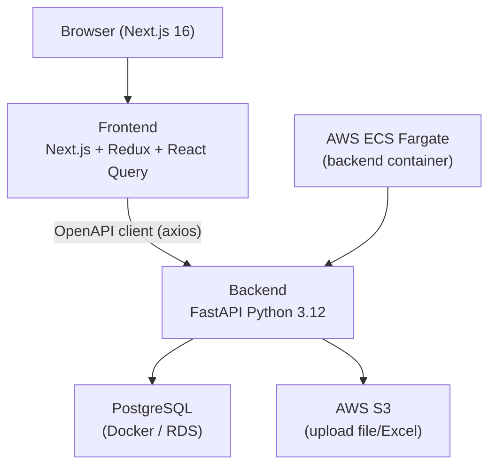

# Architettura — Albini & Castelli

> Aggiornato dalla skill `skills/development/estrazione-decisioni.md`.

---

## Overview

Applicazione full-stack basata su **laif-template v5.0.1**. Il backend FastAPI espone API REST per la gestione di cantieri, revisioni e consuntivi. Il frontend Next.js 16 consuma le API tramite client generato da OpenAPI. Il tutto è containerizzato con Docker Compose in locale e deployato su AWS (ECS + RDS + S3) negli ambienti dev e prod.

---

## Stack tecnologico

| Layer | Tecnologia | Versione | Note |
|-------|-----------|---------|------|
| Frontend | Next.js + React + TypeScript | 16.1.1 / 19.2.3 / 5.9.3 | Turbopack in dev |
| UI Library | laif-ds (shadcn-based) | 0.2.67 | Design system LAIF |
| State management | Redux Toolkit + React Query | 2.11.2 / 5.90.12 | Redux per stato globale, RQ per server state |
| Backend | FastAPI + Python | 0.128.0 / 3.12 | uv come package manager |
| ORM | SQLAlchemy + Alembic | 2.0.45 / 1.17.2 | Async engine (asyncpg) |
| Database | PostgreSQL | — | Docker locale, RDS in AWS |
| Auth | passlib + python-jose | 1.7.4 / 3.5.0 | JWT + bcrypt |
| Storage | AWS S3 | — | boto3 1.42.23 |
| Hosting | AWS ECS (Fargate) | — | 2 ambienti: dev + prod |
| CI/CD | GitHub Actions | — | — |
| Testing BE | pytest + pytest-asyncio | 9.0.2 | Integrazione e unit |
| Testing FE | Playwright | 1.48.2 | E2e + component test |
| Linting | ruff | 0.7 | Sostituisce flake8/black |

---

## Diagramma architetturale



---

## Moduli applicativi (backend/src/app)

| Modulo | Responsabilità |
|--------|---------------|
| `cantiere` | Anagrafica cantieri |
| `cantiere_anno` | Dati cantiere per anno fiscale |
| `revisione` | Ciclo revisione budget cantiere |
| `revisione_versione` | Versioni di una revisione |
| `revisione_fase` | Revisione per fase lavori |
| `revisione_extra_kpi` | KPI aggiuntivi per revisione |
| `revisione_year_summary` | Sommario annuale revisioni |
| `tabellone_revisione` | Vista tabellare aggregata revisioni |
| `consuntivo` | Dati consuntivi lavori |
| `cliente` | Anagrafica clienti |
| `mappale` | Mappali catastali associati ai cantieri |
| `dashboard` | Aggregati e metriche per dashboard |
| `changelog` | Changelog delle modifiche dati |
| `import_storico` | Import dati storici da Excel/file |
| `upload` | Gestione upload file (S3) |
| `schema/generated` | Schemi OpenAPI generati |
| `materialized_views_admin` | Gestione materialized views PostgreSQL |

## Feature frontend (frontend/src/features)

| Feature | Descrizione |
|---------|-------------|
| `sites-sheets` | Lista schede cantiere |
| `site-sheet-detail` | Dettaglio singolo cantiere con tab revisioni/consuntivi |
| `dashboard` | Dashboard aggregata KPI |
| `changelog` | Visualizzazione changelog |

---

## Flussi principali

### Flusso: Revisione cantiere

```
1. Utente seleziona cantiere da sites-sheets
2. Apre site-sheet-detail → tab Revisioni
3. Crea nuova versione revisione (revisione_versione)
4. Compila per fase (revisione_fase) e KPI (revisione_extra_kpi)
5. Backend salva e aggiorna materialized views
6. Dashboard mostra dati aggiornati
```

### Flusso: Import storico

```
1. Utente carica file Excel via upload
2. Backend (import_storico) parsifica il file (openpyxl/xlsxwriter)
3. Popola cantieri, anni, revisioni pregresse
4. Trigger refresh materialized views
```

---

## Dipendenze esterne

| Servizio | Scopo | Criticità |
|---------|-------|----------|
| AWS RDS (PostgreSQL) | Database prod | Alta |
| AWS S3 | Storage upload file | Media |
| AWS ECS | Hosting backend | Alta |
| OpenAI API | (dipendenza opzionale llm) | Bassa |

---

## Considerazioni di sicurezza

- **Autenticazione**: JWT (python-jose) + bcrypt (passlib)
- **Dati sensibili**: dati economici cantieri — accesso autenticato
- **Schema DB**: schema applicativo separato (da verificare convezione adottata)
- **Backup**: gestito da AWS RDS automated backups

---

## Debito tecnico noto

| # | Descrizione | Impatto | Priorità |
|---|------------|--------|---------|
| 1 | Dipendenze llm (openai + pgvector) attive di default anche se non usate | Medio | Bassa |
