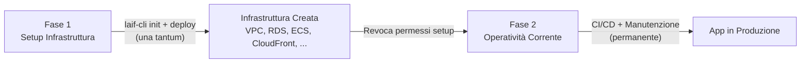
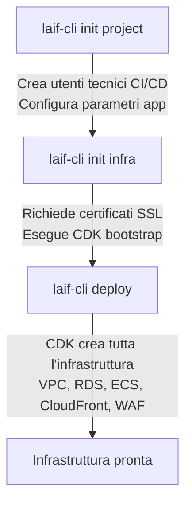

# Permessi AWS — Jubatus

## 1. Panoramica

LAIF opera sull'account AWS del cliente per il deploy e la gestione dell'applicazione Jubatus. I permessi necessari si dividono in due fasi:



| Fase | Durata | Permessi | Scopo |
|---|---|---|---|
| **Setup** | Una tantum (qualche giorno) | Ampi — creazione infrastruttura | Creare VPC, database, container, CDN, WAF, certificati SSL |
| **Operazioni** | Permanente | Ristretti — solo ciò che serve | Deploy nuove versioni, lettura log, restart servizi, gestione config |

**Principio**: least privilege. I permessi di setup vengono revocati dopo la creazione dell'infrastruttura.

---

## 2. Placeholder e naming convention

In tutto il documento i valori specifici sono indicati con placeholder. Prima di creare le policy, sostituire con i valori reali.

| Placeholder | Descrizione | Esempio |
|---|---|---|
| `${AccountId}` | ID dell'account AWS del cliente | `123456789012` |
| `${Region}` | Region primaria | `eu-west-1` |
| `${AppName}` | Nome dell'applicazione (max 15 char) | `jubatus` |
| `${EnvPrefix}` | Prefisso ambiente | `dev` oppure `prod` |
| `${CDKQualifier}` | Qualifier del bootstrap CDK | `hnb659fds` (default) |

### Naming delle risorse create

L'infrastruttura CDK segue una convenzione di naming consistente:

| Risorsa | Pattern nome |
|---|---|
| ECS Cluster | `${EnvPrefix}-${AppName}-be-cluster` |
| ECS Service | `${EnvPrefix}-${AppName}-be-service` |
| ECS Task Definition | `${EnvPrefix}-${AppName}-be-task` |
| ECR Repository | `${EnvPrefix}-${AppName}-backend` |
| S3 Bucket Frontend | `${EnvPrefix}-${AppName}-fe-build` (suffisso auto-generato) |
| S3 Bucket Dati | `${EnvPrefix}-${AppName}-data-bucket` (suffisso auto-generato) |
| RDS Instance | `${EnvPrefix}-${AppName}-db` |
| CloudFront Distribution | (ID generato da AWS) |
| Parametri SSM | `/${EnvPrefix}/${AppName}/*` |
| Secrets Manager | `${EnvPrefix}-${AppName}-db-sysuser-secrets` |
| CloudWatch Log Groups | `/ecs/${EnvPrefix}-${AppName}-*` |
| CDK Staging Bucket | `cdk-${CDKQualifier}-assets-${AccountId}-${Region}` |

---

## 3. Modalita di accesso

Il cliente puo fornire l'accesso a LAIF in due modi. La scelta non cambia i permessi necessari, solo il meccanismo di autenticazione.

### Opzione A: IAM User dedicato

Il cliente crea un IAM user (es. `laif-operator`) con access key e vi allega le policy definite in questo documento.

| Pro | Contro |
|---|---|
| Semplice da configurare | Access key da gestire e ruotare |
| Funziona ovunque (CLI, deployer) | Credenziali long-lived (meno sicuro) |

### Opzione B: IAM Role con trust policy (SSO o cross-account)

Il cliente crea un IAM Role con le policy definite qui e una trust policy che consente a LAIF di assumerlo (via SSO o cross-account `sts:AssumeRole`).

| Pro | Contro |
|---|---|
| Credenziali temporanee (piu sicuro) | Richiede configurazione SSO o cross-account |
| Audit trail piu chiaro su CloudTrail | Setup iniziale piu complesso |
| Nessuna access key da ruotare | |

**Raccomandazione**: Opzione B se il cliente ha AWS SSO/Identity Center attivo. Opzione A in caso contrario.

---

## 4. Fase 1 — Setup Infrastruttura (temporanea)

### 4.1 Cosa fa il setup

Il setup avviene tramite `laif-cli`, un tool interno che orchestra tre fasi:



### 4.2 Permessi per `laif-cli init project`

Crea gli utenti tecnici per la CI/CD di GitHub e salva la configurazione.

| Azione IAM | Scope risorsa | A cosa serve | Quando |
|---|---|---|---|
| `iam:CreateUser` | `arn:aws:iam::${AccountId}:user/${EnvPrefix}-${AppName}-*` | Crea l'utente tecnico che GitHub Actions usa per i deploy | Una volta |
| `iam:GetUser` | Stesso scope | Verifica se l'utente esiste gia | Una volta |
| `iam:TagUser` | Stesso scope | Applica tag di identificazione all'utente | Una volta |
| `iam:CreatePolicy` | `arn:aws:iam::${AccountId}:policy/${EnvPrefix}-${AppName}-*` | Crea la policy di permessi per l'utente CI/CD | Una volta |
| `iam:GetPolicy` | Stesso scope | Verifica se la policy esiste gia | Una volta |
| `iam:CreatePolicyVersion` | Stesso scope | Aggiorna la policy se esiste gia una versione precedente | Se update |
| `iam:ListPolicyVersions` | Stesso scope | Elenca versioni della policy (per gestire il limite di 5) | Se update |
| `iam:DeletePolicyVersion` | Stesso scope | Rimuove versioni vecchie della policy (limite AWS: max 5) | Se update |
| `iam:AttachUserPolicy` | Stesso scope user | Collega la policy all'utente tecnico | Una volta |
| `iam:ListAttachedUserPolicies` | Stesso scope user | Verifica quali policy sono gia collegate | Una volta |
| `iam:CreateAccessKey` | Stesso scope user | Genera le credenziali (access key) per l'utente CI/CD | Una volta |
| `iam:ListAccessKeys` | Stesso scope user | Verifica se esistono gia access key | Una volta |
| `ssm:PutParameter` | `arn:aws:ssm:${Region}:${AccountId}:parameter/${EnvPrefix}/${AppName}/*` | Salva configurazione app (endpoint, credenziali CI/CD, versione) | Una volta |
| `ssm:GetParameter` | Stesso scope | Legge configurazione esistente | Una volta |
| `sts:GetCallerIdentity` | `*` | Verifica l'identita dell'account AWS corrente | Ogni comando |

### 4.3 Permessi per `laif-cli init infra`

Richiede i certificati SSL e prepara l'ambiente CDK.

| Azione IAM | Scope risorsa | A cosa serve | Quando |
|---|---|---|---|
| `acm:RequestCertificate` | `*` | Richiede il certificato SSL/TLS per HTTPS (dominio app) | Una volta per ambiente |
| `acm:DescribeCertificate` | `*` | Controlla lo stato di validazione del certificato | Dopo la richiesta |
| `acm:ListCertificates` | `*` | Elenca i certificati esistenti nell'account | Una volta |

**CDK Bootstrap** — crea lo stack `CDKToolkit` con i ruoli necessari a CDK per operare:

| Azione IAM | Scope risorsa | A cosa serve | Quando |
|---|---|---|---|
| `cloudformation:CreateStack` | `arn:aws:cloudformation:${Region}:${AccountId}:stack/CDKToolkit/*` | Crea lo stack di bootstrap CDK | Una volta |
| `cloudformation:DescribeStacks` | Stesso scope | Verifica stato dello stack | Una volta |
| `cloudformation:DescribeStackEvents` | Stesso scope | Monitora il progresso della creazione | Una volta |
| `cloudformation:GetTemplate` | Stesso scope | Legge il template dello stack | Una volta |
| `cloudformation:CreateChangeSet` | Stesso scope | Prepara le modifiche allo stack | Una volta |
| `cloudformation:ExecuteChangeSet` | Stesso scope | Applica le modifiche | Una volta |
| `cloudformation:DescribeChangeSet` | Stesso scope | Controlla stato del changeset | Una volta |
| `cloudformation:DeleteChangeSet` | Stesso scope | Pulisce changeset completati | Una volta |
| `iam:CreateRole` | `arn:aws:iam::${AccountId}:role/cdk-${CDKQualifier}-*` | Crea i 4 ruoli CDK (deploy, cfn-exec, file-publishing, lookup) | Una volta |
| `iam:PutRolePolicy` | Stesso scope | Configura i permessi dei ruoli CDK | Una volta |
| `iam:AttachRolePolicy` | Stesso scope | Collega policy managed ai ruoli CDK | Una volta |
| `iam:GetRole` | Stesso scope | Verifica se i ruoli esistono gia | Una volta |
| `iam:PassRole` | Stesso scope | Consente a CloudFormation di usare i ruoli CDK | Una volta |
| `iam:GetRolePolicy` | Stesso scope | Legge le policy inline dei ruoli | Una volta |
| `s3:CreateBucket` | `arn:aws:s3:::cdk-${CDKQualifier}-assets-${AccountId}-${Region}` | Crea il bucket di staging per gli asset CDK | Una volta |
| `s3:PutBucketPolicy` | Stesso scope | Configura la policy del bucket di staging | Una volta |
| `s3:PutBucketVersioning` | Stesso scope | Abilita il versioning sul bucket | Una volta |
| `s3:PutEncryptionConfiguration` | Stesso scope | Abilita la crittografia sul bucket | Una volta |
| `s3:GetBucketLocation` | Stesso scope | Verifica la region del bucket | Una volta |
| `s3:ListBucket` | `arn:aws:s3:::cdk-*` | Rileva il qualifier CDK dai bucket esistenti | Una volta |
| `s3:ListAllMyBuckets` | `*` | Elenca tutti i bucket per trovare quello CDK | Una volta |
| `ecr:CreateRepository` | `arn:aws:ecr:${Region}:${AccountId}:repository/cdk-${CDKQualifier}-*` | Crea il repository Docker per gli asset CDK | Una volta |
| `ecr:DescribeRepositories` | Stesso scope | Verifica se il repository esiste | Una volta |
| `ecr:SetRepositoryPolicy` | Stesso scope | Configura la policy del repository | Una volta |
| `ssm:PutParameter` | `arn:aws:ssm:${Region}:${AccountId}:parameter/cdk-bootstrap/${CDKQualifier}/*` | Salva la versione del bootstrap CDK | Una volta |

> **Nota**: Il bootstrap va eseguito in due region: `${Region}` (primaria) e `us-east-1` (per WAF e Lambda@Edge). I permessi sopra vanno duplicati per entrambe le region.

### 4.4 Permessi per CDK Deploy — cfn-exec role

Quando CDK esegue il deploy, CloudFormation assume il ruolo `cdk-${CDKQualifier}-cfn-exec-role` per creare le risorse. Questo ruolo deve avere permessi ampi perche crea l'intera infrastruttura.

**Importante**: Questo ruolo e assunto SOLO dal servizio CloudFormation (trust policy), non da utenti umani o CI/CD.

| Servizio | Azioni | A cosa serve |
|---|---|---|
| **EC2 / VPC** | `ec2:CreateVpc`, `ec2:CreateSubnet`, `ec2:CreateRouteTable`, `ec2:CreateInternetGateway`, `ec2:CreateNatGateway`, `ec2:CreateSecurityGroup`, `ec2:AllocateAddress`, `ec2:AssociateRouteTable`, `ec2:AuthorizeSecurityGroupIngress`, `ec2:AuthorizeSecurityGroupEgress`, `ec2:CreateRoute`, `ec2:AttachInternetGateway`, `ec2:ModifyVpcAttribute`, `ec2:ModifySubnetAttribute`, `ec2:Describe*`, `ec2:DeleteSecurityGroup`, `ec2:DeleteSubnet`, `ec2:DeleteVpc`, `ec2:DeleteRouteTable`, `ec2:DeleteRoute`, `ec2:DeleteInternetGateway`, `ec2:DetachInternetGateway`, `ec2:DisassociateRouteTable`, `ec2:ReleaseAddress`, `ec2:RevokeSecurityGroupIngress`, `ec2:RevokeSecurityGroupEgress`, `ec2:CreateLaunchTemplate`, `ec2:DeleteLaunchTemplate`, `ec2:DescribeLaunchTemplates`, `ec2:CreateKeyPair`, `ec2:DeleteKeyPair`, `ec2:CreateTags`, `ec2:DeleteTags` | Crea la rete virtuale (VPC) con sottoreti pubbliche (per il load balancer), private (per i container) e isolate (per il database). Crea i gateway internet, NAT, le regole di firewall (security groups) e gli indirizzi IP statici. |
| **ECS** | `ecs:CreateCluster`, `ecs:DeleteCluster`, `ecs:CreateService`, `ecs:UpdateService`, `ecs:DeleteService`, `ecs:RegisterTaskDefinition`, `ecs:DeregisterTaskDefinition`, `ecs:Describe*`, `ecs:List*`, `ecs:CreateCapacityProvider`, `ecs:DeleteCapacityProvider`, `ecs:PutClusterCapacityProviders`, `ecs:TagResource`, `ecs:UntagResource` | Crea il cluster di container (ECS) dove gira l'applicazione, definisce come avviare i container (task definition), e crea il servizio che li mantiene attivi. |
| **ECR** | `ecr:CreateRepository`, `ecr:DeleteRepository`, `ecr:PutLifecyclePolicy`, `ecr:SetRepositoryPolicy`, `ecr:DescribeRepositories`, `ecr:TagResource` | Crea il registro Docker dove vengono salvate le immagini dell'applicazione. Configura la pulizia automatica delle immagini vecchie. |
| **RDS** | `rds:CreateDBInstance`, `rds:DeleteDBInstance`, `rds:ModifyDBInstance`, `rds:CreateDBSubnetGroup`, `rds:DeleteDBSubnetGroup`, `rds:CreateDBParameterGroup`, `rds:DeleteDBParameterGroup`, `rds:ModifyDBParameterGroup`, `rds:Describe*`, `rds:AddTagsToResource`, `rds:RemoveTagsFromResource`, `rds:ListTagsForResource` | Crea il database PostgreSQL, configura i parametri di performance, e lo posiziona nelle sottoreti isolate (non accessibile da internet). |
| **S3** | `s3:CreateBucket`, `s3:DeleteBucket`, `s3:PutBucketPolicy`, `s3:GetBucketPolicy`, `s3:PutBucketWebsite`, `s3:DeleteBucketWebsite`, `s3:PutBucketPublicAccessBlock`, `s3:GetBucketPublicAccessBlock`, `s3:PutBucketTagging`, `s3:GetBucketTagging`, `s3:PutEncryptionConfiguration`, `s3:GetEncryptionConfiguration`, `s3:PutBucketVersioning`, `s3:GetBucketVersioning`, `s3:PutBucketCORS`, `s3:GetBucketCORS`, `s3:PutObject`, `s3:GetObject`, `s3:DeleteObject`, `s3:ListBucket` | Crea due bucket: uno per i file del frontend (sito web), uno per i dati dell'applicazione (upload utenti). Configura accesso privato e crittografia. |
| **CloudFront** | `cloudfront:CreateDistribution`, `cloudfront:UpdateDistribution`, `cloudfront:DeleteDistribution`, `cloudfront:GetDistribution`, `cloudfront:TagResource`, `cloudfront:CreateOriginAccessControl`, `cloudfront:DeleteOriginAccessControl`, `cloudfront:GetOriginAccessControl`, `cloudfront:CreateCachePolicy`, `cloudfront:DeleteCachePolicy`, `cloudfront:GetCachePolicy`, `cloudfront:ListDistributions` | Crea la CDN (Content Delivery Network) che serve l'applicazione web agli utenti con bassa latenza e HTTPS. Configura le regole di cache. |
| **WAFv2** | `wafv2:CreateWebACL`, `wafv2:UpdateWebACL`, `wafv2:DeleteWebACL`, `wafv2:GetWebACL`, `wafv2:AssociateWebACL`, `wafv2:DisassociateWebACL`, `wafv2:CreateIPSet`, `wafv2:DeleteIPSet`, `wafv2:UpdateIPSet`, `wafv2:GetIPSet`, `wafv2:TagResource`, `wafv2:ListTagsForResource` | Crea il Web Application Firewall che protegge l'applicazione da attacchi comuni (SQL injection, rate limiting, IP sospetti). Creato in us-east-1 per CloudFront. |
| **Elastic Load Balancing** | `elasticloadbalancing:CreateLoadBalancer`, `elasticloadbalancing:DeleteLoadBalancer`, `elasticloadbalancing:CreateTargetGroup`, `elasticloadbalancing:DeleteTargetGroup`, `elasticloadbalancing:CreateListener`, `elasticloadbalancing:DeleteListener`, `elasticloadbalancing:ModifyLoadBalancerAttributes`, `elasticloadbalancing:ModifyTargetGroupAttributes`, `elasticloadbalancing:Describe*`, `elasticloadbalancing:AddTags`, `elasticloadbalancing:RemoveTags`, `elasticloadbalancing:RegisterTargets`, `elasticloadbalancing:DeregisterTargets`, `elasticloadbalancing:SetSecurityGroups`, `elasticloadbalancing:SetSubnets` | Crea il load balancer (ALB) che distribuisce il traffico tra i container dell'applicazione e gestisce i certificati HTTPS. |
| **Auto Scaling** | `autoscaling:CreateAutoScalingGroup`, `autoscaling:UpdateAutoScalingGroup`, `autoscaling:DeleteAutoScalingGroup`, `autoscaling:CreateLaunchConfiguration`, `autoscaling:DeleteLaunchConfiguration`, `autoscaling:Describe*`, `autoscaling:CreateOrUpdateTags`, `autoscaling:DeleteTags`, `autoscaling:PutScalingPolicy`, `autoscaling:DeletePolicy`, `autoscaling:SetDesiredCapacity` | Configura il ridimensionamento automatico dei server: aggiunge server quando il carico aumenta e li rimuove quando diminuisce. |
| **IAM** | `iam:CreateRole`, `iam:DeleteRole`, `iam:PutRolePolicy`, `iam:DeleteRolePolicy`, `iam:AttachRolePolicy`, `iam:DetachRolePolicy`, `iam:GetRole`, `iam:GetRolePolicy`, `iam:PassRole`, `iam:CreateInstanceProfile`, `iam:DeleteInstanceProfile`, `iam:AddRoleToInstanceProfile`, `iam:RemoveRoleFromInstanceProfile`, `iam:GetInstanceProfile`, `iam:TagRole`, `iam:UntagRole`, `iam:ListRolePolicies`, `iam:ListAttachedRolePolicies`, `iam:CreateServiceLinkedRole` | Crea i ruoli di sicurezza per i container (cosa possono fare), per le Lambda function, e per i server EC2. Ogni componente ha solo i permessi minimi necessari. |
| **Lambda** | `lambda:CreateFunction`, `lambda:DeleteFunction`, `lambda:UpdateFunctionCode`, `lambda:UpdateFunctionConfiguration`, `lambda:GetFunction`, `lambda:GetFunctionConfiguration`, `lambda:AddPermission`, `lambda:RemovePermission`, `lambda:InvokeFunction`, `lambda:TagResource`, `lambda:UntagResource`, `lambda:PublishVersion`, `lambda:CreateAlias`, `lambda:DeleteAlias`, `lambda:GetPolicy` | Crea funzioni serverless per: (1) spegnimento automatico del database fuori orario (risparmio costi), (2) Lambda@Edge per il routing delle URL sul CDN. |
| **Secrets Manager** | `secretsmanager:CreateSecret`, `secretsmanager:DeleteSecret`, `secretsmanager:GetSecretValue`, `secretsmanager:PutSecretValue`, `secretsmanager:UpdateSecret`, `secretsmanager:DescribeSecret`, `secretsmanager:TagResource`, `secretsmanager:GetResourcePolicy`, `secretsmanager:PutResourcePolicy`, `secretsmanager:DeleteResourcePolicy` | Crea e gestisce le credenziali del database in modo sicuro (password auto-generata, crittografata, ruotabile). |
| **SSM Parameter Store** | `ssm:PutParameter`, `ssm:GetParameter`, `ssm:DeleteParameter`, `ssm:AddTagsToResource`, `ssm:RemoveTagsFromResource`, `ssm:GetParameters`, `ssm:GetParametersByPath` | Salva la configurazione dell'applicazione (URL, chiavi API, parametri operativi) in modo centralizzato e sicuro. |
| **CloudWatch Logs** | `logs:CreateLogGroup`, `logs:DeleteLogGroup`, `logs:PutRetentionPolicy`, `logs:TagResource`, `logs:UntagResource`, `logs:DescribeLogGroups` | Crea i gruppi di log dove l'applicazione scrive i suoi log. Configura la retention (per quanto tempo conservare i log). |
| **EventBridge** | `events:PutRule`, `events:DeleteRule`, `events:PutTargets`, `events:RemoveTargets`, `events:DescribeRule`, `events:ListTargetsByRule`, `events:TagResource` | Crea regole di scheduling per lo spegnimento/accensione automatica del database (risparmio costi in ambiente dev). |
| **ACM** | `acm:DescribeCertificate`, `acm:ListCertificates`, `acm:ListTagsForCertificate` | Legge i dettagli del certificato SSL per configurarlo su CloudFront e ALB. |
| **CloudFormation** | `cloudformation:*` | Servizio usato internamente da CDK per orchestrare la creazione di tutte le risorse sopra. Tutte le operazioni passano da CloudFormation. |

> **Scope risorse**: Tutti i permessi sopra sono limitati al ruolo `cdk-${CDKQualifier}-cfn-exec-role-${AccountId}-${Region}`, che ha una trust policy che consente SOLO al servizio `cloudformation.amazonaws.com` di assumerlo. Nessun utente umano o CI/CD puo usare direttamente questi permessi.

### 4.5 Permessi per l'operatore setup (utente umano che esegue laif-cli)

L'operatore che esegue `laif-cli` ha bisogno di assumere i ruoli CDK e di eseguire i comandi `init`:

| Azione IAM | Scope risorsa | A cosa serve |
|---|---|---|
| `sts:AssumeRole` | `arn:aws:iam::${AccountId}:role/cdk-${CDKQualifier}-deploy-role-*` | Assumere il ruolo CDK per eseguire il deploy |
| `sts:AssumeRole` | `arn:aws:iam::${AccountId}:role/cdk-${CDKQualifier}-lookup-role-*` | Assumere il ruolo CDK per verificare le risorse esistenti |
| `sts:AssumeRole` | `arn:aws:iam::${AccountId}:role/cdk-${CDKQualifier}-file-publishing-role-*` | Assumere il ruolo CDK per caricare gli asset (Docker images, file) |
| Tutti i permessi della sezione 4.2 | Vedi sopra | Creare utenti tecnici e configurazione |
| Tutti i permessi della sezione 4.3 | Vedi sopra | Bootstrap CDK e certificati SSL |

### 4.6 Policy JSON — Operatore setup

Policy da assegnare all'utente/ruolo che esegue `laif-cli init` e `laif-cli deploy`. Da rimuovere dopo il setup.

> **Nota**: Questa policy supera il limite di 6.144 caratteri per le inline policy. Crearla come **managed policy** o dividere in due policy separate (una per IAM/SSM/ACM, una per CDK bootstrap).

```json
{
  "Version": "2012-10-17",
  "Statement": [
    {
      "Sid": "STSIdentity",
      "Effect": "Allow",
      "Action": "sts:GetCallerIdentity",
      "Resource": "*"
    },
    {
      "Sid": "STSAssumeCDKRoles",
      "Effect": "Allow",
      "Action": "sts:AssumeRole",
      "Resource": [
        "arn:aws:iam::${AccountId}:role/cdk-${CDKQualifier}-deploy-role-${AccountId}-${Region}",
        "arn:aws:iam::${AccountId}:role/cdk-${CDKQualifier}-deploy-role-${AccountId}-us-east-1",
        "arn:aws:iam::${AccountId}:role/cdk-${CDKQualifier}-cfn-exec-role-${AccountId}-${Region}",
        "arn:aws:iam::${AccountId}:role/cdk-${CDKQualifier}-cfn-exec-role-${AccountId}-us-east-1",
        "arn:aws:iam::${AccountId}:role/cdk-${CDKQualifier}-file-publishing-role-${AccountId}-${Region}",
        "arn:aws:iam::${AccountId}:role/cdk-${CDKQualifier}-file-publishing-role-${AccountId}-us-east-1",
        "arn:aws:iam::${AccountId}:role/cdk-${CDKQualifier}-lookup-role-${AccountId}-${Region}",
        "arn:aws:iam::${AccountId}:role/cdk-${CDKQualifier}-lookup-role-${AccountId}-us-east-1"
      ]
    },
    {
      "Sid": "IAMTechnicalUsers",
      "Effect": "Allow",
      "Action": [
        "iam:CreateUser",
        "iam:GetUser",
        "iam:TagUser",
        "iam:CreateAccessKey",
        "iam:ListAccessKeys",
        "iam:AttachUserPolicy",
        "iam:ListAttachedUserPolicies"
      ],
      "Resource": "arn:aws:iam::${AccountId}:user/${EnvPrefix}-${AppName}-*"
    },
    {
      "Sid": "IAMTechnicalPolicies",
      "Effect": "Allow",
      "Action": [
        "iam:CreatePolicy",
        "iam:GetPolicy",
        "iam:CreatePolicyVersion",
        "iam:ListPolicyVersions",
        "iam:DeletePolicyVersion"
      ],
      "Resource": "arn:aws:iam::${AccountId}:policy/${EnvPrefix}-${AppName}-*"
    },
    {
      "Sid": "IAMCDKBootstrapRoles",
      "Effect": "Allow",
      "Action": [
        "iam:CreateRole",
        "iam:GetRole",
        "iam:PutRolePolicy",
        "iam:GetRolePolicy",
        "iam:AttachRolePolicy",
        "iam:PassRole"
      ],
      "Resource": "arn:aws:iam::${AccountId}:role/cdk-${CDKQualifier}-*"
    },
    {
      "Sid": "ACMCertificates",
      "Effect": "Allow",
      "Action": [
        "acm:RequestCertificate",
        "acm:DescribeCertificate",
        "acm:ListCertificates"
      ],
      "Resource": "*"
    },
    {
      "Sid": "CloudFormationCDKToolkit",
      "Effect": "Allow",
      "Action": [
        "cloudformation:CreateStack",
        "cloudformation:DescribeStacks",
        "cloudformation:DescribeStackEvents",
        "cloudformation:GetTemplate",
        "cloudformation:CreateChangeSet",
        "cloudformation:ExecuteChangeSet",
        "cloudformation:DescribeChangeSet",
        "cloudformation:DeleteChangeSet"
      ],
      "Resource": [
        "arn:aws:cloudformation:${Region}:${AccountId}:stack/CDKToolkit/*",
        "arn:aws:cloudformation:us-east-1:${AccountId}:stack/CDKToolkit/*"
      ]
    },
    {
      "Sid": "S3CDKStagingBucket",
      "Effect": "Allow",
      "Action": [
        "s3:CreateBucket",
        "s3:PutBucketPolicy",
        "s3:PutBucketVersioning",
        "s3:PutEncryptionConfiguration",
        "s3:GetBucketLocation",
        "s3:ListBucket"
      ],
      "Resource": [
        "arn:aws:s3:::cdk-${CDKQualifier}-assets-${AccountId}-${Region}",
        "arn:aws:s3:::cdk-${CDKQualifier}-assets-${AccountId}-us-east-1"
      ]
    },
    {
      "Sid": "S3ListAllBuckets",
      "Effect": "Allow",
      "Action": "s3:ListAllMyBuckets",
      "Resource": "*"
    },
    {
      "Sid": "ECRCDKStagingRepo",
      "Effect": "Allow",
      "Action": [
        "ecr:CreateRepository",
        "ecr:DescribeRepositories",
        "ecr:SetRepositoryPolicy"
      ],
      "Resource": [
        "arn:aws:ecr:${Region}:${AccountId}:repository/cdk-${CDKQualifier}-*",
        "arn:aws:ecr:us-east-1:${AccountId}:repository/cdk-${CDKQualifier}-*"
      ]
    },
    {
      "Sid": "SSMAppParameters",
      "Effect": "Allow",
      "Action": [
        "ssm:PutParameter",
        "ssm:GetParameter"
      ],
      "Resource": [
        "arn:aws:ssm:${Region}:${AccountId}:parameter/${EnvPrefix}/${AppName}/*",
        "arn:aws:ssm:${Region}:${AccountId}:parameter/cdk-bootstrap/${CDKQualifier}/*",
        "arn:aws:ssm:us-east-1:${AccountId}:parameter/cdk-bootstrap/${CDKQualifier}/*"
      ]
    }
  ]
}
```

### 4.7 Policy JSON — cfn-exec role (CloudFormation Execution)

Policy da assegnare al ruolo `cdk-${CDKQualifier}-cfn-exec-role`. Questo ruolo e assunto SOLO da CloudFormation (trust policy) per creare l'infrastruttura.

> **Nota**: Questa policy e ampia per necessita (deve creare tutta l'infrastruttura). E divisa in due managed policy per rispettare il limite di 10.240 caratteri ciascuna.

**Policy 1 di 2 — Networking, Compute e Storage**:

```json
{
  "Version": "2012-10-17",
  "Statement": [
    {
      "Sid": "EC2VPCNetworking",
      "Effect": "Allow",
      "Action": [
        "ec2:CreateVpc",
        "ec2:DeleteVpc",
        "ec2:ModifyVpcAttribute",
        "ec2:CreateSubnet",
        "ec2:DeleteSubnet",
        "ec2:ModifySubnetAttribute",
        "ec2:CreateRouteTable",
        "ec2:DeleteRouteTable",
        "ec2:CreateRoute",
        "ec2:DeleteRoute",
        "ec2:AssociateRouteTable",
        "ec2:DisassociateRouteTable",
        "ec2:CreateInternetGateway",
        "ec2:DeleteInternetGateway",
        "ec2:AttachInternetGateway",
        "ec2:DetachInternetGateway",
        "ec2:CreateNatGateway",
        "ec2:DeleteNatGateway",
        "ec2:AllocateAddress",
        "ec2:ReleaseAddress",
        "ec2:CreateSecurityGroup",
        "ec2:DeleteSecurityGroup",
        "ec2:AuthorizeSecurityGroupIngress",
        "ec2:AuthorizeSecurityGroupEgress",
        "ec2:RevokeSecurityGroupIngress",
        "ec2:RevokeSecurityGroupEgress",
        "ec2:CreateLaunchTemplate",
        "ec2:DeleteLaunchTemplate",
        "ec2:CreateKeyPair",
        "ec2:DeleteKeyPair",
        "ec2:CreateTags",
        "ec2:DeleteTags",
        "ec2:Describe*"
      ],
      "Resource": "*"
    },
    {
      "Sid": "ECSClusterAndServices",
      "Effect": "Allow",
      "Action": [
        "ecs:CreateCluster",
        "ecs:DeleteCluster",
        "ecs:CreateService",
        "ecs:UpdateService",
        "ecs:DeleteService",
        "ecs:RegisterTaskDefinition",
        "ecs:DeregisterTaskDefinition",
        "ecs:CreateCapacityProvider",
        "ecs:DeleteCapacityProvider",
        "ecs:PutClusterCapacityProviders",
        "ecs:TagResource",
        "ecs:UntagResource",
        "ecs:Describe*",
        "ecs:List*"
      ],
      "Resource": "*"
    },
    {
      "Sid": "ECRRepositories",
      "Effect": "Allow",
      "Action": [
        "ecr:CreateRepository",
        "ecr:DeleteRepository",
        "ecr:PutLifecyclePolicy",
        "ecr:SetRepositoryPolicy",
        "ecr:DescribeRepositories",
        "ecr:TagResource"
      ],
      "Resource": "*"
    },
    {
      "Sid": "RDSDatabase",
      "Effect": "Allow",
      "Action": [
        "rds:CreateDBInstance",
        "rds:DeleteDBInstance",
        "rds:ModifyDBInstance",
        "rds:CreateDBSubnetGroup",
        "rds:DeleteDBSubnetGroup",
        "rds:CreateDBParameterGroup",
        "rds:DeleteDBParameterGroup",
        "rds:ModifyDBParameterGroup",
        "rds:AddTagsToResource",
        "rds:RemoveTagsFromResource",
        "rds:Describe*",
        "rds:ListTagsForResource"
      ],
      "Resource": "*"
    },
    {
      "Sid": "S3Buckets",
      "Effect": "Allow",
      "Action": [
        "s3:CreateBucket",
        "s3:DeleteBucket",
        "s3:PutBucketPolicy",
        "s3:GetBucketPolicy",
        "s3:PutBucketWebsite",
        "s3:DeleteBucketWebsite",
        "s3:PutBucketPublicAccessBlock",
        "s3:GetBucketPublicAccessBlock",
        "s3:PutBucketTagging",
        "s3:GetBucketTagging",
        "s3:PutEncryptionConfiguration",
        "s3:GetEncryptionConfiguration",
        "s3:PutBucketVersioning",
        "s3:GetBucketVersioning",
        "s3:PutBucketCORS",
        "s3:GetBucketCORS",
        "s3:PutObject",
        "s3:GetObject",
        "s3:DeleteObject",
        "s3:ListBucket"
      ],
      "Resource": "*"
    },
    {
      "Sid": "AutoScaling",
      "Effect": "Allow",
      "Action": [
        "autoscaling:CreateAutoScalingGroup",
        "autoscaling:UpdateAutoScalingGroup",
        "autoscaling:DeleteAutoScalingGroup",
        "autoscaling:CreateLaunchConfiguration",
        "autoscaling:DeleteLaunchConfiguration",
        "autoscaling:CreateOrUpdateTags",
        "autoscaling:DeleteTags",
        "autoscaling:PutScalingPolicy",
        "autoscaling:DeletePolicy",
        "autoscaling:SetDesiredCapacity",
        "autoscaling:Describe*"
      ],
      "Resource": "*"
    },
    {
      "Sid": "ElasticLoadBalancing",
      "Effect": "Allow",
      "Action": [
        "elasticloadbalancing:CreateLoadBalancer",
        "elasticloadbalancing:DeleteLoadBalancer",
        "elasticloadbalancing:CreateTargetGroup",
        "elasticloadbalancing:DeleteTargetGroup",
        "elasticloadbalancing:CreateListener",
        "elasticloadbalancing:DeleteListener",
        "elasticloadbalancing:ModifyLoadBalancerAttributes",
        "elasticloadbalancing:ModifyTargetGroupAttributes",
        "elasticloadbalancing:RegisterTargets",
        "elasticloadbalancing:DeregisterTargets",
        "elasticloadbalancing:AddTags",
        "elasticloadbalancing:RemoveTags",
        "elasticloadbalancing:SetSecurityGroups",
        "elasticloadbalancing:SetSubnets",
        "elasticloadbalancing:Describe*"
      ],
      "Resource": "*"
    }
  ]
}
```

**Policy 2 di 2 — CDN, Sicurezza, Monitoring e IAM Roles**:

```json
{
  "Version": "2012-10-17",
  "Statement": [
    {
      "Sid": "CloudFrontDistribution",
      "Effect": "Allow",
      "Action": [
        "cloudfront:CreateDistribution",
        "cloudfront:UpdateDistribution",
        "cloudfront:DeleteDistribution",
        "cloudfront:GetDistribution",
        "cloudfront:TagResource",
        "cloudfront:CreateOriginAccessControl",
        "cloudfront:DeleteOriginAccessControl",
        "cloudfront:GetOriginAccessControl",
        "cloudfront:CreateCachePolicy",
        "cloudfront:DeleteCachePolicy",
        "cloudfront:GetCachePolicy",
        "cloudfront:ListDistributions"
      ],
      "Resource": "*"
    },
    {
      "Sid": "WAFv2",
      "Effect": "Allow",
      "Action": [
        "wafv2:CreateWebACL",
        "wafv2:UpdateWebACL",
        "wafv2:DeleteWebACL",
        "wafv2:GetWebACL",
        "wafv2:AssociateWebACL",
        "wafv2:DisassociateWebACL",
        "wafv2:CreateIPSet",
        "wafv2:DeleteIPSet",
        "wafv2:UpdateIPSet",
        "wafv2:GetIPSet",
        "wafv2:TagResource",
        "wafv2:ListTagsForResource"
      ],
      "Resource": "*"
    },
    {
      "Sid": "IAMRolesAndProfiles",
      "Effect": "Allow",
      "Action": [
        "iam:CreateRole",
        "iam:DeleteRole",
        "iam:PutRolePolicy",
        "iam:DeleteRolePolicy",
        "iam:AttachRolePolicy",
        "iam:DetachRolePolicy",
        "iam:GetRole",
        "iam:GetRolePolicy",
        "iam:PassRole",
        "iam:CreateInstanceProfile",
        "iam:DeleteInstanceProfile",
        "iam:AddRoleToInstanceProfile",
        "iam:RemoveRoleFromInstanceProfile",
        "iam:GetInstanceProfile",
        "iam:TagRole",
        "iam:UntagRole",
        "iam:ListRolePolicies",
        "iam:ListAttachedRolePolicies",
        "iam:CreateServiceLinkedRole"
      ],
      "Resource": "*"
    },
    {
      "Sid": "LambdaFunctions",
      "Effect": "Allow",
      "Action": [
        "lambda:CreateFunction",
        "lambda:DeleteFunction",
        "lambda:UpdateFunctionCode",
        "lambda:UpdateFunctionConfiguration",
        "lambda:GetFunction",
        "lambda:GetFunctionConfiguration",
        "lambda:AddPermission",
        "lambda:RemovePermission",
        "lambda:InvokeFunction",
        "lambda:TagResource",
        "lambda:UntagResource",
        "lambda:PublishVersion",
        "lambda:CreateAlias",
        "lambda:DeleteAlias",
        "lambda:GetPolicy"
      ],
      "Resource": "*"
    },
    {
      "Sid": "SecretsManager",
      "Effect": "Allow",
      "Action": [
        "secretsmanager:CreateSecret",
        "secretsmanager:DeleteSecret",
        "secretsmanager:GetSecretValue",
        "secretsmanager:PutSecretValue",
        "secretsmanager:UpdateSecret",
        "secretsmanager:DescribeSecret",
        "secretsmanager:TagResource",
        "secretsmanager:GetResourcePolicy",
        "secretsmanager:PutResourcePolicy",
        "secretsmanager:DeleteResourcePolicy"
      ],
      "Resource": "*"
    },
    {
      "Sid": "SSMParameterStore",
      "Effect": "Allow",
      "Action": [
        "ssm:PutParameter",
        "ssm:GetParameter",
        "ssm:DeleteParameter",
        "ssm:GetParameters",
        "ssm:GetParametersByPath",
        "ssm:AddTagsToResource",
        "ssm:RemoveTagsFromResource"
      ],
      "Resource": "*"
    },
    {
      "Sid": "CloudWatchLogs",
      "Effect": "Allow",
      "Action": [
        "logs:CreateLogGroup",
        "logs:DeleteLogGroup",
        "logs:PutRetentionPolicy",
        "logs:TagResource",
        "logs:UntagResource",
        "logs:DescribeLogGroups"
      ],
      "Resource": "*"
    },
    {
      "Sid": "EventBridge",
      "Effect": "Allow",
      "Action": [
        "events:PutRule",
        "events:DeleteRule",
        "events:PutTargets",
        "events:RemoveTargets",
        "events:DescribeRule",
        "events:ListTargetsByRule",
        "events:TagResource"
      ],
      "Resource": "*"
    },
    {
      "Sid": "ACMCertificates",
      "Effect": "Allow",
      "Action": [
        "acm:DescribeCertificate",
        "acm:ListCertificates",
        "acm:ListTagsForCertificate"
      ],
      "Resource": "*"
    },
    {
      "Sid": "CloudFormation",
      "Effect": "Allow",
      "Action": "cloudformation:*",
      "Resource": "*"
    }
  ]
}
```

**Trust policy per il cfn-exec role** (consente SOLO a CloudFormation di assumerlo):

```json
{
  "Version": "2012-10-17",
  "Statement": [
    {
      "Effect": "Allow",
      "Principal": {
        "Service": "cloudformation.amazonaws.com"
      },
      "Action": "sts:AssumeRole"
    }
  ]
}
```

---

## 5. Fase 2 — Operazioni (permanente)

### 5.1 CI/CD — GitHub Actions

Questa policy viene assegnata all'utente tecnico creato durante il setup (`${EnvPrefix}-${AppName}-github-technical-user`). Viene usata ad ogni deploy dell'applicazione.

| Azione IAM | Scope risorsa | A cosa serve | Quando |
|---|---|---|---|
| `ecr:GetAuthorizationToken` | `*` | Ottiene un token temporaneo per autenticarsi al registro Docker | Ogni deploy |
| `ecr:BatchCheckLayerAvailability` | `arn:aws:ecr:${Region}:${AccountId}:repository/${EnvPrefix}-${AppName}-*` | Verifica quali parti dell'immagine Docker sono gia presenti (evita upload duplicati) | Ogni deploy |
| `ecr:InitiateLayerUpload` | Stesso scope | Avvia l'upload di una parte dell'immagine Docker | Ogni deploy |
| `ecr:UploadLayerPart` | Stesso scope | Carica un pezzo dell'immagine Docker | Ogni deploy |
| `ecr:CompleteLayerUpload` | Stesso scope | Completa l'upload di una parte dell'immagine | Ogni deploy |
| `ecr:PutImage` | Stesso scope | Pubblica l'immagine Docker finale nel registro | Ogni deploy |
| `ecr:BatchGetImage` | Stesso scope | Scarica metadati dell'immagine (per verifiche) | Ogni deploy |
| `ecr:GetDownloadUrlForLayer` | Stesso scope | Ottiene URL per scaricare parti dell'immagine | Ogni deploy |
| `ecs:UpdateService` | `arn:aws:ecs:${Region}:${AccountId}:service/${EnvPrefix}-${AppName}-be-cluster/${EnvPrefix}-${AppName}-be-service` | Riavvia il servizio con la nuova immagine Docker appena pubblicata | Ogni deploy |
| `ecs:DescribeServices` | `arn:aws:ecs:${Region}:${AccountId}:service/${EnvPrefix}-${AppName}-be-cluster/*` | Controlla lo stato del servizio (in attesa che il deploy sia stabile) | Ogni deploy |
| `ecs:DescribeTasks` | `arn:aws:ecs:${Region}:${AccountId}:task/${EnvPrefix}-${AppName}-be-cluster/*` | Controlla lo stato dei singoli container | Ogni deploy |
| `ecs:ListTasks` | `arn:aws:ecs:${Region}:${AccountId}:container-instance/${EnvPrefix}-${AppName}-be-cluster/*` | Elenca i container in esecuzione (per rollback) | Ogni deploy |
| `ecs:DescribeClusters` | `arn:aws:ecs:${Region}:${AccountId}:cluster/${EnvPrefix}-${AppName}-be-cluster` | Legge informazioni sul cluster | Ogni deploy |
| `ecs:DescribeTaskDefinition` | `*` | Legge la definizione del task (necessario per ECS update-service) | Ogni deploy |
| `ecs:ExecuteCommand` | `arn:aws:ecs:${Region}:${AccountId}:task/${EnvPrefix}-${AppName}-be-cluster/*` | Esegue comandi dentro un container (per rollback migrazioni database) | Solo rollback |
| `s3:PutObject` | `arn:aws:s3:::${EnvPrefix}-${AppName}-fe-build*/*` | Carica i file del frontend compilato nel bucket S3 | Ogni deploy |
| `s3:GetObject` | Stesso scope | Legge file esistenti (per confronto durante sync) | Ogni deploy |
| `s3:DeleteObject` | Stesso scope | Rimuove file vecchi del frontend non piu necessari | Ogni deploy |
| `s3:ListBucket` | `arn:aws:s3:::${EnvPrefix}-${AppName}-fe-build*` | Elenca i file presenti nel bucket (per sync) | Ogni deploy |
| `cloudfront:CreateInvalidation` | `arn:aws:cloudfront::${AccountId}:distribution/*` | Svuota la cache del CDN per servire la nuova versione del frontend | Ogni deploy |
| `ssm:PutParameter` | `arn:aws:ssm:${Region}:${AccountId}:parameter/${EnvPrefix}/${AppName}/*` | Aggiorna la configurazione dell'app (es. numero versione dopo deploy) | Ogni deploy |

```json
{
  "Version": "2012-10-17",
  "Statement": [
    {
      "Sid": "ECRLogin",
      "Effect": "Allow",
      "Action": "ecr:GetAuthorizationToken",
      "Resource": "*"
    },
    {
      "Sid": "ECRPushPull",
      "Effect": "Allow",
      "Action": [
        "ecr:BatchCheckLayerAvailability",
        "ecr:InitiateLayerUpload",
        "ecr:UploadLayerPart",
        "ecr:CompleteLayerUpload",
        "ecr:PutImage",
        "ecr:BatchGetImage",
        "ecr:GetDownloadUrlForLayer"
      ],
      "Resource": "arn:aws:ecr:${Region}:${AccountId}:repository/${EnvPrefix}-${AppName}-*"
    },
    {
      "Sid": "ECSDeployAndMonitor",
      "Effect": "Allow",
      "Action": [
        "ecs:UpdateService",
        "ecs:DescribeServices",
        "ecs:DescribeTasks",
        "ecs:ListTasks",
        "ecs:DescribeClusters",
        "ecs:ExecuteCommand"
      ],
      "Resource": [
        "arn:aws:ecs:${Region}:${AccountId}:service/${EnvPrefix}-${AppName}-be-cluster/${EnvPrefix}-${AppName}-be-service",
        "arn:aws:ecs:${Region}:${AccountId}:service/${EnvPrefix}-${AppName}-be-cluster/*",
        "arn:aws:ecs:${Region}:${AccountId}:task/${EnvPrefix}-${AppName}-be-cluster/*",
        "arn:aws:ecs:${Region}:${AccountId}:container-instance/${EnvPrefix}-${AppName}-be-cluster/*",
        "arn:aws:ecs:${Region}:${AccountId}:cluster/${EnvPrefix}-${AppName}-be-cluster"
      ]
    },
    {
      "Sid": "ECSTaskDefinitionRead",
      "Effect": "Allow",
      "Action": "ecs:DescribeTaskDefinition",
      "Resource": "*"
    },
    {
      "Sid": "S3FrontendSync",
      "Effect": "Allow",
      "Action": [
        "s3:PutObject",
        "s3:GetObject",
        "s3:DeleteObject"
      ],
      "Resource": "arn:aws:s3:::${EnvPrefix}-${AppName}-fe-build*/*"
    },
    {
      "Sid": "S3FrontendList",
      "Effect": "Allow",
      "Action": "s3:ListBucket",
      "Resource": "arn:aws:s3:::${EnvPrefix}-${AppName}-fe-build*"
    },
    {
      "Sid": "CloudFrontInvalidation",
      "Effect": "Allow",
      "Action": "cloudfront:CreateInvalidation",
      "Resource": "arn:aws:cloudfront::${AccountId}:distribution/*"
    },
    {
      "Sid": "SSMParameterWrite",
      "Effect": "Allow",
      "Action": "ssm:PutParameter",
      "Resource": "arn:aws:ssm:${Region}:${AccountId}:parameter/${EnvPrefix}/${AppName}/*"
    }
  ]
}
```

### 5.2 Manutenzione — Operatori umani

Policy per gli operatori LAIF che accedono all'account per debugging, gestione e manutenzione.

| Azione IAM | Scope risorsa | A cosa serve | Caso d'uso |
|---|---|---|---|
| **CloudWatch Logs** | | | |
| `logs:GetLogEvents` | `arn:aws:logs:${Region}:${AccountId}:log-group:/ecs/${EnvPrefix}-${AppName}-*:*` | Legge i log dell'applicazione | Debugging: un utente segnala un errore, l'operatore legge i log per capire cosa e successo |
| `logs:FilterLogEvents` | Stesso scope | Cerca nei log per parola chiave o periodo | Cercare tutti gli errori delle ultime 24 ore |
| `logs:DescribeLogGroups` | `arn:aws:logs:${Region}:${AccountId}:log-group:*` | Elenca i gruppi di log disponibili | Trovare il gruppo di log corretto per l'app |
| `logs:DescribeLogStreams` | `arn:aws:logs:${Region}:${AccountId}:log-group:/ecs/${EnvPrefix}-${AppName}-*:*` | Elenca i flussi di log (uno per container) | Vedere quale container ha generato l'errore |
| `logs:StartQuery` | Stesso scope | Avvia una query di ricerca nei log (Logs Insights) | Analisi avanzata: query aggregate su un periodo |
| `logs:GetQueryResults` | `*` | Ottiene i risultati di una query Logs Insights | Leggere i risultati della query avviata sopra |
| `logs:StopQuery` | `*` | Interrompe una query in corso | Annullare una query troppo lenta |
| **ECS** | | | |
| `ecs:DescribeServices` | `arn:aws:ecs:${Region}:${AccountId}:service/${EnvPrefix}-${AppName}-be-cluster/*` | Vede lo stato del servizio (quanti container attivi, deployment in corso) | Verificare che l'app sia attiva e funzionante |
| `ecs:DescribeTasks` | `arn:aws:ecs:${Region}:${AccountId}:task/${EnvPrefix}-${AppName}-be-cluster/*` | Vede lo stato di ogni singolo container | Capire perche un container si e fermato |
| `ecs:ListTasks` | `arn:aws:ecs:${Region}:${AccountId}:container-instance/${EnvPrefix}-${AppName}-be-cluster/*` | Elenca tutti i container in esecuzione | Panoramica dei container attivi |
| `ecs:StopTask` | `arn:aws:ecs:${Region}:${AccountId}:task/${EnvPrefix}-${AppName}-be-cluster/*` | Ferma un container specifico (verra riavviato automaticamente) | Riavviare un container bloccato o in stato anomalo |
| `ecs:UpdateService` | `arn:aws:ecs:${Region}:${AccountId}:service/${EnvPrefix}-${AppName}-be-cluster/${EnvPrefix}-${AppName}-be-service` | Aggiorna il servizio (es. forzare un riavvio completo) | Riavviare tutti i container dopo un cambio di configurazione |
| `ecs:ExecuteCommand` | `arn:aws:ecs:${Region}:${AccountId}:task/${EnvPrefix}-${AppName}-be-cluster/*` | Apre un terminale dentro un container in esecuzione | Debugging avanzato: eseguire comandi diagnostici nel container |
| `ecs:DescribeClusters` | `arn:aws:ecs:${Region}:${AccountId}:cluster/${EnvPrefix}-${AppName}-be-cluster` | Vede lo stato del cluster | Verificare salute complessiva del cluster |
| `ecs:DescribeTaskDefinition` | `*` | Legge la configurazione dei container | Verificare variabili d'ambiente e immagine Docker usata |
| **RDS** | | | |
| `rds:DescribeDBInstances` | `arn:aws:rds:${Region}:${AccountId}:db:${EnvPrefix}-${AppName}-*` | Vede lo stato del database (attivo, spento, dimensione, CPU) | Monitorare la salute del database |
| `rds:StopDBInstance` | Stesso scope | Spegne il database | Risparmio costi: spegnere il DB dev fuori orario lavorativo |
| `rds:StartDBInstance` | Stesso scope | Accende il database | Riaccendere il DB dev la mattina |
| `rds:ListTagsForResource` | Stesso scope | Legge i tag del database | Verificare tag di ambiente e ownership |
| **S3** | | | |
| `s3:GetObject` | `arn:aws:s3:::${EnvPrefix}-${AppName}-data-bucket*/*` | Scarica un file dal bucket dati | Verificare un file caricato da un utente |
| `s3:PutObject` | Stesso scope | Carica un file nel bucket dati | Inserire un file manualmente (es. import dati) |
| `s3:ListBucket` | `arn:aws:s3:::${EnvPrefix}-${AppName}-data-bucket*` | Elenca i file nel bucket dati | Vedere i file caricati dagli utenti |
| `s3:DeleteObject` | `arn:aws:s3:::${EnvPrefix}-${AppName}-data-bucket*/*` | Elimina un file dal bucket dati | Rimuovere un file errato o duplicato |
| **SSM Parameter Store** | | | |
| `ssm:GetParameter` | `arn:aws:ssm:${Region}:${AccountId}:parameter/${EnvPrefix}/${AppName}/*` | Legge un parametro di configurazione | Verificare il valore corrente di una configurazione |
| `ssm:GetParametersByPath` | Stesso scope | Legge tutti i parametri dell'app | Panoramica completa della configurazione |
| `ssm:PutParameter` | Stesso scope | Aggiorna un parametro di configurazione | Cambiare un URL di un servizio esterno, abilitare/disabilitare una feature |
| `ssm:DescribeParameters` | `*` | Elenca i parametri disponibili | Trovare il nome esatto del parametro da leggere |
| **Secrets Manager** | | | |
| `secretsmanager:GetSecretValue` | `arn:aws:secretsmanager:${Region}:${AccountId}:secret:${EnvPrefix}-${AppName}-*` | Legge le credenziali del database | Verificare le credenziali in caso di problemi di connessione |
| `secretsmanager:DescribeSecret` | Stesso scope | Vede i metadati del secret (quando creato, quando ruotato) | Verificare se le credenziali sono state aggiornate |
| `secretsmanager:UpdateSecret` | Stesso scope | Aggiorna le credenziali | Ruotare la password del database |
| **CloudFront** | | | |
| `cloudfront:GetDistribution` | `arn:aws:cloudfront::${AccountId}:distribution/*` | Vede lo stato della CDN | Verificare che il sito sia raggiungibile |
| `cloudfront:CreateInvalidation` | Stesso scope | Svuota la cache del CDN | Forzare il refresh del frontend senza fare un deploy completo |
| **ECR** | | | |
| `ecr:DescribeRepositories` | `arn:aws:ecr:${Region}:${AccountId}:repository/${EnvPrefix}-${AppName}-*` | Elenca i repository Docker | Verificare che il repository esista |
| `ecr:ListImages` | Stesso scope | Elenca le immagini Docker disponibili | Vedere le versioni deployate dell'applicazione |
| `ecr:DescribeImages` | Stesso scope | Vede i dettagli di un'immagine (dimensione, data, tag) | Verificare quale versione e attualmente deployata |

```json
{
  "Version": "2012-10-17",
  "Statement": [
    {
      "Sid": "CloudWatchLogsRead",
      "Effect": "Allow",
      "Action": [
        "logs:GetLogEvents",
        "logs:FilterLogEvents",
        "logs:DescribeLogStreams",
        "logs:StartQuery"
      ],
      "Resource": "arn:aws:logs:${Region}:${AccountId}:log-group:/ecs/${EnvPrefix}-${AppName}-*:*"
    },
    {
      "Sid": "CloudWatchLogsDescribe",
      "Effect": "Allow",
      "Action": "logs:DescribeLogGroups",
      "Resource": "arn:aws:logs:${Region}:${AccountId}:log-group:*"
    },
    {
      "Sid": "CloudWatchLogsQuery",
      "Effect": "Allow",
      "Action": [
        "logs:GetQueryResults",
        "logs:StopQuery"
      ],
      "Resource": "*"
    },
    {
      "Sid": "ECSOperations",
      "Effect": "Allow",
      "Action": [
        "ecs:DescribeServices",
        "ecs:DescribeTasks",
        "ecs:ListTasks",
        "ecs:StopTask",
        "ecs:UpdateService",
        "ecs:ExecuteCommand",
        "ecs:DescribeClusters"
      ],
      "Resource": [
        "arn:aws:ecs:${Region}:${AccountId}:service/${EnvPrefix}-${AppName}-be-cluster/*",
        "arn:aws:ecs:${Region}:${AccountId}:task/${EnvPrefix}-${AppName}-be-cluster/*",
        "arn:aws:ecs:${Region}:${AccountId}:container-instance/${EnvPrefix}-${AppName}-be-cluster/*",
        "arn:aws:ecs:${Region}:${AccountId}:cluster/${EnvPrefix}-${AppName}-be-cluster"
      ]
    },
    {
      "Sid": "ECSTaskDefinitionRead",
      "Effect": "Allow",
      "Action": "ecs:DescribeTaskDefinition",
      "Resource": "*"
    },
    {
      "Sid": "RDSOperations",
      "Effect": "Allow",
      "Action": [
        "rds:DescribeDBInstances",
        "rds:StopDBInstance",
        "rds:StartDBInstance",
        "rds:ListTagsForResource"
      ],
      "Resource": "arn:aws:rds:${Region}:${AccountId}:db:${EnvPrefix}-${AppName}-*"
    },
    {
      "Sid": "S3DataBucket",
      "Effect": "Allow",
      "Action": [
        "s3:GetObject",
        "s3:PutObject",
        "s3:DeleteObject"
      ],
      "Resource": "arn:aws:s3:::${EnvPrefix}-${AppName}-data-bucket*/*"
    },
    {
      "Sid": "S3DataBucketList",
      "Effect": "Allow",
      "Action": "s3:ListBucket",
      "Resource": "arn:aws:s3:::${EnvPrefix}-${AppName}-data-bucket*"
    },
    {
      "Sid": "SSMParameters",
      "Effect": "Allow",
      "Action": [
        "ssm:GetParameter",
        "ssm:GetParametersByPath",
        "ssm:PutParameter"
      ],
      "Resource": "arn:aws:ssm:${Region}:${AccountId}:parameter/${EnvPrefix}/${AppName}/*"
    },
    {
      "Sid": "SSMDescribe",
      "Effect": "Allow",
      "Action": "ssm:DescribeParameters",
      "Resource": "*"
    },
    {
      "Sid": "SecretsManager",
      "Effect": "Allow",
      "Action": [
        "secretsmanager:GetSecretValue",
        "secretsmanager:DescribeSecret",
        "secretsmanager:UpdateSecret"
      ],
      "Resource": "arn:aws:secretsmanager:${Region}:${AccountId}:secret:${EnvPrefix}-${AppName}-*"
    },
    {
      "Sid": "CloudFrontRead",
      "Effect": "Allow",
      "Action": [
        "cloudfront:GetDistribution",
        "cloudfront:CreateInvalidation"
      ],
      "Resource": "arn:aws:cloudfront::${AccountId}:distribution/*"
    },
    {
      "Sid": "ECRRead",
      "Effect": "Allow",
      "Action": [
        "ecr:DescribeRepositories",
        "ecr:ListImages",
        "ecr:DescribeImages"
      ],
      "Resource": "arn:aws:ecr:${Region}:${AccountId}:repository/${EnvPrefix}-${AppName}-*"
    }
  ]
}
```

### 5.3 Application Runtime — ECS Task Role (creato da CDK)

Questa policy viene creata automaticamente da CDK e assegnata ai container in esecuzione. E riportata qui per trasparenza: il cliente puo verificare cosa fa l'applicazione a runtime.

| Azione IAM | Scope risorsa | A cosa serve |
|---|---|---|
| `s3:GetObject`, `s3:PutObject`, `s3:DeleteObject`, `s3:HeadObject`, `s3:CopyObject` | Bucket dati | L'app gestisce file caricati dagli utenti (upload, download, eliminazione) |
| `s3:GetObject` (presigned) | Bucket dati | Genera link temporanei per far scaricare file agli utenti senza esporre il bucket (usa i permessi S3 esistenti) |
| `secretsmanager:GetSecretValue` | Secret DB | L'app legge le credenziali del database all'avvio |
| `secretsmanager:DescribeSecret` | Secret DB | L'app verifica i metadati del secret |
| `ssm:GetParameter`, `ssm:PutParameter` | Parametri app | L'app legge e aggiorna la configurazione a runtime |
| `ec2:DescribeSubnets`, `ec2:DescribeSecurityGroups` | `*` | L'app verifica la configurazione di rete (necessario per ECS exec) |
| `ecs:RunTask`, `ecs:DescribeClusters`, `ecs:DescribeTaskDefinition` | Cluster ECS | L'app puo avviare task asincroni (es. elaborazioni batch) |
| `iam:PassRole` | Ruolo task ECS | Necessario per avviare sub-task con il ruolo corretto |

> **Nota**: Il cliente NON deve creare questa policy. CDK la crea e la gestisce automaticamente.

---

## 6. Matrice revoca post-setup

| Componente | Fase | Revocare dopo setup? | Come |
|---|---|---|---|
| **Utente/ruolo setup** (laif-cli operator) | Setup | **SI** — eliminare o disabilitare | Eliminare l'utente IAM o rimuovere la trust policy dal ruolo |
| **CDK cfn-exec role** | Setup | **PARZIALE** — mantenere per aggiornamenti infra futuri | Il ruolo e gia protetto: solo CloudFormation puo assumerlo. Se non si prevedono modifiche infra, si puo aggiungere una Deny esplicita alla trust policy |
| **CDK deploy role** | Setup | **MANTENERE** — necessario per futuri `cdk deploy` | Servira quando LAIF dovra aggiornare l'infrastruttura |
| **CDK file-publishing role** | Setup | **MANTENERE** — necessario per caricare asset CDK | Serve insieme al deploy role |
| **CDK lookup role** | Setup | **MANTENERE** — necessario per CDK diff/synth | Serve per verificare lo stato delle risorse |
| **CI/CD user** (`github-technical-user`) | Operazioni | **NO** — permanente | Necessario per ogni deploy dell'applicazione |
| **Utente/ruolo manutenzione** | Operazioni | **NO** — permanente | Necessario per operativita quotidiana |
| **ECS Task Role** | Operazioni | **NO** — gestito da CDK | Creato e gestito automaticamente dall'infrastruttura |

### Procedura di revoca post-setup

1. Verificare che l'infrastruttura sia stata creata correttamente (app raggiungibile, DB attivo)
2. Verificare che la CI/CD funzioni (lanciare un deploy di test)
3. Verificare che la manutenzione funzioni (leggere i log, descrivere i servizi)
4. **Solo dopo le verifiche**: eliminare l'utente/ruolo di setup
5. Opzionale: restringere il cfn-exec role aggiungendo una condition sulla trust policy

---

## 7. Note sulla sicurezza

### Protezioni gia integrate

- **Trust policy cfn-exec**: Il ruolo con permessi ampi (sezione 4.4) e accessibile SOLO dal servizio CloudFormation. Nessun utente umano o CI/CD puo assumerlo direttamente.
- **Scope risorse**: Tutte le policy operative (CI/CD e manutenzione) hanno risorse limitate al pattern `${EnvPrefix}-${AppName}-*`. Non possono agire su risorse di altri progetti nello stesso account.
- **Credenziali CI/CD**: Sono salvate come GitHub Secrets, crittografate e non visibili nei log.

### Raccomandazioni

| Raccomandazione | Motivo |
|---|---|
| Abilitare **MFA** sull'utente/ruolo di manutenzione | Protezione aggiuntiva per accesso umano alla console |
| Abilitare **CloudTrail** sull'account | Audit log di tutte le azioni API eseguite da LAIF |
| **Ruotare le access key** CI/CD ogni 90 giorni | Best practice AWS per credenziali long-lived |
| Usare **SSO/AssumeRole** per accesso umano (Opzione B) | Credenziali temporanee, piu sicure delle access key |
| Configurare **budget alert** sull'account | Notifica se i costi superano una soglia (protezione da errori) |
| Mantenere l'account in una **AWS Organization con SCP** | Guardrail aggiuntivi a livello organizzazione |
