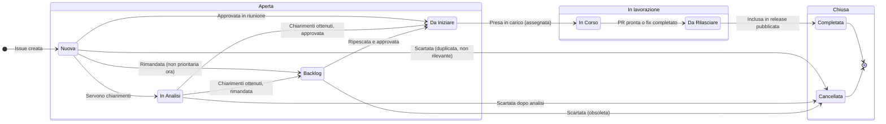

---
tags:
  - "#progetto:laif-issue"
  - "#fase:dev"
aggiornato: "2026-03-18"
---

# Processo Gestione Issue — Stack Interno

> Approccio progressivo: parti con le sezioni base, attiva le sezioni avanzate quando il team cresce.

---

## 1. Ciclo di vita issue



### Significato degli stati

| Stato | Significato | Chi agisce |
|-------|------------|------------|
| **Nuova** | Appena creata, non ancora discussa | Chiunque la crea |
| **Backlog** | Riconosciuta valida ma non prioritaria ora | Team in riunione |
| **In Analisi** | Servono chiarimenti tecnici o di scope | Assegnato analisi |
| **Da Iniziare** | Approvata, pronta per essere presa in carico | Team in riunione |
| **In Corso** | Qualcuno ci sta lavorando attivamente | Developer assegnato |
| **Da Rilasciare** | Lavoro completato, in attesa di release | Release manager |
| **Completata** | Inclusa in una release pubblicata | Automatico post-release |
| **Cancellata** | Scartata (duplicata, obsoleta, non rilevante) | Team in riunione |

---

## 2. RICE Scoring

Il RICE score permette di prioritizzare il backlog in modo oggettivo. Ogni issue nel DB ha 4 campi:

### Campi

| Campo | Tipo | Valori | Descrizione |
|-------|------|--------|-------------|
| **Reach** | Numero | 1-10 | Quanti progetti/team sono impattati |
| **Impatto** | Select | 3 / 2 / 1 / 0.5 / 0.25 | Quanto migliora l'esperienza |
| **Effort** | Numero | ore stimate | Tempo necessario per completare |
| **Confidence** | Select | 1 / 0.8 / 0.5 | Quanto siamo sicuri delle stime |

### Formula

```
RICE Score = (Reach x Impatto x Confidence) / Effort
```

### Guida ai valori

**Reach** (quanti ne beneficiano):
- `10` — Tutti i progetti LAIF + team interno
- `7-8` — La maggior parte dei progetti
- `4-6` — Alcuni progetti specifici
- `1-3` — Solo il team interno o un singolo progetto

**Impatto** (quanto migliora):
- `3` (Massive) — Cambia radicalmente il workflow, risolve un problema critico
- `2` (High) — Miglioramento significativo, risparmio tempo notevole
- `1` (Medium) — Miglioramento utile, qualita' della vita
- `0.5` (Low) — Nice to have, miglioramento marginale
- `0.25` (Minimal) — Cosmetico o edge case

**Effort** (ore stimate):
- Stimare in ore di lavoro effettivo
- Includere: sviluppo, test, review, documentazione
- In caso di incertezza, sovrastimare del 30%

**Confidence** (quanto siamo sicuri):
- `1` (High) — Requisiti chiari, soluzione nota, gia' fatto qualcosa di simile
- `0.8` (Medium) — Idea chiara ma qualche incognita tecnica
- `0.5` (Low) — Esplorativo, molte incognite, potrebbe richiedere spike

### Esempi concreti

| Issue | Reach | Impatto | Effort | Confidence | RICE |
|-------|-------|---------|--------|------------|------|
| Fix bug critico auth (tutti i progetti) | 10 | 3 | 4h | 1 | 7.5 |
| Nuovo componente UI (usato da 5 progetti) | 5 | 1 | 16h | 0.8 | 0.25 |
| Refactor interno build (solo DX) | 3 | 0.5 | 40h | 0.5 | 0.02 |

### Quando compilare il RICE

- **Issue nuove**: compilare in riunione (sezione "Da Stimare")
- **Stime aggiornate**: quando emergono informazioni nuove che cambiano effort/confidence
- **Non serve per**: bug urgenti in produzione (quelli si fanno subito)

---

## 3. Gestione Release

### Cadenza

- **Almeno una release a settimana** (di norma il mercoledi' o giovedi')
- Le release possono essere:
  - **Patch** (5.6.x) — bugfix, fix minori, nessun breaking change
  - **Minor** (5.x.0) — nuove feature, miglioramenti, possibili breaking change documentati
  - **Major** (x.0.0) — breaking change significativi, migrazioni necessarie

### Semver

Seguiamo [Semantic Versioning](https://semver.org/):
- **MAJOR**: breaking change che richiedono intervento nei progetti cliente
- **MINOR**: nuove funzionalita' retrocompatibili
- **PATCH**: bugfix retrocompatibili

### Processo release

1. Verificare che tutte le issue "Da Rilasciare" siano effettivamente pronte
2. Creare la Release nel DB Release su Notion
3. Associare le issue alla release
4. Eseguire la release (merge, tag, deploy)
5. Spostare le issue a "Completata"

### Release DRAFT

La release "DRAFT" raccoglie issue non ancora assegnate a una release specifica. Durante la riunione settimanale si decide cosa promuovere dalla DRAFT alle release pianificate.

---

## 4. Regole operative (livello base)

> Queste regole sono pensate per un team piccolo. Vedi sezione 6 per regole piu' strutturate.

- **Chiunque puo' creare issue** — non serve approvazione preventiva
- **Le issue si discutono in riunione** — l'approvazione e' informale, per consenso
- **Chi prende in carico un'issue se la assegna** — nessun assignment forzato
- **Bug in produzione**: fix immediato, issue creata a posteriori se necessario
- **Proposal**: richiedono discussione in riunione prima di iniziare lo sviluppo

### Tipi di issue

| Tipo | Descrizione | Processo |
|------|------------|----------|
| **Bug** | Qualcosa non funziona come dovrebbe | Fix prioritario, discussione rapida |
| **Proposal** | Idea di miglioramento o nuova feature | Discussione in riunione, RICE scoring |
| **Roadmap** | Tema strategico di lungo periodo | Discussione dedicata, filone associato |

---

## 5. Filoni

I filoni raggruppano issue per area tematica. Ogni filone ha un tag nel DB Issues.

| Filone | Tag Notion | Scope | Owner |
|--------|-----------|-------|-------|
| Test | `Filone - Test` | Test suite, coverage, CI test | TBD |
| Sicurezza | `Filone - Sicurezza` | Auth, cookie, permessi, vulnerabilita' | TBD |
| Gestione File | `Filone - Gestione File` | Media service, upload, preview | TBD |
| Upstream | `Filone - Upstream` | Copier, sync template, aggiornamenti | TBD |
| UI | `Filone - UI` | Componenti DS, layout, UX | TBD |
| CRUD Service | `Filone - CRUD Service` | Servizio CRUD generico, code generation | TBD |
| Date | `Filone - Date` | Gestione date, timezone, formati | TBD |
| Dev Experience AI | `Filone - Dev Experience AI` | MCP, agenti, tooling AI-assistito | TBD |
| Monitoring | `Filone - Monitoring` | Logging, metriche, alerting, dipendenze | TBD |

> **Breaking** e' un tag trasversale (non un filone) che indica issue con breaking change.

### Owner filone

L'owner di un filone:
- Ha la visione d'insieme sulle issue del filone
- Propone priorita' e sequenza di lavoro
- Non deve per forza sviluppare tutto — coordina

> **TODO**: assegnare owner ai filoni nella prossima riunione.

---

## 6. [Attivare dopo] Ruoli e gate

> Questa sezione e' da attivare quando il team cresce o quando serve piu' struttura.

### Ruoli

- **Creator**: chi crea l'issue (chiunque)
- **Reviewer**: chi valida la soluzione (peer review)
- **Owner**: chi e' responsabile del completamento (developer assegnato)
- **Release Manager**: chi gestisce la release (rotazione settimanale?)

### Gate di approvazione

| Transizione | Gate |
|-------------|------|
| Nuova -> Da Iniziare | Approvazione in riunione (o async dal lead) |
| In Corso -> Da Rilasciare | PR approvata + test passati |
| Da Rilasciare -> Completata | Release pubblicata |

### Escalation

- Issue bloccata da > 1 settimana -> segnalare in riunione
- Issue critica (produzione) -> escalation immediata via chat

---

## 7. [Attivare dopo] SLA

> Questa sezione e' da attivare quando serve garantire tempi di risposta.

| Fase | SLA proposto |
|------|-------------|
| Triage (Nuova -> stato successivo) | 1 settimana (entro la prossima riunione) |
| Review PR | 2 giorni lavorativi |
| Release (Da Rilasciare -> Completata) | 1 settimana |
| Bug critico (produzione) | 4 ore lavorative |
