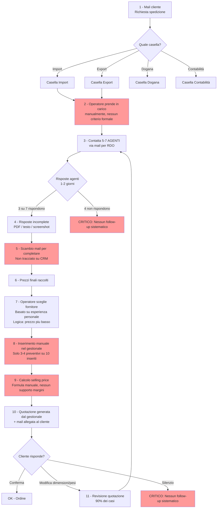
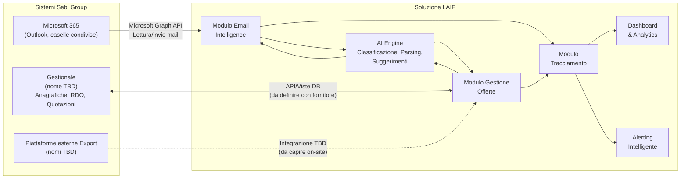

# Preparazione On-Site — Sebi Group · 16 Marzo 2026

## Obiettivo della giornata

Raccogliere tutti i requisiti necessari per produrre:
- **Stima dettagliata e modulare** dei costi di sviluppo
- **Mockup della soluzione** (consegnato successivamente)

---

## 1. Diagramma AS-IS — Flusso offerta (da validare on-site)

### 1.1 Punti critici evidenziati (rosso nel diagramma)

| # | Criticità | Impatto stimato |
|---|-----------|-----------------|
| 1 | Presa in carico manuale — nessun criterio di assegnazione/priorità | Clienti importanti trattati come chiunque, mail dimenticate |
| 2 | Nessun follow-up agli agenti che non rispondono | Offerte basate su meno opzioni, prezzo potenzialmente più alto |
| 3 | Scambio mail non tracciato — tutto fuori dal CRM/gestionale | Impossibile ricostruire storia, dipendenza dalla memoria dell'operatore |
| 4 | Inserimento parziale preventivi — solo 3-4 su 10 | Dati storici incompleti, impossibile fare analisi di mercato |
| 5 | Pricing senza supporto — nessun calcolo margini | Margini non ottimizzati, operatore fa quello che vuole |
| 6 | Nessun follow-up al cliente su quotazioni senza risposta | Revenue persa, nessuna metrica conversion rate |

---

## 2. Proposte di soluzione — Per modulo

Queste proposte sono basate su quanto emerso dalla call di kickoff del 17/02. Vanno validate e arricchite on-site.

### 2.1 Modulo Email Intelligence

**Problema**: 10-15 caselle condivise, nessun criterio di smistamento, mail perse, regole Outlook troppo superficiali.

**Proposta di soluzione**:
- Connessione alle caselle Microsoft 365 via **Microsoft Graph API** (lettura continua)
- **Classificatore AI** (LLM) che analizza ogni mail in ingresso ed estrae:
  - Tipo: richiesta offerta / comunicazione operativa / documentazione / sollecito / altro
  - Area: import / export / dogana / contabilità
  - Cliente riconosciuto (match con anagrafica gestionale)
  - Lingua e area geografica (per priorità fuso orario)
  - Urgenza stimata
- **Assegnazione automatica** all'operatore in base a regole configurabili (area, cliente, carico di lavoro)
- **ACK automatico** al cliente: "La sua richiesta è stata presa in carico da [operatore], ref. [ID]"
- **Solleciti automatici**: notifica interna se mail non lavorata entro N ore (configurabile)
- **Vista unificata**: tutte le caselle in un'unica interfaccia, con filtri per stato/priorità/assegnazione

**Domande aperte da validare on-site** (Sez. 3.1):
- Confermare che Microsoft 365 è il provider email per tutte le caselle
- Capire se ci sono caselle personali oltre a quelle condivise
- Verificare se accettano che il sistema legga tutte le mail o solo quelle in ingresso

### 2.2 Modulo Gestione Offerte (RDO → Preventivi → Quotazione)

**Problema**: ciclo offerta completamente manuale, non tracciato, preventivi non inseriti, nessun confronto strutturato.

**Proposta di soluzione**:
- **Creazione RDO dal sistema**: l'operatore seleziona il cliente, la merce, gli agenti destinatari → il sistema genera e invia la RDO via mail (o la interfaccia con il gestionale per generarla da lì)
- **Tracking risposte agenti**: il sistema collega le risposte alla RDO originale (via subject/thread ID o AI matching), mostra chi ha risposto e chi no
- **Sollecito automatico agenti**: se un agente non risponde entro X ore → remind automatico
- **Estrazione dati dai preventivi**: AI che parsa PDF/testo/screenshot e popola una tabella comparativa strutturata (prezzo, transit time, peso, volume, condizioni)
- **Tabella comparativa**: vista side-by-side dei preventivi ricevuti con evidenziazione del migliore per prezzo, per transit time, per rapporto qualità/prezzo
- **Calcolo selling price assistito**: applica formula/markup configurabile, mostra margine, suggerisce prezzo basandosi su storico rotta/cliente
- **Push automatico verso gestionale**: i dati dei preventivi vengono scritti nel gestionale via API (elimina inserimento manuale)
- **Gestione revisioni**: quando il cliente modifica specifiche, il sistema crea una nuova versione dell'offerta collegata alla precedente, pre-compila i dati invariati

**Domande aperte da validare on-site** (Sez. 3.2):
- La RDO deve partire dal nostro sistema o restare nel gestionale?
- Il parsing AI dei preventivi è accettabile anche se non 100% accurato (con review umana)?
- La formula di markup è documentata o è "nella testa" degli operatori?

### 2.3 Modulo Catena di Tracciamento

**Problema**: impossibile ricostruire la storia di un'offerta, mail sparse, nessun collegamento tra richiesta cliente e risposta finale.

**Proposta di soluzione**:
- **ID univoco per pratica**: generato alla presa in carico, collega tutto (mail cliente, RDO, risposte agenti, preventivi, quotazione, ordine)
- **Timeline visuale**: per ogni pratica, vista cronologica di tutti gli eventi (mail in/out, preventivi ricevuti, quotazione inviata, modifiche)
- **Collegamento bidirezionale con gestionale**: l'ID pratica viene scritto nel gestionale e viceversa
- **Ricerca full-text**: possibilità di cercare per cliente, agente, rotta, merce, ID, date

### 2.4 Modulo Dashboard & Analytics (Fase 2)

**Problema**: dati disponibili ma non sfruttati, statistiche consultate solo a posteriori, nessun supporto decisionale real-time.

**Proposta di soluzione**:
- **Dashboard operativa** (per operatori/team lead):
  - Mail in coda / assegnate / in ritardo
  - Offerte aperte per stato (RDO inviata, preventivi ricevuti, quotazione inviata, in attesa conferma)
  - Solleciti pendenti
- **Dashboard management** (per Michele/direzione):
  - Conversion rate: quotazioni richieste vs affidate (per cliente, per rotta, per operatore)
  - Tempi medi di risposta (per fase del ciclo)
  - Performance agenti (tempi risposta, completezza, competitività prezzi)
  - Margini medi per rotta/cliente
  - Trend volumi e fatturato
- **Prompt AI libero** (Fase 2 avanzata): "Quali clienti hanno chiesto più di 10 quotazioni nell'ultimo mese senza affidare nulla?"

### 2.5 Modulo Alerting Intelligente

**Problema**: nessun sistema di allarme proattivo su comportamenti anomali o situazioni critiche.

**Proposta di soluzione**:
- Alert configurabili su:
  - Mail non lavorata oltre soglia (es. 4h, 8h, 24h)
  - Agente che non risponde a RDO oltre soglia
  - Cliente che modifica specifiche >N volte sulla stessa offerta
  - Cliente con conversion rate sotto soglia (tante quotazioni, pochi ordini)
  - Cliente fuori fido o con pagamenti scaduti (dato da gestionale)
  - Quotazione in scadenza senza risposta dal cliente
- Canali: notifica in-app, email digest giornaliero, eventualmente Slack/Teams

---

## 3. Domande per area — Checklist on-site

> **Come usare**: annota il numero della domanda (es. "3.1.4") e la risposta a fianco. Le domande contrassegnate con **(DEV)** servono specificamente per lo sviluppo tecnico.

### 3.1 Gestione Email (con operativi Import + Export)

**Struttura e volumi:**
- 3.1.1 — Quante mail arrivano in media **al giorno** per casella? E in totale su tutte le caselle?
- 3.1.2 — Di queste, quante sono richieste di offerta vs comunicazioni operative vs altro (spam, notifiche, ecc.)?
- 3.1.3 — C'è un pattern negli orari di arrivo legato ai fusi orari? (es. mattina = Asia, pomeriggio = Americhe)
- 3.1.4 — **(DEV)** Usate solo Outlook 365? Quale piano (Business Basic, Standard, Premium)? Ci sono caselle su altri provider?
- 3.1.5 — **(DEV)** Le regole Outlook attuali cosa fanno esattamente? Possiamo vederle a schermo?
- 3.1.6 — Ci sono caselle personali degli operatori coinvolte nel flusso, o tutto passa dalle caselle condivise?

**Processo di presa in carico:**
- 3.1.7 — Come decide l'operatore quale mail prendere per prima? C'è un criterio implicito (cliente grande, urgenza, ordine di arrivo)?
- 3.1.8 — Succede che due operatori lavorino la stessa mail? Come lo gestite oggi?
- 3.1.9 — Quanto tempo passa in media tra arrivo mail e presa in carico?
- 3.1.10 — Ci sono mail che "cadono nel vuoto" regolarmente? Con quale frequenza stimata?
- 3.1.11 — Quando un operatore è assente (ferie, malattia), chi copre le sue mail? Come avviene il passaggio?

**Differenze Import/Export:**
- 3.1.12 — *Export*: come funziona l'identificazione tramite sigle nell'oggetto? Mostratemelo su una mail reale
- 3.1.13 — **(DEV)** *Export*: quali piattaforme esterne usate oltre al gestionale? (nomi, funzione, hanno API?)
- 3.1.14 — *Import*: il processo è descritto come "più strutturato" — in cosa consiste esattamente la differenza?
- 3.1.15 — Le caselle sono per reparto (import, export) o per funzione (RDO, clienti, documentazione)?
- 3.1.16 — Ci sono mail che riguardano sia import che export? Come le gestite?

### 3.2 Ciclo offerta e preventivi (con operativi)

**RDO e Agenti:**
- 3.2.1 — Quanti agenti gestite in totale? L'elenco è stabile o cambia spesso?
- 3.2.2 — Come scegliete a quali agenti inviare la RDO? (per rotta? tipo merce? affidabilità? relazione personale?)
- 3.2.3 — La RDO viene generata dal gestionale — possiamo vederne una a schermo? In che formato esce (PDF, mail, entrambi)?
- 3.2.4 — La RDO è standard o va personalizzata per ogni agente/richiesta?
- 3.2.5 — Come gestite gli agenti che non rispondono? Dopo quanto rinunciate?
- 3.2.6 — Capita di inviare RDO per la stessa richiesta a ondate successive (prima 3 agenti, poi altri 3)?

**Raccolta preventivi:**
- 3.2.7 — In che formato arrivano i preventivi? (PDF strutturato, PDF immagine, testo in mail, screenshot, Excel, altro?)
- 3.2.8 — **(DEV)** Quali campi/dati contiene un preventivo tipo? (prezzo, valuta, transit time, peso, volume, condizioni, validità, altro?)
- 3.2.9 — Come confrontate i preventivi tra loro oggi? (Excel? A mente? Stampati affiancati?)
- 3.2.10 — Il markup/formula di calcolo del selling price è documentato? Varia per cliente, rotta, tipo merce?
- 3.2.11 — Chi decide il prezzo finale? L'operatore ha autonomia o serve approvazione?
- 3.2.12 — Ci sono casi in cui proponete al cliente più opzioni (es. veloce ma costoso vs lento ma economico)?

**Revisioni:**
- 3.2.13 — Il 90% richiede revisioni: il trigger è sempre cambio dimensioni/pesi, o anche altri motivi?
- 3.2.14 — Quando c'è una revisione, rifate la RDO agli agenti o ricalcolate solo il prezzo?
- 3.2.15 — Quante revisioni in media per offerta? E quanto dura l'intero ciclo dalla richiesta all'ordine?
- 3.2.16 — Come tracciate le diverse versioni di un'offerta? (nuovo documento? mail? sovrascrittura?)

### 3.3 Gestionale e dati (con Stefano/Gabriella + demo gestionale)

**Stato attuale:**
- 3.3.1 — **(DEV)** Che gestionale è? (nome prodotto, versione) Chi è il fornitore?
- 3.3.2 — Possiamo vedere una demo live? (navigazione, creazione RDO, inserimento preventivo, generazione quotazione)
- 3.3.3 — **(DEV)** Che database usa il gestionale? (SQL Server, Oracle, PostgreSQL, altro?)
- 3.3.4 — **(DEV)** Il fornitore ha documentazione API? Ha parlato di REST API, web service, stored procedure, o solo accesso diretto a viste DB?
- 3.3.5 — Quali dati sono già nel gestionale? (anagrafiche clienti, anagrafiche agenti/fornitori, fatturato, storico ordini, storico quotazioni, altro?)
- 3.3.6 — Quanti anni di dati storici avete? Quante quotazioni/mese indicativamente?
- 3.3.7 — **(DEV)** Chi è il referente tecnico del fornitore gestionale? Possiamo avere un contatto diretto?

**Integrazioni desiderate:**
- 3.3.8 — Se poteste automatizzare UNA sola cosa nel gestionale, quale sarebbe?
- 3.3.9 — L'inserimento manuale di un preventivo: quanti campi si compilano? Quanto tempo richiede (minuti)?
- 3.3.10 — Le statistiche che già avete: come le consultate? (report interni, export Excel, nessuno?)
- 3.3.11 — Ci sono dati che vorreste avere ma oggi non tracciate? (es. tempi risposta, margini reali, conversion rate)
- 3.3.12 — **(DEV)** Il gestionale ha un modulo di export dati? In che formato? (CSV, Excel, API?)

### 3.4 KPI e Dashboard (con management — Michele)

**Metriche:**
- 3.4.1 — Quali numeri guardate oggi, anche informalmente? (fatturato, numero offerte, carico operatori?)
- 3.4.2 — Quali KPI vorreste avere **per primi** se poteste sceglierne solo 3?
- 3.4.3 — Chi deve vedere cosa? Fatemi la mappa: operatore vede X, team lead vede Y, direzione vede Z
- 3.4.4 — Con quale frequenza volete aggiornamenti? (real-time? digest giornaliero? report settimanale?)

**Priorità business:**
- 3.4.5 — Qual è il costo stimato (anche a spanne) di una mail persa o quotazione non processata in tempo?
- 3.4.6 — Il problema è più di **velocità** (rispondere prima dei competitor) o di **controllo** (sapere cosa succede)?
- 3.4.7 — Ci sono periodi dell'anno con picchi di lavoro? (capodanno cinese, stagionalità, Black Friday?)
- 3.4.8 — Avete un obiettivo numerico che definirebbe il successo del progetto? (es. "rispondere entro 4h", "inserire il 100% dei preventivi", "ridurre il ciclo offerta a 5 giorni")

### 3.5 Vincoli e requisiti non funzionali

**Utenti e accesso:**
- 3.5.1 — Quanti utenti useranno il sistema? Suddivisi per reparto/ruolo?
- 3.5.2 — Serve accesso mobile o basta web desktop?
- 3.5.3 — **(DEV)** Lavorate con VPN, rete interna, o il sistema deve essere raggiungibile da qualsiasi rete?
- 3.5.4 — Ci sono requisiti di sicurezza particolari? (dati sensibili, GDPR, compliance di settore, audit trail)

**Vincoli tecnici:**
- 3.5.5 — **(DEV)** Avete un IT interno o vi affidate completamente al fornitore gestionale?
- 3.5.6 — **(DEV)** Microsoft 365: quale piano? (Business Basic, Standard, Premium, E3, E5) — serve per le API
- 3.5.7 — **(DEV)** Il fornitore gestionale ha limiti su frequenza chiamate API o volumi dati?
- 3.5.8 — Ci sono vincoli di budget che ci aiutano a modularizzare meglio la proposta? (es. "fase 1 entro X€")
- 3.5.9 — C'è una deadline o un evento che guida le tempistiche? (es. "vorremmo andare live entro settembre")

---

## 4. Mappa dei sistemi da integrare

### 4.1 Integrazioni identificate

| # | Sistema | Tipo integrazione | Direzione | Dati | Stato conoscenza | Da chiedere on-site |
|---|---------|-------------------|-----------|------|-----------------|---------------------|
| I-1 | Microsoft 365 (Outlook) | Microsoft Graph API | Lettura + invio mail | Mail, allegati, thread, caselle condivise | Confermato M365, piano TBD | Piano M365, consenso admin, caselle personali vs condivise (3.1.4, 3.1.6) |
| I-2 | Gestionale (nome TBD) | API / Viste DB / Stored procedure | Bidirezionale | Anagrafiche clienti, anagrafiche agenti, fatturato, storico ordini, quotazioni, RDO | Fornitore disponibile, tipo integrazione TBD | Nome gestionale, tipo DB, documentazione API, referente tecnico (3.3.1-3.3.7) |
| I-3 | Piattaforme export esterne | TBD | TBD | TBD | Solo menzionate, nessun dettaglio | Nomi, funzione, hanno API? (3.1.13) |
| I-4 | Provider email agenti | SMTP/IMAP via M365 | Invio RDO + ricezione preventivi | Mail, allegati (PDF, screenshot) | Transita via M365 | Confermare che tutto passa da M365, nessun canale alternativo (WhatsApp, telefono?) |

### 4.2 Dati da acquisire dal gestionale (checklist per meeting fornitore)

> Questa lista serve per il meeting con il fornitore gestionale, **dopo** l'on-site. Annota on-site cosa di questo è già disponibile.

- [ ] **Anagrafica clienti**: ragione sociale, codice, contatti, indirizzo, partita IVA, settore
- [ ] **Anagrafica agenti/fornitori**: ragione sociale, codice, contatti, rotte servite, specializzazione
- [ ] **Fatturato clienti**: storico per periodo, per rotta, per tipo servizio
- [ ] **Storico quotazioni**: data, cliente, rotta, merce, prezzo offerto, stato (accettata/rifiutata/scaduta)
- [ ] **Storico ordini**: collegamento quotazione → ordine, date, importi, margini
- [ ] **RDO**: dati strutturati della richiesta (merce, peso, volume, origine, destinazione, tipo trasporto)
- [ ] **Preventivi agenti**: prezzi ricevuti, transit time, condizioni (quelli inseriti — 30%)
- [ ] **Stato fido/pagamenti**: esposizione creditizia, scaduto, rating
- [ ] **Performance temporali**: timestamp di lavorazione pratiche (se tracciati)

---

## 5. Checklist informazioni per lo sviluppo

> Informazioni tecniche da raccogliere per poter stimare correttamente e accelerare lo sviluppo. Molte sono domande **(DEV)** già presenti nella sezione 3, qui aggregate.

### 5.1 Email & Microsoft 365

- [ ] Piano Microsoft 365 in uso (3.1.4) — determina quali API Graph sono disponibili
- [ ] Numero esatto di caselle da monitorare e nomi (es. import@sebigroup.com)
- [ ] Admin Microsoft 365: chi è? Può concedere permessi app (OAuth consent)?
- [ ] Caselle personali coinvolte nel flusso? (3.1.6)
- [ ] Volume medio mail/giorno per casella (3.1.1)
- [ ] Dimensione media allegati (per storage e parsing)

### 5.2 Gestionale

- [ ] Nome e versione del gestionale (3.3.1)
- [ ] Tipo di database sottostante (3.3.3)
- [ ] Tipo integrazione disponibile: REST API / SOAP / Viste DB / Stored procedure / File export (3.3.4)
- [ ] Documentazione API esistente? (3.3.4)
- [ ] Referente tecnico del fornitore — nome e contatto diretto (3.3.7)
- [ ] Limiti tecnici: rate limit, volumi, finestre di manutenzione (3.5.7)
- [ ] Ambiente di test/staging disponibile? O solo produzione?

### 5.3 Piattaforme esterne (Export)

- [ ] Nomi delle piattaforme usate dal reparto export (3.1.13)
- [ ] Funzione di ciascuna (booking? tracking? documentazione?)
- [ ] Hanno API? Sono SaaS o on-premise?
- [ ] Sono indispensabili o sostituibili dalla nostra soluzione?

### 5.4 Infrastruttura e sicurezza

- [ ] IT interno o tutto esternalizzato? (3.5.5)
- [ ] Rete: VPN, firewall, accesso da remoto? (3.5.3)
- [ ] Requisiti GDPR specifici per dati di spedizione? (3.5.4)
- [ ] Active Directory / SSO in uso? Serve autenticazione integrata?
- [ ] Policy su hosting: cloud ok? Preferenza datacenter EU?

### 5.5 Utenti e volumi

- [ ] Numero utenti totali e per ruolo (3.5.1)
- [ ] Numero quotazioni/mese (3.3.6)
- [ ] Numero RDO/mese
- [ ] Numero agenti attivi (3.2.1)
- [ ] Numero clienti attivi
- [ ] Picchi stagionali (3.4.7)

---

## 6. Agenda proposta (1 giornata)

| Ora | Durata | Attività | Sezioni di riferimento | Con chi |
|-----|--------|----------|----------------------|---------|
| 9:00 | 30 min | Allineamento, obiettivi giornata, validazione diagramma AS-IS (Sez. 1) | 1 | Tutti |
| 9:30 | 1h | Demo gestionale live + flusso reale operativo | 3.3 | Stefano, Gabriella, operativi |
| 10:30 | 15 min | Pausa | | |
| 10:45 | 1h | Deep-dive Export: email, piattaforme esterne, processo end-to-end | 3.1, 3.2 | Operativi Export |
| 11:45 | 1h | Deep-dive Import: email, processo, uso gestionale | 3.1, 3.2 | Operativi Import |
| 12:45 | 45 min | Pausa pranzo | | |
| 13:30 | 45 min | Pricing, margini, revisioni, formula calcolo selling price | 3.2.10-3.2.16 | Stefano/Gabriella + commerciali |
| 14:15 | 30 min | Presentazione proposte di soluzione (Sez. 2), feedback | 2 | Tutti |
| 14:45 | 30 min | KPI, dashboard, obiettivi business, criteri di successo | 3.4 | Michele |
| 15:15 | 30 min | Vincoli tecnici, integrazioni, infrastruttura | 3.5, 4, 5 | Stefano/Gabriella |
| 15:45 | 30 min | Wrap-up: priorità moduli, primi sketch TO-BE, prossimi step | | Tutti |

---

## 7. Materiale da portare

- [ ] Questo documento stampato (domande numerate + spazio per appunti)
- [ ] Diagramma AS-IS stampato A3 o A4 landscape (farlo commentare e correggere)
- [ ] Proposte di soluzione per modulo (Sez. 2) — da mostrare nel pomeriggio
- [ ] Mappa sistemi da integrare (Sez. 4) — da completare on-site
- [ ] Notebook / iPad per sketch rapidi dei flussi TO-BE
- [ ] Checklist sviluppo (Sez. 5) — da spuntare man mano

---

## 8. Dopo l'on-site

1. Strutturare requisiti con skill `estrazione-requisiti` (le note meeting sono l'input)
2. Pianificare meeting con fornitore gestionale (con le domande della Sez. 5.2)
3. Produrre stima dettagliata e modulare (basata sui moduli della Sez. 2)
4. Generare mockup della soluzione
