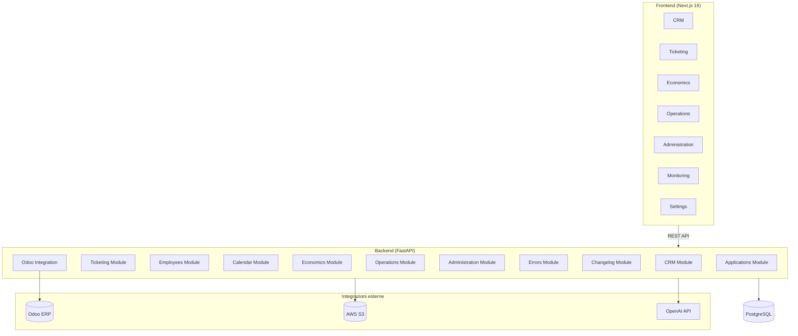

# Architettura — Wolico

## Overview

Wolico è una web app full-stack basata su LAIF Template. Il backend FastAPI espone API REST per 10+ moduli funzionali, il frontend Next.js 16 con React 19 li presenta in un'interfaccia unificata. Il database PostgreSQL centralizza tutti i dati operativi. L'integrazione Odoo sincronizza dati contabili, l'integrazione OpenAI + pgvector abilita funzionalità AI.

---

## Stack tecnologico

| Layer | Tecnologia | Versione | Note |
|-------|-----------|---------|------|
| Frontend | Next.js (React 19, TypeScript) | 16.1 | Turbopack attivo |
| UI | laif-ds + amCharts 5 | 0.2.74 / 5.16 | Design system LAIF + grafici |
| State | Redux Toolkit + React Query | 2.11 / 5.90 | State globale + cache API |
| i18n | react-intl | 8.1 | Internazionalizzazione |
| Backend | FastAPI (Python 3.12) | 0.131 | Async, auto-docs OpenAPI |
| ORM | SQLAlchemy 2 + Alembic | 2.0.46 | Async via asyncpg |
| Database | PostgreSQL | — | Schema `prs` + `template` |
| AI | OpenAI + pgvector | — | Embeddings |
| ERP | Odoo | — | Integrazione fatture/pagamenti |
| Infra | AWS (S3, CloudWatch) | — | Storage + monitoring |
| Auth | python-jose + passlib + bcrypt | — | JWT |
| Testing BE | pytest + pytest-asyncio | 9.0 | — |
| Testing FE | Playwright | — | Component + E2E |
| Linting | ruff | 0.15 | — |
| API Client | openapi-typescript-codegen | — | Auto-generato da OpenAPI |

---

## Diagramma architetturale

---

## Moduli backend

### CRM (`crm/`)

**Responsabilità**: gestione lead, sales, partners, contacts, notes, tag, tranche fatture
**Entità principali**: Leads, LeadStatusUpdates, LeadTags, Sales, Partners, Contacts, InvoiceTranches, TranchePayments
**Interfacce**: REST API standard LAIF Template

### Ticketing (`ticketing/`)

**Responsabilità**: sistema ticket per le app LAIF in produzione
**Entità principali**: ApplicationTicket, ApplicationTicketMessage, ApplicationTicketAttachment, ApplicationTicketUpdate
**Interfacce**: REST API + relazione con Applications

### HR / Employees (`employees/`)

**Responsabilità**: anagrafiche dipendenti e contratti
**Entità principali**: Employees, EmployeeContracts
**Interfacce**: REST API, usato da Calendar per ferie

### Calendar (`calendar/`)

**Responsabilità**: tracking giorni lavorativi, festivi, ferie, weekend
**Entità principali**: Calendar
**Interfacce**: REST API, esposto anche via MCP Server (`mcp-servers/wolico/`)

### Economics (`economics/`)

**Responsabilità**: cash flow, balance, marginalità, ricavi
**Entità principali**: CashFlow, CashCategories, CashOutVoices, CashOutDetails, Balance, Marginality, Revenues

### Operations (`operations/`)

**Responsabilità**: costi cloud, staffing, outages, reporting ore, gestione ufficio
**Entità principali**: Reporting, ReportingCategories, ReportingSubCategories, Cloud, Outages, Staffing, Office

### Administration (`administration/`)

**Responsabilità**: spese aziendali, recap mensili
**Entità principali**: Expenses, ExpenseVoices, MonthlyRecap

### Monitoring — Errors (`errors/`)

**Responsabilità**: tracking errori backend e frontend delle app LAIF
**Entità principali**: ApplicationBackendErrors, ApplicationFrontendErrors

### Applications (`applications/`)

**Responsabilità**: registro delle app LAIF, utenti, maintainers, periodi infra
**Entità principali**: Applications, ApplicationUsers, ApplicationMaintainers, InfraPeriod

### Odoo Integration (`odoo/`)

**Responsabilità**: sync dati contabili da Odoo ERP
**Entità principali**: OdooInvoices, OdooInvoicePayments

---

## Database

- **Schema principale**: `prs` (tutte le tabelle applicative)
- **Schema template**: `template` (tabelle laif-template: auth, tenants, settings)
- **Migrazioni**: 28 file Alembic in `backend/alembic/versions/`
- **Connector**: asyncpg (async PostgreSQL)

---

## Dipendenze esterne

| Servizio | Scopo | Criticità | Note |
|---------|-------|----------|------|
| Odoo ERP | Dati contabili, fatture | Media | Sync periodico |
| AWS S3 | Storage file | Media | Allegati ticket, documenti |
| AWS CloudWatch | Monitoring | Bassa | Log centralizzati |
| OpenAI | Embeddings, AI | Bassa | Funzionalità opzionali |

---

## Considerazioni di sicurezza

- **Autenticazione**: JWT (python-jose + passlib + bcrypt)
- **Autorizzazione**: RBAC via laif-template
- **Dati sensibili**: contabilità e dati dipendenti in DB, non esposti pubblicamente
- **Backup**: gestito a livello infrastruttura AWS

---

## Debito tecnico noto

| # | Descrizione | Impatto | Priorità |
|---|------------|--------|---------|
| — | Nessun debito tecnico documentato al momento | — | — |
