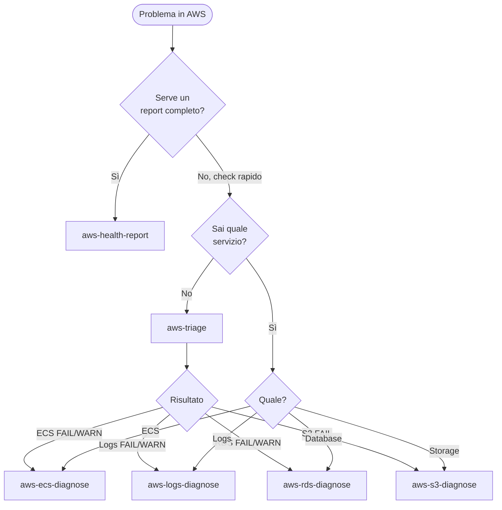

# AWS Diagnostics — Skill di diagnosi read-only

Pacchetto di skill per la diagnosi di ambienti AWS LAIF. Tutti i comandi sono **read-only**: nessuna modifica alle risorse.

---

## Flowchart di selezione



---

## Skill disponibili

| Skill | Scopo | Comandi chiave |
|-------|-------|----------------|
| **aws-health-report** | **Report HTML completo** con grafici SVG, semafori, tabelle filtrabili | Tutti i comandi delle altre skill |
| **aws-triage** | Health check rapido su tutti i servizi | describe-services, describe-db-instances, start-query, head-bucket |
| **aws-ecs-diagnose** | Deep-dive ECS (deployment, task failure, capacity, config) | describe-services, describe-tasks, describe-clusters, describe-task-definition |
| **aws-logs-diagnose** | Query CloudWatch Logs Insights (6 template + custom) | start-query, get-query-results |
| **aws-rds-diagnose** | Stato RDS, connessioni, log PostgreSQL, parametri | describe-db-instances, describe-db-parameters, download-db-log-file-portion |
| **aws-s3-diagnose** | Inventario bucket, dimensioni, upload recenti | list-objects-v2, head-bucket, s3 ls |

---

## Prerequisiti

1. **AWS CLI** installata e configurata (`aws --version`)
2. **Profili AWS** configurati per ogni ambiente (`~/.aws/config`)
3. **`aws-config.yaml`** per il progetto (generato al primo uso, vedi `_shared/config-discovery.md`)

---

## Uso rapido

```bash
# Report HTML completo (grafici, tabelle, semafori)
python3 skills/development/aws-diagnostics/aws-health-report/run.py --project jubatus --env dev

# Triage completo
python3 skills/development/aws-diagnostics/aws-triage/run.py --project jubatus --env dev

# Errori nei log (ultima ora)
python3 skills/development/aws-diagnostics/aws-logs-diagnose/run.py --project jubatus --env dev --query-type errors --time-window 1h

# Task che crashano
python3 skills/development/aws-diagnostics/aws-ecs-diagnose/run.py --project jubatus --env dev --mode task-failure

# Stato database
python3 skills/development/aws-diagnostics/aws-rds-diagnose/run.py --project jubatus --env dev --mode status

# Inventario bucket
python3 skills/development/aws-diagnostics/aws-s3-diagnose/run.py --project jubatus --env dev --bucket all --mode overview
```

---

## Configurazione: aws-config.yaml

Ogni progetto ha un file `projects/[nome]/aws-config.yaml` con i nomi delle risorse AWS derivati dalle convenzioni CDK.

### Naming convention (da CDK LAIF)

| Risorsa | Pattern |
|---------|---------|
| ECS Cluster | `{env}-{app_name}-cluster` |
| ECS Service | `{env}-{app_name}-be-service` |
| ECS Task Family | `{env}-{app_name}-be-task` |
| Log Group | `{env}-{app_name}-be-task-log-group` |
| RDS Identifier | `{env}-{customer_name}-db` |
| S3 Data Bucket | `{env}-{app_name}-data` |
| S3 Frontend | `{env}-{app_name}-fe-frontend` |

Nota: RDS usa `customer_name` (non `app_name`) nella naming convention.

Per generare il file: `_shared/config-discovery.md`

---

## Vincoli di sicurezza

- **Solo read-only**: whitelist esplicita in `_shared/aws_runner.py`
- **Profilo esplicito**: mai usare il profilo default
- **Timeout**: 30s per comando, 30s per polling Logs Insights
- **No credenziali in output**: valori sensibili (SECRET, KEY, TOKEN, PASSWORD, ARN) mascherati

---

## Struttura

```
aws-diagnostics/
├── README.md                    ← questo file
├── _shared/
│   ├── config.py                ← gestione aws-config.yaml
│   ├── aws_runner.py            ← wrapper AWS CLI (whitelist read-only)
│   ├── output.py                ← formattazione tabelle e semafori
│   ├── collectors.py            ← layer raccolta dati (return dict, no print)
│   ├── config-discovery.md      ← procedura generazione config
│   └── query-templates.md       ← query CloudWatch Logs Insights
├── aws-health-report/           ← report HTML completo con grafici SVG
│   ├── SKILL.md
│   ├── run.py                   ← entry point: orchestra raccolta + rendering
│   ├── html_renderer.py         ← genera HTML self-contained
│   └── chart_svg.py             ← grafici SVG inline
├── aws-triage/
│   ├── SKILL.md
│   └── run.py
├── aws-ecs-diagnose/
│   ├── SKILL.md
│   └── run.py
├── aws-logs-diagnose/
│   ├── SKILL.md
│   └── run.py
├── aws-rds-diagnose/
│   ├── SKILL.md
│   └── run.py
└── aws-s3-diagnose/
    ├── SKILL.md
    └── run.py
```

#stack:aws #fase:development
