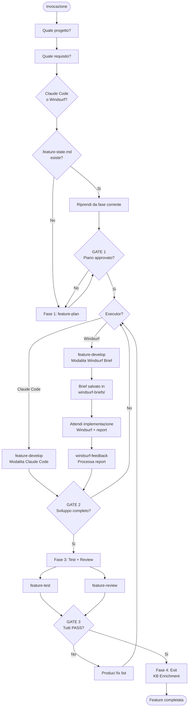

# Skill: Feature Workflow

## Obiettivo

Orchestra il ciclo di vita completo di una feature attraverso 4 fasi con gate di qualita:
**Plan → Develop → Test + Review → Exit**.

Coordina le sub-skill (`feature-plan`, `feature-develop`, `feature-test`, `feature-review`, `windsurf-feedback`) e gestisce i gate tra le fasi.

---

## Perimetro

**Fa**: orchestrazione delle 4 fasi, gestione gate, stato condiviso via `.feature-state.md`, selezione executor (Claude Code o Windsurf), aggiornamento `feature-log.md` a fine ciclo, collegamento con skill esistenti (`estrazione-decisioni`, `windsurf-feedback`, `verifica-pre-commit`).

**NON fa**: le singole fasi in dettaglio — le delega alle sub-skill. Per dettagli su ciascuna fase:
- Pianificazione → `skills/development/feature-plan/`
- Sviluppo → `skills/development/feature-develop/`
- Feedback Windsurf → `skills/development/windsurf-feedback/`
- Test → `skills/development/feature-test/`
- Review → `skills/development/feature-review/`

---

## Quando usarla

- Quando si vuole sviluppare una feature end-to-end con il processo completo
- Quando si vuole riprendere una feature in corso (`.feature-state.md` esiste gia)
- Per feature di complessita media o grande (per task piccoli, le sub-skill standalone sono sufficienti)

---

## Prerequisiti

- [ ] Progetto inizializzato in `projects/[nome]/`
- [ ] Requisito identificato (RF-XX in `requisiti.md` o descrizione libera)
- [ ] Accesso alla codebase del progetto (repo Git)

---

## Loop conversazionale

Fai le domande in questo ordine, **una alla volta**:

1. **Quale progetto?** (nome cartella in `projects/`)
2. **Quale requisito?** (RF-XX da `requisiti.md`, oppure descrizione libera)
3. **Claude Code o Windsurf?** — "Vuoi sviluppare con Claude Code o Windsurf?"
4. **Riprendere da una fase precedente?** (solo se `.feature-state.md` esiste gia — mostra la fase corrente e chiedi se riprendere o ricominciare)

---

## Processo di produzione

### Flusso completo

```
Plan → GATE 1 → Develop → GATE 2 → Test + Review → GATE 3 → Exit
                                     (paralleli)
```



### Fase 1: Plan

1. Crea `.feature-state.md` in `projects/[nome]/` con frontmatter iniziale:
   ```yaml
   ---
   feature: "RF-XX — Nome Feature"
   stato: plan
   executor: cc | windsurf
   data-inizio: "YYYY-MM-DD"
   ---
   ```
2. Invoca `skills/development/feature-plan/` (leggi SKILL.md e segui il processo)
3. Il piano viene scritto nella sezione `## Piano` di `.feature-state.md`

### GATE 1: Plan → Develop

**Condizioni**:
- [ ] Piano completo (task list, file coinvolti, criteri di accettazione)
- [ ] Approvazione esplicita dell'utente

**Se l'utente chiede modifiche**: torna a feature-plan con le indicazioni.

### Fase 2: Develop

1. Aggiorna `.feature-state.md` stato → `develop`
2. Invoca `skills/development/feature-develop/` (leggi SKILL.md e segui il processo)

#### Se executor = Claude Code:
3. feature-develop implementa direttamente
4. Lo sviluppo viene registrato nella sezione `## Sviluppo` di `.feature-state.md`
5. Procedi con GATE 2

#### Se executor = Windsurf:
3. feature-develop genera il brief strutturato e lo salva in `projects/[nome]/windsurf-briefs/`
4. Comunica all'utente: "Brief pronto. Passalo a Windsurf per l'implementazione."
5. **ATTENDI**: l'utente torna con il report compilato da Windsurf
6. Invoca `skills/development/windsurf-feedback/` per processare il report
7. Lo sviluppo viene registrato nella sezione `## Sviluppo` di `.feature-state.md`
8. Procedi con GATE 2

### GATE 2: Develop → Test + Review

**Condizioni**:
- [ ] Tutti i task del piano implementati
- [ ] Codice compila senza errori (verificato direttamente per CC, confermato dall'utente per Windsurf)
- [ ] Conferma dell'utente che lo sviluppo e completo

**Se task mancanti**: torna a feature-develop con la lista dei task mancanti.

### Fase 3: Test + Review (paralleli)

1. Aggiorna `.feature-state.md` stato → `test-review`
2. Invoca `skills/development/feature-test/` e `skills/development/feature-review/`:
   - **Se Team mode**: lancia come agenti paralleli (test e review scrivono su sezioni diverse di `.feature-state.md`)
   - **Se sequenziale**: esegui prima test, poi review (o viceversa — l'ordine non importa)
3. I risultati vengono scritti nelle sezioni `## Test` e `## Review` di `.feature-state.md`

### GATE 3: Test + Review → Exit

**Condizioni**:
- [ ] Tutti i test passano (nuovi + suite esistente)
- [ ] Tutti i criteri di accettazione verificati
- [ ] Zero issue critiche dalla review
- [ ] Nessuna regressione

**Se FAIL**:
1. Produci una **fix list** combinando:
   - Test falliti (da sezione Test)
   - Issue critiche (da sezione Review)
2. Torna a **Fase 2: Develop** con la fix list
   - Se executor = Windsurf: genera un **fix brief** ridotto (solo i fix necessari, non l'intera feature)
3. Dopo il fix, riesegui **solo Fase 3** (Test + Review) — non il piano

### Fase 4: Exit

Quando GATE 3 e PASS:

1. **Decisioni tecniche**: se durante lo sviluppo sono emerse decisioni non banali:
   - Chiedi: "Durante lo sviluppo sono emerse decisioni tecniche significative da documentare come ADR?"
   - Se si → invoca `skills/development/estrazione-decisioni/`
2. **KB Enrichment** (solo se executor = Windsurf):
   - Verifica che il report Windsurf sia stato processato da `windsurf-feedback`
   - Se ci sono pattern/problemi/decisioni pendenti non ancora processati, processali ora
3. **Feature log**: aggiorna `projects/[nome]/feature-log.md` con una nuova entry:
   - Data, nome feature, requisito di riferimento
   - Descrizione, implementazione (scelte non ovvie), problemi e soluzioni
   - Executor utilizzato (Claude Code o Windsurf)
   - Link a codice/PR se disponibile
4. **Pattern candidati**: se la review ha identificato pattern estraibili:
   - Segnala all'utente: "La review ha identificato [N] pattern candidati per estrazione"
   - Proponi di eseguire `estrazione-pattern` dopo il commit
5. **Cleanup**: aggiorna `.feature-state.md` stato → `completata`, poi eliminalo
6. **Commit**: procedi con il commit (→ scatta `verifica-pre-commit` come da Regola 1 di CLAUDE.md)

---

## Stato condiviso: `.feature-state.md`

File temporaneo che tiene traccia del progresso. Prefisso `.` per segnalare che e transitorio. Eliminato a fine workflow.

```markdown
---
feature: "RF-XX — Nome Feature"
stato: plan | develop | test-review | completata
executor: cc | windsurf
data-inizio: "YYYY-MM-DD"
---

## Piano
[output di feature-plan: task, file, criteri, rischi]

## Sviluppo
[output di feature-develop: file creati/modificati, scelte]
[se Windsurf: path brief, path report, riepilogo feedback]

## Test
[output di feature-test: test scritti, risultati, criteri]

## Review
[output di feature-review: issue, pattern, verdetto]
```

---

## Output in chat (obbligatorio al termine)

```
COMPLETATO — Feature Workflow

Feature completata: [RF-XX — titolo]
Executor: [Claude Code | Windsurf]

Riepilogo fasi:
  Plan:    [N] task identificati
  Develop: [N] file creati, [N] modificati
  Test:    [N] test scritti, tutti PASS
  Review:  [N] issue minori, 0 critiche

Documenti aggiornati:
  projects/[nome]/feature-log.md (nuova entry)
  [projects/[nome]/decisioni.md         ← solo se ADR creato]
  [patterns/[nome].md                   ← solo se pattern estratti (Windsurf)]
  [knowledge/problemi-tecnici/[nome].md ← solo se problemi salvati (Windsurf)]

Pattern candidati per estrazione: [N]
  [→ Considera estrazione-pattern se vuoi estrarre i pattern ora]

Prossimi passi:
  → Commit (verifica-pre-commit scatta automaticamente)
  [→ Esegui estrazione-pattern per i pattern candidati]
```

---

## Checklist qualita

- [ ] Tutte le 4 fasi sono state completate
- [ ] Tutti e 3 i gate sono stati superati
- [ ] `.feature-state.md` e stato eliminato
- [ ] `feature-log.md` e stato aggiornato
- [ ] Decisioni tecniche significative documentate (se presenti)
- [ ] Pattern candidati segnalati all'utente
- [ ] (Windsurf) Report feedback processato con windsurf-feedback
- [ ] (Windsurf) KB arricchita con problemi/pattern/decisioni dal report

---
← [Catalogo skill](../../../docs/skills.md) · [Workflow](../../../docs/workflow.md) · [System.md](../../../System.md)
